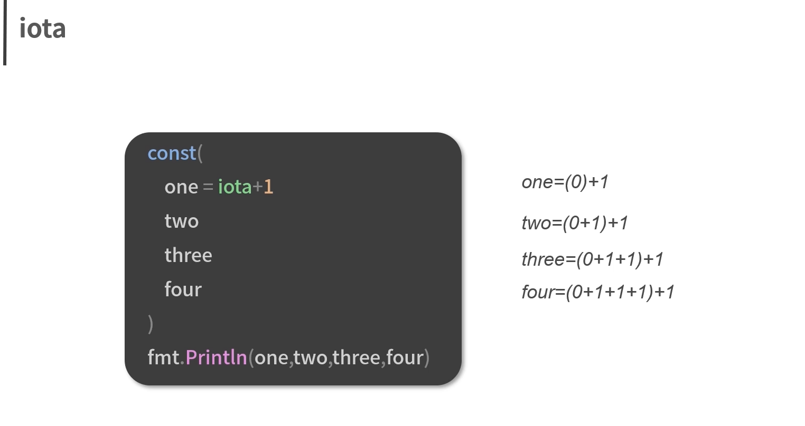
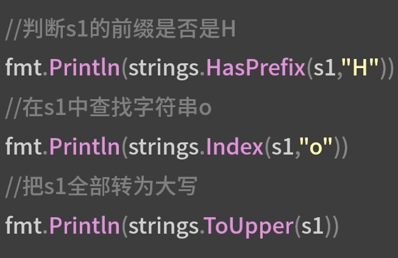
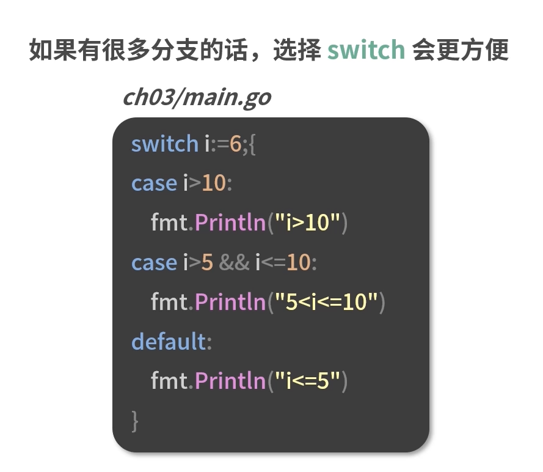

## Golang

`GOPATH`：Go语言项目的工作目录

`GOBIN`：Go编译生成的程序的安装目录

运行go程序：`go run main.go`

```go
// 代表的是一个可运行的应用程序
package main
 
// 导入 fmt 包
import "fmt"

// 程序的主入口
func main() {
	fmt.Printf("Hello world!")
}
```

`main`包是一个特殊的包，代表你的go语言项目是一个可运行的程序而不是被导入的库

跨平台编译：

`GOOS`：要编译的目标操作系统

`GOARCH`：代表要编译的目标处理器架构

定义变量：

```
var 变量名 类型 = 表达式
```

Go语言具有类型推导的功能，所以定义变量时可以无需刻意定义变量的类型。

```
var 变量名 = 表达式
```

定义多个变量

```
var (
		k int = 1000
		z = 10000
)
```

变量的简短声明`:=`

```
j := 100
```

指针对应的是变量在内存中的存储位置，也就说指针的值就是变量的内存地址

```go
pi := &i // 取地址
fmt.Println(pi, *pi)
```

定义常量：

```go
const name = "wi1shu"
```

`iote`常量生成器：



数据类型：


`int`和`uint`没有具体的bit大小，他们的大小和CPU有关，能确定int的bit就选择比较明确的int类型，这会让你的程序具备很好的移植性

字节`byte`类型等价于`uint8`类型，用于定义一个字节，字节`byte`类型也属于整型

浮点数就代表现实中的小数，最常用的是`float64`，因为它的精度高，浮点计算的结果相比`float32`误差会更小。

Go语言中的字符串可以表示为任意的数据，通过操作符 + 把字符串连接起来，得到一个新的字符串

零值其实就是一个变量的默认值，如果我们声明了一个变量，但是没有对其进行初始化，那么 Go 语言会自动初始化其值为对应类型的零值

Go语言是强类型的语言，不同类型的变量是无法相互使用和计算的，这也是为了保证Go程序的健壮性，不同类型的变量在进行赋值或者计算前，需要先进行类型转换

```go
i2s := strconv.Itoa(i) // int 转 str
s2i, err := strconv.Atoi(i2s) // str 转 int
fmt.Println(i2s, s2i, err)

i2f := float64(i)
f2i := int(i2f)
fmt.Println(i2f, f2i)
```

`strings`包是用于处理字符串的工具包，里面有很多常用的函数，帮助我们对字符串进行操作



复数

`if`：

```go
if i2 := i / 10; i2 > 10 {
	fmt.Println("i2 > 10")
} else if i2 < 10 && i2 > 0 {
	fmt.Println("i2 < 10 && i2 > 0")
} else {
	fmt.Println("?")
}
```

`switch`：



`switch`的`case`从上到下逐一进行判断，一旦满足条件，立即执行对应的分支并返回其余分支不再做判断

`switch`中的`fallthrough`


`case`后的值要和`;`后的表达式结果类型相同，之后`case`后的值会和`j`进行比较

`switch`语句非常强大，可以将表达式直接放在后面


 `for`：循环，三部分都可以省略

>```go
>for i, j := 1, 2; i < 10; i++ {
>// 循环体 
>}
>```
>
>这种效果可以实现C++中for循环定义多变量的效果。举一反三，if等语句中也可以


Go没有`while`循环，但是Go中的`for`可以当做`while`用


>个人总结：在这些语句中，`;`符号前面是进行赋值的语句，后面是进行比较的语句

continue 可以跳出本次循环，继续执行下一个循环
break 可以跳出整个 for 循环，哪怕 for 循环没有执行完，也会强制终止