测试代码

```python
import sys
import urllib
import urllib.request
import urllib.error


host = "192.168.159.128:5555?a=1 HTTP/1.1\r\nCRLF-injection: test\r\nTEST: 123"
url = "http://" + host + ":8080/test/?test=a"

try:
    info = urllib.request.urlopen(url).info()
    print(info)

except urllib.error.URLError as e:
    print(e)
```

测试截图

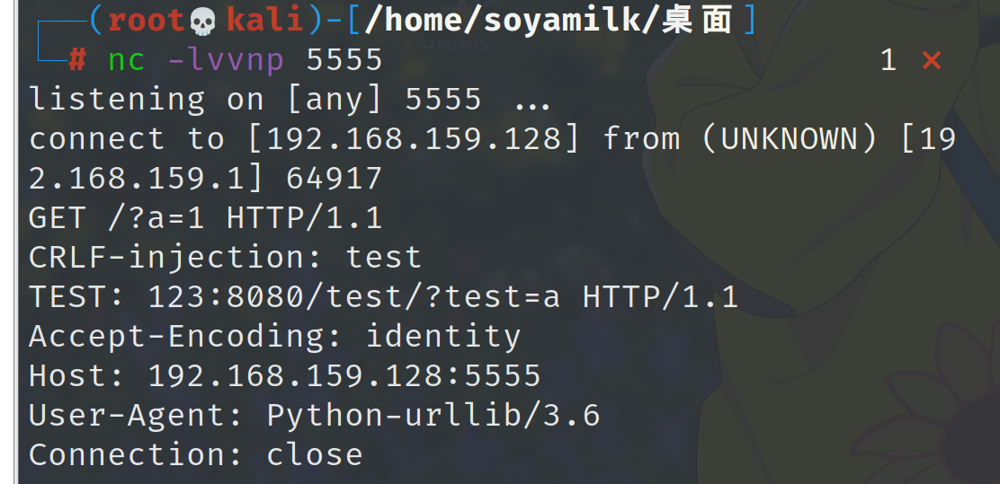

分析：

先进入到`urllib.request.urlopen`里面，`if`语句的用处就是设置了`_opener`，`opener` 是一个 `OpenerDirector` 对象，它处理URL的打开操作。可以通过创建一个 `OpenerDirector` 并对其添加 `Handler` 对象来定制这个 `opener`。`Handler` 对象可以处理各种情况，包括HTTP认证、重定向、Cookies等。下边`return`的部分是发包的部分，跟进到`open`函数里面。

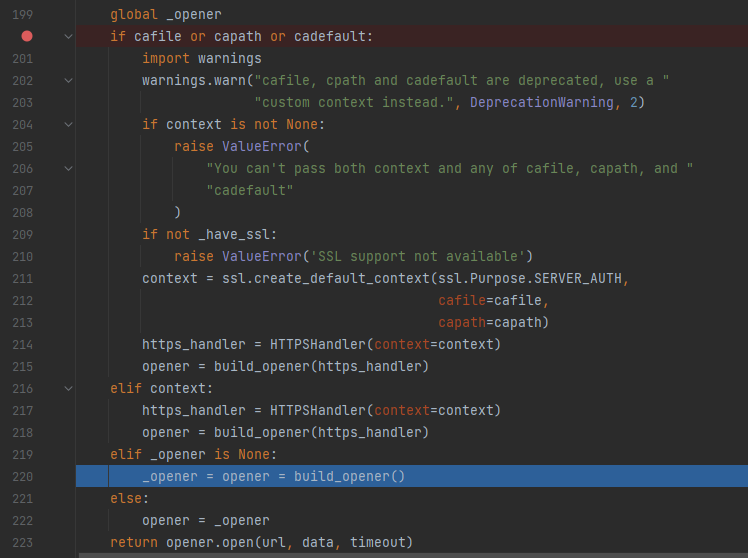

前面的代码对请求进行了url设置、超时设置、协议类型设置等一系列的参数设置之后，下面的`self._open`函数进行发包

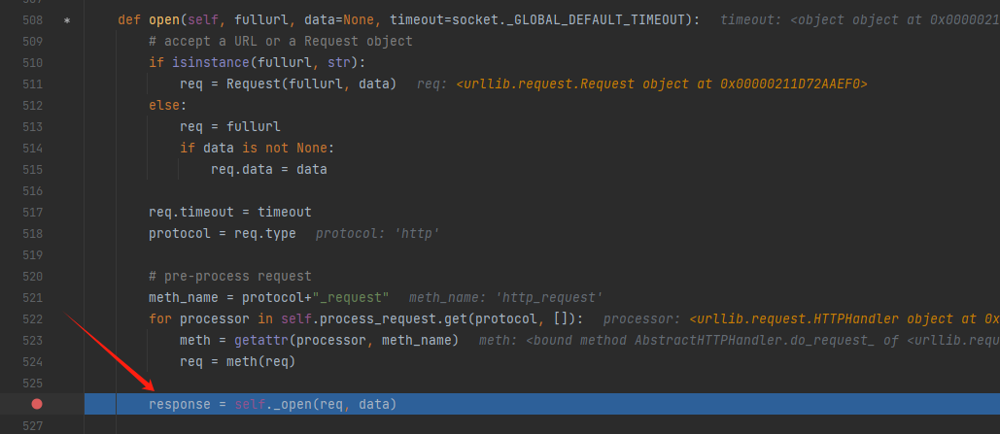

再跟进函数`self._call_chain`

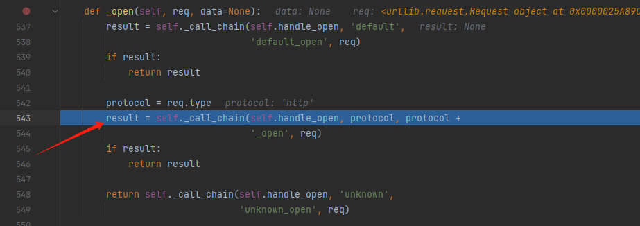

在里边的这个位置发起了请求包。	

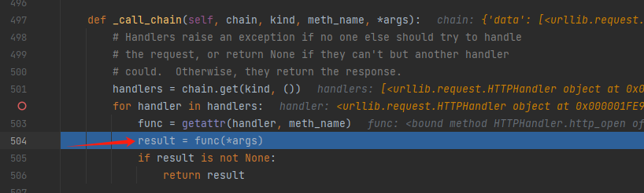

接下来分析为什么会造成这种类似于ssrf的效果，先看`full_url`变量的`setter`，它里面调用了`self._parse()`函数，跟进去

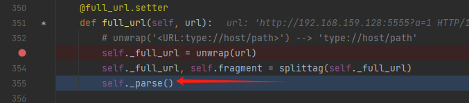

在这个函数里面把url的协议部分与host和参数部分进行了分割，然后传了回去，然后再将host和参数部分传入处理`host`的部分

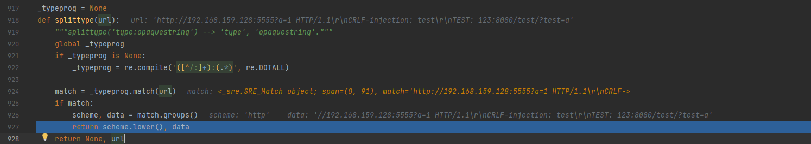

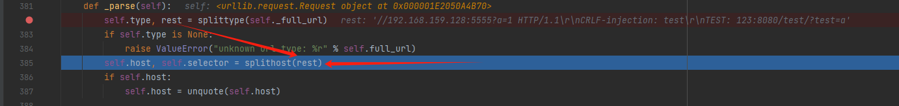


这里是`host`的处理位置

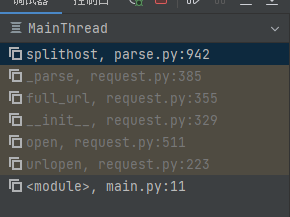

在这里面会将`host`部分和参数部分分割开来，利用正则表达式找到`/`或者`?`所在的地方进行分割，将前面的部分作为`host`，后面的部分作为参数传回，这样本来应该发送给`192.168.159.128:8080`的包就被发给了`192.168.159.128:5555`

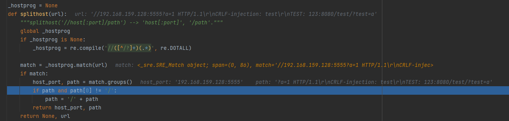

后面的修复手法就是在发包对应的位置添加了校验，不允许ascii码在00到32的所有字符和\x7f字符存在于url中。

```
_contains_disallowed_url_pchar_re = re.compile('[\x00-\x20\x7f]')

...

def _validate_path(self, url):
    """Validate a url for putrequest."""
    # Prevent CVE-2019-9740.
    match = _contains_disallowed_url_pchar_re.search(url)
    if match:
    	raise InvalidURL(f"URL can't contain control characters. {url!r} "
        				f"(found at least {match.group()!r})")
```

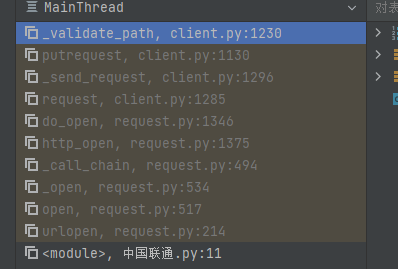

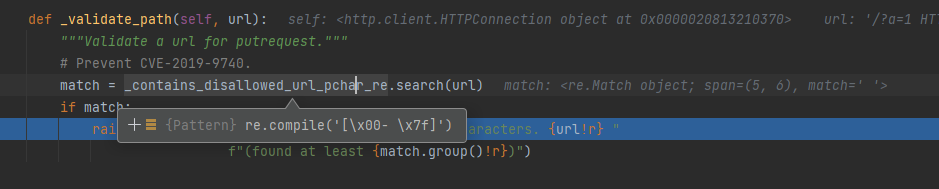