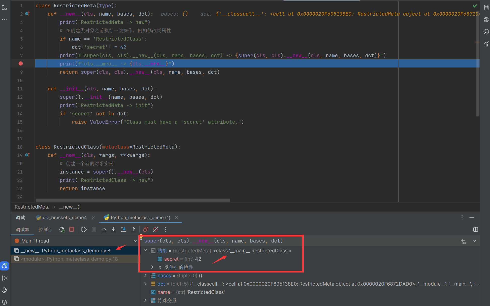
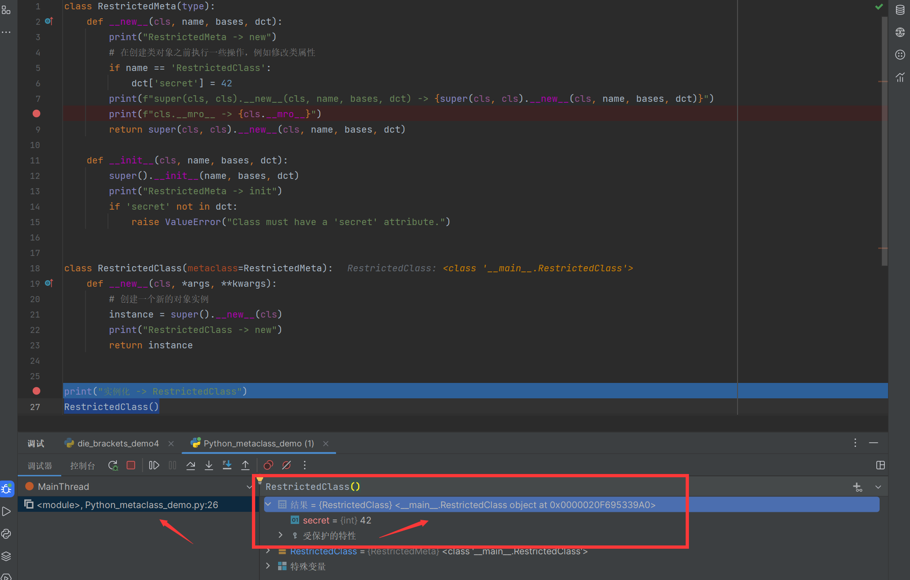

#### 元类

元类（metaclass）是一种高级的概念，用于控制类的创建过程。元类允许你在定义类时定制类的创建行为，类似于类是用于创建对象的模板，而元类是用于创建类的模板。

Python 中的每个类都有一个元类，如果没有显式地指定元类，Python 会使用默认的元类 `type` 来创建类。默认情况下，所有的类都是直接或间接地继承自 `object` 类，而 `object` 类是由 `type` 元类创建的。

使用元类可以实现一些高级的功能，例如：

1. 自定义类的创建行为：你可以定义自己的元类来控制类的创建过程，例如修改类的属性、方法，添加额外的功能等。

  ```python
  class MyMeta(type):
      def __new__(cls, name, bases, dct):
          # 在类创建之前，修改类的属性
          dct['x'] = 42
          return super().__new__(cls, name, bases, dct)

  class MyClass(metaclass=MyMeta):
      pass

  print(MyClass.x)  # 输出：42
  ```


2. 限制类的定义：通过定义元类，你可以在类定义时执行特定的检查或操作，从而限制类的定义。

  ```python
  class RestrictedMeta(type):
      def __new__(cls, name, bases, dct):
          print("RestrictedMeta -> new")
          # 在创建类对象之前执行一些操作，例如修改类属性
          if name == 'RestrictedClass':
              dct['secret'] = 42
          print(f"super(cls, cls).__new__(cls, name, bases, dct) -> {super(cls, cls).__new__(cls, name, bases, dct)}")
          print(f"cls.__mro__ -> {cls.__mro__}")
          return super(cls, cls).__new__(cls, name, bases, dct)

      def __init__(cls, name, bases, dct):
          super().__init__(name, bases, dct)
          print("RestrictedMeta -> init")
          if 'secret' not in dct:
              raise ValueError("Class must have a 'secret' attribute.")


  class RestrictedClass(metaclass=RestrictedMeta):
      def __new__(cls, *args, **kwargs):
          # 创建一个新的对象实例
          instance = super().__new__(cls)
          print("RestrictedClass -> new")
          return instance


  print("实例化 -> RestrictedClass")
  RestrictedClass()

  # class Restricted2Class(metaclass=RestrictedMeta):
  #     secret = 43

  # # 下面的代码会抛出 ValueError，因为没有定义 'secret' 属性
  # try:
  #     class AnotherClass(metaclass=RestrictedMeta):
  #         pass
  # except ValueError:
  #     print("AnotherClass -> " + str(ValueError))

  ```


3. 创建单例模式：使用元类，你可以确保类只有一个实例。

  ```python
  class SingletonMeta(type):
      _instances = {}

      def __call__(cls, *args, **kwargs):
          if cls not in cls._instances:
              cls._instances[cls] = super().__call__(*args, **kwargs)
          return cls._instances[cls]

  class SingletonClass(metaclass=SingletonMeta):
      def __init__(self, value):
          self.value = value

  obj1 = SingletonClass(42)
  obj2 = SingletonClass(99)

  print(obj1 is obj2)  # 输出：True，因为 obj1 和 obj2 引用的是同一个实例
  print(obj1.value)    # 输出：42
  print(obj2.value)    # 输出：42
  ```


以下是元类中一些常用的魔法方法及其作用：

1. `__new__(cls, name, bases, dct)`：

  - 该方法在**创建类**时被调用，并返回**类对象**的实例。
  - 参数 `cls` 是元类本身。
  - 参数 `name` 是要创建的类的名称。
  - 参数 `bases` 是类的基类，即父类。
  - 参数 `dct` 是类的属性字典，包含了在类定义中定义的所有类属性和方法。
  - 通过重写 `__new__` 方法，你可以自定义类的创建过程，包括修改类的属性、方法等。

2. `__init__(cls, name, bases, dct)`：

  - 该方法在**创建类**时被调用，用于初始化**类对象**。
  - 参数 `cls` 是元类本身。
  - 参数 `name` 是要创建的类的名称。
  - 参数 `bases` 是类的基类，即父类。
  - 参数 `dct` 是类的属性字典，包含了在类定义中定义的所有类属性和方法。
  - 在 `__init__` 方法中，通常不需要返回任何值，它用于执行额外的类初始化操作。

3. `__call__(cls, *args, **kwargs)`：

  - 该方法在**创建类**的实例时被调用。
  - 参数 `cls` 是元类本身。
  - 参数 `*args` 和 `**kwargs` 是创建实例时传递的参数。
  - 通过重写 `__call__` 方法，你可以自定义实例的创建过程，例如实现单例模式或控制实例的初始化。

4. `__prepare__(name, bases, **kwargs)`：

  - 该方法在创建类时被调用，用于准备类的属性字典。
  - 参数 `name` 是要创建的类的名称。
  - 参数 `bases` 是类的基类，即父类。
  - 参数 `**kwargs` 可以接收额外的关键字参数。
  - 通过重写 `__prepare__` 方法，你可以自定义类的属性字典，用于存储类的成员。

5. `__setattr__(cls, name, value)`：

  - 该方法在给类设置属性时被调用。
  - 参数 `cls` 是元类本身。
  - 参数 `name` 是属性名。
  - 参数 `value` 是属性的值。
  - 通过重写 `__setattr__` 方法，你可以在类创建时对属性进行特定的限制或操作。

6. `__getattribute__(cls, name)`：

  - 该方法在获取类的属性时被调用。
  - 参数 `cls` 是元类本身。
  - 参数 `name` 是属性名。
  - 通过重写 `__getattribute__` 方法，你可以在获取属性时执行额外的操作，例如记录日志或进行特定的处理。

7. `__instancecheck__(cls, instance)`：

  - 该方法在使用 `isinstance()` 检查类的实例时被调用。
  - 参数 `cls` 是元类本身。
  - 参数 `instance` 是要检查的实例对象。
  - 通过重写 `__instancecheck__` 方法，你可以自定义类的实例检查行为。

8. `__subclasscheck__(cls, subclass)`：

  - 该方法在使用 `issubclass()` 检查类的子类时被调用。
  - 参数 `cls` 是元类本身。
  - 参数 `subclass` 是要检查的子类。
  - 通过重写 `__subclasscheck__` 方法，你可以自定义类的子类检查行为。

元类中`__new__`和`__init__`的调用是在创建类也就是类定义时调用，而不是实例化类，返回的也是类对象，而不是类的实例



