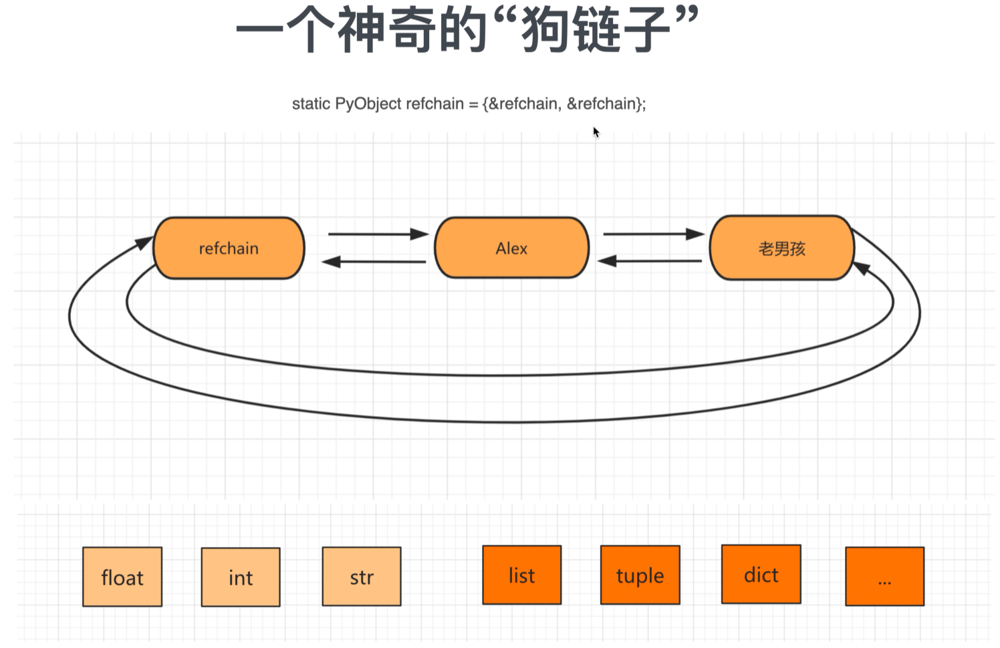

引用计数器为主

标记清楚和分代回收为辅

+缓存机制

## 引用计数器

### 环状双向链表 refchain

在python程序中创建的任何对象都会放在refchain链表中



不同类型的数据存进去不完全相同

```
# 常见每个对象内部会创建一个结构体，包括【上一个对象、下一个对象、类型、引用个数】，同时不同的类型数据也会存在不同的值
name = "小王"
# 这时候不会创建两个"小王"，而是将new_name指向name，引用个数加一
new_name = name

# 创建一个结构体，包括【上一个对象、下一个对象、类型、引用个数、val=21】
age = 21

# 创建一个结构体，包括【上一个对象、下一个对象、类型、引用个数、items=元素、元素个数】
hobby = ["a", 'b']
```

在C源码中如何体现每个对象中都有的相同的值: PyObject结构体 (4个值)
有多个元素组成的对象: PyObject结构体 (4个值) +ob_size 。（5个值）


### 类型封装结构体

```
data = 3.14

内部会创建：
	_ob_next
	_ob_prev
	ob_refcnt = 1
	ob_type = float
	ob_fval = 3.14
```

### 引用计数器

当python程序运行时，会根据数据类型的不同找到对应的结构体，根据结构体中的字段来进行创建相关的数据，然后将对象添加到refchain双向链表中。

在C源码中有两个关键的结构体：PyObject、PyVarObject

每个对象中有 ob_refcnt 就是引用计数器，值默认为1，当有其他变量引用对象时，引用计数器就会发生变化。

 

- 引用

  ```python
  a = 99999
  b = a
  ```

- 删除引用

  ```python
  a = 99999
  b = a
  del b # b变量删除；b对应对象引用计数器-1
  del a # a变量删除；a对应对象引用计数器-1
  
  # 当一个对象的引用计数器为0时，意味着没有人再使用这个对象了，这个对象就是垃圾，垃圾回收。
  # 回收：1.对象从refchain链表移除；2.将对象销毁，内存归还。
  ```


### 循环引用问题


### 标记清除

目的：为了解决引用计数器循环引用的不足。

实现：在Python的底层，再维护一个链表，专门存放那些可能存在循环引用的对象（list、tuple、dict、set）


在Python内部 `某种情况`下触发，回去扫描 `可能存在循环应用的链表`中的每个元素，检查是否有循环引用，如果有则让双方的引用计数器 -1 ；如果是0则垃圾回收。

问题：

- 什么时候扫描？
- 可能存在循环引用的链表扫描代价大，每次扫描耗时久。