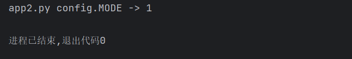
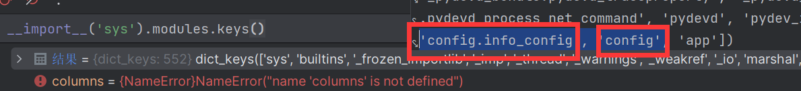
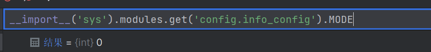
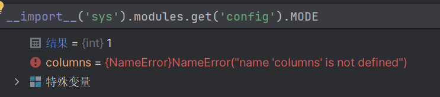

今日遇到一个问题，简述一下

`config`目录下的`info_config.py`

 `info_config.py` 

```
MODE = 1 
```

`config`目录下的`__init__.py`中的内容为 

`__init__.py`

```
 from config.info_config import * 
```

如果我在`app.py`里面这样导入 

```
from config import info_config
def set():
	info_config.MODE = 0

```

在`app2.py`里这样导入

```
from app import set
import config
set()
print("app2.py config.MODE -> "+str(config.MODE))

```

最后的结果会输出：



查看Python导入的模块，发现导入了两种`info_config`，第一种是直接导入`info_config`，第二种`config`导入`info_config`，然后`app2.py`导入`config`达到导入`info_config`的效果


在`app2.py`中，




如此可见，两种调用方式用的不是同一批变量，所以在以后开发的过程中要注意导入的内容，以防重复导入使程序变得臃肿