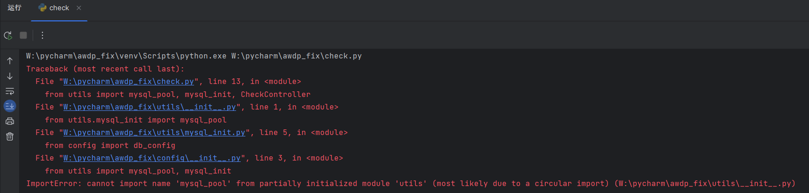
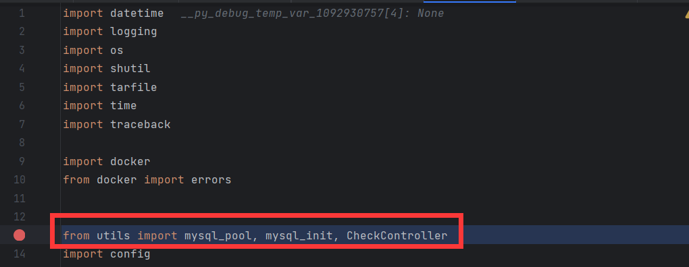
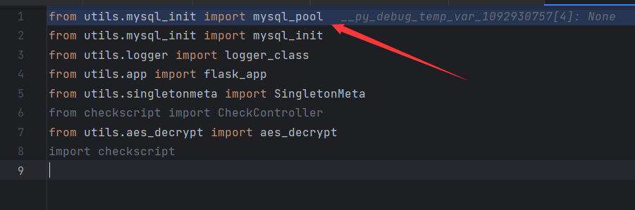
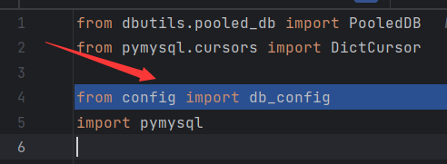
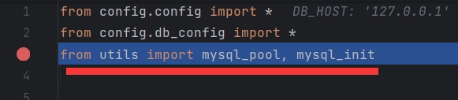
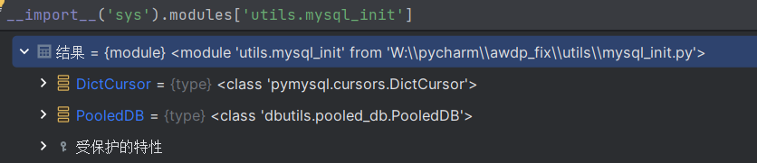
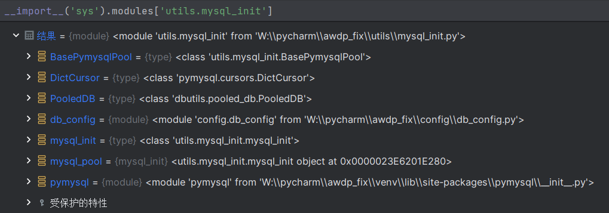

近日在开发过程中遇到了这个报错


意思是模块被循环调用了，于是便思考了一下循环调用是怎么产生的

首先是这里，调用了utils下的mysql_pool


然后到utils/\_\_init\_\_.py，调用了utils/mysql_init.py里面的mysql_pool()


因为mysql_pool在mysql_init.py里，并且mysql_pool是mysql_init类的一个为了实现单例模式而在模块里面定义的类的实例化，所以就再到utils/mysql_init.py，里面调用了config里的db_config，到这里就调用到了config/\_\_init\_\_.py


然后在db_config.py里再次调用了utils里的mysql_pool，这就导致了循环导入的问题


因为最开始导入的utils.mysql_pool还没有导入完毕，后续再次导入mysql_pool时，因为之前导入的mysql_pool还没有导入完毕，而要导入mysql_pool就必须要先导入mysql_init，所以在环境里面mysql_init这个模块已经被导入进去了，只是还没有导入完成


这时再次调用这个模块，因为已经存在了这个模块，所以Python不会再去导入这个模块，同时因为这个模块并没有导入完成，从而使得Python出现循环导入的问题。

导入成功的mysql_init



`config/__init__.py`

```python
from config.config import *
from config.db_config import *
from utils import mysql_init
```

`utils/__init__.py`

```python
from utils.mysql_init import mysql_pool
from utils.mysql_init import mysql_init
from utils.logger import logger_class
from utils.app import flask_app
from utils.singletonmeta import SingletonMeta
from checkscript import CheckController
from utils.aes_decrypt import aes_decrypt
import checkscript
```

`utils/mysql_init__.py`

```python
from dbutils.pooled_db import PooledDB
from pymysql.cursors import DictCursor

from config import db_config
import pymysql
```

在check.py中，为什么

```python
from utils import mysql_pool, mysql_init, CheckController
import config
```

这样就会报错，但是这样

```python
import config
from utils import mysql_pool, mysql_init, CheckController
```

就不会报错,因为

在Python中，模块在被导入时会立即执行。如果一个模块依赖于另一个模块，那么需要先导入依赖的模块。

在代码中，`check.py` 文件试图从 `utils` 模块导入 `mysql_pool`、`mysql_init` 和 `CheckController`。然而，`utils` 模块中的 `mysql_init` 又依赖于 `config` 模块。如果你先尝试从 `utils` 导入，那么 `utils` 模块将被立即执行，但此时 `config` 模块还没有被导入，所以会执行一次`config`模块，而`config`中又依赖于`mysql_init`，而`mysql_init`模块还没导入完成，所以就形成了循环导入。

而如果你先导入 `config` 模块，那么当你从 `utils` 导入时，`config` 模块已经存在，`utils` 模块可以正常执行，不会报错。