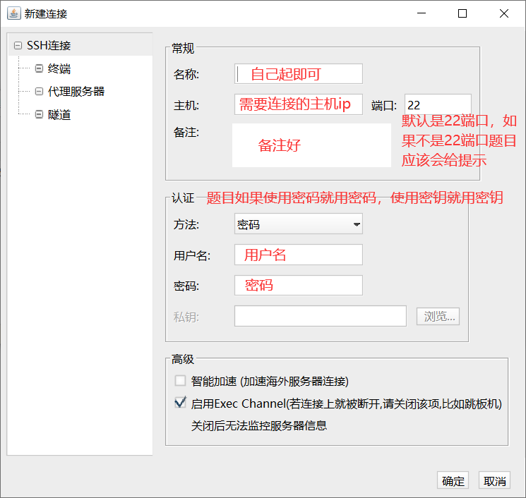

# AWD plus

## 什么是awdp

AWDP是一种综合考核参赛团队攻击、防御技术能力、即时策略的攻防兼备比赛模式。每个参赛队互为攻击方和防守方，充分体现比赛的实战性、实时性和对抗性，对参赛队的渗透能力和防护能力进行综合全面的考量。

比赛中，每支队伍拥有相同配置的虚拟靶机，参赛队员需对平台中的GameBox发起攻击，并向平台提交正确的flag（证明自己具备对该题的攻击能力）；在此期间，由平台以轮次制的方式向参赛队伍的靶机发起攻击，检查其他选手的漏洞是否修补成功，若修补成功则认为参赛队伍具备该漏洞的防御能力。

## CTF、AWDp和AWD的区别

AWDplus和AWD**有很大的区别**，更加类似于CTF。AWDplus的赛题一般只有web+pwn。AWDplus的攻击环节一般就是CTF，并且多为白盒CTF。防守环节即对题目进行修复，如果修复完成之后裁判的exp打不通即为修复成功。

我对AWDplus的感受就是防守的重要性远大于攻击，因为AWDplus一般都是提供源码的，这就注定了题目的难度不会很简单，并且防守一般都是一轮一轮的按照轮次加分，如果前期防守的好后面可以吃很多很多的分。

### 攻击

- 与CTF完全一致，只需攻击自己的靶机，一旦获取到flag后，每轮次自动加分
- 题目通常都提供源代码，用于编写防御代码的同时也便于进行白盒审计
- 每个队伍只能访问自己的靶机

### 防御

- 一种为无法直接使用SSH登陆到靶机，另一种为ssh登录靶机修复之后，会对相应靶机进行重置。因此无法进行流量分析
- 提交修复文件，其中包含修复脚本，修复脚本执行完成后由平台发起测试攻击，判定是否修复成功。或者ssh登录靶机直接对源代码进行修复，当check时间到了之后平台发起攻击，判定是否修复成功
- 修复成功后每轮自动加分
- 测试攻击包含正常请求和攻击请求
- 如果攻击请求测试成功，则判定为修复失败
- 如果正常请求访问失败，则判定为宕机(CheckDown)
- 大多数题目提供一键还原靶机到初始状态的功能，修复尝试次数一般有限制(10次、20次等)

### 总结

总结一下我们可以发现， AWDP虽然名为AWD Plus ，但是其实是AWD的简化版
AWDP的攻击环节与CTF基本完全一致，仅计分方式采用类似AWD的方式
AWDP的相比CTF多了防守环节，但是无法进行流量分析和反打
AWDP通过禁用各种AWD的技巧以防止搅屎捣乱，在公平性上更胜一筹，但是也一定程度上失去了真实实时对抗的展现，更注重对代码审计的考察，我个人认为还是叫CTF-Plus-Defense更加能体现AWDP的本质

## awdp进行的防御方式

### 服务器ssh连接

平台会提供对应题目环境的用户名和密码，可以通过一些ssh连接工具链接对应的靶机，例如MobaXterm、FinalShell（我自己常用）、Xshell等，进入题目环境后到题目部署的路径进行源码的更新。

> **如何进行ssh连接？**
>
> 以finalshell为例
> [FinalShell SSH工具,服务器管理,远程桌面加速软件,支持Windows,macOS,Linux,版本4.2.4 - FinalShell官网 (hostbuf.com)](http://www.hostbuf.com/t/988.html)
>
> 打开之后点击左上角文件夹形状图标
> 
>
> 点击右上角第一个文件夹形状图标，选择SSH链接
> 
>
> 根据提示进行填写后连接即可
> 
>
> 示例：
> 
>
> 


### 编写.sh文件

[CISCN西南复赛AWDPlus Web – fushulingのblog](https://fushuling.com/index.php/2023/06/13/ciscn西南复赛awdp-web/)

[【CTF】AWDP总结（Web）_ctf web总结_Sunlight_614的博客-CSDN博客](https://blog.csdn.net/weixin_51614272/article/details/125527593)

**什么是.sh文件？**

[shell是什么？bash是什么？_什么是shell文件_listen_road_wind的博客-CSDN博客](https://blog.csdn.net/listen_road_wind/article/details/110390163)


这种平台一般会提供一个文件上传的接口，让选手上传.tar.gz格式压缩包，其中包含更新源码所用的`update.sh`和需要更新的源代码文件，`update.sh`中需包含在题目环境中更新源代码的命令，将update.sh和修复完成的源代码文件打包成.tar.gz格式压缩包上传至修复平台并通过后完成Fix，得到相应分数。一般.sh文件中会限制使用一些命令，例如限制使用cp，mv，chmod命令

># 示例
>
>#### update.tar.gz目录结构
>
>```
># tree update/
>update/
>├── some_files
>└── update.sh
>```
>
>#### update目录打包为update.tar.gz命令
>
>```
>tar -cvzf update.tar.gz index.php update.sh
>```
>
>直接使用bandzip也可以进行`.tar.gz`格式打包
>
>
>
>#### 注意事项
>
>+ web目录或pwn目录请多留意题目描述、题目附件。
>+ 修改的原则尽可能只在漏洞相关的文件上，请勿更改其他文件。
>+ 执行脚本的文件名必须是update.sh
>+ 请注意update.sh是Linux文件格式。DOS转化为Linux文件格式，可以使用dos2unix命令。
>+ 请勿添加无关命令，所有上传包都会备份。
>+ 请注意耗时。

压缩包示例：


`update.sh`示例：


```
#!/bin/bash

#!/bin/sh
```

## awdp后台check方式

### 按照轮次进行check

如果是按照轮次进行check，那么刚开始进行的修复就非常重要，因为一般在前面轮次修复完成之后，后面轮次直接加上已经修复的题目的得分，如果第一轮修复的题目数量可观，后面轮次能够一直吃前面轮次的分，最后得分就会非常高，一定要把确定的题目率先修复好。


### 自行进行check

这种check方式一般都和第二种防御方式一起出现，选手上传了修复包之后，可以申请check，一般都会有申请的次数和重置环境的次数，但是次数绝对够用，如果check通过的话就可以得分或者和第一种方式相结合，按照轮次进行加分，这样的话前几轮的修复就非常重要，前几轮修复成功的多后面能一直吃分。

总之，防御的前几轮次非常重要，建议在攻击的时候就开始思考如何进行防御，打不出来的题就想想这道题目可能的攻击方式，尽量从多个方面去进行防御，再不行就直接上通防，多尝试说不定就修复成功了。

## 代码审计技巧

### 代码审计工具

seay源代码审计系统、D盾


### 寻找漏洞点

寻找功能点，最好是能够找到具体存在漏洞的位置，或者寻找源代码中进行了黑白名单校验的地方，说不定就有过滤不完全的payload能够绕过。

```
文件包含：include、require
SSRF：curl
sql注入：sql、登录框（万能密码）、各种sql语句拼接
php伪协议 / phar反序列化：file_get_contents()、file_put_contents()、fopen()、readfile()、copy()、file()、
RCE：eval()、assert()、preg_replace()、create_function()、system()、exec()、shell_exec()、popen()
PHP反序列化：unserialize()
文件上传接口位置
各种写入日志的位置
进行了黑白名单校验了的位置
```

## 漏洞修复技巧

### 针对特定漏洞进行修复

#### sql注入

进行预处理操作，或者使用正则过滤掉危险字符或者白名单只运行放通部分字符，或者对特殊的字符进行转义

```php
// 预处理
// 先建立与数据库的链接
$servername = "localhost";
$username = "your_username";
$password = "your_password";
$dbname = "your_database";

$conn = new mysqli($servername, $username, $password, $dbname);

// 准备sql语句，利用占位符?占位
$sql = "INSERT INTO users (username, email) VALUES (?, ?)";
// 使用mysqli_prepare函数创建预处理语句对象，并将SQL查询传递给它。
$stmt = $conn->prepare($sql);
// 使用mysqli_stmt_bind_param函数将实际参数值绑定到占位符上。
$username = "xiaoming";
$email = "xiaoming@example.com";
$stmt->bind_param("ss", $username, $email); // 第一个参数"ss"表示两个参数都是字符串类型。如果有不同类型的参数，需要相应的进行修改

// 执行预处理的语句
if ($stmt->execute()) {
    echo "successfully.";
} else {
    echo "Error: " . $stmt->error;
}

// 关闭连接
$stmt->close();
$conn->close();
```

`addslashes()` `mysqli_real_escape_string()`

```php
// 对特殊的字符进行转义
$user_input = "user input";
$escaped_input = addslashes($user_input);

// 然后在SQL查询中使用 $escaped_input
$sql = "INSERT INTO table_name (column_name) VALUES ('$escaped_input')";

/*
mysqli_real_escape_string() 函数接受两个参数：
1. 数据库连接对象。
2. 待转义的字符串。
*/
$input = "user query";
$escaped_input = mysqli_real_escape_string($conn, $input);

$sql = "SELECT * FROM users WHERE name = '$escaped_input'";
```

#### SSRF

[php中常见可能产生ssrf漏洞的函数 | Dar1in9's Blog (dar1in9s.github.io)](https://dar1in9s.github.io/2020/04/26/php/php中常见可能产生ssrf漏洞的函数/#curl)

只允许使用对应的协议，或者正则匹配ssrf中常见的协议，将其替换

```php
// 初始化 cURL
$ch = curl_init();

// 设置 cURL 选项
curl_setopt($ch, CURLOPT_URL, "https://example.com"); // 设置要访问的 URL

// 限制只使用 HTTP 和 HTTPS 协议
curl_setopt($ch, CURLOPT_PROTOCOLS, CURLPROTO_HTTP | CURLPROTO_HTTPS); 

// 执行 cURL 请求
$response = curl_exec($ch);

// 检查是否有错误发生
if ($response === false) {
    echo "cURL 错误: " . curl_error($ch);
} else {
    // 处理响应
    echo "响应内容: " . $response;
}

// 关闭 cURL 资源
curl_close($ch);

```

```php
<?php
$url = "http://192.168.101.111/index.php";

# 创建一个curl句柄
$ch = curl_init();

$url = preg_replace('/gopher|file|dict|127\.0\.0\.1|localhost/i','hack',$url);

# 设置响应选项 
curl_setopt($ch, CURLOPT_URL, $url);   // 设置访问的url
curl_setopt($ch, CURLOPT_RETURNTRANSFER, 1);    // curl请求执行时，将结果返回，而不是直接输出

# 执行curl请求，返回结果到变量
$response = curl_exec($ch);             

# 关闭curl句柄
curl_close($ch);
echo $response; 
```

#### 文件包含

进行白名单校验或者使用正则匹配掉危险payload

```php
$shell = preg_replace('/\.\.|\/|flag|:\/\/|php|file|data|phar|zip|/i','hack',$url);
```

#### PHP反序列化

在特定位置添加魔术方法__wakeup破坏payload或者直接正则匹配破坏payload

以下面的题为例

```php
<?php
error_reporting(0);
highlight_file(__FILE__);
class QvQ{
    public $name;
    public $like;
    function __construct(){
        $this->name = "未来的Web神";
        $this->like = "op";
    }
    function __wakeup(){
        if($this->like != md5($this->like)){
            $this->name = "web狗";
            echo "醒醒吧，web狗";
        }
    }
    public function __destruct()
    {
        echo "Welcome here ^.^".$this->name;
    }
}
class OvO{
    public $obj;
    public function __clone(){
        echo "__clone() ";
        ($this->obj)();
    }
}
Class UvU{
    public $gaga;
    public $lady;
    public function __toString()
    {
        echo "__toString() ";
        $lady = clone($this->gaga);
    }
}
Class FvF{
    public $name = "invoke";
    public function __invoke()
    {
        echo "__invoke() ";
        echo file_get_contents("/flag");
    }
}
$_ = new QvQ();
if(isset($_GET['pop'])){
    unserialize($_GET['pop']);
}
```

可以在最后`UvU`里加上__wakeup使其无法完成读取flag

```php
Class UvU{
    public $gaga;
    public $lady;
    
    function __wakeup(){
        $this->gaga = 'nonono';
    }
    
    public function __toString()
    {
        echo "__toString() ";
        $lady = clone($this->gaga);
    }
}
```

也可以在反序列化部分直接进行过滤

```php
$_ = new QvQ();
if(isset($_GET['pop'])){
    $_GET['pop'] = preg_replace('/FvF/i','',$_GET['pop']);
    unserialize($_GET['pop']);
}

```

#### 文件上传

对文件的格式、内容进行校验，并对文件进行重命名操作

```php
<?php
if ($_SERVER["REQUEST_METHOD"] == "POST") {
    $targetDir = "uploads/"; // 上传目标文件夹
    $targetFile = $targetDir . basename($_FILES["fileToUpload"]["name"]);
    $uploadOk = true;
    $fileType = strtolower(pathinfo($targetFile, PATHINFO_EXTENSION));

    // 检查文件类型
    if ($fileType != "jpg" && $fileType != "png" && $fileType != "jpeg" && $fileType != "gif") {
        echo "只允许上传 JPG, JPEG, PNG, GIF 文件.";
        $uploadOk = false;
    }
    
    // 检查文件头
    if (!exif_imagetype($_FILES['uploadedfile']['tmp_name'])) {
        echo "File is not an image";
        $uploadOk = false;

    }

    // 检查文件大小（这里限制为 2MB）
    if ($_FILES["fileToUpload"]["size"] > 2000000) {
        echo "文件太大，最大允许 2MB.";
        $uploadOk = false;
    }

    // 检查上传是否成功
    if ($uploadOk) {
        // 生成新的文件名，可以使用时间戳等方式
        $newFileName = uniqid() . "." . $fileType;
        $newFilePath = $targetDir . $newFileName;

        // 移动上传文件到目标位置并重命名
        if (move_uploaded_file($_FILES["fileToUpload"]["tmp_name"], $newFilePath)) {
            echo "文件上传成功，新文件名为: " . $newFileName;
        } else {
            echo "文件上传失败.";
        }
    } else {
        echo "文件未上传.";
    }
}
?>

```

```php
<?php
function checkFileType($fileName){ 
  $file = fopen($fileName, "rb"); 
  $bin = fread($file, 2); //只读2字节 
  fclose($file); 
 // C为无符号整数，网上搜到的都是c，为有符号整数，这样会产生负数判断不正常
  $strInfo = @unpack("C2chars", $bin);
  $typeCode = intval($strInfo['chars1'].$strInfo['chars2']); 
  $fileType = ''; 

 switch( $typeCode )
 {
 case '255216':
 return $typeCode. ' : ' .'jpg';
 break;
 case '7173':
 return $typeCode. ' : ' .'gif';
 break;
 case '13780':
 return $typeCode. ' : ' .'png';
 break;
 case '6677':
 return $typeCode. ' : ' .'bmp';
 break;
 case '7790':
 return $typeCode. ' : ' .'exe';
 break;
 case '7784':
 return $typeCode. ' : ' .'midi';
 break;
 case '8297':
 return $typeCode. ' : ' .'rar';
 break;
 default:
 return $typeCode. ' : ' .'Unknown';
 break;
 }
 //return $typeCode;
 }

$file_name = '11.doc';
echo checkFileType($file_name);
```

#### 命令执行

对于有可控执行命令的地方，可以限制其可控部分，例如过滤掉命令拼接符号等

```php
$payload = preg_replace('/[;|\|+|&+]/i','',$payload);
```

### 进行正则匹配

不管是什么漏洞都能够运用正则匹配进行防御，在没有找到具体的漏洞点的时候，尽可能多猜测漏洞可能存在的位置，在对应的位置前加上正则匹配破坏payload，就有可能够防御成功。

```php
// rce的waf
function wafrce($str){
	return !preg_match("/openlog|syslog|readlink|symlink|popepassthru|stream_socket_server|scandir|assert|pcntl_exec|fwrite|curl|system|eval|assert|flag|passthru|exec|chroot|chgrp|chown|shell_exec|proc_open|proc_get_status|popen|ini_alter|ini_restore/i", $str);
}

// sql注入waf
function wafsqli($str){
	return !preg_match("/select|and|\*|\x09|\x0a|\x0b|\x0c|\x0d|\xa0|\x00|\x26|\x7c|or|into|from|where|join|sleexml|extractvalue|+|regex|copy|read|file|create|grand|dir|insert|link|server|drop|=|>|<|;|\"|\'|\^|\|/i", $str);
}

// xss的waf
function wafxss($str){
	return !preg_match("/\'|http|\"|\`|cookie|<|>|script/i", $str);
}

// 将/都替换为空
$this->file = preg_replace('/(\/\/*)/i','',$this->file);

// 过滤字母a-z 数字0-9和各种特殊字符
$this->file = preg_replace('/[a-z0-9]|<|>|\\?|\\[|\\]|\\*|@|\\||\\^|~|&|\s/i','', $this->file);
```

### 上waf

对于没有思路的题目，直接上通防，直接上通防也非常有可能防御住payload的。

### 偷鸡技巧

*如果破坏环境不扣分的情况下，可以直接破坏具体功能点，例如文件上传压缩包，你让他上传压缩包，但是把压缩包里面的内容删除，或者是登录框，直接破坏他的登录功能，但是都返回登陆成功，这样有几率躲过check对环境的校验。再者就是删除他的具体功能，php有可控的include函数就直接给他注释掉*


