# Bugku par 网络安全事件应急响应

## 网络安全事件应急响应

### 提交攻击者的 IP 地址

` awk '{print $1}' access.log | sort | uniq -c | sort -nr`

查看访问最多的 ip 即为攻击者 ip

>1. `awk '{print $1}' access.log`：使用 `awk` 命令打印 `access.log` 文件中每一行的第一个字段，通常这个字段是客户端的 IP 地址。
>2. `| sort`：管道操作符 `|` 将 `awk` 的输出传递给 `sort` 命令，`sort` 将接收到的所有行进行排序。这是为了让相同的 IP 地址可以聚集在一起，以便 `uniq` 命令可以计算它们。
>3. `| uniq -c`：再次使用管道操作符将排序后的数据传递给 `uniq` 命令。`uniq` 命令用于过滤掉连续重复的行，并且 `-c` 选项会在每行前面加上该行在 `sort` 输出中出现的次数，也就是每个 IP 地址出现的次数。
>4. `| sort -nr`：最后一次使用管道将 `uniq` 的输出传递给 `sort` 命令，`-n` 选项指示 `sort` 根据行的数值进行排序，而 `-r` 选项则表示逆序排序（从大到小）。

或者查看日志寻找明显存在可疑操作的 ip

查找日志：`/var/crash# find / -regex ".*access.*\.log"`

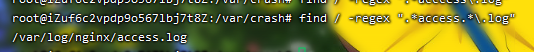

筛选响应码 200 的请求：`awk '$9==200' access.log > o.txt`

找到明显可疑的请求

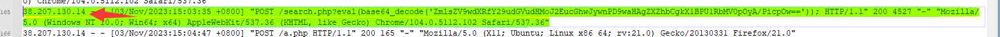

### 提交攻击者目录扫描所使用的工具名称

翻日志就能看到

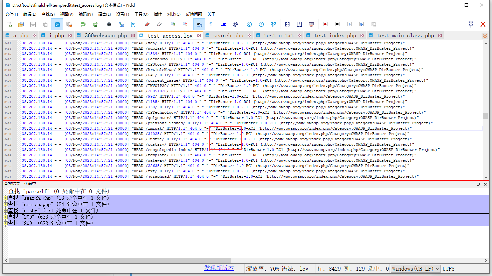

### 提交攻击者首次攻击成功的时间

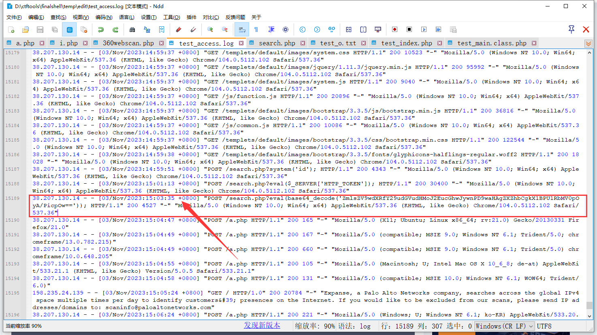

解码base64为写入一句话木马

```
38.207.130.14 - - [03/Nov/2023:15:03:35 +0800] "POST /search.php?eval(base64_decode('ZmlsZV9wdXRfY29udGVudHMoJ2EucGhwJywnPD9waHAgZXZhbCgkX1BPU1RbMV0pOyA/PicpOw==')); HTTP/1.1" 200 4527 "-" "Mozilla/5.0 (Windows NT 10.0; Win64; x64) AppleWebKit/537.36 (KHTML, like Gecko) Chrome/104.0.5112.102 Safari/537.36"
```

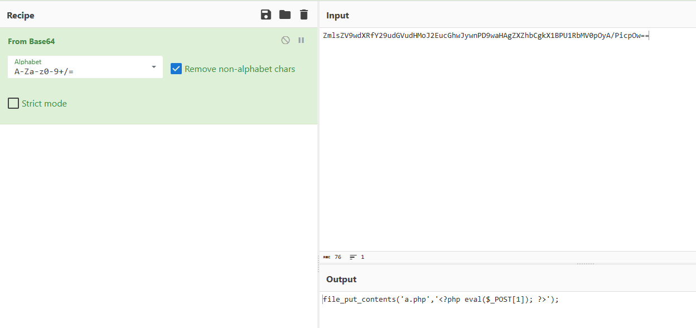

### 找到攻击者写入的恶意后门文件

由上面可以看出是`a.php`

### 找到攻击者写入的恶意后门文件密码

可看到密码为`1`

### 找到攻击者隐藏在正常web应用代码中的恶意代码

用D盾扫一下，可以看到`include/webscan/360webscan.php`

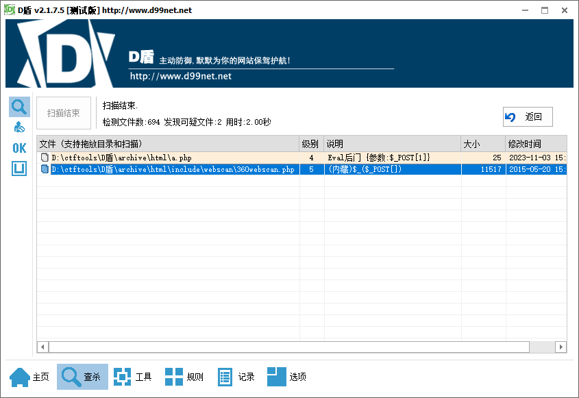

里面藏着一段命令执行的代码

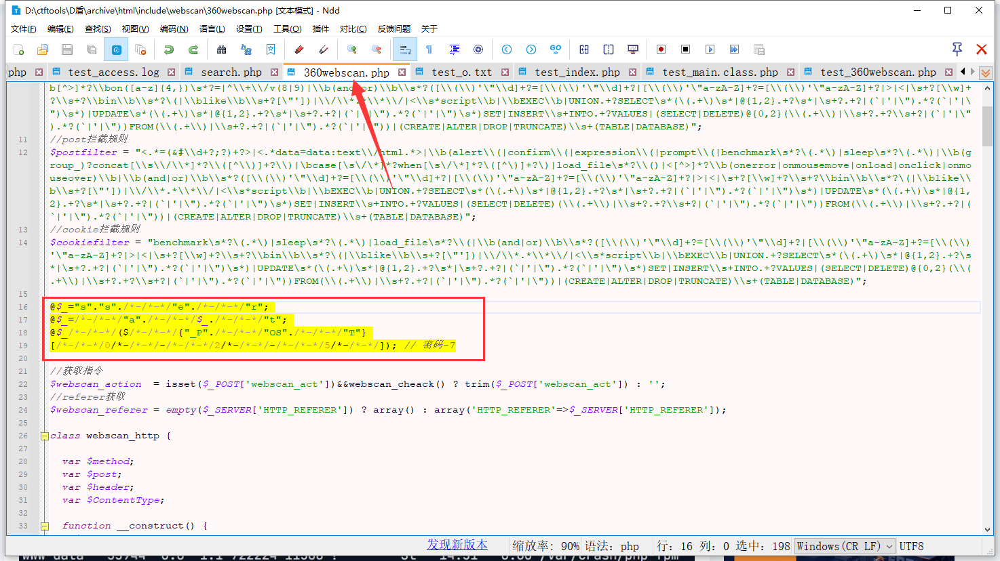

### 识别系统中存在的恶意程序进程

查看定时任务，可以看到`www-data`用户有定时任务，查看他的定时任务，发现它定时启动了`/var/crash/php-fpm`这个文件，下载文件之后，放到天穹沙箱内分析

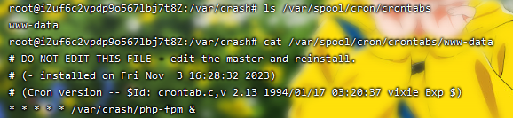

>1. **查看 Cron 作业**: 每个用户的 Cron 作业都存储在 `/var/spool/cron/crontabs` 目录中，每个文件以相应用户的用户名命名。您可以使用 `ls` 命令查看这个目录中有哪些文件，每个文件代表一个用户的 Cron 作业。
>
>   ```
>   ls /var/spool/cron/crontabs
>   ```
>
>2. **查看特定用户的 Cron 作业**: 要查看特定用户的 Cron 作业，您可以使用 `cat`、`less` 或 `more` 命令。由于这些文件的权限设置通常不允许直接查看，因此您需要以 root 身份执行这些命令。
>
>   例如，要查看用户名为 `username` 的用户的 Cron 作业，您可以使用：
>
>   ```
>   sudo cat /var/spool/cron/crontabs/username
>   ```
>
>   或者，如果您已经是 root 用户，可以直接使用：
>
>   ```
>   cat /var/spool/cron/crontabs/username
>   ```
>
>3. **使用 `crontab` 命令**: 对于每个用户，您也可以使用 `crontab` 命令以更安全的方式查看他们的 Cron 作业。作为 root 用户，您可以为任何用户指定 `-u` 选项来查看他们的 Cron 作业。
>
>   例如，查看 `username` 的 Cron 作业：
>
>   ```
>   crontab -u username -l
>   ```
>
>请注意，直接查看或编辑 `/var/spool/cron/crontabs` 目录下的文件不是推荐的做法，因为这可能会绕过某些安全和一致性检查。建议使用 `crontab -e` 来编辑 Cron 作业，使用 `crontab -l` 来查看 Cron 作业。

再执行`ps -ef`，发现启动了大量的`/var/crash/php-fpm`，猜测其为恶意程序

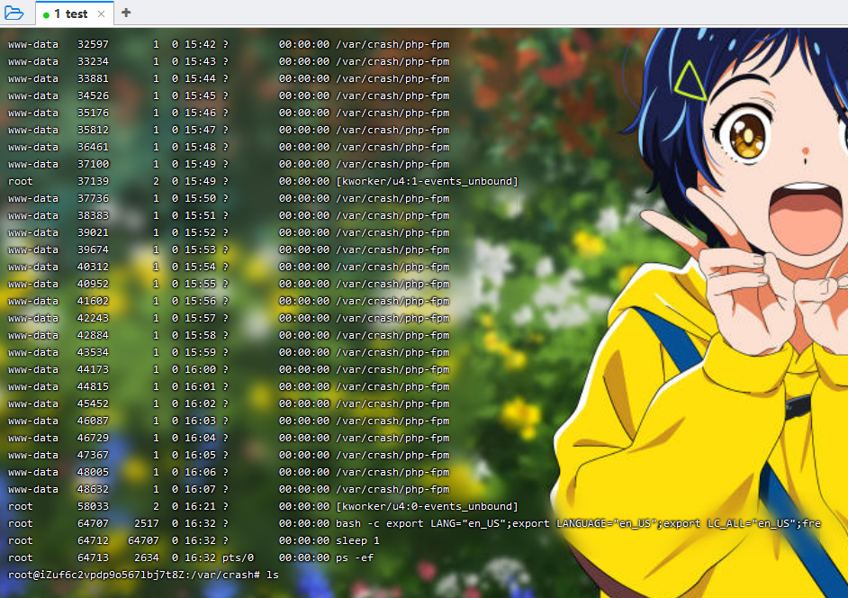

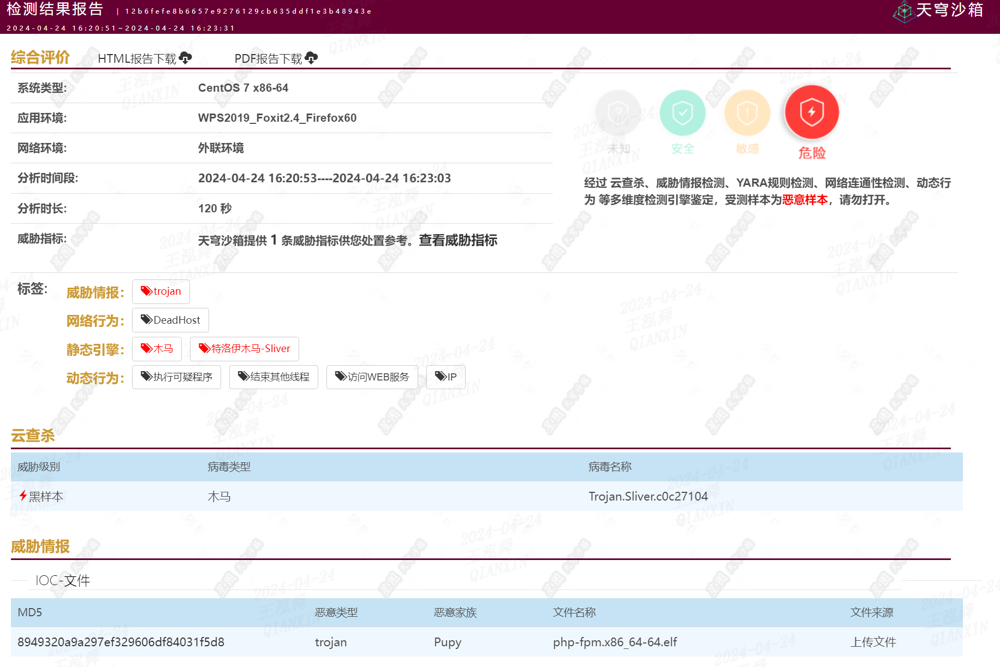

>`ps -ef` 和 `ps aux` 都是在Unix和类Unix系统中使用的命令，用以显示当前运行的进程信息。尽管这两个命令都是用来列出系统中的进程，但它们的格式和底层使用的选项有所不同。
>
>#### `ps -ef`的解释：
>
>- **`-e`** 选项是用来选择所有进程的。
>- **`f`** 选项用于显示完整的格式输出，这个输出格式会提供进程间的层级关系，比如父进程与子进程的关系。
>
>输出通常包括以下列：`UID`（用户ID）、`PID`（进程ID）、`PPID`（父进程ID）、`C`（CPU利用率）、`STIME`（启动时间）、`TTY`（终端类型）、`TIME`（CPU时间）和`CMD`（命令名/执行的指令）。
>
>#### `ps aux`的解释：
>
>- **`a`** 选项表示显示所有用户的进程。
>- **`u`** 选项表示用户友好的风格，输出更多关于进程所有者的信息。
>- **`x`** 选项表示也显示没有控制终端的进程。
>
>输出通常包括：`USER`（拥有者）、`%CPU`（CPU使用率）、`%MEM`（内存使用率）、`VSZ`（虚拟内存大小）、`RSS`（常驻集大小，实际使用的物理内存大小）、`TTY`（终端类型）、`STAT`（进程状态）、`START`（启动时间）、`TIME`（CPU时间），和`COMMAND`（命令名/执行的指令）。
>
>#### 主要区别：
>
>1. **输出格式**：`ps -ef` 提供了一个标准的详细输出，包括了进程的层级关系，而 `ps aux` 提供了更多关于进程使用资源的信息，比如CPU和内存使用率。
>2. **选项差异**：`ps -ef` 使用了POSIX和UNIX标准的选项，而 `ps aux` 更多的是遵循BSD风格的选项。因此，`ps aux` 在一些系统上可能需要写作 `ps aux` 而不是 `ps -aux`，以避免与GNU `ps` 命令的 `-a` 选项冲突。
>
>总体来说，这两个命令各有侧重点，`ps -ef` 更侧重于进程之间的关系，而 `ps aux` 更侧重于进程的资源使用情况。具体使用哪一个，取决于您需要查看的信息类型。

### 识别系统中存在的恶意程序进程

查看报告里给出了外联地址，或者运行程序，查看`netstat -anotp`

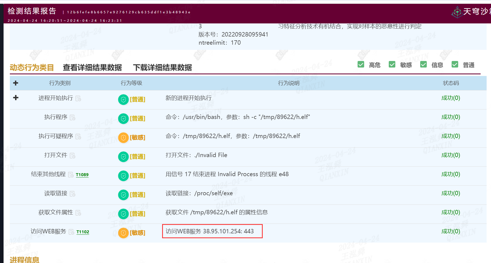

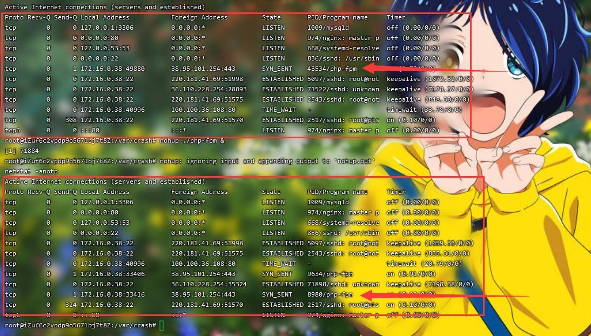

### 修复网站漏洞

打开首页发现使用的`海洋CMS` 搜索资料得到修改`/var/www/html/include/main.class.php`文件里面的`parseIf`方法，在数组后面加入一个成员`_SERVER`

### 、删除恶意程序、文件、代码

1. 删除上面`/var/www/html/include/webscan/360webscan.php`中找到的恶意代码
2. 删除`webshell`文件`/var/www/html/a.php`
3. 删除恶意程序`/var/crash/php-fpm`
4. 删除定时任务`crontab -e -u www-data`
