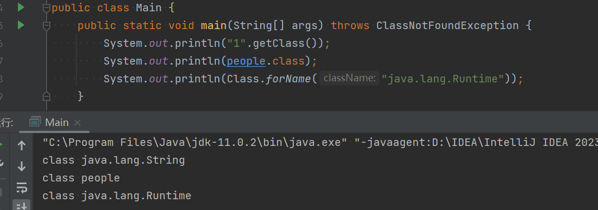
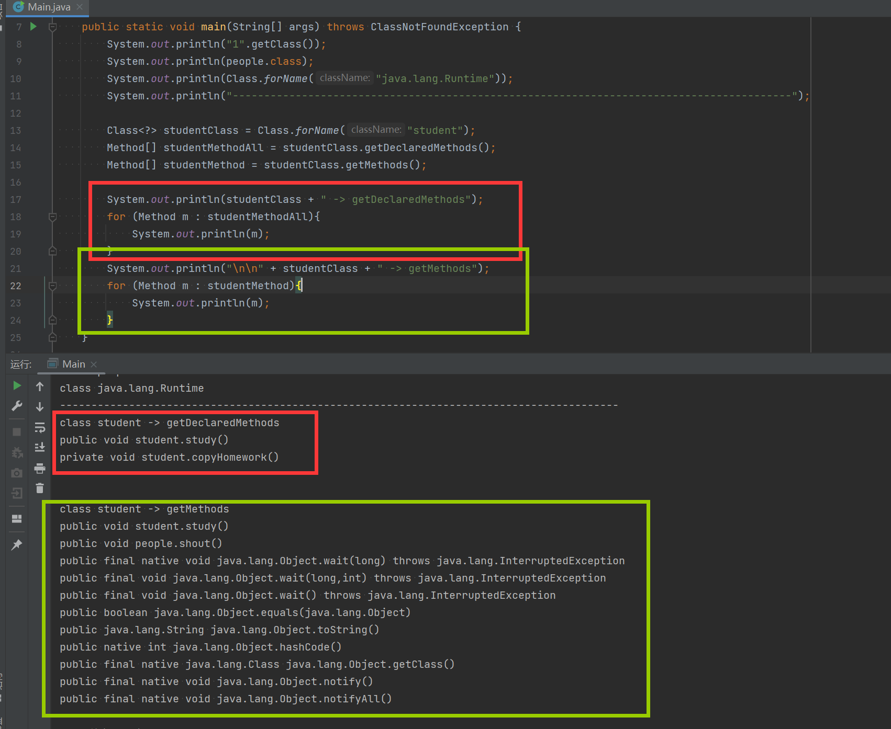
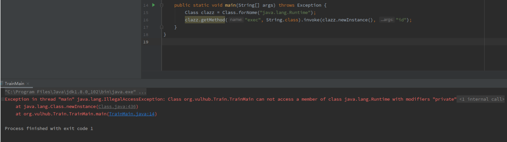

### 命令执行

最基本的 java中的命令执行

```Java
import java.io.IOException;

public class Calc {
    //当前执行命令无回显
    public static void main(String[] args) throws IOException {
        Runtime.getRuntime().exec("calc.exe");
    }
}
```

>`Runtime`类表示运行时环境，并提供与运行时环境交互的方法：
>
>1. `exec(String command)`: 用于在系统的命令行执行指定的命令。
>2. `exec(String[] cmdarray)`: 用于在系统的命令行执行指定的命令，参数作为字符串数组传递。
>3. `exec(String command, String[] envp)`: 用于在系统的命令行执行指定的命令，并指定环境变量。
>4. `exec(String[] cmdarray, String[] envp)`: 用于在系统的命令行执行指定的命令，参数作为字符串数组传递，并指定环境变量。
>5. `exit(int status)`: 用于终止当前 Java 虚拟机。
>6. `freeMemory()`: 该方法用于返回Java虚拟机中的空闲内存量，以字节为单位。
>7. `maxMemory()`: 该方法用于返回Java虚拟机试图使用的最大内存量。
>8. `totalMemory()`: 该方法用于返回Java虚拟机中的内存总量。
>9. `availableProcessors()` : 返回虚拟机的处理器数量
>
>`Runtime`无法直接new 所以使用这个创建对象：`Runtime runtime = Runtime.getRuntime();`
>
>其中，最常用的方法是 `exec()` 方法，它允许你在 Java 程序中执行外部命令，`exec()`方法返回一个 `Process` 对象
>
>`Process` 类提供了以下方法来与子进程交互：
>
>1. `InputStream getInputStream()`: 获取子进程的标准输出流。
>2. `InputStream getErrorStream()`: 获取子进程的错误输出流。
>3. `OutputStream getOutputStream()`: 获取子进程的标准输入流。
>4. `int waitFor()`: 等待子进程执行完成并返回子进程的退出值。
>5. `int exitValue()`: 获取子进程的退出值（仅在子进程执行完成后才可调用）。

如果需要回显要用IO流将命令执行后的字节加载出来，然后最基本的按行读取，就可以了。

在进行网站开发入JSP的时候，我们使用的JSP一句话木马也是根据这个原理进行编写的。

```Java
import java.io.IOException;
import java.io.BufferedReader;
import java.io.InputStream;
import java.io.InputStreamReader;

public class Main {
    public static void main(String[] args) throws IOException {
        Process p = Runtime.getRuntime().exec("whoami");
        InputStream is = p.getInputStream();
        InputStreamReader isr = new InputStreamReader(is, "GBK");
        BufferedReader ibr = new BufferedReader(isr);
        StringBuilder sb = new StringBuilder();
        String line = null;
        while((line = ibr.readLine()) != null){
            sb.append(line);
            System.out.println(line);
        }
        is.close();
        isr.close();
        ibr.close();
        is = null;
        isr = null;
        ibr = null;
    }
}
```

>四个模块：
>
>1. `java.io.IOException`: 这是 Java 的输入输出操作中最常见的异常类。它表示在进行输入和输出操作时可能出现的错误情况，例如文件不存在、权限问题、设备错误等。当执行输入输出操作时，如果发生异常，就可以通过捕获 `IOException` 异常来处理这些错误情况。
>2. `java.io.InputStream`: 这是一个字节输入流类，它是所有输入流的抽象基类。`InputStream` 用于从输入源（例如文件、网络连接、字节数组等）读取字节数据。它提供了 `read()` 方法用于读取单个字节，以及其他相关的方法用于读取多个字节数据。
>3. `java.io.InputStreamReader`: 这是一个字符输入流类，它是 `Reader` 类的子类。`InputStreamReader` 可以将字节输入流（`InputStream`）转换为字符输入流，从而可以方便地读取文本数据。它提供了和 `Reader` 类相似的方法，例如 `read()` 方法用于读取单个字符。
>4. `java.io.BufferedReader`: 这是一个字符缓冲输入流类，它继承自 `Reader` 类。`BufferedReader` 可以从字符输入流中读取文本数据，并以缓冲方式提高读取效率。它提供了 `readLine()` 方法用于逐行读取文本数据，常用于读取文本文件内容等场景。
>5. `StringBuilder` 是一个可变的字符串类，用于构建和修改字符串。用于处理大量字符串拼接和修改操作，避免频繁创建新的字符串对象，提高字符串处理性能。
>
>这些模块常常一起使用，例如在读取文本文件的场景中，可以使用 `FileInputStream`（字节输入流）读取文件的字节数据，然后通过 `InputStreamReader` 将字节数据转换为字符数据，最后再使用 `BufferedReader` 逐行读取字符数据。通过这种方式，可以高效地读取文本文件的内容，并处理可能出现的异常情况。

在不同的操作系统下，执行的命令的方式也是不一样的

#### Windows下

Windows下一班都会用`cmd`或者`powershell`去执行命令，但是powershell一般默认会限制执行策略，所以一般用`cmd`

```Java
String[] payload = {"cmd", "/c", "dir"};
Process p = Runtime.getRuntime().exec(payload);
```

#### Linux下

Linux一般使用`bash`执行命令，通常情况下是会有的，但是有的情况，可能没有bash，我们就可以使用`sh`来进行替代

```
String [] payload={"/bin/sh","-c","ls"}; 
Process p = Runtime.getRuntime().exec(payload);
```

>以下是一些常见 Shell 的二进制文件和对应的命令执行方式：
>
>1. Bash：
>   - 二进制文件路径：/bin/bash
>   - 命令执行方式：直接在终端中输入命令。
>2. Zsh：
>   - 二进制文件路径：/bin/zsh
>   - 命令执行方式：直接在终端中输入命令。
>3. Fish：
>   - 二进制文件路径：/usr/bin/fish
>   - 命令执行方式：在终端中使用 `fish -c 'command'` 的方式执行命令。
>4. Sh 或 Dash：
>   - 二进制文件路径：/bin/sh 或 /bin/dash（取决于系统配置）
>   - 命令执行方式：在终端中使用 `sh -c 'command'` 或 `dash -c 'command'` 的方式执行命令。

根据不同主机进行甄别：使用`getProperty`函数获取操作系统的名称

```Java
// System.getProperty("os.name");
System.out.println("操作系统：" + System.getProperty("os.name"));
// 操作系统：Windows 10
```

完整payload：

```Java
import java.io.IOException;
import java.io.BufferedReader;
import java.io.InputStream;
import java.io.InputStreamReader;

public class Main {
    public static void main(String[] args) throws IOException {
        String sys = System.getProperty("os.name");
        String[] payload = null;
        System.out.println("操作系统：" + sys);
        if (sys.contains("Window")){
            String[] payloadCmd = {"cmd", "/c", "dir"};
            payload = payloadCmd.clone();
        }else{
            String[] payloadSh = {"/bin/sh", "-c", "ls"};
            payload = payloadSh.clone();
        }

        Process p = Runtime.getRuntime().exec(payload);
        InputStream is = p.getInputStream();
        InputStreamReader isr = new InputStreamReader(is, "GBK");
        BufferedReader ibr = new BufferedReader(isr);
        StringBuilder sb = new StringBuilder();
        String line = null;
        while((line = ibr.readLine()) != null){
            sb.append(line);
            System.out.println(line);
        }
        is.close();
        isr.close();
        ibr.close();
        is = null;
        isr = null;
        ibr = null;
    }
}
```

### 反射

[Java 类的初始化顺序 - 知乎 (zhihu.com)](https://zhuanlan.zhihu.com/p/122554857)

Java有四个基本特征：封装，继承，多态，抽象

Java的反射（reflection）机制是指在程序的运行状态中，可以构造任意一个类的对象，可以了解任意一个对象所属的类，可以了解任意一个类的成员变量和方法，可以调用任意一个对象的属性和方法。本质上其实就是动态的生成类似于上述的字节码，加载到jvm中运行

1. Java反射机制的核心是在程序运行时动态加载类并获取类的详细信息，从而操作类或对象的属性和方法。
2. Java属于先编译再运行的语言，程序中对象的类型在编译期就确定下来了，而当程序在运行时可能需要动态加载某些类，这些类因为之前用不到，所以没有被加载到JVM。通过反射，可以在运行时动态地创建对象并调用其属性，不需要提前在编译期知道运行的对象是谁。
3. 反射调用方法时，会忽略权限检查，可以无视权限修改对应的值，因此容易导致安全性问题，（对安全研究人员来说提供了不小的帮助，hhhh）

这样⼀段代码，在你不知道传⼊的参数值 的时候，你是不知道他的作⽤是什么的：

```Java
public void execute(String className, String methodName) throws Exception {
    Class clazz = Class.forName(className);
 	clazz.getMethod(methodName).invoke(clazz.newInstance());
}
```

- 获取类的⽅法： `forName` 
- 实例化类对象的⽅法： `newInstance` 
- 获取函数的⽅法： `getMethod` 
- 执⾏函数的⽅法： `invoke`

#### 反射机制原理

反射机制的原理基础是理解Class类，类是java.lang.Class类的实例对象，而Class是所有的类的类。对于普通的对象，我们在创建实例的时候通常采用如下方法：

```java
Demo test = new Demo();
```

那么我们在创建class类的实例对象时是否可以同样用上面的方法创建呢

```java
Class c = new Class()；
```

答案是不行的，所以我们查看一下Class的源码，发现他的构造器是私有的，这意味着只有JVM可以创建Class的对象。


反射机制原理就是把Java类中的各种成分映射成一个个的Java对象，所以我们可以在运行时调用类中的所有成员（变量、方法）。下图是反射机制中类的加载过程：


#### 反射机制操作


> [通俗易懂的双亲委派机制_IT烂笔头的博客-CSDN博客](https://blog.csdn.net/codeyanbao/article/details/82875064)
>
> 1. 如果一个类加载器收到了类加载请求，它并不会自己先加载，而是把这个请求委托给父类的加载器去执行
> 2. 如果父类加载器还存在其父类加载器，则进一步向上委托，依次递归，请求最终将到达顶层的引导类加载器；
>
> 3. 如果父类加载器可以完成类加载任务，就成功返回，倘若父类加载器无法完成加载任务，子加载器才会尝试自己去加载，这就是双亲委派机制
>
> 4. 父类加载器一层一层往下分配任务，如果子类加载器能加载，则加载此类，如果将加载任务分配至系统类加载器也无法加载此类，则抛出异常
>    

##### 获取Class对象

有三种方式获得一个Class对象

1. 通过调用一个普通的其他类的`getClass()`方法获得Class对象
2. 任何数据类型（包括基本数据类型）都有一个“静态”的Class属性，所以直接调用.class属性获得Class对象
3. 调用Class类的forName方法，获得Class的对象



##### 获取成员方法Method

得到该类所有的方法，不包括父类的：
`public Method getDeclaredMethods() `

得到该类所有的public方法，包括父类的：
`public Method getMethods()`

>获取当前类指定的成员方法时，
>
>`Method method = class.getDeclaredMethod("方法名");`
>`Method[] method = class.getDeclaredMethod("方法名", 参数类型如String.class，多个参数用,号隔开);`



执行方法：`Process process = (Process) runtimeMethod.invoke(runtimeInstance, "calc");`

>###### `invoke()`方法
>
>`method.invoke(方法实例对象, 方法参数值，多个参数值用","隔开);`
>
>如果这个方法是一个普通方法，那么第一个参数是类对象，如果这个方法是一个静态方法，那么第一个参数是类。
>
>1. `invoke()`就是调用类中的方法，最简单的用法是可以把方法参数化`invoke(class, args)`
>    这里则是使用了` class.invoke(method,“参数”)`的一个方式
>2. 还可以把方法名存进数组`v[]`,然后循环里`invoke(test,v[i])`,就顺序调用了全部方法

##### 获取构造函数Constructor

获得该类所有的构造器，不包括其父类的构造器
`public Constructor<T> getDeclaredConstructors() `

获得该类所有public构造器，包括父类
`public Constructor<T> getConstructors() `

>###### `newInstance()`方法
>
>`class.newInstance()`的作用就是调用这个类的无参构造函数，这个比较好理解。不过，我们有时候 在写漏洞利用方法的时候，会发现使用`newInstance`总是不成功，这时候原因可能是：
>
>1.  你使用的类没有无参构造函数 
>2.  你使用的类构造函数是私有的
>
>最最最常见的情况就是`java.lang.Runtime`，这个类在我们构造命令执行Payload的时候很常见，但 我们不能直接这样来执行命令：
>
>```
>Class clazz = Class.forName("java.lang.Runtime");
>clazz.getMethod("exec", String.class).invoke(clazz.newInstance(), "id");
>```
>
>你会得到这样一个错误：
>
>
>
> 原因是 Runtime 类的构造方法是私有的。
>
>原因是`Runtime`类的构造方法是私有的。 有同学就比较好奇，为什么会有类的构造方法是私有的，难道他不想让用户使用这个类吗？这其实涉及 到很常见的设计模式：“单例模式”。（有时候工厂模式也会写成类似） 比如，对于Web应用来说，数据库连接只需要建立一次，而不是每次用到数据库的时候再新建立一个连 接，此时作为开发者你就可以将数据库连接使用的类的构造函数设置为私有，然后编写一个静态方法来 获取：
>
>```
>public class TrainDB {
>private static TrainDB instance = new TrainDB();
>public static TrainDB getInstance() {
>return instance;
>}
>private TrainDB() {
>// 建立连接的代码...
>}
>}
>```
>
>这样，只有类初始化的时候会执行一次构造函数，后面只能通过`getInstance`获取这个对象，避免建 立多个数据库连接。 回到正题，`Runtime`类就是单例模式，我们只能通过`Runtime.getRuntime()`来获取到`Runtime`对 象。我们将上述Payload进行修改即可正常执行命令了：
>
>```
>Class clazz = Class.forName("java.lang.Runtime");
>clazz.getMethod("exec", String.class).invoke(clazz.getMethod("getRuntime").invoke(clazz), "calc.exe");
>```
>
>
>
>```
>Class clazz = Class.forName("java.lang.ProcessBuilder");
>((ProcessBuilder)clazz.getConstructor(List.class).newInstance(Arrays.asList("calc.exe"))).start();
>```
>
>ProcessBuilder有两个构造函数：
>
>`public ProcessBuilder(List command)`
>`public ProcessBuilder(String... command)`
>
>我上面用到了第一个形式的构造函数，所以我在`getConstructor`的时候传入的是`List.class`。 但是，我们看到，前面这个Payload用到了Java里的强制类型转换，有时候我们利用漏洞的时候（在表 达式上下文中）是没有这种语法的。所以，我们仍需利用反射来完成这一步。 
>
>```Java
>Class clazz = Class.forName("java.lang.ProcessBuilder");
>clazz.getMethod("start").invoke(clazz.getConstructor(List.class).newInstance(Arrays.asList("calc.exe")));
>```
>
>通过`getMethod("start")`获取到`start`方法，然后`invoke`执行，`invoke`的第一个参数就是 ProcessBuilder Object了。
>
>那么，如果我们要使用`public ProcessBuilder(String... command)`这个构造函数，需要怎样用反 射执行呢？
>
>这又涉及到Java里的可变长参数（varargs）了。正如其他语言一样，Java也支持可变长参数，就是当你 定义函数的时候不确定参数数量的时候，可以使用 ... 这样的语法来表示“这个函数的参数个数是可变 的”。
>
>对于可变长参数，Java其实在编译的时候会编译成一个数组，也就是说，如下这两种写法在底层是等价的（也就不能重载）：
>
>```
>public void hello(String[] names) {}
>public void hello(String...names) {}
>```
>
>也由此，如果我们有一个数组，想传给hello函数，只需直接传即可：
>
>```
>String[] names = {"hello", "world"};
>hello(names);
>```
>
>那么对于反射来说，如果要获取的目标函数里包含可变长参数，其实我们认为它是数组就行了。
>
> 所以，我们将字符串数组的类`String[].class`传给`getConstructor`，获取`ProcessBuilder`的第二构造函数：
>
>```Java
>Class clazz = Class.forName("java.lang.ProcessBuilder");
>clazz.getConstructor(String[].class)
>```
>
>在调用 newInstance 的时候，因为这个函数本身接收的是一个可变长参数，我们传给 ProcessBuilder 的也是一个可变长参数，二者叠加为一个二维数组，所以整个Payload如下：
>
>```Java
>Class clazz = Class.forName("java.lang.ProcessBuilder");
>((ProcessBuilder)clazz.getConstructor(String[].class).newInstance(new String[][]{{"calc.exe"}})).start();
>```
>
>按反射来写的话就是：
>
>```java
>Class<?> clazz = Class.forName("java.lang.ProcessBuilder");     clazz.getMethod("start").invoke(clazz.getConstructor(String[].class).newInstance(new String[][]{{"calc.exe"}}));
>```
>
>```Java
>clazz.getMethod("start").invoke(clazz.getConstructor(String[].class).newInstance((Object[]) new String[]{"calc.exe"}));
>clazz.getMethod("start").invoke(clazz.getConstructor(String[].class).newInstance(new String[][]{{"calc.exe"}}));
>// 以上两种形式都能够运行，但是下面的格式就不能运行
>clazz.getMethod("start").invoke(clazz.getConstructor(String[].class).newInstance(new String[]{"calc.exe"}));
>/*
>报错信息为
>Exception in thread "main" java.lang.IllegalArgumentException: argument type mismatch
>at java.base/jdk.internal.reflect.NativeConstructorAccessorImpl.newInstance0(Native Method)
>at java.base/jdk.internal.reflect.NativeConstructorAccessorImpl.newInstance(NativeConstructorAccessorImpl.java:62)
>at java.base/jdk.internal.reflect.DelegatingConstructorAccessorImpl.newInstance(DelegatingConstructorAccessorImpl.java:45)
>at java.base/java.lang.reflect.Constructor.newInstance(Constructor.java:490)
>at Main.main(Main.java:115)
>*/
>```
>
>原因：
>
>这个问题是因为Java的反射API在处理数组类型参数时的特性。
>
>在Java中，数组也是对象，`String[]`和`String[][]`是两种不同的类型，不能互相转换。`String[]`是字符串数组，`String[][]`是字符串数组的数组（也可以理解为二维数组）。
>
>在代码中，`clazz.getConstructor(String[].class)`是寻找一个接受字符串数组作为参数的构造函数。因此，你需要传递一个字符串数组的实例给`newInstance()`方法。
>
>在你的第一段代码中，你创建了一个字符串数组`new String[]{"calc.exe"}`，并将其转换为`Object[]`，这是正确的，因此代码可以运行。
>
>在你的第二段代码中，你创建了一个字符串数组的数组`new String[][]{{"calc.exe"}}`，然后直接传递给`newInstance()`方法。这也是正确的，因为`newInstance()`方法接受的是一个`Object...`类型的参数，这意味着它可以接受任何数量和类型的参数。在这种情况下，你的字符串数组的数组被视为一个单独的参数，因此代码可以运行。
>
>然而，在你的第三段代码中，你创建了一个字符串数组`new String[]{"calc.exe"}`，然后直接传递给`newInstance()`方法。这是错误的，因为`newInstance()`方法期望一个字符串数组的实例，而你提供的是一个字符串数组。这就像尝试将一个`String[]`类型的对象传递给一个期望`String[][]`类型的参数，显然是不匹配的，因此你得到了`IllegalArgumentException: argument type mismatch`的错误。
>
>更详细地解释一下。
>
>在Java中，方法和构造函数的参数都是静态的，也就是说，它们在编译时就已经确定了。当你使用反射API来调用一个方法或构造函数时，你需要提供一个与原始参数类型完全匹配的参数列表。
>
>当你调用`clazz.getConstructor(String[].class)`时，你正在寻找一个接受单个参数的构造函数，这个参数的类型是`String[]`。这意味着，当你调用`newInstance()`方法时，你需要提供一个`Object[]`，这个数组包含一个`String[]`对象。
>
>在你的第一段代码中：
>
>```java
>clazz.getMethod("start").invoke(clazz.getConstructor(String[].class).newInstance((Object[]) new String[]{"calc.exe"}));
>```
>
>你创建了一个字符串数组`new String[]{"calc.exe"}`，然后将其转换为`Object[]`。这是正确的，因为`newInstance()`方法期望一个`Object[]`，这个数组包含一个`String[]`对象。因此，这段代码可以正确运行。
>
>然而，在你的第三段代码中：
>
>```java
>clazz.getMethod("start").invoke(clazz.getConstructor(String[].class).newInstance(new String[]{"calc.exe"}));
>```
>
>你创建了一个字符串数组`new String[]{"calc.exe"}`，然后直接传递给`newInstance()`方法。这是错误的，因为`newInstance()`方法期望一个`Object[]`，这个数组包含一个`String[]`对象，而你提供的是一个`String[]`对象。这就像尝试将一个`String[]`类型的对象传递给一个期望`Object[]`类型的参数，显然是不匹配的，因此你得到了`IllegalArgumentException: argument type mismatch`的错误。
>
>为了解决这个问题，你需要将你的字符串数组包装在一个`Object[]`里，就像你在第一段代码中那样。这样，你就可以正确地调用`newInstance()`方法，而不会得到任何错误。
>
>希望这个解释能够帮助你理解这个问题。如果你还有任何疑问，欢迎继续提问。
>
>((ProcessBuilder)clazz.getConstructor(String[].class).newInstance(new String[][]{{"calc.exe"}})).start();有佬知道为什么newinstance接受的是二维数组么
>这个问题解释：
>因为newInstance接受一个可变长参数也就是接受一个数组，你传进去的二维数组字符串数组的数组被视为一个单独的参数，举例就是传进去两个int参数1,2的话到nerInstance函数里面也会被编译成被一个Object数组包围的两个int类型参数，new Object[]{1, 2}，穿进去的二维数组外面这层被当做Object数组了，里面包围着字符串数组参数


>###### `getDeclaredConstructor()` 方法的语法如下：
>
>`public Constructor<T> getDeclaredConstructor(Class<?>... parameterTypes) throws NoSuchMethodException`
>
>- `parameterTypes` 是一个可变参数列表，用于指定构造函数的参数类型。如果构造函数有参数，需要指定参数类型，如果没有参数，可以不传入该参数。
>- `T` 是构造函数所在类的类型。
>
>```Java
>Class<?> stuClass = Class.forName("student");
>//带有参数的构造函数
>Constructor<?> stuConstr = stuClass.getDeclaredConstructor(String.class, int.class);
>Object stuIns = stuConstr.newInstance("小王", 1);
>//无参构造函数
>Constructor<?> noStuConstr = stuClass.getDeclaredConstructor();
>Object noStuIns = noStuConstr.newInstance();
>```
>


`getDeclaredConstructor()`可以获得构造方法，也可以获得我们常用的`private`方法，其中`Runtime`的构造方法是`private`，我们无法直接调用，我们需要使用反射去修改方法的访问权限（使用`setAccessible`，修改为 true），再通过获取的构造器进行实例化对象

```Java
Class<?> runtimeClass = Class.forName("java.lang.Runtime");
Constructor constructor = runtimeClass.getDeclaredConstructor();
System.out.println(constructor);
constructor.setAccessible(true);
// Object类是所有类的父类，有兴趣的同学可以在双亲委派机制中去搞明白
Object runtimeInstance = constructor.newInstance();
//这里的话就等价于 Runtime rt = new Runtime();
```

##### 获取成员变量Field

获得该类自身声明的所有变量，不包括其父类的变量
`public Field getDeclaredFields() `

获得该类自所有的public成员变量，包括其父类变量
`public Field getFields()`

```Java
 // 获取类中的成员变量
 Field[] steFies = stuClass.getDeclaredFields();
 // 获取类中制定的成员变量
 Field stuFie = stuClass.getDeclaredField("id");
 // 设置成员变量为可访问状态
 stuFie.setAccessible(true);
 // 获取成员变量的值
 Object stuId = stuFie.get(stuIns);
 System.out.println(stuId);
 // 修改成员变量的值
 stuFie.set(stuIns, 2);
 Object stuIdNew = stuFie.get(stuIns);
 System.out.println(stuIdNew);
```


上述的完整Payload:

```Java
import java.io.IOException;
import java.io.BufferedReader;
import java.io.InputStream;
import java.io.InputStreamReader;
import java.lang.reflect.Constructor;
import java.lang.reflect.Field;
import java.lang.reflect.InvocationTargetException;
import java.lang.reflect.Method;

public class Main {
    public static void main(String[] args) throws ClassNotFoundException {
        System.out.println("1".getClass());
        System.out.println(people.class);
        System.out.println(Class.forName("java.lang.Runtime"));
        System.out.println("\n\n---------------------------------------------------------------------------------\n\n");

        Class<?> studentClass = Class.forName("student");
        Method[] studentMethodAll = studentClass.getDeclaredMethods();
        Method[] studentMethod = studentClass.getMethods();

        System.out.println(studentClass + " -> getDeclaredMethods");
        for (Method m : studentMethodAll) {
            System.out.println(m);
        }
        System.out.println("\n" + studentClass + " -> getMethods");
        for (Method m : studentMethod) {
            System.out.println(m);
        }
        System.out.println("\n\n---------------------------------------------------------------------------------\n\n");

        Constructor[] studentConstructorAll = studentClass.getDeclaredConstructors();
        Constructor[] studentConstructor = studentClass.getConstructors();
        System.out.println(studentClass + " -> getDeclaredConstructors");
        for (Constructor m : studentConstructorAll) {
            System.out.println(m);
        }
        System.out.println("\n" + studentClass + " -> getConstructors");
        for (Constructor m : studentConstructor) {
            System.out.println(m);
        }
        System.out.println("\n\n---------------------------------------------------------------------------------\n\n");

        Field[] studentFieldAll = studentClass.getDeclaredFields();
        Field[] studentField = studentClass.getFields();
        System.out.println(studentClass + " -> getDeclaredFields");
        for (Field m : studentFieldAll) {
            System.out.println(m);
        }
        System.out.println("\n" + studentClass + " -> getFields");
        for (Field m : studentField) {
            System.out.println(m);
        }
        System.out.println("\n\n---------------------------------------------------------------------------------\n\n");

        try{
            Class<?> runtimeClass = Class.forName("java.lang.Runtime");
            Constructor constructor = runtimeClass.getDeclaredConstructor();
            System.out.println(constructor);
            constructor.setAccessible(true);
            // Object类是所有类的父类，有兴趣的同学可以在双亲委派机制中去搞明白
            Object runtimeInstance = constructor.newInstance();
            //这里的话就等价于 Runtime rt = new Runtime();
            // 使用 Runtime 实例调用方法
            Method execMethod = runtimeClass.getDeclaredMethod("exec", String.class);
            Process result = (Process)execMethod.invoke(runtimeInstance, "calc.exe");

            String[] payload = {"cmd", "/c", "dir"};
            Method runtimeMethod = runtimeClass.getMethod("exec", String[].class);
            Process process = (Process) runtimeMethod.invoke(runtimeInstance, (Object) payload);

            InputStream inputStream = process.getInputStream();
            InputStreamReader inputStreamReader =  new InputStreamReader(inputStream, "GBK");
            BufferedReader inputBufferedReader = new BufferedReader(inputStreamReader);
            String line = null;
            while ((line = inputBufferedReader.readLine()) != null) {
                System.out.println(line);
            }
            inputBufferedReader.close();
            inputStreamReader.close();
            inputStream.close();

            // 获取成员变量
            Class<?> stuClass = Class.forName("student");
            // 带有参数的构造函数
            Constructor<?> stuConstr = stuClass.getDeclaredConstructor(String.class, int.class);
            Object stuIns = stuConstr.newInstance("小王", 1);
            // 无参构造函数
            Constructor<?> noStuConstr = stuClass.getDeclaredConstructor();
            Object noStuIns = noStuConstr.newInstance();

            // 获取类中的成员变量
            Field[] steFies = stuClass.getDeclaredFields();
            // 获取类中制定的成员变量
            Field stuFie = stuClass.getDeclaredField("id");
            // 设置成员变量为可访问状态
            stuFie.setAccessible(true);
            // 获取成员变量的值
            Object stuId = stuFie.get(stuIns);
            System.out.println(stuId);
            // 修改成员变量的值
            stuFie.set(stuIns, 2);
            Object stuIdNew = stuFie.get(stuIns);
            System.out.println(stuIdNew);

        }catch (NoSuchMethodException | InvocationTargetException | InstantiationException | IllegalAccessException |
                IOException | NoSuchFieldException e) {
            throw new RuntimeException(e);
        }

    }
    public void execute(String className, String methodName) throws Exception {
        Class<?> clazz = Class.forName(className);
        clazz.getMethod(methodName).invoke(clazz.newInstance());
    }
}

class people {
    public String name = null;

    public people(){}

    public people(String name){
        this.name = name;
    }

    public void shout(){
        System.out.println(this.name+": 啊啊啊啊啊啊啊啊啊啊啊！！");
    }
}

class student extends people{

    private int id;
    public int num;

    public student(){
        System.out.println("无参构造");
    }

    private student(String name){
        System.out.println("私有构造：" + name);
    }
    public student(String name, int id) {
        super(name);
        this.id = id;
        System.out.println("正常构造");
    }

    private void copyHomework(){
        System.out.println("抄抄抄！！");
    }

    public void study(){
        System.out.println("学学学！！");
    }
}
```

### 反序列化