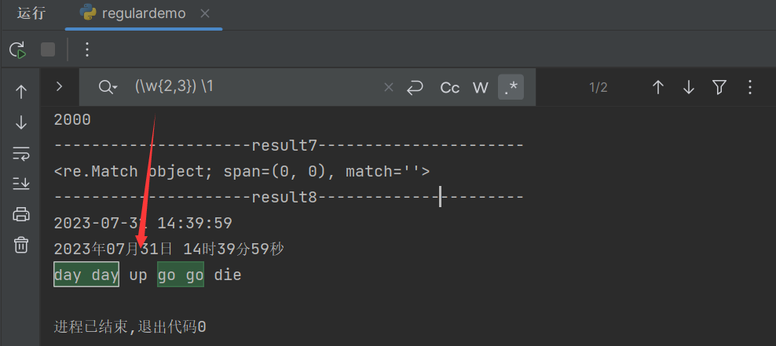
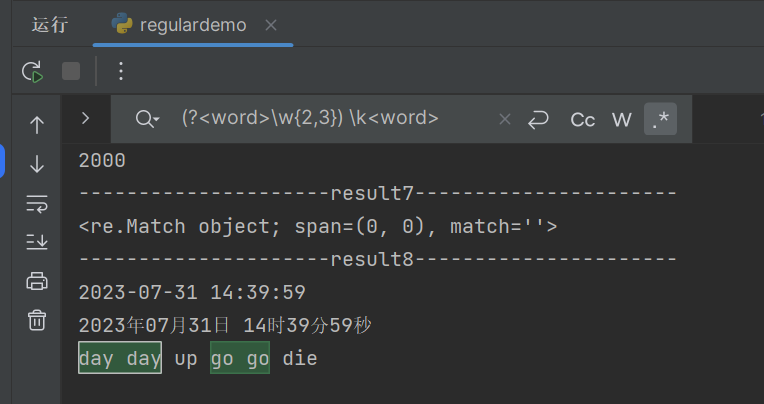

[TOC]

#### 捕获组

使用小括号指定一个子表达式后，匹配这个子表达式的文本(也就是此分组捕获的内容)可以在表达式或其它程序中作进一步的处理。默认情况下，每个捕获组会自动拥有一个组号，规则是：从左向右，以分组的左括号为标志，第一个出现的分组的组号为1，第二个为2，以此类推。  也可以自己指定子表达式的组名。这样在表达式或程序中可以直接引用组名，当然也可以继续使用组号。但如果正则表达式中同时存在普通捕获组和命名捕获组，那么捕获组的编号就要特别注意，编号的规则是先对普通捕获组进行编号，再对命名捕获组进行编号。详细语法如下：

`(pattern)`：匹配pattern并捕获结果，自动设置组号。

```undefined
(abc)+d :  匹配到abcd或者abcabcd
```

`(?<name>pattern)`或`(?'name'pattern)`：匹配pattern并捕获结果，设置name为组名。

 `\num`：对捕获组的反向引用。其中 num 是一个正整数。

```undefined
(\w)(\w)\2\1: 匹配到abba
```

`\k<name>`或`\k'name'`：对命名捕获组的反向引用。其中 name 是捕获组名。

```csharp
(?<group>\w)abc\k<group>  : 匹配到xabcx
```

1. `(?:pattern)` 非捕获组（Non-capturing Group）
   `?:` 是用于创建非捕获组的语法，用于指定一个子表达式，但不将其捕获为匹配结果中的一个分组。它的语法是 `(?:...)`，其中 `...` 是一个子表达式。

   示例：`(?:foo)+` 匹配一个或多个连续出现的 `foo`，但不会捕获每个 `foo` 作为匹配结果中的一个分组。

2. `(?=pattern)` ：零宽度正向预查（正向零宽断言）
   `?=` 是一个正向预查，用于指定一个必须满足的条件，但不捕获实际匹配的内容。它的语法是 `(?=...)`，其中 `...` 是一个正则表达式，表示需要满足的条件。当 `?=` 后面的内容满足 `...` 的条件时，整个表达式才算匹配，但最终匹配结果并不包含 `?=` 后面的内容，也并不会“消耗”或匹配该模式，只是确认它存在。

   示例：`foo(?=bar)` 匹配 `foo`，但只有当其后紧跟着 `bar` 时才是有效的匹配。

3. `(?!pattern)`：零宽度负向预查（负向零宽断言）

   `?!` 是一个负向预查，用于指定一个条件，表示该条件在当前位置不应该出现。它的语法是 `(?!...)`，其中 `...` 是一个正则表达式，表示需要满足的条件。当 `?!` 后面的内容不满足 `...` 的条件时，整个表达式才算匹配。

   示例：`foo(?!bar)` 匹配 `foo`，但只有当其后不紧跟着 `bar` 时才是有效的匹配。

4. `(?<=pattern)`: 零宽度正向回查（也称为正向零宽断言）。

   这个断言会查找前面是`pattern`的地方。例如，`(?<=a)b`会匹配所有前面是`a`的`b`。在字符串`abc`中，`b`会被匹配，因为它前面是`a`。但是，这个断言并不会“消耗”或匹配`a`，所以如果你对整个字符串进行匹配，只有`b`会被返回，而不是`ab`。

   注意，正向回查中的`pattern`必须是固定长度的。也就是说，你不能在`pattern`中使用`*`或`+`这样的量词。

5. `(?<!pattern)`: 零宽度负向回查（也称为负向零宽断言）。

   这个断言会查找前面不是`pattern`的地方。例如，`(?<!a)b`会匹配所有前面不是`a`的`b`。在字符串`abc`中，`b`不会被匹配，因为它前面是`a`。但是，在字符串`dbc`中，`b`会被匹配，因为它前面是`d`，不是`a`。

   同样，负向回查中的`pattern`必须是固定长度的。

#### 分组引用

上面讲完了分组，我们来看下如何来引用分组，大部分语言都是用 **反斜杠 + 编号** 的方式，个别的比如 JavaScript语言，使用的是 **美元符号 + 编号** 的方式：

|  编程语言  | 查找时引用方式 | 替换时引用方式 |
| :--------: | :------------: | :------------: |
|   Python   | \number 如 \1  | \number 如 \1  |
|     Go     |  官方包不支持  |  官方包不支持  |
|    Java    | \number 如 \1  | $number 如 $1  |
| JavaScript | $number 如 $1  | $number 如 $1  |
|    PHP     | \number 如 \1  | \number 如 \1  |
|    Ruby    | \number 如 \1  | \number 如 \1  |

在一个目标字符串中，查找两个重复出现的单词：




利用分组引用替换时间demo:

```python
print("result8".center(50, '-'))
test_str = datetime.now().strftime('%Y-%m-%d %H:%M:%S')
print(test_str)
regex = r"(\d{4})-(\d{2})-(\d{2}) (\d{2}):(\d{2}):(\d{2})"
subst = r"\1年\2月\3日 \4时\5分\6秒"
result8 = re.sub(regex, subst, test_str)
print(result8)
# 2023-07-31 14:39:59
# 2023年07月31日 14时39分59秒
```